# Android Forensics Analysis

## Evidence Extraction

Smartphones have become an essential tool across all sectors of modern society: from regular consumers to high-ranking government officials and the business sector.

Smartphones are well known for their versatility. In a single day, a smartphone can function as:

- A wallet
- A barcode reader
- A satellite navigation system
- An email or social media client
- A WiFi hotspot
- A telephone

Recently, smartphones have also been increasingly used as smart health sensors, allowing cardiac patients to safely remain at home while medical staff remotely monitor and supervise their heart conditions.

Mobile forensics refers to digital forensic analysis related to the recovery of data or digital evidence from mobile devices such as smartphones, tablets, and GPS devices.

It is important that this recovery process is performed under forensic conditions.

Several aspects must be considered during mobile forensic investigations:

- Data acquisition often requires collecting evidence from a powered-on device because hardware or software interfaces to access internal memory may intentionally be unavailable.
- External storage such as SD cards may contain valuable evidence and must also be acquired.
- Maintaining the Chain of Custody (CoC) and preserving integrity is difficult because many forensic tools require installing applications on the analyzed device.
- Mobile file systems usually cannot be mounted as read-only.
- Malware may detect analysis environments and destroy evidence.
- The acquisition process itself may alter evidence integrity, potentially affecting admissibility in court.

## Objectives

- Become aware of the difficulties involved in obtaining forensic evidence from Android devices.
- Learn how to extract forensic evidence from Android devices.

## Materials

- Android Studio
- VirtualBox
- SDK Platform Tools
- Andriller
- AFLogical OSE

## 1) Familiarization with Android

### **a) Install Android Studio**

Android Studio can be downloaded from the official website:

https://developer.android.com/studio

Installation on Debian/Ubuntu:

```bash
sudo apt update
sudo apt install openjdk-17-jdk -y
```

Download Android Studio:

```bash
wget https://redirector.gvt1.com/edgedl/android/studio/ide-zips/latest/android-studio-linux.tar.gz
```

Extract the package:

```bash
tar -xvf android-studio-linux.tar.gz
```


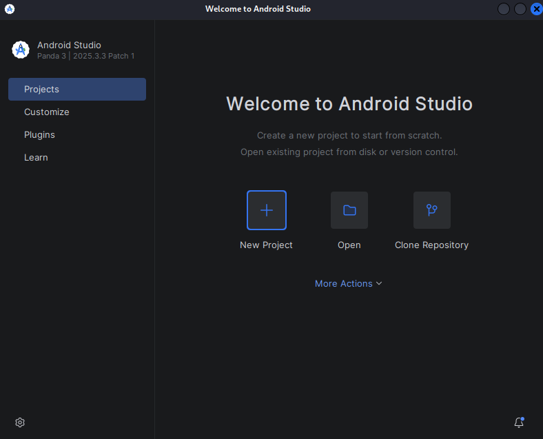

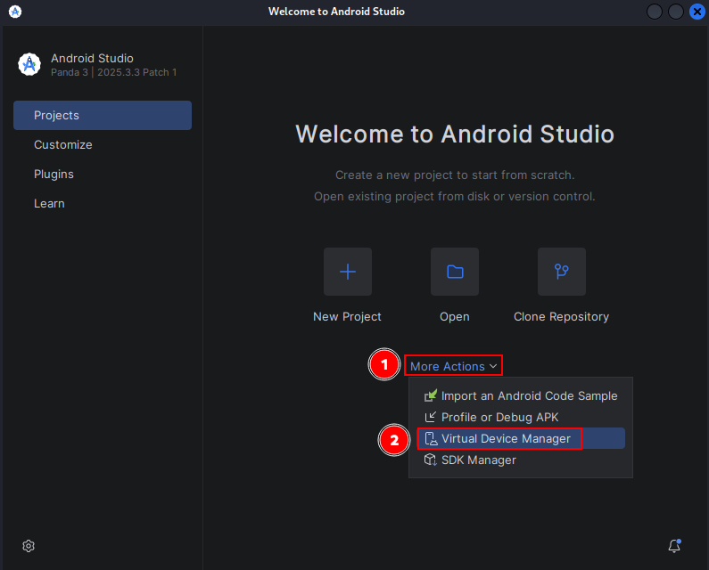

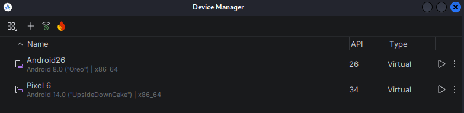


---

### **b) Run an Android Virtual Device (AVD)**

Once Android Studio is installed:

1. Create any project.
2. Open `Device Manager`.
3. Create a virtual device.
4. Select a Google Pixel image.
5. Download the Android system image.
6. Start the emulator using the Play button.

Alternative command-line execution:


To install the `.apk`, an emulator is required. Create an emulator using the following command:

```bash
avdmanager create avd -n Android26 -k "system-images;android-26;default;x86_64" -c 10M
```

Verify that the device has been installed correctly:

```bash
avdmanager list avd
```

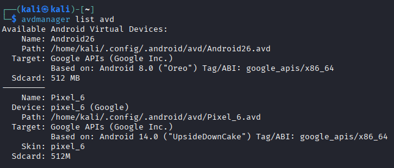

Start the emulator as follows:

```bash
emulator -avd Android26
```

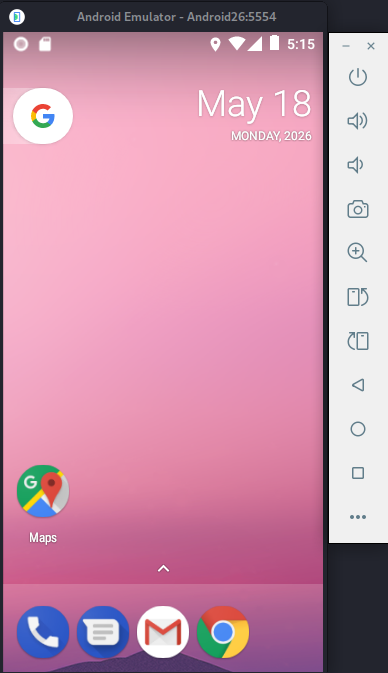

---

### **c) Install Android Debug Bridge (ADB Platform Tools)**

Installation on Debian/Ubuntu:

```bash
sudo apt update
sudo apt install adb fastboot -y
```

Verify installation:

```bash
adb version
```
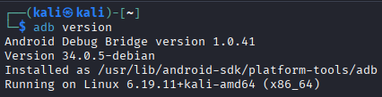


Start ADB server:

```bash
adb start-server
```

Stop ADB server:

```bash
adb kill-server
```

---

### **d) Enable debugging and practice ADB commands**

Inside the emulator:

1. Open `Settings`.
2. Go to `About phone`.
3. Tap `Build number` 7 times.
4. Developer options will be enabled.
5. Go to `Developer Options`.
6. Enable `USB debugging`.

#### ADB Commands

List devices:

```bash
adb devices
```

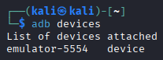

Open shell:

```bash
adb shell
```

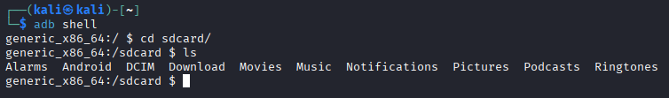

Restart ADB as root:

```bash
adb root
```

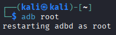

Pull files from device:

```bash
adb pull /sdcard/Download/
```

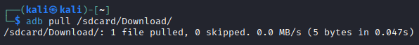

Push files to device:

```bash
echo hello > hello.txt
adb push hello.txt /sdcard/Download
```

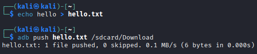

Reboot device:

```bash
adb reboot
```

Install APK:

```bash
adb install app.apk
```

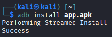

Uninstall application:

```bash
adb uninstall owasp.mstg.uncrackable2
```

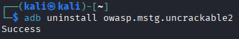

List installed packages:

```bash
adb shell pm list packages
```

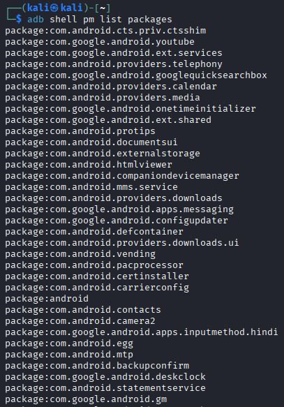

Capture screenshots:

```bash
adb exec-out screencap -p > screenshot.png
```

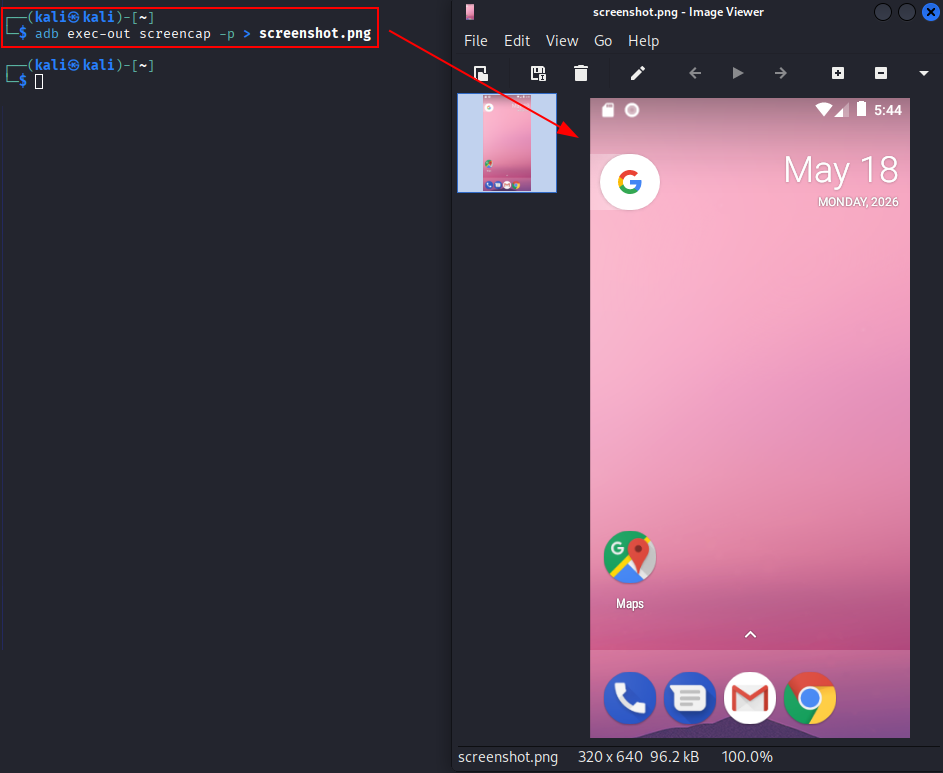

Record screen:

```bash
adb shell screenrecord /sdcard/demo.mp4
```

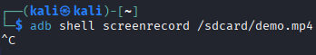

Pull recorded video:

```bash
adb pull /sdcard/demo.mp4
```

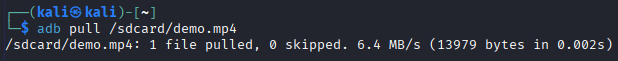

---

## 2) Android Virtualization Close to Real Conditions

### **a) Download Android x86**

Official website:

https://www.android-x86.org/

Download ISO using wget:

```bash
wget https://sourceforge.net/projects/android-x86/files/latest/download -O android-x86.iso
```

Verify ISO:

```bash
sha256sum android-x86.iso
```

---

### **b) Create a 32-bit Linux VM**

Recommended VirtualBox configuration:

- 2GB RAM
- 8GB Hard Disk
- 256MB Video Memory

Create VM using VBoxManage:

```bash
VBoxManage createvm --name AndroidVM --ostype Linux_64 --register
```

Create disk:

```bash
VBoxManage createmedium disk --filename AndroidVM.vdi --size 8192
```

Set RAM:

```bash
VBoxManage modifyvm AndroidVM --memory 2048 --vram 256
```

Attach disk:

```bash
VBoxManage storagectl AndroidVM --name "SATA Controller" --add sata
```

Attach ISO:

```bash
VBoxManage storageattach AndroidVM --storagectl "SATA Controller" --port 0 --device 0 --type dvddrive --medium android-x86.iso
```

---

### **c) Install Android in the VM**

Boot the VM and select:

```text
Installation - Install Android-x86 to harddisk
```

Create partitions.

Select filesystem:

```text
ext4
```

After installation:

Remove ISO from the VM.

Edit GRUB boot parameters:

Replace:

```text
quiet
```

With:

```text
nomodeset xforcevesa
```

Boot the system.

Configure Android normally.

Add Google account:

```text
Settings -> Accounts -> Add account
```

Enable synchronization:

```text
Automatically sync data
```

---

### **d) Install AFLogical OSE and perform forensic extraction**

Connect to the Android VM:

```bash
adb connect 10.206.8.1
```

Verify connection:

```bash
adb devices
```

Install AFLogical OSE:

```bash
adb install AFLogical-OSE_1.5.2.apk
```

Launch the application.

Select:

```text
Select All -> Capture
```

Evidence will be stored inside:

```text
/sdcard/forensics/
```

Extract evidence:

```bash
adb pull /sdcard/forensics/ .
```

List extracted files:

```bash
ls forensics/
```

Generate hashes:

```bash
sha256sum forensics/*
```

---

### **e) Install Andriller and perform evidence extraction**

Create virtual environment:

```bash
python3 -m venv env
```

Activate environment:

```bash
source env/bin/activate
```

Install Andriller:

```bash
pip install andriller -U
```

Launch Andriller:

```bash
python -m andriller
```

Select:

- Output directory
- ADB-connected device

Start extraction.

The final report will be generated as HTML.

Useful commands:

Verify ADB connection:

```bash
adb devices
```

Generate Android backup:

```bash
adb backup -all
```

---

## 3) WhatsApp Forensic Analysis

### **a) What are consensual and non-consensual forensic analyses?**

#### Consensual Analysis

A forensic analyst has authorization from the device owner to perform the analysis.

This means:

- The owner provides passwords and credentials.
- The investigator can access the device legally and directly.

#### Non-Consensual Analysis

The analysis is performed under judicial authorization.

In these situations:

- Credentials are usually unavailable.
- Advanced forensic methods may be required.
- Physical acquisition may become necessary.

---

### **b) What techniques can be used to analyze WhatsApp conversations?**

#### Screenshot Analysis

Conversations can be analyzed using screenshots.

However:

- Screenshots are easy to manipulate.
- Device integrity must be verified.

#### Token-Based Database Extraction

WhatsApp Web sessions may expose authentication tokens.

This can allow forensic extraction of synchronized conversations.

#### Database Extraction from the Device

This is the most reliable method.

Requirements:

- Root access
- Physical or logical acquisition

Useful commands:

Locate databases:

```bash
adb shell
find /data/data/com.whatsapp -name "*.db"
```

---

### **c) Where does WhatsApp store encryption keys and databases?**

#### Encryption Key

```text
/data/data/com.whatsapp/files/key
```

#### Databases

```text
/data/data/com.whatsapp/databases/
```

Important database files:

```text
msgstore.db
wa.db
```

Extract directories:

```bash
adb pull /data/data/com.whatsapp/files/key
```

```bash
adb pull /data/data/com.whatsapp/databases/
```

Root shell may be required:

```bash
adb root
adb shell
```

---

## 4) Install WhatsApp and Extract Databases

Install WhatsApp from Google Play.

Alternatively:

```bash
adb install WhatsApp.apk
```

Verify installation:

```bash
adb shell pm list packages | grep whatsapp
```

After receiving messages:

Open root shell:

```bash
adb root
adb shell
```

Navigate to databases:

```bash
cd /data/data/com.whatsapp/databases
```

List files:

```bash
ls
```

Extract databases:

```bash
adb pull /data/data/com.whatsapp/databases
```

Extract encryption key:

```bash
adb pull /data/data/com.whatsapp/files/key
```

Analyze SQLite database:

```bash
sqlite3 msgstore.db
```

View messages:

```sql
select * from message ORDER BY timestamp;
```

List tables:

```sql
.tables
```

Exit SQLite:

```sql
.exit
```

Decrypt crypt databases using Andriller.

Useful forensic commands:

Generate hashes:

```bash
sha256sum msgstore.db
```

Check file metadata:

```bash
stat msgstore.db
```

Analyze APK information:

```bash
aapt dump badging WhatsApp.apk
```

Extract APK from device:

```bash
adb shell pm path com.whatsapp
```

```bash
adb pull /data/app/com.whatsapp/base.apk
```

Generate complete Android backup:

```bash
adb backup -apk -shared -all
```

Inspect logs:

```bash
adb logcat
```

Capture device filesystem:

```bash
adb shell ls -R /sdcard/
```