# Android forensics medium

## Professional Third-Party Tools

### Objectives

- Investigate the professional tools offered by different companies for Android forensic investigations.
- Study the functionality they provide.
- Evaluate and test forensic tools for mobile devices.

### Materials

- Avilla Forensics

### Tasks

The assignment requires:

1. Install Avilla Forensics. It can be downloaded from [here](https://onedrive.live.com/?redeem=aHR0cHM6Ly8xZHJ2Lm1zL3UvYy9jYWQwMDBkNmE5NmU1OWU0L0lRQ0pGR1l6MFl5YlNvMlBOWERfTkxkM0FYODdWUE9iQ3NuLUJ1YmVBV0EyQl9VP2U9WVE3OVY5&cid=CAD000D6A96E59E4&id=CAD000D6A96E59E4%21s336614898cd14a9b8d8f3570ff34b777&parId=CAD000D6A96E59E4%211704272&o=OneUp).

2. Test the functionality it provides. To do this, use your mobile phone or tablet. Illustrate the evidence you are able to obtain with screenshots and brief comments.

We enter our personal details at the start to preserve the chain of custody:

.png)

Click **NEW CASE** to create a new forensic case:

.png)

We extract a WhatsApp backup using APK downgrade. For this, USB debugging protections on the device must be disabled, then click **Test Application**:

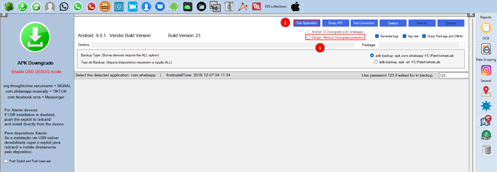

Select the package to extract — in this case `com.whatsapp` — and click **Extract**:

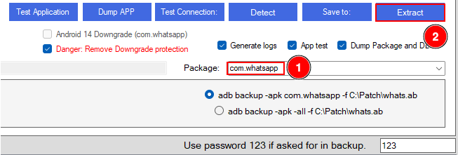

This produces a full WhatsApp backup. The same workflow can be extended to several other messaging applications:

.png)

3. Suppose you work in the digital forensics field. You have explained to your supervisor the difficulties involved in acquiring evidence from mobile devices. Your supervisor has asked you to purchase whatever is needed to address the challenges you encounter. Search the Internet for available software and hardware, and justify what you would buy.

#### Recommended equipment and tooling

Mobile acquisition is difficult for several overlapping reasons: devices are often seized powered on, protections such as full-disk encryption and disabled USB debugging block direct access, remote-wipe malware can destroy data over the network, and many tools require installing software on the handset itself — which further complicates chain of custody. The purchases below are chosen to address those constraints directly.

##### Hardware

| Item | Purpose | Why I would buy it |
|---|---|---|
| Certified Faraday bag / isolation box | Blocks cellular, Wi-Fi, and Bluetooth while the device is in transit or waiting for examination | Prevents remote-lock, remote-wipe, and cloud-sync commands from altering evidence after seizure |
| Write-blocked forensic workstation | Hosts acquisition and analysis tools on a controlled, auditable system | Keeps examiner actions documented and separates live evidence handling from everyday use |
| USB hub with dedicated ports + spare cables/adapters (USB-C, micro-USB, Lightning) | Physical connection to heterogeneous devices | Android fragmentation means connectors and modes (MTP, ADB, download mode) vary widely between manufacturers |
| External storage reader (SD / microSD) | Acquire removable media separately | SD cards may hold photos, downloads, or app data not present in internal logical images |
| UPS (uninterruptible power supply) | Maintain power during lengthy extractions | A sudden shutdown during acquisition can corrupt partitions or volatile state on a live device |

Faraday products range from low-cost pouches to lab-grade enclosures. For professional use I would avoid uncertified budget bags and invest in a mid-to-high-tier model with documented shielding performance.

##### Software

No single application solves every case. On modern, non-rooted devices, fully bypassing security without user cooperation is generally not possible with open-source tooling alone — which is why commercial suites remain the industry standard alongside targeted logical methods (such as APK downgrade, as tested with Avilla).

| Tool | Strengths | Main limitation | Approx. cost tier |
|---|---|---|---|
| Cellebrite UFED | Physical and advanced logical extraction; broad device support; lock-bypass techniques | Very expensive; licensing per device/update | Very high |
| MSAB XRY | Strong physical extraction; mature mobile workflow | Smaller ecosystem than Cellebrite for some Android variants | High |
| Oxygen Forensic Detective | Cloud and account artefact recovery (Google, WhatsApp backups, Telegram sync data) | Weaker on physical extraction than UFED/XRY | High |
| Magnet AXIOM | Excellent post-acquisition correlation and reporting across artefacts | Limited live extraction compared to dedicated mobile suites | High |
| Avilla Forensics (open source) | Logical extraction, APK downgrade, accessible for training and triage | No substitute for physical extraction on locked or heavily protected devices | Free |

##### What I would actually procure

Given a realistic lab budget, I would prioritize the following combination:

1. **Faraday bag (certified)** — first purchase at seizure; cheapest way to materially reduce evidence-loss risk.
2. **Cellebrite UFED** — primary answer to encrypted, locked, or otherwise inaccessible devices when physical acquisition is required.
3. **Oxygen Forensic Detective** — complements UFED by recovering cloud-resident and account-linked data that may never exist on the handset (as seen in the Chat Analysis case, where criminals still left traces in synced services and browser history).
4. **Forensic workstation + write blocker** — supports repeatable, documented workflows and integrity controls throughout the process.
5. **Avilla Forensics (or equivalent open-source toolkit)** — for rapid logical triage and APK-downgrade scenarios where installing a collector is acceptable and root is unavailable.

This mix covers isolation at collection time, depth at extraction time, breadth for cloud artefacts, and a low-cost option for logical scenarios — without assuming that any one product can bypass every Android protection.

## Feasibility of Android Forensic Analysis

In general, RAM memory analysis and persistent storage analysis are considered essential parts of digital forensic investigations.

After the advances achieved in Windows, Linux and macOS forensic analysis, researchers started investigating whether tools such as DD, LiME and Volatility could also be used for Android devices.

Many research papers focus on Android RAM analysis, especially on virtualized Android devices.

### Objectives

- Investigate the difficulties involved in Android forensic investigations.
- Study the feasibility of performing forensic analysis depending on device characteristics.

### Documentation

- [Practical Infeasibility of Android Smartphone Live Forensics](https://faui1-files.cs.fau.de/filepool/gruhn/thesis_waechter.pdf)

### Tasks

#### Ideal situation for a perfect Android forensic investigation

The ideal forensic scenario would involve the following conditions:

- Full root access to the device
- No security barriers
- The device unlocked at acquisition time
- USB debugging enabled
- Availability of kernel source code and symbol tables
- Kernel support for loadable modules such as LiME

Under these conditions, investigators would be able to:

- Clone the internal storage
- Obtain a RAM dump
- Analyze volatile memory
- Preserve evidence integrity

However, this situation is extremely rare in real-world investigations.

#### Real-world limitations and possible solutions

##### Rooting without data loss

Most rooting procedures require rebooting the device.

This destroys the RAM contents, which are essential for live forensic analysis.

Possible solutions include:

- Exploiting privilege escalation vulnerabilities
- Using temporary root exploits
- Leveraging vulnerabilities such as Rage Against The Cage

However, these methods are highly device-dependent.

##### Android security mechanisms

Android devices implement many protections:

- Screen lock
- Disabled USB debugging
- Full disk encryption
- OEM lock
- Samsung Knox

These protections make physical and logical acquisition extremely difficult without user interaction.

Possible solutions include:

- Cold boot attacks
- Live acquisition while the device is unlocked
- Specialized forensic hardware
- Exploiting device vulnerabilities

##### Hardware and software fragmentation

Android fragmentation is one of the biggest challenges for investigators.

Each manufacturer uses:

- Different kernels
- Different partition layouts
- Different security mechanisms
- Different Android versions

This makes tools such as LiME and Volatility difficult to configure.

Investigators often need to:

- Identify the exact device model
- Obtain matching kernel sources
- Cross-compile forensic modules manually

In many cases, manufacturers do not provide the required sources.

##### Technical and legal limitations

Tools such as Volatility may fail due to incompatibilities or unsupported memory formats.

Additionally, using non-standard rooting techniques could invalidate evidence in legal proceedings.

Because of this, investigators must:

- Fully document every action performed
- Use validated methodologies
- Understand every forensic tool used
- Preserve chain of custody at all times

## Chat Analysis

As part of a police investigation into a murder, three mobile phones belonging to members of a criminal gang involved in drug trafficking were seized. Although the mobile phones had only been in use for a short period of time and the criminals tried not to use many cloud services, they made some mistakes that resulted in the download of personal data from some of these services, providing analysts with important information for the case investigation. You will have to take on the role of a forensic analyst and analyze the obtained data to answer some questions related to the investigation. The three criminals had the following nicknames:

- Capo: Leader and criminal mastermind of the gang.
- Hitman: Veteran member of the gang responsible for the more “sensitive” matters.
- Mule: A young and reckless guy who recently joined the gang. He was found dead near a shopping center.

At the following [link](https://informatica.ieszaidinvergeles.org:5001/sharing/c7p8DyLrT), you will find a compressed file containing the data extracted from the mobile phones used by the criminals.

By analyzing the information available in the logical acquisitions and application downgrades, try to answer the following questions about the 3 criminals. Write a report providing screenshots to support your answers.

## Capo

**Capo had several WhatsApp conversations with Mule (Mulligan Two). In the first one, he says that he has to travel near Madrid to pick up a car. Where exactly does he have to pick it up?**

Navigate to `Capo, Mulero y Matón/capo_maton_mulero_moviles/Capo` and locate the WhatsApp database:

```bash
find . -name msgstore.db
```

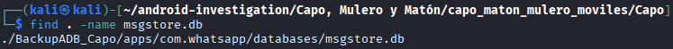

Open the database with DB Browser for SQLite:

```bash
sqlitebrowser ./BackupADB_Capo/apps/com.whatsapp/databases/msgstore.db
```

Go to the **Execute SQL** tab, run the following query, and click the play button to execute it:

```sql
select * from message
```

As shown above, the messages are displayed in plain text. Review the conversation for relevant details.

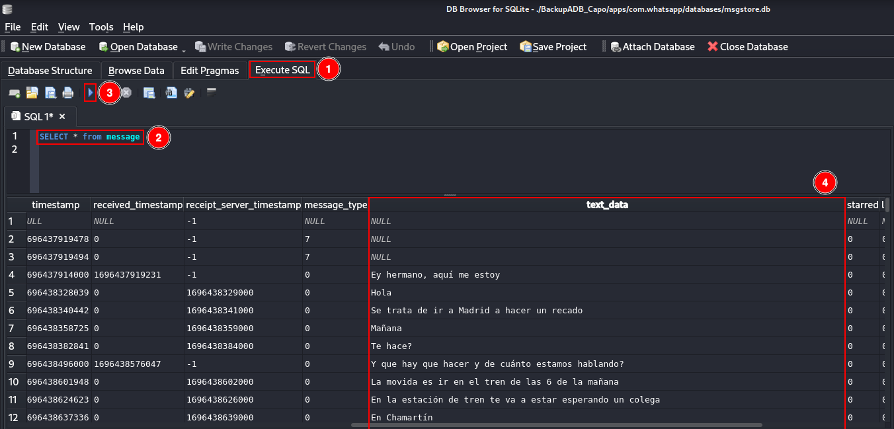

The exchange indicates that the vehicle is a Dacia, parked in the cemetery near **"Cruz de la horca"** (*"Gallows Cross"* — a local landmark name in Spanish).

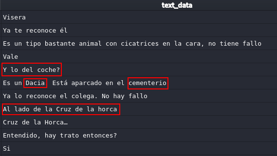

A Google Maps search for `Cruz de la Horca Av. Felipe II, 23, 28280 El Escorial, Madrid` identifies the exact parking location where the car was left.

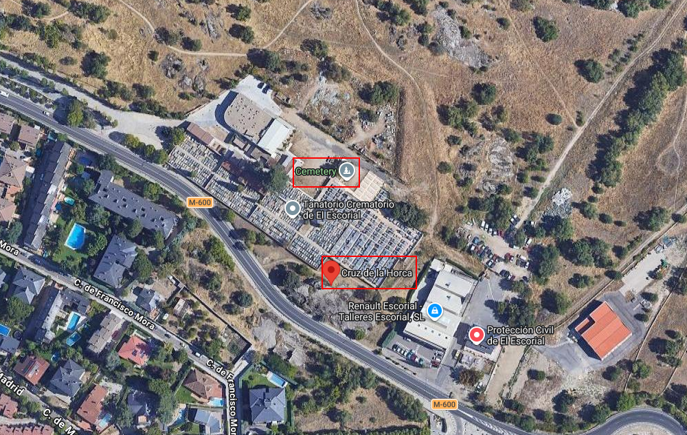

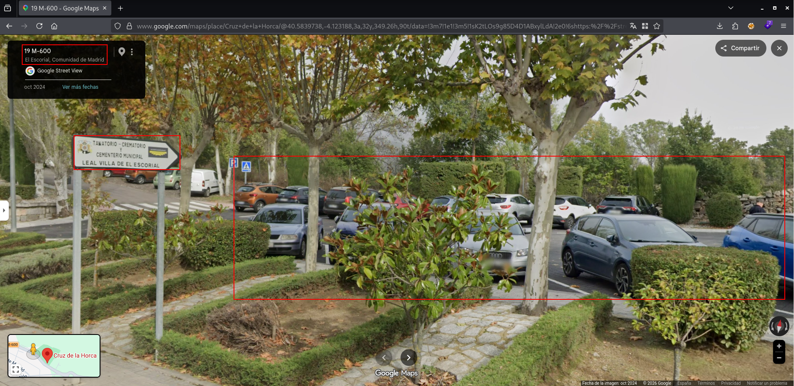

**On October 6 in the middle of the afternoon, Capo sent Mule a WhatsApp voice message scolding him about something. Recover the audio file and listen to the message. Why is he scolding him?**

In the same database, a record with `message_type` equal to `2` indicates a voice message.

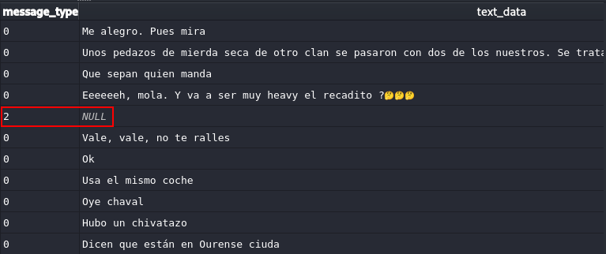

Navigate to `capo_maton_mulero_moviles/Capo/BackupADB_Capo/Shared/WhatsApp/Media/WhatsApp Voice Notes/202340` to locate and play the audio file:

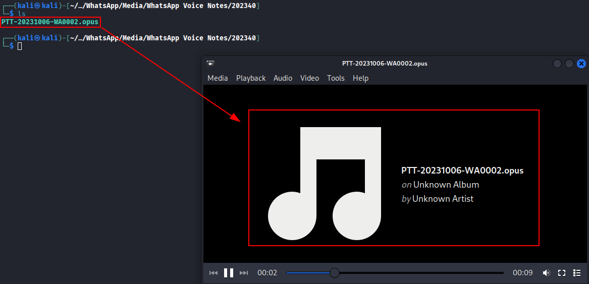

The recording says: *"Eso es cosa de Mathew, haz tu trabajo y limitate a eso, ¿capiste?"* — *"That's Matthew's business. Do your job and stick to that, understand?"*

Capo is annoyed because Mule is asking questions beyond his role. Looking further back in the chat, Mule had asked about the assignment: *"Eeeeeeh, mola. Y va a ser muy heavy el recadito?"* — *"Eeeeh, cool. Is the errand going to be really intense?"*

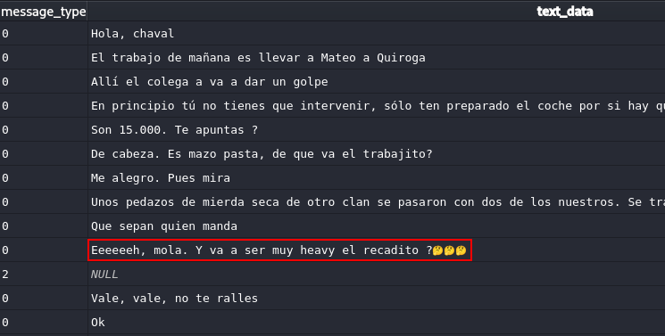

**Based on the last series of WhatsApp messages available on Capo’s phone, who appears to have killed Mule?**

Reviewing the database again, after the conversation with Mule (chat `_id` 2), Capo exchanges messages with another contact (chat `_id` 3), whose identity is not immediately obvious.

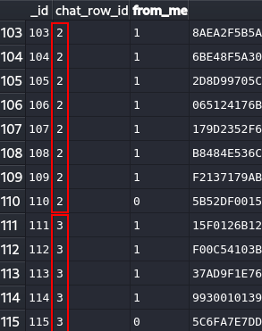

Further review of the chats shows that they usually communicate via Telegram, but switched to WhatsApp when Telegram was unavailable. In this exchange, contact (3) appears to be the person who carried out the killing:

- *"Quién me vio? Como me enteré va a saber!! Si no había nadie cago en todo!!!!"* — *"Who saw me? How did I find out!! If there was nobody there, I swear!!!"*

This message reads as a direct admission. However, the identity of contact (3) still needs to be resolved.

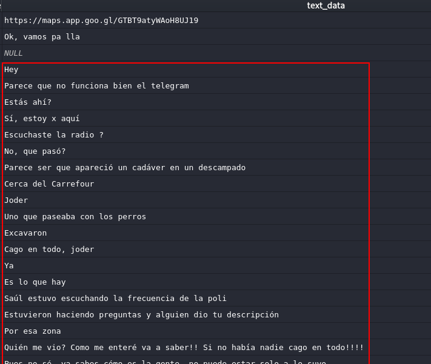

Returning to SQLite, we query the chat table and find that chat `_id` 3 is linked to `jid_row_id` 9:

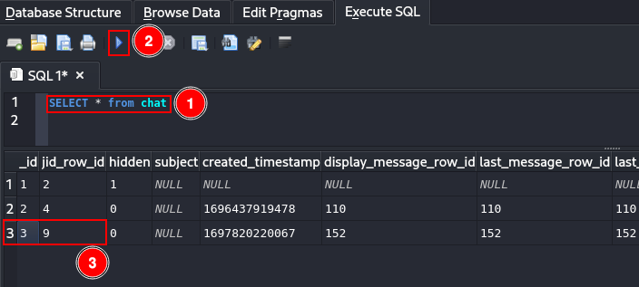

Looking up `jid_row_id` 9 in the `jid` table reveals the associated phone number.

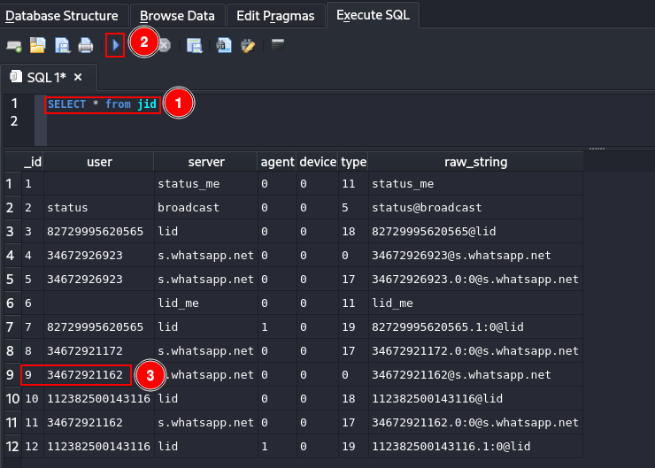

This yields the phone number `+34 672921162`.

We then open the WhatsApp contacts database to identify the owner of that number:

```bash
sqlitebrowser ./BackupADB_Capo/apps/com.whatsapp/databases/wa.db
```

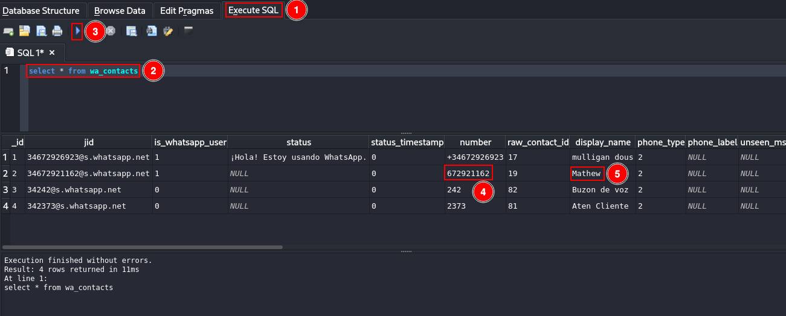

The contact associated with that number is **Mathew** — contact (3), who appears to be Mule's killer.

## Mule

**Mule took two photographs with his mobile phone camera at his birthday party on the beach. Could you determine on which beach the party took place?**

To review photos taken with the device camera, navigate to Mule's backup directory (`Mulero`) and open the camera folder:

```bash
cd ./BackupADB/shared/0/DCIM/Camera/
```

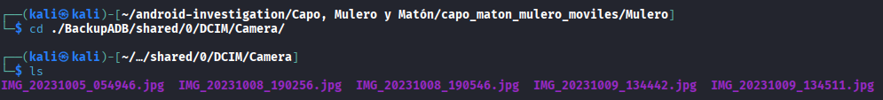

The beach-related photographs are the following:


We extract metadata from the original camera images to determine where they were taken. WhatsApp would not be suitable for this, as it strips EXIF metadata during sharing.

```bash
exiftool IMG_20231008_190256.jpg
```

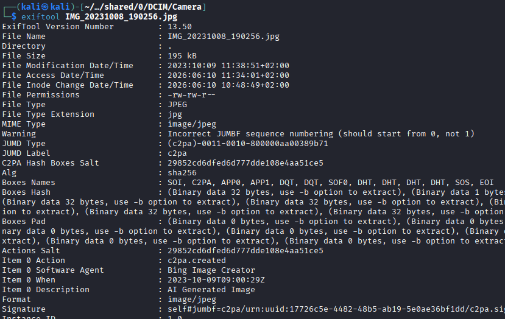

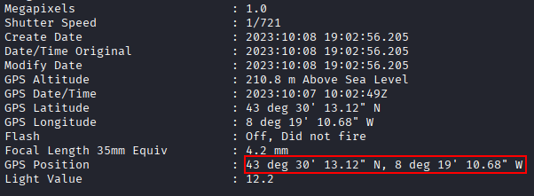

The device had location services enabled, and GPS coordinates were embedded in the image metadata. The coordinates are `43°30'13.12"N, 8°19'10.68"W`.

A Google Maps lookup of those coordinates shows the following:

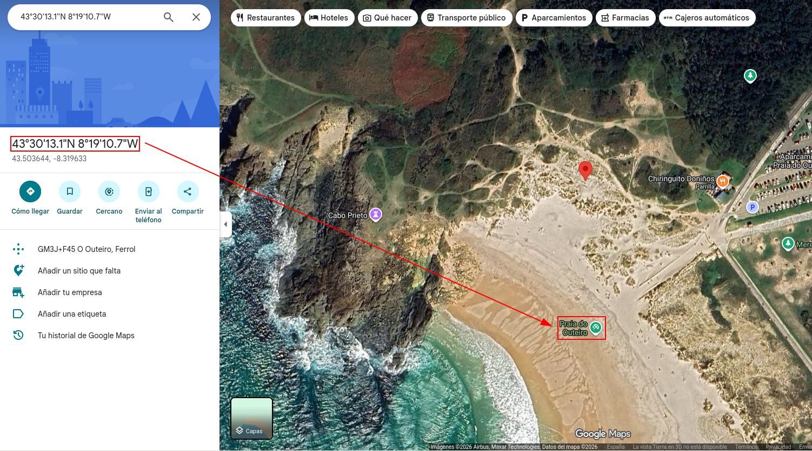

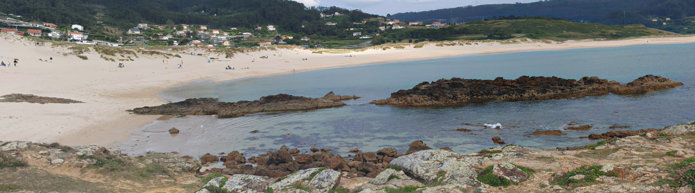

The photographs were taken at **Praia do Outeiro**, in Ferrol, Spain.

**Mule was interested in investing in cryptocurrencies and visited some websites with information about them. Which pages did he visit?**

The relevant artifact is Firefox's `places.sqlite` database. Locate it with:

```bash
find . -name places.sqlite
```

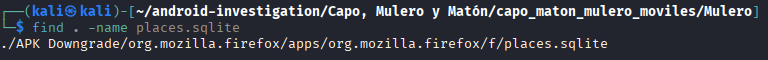

Open the database with DB Browser for SQLite:

```bash
sqlitebrowser "./APK Downgrade/org.mozilla.firefox/apps/org.mozilla.firefox/f/places.sqlite"
```

Query the `moz_places` table as shown below:

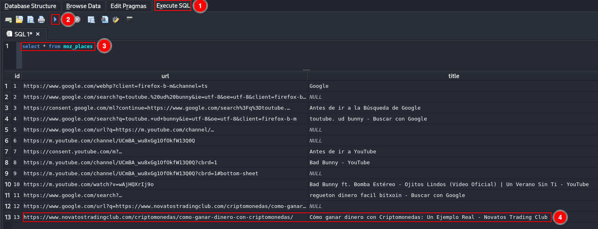

The browsing history shows that Mule visited `https://www.novatostradingclub.com/criptomonedas/como-ganar-dinero-con-criptomonedas/` — a Spanish-language page about making money with cryptocurrencies.

## Hitman

**On October 7, 2023, Hitman exchanged several messages with Capo on Telegram (Telegram user: Ernesto Capote) regarding a tip-off that had been received. In the third message of the day, Capo sent him the location of a street on the outskirts of Ourense. Can you recover the location from the Telegram messages and identify which street it is?**

Switch to Hitman's backup directory (`Maton`) and locate the Telegram database:

```bash
find . -name cache4.db 
```

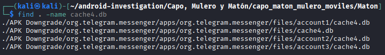

From the `users` table, Ernesto Capote's Telegram UID is `6614674280`. This identifier is needed to filter the relevant messages:

```bash
sqlitebrowser "./APK Downgrade/org.telegram.messenger/apps/org.telegram.messenger/files/cache4.db"
```

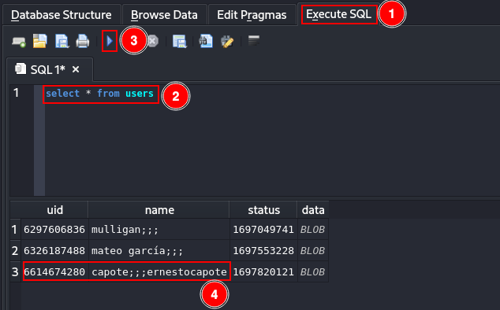

In the `messages_v2` table, one message from UID `6614674280` contains a Google Maps location link.

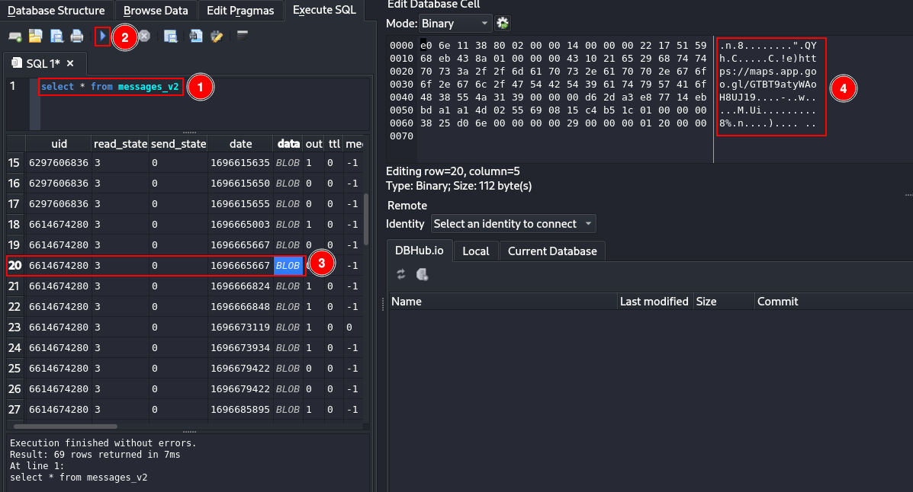

Following the [shared location](https://maps.app.goo.gl/GTBT9atyWAoH8UJ19) confirms that it points to a residential property on the outskirts of Ourense.

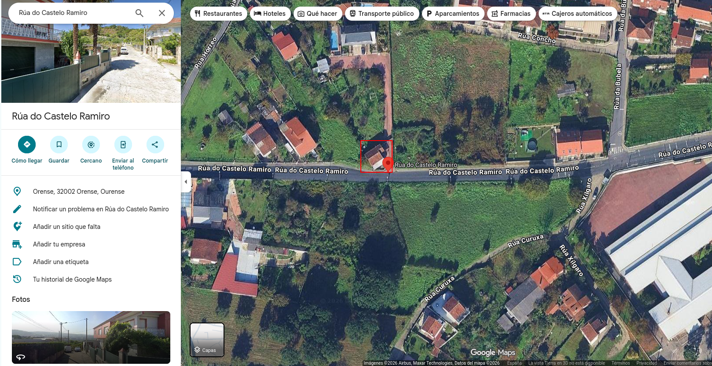

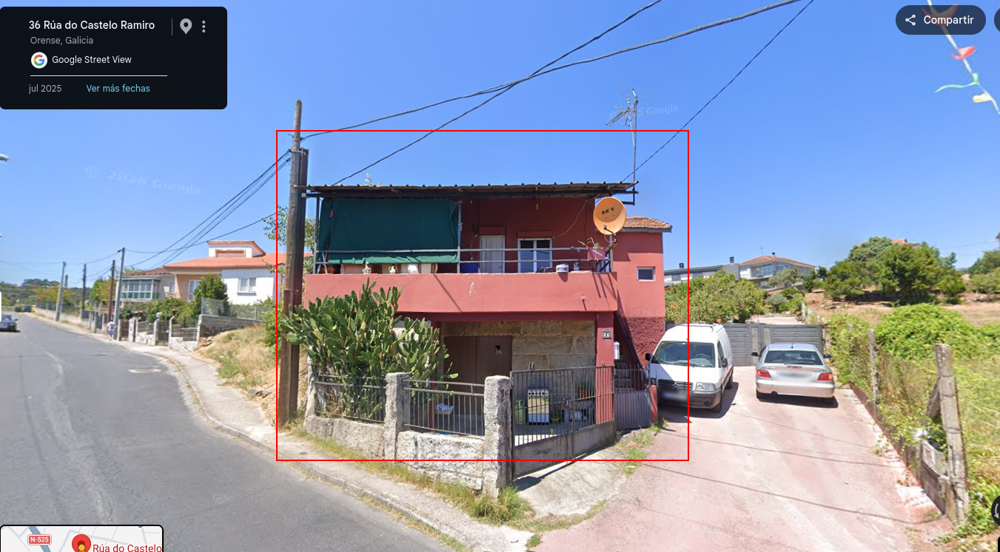

**In the last Telegram messages exchanged between Hitman and Capo, it becomes definitively clear who killed Mule. Who did it and when?**

Understanding the full sequence requires reviewing several messages in chronological order. The key exchanges are:

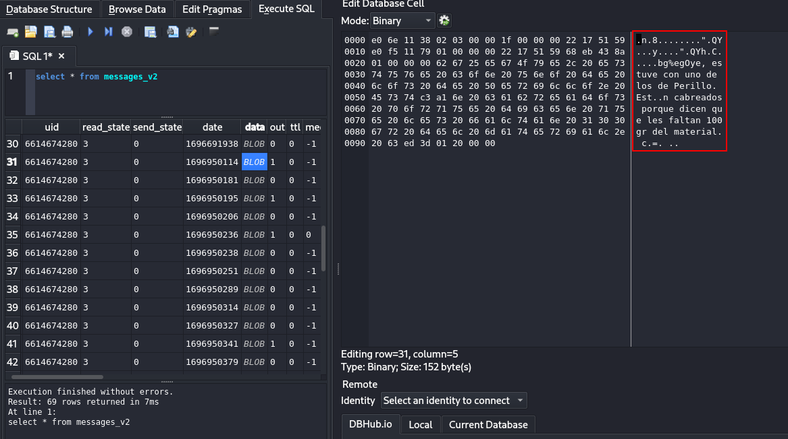

*"Oye, estuve con uno de los de Perillo. Están cabreados porque dicen que les faltan 100gr del material."*
— *"Hey, I was with one of the Perillo guys. They're pissed because they say 100 g of the product is missing."*

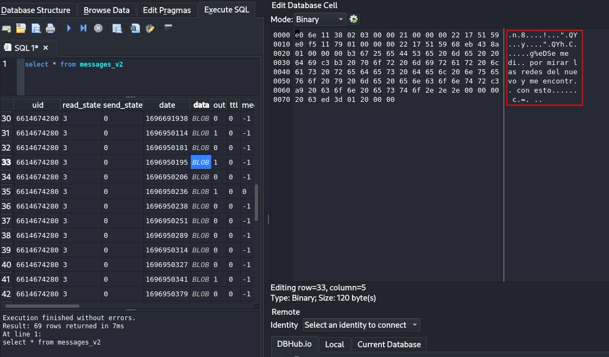

*"Se me dio por mirar las redes del nuevo y me encontré con esto..."*
— *"I felt like checking the new guy's social media and came across this..."*

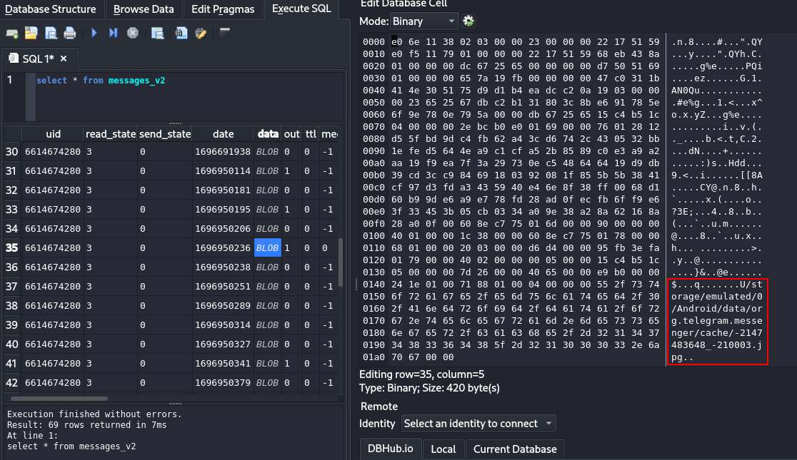

The referenced image is the following photograph:


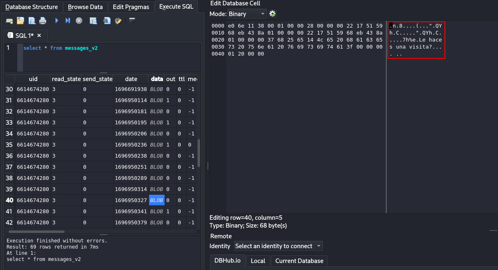

*"¿Le haces una visita?"*
— *"Can you pay him a visit?"*

After several more messages:

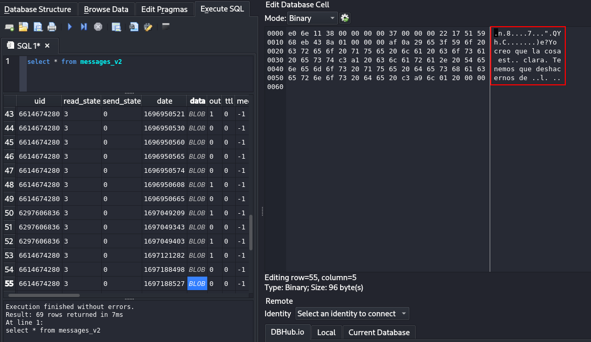

*"Yo creo que la cosa está clara. Tenemos que deshacernos de él"*
— *"I think it's clear. We need to get rid of him."*

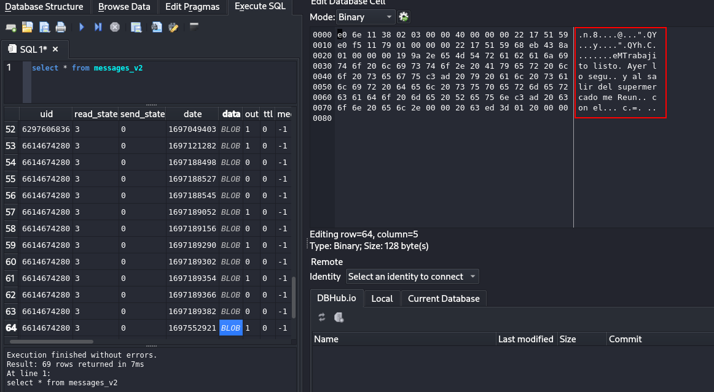

*"Trabajito listo. Ayer lo seguí y al salir del supermercado me Reuní con el."*
— *"Job done. Yesterday I followed him and met up with him as he left the supermarket."*

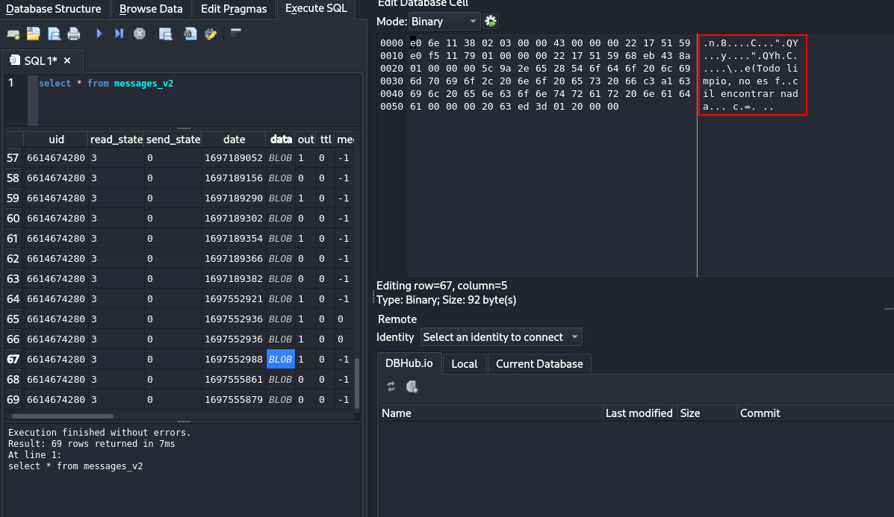

*"Todo limpio, no es fácil encontrar nada"*
— *"All clean, nothing easy to find."*

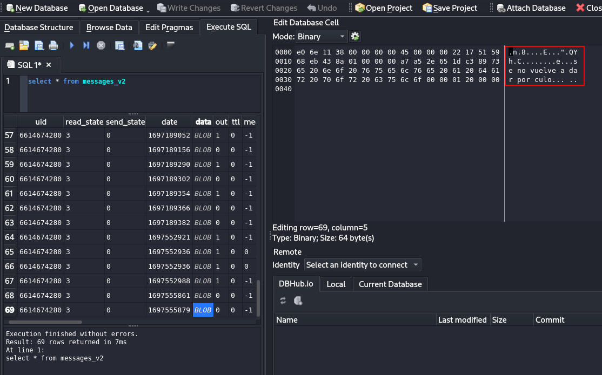

*"Ése no vuelve a dar por culo."*
— *"That guy won't be a pain in the ass again."*

**Conclusion:** Reading the full thread, the sequence of events becomes clear. Mule took part of a drug shipment to use at his birthday party. This shortage caused problems for Capo with the suppliers. Hitman then found Mule's birthday photos on social media, where the missing drugs were visible. After confronting Mule, both Hitman and Capo agreed that eliminating him was necessary to restore the criminal organization's trust. **Hitman (Mathew) killed Mule on October 16, 2023** — as confirmed by the timestamped photographs taken with his phone that day and his follow-up message stating the job was done.

**Now that we know the date of the murder, let’s look at the photos taken with Hitman’s phone that day to see if they provide any clue as to where it took place. Can you indicate the exact location?**

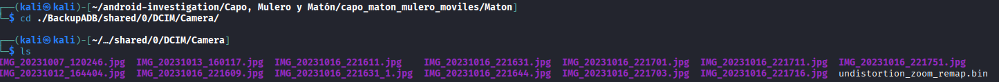

In Hitman's (`Maton`) camera directory, two images from that day show the same location:

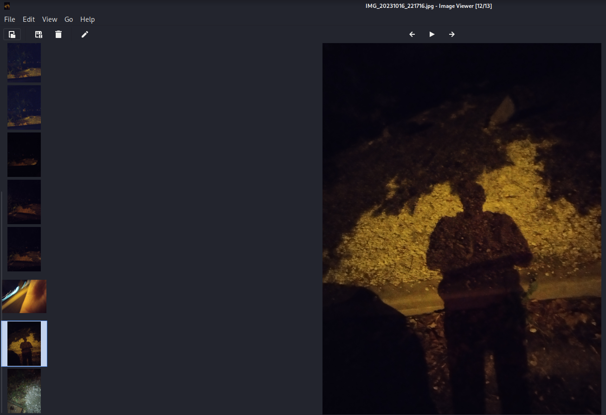

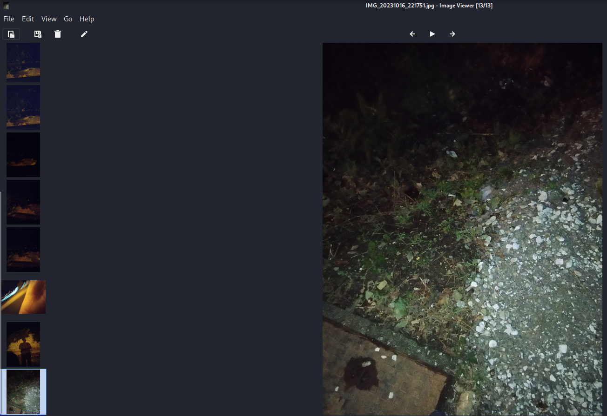

As with Mule's beach photos, we extract image metadata to recover GPS coordinates:

```bash
exiftool IMG_20231016_221751.jpg
```

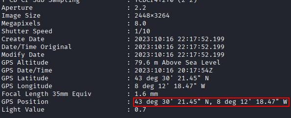

The photographs were taken at `43°30'21.45"N, 8°12'18.47"W`.

A Google Maps lookup of those coordinates identifies the exact location, shown in the screenshots below — consistent with Hitman's message about following Mule as he left a supermarket.

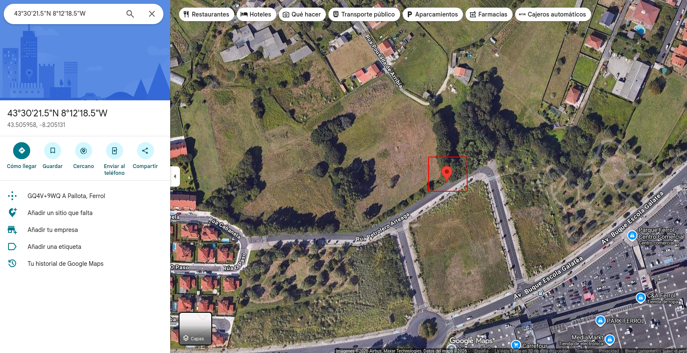

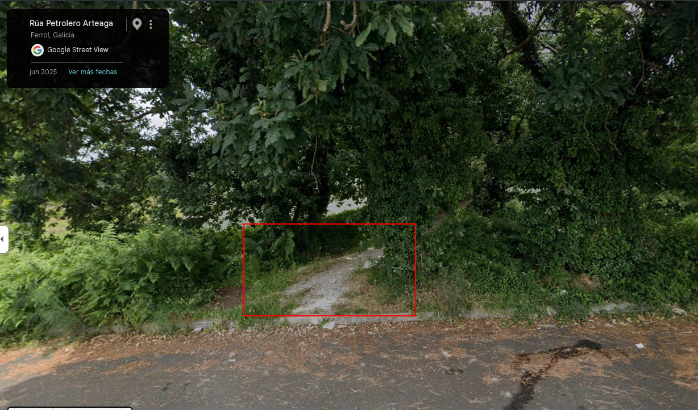
