# Cloud Forensics Analysis

## Evidence Extraction from the Cloud

Cloud services can be accessed through browsers or client applications on networked devices such as desktops, laptops, tablets, and smartphones, commonly referred to as endpoint devices.

Relevant forensic data may be stored on endpoint devices and/or on cloud service providers. When cloud services are accessed from an endpoint device, various files and folders are created locally that may be of forensic interest. In addition, a digital forensic investigator may access data using an Application Programming Interface (API) provided by a cloud service provider in order to retrieve forensic information related to cloud objects, events, files, and associated metadata.

## Objectives

- Become aware of the possibilities that cloud services offer when obtaining forensic evidence.
- Install, configure, extract evidence, and analyze the most widely used cloud systems.

## Materials

- Any Windows distribution available on your system.
- OneDrive, Google Drive, and Dropbox clients.

## Tasks

### **1. Read the document “A Taxonomy of Cloud Endpoint Forensic Tools” and answer the following questions**

#### **a) What is cloud forensics?**

According to NIST, cloud forensics is the application of digital forensic science to reconstruct past events in cloud systems through the identification, collection, preservation, examination, interpretation, and reporting of digital evidence.

#### **b) What are the digital evidence sources that we specifically encounter when working in the cloud?**

The main sources of digital evidence in cloud environments are the following:

- Cloud service APIs.
- Cloud service logs.
- Local synchronized files.
- Authentication tokens and session artifacts.
- Browser cache and cookies.
- Metadata databases generated by cloud clients.

#### **c) What possibilities do the APIs provided by cloud service providers offer us? Explain the metadata that can be obtained through APIs**

Cloud APIs allow investigators to:

- Access cloud services through user credentials.
- Access files and synchronized content.
- Retrieve metadata and operational details.
- Analyze account activity.
- Identify timestamps and IP addresses.
- Obtain information about deleted files and synchronization events.

Common metadata obtained through APIs includes:

- File names.
- Creation and modification timestamps.
- Synchronization history.
- Device identifiers.
- User account identifiers.
- IP addresses.
- Shared file permissions.
- Access logs.
- File hashes.
- Deleted file recovery information.

#### **d) List the most commonly used client software for accessing cloud services**

Most commonly used cloud clients include:

- Microsoft OneDrive
- Google Drive
- Dropbox
- iCloud
- Mega
- Box
- Nextcloud
- ownCloud

### **2. Install and configure OneDrive, Google Drive, and Dropbox clients**

#### **OneDrive**

On Windows, OneDrive is usually installed by default. If it is not installed, it can be downloaded from the official Microsoft website.

Official website:  
https://www.microsoft.com/en-us/microsoft-365/onedrive/download

Check if OneDrive is installed:

```powershell
Get-Process OneDrive
```

Launch OneDrive:

```powershell
%localappdata%\Microsoft\OneDrive\OneDrive.exe
```

Once installed, users can log in with their Microsoft account and access synchronized files directly from Windows File Explorer.

#### **Google Drive**

Download the installer from the official Google Drive website.

Official website:  
https://www.google.com/drive/download/

Once downloaded, execute the installer and follow the setup process.

Check if Google Drive is running:

```powershell
Get-Process | findstr DriveFS
```

Default installation path:

```text
C:\Program Files\Google\Drive File Stream\
```

After authentication, synchronized files become accessible from Windows File Explorer.

#### **Dropbox**

Download the installer from the official Dropbox website.

Official website:  
https://www.dropbox.com/install

After installation, log in with a Dropbox account.

Check if Dropbox is running:

```powershell
Get-Process Dropbox
```

Default installation path:

```text
C:\Program Files (x86)\Dropbox\Client
```

The synchronized cloud directory will become available from Windows File Explorer.

#### **Nextcloud**

Nextcloud uses the **Nextcloud Desktop Client** to synchronize files between local system and a self-hosted or provider-hosted Nextcloud server.

Official website:  
https://nextcloud.com/install/

Download and install the desktop client from the official site, then follow the installation wizard.

After installation, launch Nextcloud and connect it to your server by entering your Nextcloud instance URL (for example: `https://cloud.yourdomain.com`) and your credentials.

Launch Nextcloud manually:

%localappdata%\Programs\Nextcloud\nextcloud.exe

Default installation path:

C:\Program Files\Nextcloud\

After configuration, the synchronized folder will be available in Windows File Explorer, typically under:

C:\Users\<YourUser>\Nextcloud\

From this folder, any files added, modified, or deleted will automatically sync with your Nextcloud server.

Check if Nextcloud is running:

```powershell
Get-Process Nextcloud*
```

### **3. Analyze the previous clients and determine**

#### **a) Identify where the services and their configuration files are installed**

##### **OneDrive**

OneDrive service and configuration files are typically located at:

```text
C:\Users\<user>\AppData\Local\Microsoft\OneDrive
```
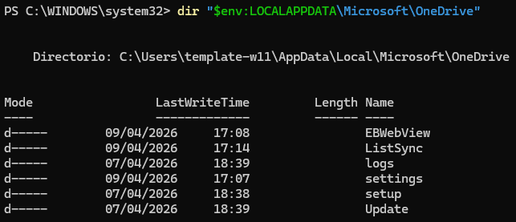

Settings directory:

```text
C:\Users\<user>\AppData\Local\Microsoft\OneDrive\seDttings
```

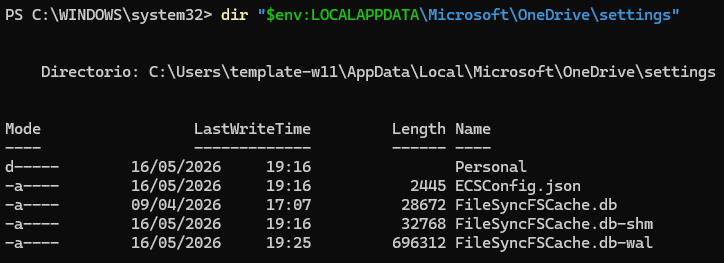

##### **Google Drive**

Google Drive service and configuration location is here:

```text
C:\Program Files\Google\Drive File Stream\
```


##### **Dropbox**

Dropbox service location:

```text
C:\Program Files (x86)\Dropbox\Client
```

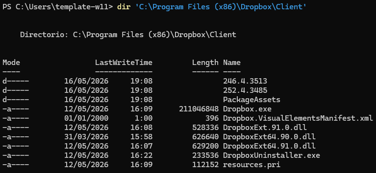

Configuration files:

```text
C:\Users\<user>\AppData\Roaming\Dropbox\
```


### **3. Analyze the previous clients and determine**

#### **a) Identify where the services and their configuration files are installed**

##### **Nextcloud**

Nextcloud service location:

C:\Program Files\Nextcloud\


Configuration files:

C:\Users\<user>\AppData\Roaming\Nextcloud\logs\


#### **b) Locate where the cloud synchronized folders are stored**

##### **OneDrive**

The synchronized OneDrive directory is usually located inside the user's profile:

```text
C:\Users\<user>\OneDrive
```

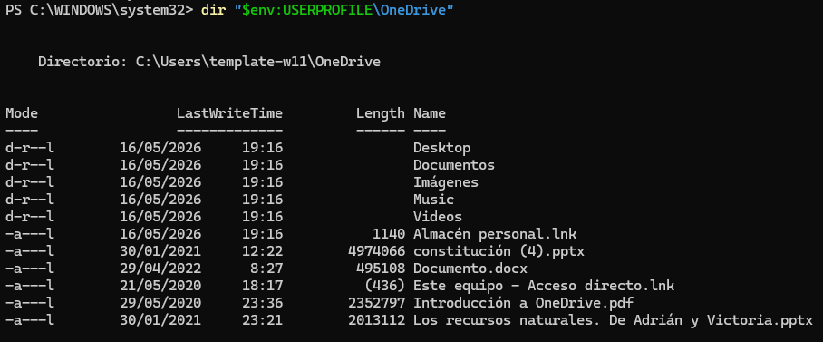

##### **Google Drive**

Google Drive mounts the synchronized files as a virtual drive.

The local cache and synchronization data are located at:

```text
%UserProfile%\AppData\Local\Google\DriveFS\
```


##### **Dropbox**

The synchronized Dropbox folder is usually located at:

```text
C:\Users\<user>\Dropbox\DropsyncFiles
```

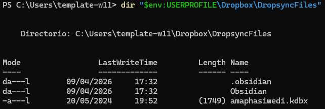

##### **Nextcloud**

The synchronized Nextcloud folder is usually located at:

C:\Users\<user>\Desktop\Nextcloud\

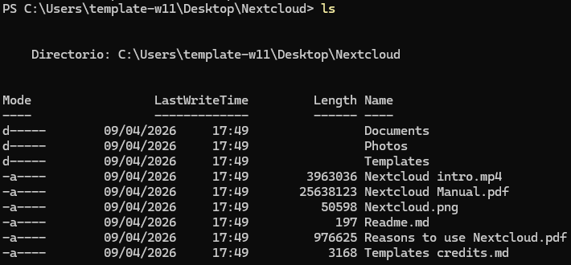

#### **c) Find the generated metadata and determine what information can be extracted from it**

##### **OneDrive**

Metadata and logs can be found in:

```text
C:\Users\<user>\AppData\Local\Microsoft\OneDrive\logs\
```


Inside the `Personal` directory, forensic artifacts and synchronization logs can be found.

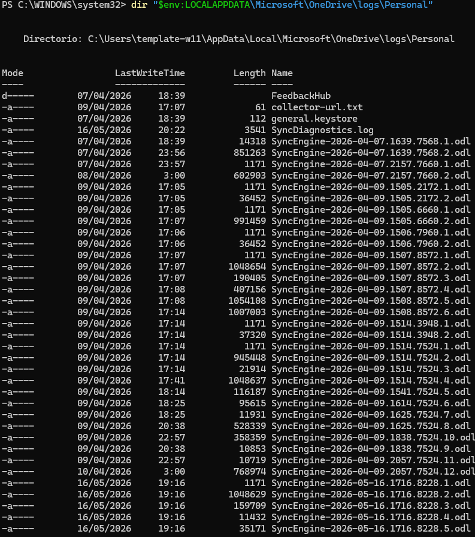

Read the log:

```powershell
Get-Content "$env:LOCALAPPDATA\Microsoft\OneDrive\logs\Personal\SyncDiagnostics.log"
```


From these logs we can extract:

- Synchronization events.
- File names.
- Timestamps.
- User account information.
- Synchronization errors.
- Device identifiers.

##### **Google Drive**

Metadata is stored inside SQLite databases located at:

```text
C:\Users\<user>\AppData\Local\Google\DriveFS
```


Databases can be analyzed using SQLiteStudio.

- experiment.db


- metrics_store_sqlite.db


is empty as I did not use it

- root_preferences_sqlite.db

rutas de sincronización


here we can see all the disks and their names

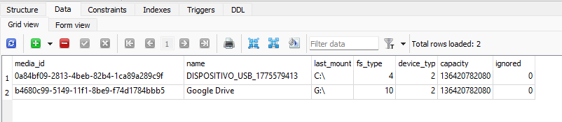

Inside these databases we can find:

- Synchronization paths.
- Device information.
- Telemetry information.
- Account details.
- Client behavior information.

Logs directory:

```text
C:\Users\<user>\AppData\Local\Google\DriveFS\logs
```

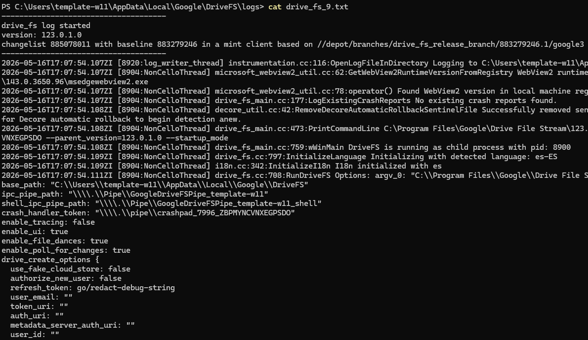


##### **Dropbox**

Dropbox stores forensic artifacts and databases inside:

```text
C:\Users\<user>\AppData\Local\Dropbox
```
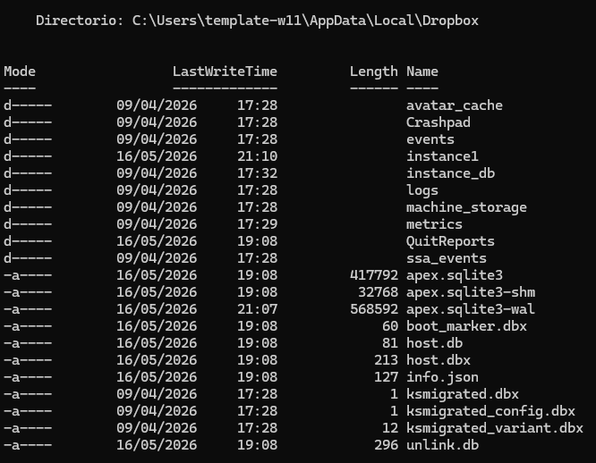

The most important file is

```text
apex.sqlite3
host.db
```

However there are unredeable / uncrypted and we cannot get anything


Possible information extracted:

- Synchronization history.
- Account email.
- File metadata.
- Shared files.
- Local cache information.
- Authentication artifacts.

##### **Nextcloud**

Nextcloud stores forensic artifacts, logs, and client metadata inside:

C:\Users\<user>\AppData\Local\Nextcloud\


Additional configuration and synchronization data can also be found in:

C:\Users\<user>\AppData\Roaming\Nextcloud\


Inside these directories we can find log files, cache information, synchronization metadata, and configuration files.

The most important file is:

<date>_nextcloud.log

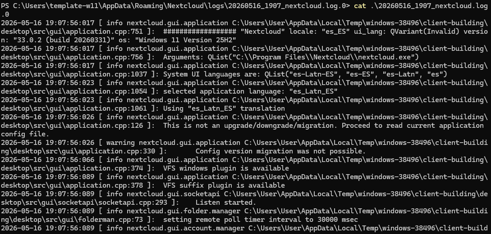

Possible information extracted:

- Synchronization history.
- File upload and download events.
- User account information.
- Server URLs.
- Synchronization timestamps.
- Error and conflict logs.
- Local cache information.
- Client activity events.

TBD, HACER DISCLAIMER DE QUE LAS RUTAS PUEDEN CAMBIAR, NO SIEMRE ES C, QUE ES UNA PARTICIÓN LÓGICA CUALQUIERA QUE TENGAS