# Google Drive, OneDrive, Dropbox and Nextcloud

## Evidence Extraction from the Cloud

Cloud services can be accessed through browsers or client applications on networked devices such as desktops, laptops, tablets, and smartphones, commonly referred to as endpoint devices.

Relevant forensic data may be stored on endpoint devices and/or on cloud service providers. When cloud services are accessed from an endpoint device, various files and folders are created locally that may be of forensic interest. In addition, a digital forensic investigator may access data using an Application Programming Interface (API) provided by a cloud service provider in order to retrieve forensic information related to cloud objects, events, files, and associated metadata.

## Objectives

The goals of this practice are to understand what forensic evidence cloud services can provide, and to install, configure, extract, and analyze several widely used sync clients on Windows.

## Materials

- A Windows system (any supported edition available on your machine).
- Desktop clients for OneDrive, Google Drive, Dropbox, and Nextcloud.

## Tasks

### **1. Read the document “A Taxonomy of Cloud Endpoint Forensic Tools” and answer the following questions**

#### **a) What is cloud forensics?**

According to NIST, cloud forensics is the application of digital forensic science to reconstruct past events in cloud systems through the identification, collection, preservation, examination, interpretation, and reporting of digital evidence.

#### **b) What are the digital evidence sources that we specifically encounter when working in the cloud?**

In cloud investigations, evidence often comes from several layers at once: **cloud service APIs** and **provider logs** for account-side activity; **locally synchronized files** and **metadata databases** left by desktop clients; and **authentication tokens**, **session artifacts**, **browser cache**, and **cookies** from web or hybrid access to the same services.

#### **c) What possibilities do the APIs provided by cloud service providers offer us? Explain the metadata that can be obtained through APIs**

With valid credentials or legal access, cloud APIs let investigators reach files and synced content, pull operational metadata, and reconstruct account activity—including timestamps, source IP addresses, and traces of deleted items or sync events that may no longer exist on the endpoint.

Through those interfaces, responses commonly include file names, creation and modification times, sync history, device and user identifiers, IP addresses, sharing permissions, access logs, file hashes where available, and data needed to recover or reference deleted objects on the provider side.

#### **d) List the most commonly used client software for accessing cloud services**

The most widely used desktop clients include **Microsoft OneDrive**, **Google Drive**, **Dropbox**, **iCloud**, **Mega**, **Box**, **Nextcloud**, and **ownCloud**.

### **2. Install and configure OneDrive, Google Drive, and Dropbox clients**

#### **OneDrive**

On Windows, OneDrive is usually installed by default. If it is not installed, it can be downloaded from the [official Microsoft website](https://www.microsoft.com/en-us/microsoft-365/onedrive/download).

Once installed, users can log in with their Microsoft account and access synchronized files directly from Windows File Explorer.

#### **Google Drive**

Download the installer from the [official Google Drive website](https://www.google.com/drive/download/), run it, and complete the setup wizard. After sign-in, synced content is available from Windows File Explorer.

#### **Dropbox**

Download the installer from the [official Dropbox website](https://www.dropbox.com/install).

After installation, sign in with a Dropbox account; the sync folder then appears in Windows File Explorer.

#### **Nextcloud**

Nextcloud uses the **Nextcloud Desktop Client** ([official website](https://nextcloud.com/install/)) to sync files between the workstation and a self-hosted or provider-hosted server. Install the client, then connect by entering the instance URL (for example `https://nextcloud.yourdomain.com`) and your account credentials. The chosen sync folder is then available in Windows File Explorer.

### **3. Analyze the previous clients and determine**

#### **a) Identify where the services and their configuration files are installed**

##### **OneDrive**

The OneDrive client and its working data are typically stored at:

```
C:\Users\<user>\AppData\Local\Microsoft\OneDrive
```


Settings directory:

```
C:\Users\<user>\AppData\Local\Microsoft\OneDrive\settings
```


##### **Google Drive**

Google Drive for desktop installs its binaries here:

```
C:\Program Files\Google\Drive File Stream\
```

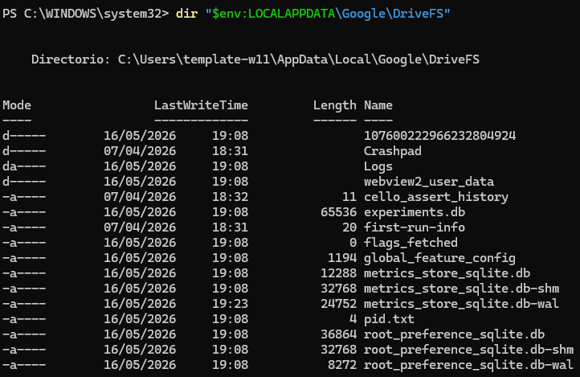

##### **Dropbox**

Dropbox executables are located at:

```
C:\Program Files (x86)\Dropbox\Client
```


Configuration files:

```
C:\Users\<user>\AppData\Roaming\Dropbox\
```

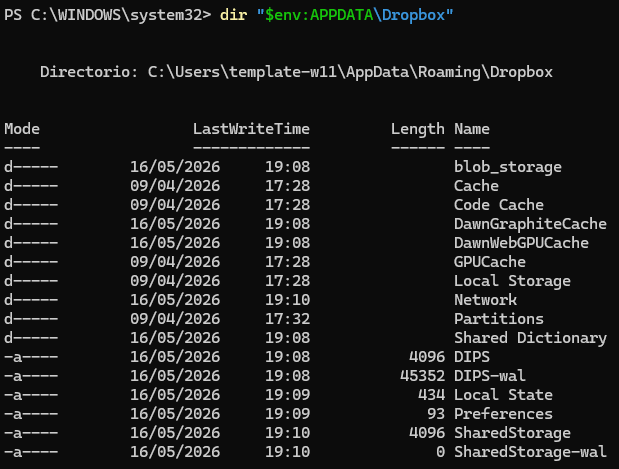

##### **Nextcloud**

Nextcloud service location:

```
C:\Program Files\Nextcloud\
```

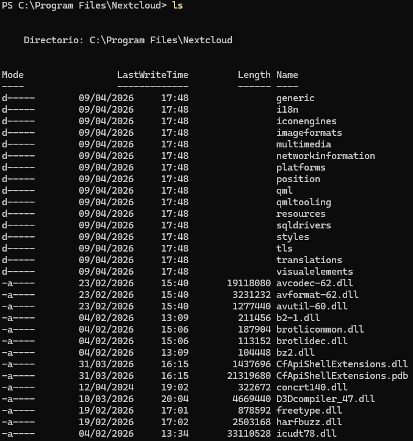

Configuration files:

```
C:\Users\<user>\AppData\Roaming\Nextcloud\logs\
```

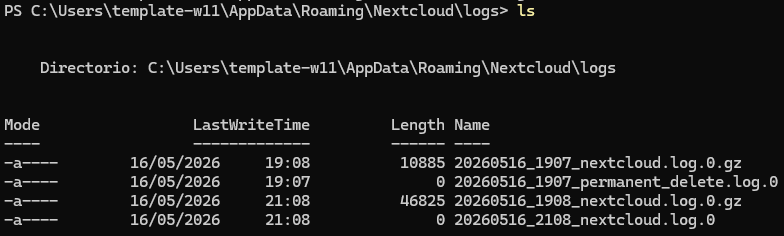

#### **b) Locate where the cloud synchronized folders are stored**

##### **OneDrive**

The synchronized OneDrive directory is usually located inside the user's profile:

```
C:\Users\<user>\OneDrive
```


##### **Google Drive**

Google Drive mounts the synchronized files as a virtual drive.

The local cache and synchronization data are located at:

```
%UserProfile%\AppData\Local\Google\DriveFS\
```


##### **Dropbox**

The synchronized Dropbox folder is usually located at:

```
C:\Users\<user>\Dropbox\DropsyncFiles
```


##### **Nextcloud**

The synchronized Nextcloud folder is usually located at:

```
C:\Users\<user>\Desktop\Nextcloud\
```


#### **c) Find the generated metadata and determine what information can be extracted from it**

##### **OneDrive**

Metadata and logs can be found in:

```
C:\Users\<user>\AppData\Local\Microsoft\OneDrive\logs\
```

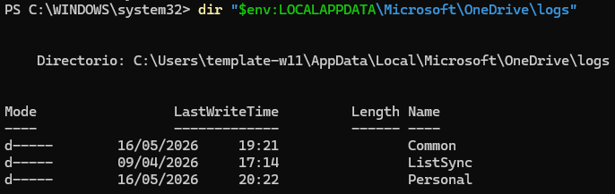

Inside the `Personal` directory, forensic artifacts and synchronization logs can be found.


Read the log:

```powershell
Get-Content "$env:LOCALAPPDATA\Microsoft\OneDrive\logs\Personal\SyncDiagnostics.log"
```

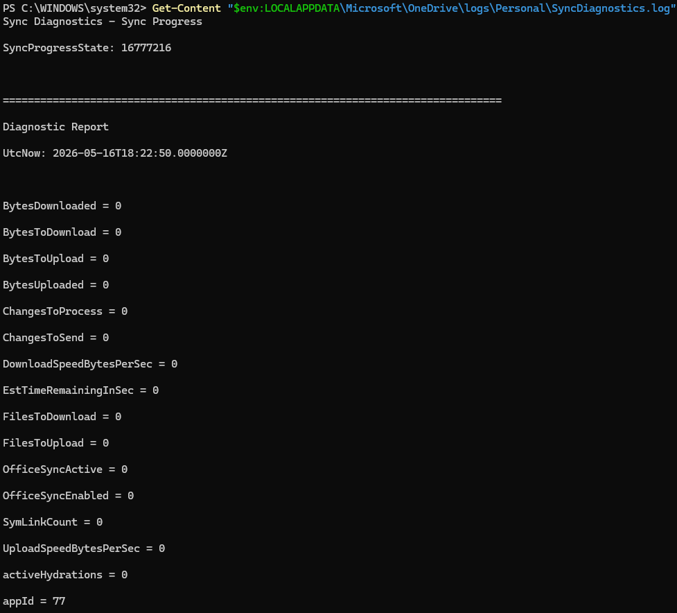

`SyncDiagnostics.log` and related files typically document synchronization events, affected file names, timestamps, linked account details, error messages, and device identifiers.

##### **Google Drive**

Metadata is stored inside SQLite databases located at:

```
C:\Users\<user>\AppData\Local\Google\DriveFS
```
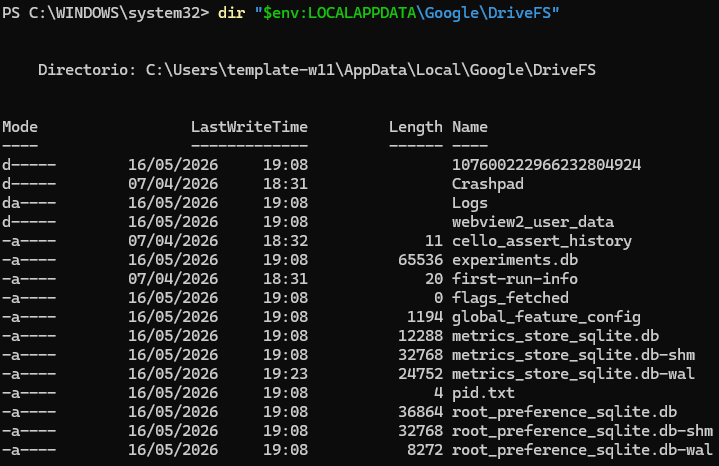

The databases were opened with SQLiteStudio:

**`experiment.db`** — client experiment or feature-related state.

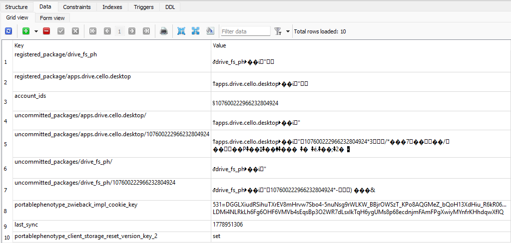

**`metrics_store_sqlite.db`** — telemetry store; it was empty in this installation because no metrics had been recorded yet.

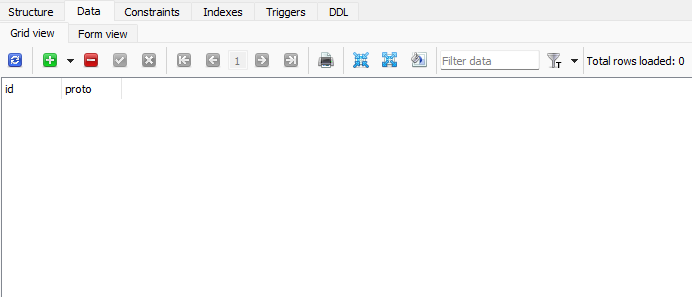

**`root_preferences_sqlite.db`** — holds synchronization paths:

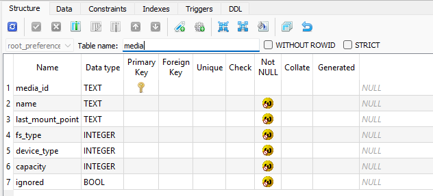

The same database also lists configured disks and their display names:


Taken together, these files can reveal sync paths, device and account binding, telemetry, and other client behavior not visible from Explorer alone.

Additional plain-text logs are under:

```
C:\Users\<user>\AppData\Local\Google\DriveFS\logs
```


##### **Dropbox**

Dropbox stores forensic artifacts and databases inside:

```
C:\Users\<user>\AppData\Local\Dropbox
```


The most important files are:

```
apex.sqlite3
host.db
```

In this case they were unreadable (encrypted or otherwise protected), so no useful metadata could be extracted from them directly.

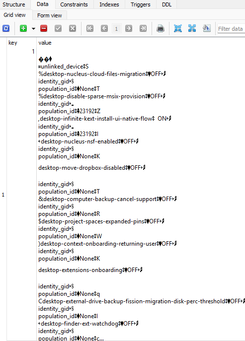

When the databases cannot be parsed, other artifacts under `AppData` may still yield sync history, the account e-mail, file metadata, sharing information, local cache data, and authentication-related remnants.

##### **Nextcloud**

Nextcloud stores forensic artifacts, logs, and client metadata here:

```
C:\Users\<user>\AppData\Local\Nextcloud\
```

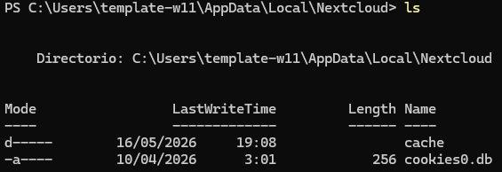

Additional configuration and sync data are under:

```
C:\Users\<user>\AppData\Roaming\Nextcloud\
```

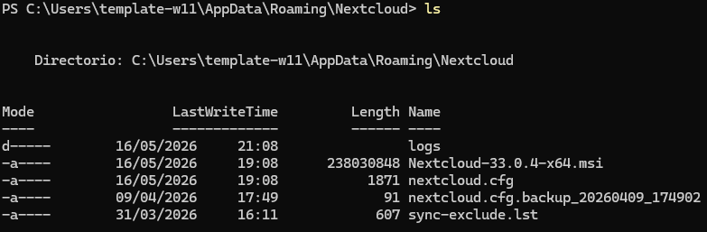

These directories contain log files, cache data, sync metadata, and configuration files. The most useful artifact for timelines is usually a log named like `<date>_nextcloud.log`:


From that log and related files, an examiner can often recover sync history, upload and download events, account and server URL details, timestamps, error and conflict records, cache references, and broader client activity.

> **Note:** Paths in this document assume the default Windows system drive (`C:`) and a typical user profile. Drive letters, profile names, and sync folder locations may differ depending on the installation and user choices.
