# Cloud Forensics Analysis

## Extraction of Evidence from On-Premise / IaaS Virtual Machines

One of the situations we may face as future forensic professionals is dealing with virtual machines, either in local installations (our own or a client’s) or in third-party infrastructures.

In local installations, we have more possibilities for forensic acquisition. We can operate from inside the virtual machine itself or directly from the hypervisor. The first scenario is very similar to the forensic procedures already studied in class: we can use DumpIt or similar tools to perform a memory dump, execute scripts to collect forensic artifacts, and also clone the hard drive or obtain a logical image.

The second scenario is the one covered in Part A of this practice.

Part B focuses on extracting forensic evidence when the virtual machines are hosted by third-party providers, such as Azure Cloud. In this case, memory dumps can be obtained using the same methods previously studied in class. Additionally, scripts may be executed to collect relevant forensic artifacts for later analysis. Virtual hard drives can also be downloaded or cloned directly in the cloud for analysis from another virtual machine.

## Objectives

- Become aware of the forensic acquisition possibilities offered by cloud environments and virtualized systems.
- Extract forensic evidence from some of the most widely used cloud systems.

## Materials

- Any Windows distribution virtualized on your system.
- Azure Cloud.
- Libcloudforensics.

# PART A: Extraction of On-Premise Evidence

In this practical exercise we will learn how to perform a forensic analysis of a Windows system virtualized with VirtualBox.

The objective is to obtain a memory dump and a disk image from a running Windows virtual machine, and then convert them into formats compatible with forensic analysis tools.

## **1. Read the following article**

Reference article related to VirtualBox forensic acquisition.

## **2. Open a command prompt and navigate to the VirtualBox installation directory**

Default VirtualBox installation path on Windows:

```powershell
cd "C:\Program Files\Oracle\VirtualBox"
```

Verify VBoxManage availability:

```powershell
VBoxManage --version
```

## **3. List all available virtual machines**

```powershell
VBoxManage list vms
```

List running virtual machines:

```powershell
VBoxManage list runningvms
```

## **4. Identify the virtual machine name**

The output of the previous command will display the VM names and UUIDs.

Example:

```text
"KaliHacker" {xxxxxxxx-xxxx-xxxx-xxxx-xxxxxxxxxxxx}
```

## **5. Perform a memory dump**

```powershell
VBoxManage debugvm "KaliHacker" dumpvmcore --filename KaliHacker.dmp
```

This command generates a `.dmp` memory dump.

Verify the generated file:

```powershell
dir *.dmp
```

## **6. Convert the `.dmp` file into a raw memory image**

Using Volatility:

```bash
volatility -f KaliHacker.dmp imagecopy -O KaliHacker.raw
```

Using Volatility 3:

```bash
python3 vol.py -f KaliHacker.raw windows.info
```

Analyze processes:

```bash
python3 vol.py -f KaliHacker.raw windows.pslist
```

Analyze network connections:

```bash
python3 vol.py -f KaliHacker.raw windows.netscan
```

## **7. Obtain a virtual disk image**

Locate the VDI/VMDK disk path.

Example:

```text
C:\Users\<user>\VirtualBox VMs\KaliHacker\KaliHacker.vdi
```

Clone the virtual disk:

```powershell
VBoxManage clonehd "C:\Users\<user>\VirtualBox VMs\KaliHacker\KaliHacker.vdi" "C:\Evidence\KaliHacker.img" --format RAW
```

Alternative IMG format:

```powershell
VBoxManage clonehd "KaliHacker.vdi" "KaliHacker.img" --format RAW
```

Verify the generated image:

```powershell
dir C:\Evidence
```

The resulting image can later be analyzed using forensic tools such as:

- Autopsy
- FTK Imager
- Sleuth Kit
- Volatility

---

# Alternative Method: VMware Snapshot Analysis

If VMware is used instead of VirtualBox:

Create a snapshot while the virtual machine is running.

The snapshot directory will contain a `.vmem` file.

This file is already a raw memory image compatible with Volatility.

Analyze it directly:

```bash
python3 vol.py -f KaliHacker-Snapshot4.vmem banners.Banners
```

List running processes:

```bash
python3 vol.py -f KaliHacker-Snapshot4.vmem windows.pslist
```

Analyze network artifacts:

```bash
python3 vol.py -f KaliHacker-Snapshot4.vmem windows.netscan
```

---

# PART B: Extraction of Evidence from Azure Cloud

## **1. Register in Azure Cloud**

Azure portal:

https://portal.azure.com/

Login from Azure CLI:

```powershell
az login
```

Verify account information:

```powershell
az account show
```

## **2. Create a Debian 11 virtual machine with SSH enabled**

Create a resource group:

```powershell
az group create --name forense_group --location westeurope
```

Create the VM:

```powershell
az vm create ^
  --resource-group forense_group ^
  --name forense2 ^
  --image Debian11 ^
  --admin-username azureuser ^
  --generate-ssh-keys
```

Open SSH port 22:

```powershell
az vm open-port --port 22 --resource-group forense_group --name forense2
```

Obtain public IP:

```powershell
az vm show -d -g forense_group -n forense2 --query publicIps -o tsv
```

## **3. Connect remotely using SSH or Putty**

### Linux SSH connection

```bash
ssh -i azure.pem azureuser@51.107.10.255
```

Set proper permissions:

```bash
chmod 600 azure.pem
```

### Putty connection on Windows

Convert `.pem` to `.ppk` using Puttygen.

Steps:

1. Open Puttygen.
2. Click `Load`.
3. Select the `.pem` file.
4. Click `Save private key`.
5. Save as `.ppk`.

Connect using Putty:

- Hostname: Azure VM IP.
- Port: 22.
- Authentication → Select `.ppk` key.

## **4. Perform a memory dump of the Azure Debian VM**

Using AVML:

Download AVML:

```bash
wget https://github.com/microsoft/avml/releases/latest/download/avml
```

Give execution permissions:

```bash
chmod +x avml
```

Create the memory dump:

```bash
sudo ./avml memdump.raw
```

Verify dump creation:

```bash
ls -lh memdump.raw
```

Transfer the dump to the local machine:

```bash
scp -i azure.pem azureuser@51.107.10.255:~/memdump.raw /tmp/memdump.raw
```

Analyze the dump with Volatility:

```bash
python3 vol.py -f memdump.raw linux.pslist
```

## **5. Clone a VHD hosted in Azure**

Create a snapshot from the Azure Portal or CLI.

Create snapshot:

```powershell
az snapshot create ^
  --resource-group forense_group ^
  --name forense2_snapshot ^
  --source forense2_OsDisk_1
```

Generate an export URL:

```powershell
az snapshot grant-access ^
  --resource-group forense_group ^
  --name forense2_snapshot ^
  --duration-in-seconds 3600
```

Download the snapshot:

```powershell
azcopy copy "<snapshot_url>" "C:\Evidence\forense2_snapshot.vhd"
```

Alternative with wget:

```bash
wget "<snapshot_url>" -O forense2_snapshot.vhd
```

Verify VHD integrity:

```bash
sha256sum forense2_snapshot.vhd
```

## **6. Install Azure CLI and log in**

Install Azure CLI:

Official documentation:  
https://learn.microsoft.com/en-us/cli/azure/install-azure-cli

Verify installation:

```powershell
az
```

Login:

```powershell
az login
```

List subscriptions:

```powershell
az account list
```

Set active subscription:

```powershell
az account set --subscription "<subscription_id>"
```

## **7. Install libcloudforensics and clone a VM disk**

Install libcloudforensics:

```bash
pip install libcloudforensics
```

Verify installation:

```bash
pip show libcloudforensics
```

Obtain Azure account information:

```powershell
az account show
```

Create a Service Principal:

```powershell
az ad sp create-for-rbac --name "forensics-sp"
```

Assign permissions:

```powershell
az role assignment create ^
  --assignee <service_principal_id> ^
  --role "Contributor" ^
  --scope /subscriptions/<subscription_id>
```

Create Azure credentials file:

```text
~/.azure/credentials.json
```

Example forensic cloning script:

```python
from libcloudforensics.providers.azure import forensics

copy = forensics.CreateDiskCopy(
    'forense_group',
    disk_name='forense2_OsDisk_1_a3361855bdc8451aa276ebafa13fa1ee'
)
```

Execute the script:

```bash
python3 clone_disk.py
```

The cloning process will generate Azure resources containing the forensic disk copy.

Useful Azure forensic commands:

List disks:

```powershell
az disk list -o table
```

List snapshots:

```powershell
az snapshot list -o table
```

List virtual machines:

```powershell
az vm list -o table
```

Inspect VM configuration:

```powershell
az vm show --resource-group forense_group --name forense2
```


ignacio

enccendemos hacemos snapshot

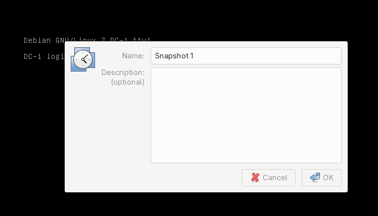

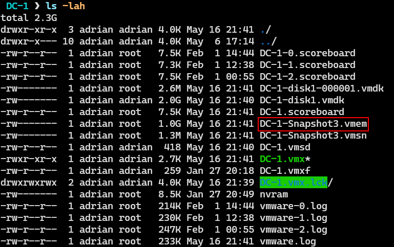


vol3 -f DC-1-Snapshot3.vmem -s ~/desktop/tools/volatility3/volatility3/symbols/ banners.Banner

con esto demostramos que volatility pude leer el volcado de memoria e identificar el perfil del volcado

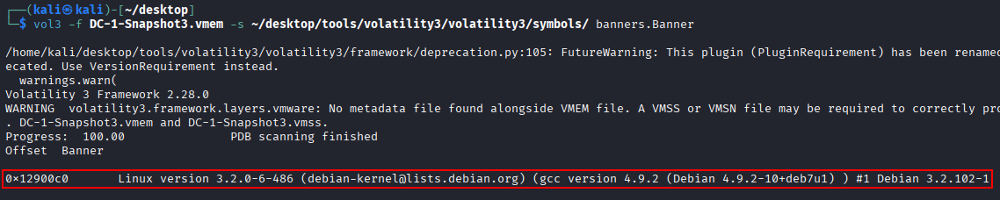

----


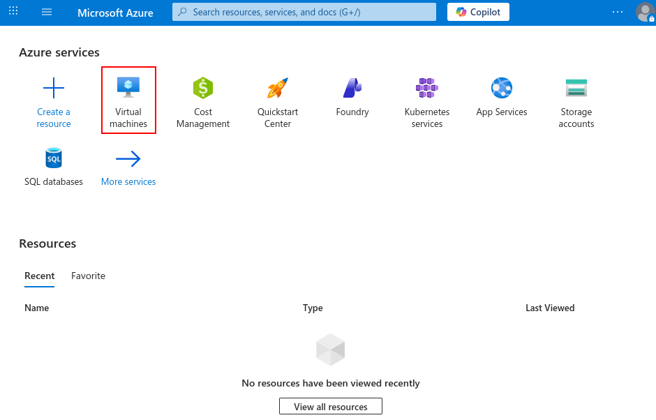

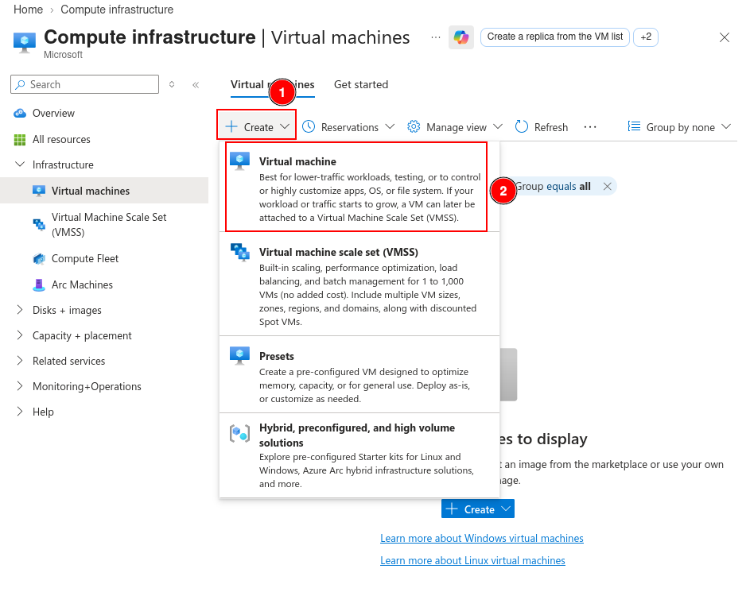

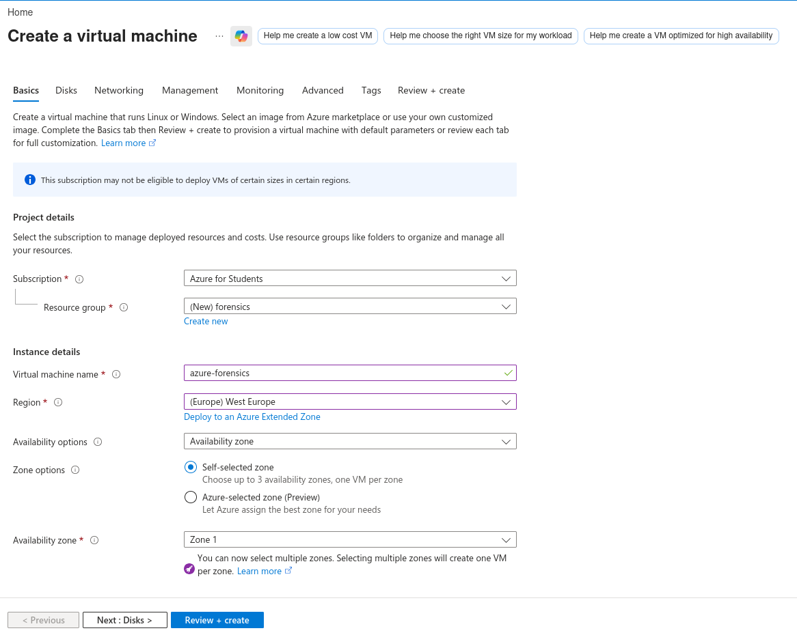

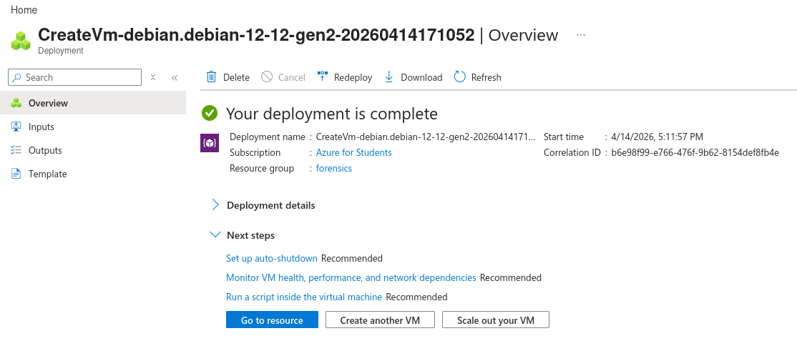

ssh -i <private-key-file-path> azureuser@9.223.178.153


```bash
wget https://github.com/microsoft/avml/releases/latest/download/avml
chmod +x avml
```


```bash
sudo ./avml memdump.raw
sudo chown azureuser:azureuser memdump.raw 
```

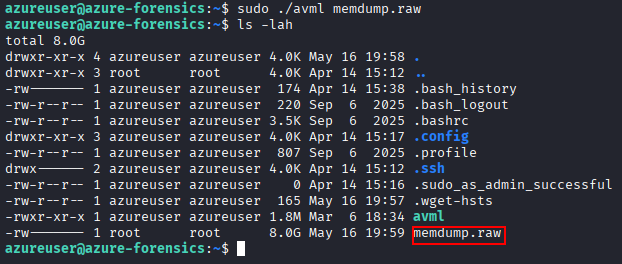

```
scp -i azure-forensics-key.pem azureuser@9.223.178.153:~/memdump.raw .
```

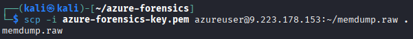

```bash
vol3 -f memdump.raw -s ~/desktop/tools/volatility3/volatility3/symbols/ banners.Banner
```

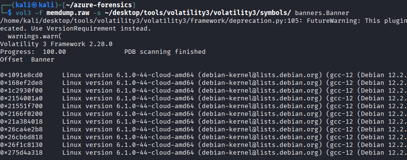


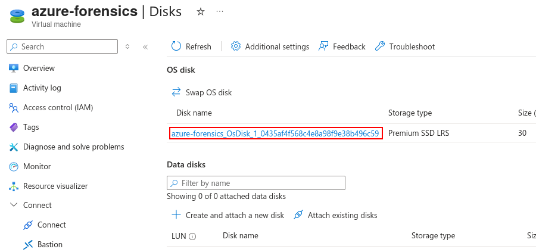

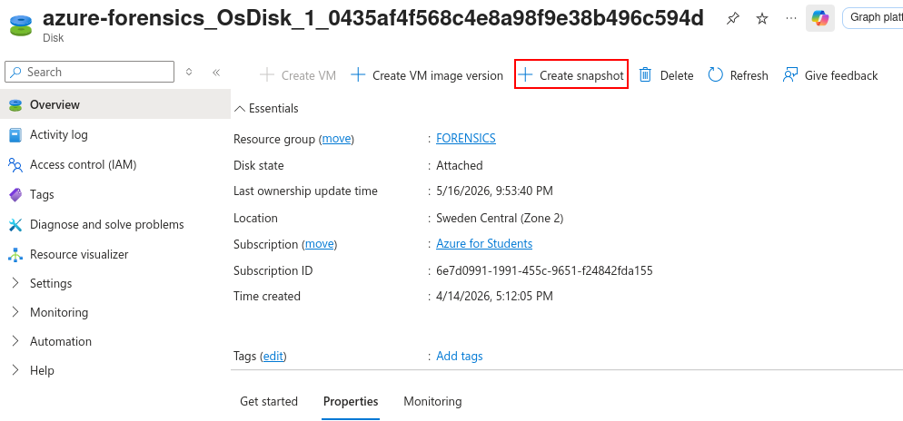


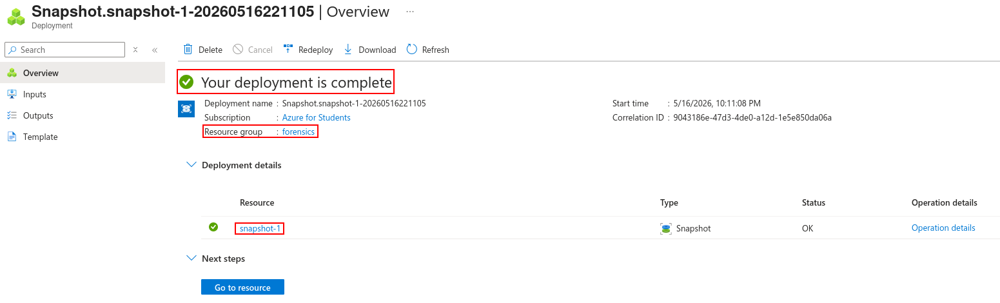


```bash
docker run -it mcr.microsoft.com/azure-cli
az login
```

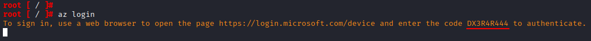

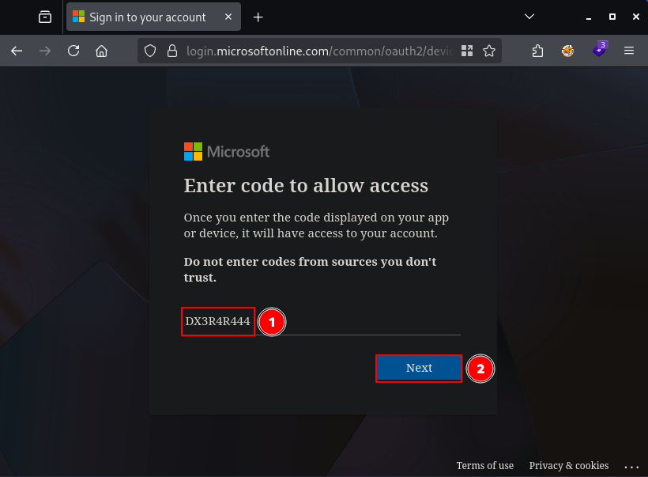


```bash
az snapshot grant-access \
  --resource-group forensics \
  --name snapshot-1 \
  --duration-in-seconds 3600
```

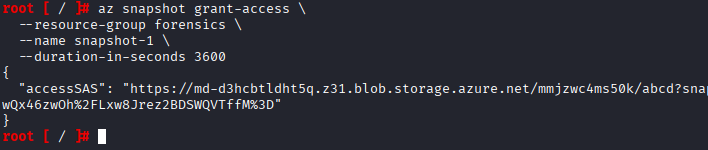

```json
{
  "accessSAS": "https://md-d3hcbtldht5q.z31.blob.storage.azure.net/mmjzwc4ms50k/abcd?snapshot=2026-05-16T20%3A11%3A11.0777366Z&sv=2018-11-09&sr=bs&si=ac513c6f073b4bf0ae1dbe1708e749d33e75b39012e740e1832fe1c1e332dd67&sig=1GPN32p0qzTJJLwQx46zwOh%2FLxw8Jrez2BDSWQVTffM%3D"
}
```


---- ejercicio heavy :O


```bash
az account show
```

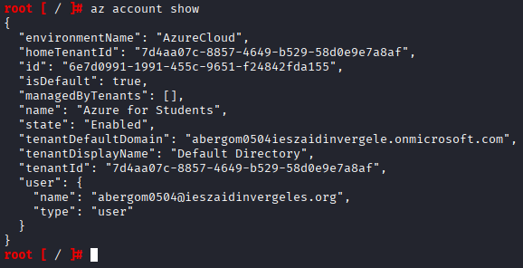


```bash
az ad sp create-for-rbac --name "forensics-sp"
```

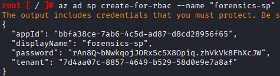

TBD BROTHEL HAY UNA PUTA CONTRASEÑA EN TEXTO PLANO QUITALA ANDA!!!


```bash
az role assignment create \
  --assignee <appId> \
  --role "Contributor" \
  --scope /subscriptions/<id>
```


```bash
python3 -m venv venv  
source venv/bin/activate
pip install libcloudforensics
```

```bash
export AZURE_SUBSCRIPTION_ID="<subscription-id>"
export AZURE_TENANT_ID="<tenant-id>"
export AZURE_CLIENT_ID="<app-id>"
export AZURE_CLIENT_SECRET="<client-secret>"
```

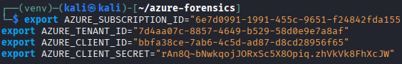

crea este archivo con el grupo y el nombre del archivo


```bash
python3 forensics.py
```

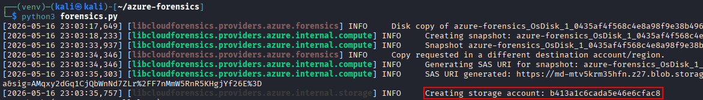