# VMware and Azure Cloud

## Extraction of Evidence from On-Premise / IaaS Virtual Machines

As forensic practitioners we often work with virtual machines, whether they run on local infrastructure (our own or a client’s) or on a third-party cloud platform.

On-premise hypervisors offer two main acquisition angles. Evidence can be collected from inside the guest operating system—memory dumps with tools such as DumpIt, artifact scripts, and logical or physical disk images—or from the hypervisor layer without booting the guest. Guest-side collection mirrors standard endpoint forensics; hypervisor-side collection is the focus of **Part A**, using VMware snapshots.

**Part B** covers IaaS scenarios in **Azure**. The same memory-acquisition concepts apply, but the VM runs on Microsoft’s infrastructure. After deploying a Linux VM, a memory image was captured with **AVML**, copied to an analysis workstation, and examined with **Volatility 3**. Disk evidence was obtained through an Azure-managed snapshot, a time-limited SAS URL, and finally **libcloudforensics** to clone the virtual disk for offline analysis.

## Objectives

Understand the forensic options available in virtualized and cloud-hosted environments, and practice extracting evidence from on-premise VMware and Azure IaaS workloads.

## Materials

- A Windows or Linux host with VMware (or VMware Workstation/Fusion) and at least one test VM.
- An Azure subscription with permission to create VMs, disks, and snapshots.
- **libcloudforensics**, **Volatility 3**, Docker (for Azure CLI), and SSH/SCP client tools.

## PART A: Extraction of On-Premise Evidence

This section documents forensic acquisition of a VMware guest (**DC-1**) from the hypervisor using snapshots and memory analysis on Kali Linux.

### List running virtual machines

The `vmrun` utility lists VMs that are currently powered on:

```bash
vmrun list
```

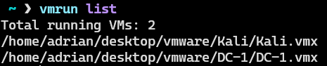

### Create a snapshot

A snapshot freezes the VM’s disk and memory state at a point in time. It can be taken from the VMware GUI:


Or from the command line (paths and snapshot name match this lab environment):

```bash
vmrun snapshot "/home/adrian/desktop/vmware/DC-1/DC-1.vmx" "Snapshot 3"
```

The snapshot files are written under the VM’s directory. For analysis with Linux tooling, the snapshot bundle was copied to a **Kali** machine.


### Analyze the memory image

The snapshot includes a `.vmem` file representing guest RAM at capture time. **Volatility 3** was used to confirm the image and identify the kernel:

```bash
vol3 -f DC-1-Snapshot3.vmem -s ~/desktop/tools/volatility3/volatility3/symbols/ banners.Banner
```


The `banners.Banner` plugin reports operating-system banners detected in the dump, which validates that the memory file is usable before running further plugins.

## PART B: Extraction of Evidence from Azure Cloud

This section walks through deploying an Azure Linux VM, acquiring memory and disk evidence, and exporting a disk clone for offline forensics.

### Deploy a virtual machine

Sign in to the [Azure portal](https://portal.azure.com) and open **Virtual machines**.


Select **Create** → **Virtual machine**.


Configure the VM (region, size, authentication method, and networking) according to lab requirements.


After deployment completes, the VM overview blade shows connection details and status.


### Acquire memory from the running VM

Connect to the VM with SSH (replace the IP address and key path with your deployment):

```bash
ssh -i <private-key> azureuser@9.223.178.153
```

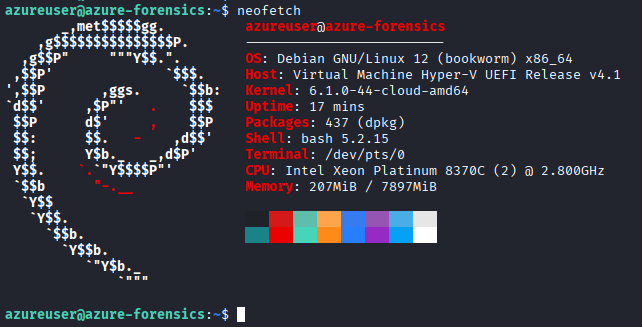

On the guest, download **AVML** (Azure VM Memory Logger) and capture physical memory to a raw file:

```bash
wget https://github.com/microsoft/avml/releases/latest/download/avml
chmod +x avml
sudo ./avml memdump.raw
sudo chown azureuser:azureuser memdump.raw
```


Copy the dump to the forensic workstation with **SCP**:

```bash
scp -i azure-forensics-key.pem azureuser@9.223.178.153:~/memdump.raw .
```


Analyze the dump locally with Volatility 3:

```bash
vol3 -f memdump.raw -s ~/desktop/tools/volatility3/volatility3/symbols/ banners.Banner
```


### Create a disk snapshot (Azure portal)

To preserve the OS disk without powering off the VM, open the VM’s **Disks** blade and select the attached OS disk.


Choose **Create snapshot**.


Enter a snapshot name and resource group, then select **Review + create**.

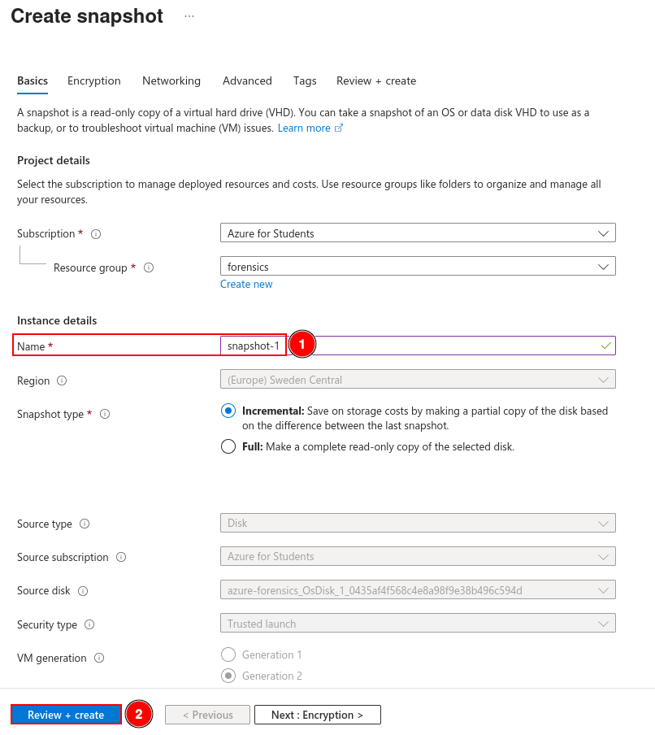

Confirm that validation passes and select **Create**.

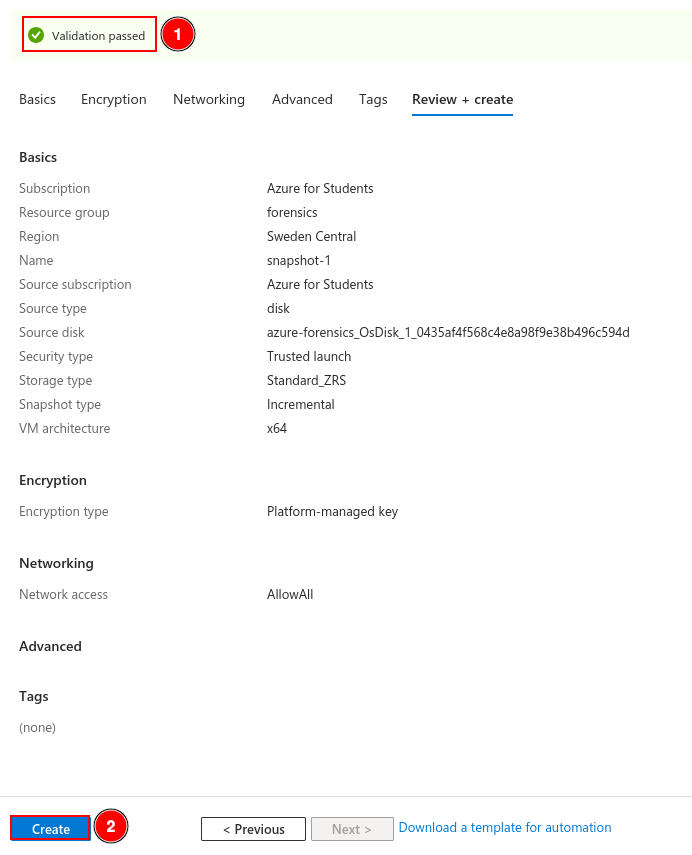

When deployment finishes, the snapshot appears as **Succeeded** in the resource list.


### Export the snapshot with Azure CLI

A disposable Azure CLI environment was started in Docker:

```bash
docker run -it mcr.microsoft.com/azure-cli
az login
```


The CLI prints a device-login code; open the URL shown in the terminal in a browser and complete authentication.


Sign in with the Azure account email and confirm access.

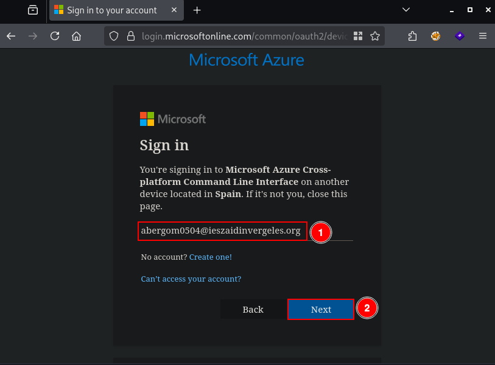

After authentication, the browser session can be closed; the CLI session in the container reports a successful login.

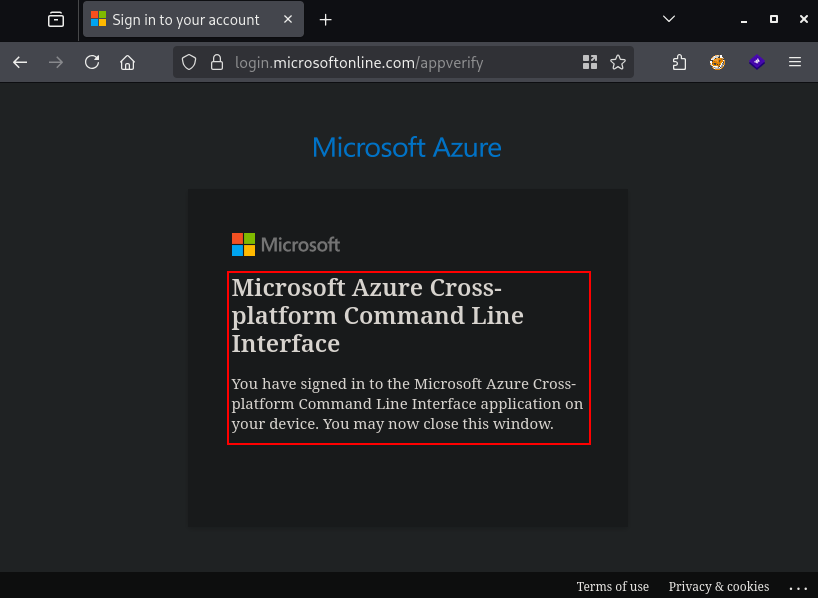

The terminal returns to an interactive Azure CLI prompt.

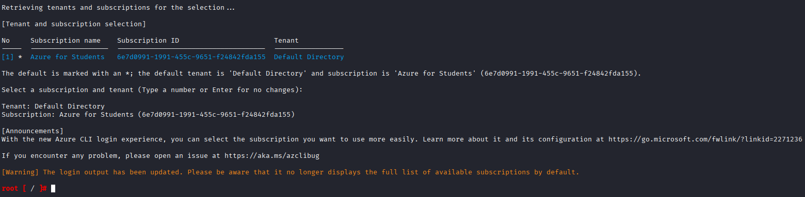

Grant read-only access to the snapshot and obtain a **time-limited SAS URL** (valid for 3600 seconds in this example):

```bash
az snapshot grant-access \
  --resource-group forensics \
  --name snapshot-1 \
  --duration-in-seconds 3600
```


The command returns JSON containing `accessSAS`. Example output:

```json
{
  "accessSAS": "https://md-d3hcbtldht5q.z31.blob.storage.azure.net/mmjzwc4ms50k/abcd?snapshot=2026-05-16T20%3A11%3A11.0777366Z&sv=2018-11-09&sr=bs&si=ac513c6f073b4bf0ae1dbe1708e749d33e75b39012e740e1832fe1c1e332dd67&sig=1GPN32p0qzTJJLwQx46zwOh%2FLxw8Jrez2BDSWQVTffM%3D"
}
```

Paste the SAS URL into a browser; the snapshot VHD begins downloading without attaching the disk to a running VM.

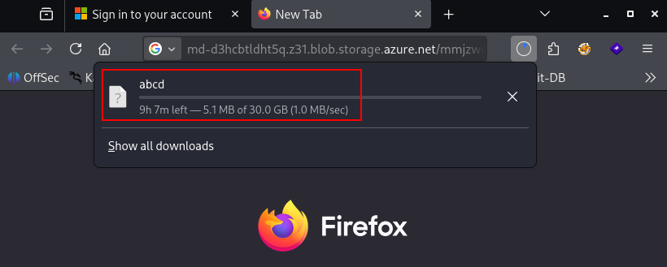

### Clone the disk with libcloudforensics

For automated disk export, collect subscription and service-principal details:

```bash
az account show
```


Create an application registration for forensics automation:

```bash
az ad sp create-for-rbac --name "forensics-sp"
```

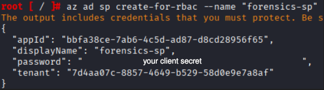

Assign **Contributor** (or a narrower custom role, if policy allows) on the subscription scope:

```bash
az role assignment create \
  --assignee <appId> \
  --role "Contributor" \
  --scope /subscriptions/<id>
```

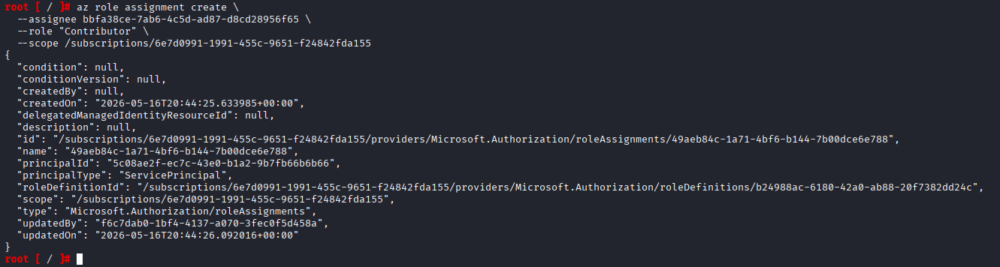

Create a Python virtual environment and install **libcloudforensics**:

```bash
python3 -m venv venv
source venv/bin/activate
pip install libcloudforensics
```

Export the credentials returned by `create-for-rbac`:

```bash
export AZURE_SUBSCRIPTION_ID="<subscription-id>"
export AZURE_TENANT_ID="<tenant-id>"
export AZURE_CLIENT_ID="<app-id>"
export AZURE_CLIENT_SECRET="<client-secret>"
```

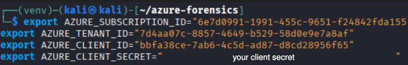

A short Python script invokes the library to copy the target disk to a storage account or local export path (content as captured in the lab):

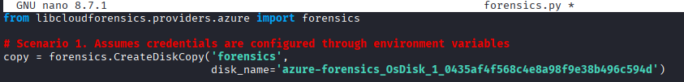

Run the script:

```bash
python3 forensics.py
```


The library provisions the copy operation in Azure; when it completes, the cloned disk image is available for imaging tools or mount-and-extract workflows on the forensic workstation.
