# docker

## Introduction and container forensics

Docker is a software platform that allows developers to create, test, and deploy applications quickly and easily using containers. It is a technology that has gained significant popularity in recent years, especially in the field of information technology.

Docker is used to encapsulate applications inside containers, meaning that each application runs in its own isolated environment. This allows developers to ensure that their applications behave consistently across different environments, regardless of hardware or software differences.

The main advantage of using Docker is the ability to create identical development and production environments, which helps guarantee the quality and consistency of applications. In addition, Docker enables continuous integration and continuous deployment, allowing developers to rapidly deploy new versions of their applications without interrupting the existing service.

Another advantage of Docker is that containers are extremely lightweight and fast to create. Containers can be started and stopped within seconds, allowing developers to test and debug applications much faster than in traditional environments.

However, there are also some disadvantages to using Docker. One of the main issues is the complexity of the platform. Docker can be difficult to learn and configure, especially for those without previous experience managing containers.

Another issue is that Docker can be slower than traditional environments in certain situations. Containers require an additional virtualization layer, which may impact performance in highly demanding environments.

Finally, another challenge when using Docker is that the technology is still evolving. As new features are added and existing capabilities are improved, it can be difficult to keep up with the changes.

## Objectives

- Learn how to perform basic operations with containers.
- Extract evidence from infrastructure systems that provide microservices through containers.

## Materials

- Any Linux distribution.
- Docker CE.
- Forensic tools:
  - Docker Forensics Toolkit
  - Sysdig
  - docker-diff
  - docker-explorer

## PART A: Introduction to Docker

Perform the following tasks:

### **1. Install Docker on a Linux distribution**

```bash
curl -fsSL https://get.docker.com -o get-docker.sh
sudo sh get-docker.sh
```

### **2. Run a Docker command that displays the installed version**

```bash
docker version
```

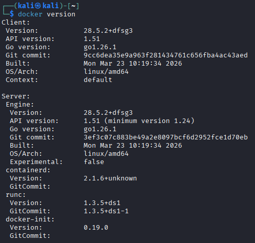

### **3. Run a Docker command that shows information about the host system**

```bash
docker info
```

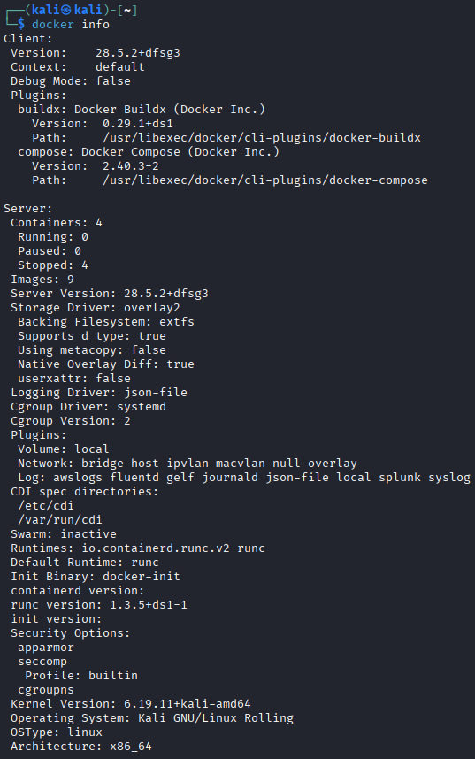

### **4. Execute the Docker command required to download the image `nginx:latest` from Docker Hub**

```bash
docker pull nginx:latest
```

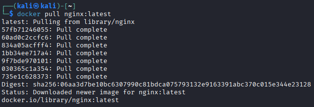

### **5. Execute the Docker command required to list locally stored images**

```bash
docker image ls
```

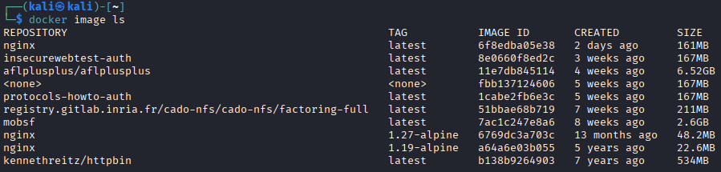

### **6. Run a container in detached mode using the image `nginx:latest`**

```bash
docker run -d --name nginx-detached nginx:latest
```

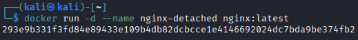

### **7. Run a container in interactive mode using the image `nginx:latest`**

```bash
docker run -it --name nginx-interactive nginx:latest /bin/bash
```

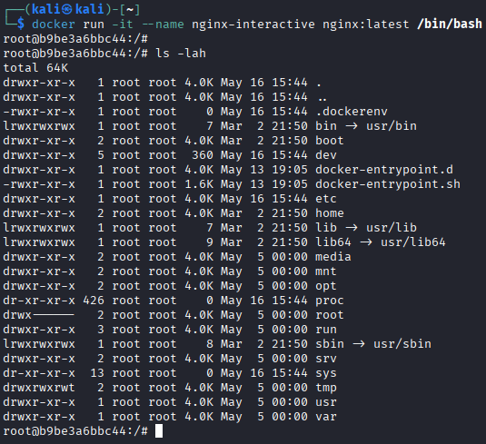

NOTE: You can exit from the container with `exit`

### **8. Execute the Docker command required to list running containers**

```bash
docker ps
```

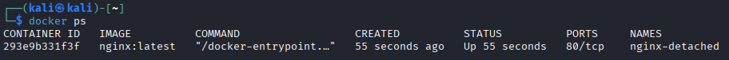

### **9. Inspect all the properties of one of the containers**

```bash
docker inspect nginx-detached
```

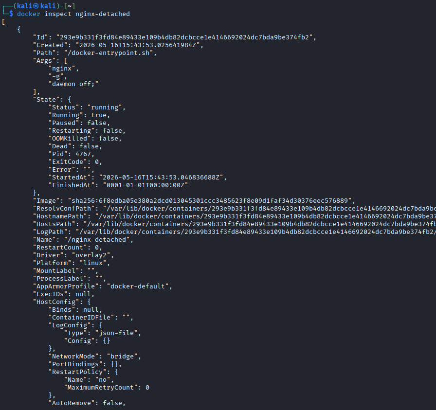

### **10. Execute the Docker command required to list the networks configured for Docker**

```bash
docker network ls
```

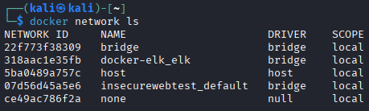

### **11. Attach the console to one of your containers**

```bash
docker attach nginx-detached
```

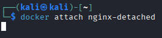

### **12. Execute a `/bin/bash` command inside one of your containers in interactive mode**

```bash
docker exec -it nginx-detached /bin/bash
```

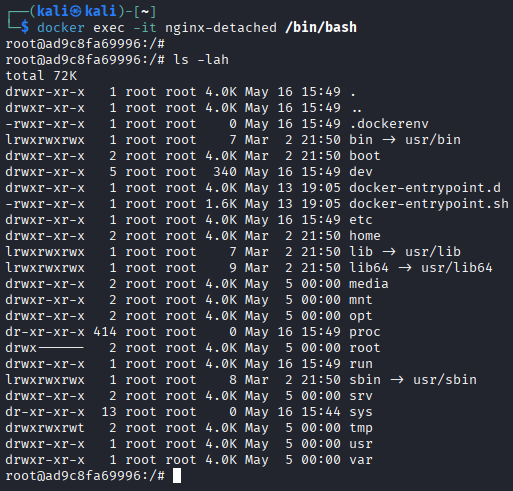

### **13. Stop one of your containers**

```bash
docker stop nginx-detached
```

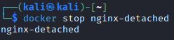

### **14. Start the previous container again**

```bash
docker start nginx-detached
```

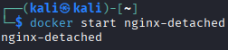

### **15. Delete one of your containers**

```bash
docker rm -f nginx-detached
```

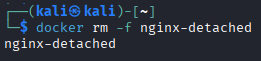

note: the -f parameter is necessaty as the container is starrted, otherwhise we had to stop the conteiner and remove it

### **16. Create a container from a Dockerfile**

```Dockerfile
# Base image
FROM ubuntu

# Copy the file 'script' to the root directory of the container
COPY script /

# Give execute permissions to the file
RUN chmod +x /script
```

Build the image:

```bash
docker build -t myubuntu .
```

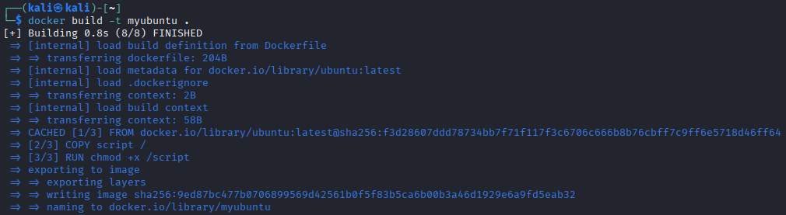

Run the container:

```bash
docker run -d --name mycontainer myubuntu
```

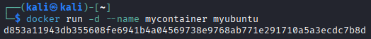

### **17. Convert the previous container into an image called `mydebian`**

```bash
docker commit mycontainer mydebian
```

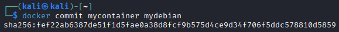

```bash
docker image ls
```

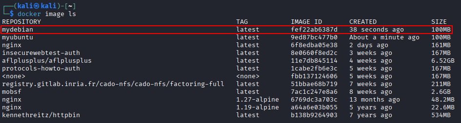

### **18. Export the image `mydebian` as a file**

```bash
docker save -o mydebian.tar mydebian
```

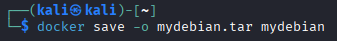

```bash
ls mydebian.tar
```

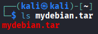

### **19. Export the `nginx` container as a file**

```bash
docker export nginx-detached -o nginx-container.tar
```

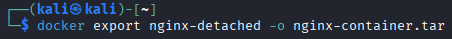

```bash
ls nginx-container.tar
```


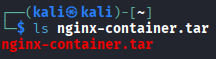

### **20. Delete one of your containers**

```bash
docker rm -f mycontainer
```

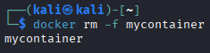

### **21. Delete the image `mydebian`**

```bash
docker image rm mydebian
```

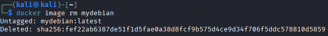

## PART B: Docker Forensics

### **1. Read the following [article](https://www.redhat.com/en/blog/docker-forensics-for-containers-how-to-conduct-investigations). From a computer forensics perspective, what lessons can we learn regarding evidence acquisition or incident response involving containers?**

A diferencia de las maquinas virtuales no tenemos opciones como son las snapshot para recolectar evidencias de forma facil y sencilla, sin embargo, si que existen buenas herramientas que podemos utilizar en este contexto, como son:

- `docker commit`: Esto nos sirve para convertir un docker a imagen y capturar las modificaciones de este, lo unico malo es que no guarda el estado de ejecución de los procesos.
- `dd`: Puede servirnos para capturar la memoria RAM del docker.

Debido a su propia naturaleza los dockers son efimeros, esto complica reconstruir los eventos que puedan haberse detenido.

Cirtas configuraciones hacen posible que un atacante escape del docker, si vemos indicios de que esto se ha producido, como si el docker se ejecuto con privilegios excesivos, `--privileged`,`--mount` o `--pid host` seria prudente escalar la investicación al host.

### **2. Read the help documentation for the following Docker command modifiers: [DIFF](https://docs.docker.com/reference/cli/docker/container/diff/), [SAVE](https://docs.docker.com/reference/cli/docker/image/save/), [EXPORT](https://docs.docker.com/reference/cli/docker/container/export/), [LOAD](https://docs.docker.com/reference/cli/docker/image/load/), and [IMPORT](https://docs.docker.com/reference/cli/docker/image/import/). Explain how they may be useful for forensic tasks. Provide examples using each modifier.**

`diff`: Muestra los cambios en el docker respecto a su imagen original, esto nos puede ayudar a detectar ficheros modificados por un atacante e identificar malware, incluso de persistencia.  
`save`: Exporta una imagen completa como fichero, esto es muy util, principalmente para mover las evidencias de el dispositivo en el que fueron hayadas al dispositivo en el que seran analizadas.  
`export`: Exporta el sistema de ficheros de un contenedor como fichero .tar. Esto puede ser util para obtener una copia exacta del contenido del contenedor de forma rapida.  
`load`: Importa una imagen previamente guardada en fichero usando `docker save`, sirve para restaurar imagenes en otro sistema para su analisis.  
`import`: Importa un fichero .tar generado con export y crea una imagen con el.

#### DIFF

```bash
docker diff nginx-detached
```

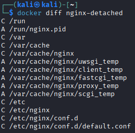

#### SAVE

```bash
docker save -o nginx-image.tar nginx:latest
```

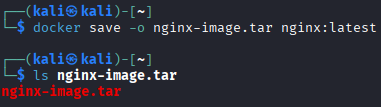

#### EXPORT

```bash
docker export nginx-detached -o nginx-container.tar
```

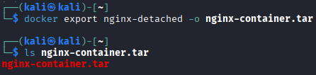

#### LOAD

```bash
docker load -i nginx-image.tar
```

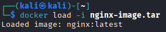

#### IMPORT

```bash
docker import nginx-container.tar imported-nginx
```

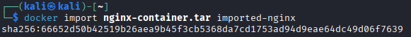

Run the imported image:

```bash
docker run -it imported-nginx /bin/bash
```

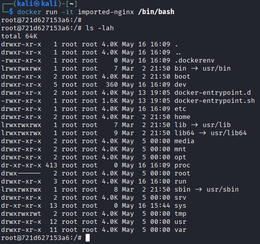

### **3. Review the documentation for the utility [docker-diff](https://github.com/GoogleContainerTools/container-diff), which is used to compare local Docker images against those hosted in Docker Hub. Download the utility and perform a test.**

Install container-diff:

```bash
wget https://github.com/GoogleContainerTools/container-diff/releases/download/v0.17.0/container-diff-linux-amd64 -O container-diff
chmod +x container-diff
sudo mv container-diff /usr/local/bin/
```

Verify installation:

```bash
container-diff version
```

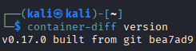

Analyze an image:

```bash
container-diff analyze daemon://nginx:latest
```

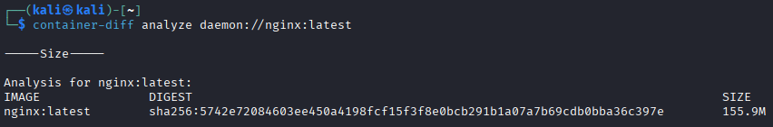

Analyze filesystem contents:

```bash
container-diff analyze daemon://nginx:latest --type=file
```

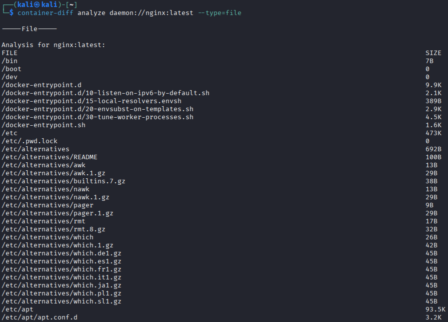

Analyze installed packages:

```bash
container-diff analyze daemon://nginx:latest --type=apt
```

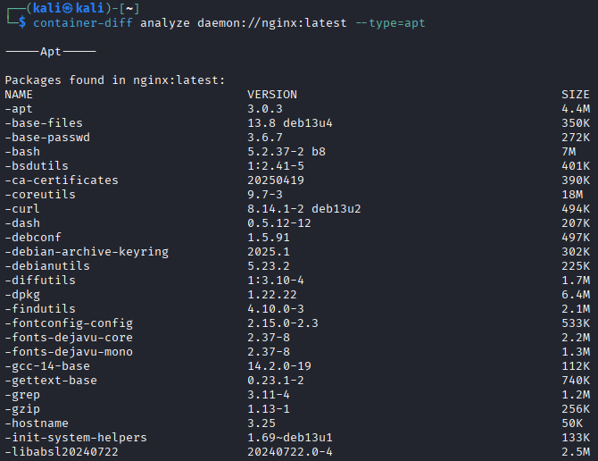

Analyze image history:

```bash
container-diff analyze daemon://nginx:latest --type=history
```

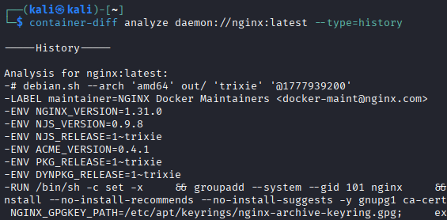

Compare two images:

```bash
container-diff diff daemon://nginx:latest daemon://<other-container>
```

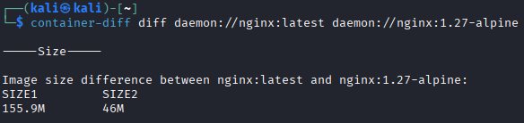

Compare filesystem differences:

```bash
container-diff diff daemon://nginx:latest daemon://<other-container> --type=file
```

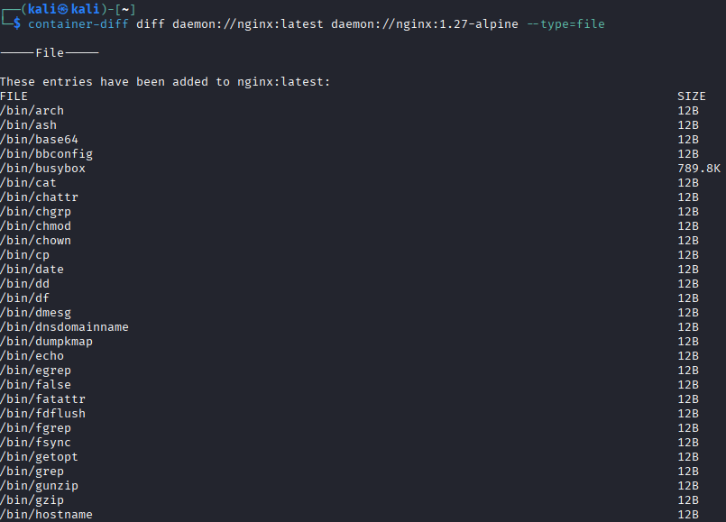

Compare installed packages:

```bash
container-diff diff daemon://nginx:latest daemon://<other-container> --type=apt
```

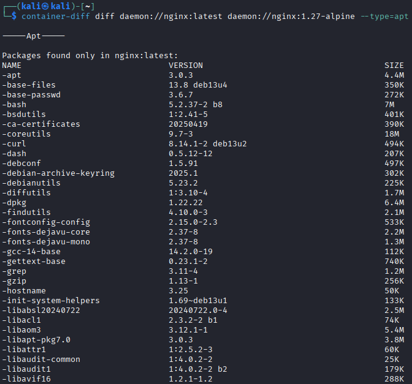

Compare image history:

```bash
container-diff diff daemon://nginx:latest daemon://<other-container> --type=history
```

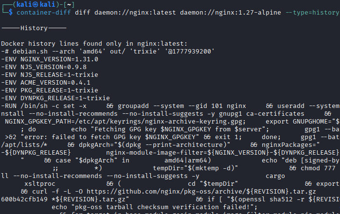

### **4. Within the context of an ongoing investigation, a logical image corresponding to a Docker installation from a suspicious computer system has been obtained. It is suspected that this installation may have been used to conceal activities.**

As a forensic analyst, you have been tasked with performing a thorough analysis of the Docker logical image in order to identify the services being provided.

#### **a. [Download](https://drive.usercontent.google.com/download?id=1bFlnUBg1GH17h8pIQRywhDkHbNeTjvNZ&export=download&authuser=1) a forensic copy of the Docker logical image**

it has been saved in ~/docker

Install docker-explorer:

```bash
python3 -m venv de-env
source de-env/bin/activate
pip install docker-explorer
```

#### **b. Perform an analysis of the Docker configuration and the containers hosted within the image**

List all containers:

```bash
sudo de-env/bin/de.py -r /var/lib/docker list all_containers
```

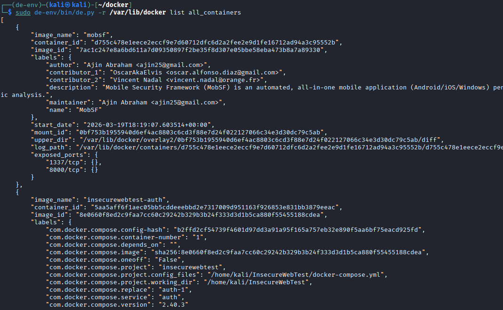

from this json we can get these results:

| Image Name | Container ID | Image ID | Start Date | Mount Points | Exposed Ports | Log Path |
|------------|--------------|----------|------------|--------------|----------------|----------|
| homeassistant/home-assistant:latest | 4ea041fd90ad823353e5a62f395f5ddab3c8096a4cbf1816eb5c4f88169d0818 | 306f9233e149f606d94e7bb3c746cba599b2d3fd3e1080d9d05175daa02f9ae3 | 2023-04-19T15:47:23.510586+00:00 | var/lib/docker/volumes/ha_vol/_data → /config | 8123/tcp | /var/lib/docker/containers/4ea041fd90ad823353e5a62f395f5ddab3c8096a4cbf1816eb5c4f88169d0818/4ea041fd90ad823353e5a62f395f5ddab3c8096a4cbf1816eb5c4f88169d0818-json.log |
| nextcloud | 5e38912f3093be4e81cedbf8290a084345f81425cd3bc0e6ae940a12fc93aaed | 964325ce9b9519b517f852b8b24e0d0a945edd5521b2eee5e0f94254d67821ee | 2023-04-20T07:51:42.664787+00:00 | var/lib/docker/volumes/nextcloud/_data → /var/www/html  <br>var/lib/docker/volumes/config/_data → /var/www/html/config  <br>var/lib/docker/volumes/apps/_data → /var/www/html/custom_apps | 80/tcp | /var/lib/docker/containers/5e38912f3093be4e81cedbf8290a084345f81425cd3bc0e6ae940a12fc93aaed/5e38912f3093be4e81cedbf8290a084345f81425cd3bc0e6ae940a12fc93aaed-json.log |
| nginx:latest | e7cae6335bef239e2b827b717eb442a3b5e7a385d30ac7c03bfb4b6ba337eaf3 | 6efc10a0510f143a90b69dc564a914574973223e88418d65c1f8809e08dc0a1f | 2023-04-20T07:54:41.608245+00:00 | var/lib/docker/home/azureuser/html → /usr/share/nginx/html | 442/tcp, 80/tcp | /var/lib/docker/containers/e7cae6335bef239e2b827b717eb442a3b5e7a385d30ac7c03bfb4b6ba337eaf3/e7cae6335bef239e2b827b717eb442a3b5e7a385d30ac7c03bfb4b6ba337eaf3-json.log |

#### **c. You may follow the steps described in this [article](https://osdfir.blogspot.com/2021/01/container-forensics-with-docker-explorer.html)**

### **5. [Docker Scout](https://www.docker.com/products/docker-scout/) is a collection of features that provides detailed information about the composition and security of container images. It is used to analyze image contents and generate detailed reports about packages and vulnerabilities detected. It can also provide suggestions on how to remediate issues discovered during image analysis. Install Docker Scout and perform a small test.**

Login to Docker:

```bash
docker login
```

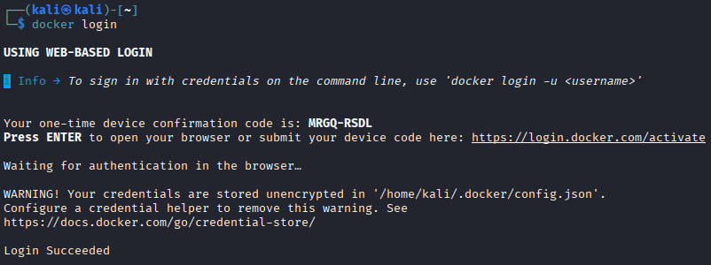

Install Docker Scout:

```bash
curl -L https://github.com/docker/scout-cli/releases/download/v1.20.4/docker-scout_1.20.4_linux_amd64.tar.gz -o docker-scout.tar.gz

tar -xzf docker-scout.tar.gz

mkdir -p ~/.docker/cli-plugins

mv docker-scout ~/.docker/cli-plugins/docker-scout

chmod +x ~/.docker/cli-plugins/docker-scout
```

Verify installation:

```bash
docker scout version
```

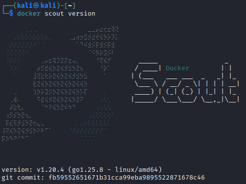

Analyze an image:

```bash
docker scout quickview nginx:latest
```

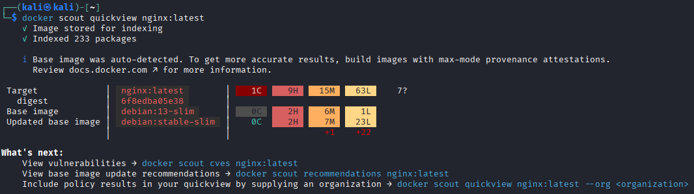

Detailed CVE analysis:

```bash
docker scout cves nginx:latest
```

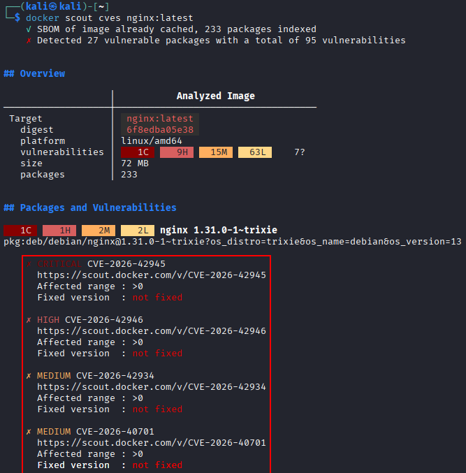

Recommendations:

```bash
docker scout recommendations nginx:latest
```

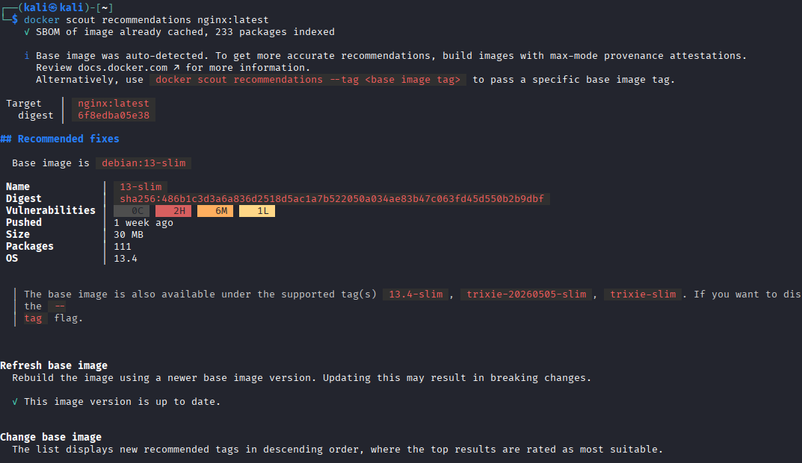

### **6. Read the following [article](https://tbhaxor.com/analyzing-docker-image-for-hunting-secrets/). From a forensic perspective, what are checkpoints useful for?**

Los checkpoints de Docker son herramientas fundamentales que permiten capturar el estado de ejecucion completo de un docker en un momento dado, permitiendo asi preservar la memoria volatil y el estado de los procesos en ejecución.


Se podría hacer así, pero es necesario tener las funciones experimentales de docker:


Install CRIU:

```bash
sudo apt install criu
```

Create a checkpoint:

```bash
docker checkpoint create nginx-detached checkpoint1
```

Start the container from the checkpoint:

```bash
docker start --checkpoint checkpoint1 nginx-detached
```

List checkpoints:

```bash
ls /var/lib/docker/containers/<container_id>/checkpoints/
```