# Email Forensic Analysis

## Introduction

Email is one of the most common communication methods nowadays. Social networking sites have recently started to surpass email, but social networks are still mainly used for private communications.

Companies use email to communicate with future, current, and past customers.

- Companies use email to provide customer service, product support, and ongoing communication about product or policy changes.
- Help desk applications receive emails to create support tickets.
- Computers and applications send email alerts to administrators.

For a moment, think about how it would affect you if email stopped working for a day.

Email was not originally designed with security in mind. It was originally created to send text messages to designated people on a single machine and later through simple networks. The design allows malicious users to redirect email messages. It also allows anyone with access to a system that processes email to modify an email message.

Anyone with access to networks where emails are transmitted or to computers where emails are processed can read the emails stored there.

There is no built-in mechanism to make email confidential (such as encryption), to verify that the content of an email has not been modified (such as hashing), or to verify who sent the email (such as a digital signature).

Email does not have a built-in method to verify the identity of a sender. Although we are trusted to enter our correct identity into our email programs, nothing prevents us from using fraudulent addresses.

Someone can configure an email program to send emails with fake addresses, and even without an email client, it is quite trivial to use simple tools such as Telnet to create fraudulent emails with forged sender addresses. Some email providers try to solve this issue with special configurations on their mail servers, but many others do not.

Email was never created to maintain the confidentiality and privacy of email content. The text of a message is transmitted in plain text, meaning that anyone with a tool capable of monitoring the network can read the email.

Basic tools such as network monitoring utilities or packet sniffers can view emails. Common tools such as regular email clients and Telnet can also be used to create fraudulent emails.

The good news is that there are tools available that can overcome these challenges.

## Objectives

- Become aware of all important security aspects related to email.
- Learn how to study forensic evidence provided by email headers.

## Materials

- Webmail
- Online tools
- Email clients: Thunderbird and Outlook

## Tasks

### 1) Familiarization with Email Headers

**a) Open your personal webmail account.**

In this practice I will use __________________ as my email provider / webmail client.

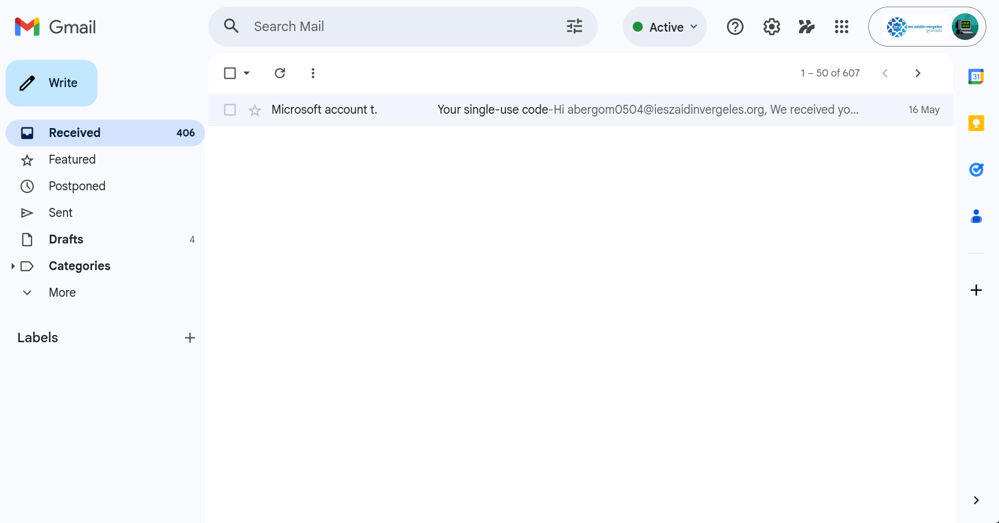

**b) Access the full format of one of your emails.**

To access the original email source code, I opened the selected email and used the option that allows viewing the complete message source / original content.

Brief explanation of the process followed:

- Step 1:
- Step 2:
- Step 3:

Once opened, the complete raw email becomes visible, including all the headers generated during the delivery process.

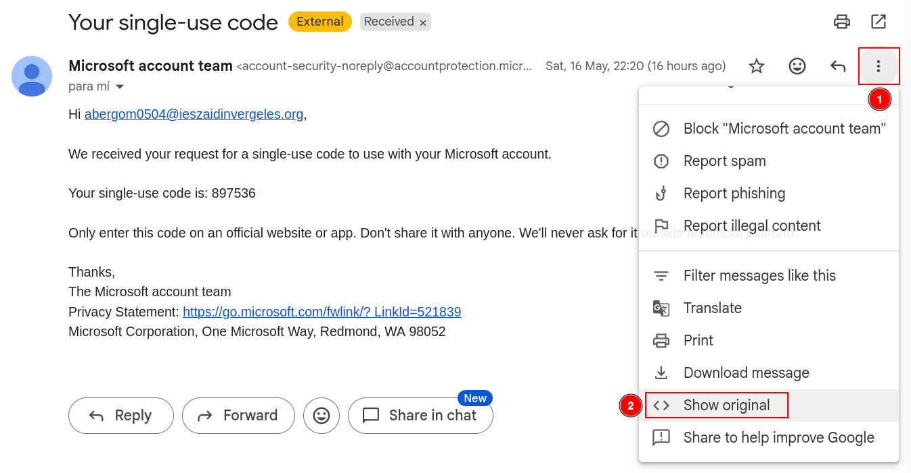

**c) Copy the complete format and use a tool to analyze the email headers.**

For the analysis of the email headers, I used the following tool:

https://toolbox.googleapps.com/apps/messageheader/analyzeheader

Procedure followed:

- Copy the full raw email.
- Paste the content into the analysis tool.
- Review the generated forensic information.

The tool provides information related to:

- Message routing
- Origin servers
- Authentication mechanisms
- Delivery timestamps
- SPF, DKIM and DMARC validation

General observations obtained during the analysis:

- 
- 
- 

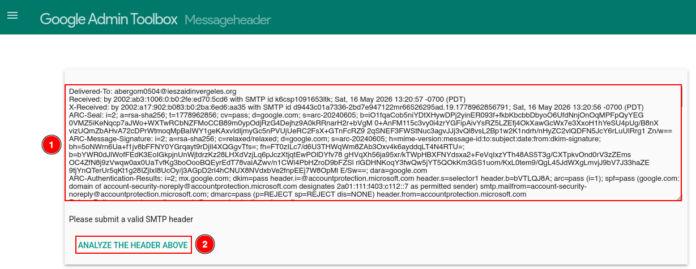

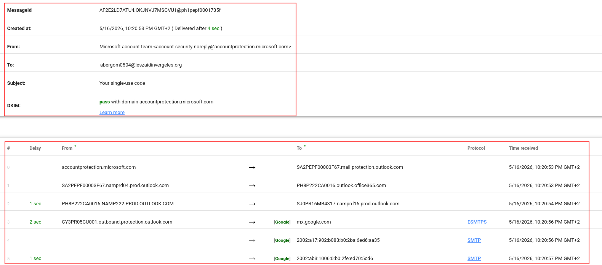

---

**d) Comment on the meaning of the headers.**

The headers of an email contain metadata generated during the transmission process between servers. These headers are essential in forensic investigations because they help identify the origin of a message, the route followed, and whether authentication mechanisms were correctly applied.

| Header | Meaning |
|---|---|
| Message-ID | Unique identifier generated by the sending server. |
| Date | Date and time when the message was sent. |
| From | Sender email address. |
| To | Recipient email address. |
| Subject | Subject of the email. |
| Return-Path | Address where delivery errors are returned. |
| Received | Shows the route followed between mail servers. |
| SPF | Verifies whether the sending server is authorized to send emails for the domain. |
| DKIM | Verifies message integrity using digital signatures. |
| DMARC | Defines policies for SPF and DKIM validation failures. |
| MIME-Version | Indicates the MIME version used in the message. |
| Content-Type | Indicates the content format of the message. |

Additional notes and observations:

- 
- 
- 

---

**e) Learn how to verify the DKIM information (selector, domain, and public DKIM key) that appears in the header: https://dkimcore.org/tools/**

To verify DKIM information, the first step is locating the `DKIM-Signature` header inside the raw email source.

Inside this header, the following fields are especially important:

- `d=` → Signing domain
- `s=` → DKIM selector

Example:

- Domain:
- Selector:

These values can then be introduced into the DKIMCore tool to retrieve and validate the public DKIM key published in DNS.

Process followed:

- Locate the DKIM-Signature line.
- Identify the selector and domain.
- Use the DKIMCore tool.
- Validate whether the signature is legitimate.

Conclusions obtained:

- 
- 
- 

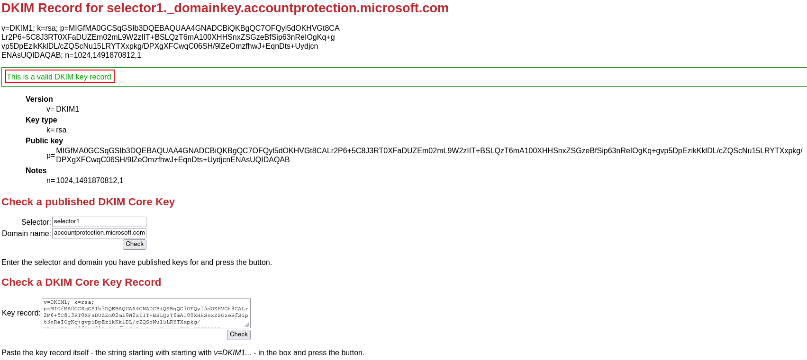

---

### 2) Spoofing

**a) Use an online tool to send yourself an email using identity spoofing techniques. For example, send yourself an email with the sender address: billgates@microsoft.com and your own email address as the recipient.**

For this test I used the following online spoofing platform:

https://emkei.cz/

Objective of the test:

- Simulate a spoofed email.
- Observe whether the message reaches the inbox.
- Analyze how modern mail systems react to spoofed messages.

Configuration used:

- Sender:
- Recipient:
- Subject:
- Message content:

After sending the message, I waited for the delivery result and checked both the inbox and spam folders.

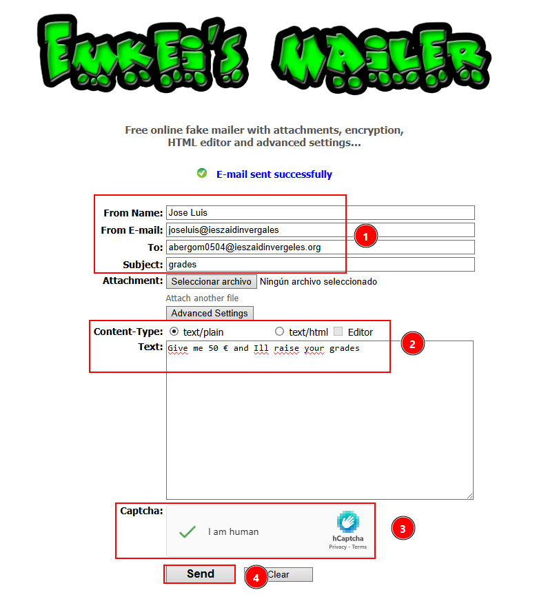

no llega ningún correo por las firmas SPF, si fuese un server que no las verifica, sí que podríamos verlos

---

**b) Explain which tools or protections prevent the email from reaching your inbox.**

Modern email providers implement multiple protection technologies designed to detect spoofed or malicious emails.

Main protections identified during the test:

#### SPF (Sender Policy Framework)

SPF verifies whether the sending server is authorized to send emails on behalf of a domain.

General operation:

- The domain owner publishes authorized mail servers in DNS.
- The receiving server compares the sender IP against the SPF record.
- Unauthorized senders may be rejected or marked as spam.

Observations:

- 
- 
- 

#### DKIM (DomainKeys Identified Mail)

DKIM adds a cryptographic signature to the email.

General operation:

- The sending server signs the message using a private key.
- The recipient verifies the signature using the public DNS key.
- If the message was modified or unsigned, verification fails.

Observations:

- 
- 
- 

#### DMARC (Domain-based Message Authentication, Reporting and Conformance)

DMARC combines SPF and DKIM results and applies policies defined by the domain owner.

Possible actions:

- Reject the message
- Send the message to quarantine/spam
- Allow delivery

Observations:

- 
- 
- 

General conclusion:

- 
- 
- 

---

**c) Repeat the sending process from section a), but this time use: billgates@microsoft.com as the sender and use the email address provided by: https://dkimvalidator.com/ as the recipient.**

For this second test, the spoofed email was sent to the temporary address generated by DKIMValidator.

Configuration used:

- Sender:
- Recipient:
- Subject:
- Content:

The objective of this test is to study the raw email and authentication results in an environment that allows unsafe emails to be analyzed instead of blocked.

Image placeholder.

https://dkimvalidator.com/

https://emkei.cz/

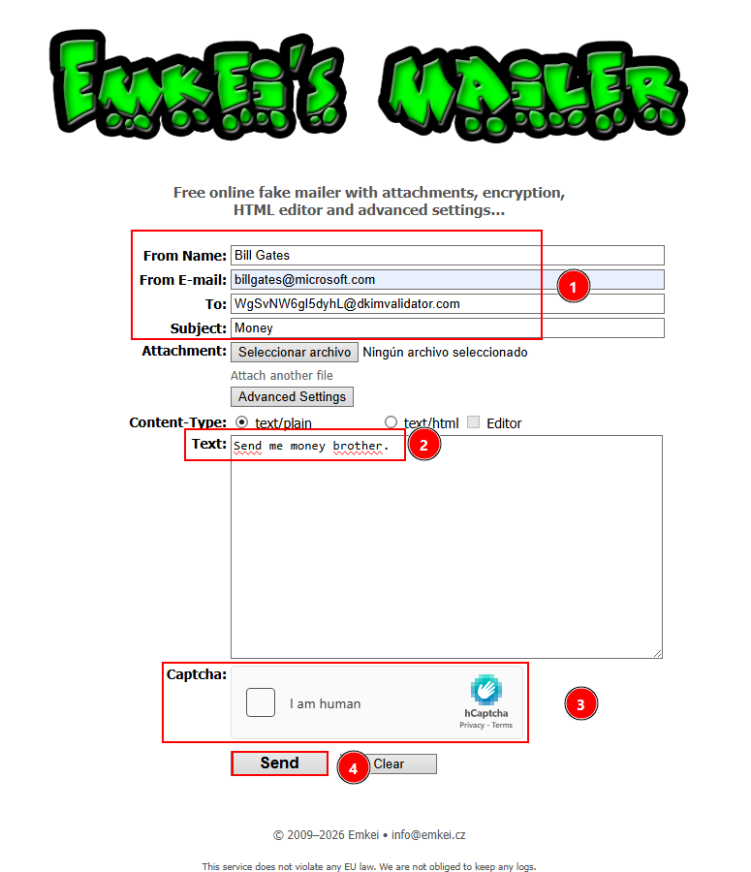

**d) Analyze the received email.**

Once the message was received, the raw email source and validation results were analyzed.

Relevant findings:

#### Received Headers

Important observations about the delivery route:

- 
- 
- 

#### SPF Validation

Result obtained:

- 

Explanation:

- 
- 
- 

#### DKIM Validation

Result obtained:

- 

Explanation:

- 
- 
- 

#### DMARC Validation

Result obtained:

- 

Explanation:

- 
- 
- 

#### Additional Indicators

Other suspicious elements identified:

- Sending server IP
- Mismatch between sender and origin server
- Missing signatures
- Suspicious Reply-To fields
- Unusual routing behavior

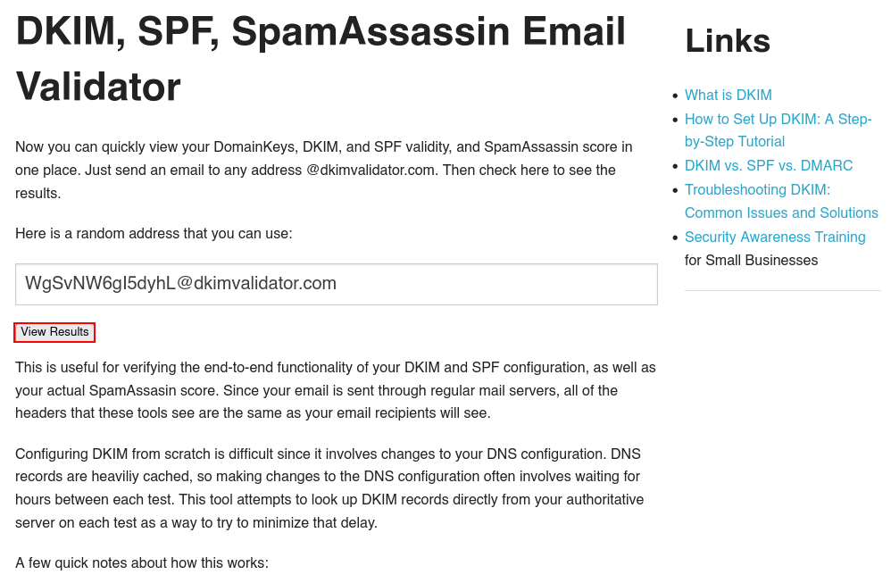

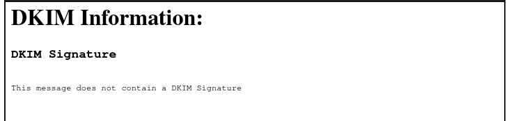

---

**e) Explain the conclusions you reached and the role that SPF, DKIM, and DMARC technologies play in preventing spoofing attacks.**

After completing the spoofing tests, several conclusions can be obtained regarding modern email security mechanisms.

Main conclusions:

- Email spoofing is technically simple to perform.
- Modern providers use multiple verification layers.
- SPF validates authorized sending servers.
- DKIM validates message integrity and authenticity.
- DMARC applies policies when SPF or DKIM validations fail.
- Most spoofed emails are either blocked or moved to spam folders.

Importance in forensic investigations:

- Headers provide evidence about the real origin of a message.
- Authentication failures help identify spoofing attempts.
- Server routing information can reveal suspicious infrastructure.

Final reflections:

- 
- 
- 

---

### 3) Install the Most Common Email Clients

**- Install Mozilla Thunderbird and Outlook.**

For this part of the practice, both Thunderbird and Outlook were installed and configured.

Installation notes:

#### Mozilla Thunderbird

Official website:

https://www.thunderbird.net/

Installation process followed:

- 
- 
- 

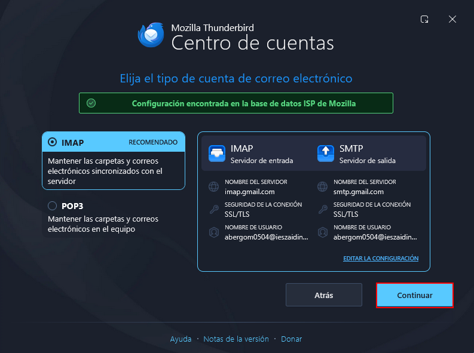

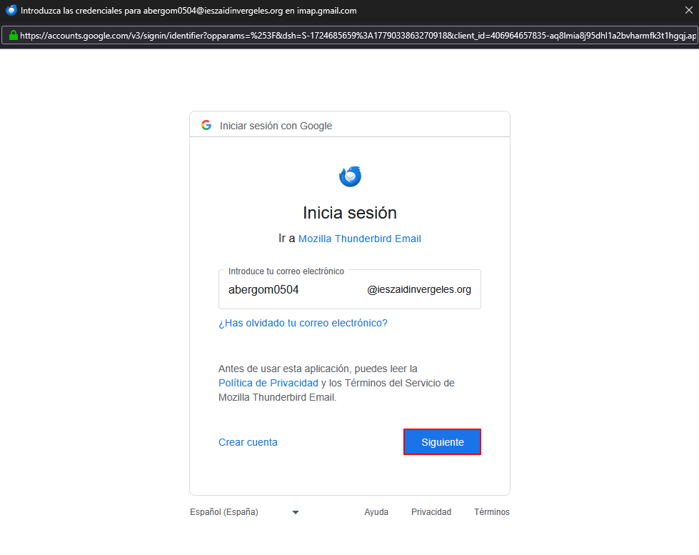

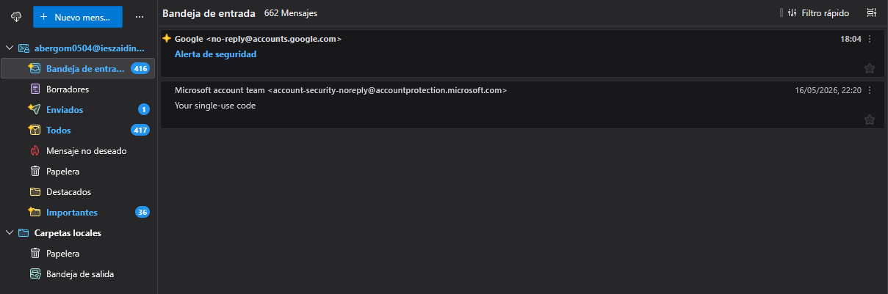

#### Outlook

Official website:

https://www.microsoft.com/

Installation process followed:

- 
- 
- 

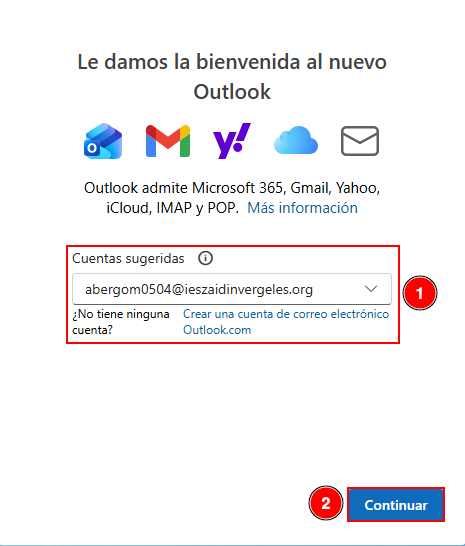

metemos la cuenta como antes

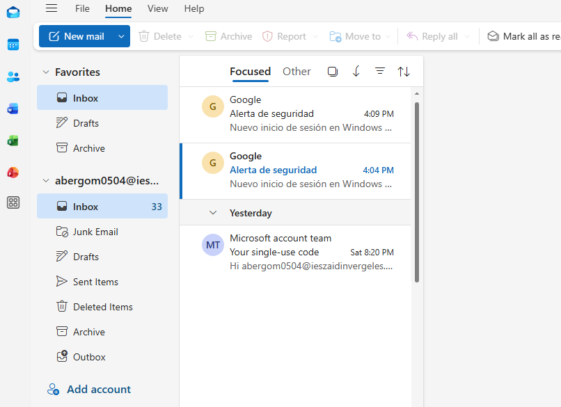

---

**- Learn how to configure your email account in both clients. It is recommended to use IMAP.**

Both email clients were configured using the IMAP protocol.

Configuration information:

| Protocol | Purpose |
|---|---|
| IMAP | Synchronizes emails with the server while keeping remote copies. |
| SMTP | Used for sending emails. |

General configuration process:

- Enter email address and password.
- Configure IMAP and SMTP servers.
- Validate credentials.
- Synchronize mailbox content.

Relevant observations:

- 
- 
- 

Image placeholder. EXPÑICADO ARRIBA,. CAMBIAR DE SITIO, ARRIBA NO POENER FOTOS Y YA

---

**- Investigate the files they use for storage and which ones may contain forensic evidence.**

Email clients store large amounts of forensic evidence locally.

#### Thunderbird Storage

Default paths investigated:

Windows:

`C:\Users\<USER>\AppData\Roaming\Thunderbird\Profiles\`

Important forensic artifacts:

- Inbox
- Sent
- Drafts
- Trash
- mbox files
- SQLite databases
- Account configuration files

Observations:

- 
- 
- 

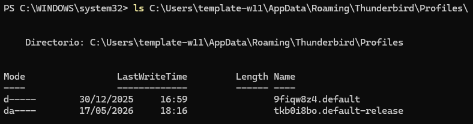

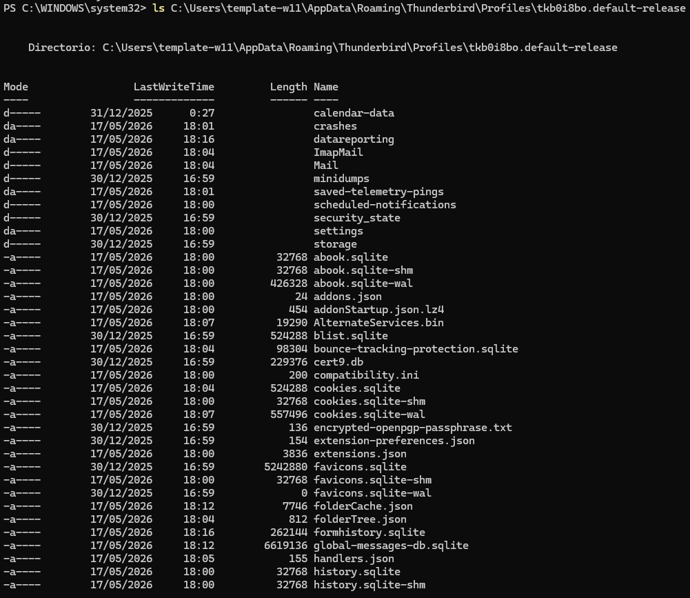

#### Outlook Storage

Default paths investigated:

Windows:

`C:\Users\<USER>\AppData\Local\Microsoft\Olk\`

Important forensic artifacts:

- PST files
- OST files
- Logs
- Cached attachments
- Account metadata

Observations:

- 
- 
- 

---

**- Imagine that, during a disk clone analysis in a forensic investigation, we locate a Thunderbird profile directory. It would be interesting to access those emails, right? Search for “generic” tools capable of visualizing or interpreting the information stored in Thunderbird’s storage directory.**

During a forensic investigation, recovering email evidence from Thunderbird profiles can provide valuable information.

Generic tools identified for analyzing Thunderbird data:

| Tool | Purpose |
|---|---|
| Thunderbird | Directly loads profile folders and emails. |
| Mbox Viewer | Reads Thunderbird mbox email files. |
| 4n6 Thunderbird Forensics Wizard | Specialized forensic analysis tool. |
| Autopsy | Digital forensics platform capable of analyzing email artifacts. |
| FTK Imager | Used to inspect files extracted from disk images. |

Possible forensic evidence recovered:

- Sent emails
- Deleted emails
- Attachments
- Metadata
- Contacts
- Account information
- Login traces

Final conclusions for this section:

- 
- 
- 

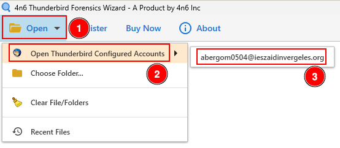

