# Email Postmortem Analysis

## Introduction

In the context of cybersecurity and digital forensic analysis, the study of email headers is a key technique used to verify the authenticity of a message, identify possible manipulations, and trace its origin. Headers contain fundamental metadata documenting the route followed by the message through different mail servers, as well as information about the sender identity and message integrity.

During a postmortem analysis of a device, it is common to work with different email storage formats, each associated with different email clients. Among the most common are:

- **PST (Personal Storage Table) and OST (Offline Storage Table)**: used by Microsoft Outlook to locally store emails (PST) or to work offline (OST).
- **MBOX**: a generic format used by clients such as Mozilla Thunderbird, Apple Mail, or Eudora.
- **EML and MSG**: formats where each file represents a single email message. Common in Outlook Express and Outlook, respectively.
- **DBX and MBX**: used by older versions of Outlook Express and Eudora.
- **NSF (Notes Storage Facility)**: used by IBM Lotus Notes to store emails, calendars, and other data.

Beyond format decoding, the technical analysis focuses on validating authentication mechanisms such as SPF (Sender Policy Framework), which verifies whether the sending server is authorized by the domain; DKIM (DomainKeys Identified Mail), which checks whether the message content has been altered; and DMARC (Domain-based Message Authentication, Reporting and Conformance), which establishes policies for handling unauthenticated messages.

Understanding these elements is essential for detecting fraud such as phishing, protecting corporate infrastructures, and reinforcing trust in email communications. This practice aims to familiarize students with the structure of email headers and the different formats in which an email can be stored, as well as the methods used to authenticate its legitimacy.

## Objectives

- Determine the authenticity of emails.
- Decode different email storage formats.

## Tasks

**1) Analyze manually the headers of the emails [1.eml to 4.eml](https://drive.google.com/drive/folders/1eCf4lSlRlIV_pWohS1LAqlE67_1GWC7g). Justify whether there is absolute certainty about their authenticity or whether there are any doubts regarding it.Finally, verify the headers using a tool similar to: [https://mxtoolbox.com/](https://mxtoolbox.com/). If any discrepancy appears between your analysis and the tool’s analysis, justify the reason for it.**

### Email 1

Open the first `.eml` file using a compatible email client or a text editor.

Inspect the following elements:

- Sender address
- Recipient address
- Subject
- Date
- `Received` headers
- SPF validation
- DKIM validation
- DMARC validation
- Sending infrastructure

Check whether the sender domain matches the servers that handled the email.

Write down any suspicious indicators or any signs that suggest the email is legitimate.

Image placeholder.

#### Manual Analysis

- 
- 
- 

#### Automated Analysis

Use an online tool such as:

- https://mxtoolbox.com/
- https://toolbox.googleapps.com/apps/messageheader/

Compare the automated results with your manual investigation.

- 
- 
- 

---

### Email 2

Repeat the same process with the second email.

Pay special attention to:

- Missing DKIM signatures
- SPF failures or neutral results
- Spam indicators
- Exchange or Outlook routing information
- Suspicious sender infrastructure

Image placeholder.

#### Manual Analysis

- 
- 
- 

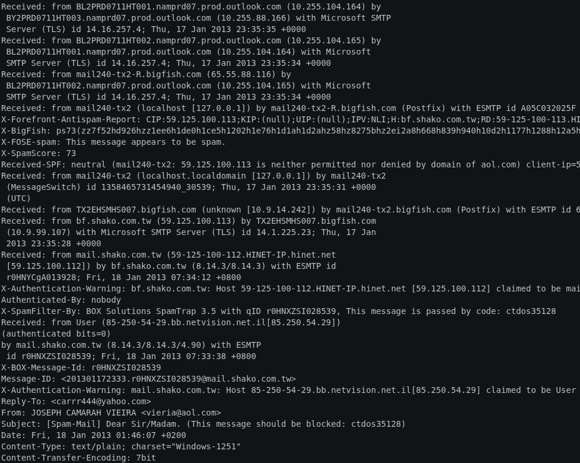

#### Automated Analysis

Compare your conclusions against the online analysis tool.

- 
- 
- 

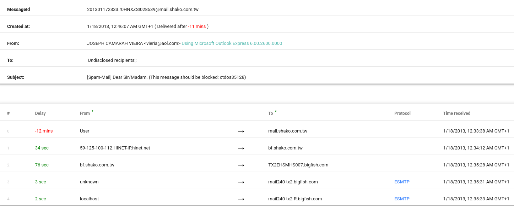

---

### Email 3

Inspect the email headers and authentication mechanisms.

Verify whether:

- SPF passes correctly
- DKIM signatures exist
- DMARC validation succeeds
- Routing information appears legitimate
- Attachments are referenced

Image placeholder.

#### Manual Analysis

- 
- 
- 

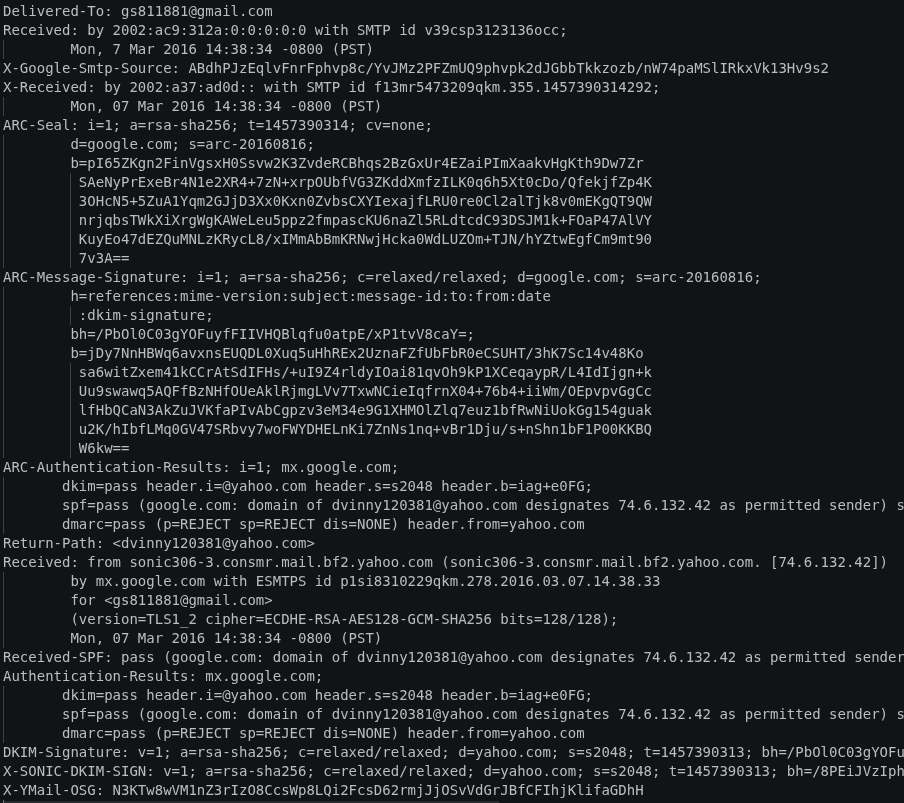

#### Automated Analysis

Analyze the email using the selected header analysis platform.

- 
- 
- 

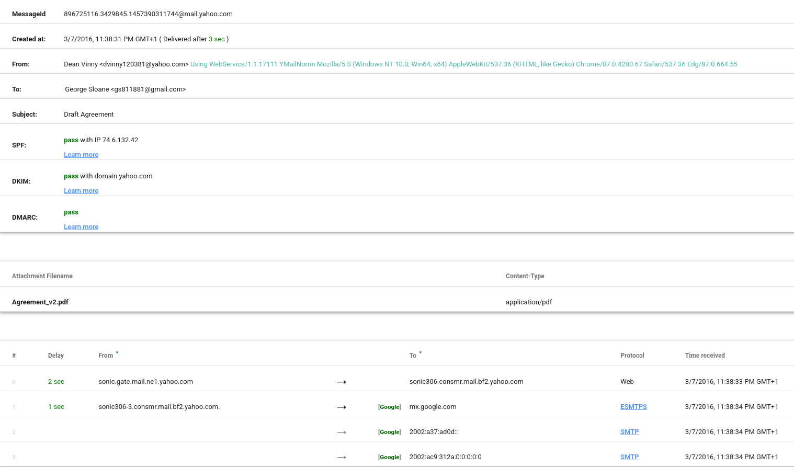

---

### Email 4

Analyze the final email carefully.

Potential suspicious indicators may include:

- Strange sender domains
- SPF softfail or fail
- Missing DKIM
- Unauthorized sending IPs
- Suspicious routing paths
- Rejected authentication attempts

Image placeholder.

#### Manual Analysis

- 
- 
- 

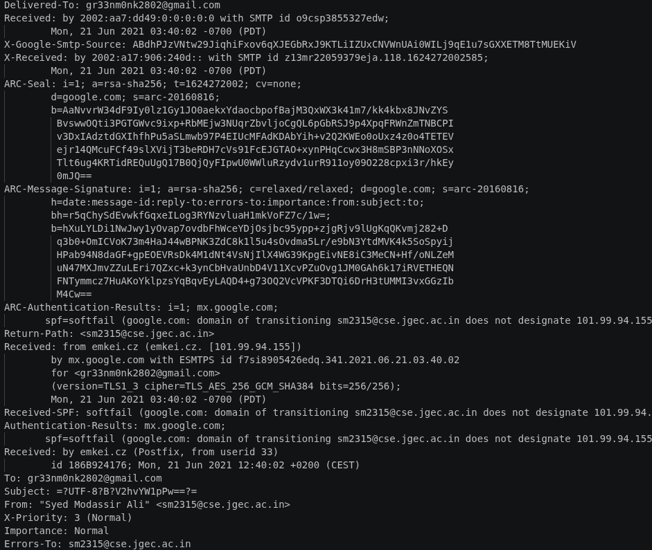

#### Automated Analysis

Compare your manual analysis with the automated results.

- 
- 
- 

**2) Imagine that during a forensic postmortem analysis of a disk image you extracted different forensic artifacts with [PST and MBOX](https://drive.google.com/drive/folders/1eCf4lSlRlIV_pWohS1LAqlE67_1GWC7g) extensions. Investigate which applications, preferably open source, can be used to access their contents.**

### PST Files

Research applications capable of opening `.pst` files.

Possible tools:

- Microsoft Outlook
- XstReader
- LibPST
- readpst

For each tool, investigate:

- Installation process
- Supported formats
- Whether it is open source
- Main forensic usefulness

Image placeholder.

#### Notes and Observations

- 
- 
- 

https://apps.microsoft.com/detail/9nrd5bnb4tnl?hl=es-ES&gl=ES

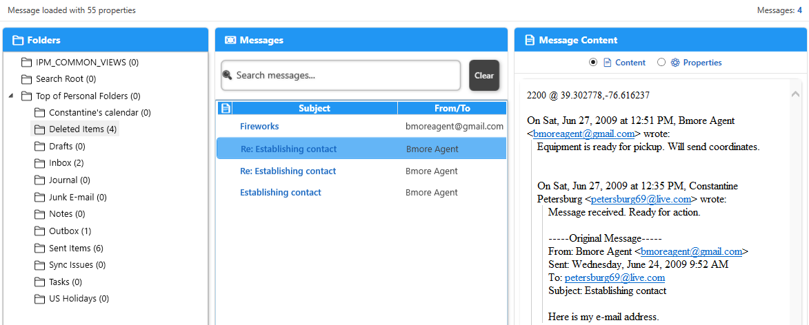

---

### MBOX Files

Research tools capable of reading `.mbox` files.

Possible tools:

- Thunderbird
- Mbox Viewer
- Aid4Mail
- Autopsy

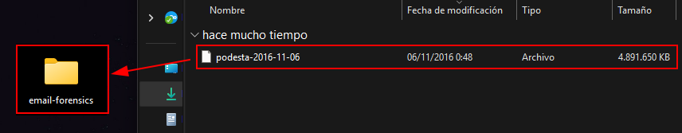

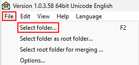

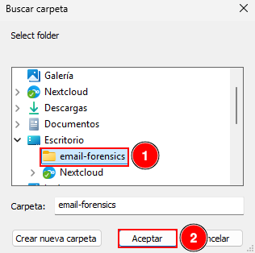

#### Notes and Observations

- 
- 
- 

---

### Conclusions

Summarize which tools are most useful during forensic investigations and compare PST vs MBOX accessibility.

- 
- 
- 

---

**3) Locate the DBX, MBX, or MBOX databases from exercise 3 of practice 1. Copy them to another directory and use the tools from the previous section, or any additional tools you may need, to visualize the content of the emails stored in those files.**

### Thunderbird Email Storage

Locate the Thunderbird profile directory.

Possible paths:

Windows:

`C:\Users\<USER>\AppData\Roaming\Thunderbird\Profiles\`

Interesting directories:

- `Mail`
- `ImapMail`
- `Local Folders`

Identify possible forensic artifacts such as:

- Inbox
- Sent
- Trash
- Drafts
- MBOX files

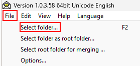

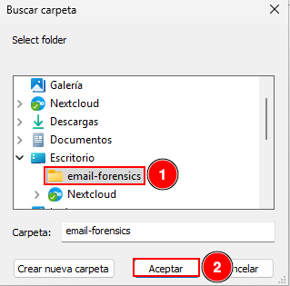

#### Observations

- 
- 
- 

---

### Outlook Email Storage

Locate Outlook storage files.

Possible paths:

`C:\Users\<USER>\AppData\Local\Microsoft\Outlook\`

or

`C:\Users\<USER>\AppData\Local\Microsoft\Olk\`

Possible forensic artifacts:

- PST files
- OST files
- Cached metadata
- Log files

Image placeholder.

#### Observations

- 
- 
- 

---

### Copying the Artifacts

Create a separate directory for analysis and copy the identified files.

Try to preserve timestamps and avoid modifying the original evidence.

Image placeholder.

#### Procedure Followed

- 
- 
- 

---

### Visualizing the Emails

Use the tools researched in the previous exercise to open and inspect the files.

Possible tools:

- Thunderbird
- Mbox Viewer
- XstReader
- Outlook

Check whether you can:

- Read emails
- Access attachments
- Recover folder structures
- View metadata

Image placeholder.

#### Results Obtained

- 
- 
- 

---

### Final Conclusions

Summarize the results obtained during the forensic analysis.

- 
- 
- 