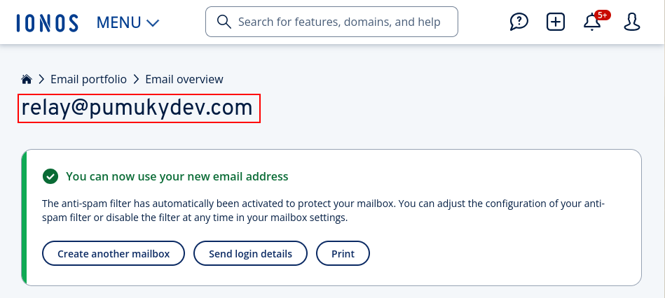


create mail.pumukydev.com and associate it an A register with your public IP / VPS IP, as I'm self hosting, I have a dynsdns script that updates the IP of my domain and subdomains automatically. If u are interested, check up https://github.com/PumukyDev/self-hosting

Create a MX register

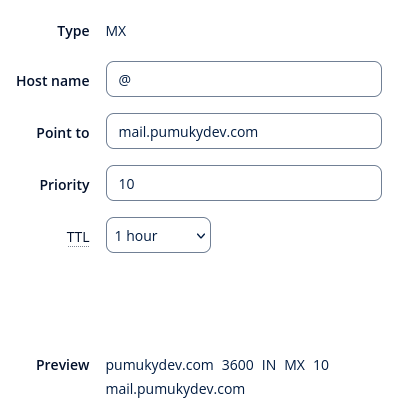

v=spf1 a:mail.pumukydev.com include:kundenserver.de ~all TBD al final mirar su puedo quitar mail.pumukydev.com

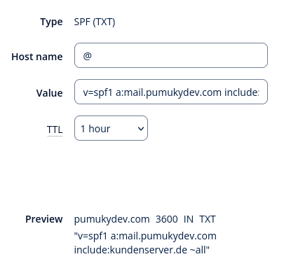

git clone https://github.com/mailcow/mailcow-dockerized.git
cd mailcow-dockerized/

 ./generate_config.sh

the mail server hostname will be asked, write your name. In my case it is mail.pumukydev.com, then, select a branch, preferiably 1. The certificate will be automatically genrated


as show below, in the docker compose of mailcow, ports 443 and 80 are set for the web page if none port is defined in the mailcow.conf. As I have a reverse proxy in these ports for my self hosting, I will edit such configuration to other ports

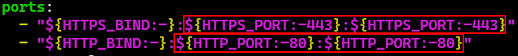

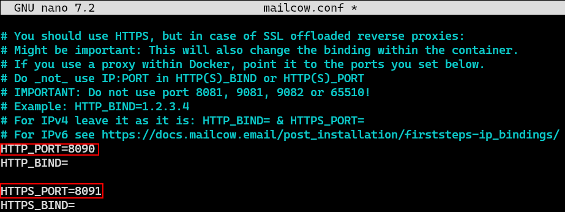

note: I will change the network too as the default one is used by other of my docker networks

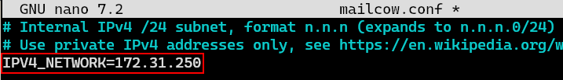

docker compose up -d --build


admin:moohoo

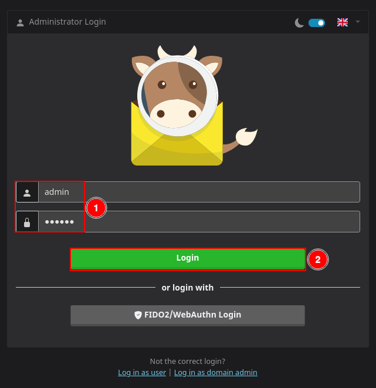

(yes, it is running in a raspberry pi)

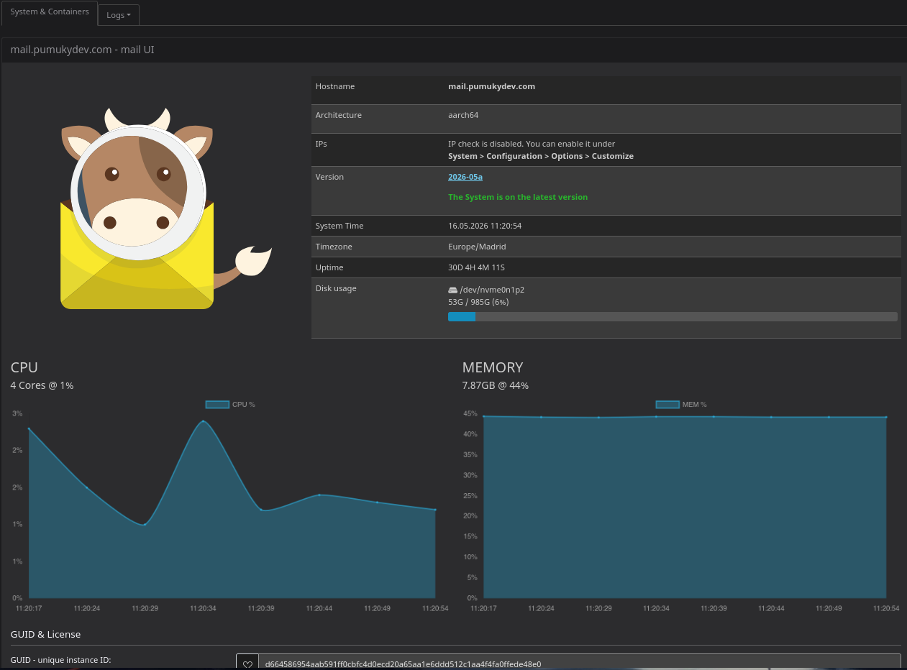


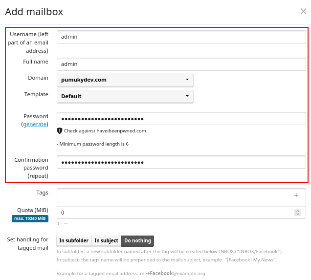


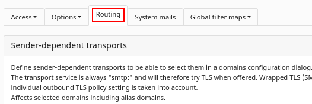

scroll down to Transport Maps


```txt
No MX records for smtp.ionos.es:587 were found in DNS, skipping and using hostname as next-hop.
Connection: opening to smtp.ionos.es:587, timeout=15, options=array (
    ↪ 'ssl' =>
    ↪ array (
    ↪ 'verify_peer' => false,
    ↪ 'verify_peer_name' => false,
    ↪ 'allow_self_signed' => true,
    ↪ ),
)
Connection: opened
SERVER -> CLIENT: 220 smtp.ionos.es ESMTP RZmta (P6 -)
CLIENT -> SERVER: EHLO mail.pumukydev.com
SERVER -> CLIENT: 250-smtp.ionos.es greets 79.145.185.221
    ↪ 250-ENHANCEDSTATUSCODES
    ↪ 250-PIPELINING
    ↪ 250-8BITMIME
    ↪ 250-DELIVERBY
    ↪ 250-SIZE 104857600
    ↪ 250-LIMITS RCPTMAX=1000 MAILMAX=1000
    ↪ 250-STARTTLS
    ↪ 250 HELP
CLIENT -> SERVER: STARTTLS
SERVER -> CLIENT: 220 Ready to start TLS
CLIENT -> SERVER: EHLO mail.pumukydev.com
SERVER -> CLIENT: 250-smtp.ionos.es greets 79.145.185.221
    ↪ 250-ENHANCEDSTATUSCODES
    ↪ 250-PIPELINING
    ↪ 250-8BITMIME
    ↪ 250-DELIVERBY
    ↪ 250-SIZE 104857600
    ↪ 250-LIMITS RCPTMAX=1000 MAILMAX=1000
    ↪ 250-AUTH PLAIN LOGIN
    ↪ 250 HELP
CLIENT -> SERVER: AUTH LOGIN
SERVER -> CLIENT: 334 VXNlcm5hbWU6
CLIENT -> SERVER: [credentials hidden]
SERVER -> CLIENT: 334 UGFzc3dvcmQ6
CLIENT -> SERVER: [credentials hidden]
SERVER -> CLIENT: 235 Authentication succeeded
CLIENT -> SERVER: MAIL FROM:<admin@pumukydev.com>
SERVER -> CLIENT: 250 Requested mail action okay, completed
CLIENT -> SERVER: RCPT TO:<abergom0504@ieszaidinvergeles.org>
SERVER -> CLIENT: 250 OK
CLIENT -> SERVER: DATA
SERVER -> CLIENT: 354 Start mail input; end with <CRLF>.<CRLF>
CLIENT -> SERVER: Date: Sat, 16 May 2026 13:19:33 +0200
CLIENT -> SERVER: To: Joe Null <abergom0504@ieszaidinvergeles.org>
CLIENT -> SERVER: From: Mailer <admin@pumukydev.com>
CLIENT -> SERVER: Subject: A subject for a SMTP test
CLIENT -> SERVER: Message-ID: <V25lE8PncaJTuZ8bJC7yu5a8LFUdpHQqKCHXACn2dts@mail.pumukydev.com>
CLIENT -> SERVER: X-Mailer: PHPMailer 6.6.0 (https://github.com/PHPMailer/PHPMailer)
CLIENT -> SERVER: MIME-Version: 1.0
CLIENT -> SERVER: Content-Type: text/plain; charset=iso-8859-1
CLIENT -> SERVER:
CLIENT -> SERVER: This is our test body
CLIENT -> SERVER:
CLIENT -> SERVER: .
SERVER -> CLIENT: 250 Requested mail action okay, completed: id=1MKsaz-1wevcp3BHR-00M7kH
CLIENT -> SERVER: QUIT
SERVER -> CLIENT: 221 kundenserver.de Service closing transmission channel
Connection: closed
```


[eml](./A%20subject%20for%20a%20SMTP%20test.eml)


This is our test body


preguntar a jose luis cómo seguir
pedirle que me enseñe la configuración DNS de ionos
para vover a entrar en mailcow ir a https://192.168.1.5:8091/admin/dashboard


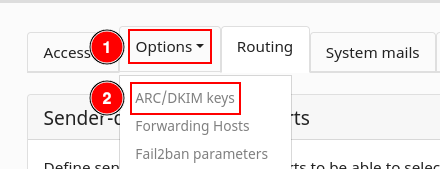

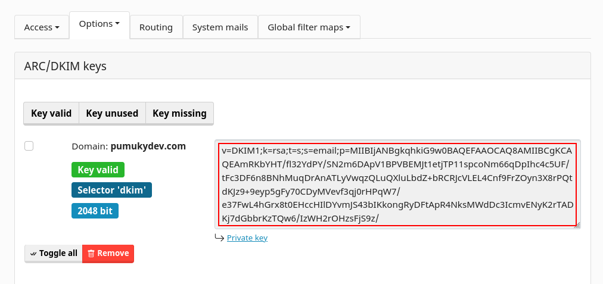


https://easydmarc.com/tools/dmarc-record-generator

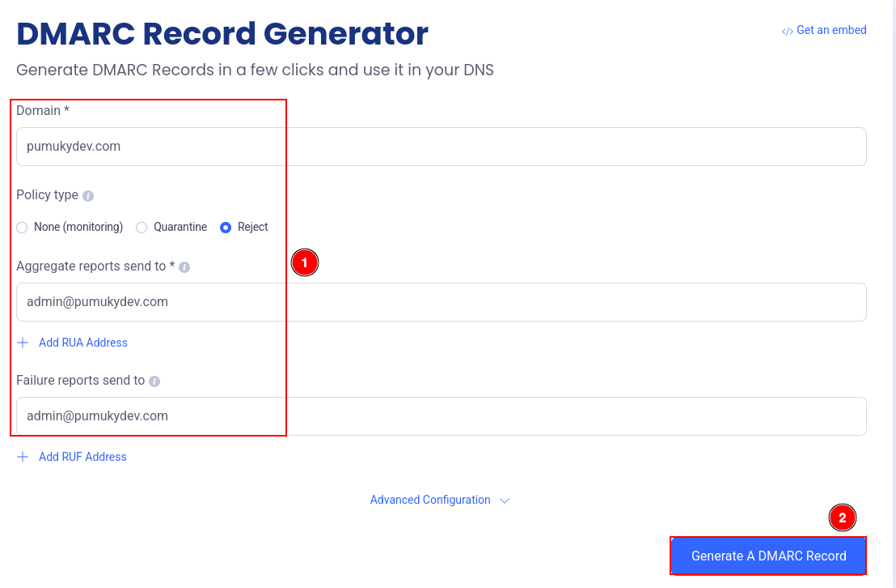


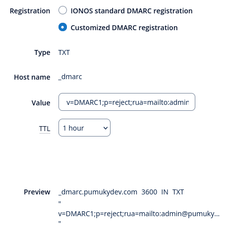


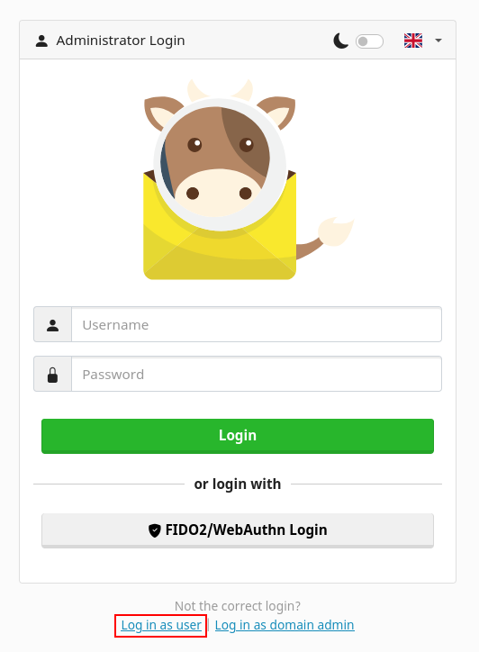

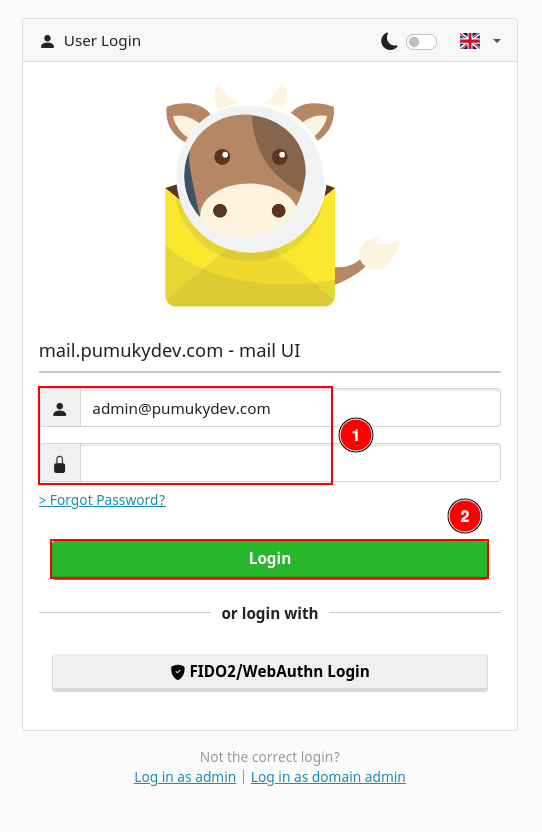

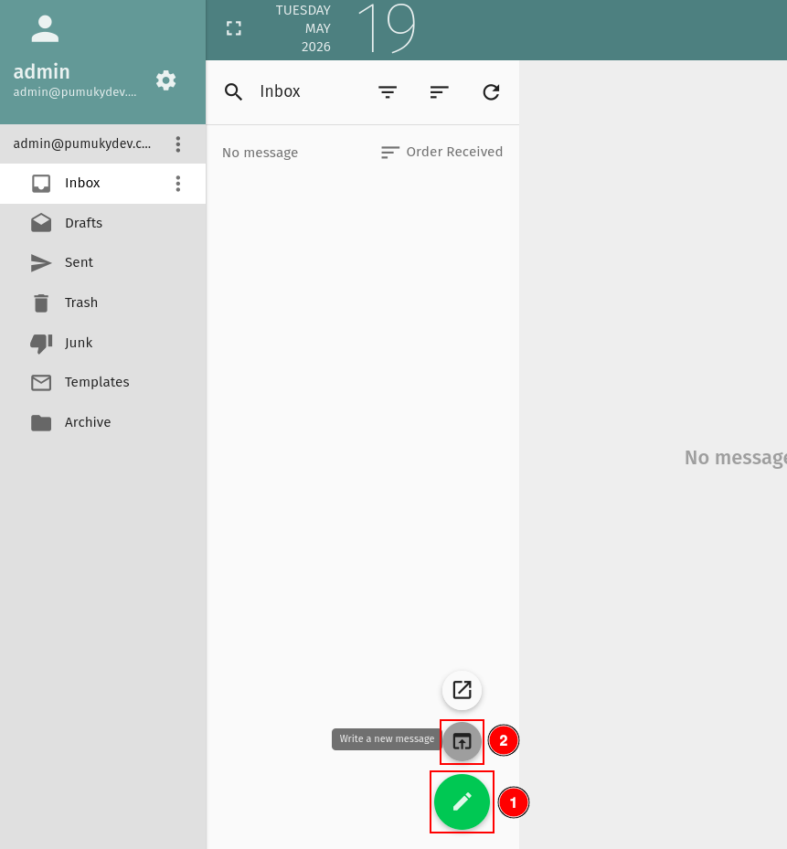


[eml](Test.eml)


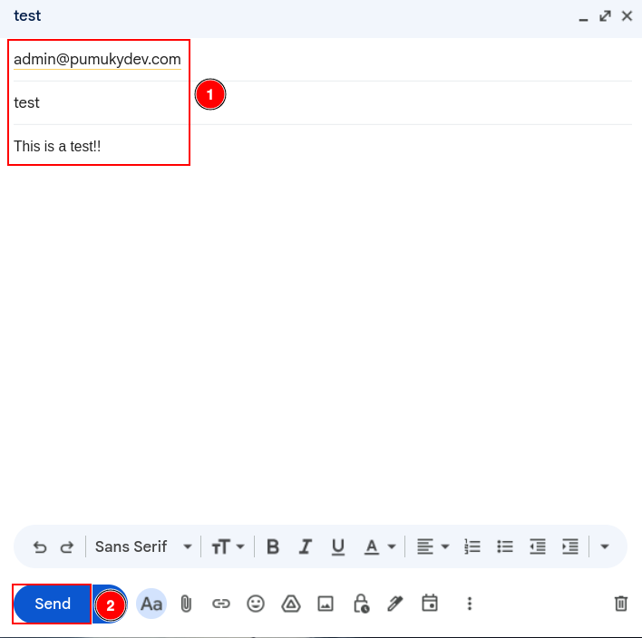

# Mailcow Router Ports Summary

This is the minimal set of ports you need to open in your router to run a fully functional Mailcow mail server.

## Required Ports

### 25 (SMTP - Incoming Mail)
- **Purpose:** Receiving emails from other mail servers (Gmail, Outlook, etc.)
- **Direction:** Internet → Mail server
- **Protocol:** TCP
- **Required:** Yes (for real mail delivery via MX records)

---

### 587 (SMTP Submission)
- **Purpose:** Sending emails from email clients (Thunderbird, mobile apps)
- **Direction:** Client → Mail server
- **Protocol:** TCP
- **Security:** STARTTLS + authentication
- **Required:** Yes (recommended for sending mail)

---

### 993 (IMAPS)
- **Purpose:** Secure email retrieval and synchronization
- **Direction:** Client → Mail server
- **Protocol:** TCP
- **Security:** TLS encrypted
- **Required:** Yes (for email reading via IMAP clients)

---

### 443 (HTTPS)
- **Purpose:** Web interface (Mailcow admin, webmail, APIs)
- **Direction:** Browser → Mail server
- **Protocol:** TCP
- **Required:** Yes (for administration and web access)


