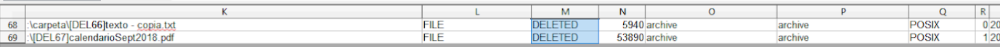
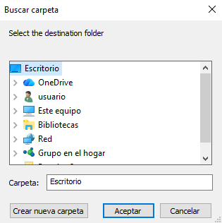
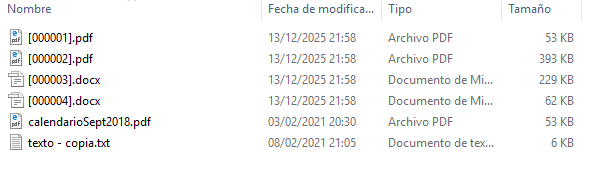

# Exercise 2

## Section 1

### Statement

Download the disk image and open it with Active Disk Editor (ADE). Try to identify with the ADE tool, by inspecting the MFT records (1 KB), which ones have been deleted based on the FLAGS property (field "in use" = '0').

Locate any entry corresponding to a deleted file, for example I found "texto - copia.txt", and take a screenshot. Memory position. Hint: go to position 03397XXXX.

Recover the file using the FTK Imager tool (it is located in the recycle bin folder).

### Solution

We open Active Disk Editor and go to offset 03397XXXX as stated in the statement, we can see a file called "texto - copia.txt"

Once inside, we will use the search function, for this we do Right click + Find or Ctrl + F, and we can enter search mode. I noticed that in ASCII, between each word or symbol there is a dot, so I searched for: `t.e.x.t.o. .-. .c.o.p.i.a…t.x.t.` and we would click Find ALL.

Once achieved, at the bottom left it will show us the results and I went through the results one by one, until the beginning of the sector starts with FILE0, to properly identify the file. Reminder: Change the Template to NTFS MFT File Record and select the beginning of File0.

Once the file is identified, we simply need to look at the Flags on the left and check if it is in use (Exists).

In this case we can certify that the file has been deleted since it is not in use or does not exist.

Now we proceed to recover the file data, for this we must CLOSE the Active Disk Editor program, as it causes problems together with FTK Imager.

After that we will mount the disk either on the machine or we will work with it as an image, in my case we are going to mount the image to have better reading of the device. To mount it we do Image mounting -> Select File.

After this we will do an Add Evidence Item -> Physical Drive -> (The last one we have)

This order will be maintained except if we have added a new hard drive, the important thing is that we see a partition called DATOS.

Now we must explore through the directories we have until we find texto - copia.txt, to restore it. In this case the file is in Datos > Root > Carpeta.

As we can see, it has a small red cross indicating that the file was deleted.

For file recovery, we right-click on the desired file and export files.

After this, we will indicate where we want to export it and click accept.

After this we can verify that we have indeed exported and recovered it.

---

## Section 2

### Statement

Identify the low-level attributes of one of the files (MFT records) using the Active Disk Editor 7 tool. The attributes we are interested in are $10, $30 and $80.

Where can I find the creation, modification and access dates?

What does the non-resident property mean and its associated values 0/1?

### Solution

Remember: We have selected the FILE0 file and we have indicated the NTFS MFT File Record template.

The **$10** attribute is about Standard information, we will find:
- The dates of: creation, modification and access.
- The permissions of: owner, security.
- Etc…

The **$30** attribute is regarding File Name, therefore there will be information about:
- The file name
- If it is hidden.
- It is a system file.
- Etc…

The **$80** attribute has Data information and we can see:
- The direct information in the MFT, as long as it is Non-resident (The Non-Resident parameter must be set to 1)

Answering the activity, we can find creation, update and file opening information in the $10 attribute. And in case the file is resident, its content can be read directly in the MFT, otherwise it would not be possible.

---

## Section 3

### Statement

Export the $MFT metadata file using FTK, process it with the MFT2CSV tool and import it into a spreadsheet editor in order to analyze the attributes. We are interested in studying which files have been deleted and on what date. Filter by the "in use" field to state '0' (deleted) and/or by the "RecordActive" field = DELETED/ALLOCATED to obtain the deletion date/time.

### Solution

Important: To be able to modify the $MFT file, I recommend using FTK Imager, and extract it from Tree Evidence, to a directory where we have the desired file. We extract the file as taught in section 1-b.

To analyze the MFT, we download the MTF2csv tool, available on GitHub. Once we have it open, we must indicate the path of the hard drive from which we extracted the MFT, and we will also have to change the separator to be able to read it more comfortably. We must also select the output where it will send the files ourselves.

Once finished, we will go to the output area we have placed and we can see a large number of files, however the file we need to read is the one in a green box.

With the OpenOffice program, we can open the file and start analyzing it.

Once the file is open, it is very important to do Data > Filter > Auto filters, to be able to analyze the spreadsheet more comfortably. Once this is done we can do a more comfortable analysis of the information and we can mark in column M or in the RecordActive area the option of only Delete and we can observe the following:

All other rows have been removed to have a more comfortable reading of the files, in this case, the deleted files.

---

## Section 4

### Statement

Export the $LogFILE metadata file, which together with the $MFT from the previous section will provide data on the transactions performed in the file system. Process the files with the NTFSLogFile Parse tool to decode the information and obtain a CSV. Search for transactions where the "lf_RedoOperation" field equals "DeallocateFileRecordSegment" to locate permanently deleted files since as its name indicates the operation was to deallocate the file record segment.

### Solution

Important: To be able to modify the $LogFile file, I recommend using FTK Imager, and extract it from Tree Evidence, to a directory where we have the desired file. We extract the file as taught in section 1-b.

On this occasion we are going to analyze the $LogFile, and for this we must select the file and also select the excel sheet that we obtained previously with the MFT extraction.
NOTE: Remember to change the Separator to `;`.

After all this, we can click Start.

Once finished, we can see the following at the bottom:

Now we will analyze the LogFile.csv file, this file has been created in: (Inside the LogFileParser execution folder -> LogFile_(date) -> LogFile.scv. When we open it we should see something similar to the following. We must modify the separator to `|`.

Once we have established the filters, we can do the task which is to set if_RedoOperation to DeallocateFileRecordSegment, to be able to see the files that have been completely deleted. And we will obtain the following:

---

## Section 5

### Statement

Export the metadata file corresponding to $USNJournal ( $Extend -> $USNjrl -> $J). Processed with the UsnJrl2Csv tool to decode the information it stores. Filter the resulting information by the "Reason" field = "CLOSE+DELETE" to obtain the dates when the permanent deletion of the files occurred.

### Solution

Important: To be able to modify the $J file, I recommend using FTK Imager, and extract it from Tree Evidence, to a directory where we have the desired file. We extract the file as taught in section 1-b. To find this file please pay attention to the statement.

Now we will analyze the $J file, using the UsnJrl2Csv tool. We must change, as we are already used to, the separator to `;`, and set the file output path to what we want. After this we will click Start.

Once finished we can go to the folder we have selected and open the .csv file, with OpenOffice.

After this we can set the separator to Semicolon, we can click accept.

On this occasion, we are going to filter in Reason, by Close+File_Delete, to know which files were closed and deleted, as well as at what time it was.

---

## Section 6

### Statement

In this section, we are going to use the ANJP tool to perform joint processing of $MFT, $LogFile and $USNJrnl. You will see that it works with the same information from the previous sections in an integrated way in the same tool. It has a tab to decode the information (Parse) and another to view the results (Report). It is a paid tool. You are asked to use it and take a couple of screenshots of the results report it offers.

### Solution

Now we are going to use the ANJP tool, which combines all the previous tools. For this we must first put a case name, the path where it will leave the files and the files we have used previously.

Once we have put the paths of all the necessary files, we can click Parse, to execute it.

Once the process is finished, we go to Reports, and we can view (If we have properly placed the file path), the data obtained from the documents.

For example, if we access LogFile > File Interactions, we can find relevant information about texto - copia.txt

---

## Section 7

### Statement

Use the "FTK Imager" and "AlternateDataViewer" tools to study the origin of the files that appear in the "datos.dd" image. Take a screenshot with each tool showing an example.

### Solution

In FTK Imager, we must first add evidence to start exploring the files inside, for this we will click Add Evidence Item > Physical Drive > Last mounted disk, remember that we have already done this before.

As we can see, in the Evidence tree, an evidence called \\PHYSICALDRIVE3 (In my case) has been created. After this we will click Partition, whichever we want and we can start seeing the folders and other files.

For example, let's analyze the file Proyecto Educativo.pdf

As we can see above, there is a file called Zone.Identifier, if we click it, it will show us in plain text a ZoneID, identified from where it was downloaded. In this case, the ID is 3.

In this case, the document was downloaded from Internet Explorer.

If we use AlternateStreamView, the first thing we will see when running it is to indicate the path where the files we want to analyze are located. For example, we are going to put it directly on the partition.

As we can see, there are several files and we can analyze their Zone.Identifier, in my case it will be the ProyectoEducativo.pdf file. If we double-click on the file, we can obtain the following properties

We still need to know where it was downloaded from, so we are going to right-click on it, and we are going to extract the file.

After that, we will indicate the path where we are going to extract the documents.

If we open the document that has been generated (For example with Notepad), we can see the transfer zone.

---

## Section 8

### Statement

Export the directory index type metadata files ($I30) from the three directories that appear in the "datos.dd" disk image of this practice: the root directory, the "carpeta" directory and the directory corresponding to the recycle bin. Process these files with the "Indx2Csv" tool. Analyze what files exist and have existed in the different directories

### Solution

Important: To be able to modify the $I30 file, I recommend using FTK Imager, and extract it from Tree Evidence, to a directory where we have the desired file. We extract the file as taught in section 1-b.

In this activity, we need to extract the $30 files, from the following folders:
- carpeta
- root
- Recycle bin.

To extract the files, we must open FTK Imager, and have it with the evidence tree (It has been shown before how to do it). Once we have the file located, we will right-click on it and we can extract it wherever we want (In my case the desktop).

The recycle bin file, which may be the most difficult to find, is located in Recycle Bin and then in the existing subfolder

Once we have done this with the three files, we will start using the other tool.

We must configure the launcher with the following parameters:

We will do this with each file from each folder. If we go to the outputs of the files we set, we can check what documents have been extracted

TBD - I'M NOT GOING TO PUT A PHOTO AT THE END

As we can observe, we have a .csv file, to be able to analyze it with OpenOffice. Let's analyze what we have found.

### "Carpeta" Folder

In this folder, we can observe a series of 6 pairs, where 3 of them are texto.txt, this is because this document has been opened numerous times on different occasions. Thanks to this tool, we can see, for example, the access, creation and deletion time.

### Root Folder

In this folder, we can not only see the files that are there previously, but we can also see even those hidden files and how they have been modified.

### "Papelera" Folder

In this folder, we can observe a large number of documents, as they are all those that have been deleted.

---

## Section 9

### Statement

Install the automated file recovery tool "Recuva". Mount the "datos.dd" disk image with "FTK Imager" and use the tool to recover all the files you can. Compare the results obtained with the files that the "FTK Imager" tool is able to recover (marked with the "deletion cross" symbol).

### Solution

Now we will use the Recuva program, to be able to recover the lost files we saw in practice 1-B.

The first thing we will do is show the specific area where those files were located, in this case it is on disk G.

Click on deep scan

Once the area is selected, we will click Next, and the next thing we will see is a list of files that it has been able to recover.

We will select all the files and click Recover.

Then it will ask us where we want to leave the files.

And as we can see, we have been able to recover all the selected files.

Now we compare what we obtained with the files that are on the disk according to FTK Imager, the first thing we can see, in the Root folder, is the calendarioSept2018.pdf file.

After that we have been able to recover the texto - copia.txt file, which is located in the folder.

Unfortunately, for the rest of the files, I do not have information about where they may have been obtained.
