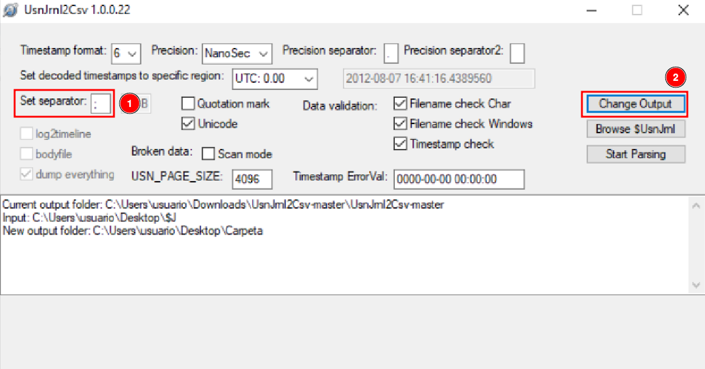
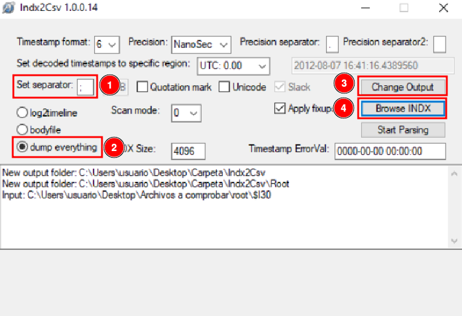
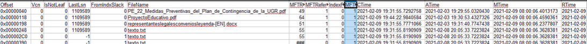

# Exercise 2

The file system on any storage device is essential for the overall organization, storage mechanisms, and data control of the device. Understanding how these file systems work, as well as the design of key structures, storage mechanisms, associated metadata, and file system features, is crucial for conducting forensic investigations on a computer or other device.

NTFS and FAT file systems are two widely used and commonly encountered systems. Both offer significant and mandatory forensic evidence in any investigation.

## Main Objective of the Practice

- Study the metadata provided by the NTFS file system for forensic analysis.

## Software to Use

- FTK Imager 4.3 or higher  
- Active Disk Editor v7.0  
- MFT2Csv  
- NTFSLogFile  
- UsnJrl2Csv  
- ANJP  
- AlternateStreamViewer  
- Indx2Csv  

**Disk image to use:** Download it from [here](./disk2.7z).

## Section 1

### Statement

Download the disk image and open it with Active Disk Editor (ADE). Try to identify, using ADE and by inspecting the 1 KB MFT records, which of them have been deleted based on the **FLAGS** property (`in use = 0`).
   a. Locate any entry corresponding to a deleted file (for example, “texto - copia.txt”), and take a screenshot. Memory position hint: go to position `03397XXXX`.  
   b. Recover the file using FTK Imager (found in the Recycle Bin folder).

### Solution

If we open Active Disk Editor and go to offset 03397XXXX as stated in the statement, we can see a file called "texto - copia.txt"

Once the file is identified, we simply need to look at the "Flags" on the left and check if it is in use (Exists).

In this case we can certify that the file has been deleted since it is not in use.

Now we proceed to recover the file data, for this we can close the Active Disk Editor program and open FTK Imager.

Then, click on the icon of the image to start mounting the disk.

Select the disk, click on "Mount" and verify that the partition appears on the "Mapped Image List".

Then, click on the icon of the image to start make an evidence tree.

Click on "Physical Drive" and continue.

Select the previously mounted image and finish.

Verify that and evidence tree appears.

Click on the folder "carpeta" and find out the filed called "texto - copia.txt" marked with a red cross.

Click on said file and click on "Export Files..."

Verify that the file has been recovered successfully.

---

## Section 2

### Statement

Identify low-level attributes of one of the files (MFT records) using Active Disk Editor 7. The attributes of interest are **$10**, **$30**, and **$80**.  
   a. Where can you find the creation, modification, and access dates?  
   b. What does the **non-resident** property mean, and what are the values 0/1 associated with it?

### Solution

Having the [disk](./disk2.7z) imported in Active Disk Editor, select the "FILE0" file and select the NTFS MFT File Record template. With that, we can find out this information:

The **$10** attribute is about Standard information, we will find:
- The dates of: creation, modification and access.
- The permissions of: owner, security.
- Etc…

The **$30** attribute is regarding File Name, therefore there will be information about:
- The file name
- If it is hidden.
- It is a system file.
- Etc…

The **$80** attribute has Data information and we can see:
- The direct information in the MFT, as long as it is Non-resident (The "Non-resident flag" parameter must be set to 1)

Answering the activity, we can find creation, update and file opening information in the $10 attribute. And in case the file is resident, its content can be read directly in the MFT, otherwise it would not be possible.

---

## Section 3

### Statement

Export the **$MFT** metadata file using FTK, process it with MFT2CSV, and import it into a spreadsheet editor to analyze the attributes. The goal is to study which files were deleted and when. Filter by the field **“in use = 0”** (deleted) and/or by **RecordActive = DELETED/ALLOCATED** to obtain the deletion date/time.

### Solution

To analyze the MFT, download [MTF2csv](https://github.com/jschicht/Mft2Csv). Once we have it open, we must indicate the path of the volume (explained on [section 1](#section-1)) and hard drive from which we extracted the MFT, we will also have to change the separator to be able to read it more comfortably. We must also select the output where it will send the files ourselves.

Once finished, go to the output area and verify that many files appear there. Open the file inside the red box.

Open the file using OpenOffice.

Activate some filters by doing the following: Data > Filter > Auto filters. This will let us to analyze the spreadsheet more comfortably. Once this is done, go to column M and select "Deleted", verify that this two files appear:

---

## Section 4

### Statement

Export the **$LogFILE** metadata file. Together with the $MFT from the previous step, it provides information about file system transactions. Process the files using **NTFSLogFile Parse** to decode the information and obtain a CSV.  
   - Search for transactions where **lf_RedoOperation = DeallocateFileRecordSegment** to locate files that were permanently deleted, since this operation deallocates the file record segment.

### Solution

This time, we are going to analyze the $LogFile, in order to do that, select the file and also select the excel sheet that we obtained previously with the MFT extraction. Remember to change the separator to `;`.

After all this, we can click on "Start".

Once finished, we can see something like that:

Now we will analyze the LogFile.csv file, open it using Open Office.

After establishing some filters, these are the files which have been deleted.

---

## Section 5

### Statement

Export the metadata file corresponding to **$USNJournal**  
   (`$Extend -> $USNjrl -> $J`).  
   Process it using **UsnJrl2Csv** to decode its stored information.  
   - Filter the resulting data by **Reason = CLOSE+DELETE** to obtain the timestamps of permanent file deletions.

### Solution

Now we will analyze the $J file, using [UsnJrl2Csv](github.com/jschicht/UsnJrnl2Csv). Change the separator to `;`, and set the file output path to what we want. After this we will click on "Start".

Once finished we can go to the folder we have selected and open the .csv file, with OpenOffice.

Change the separator to `;` and click on accept.

Add the proper filters in and verify which files have been closed and deleted.

---

## Section 6

### Statement

Use the **ANJP** tool to perform a combined analysis of **$MFT**, **$LogFile**, and **$USNJournal**.  
   You will see that it processes the same information as the previous sections but in an integrated way. It includes a **Parse** tab and a **Report** tab.  
   - Use the tool and take a couple of screenshots of the generated report.  
   *(Note: This is a paid tool.)*

### Solution

Now we are going to use the ANJP tool, which combines all the previous tools. For this we must first put a case name, the path where it will leave the files and the files we have used previously.

Once we have put the paths of all the necessary files, we can click "Parse", to execute it.

Once the process is finished, we can go to "Reports", and view the data obtained from the documents.

For example, if we access LogFile > File Interactions, we can find relevant information about "texto - copia.txt"

---

## Section 7

### Statement

Use **FTK Imager** and **AlternateDataViewer** to study the origin of the files found in the `datos.dd` image.  
   - Take a screenshot with each tool showing one example.

### Solution

In FTK Imager, deploy the entire Evidence Tree.

Click over a file as "Proyecto Educativo.pdf". And study the "Zone.Identifier".

If we click tie "Zone.Identifier", it will show us in plain text a ZoneID, in this example the zone ZoneID is 3, which means that the file has been downloaded from the internet.

| ZoneID | Security Zone        | Description                |
|--------|----------------------|----------------------------|
| 0      | My Computer          | Local machine files        |
| 1      | Local Intranet       | Internal network locations |
| 2      | Trusted Sites        | Trusted web sites          |
| 3      | Internet             | Files downloaded from the Internet |
| 4      | Restricted Sites     | Restricted or blocked sites |

Opening AlternateStreamView will look like this:

As we can see, there are several files and we can analyze their Zone.Identifier, in my case it will be the "ProyectoEducativo.pdf" file. If we double-click on the file, we can obtain the following properties:

We still need to know where it was downloaded from, so we are going to right-click on it, and we are going to extract the file.

After that, we will indicate the path where we are going to extract the documents.

If we open the generated document, we can see the transfer zone, however, the website from which it was downloaded is not shown.

---

## Section 8

### Statement

Export the directory index metadata files (**$I30**) for the three directories present in the `datos.dd` disk image:  
   - the root directory,  
   - the directory named “carpeta”,  
   - and the Recycle Bin directory.  
   Process these files with **Indx2Csv**.  
   - Analyze which files exist now and which existed in the past in each directory.

### Solution

To extract the files, we must open FTK Imager and mount the evidence tree. Once we have the file located, we will right-click on it and we can extract it wherever we want.

Repeat it with root and the recycle bin folders.

Once we have done this with the three files, we will start using the other tool.

We must configure the launcher with the following parameters:

A `.csv` file has been generated for each folder. Open them.

### "Carpeta" Folder

In this folder, we can observe a series of 6 pairs, where 3 of them are "texto.txt", this is because this document has been opened numerous times on different occasions. Thanks to this tool, we can see, for example, the access, creation and deletion time.

### Root Folder

In this folder, we can not only see the files that are there previously, but we can also see even those hidden files and how they have been modified.

### "Papelera" Folder

In this folder, we can observe a large number of documents, as they are all those that have been deleted.

---

## Section 9

### Statement

Install the automated file recovery tool **Recuva**.  
   Mount the `datos.dd` disk image with **FTK Imager** and use Recuva to recover as many files as possible.  
   - Compare the recovered files with those that FTK Imager is able to recover (marked with the deletion cross icon).

### Solution

Now we will use the Recuva program, to be able to recover the lost files we saw previously.

The first thing we will do is show the specific area where those files were located.

Enable the Deep Scan and click on "Start"

Delect all the files and click on "Recover".

Then it will ask us where we want to leave the files.

And as we can see, we have been able to recover all these files.

When comparing the results obtained with Recuva to those obtained using FTK Imager, we can confirm the recovery of the file "calendarioSept2018.pdf" from the root directory and the file "texto - copia.txt" from the "carpeta" directory. For the remaining recovered files, it was not possible to determine their original locations based on the available information.

