# Linux File system

## Part A: The File System

The file system constitutes the backbone of any storage device, as it determines how data is organized, stored, and managed.

Among the most widely used file systems today, EXT4 (Fourth Extended File System) stands out as the default file system in most Linux distributions. This makes it a common target in forensic investigations involving servers, workstations, or embedded devices running this operating system.

EXT4 inherits and improves upon the features of its predecessors (EXT2 and EXT3), introducing advanced mechanisms such as journaling, extents (for efficient space management), delayed block allocation, and increased storage capacity. These elements not only optimize performance but also generate a rich set of metadata that can be crucial in an investigation: from creation, modification, and access timestamps to journal transaction logs that allow reconstruction of past activities, including file deletions.

### Objectives

- Study the metadata structure of EXT4 (inodes, superblock, block groups) and its forensic relevance.
- Learn how to use specialized tools (The Sleuth Kit, debugfs, hex editors) to inspect and extract information from an EXT4 disk image.
- Identify deleted files and determine, where possible, deletion dates through journal and inode analysis.
- Explore file recovery techniques, including the use of carving tools such as Photorec.-

### Materials

- Any Linux distribution available on your system.
- Sleuth Kit.
- [EXT4 disk image](https://drive.google.com/file/d/1eN9oT3m66BphGWj5T-eEdU4GOpory-xm/view).

### Theoretical questions

#### What is the superblock? What critical information does the superblock of an EXT4 file system store, and why is it important for mounting and system integrity? Mention at least three specific fields and their function.

The superblock is the central metadata structure of an EXT4 file system. It contains global information describing the file system’s configuration and state. Without the superblock, the operating system cannot properly mount or interpret the file system.

From a forensic perspective, the superblock is critical because it provides structural parameters necessary to interpret all other metadata and detect inconsistencies or tampering.

Some important fields include:

- **Total number of inodes (s_inodes_count):** Indicates how many inodes exist in the file system. This determines the maximum number of files that can be created.
- **Total number of blocks (s_blocks_count):** Defines the total size of the file system in blocks. This is essential for calculating disk capacity and verifying integrity.
- **Block size (derived from s_log_block_size):** Determines the size of each data block. This affects how file offsets and data structures are interpreted.
- **Mount time (s_mtime) and write time (s_wtime):** Provide timestamps of the last mount and last write operations. These are valuable in forensic timelines.
- **State field (s_state):** Indicates whether the file system was cleanly unmounted. An unclean state may suggest a crash or improper shutdown.

#### What is an inode? If you run the `stat` command on a file in Linux, what metadata information can you obtain and what do the timestamps mean?

An inode (index node) is a data structure that stores metadata about a file, excluding its name. It contains information required to locate and manage the file’s data blocks.

When running the `stat` command on a file in Linux, you can obtain:

- File size
- File type (regular file, directory, symbolic link, etc.)
- Permissions
- Owner (UID) and group (GID)
- Inode number
- Number of hard links
- Timestamps

Meaning of timestamps:

- **atime (access time):** Last time the file was accessed (read).
- **mtime (modification time):** Last time the file content was modified.
- **ctime (change time):** Last time the inode metadata changed (permissions, ownership, etc.).
- **crtime (creation time or bith, in EXT4):** File creation time (not available in older file systems).

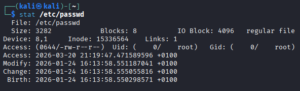

#### Explain the relationship between a directory, directory entries (dentries), and inodes. How does this structure allow the system to locate a file within the file system?

In EXT4:

- A **directory** is a special file.
- It contains **directory entries (dentries)**.
- Each dentry maps a filename to an inode number.

The directory does not store file metadata directly. Instead, it contains entries such as:

filename → inode number

When the system accesses a file:

1. It reads the directory.
2. It finds the filename in a dentry.
3. It retrieves the associated inode number.
4. It loads the inode.
5. It uses block pointers or extents to locate the file data.

#### Describe the difference between direct and indirect block addressing (single, double, and triple indirect) in an inode table. Files in EXT4 can reach up to 16 TB in size — mathematically explain how this size is achieved.

In a Unix-like file system such as EXT4, an inode stores pointers to the data blocks of a file.

There are different types of block addressing:

- Direct blocks: The inode contains direct pointers to data blocks.
- Single indirect block: The inode points to a block that contains a list of block addresses.
- Double indirect block: The inode points to a block that contains pointers to indirect blocks, each of which contains pointers to data blocks.
- Triple indirect block: The inode points to a block that points to double indirect blocks, allowing a very large number of data blocks to be addressed.

This hierarchical addressing allows very large files.

To explain that, assume:

- Block size = 4 KB = 4096 bytes = 2¹² bytes
- EXT4 can address up to 2³² blocks for a single file

Maximum file size:

Maximum file size = number of blocks × block size

= 2³² × 2¹²

= 2⁴⁴ bytes

Convert to terabytes:

2⁴⁰ bytes = 1 TB

2⁴⁴ = 16 × 2⁴⁰

= 16 TB

Therefore:

2³² blocks × 4096 bytes = 16 TB

#### What fundamental advantage does the use of “extent trees” in EXT4 provide for mapping large file data compared to the indirect pointer system of Ext2/Ext3?

The main advantage of extent trees in EXT4 is that they map large contiguous ranges of blocks with a single entry, instead of using many indirect pointers like in Ext2/Ext3.

This reduces metadata overhead, improves performance, and allows more efficient handling of large files.

### Practical questions

Download the disk image from the provided [link](https://drive.google.com/file/d/1eN9oT3m66BphGWj5T-eEdU4GOpory-xm/view) and complete the following tasks:

#### Using appropriate Linux commands (fdisk, mmls), determine how many disk partitions appear in the image.

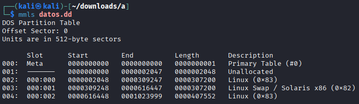

#### Open the same image with Active Disk Editor and verify that the same partitions appear as in the previous step.

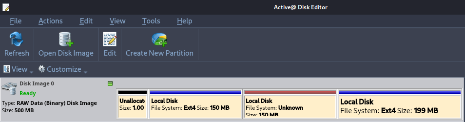

#### Using Active Disk Editor, display the superblock information of partitions 1 and 3. Focus on explaining the fields that are most relevant from a forensic perspective.

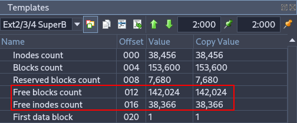
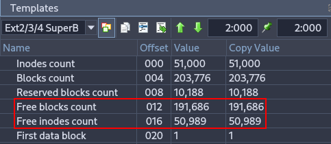

These fields indicate how many blocks and inodes are free in the filesystem. From a forensic perspective, they help estimate how much data could have been deleted or how active the filesystem has been.

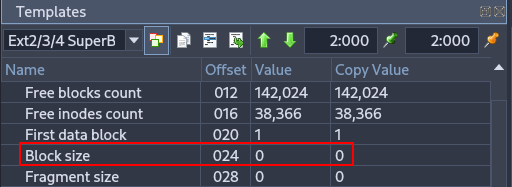
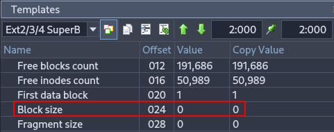

Specifies the size of each block. Important in forensics because it is needed to calculate offsets and locate data accurately within the partition.

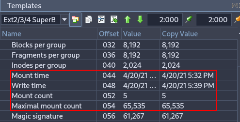
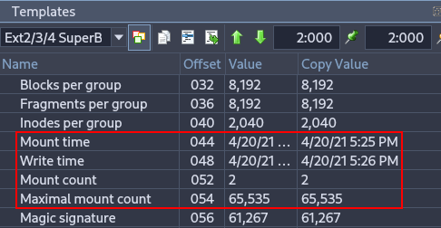

Shows the last mount and write times, as well as how many times the filesystem has been mounted. Useful for reconstructing a timeline of filesystem usage and identifying potential improper shutdowns or crashes.

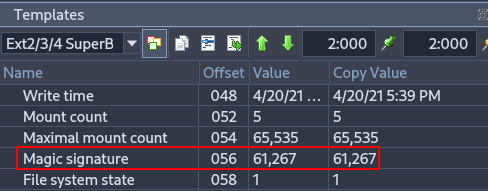
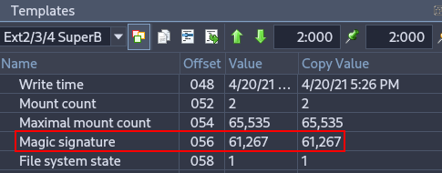

Important for verifying filesystem integrity and identifying the correct filesystem type during forensic analysis.

#### Use the command `losetup -f -P` to mount the image file in Linux as if it were a device. Attempt to mount partitions 1 and 3 and examine their contents.

```bash
sudo losetup -fP datos.dd
sudo losetup -a
```

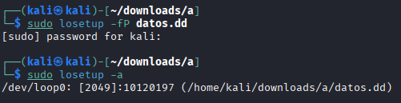

```bash
ls /dev/loop0*
```

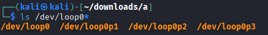

```bash
sudo mkdir -p /mnt/part1
sudo mkdir -p /mnt/part3
sudo mount /dev/loop0p1 /mnt/part1
sudo mount /dev/loop0p3 /mnt/part3
```

In part 1, many files have been recovered.

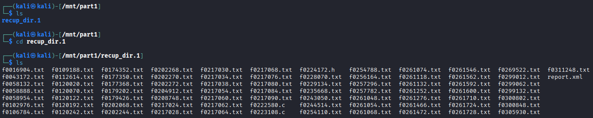

However, in part 2 there are no files.

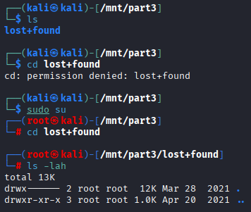

#### Use the `fls` command (from The Sleuth Kit) to list files and directories in partition 1 of the image. Investigate the meaning of the columns shown in the command output.

```bash
sudo fls -r /dev/loop0p1
```

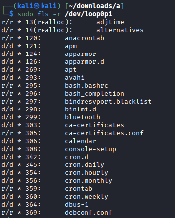

The The Sleuth Kit command we used allows us to view the file structure, even if files have been deleted.

- **Type (r/r, d/d, +):** The first part indicates whether it is a regular file (r) or a directory (d). The `+` symbol shows that the file is located inside a subdirectory (nested depth).  
- **Status (*):** An asterisk indicates that the file has been deleted (it is unallocated in the file system).  
- **Inode:** This is the unique identifier number for the file metadata. If `(realloc)` appears, it means the original inode has been reused for a new file.

#### Explain why the command `icat /dev/loop0p1 690` does not produce output, while `icat /dev/loop0p1 12` does.

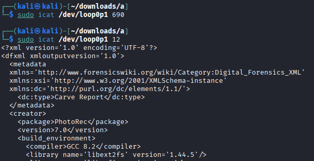

```bash
sudo fls -r /dev/loop0p1 | grep -E '\b690\b'
sudo fls -r /dev/loop0p1 | grep -E '\b12\b'
```

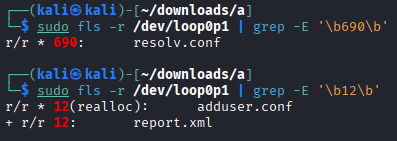

The inode 690 is marked with * which means it has been **deleted** (unallocated). Since `icat` only retrieves data from **allocated files**, there is no output.

The inode 12 has two entries: the first (`12(realloc)`) shows the inode was **reused** by a new file (`adduser.conf`), so the original data may not be accessible. The second (`12`) is an **allocated file** (`report.xml`) that still exists. Because it is allocated, `icat` retrieves its content successfully.  

#### What information does the command `istat /dev/loop0p1 20` provide? Determine the name of the file referenced by inode 20 in partition 1.

```bash
sudo istat /dev/loop0p1 20
```

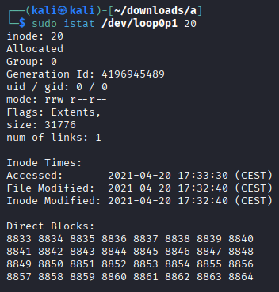

It show the inode metadata

In order to know the the name of the file referenced by inode 20:

```bash
sudo fls -r /dev/loop0p1 | grep -E '\b20\b'
```

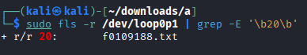

It is `f0109188.txt`.

#### Using Active Disk Editor, locate the inode 20 information of the previous file. Why do the direct block pointers not match?

Open Active Disk Editor, right click over the fist ext4 partition and click on "Open in File Browser".

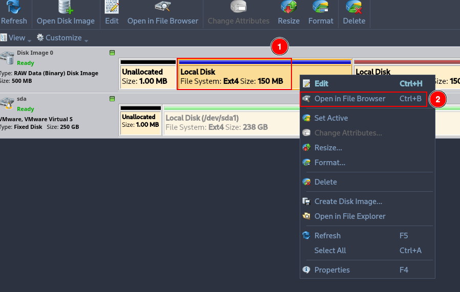

Right click over the the with id 20 and click on "Inspect File Record".

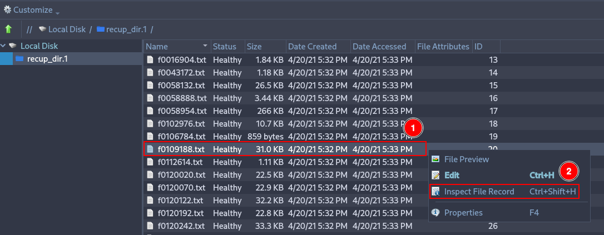

Deploy the menu "Direct block pointers" and check that there are 12 pointers. Pointer 6 shows 8833, which is the first direct block shown by the istat command.

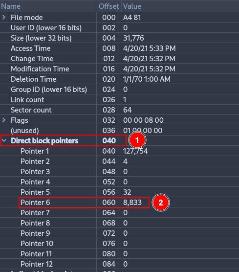

Although this is the block indicated by the inode, it is not necessarily the block where the actual data is stored. This is because EXT4 does not always use traditional direct blocks anymore; most likely, this block is part of an extent, which stores the starting block and a sequence of consecutive blocks that are not directly visible in the inode.
Therefore, the information shown by Active Disk Editor does not necessarily match the actual location of the data blocks.

#### Use the `tsk_recover` command to recover as many files as possible from partitions 1 and 3.

```bash
sudo tsk_recover -e /dev/loop0p1 ./recovered-p1/
sudo tsk_recover -e /dev/loop0p3 ./recovered-p3/
```

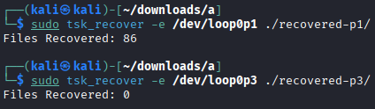
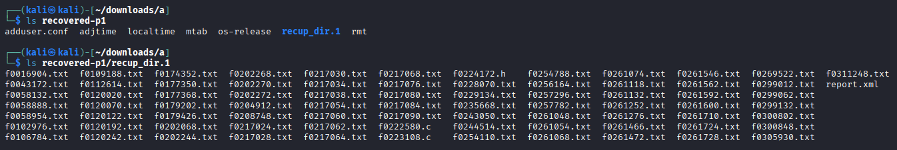

#### Use the `photorec` command to recover as many files as possible from partitions 1 and 3. Explain why the recovered files do not match those obtained in the previous step.

```bash
mkdir photorec
sudo photorec /dev/loop0p1
```

Click on "Proceed".

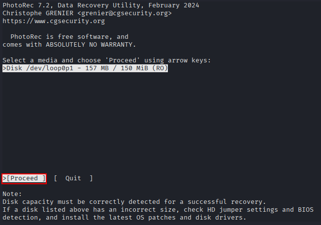

Click on "Search".

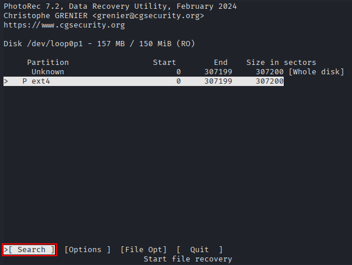

Click on "ext2/ext3".

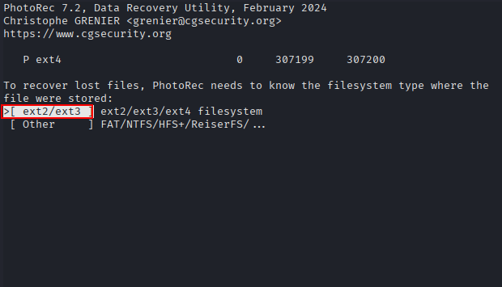

Click on "Whole".

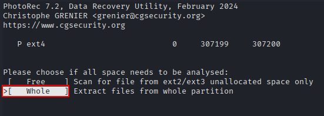

Click on "photorec", which is the directory created at the beginning.

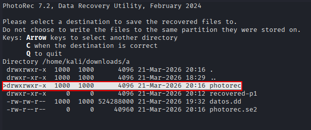

Press "C" to finish.

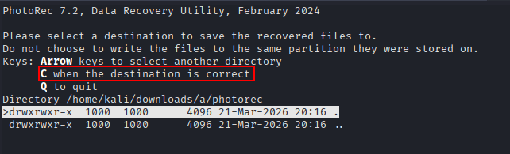

In this case, 118 files have been recovered.

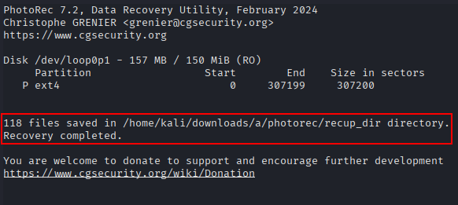
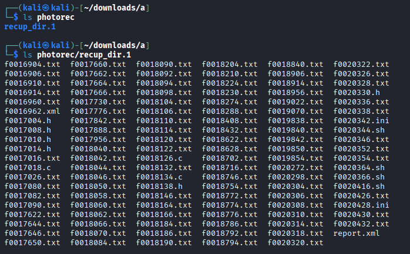

Repeat the same steps but using the partition 3.

In this case, 74 files have been recovered.

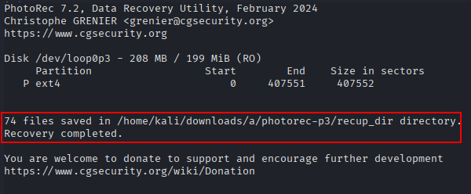

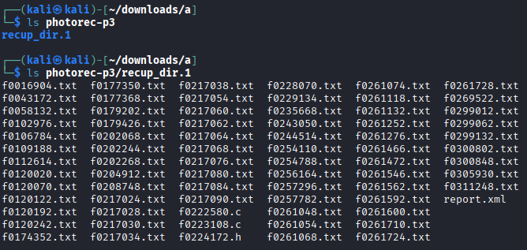

The difference in the number of recovered files between `tsk_recover` and `photorec` is due to how each tool works:

- tsk_recover recovers files by reading the filesystem metadata (inodes, directories, etc.).

This means it can only recover files that still have intact filesystem references.
If a file was deleted and its metadata is gone or overwritten, tsk_recover cannot find it.

- photorec ignores the filesystem structure and performs a raw data recovery by scanning the disk for known file signatures (headers and footers).

This allows it to recover files even if the filesystem metadata has been lost or damaged.
As a result, it often recovers more files, including ones that tsk_recover cannot see.

It is important to note that this does not mean that photorec is “better” than tsk_recover.

Both tools are different and complementary. Some files recovered by photorec may not be found by tsk_recover, and vice versa, depending on whether the filesystem metadata is intact.

---

## Part B: Live Evidence Acquisition

As we know, there are two types of forensic analysis: live analysis and post-mortem analysis.

Live analysis occurs while the system is still active during the investigation. In this scenario, volatile data can be acquired, such as RAM contents, running processes, Internet connections, and temporary files. If disk encryption is used, this type of analysis may allow access to the decrypted file system using cached keys.

However, this type of analysis requires more expertise, and the system continuously modifies its data, which may affect legal admissibility.

The analyst must also avoid trusting any tools provided by the system itself, as they may have been deliberately manipulated.

### Objective

- Develop a script capable of collecting the evidence listed below.

### Materials

- Any Linux distribution available on your system.

### Script Requirements

The goal is to create a custom SCRIPT that can be executed from an external USB drive connected to the computer. This script will perform tasks such as copying logs to the external USB drive and collecting system information including date, time, logged-in users, process tree, system uptime, and more.

The script must perform at least the following tasks:

- Copy the contents of log directories.
- Determine the system date.
- Determine the system hostname.
- Gather CPU information.
- Identify registered system users.
- Identify running processes.
- Determine the process tree (including arguments).
- Identify mounted disks/devices.
- Review the output of disk partitioning utilities (partitions).
- Obtain disk usage statistics.
- Determine loaded kernel extensions.
- Obtain kernel boot parameters.
- Determine system uptime.
- Determine system environment (OS version, kernel version, 32 or 64 bits).
- Determine system environment variables.
- Determine memory usage of running processes.
- Determine running services.
- Determine all loaded modules.
- Determine last logins.
- Review the contents of `/etc/passwd`.
- Review the contents of `/etc/group`.
- Determine the last login per user.
- Determine who is currently logged in.
- Determine the login name used (logname).
- Determine the groups to which the current user belongs (id).
- Review `.bash_history` for each user.
- Determine current network connections.
- Check network adapters/interfaces.
- Determine socket statistics.
- Determine the list of open ports.
- Determine the routing table.
- Determine the ARP table.
- Determine network interface information.
- Review allowed hosts.
- Review denied hosts.
- Obtain static DNS resolution configuration.
- Obtain dynamic gateway and DNS information in use.
- Search for files with active SUID or GUID permissions (2000 and 4000).

### Script

The script can be downloaded from [here](./script.sh).

It basically does every thing described above.

In order to run it, just run:

```bash
sudo chmod +x script.sh
sudo ./script.sh
```

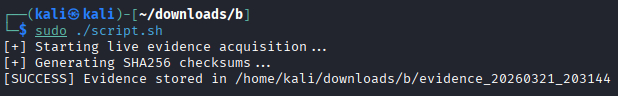

The script will automatically save the extracted data in a descriptive file inside the "logs", "network", "system" or "users" directories.

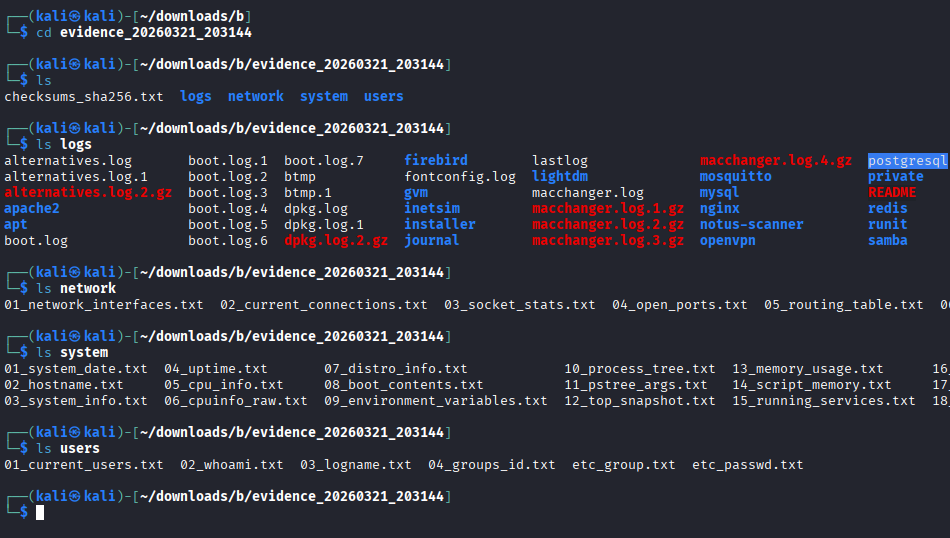