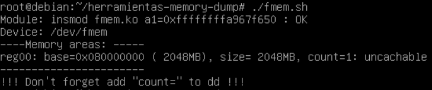
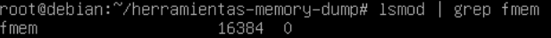
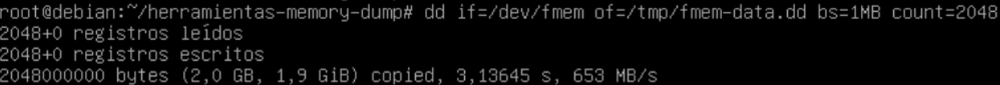
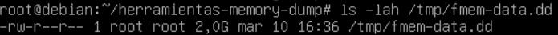
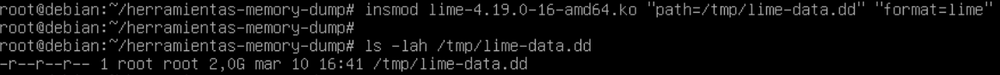
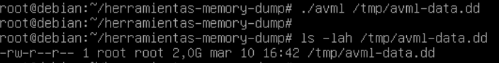

# Memory Dump

When in our forensic practice we face a “live” operating system,  
we will proceed to extract all possible evidence using a script like  
the one created in practice number 1.

The next steps to take into account would be performing a memory dump and  
obtaining a hard disk image. Creating the hard disk image does not present  
major difficulty; we will perform a cloning procedure using the `dd` command,  
similar to what we did in the practices of topic 2.

Regarding the memory dump, it should be noted that it is not an easy task in the  
sense that there is no “standard” tool, as was the case in Windows operating systems,  
that works for all Linux distributions. In most Linux scenarios, it is necessary  
to compile the memory extraction tools with the exact kernel version of the machine  
from which the dump is to be acquired.

## Objective

- Learn how to perform memory dumps in Linux using different tools.

## Materials

- Debian 10.9.0 64-bit distribution with kernel version 4.9.0-16-amd64  
- Memory extraction tools: memdump, fmem, LiME and avml. Download them from [here](https://drive.google.com/file/d/1Ft0o41wqiEySr9_E8merjTsOiRKelxsS/view?usp=sharing).

You are required to create a virtual machine with the distribution mentioned above  
and document, with usage examples, how the memory dump process takes place using  
the tools mentioned previously.

## Solution

### fmem

The first tool used is **fmem**, which allows access to physical memory through the `/dev/fmem` device once the module is loaded into the kernel.

Load fmem in memory:

```bash
./fmem.sh
```



Verify that it has been loaded:

```bash
lsmod | grep fmem
```



Create the dump using dd and /dev/fmem as input file

```bash
dd if=/dev/fmem of=<dump-location> bs=1MB count=2048
```


The dump should be done. Verify it using the following command:

```bash
ls -lah /tmp/fmem-data.dd
```



### lime

The second tool used is **LiME (Linux Memory Extractor)**, which is a kernel module specifically designed for forensic memory acquisition.

Once the module is loaded, LiME automatically writes the memory dump to the specified location. Verify that it has been dumped using ls

```bash
insmod lime-4.19.0-16-amd64.ko "path./<dump-location> format=lime"
```

```bash
ls -lah
```



### avml

The last tool used is **AVML (Acquire Volatile Memory for Linux)**, which is one of the easiest tools to use because it does not require manual kernel compilation in many cases.

In order to dump the memory, just run:

```bash
./avml <dump-location>
```

This command automatically acquires the memory dump and stores it in the specified location. Then, perform an ls and verify that the memory has been dumped.

