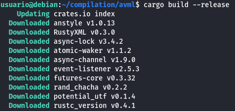
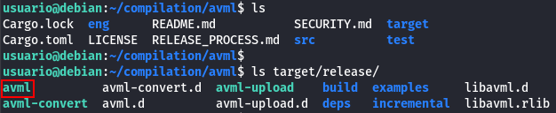
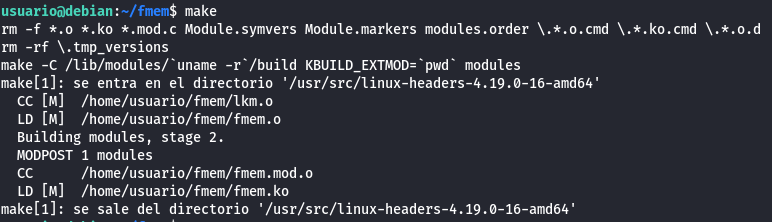
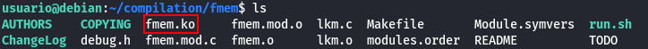
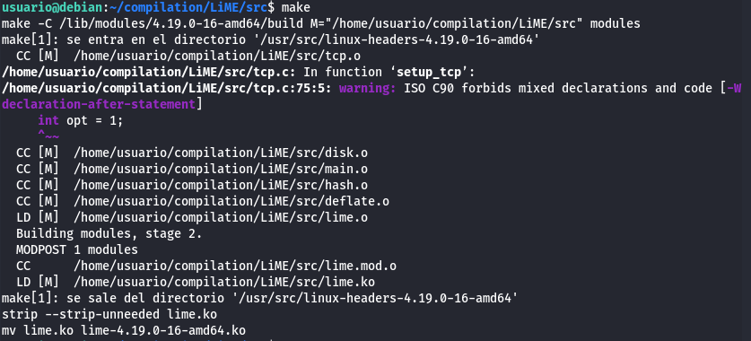
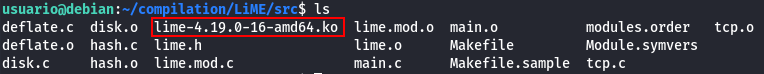

# Compile tools

## Memory Dump Compilation

When performing a forensic analysis on a "live" operating system, we will proceed to extract all possible evidence (artifacts) using a script similar to the one created in Lab 1.

The next steps to consider are performing a memory dump and obtaining a hard disk image. The hard disk image is straightforward; we can perform a cloning procedure using the `dd` command, similar to what we did in Lab 2.

Regarding the memory dump, using tools like **avml**, **fmem**, or **LiME** does not present difficulties once we have the tools compiled for the Linux kernel version where they will be executed.

### Objective

- Learn how to compile memory dump tools on Linux.

### Materials

- Debian 10.9.0 64-bit distribution with kernel version 4.9.0-16-amd
- Source code of the tools: fmem, LiME, and avml

### Useful Links

- [https://www.dwarmstrong.org/kernel](https://www.dwarmstrong.org/kernel)
- [https://www.kernel.org/doc/html/v4.10/process/applying-patches.html](https://www.kernel.org/doc/html/v4.10/process/applying-patches.html)
- [https://stackoverflow.com/questions/34379013/insmod-error-inserting-hello-ko-1-invalid-module-format](https://stackoverflow.com/questions/34379013/insmod-error-inserting-hello-ko-1-invalid-module-format)

### Instructions

Create a virtual machine where the above-mentioned distribution will be installed (you can reuse the one from Lab 2) and document the compilation process of the memory dump tools mentioned above starting from their source code.

## Solution

First, update the system and install the following commands in order to be able to download and compile the tools:

```bash
sudo apt update
sudo apt install wget git linux-headers-$(uname -r) gcc make dpkg-dev rustc cargo git
```

### avml

avml is a user-space memory dumper written in Rust. There is no need to manually compile avml because the binary works for most x64 or x86 versions (x86 binaries may not work on x64 due to differences in how they handle RAM). The binary can be downloaded from [here](https://github.com/microsoft/avml/releases).

However, if we want to compile it, we can do it as follows:

```bash
git clone https://github.com/microsoft/avml.git
cd avml
curl --proto '=https' -tls1.2 -sSf https://sh.rustup.rs | sh
source ~/.cargo/env
cargo build --release
```



Verify that it has been compiled:

```bash
ls target/release/
```



### fmem

fmem is a kernel module that exposes physical memory to userland. It must be compiled against the target kernel headers, so building it on the target VM is necessary for compatibility.

In order to compile it, run:

```bash
git clone https://github.com/NateBrune/fmem.git
cd fmem
make
```



Verify that the program has been compiled:

```bash
ls
```



### LiME

LiME is a loadable kernel module designed for acquiring memory images on Android and Linux.

Compile it as follows:

```bash
git clone https://github.com/504ensicsLabs/LiME.git
cd LiME/src
make
```



The program lime-version should appear, in this case: lime-4.19.0-16-amd64.ko


