# Volatility Linux

## Memory Volatility in Linux

Summarizing what was studied in class and what was experienced in the previous Practice 2, there are several ways to obtain a memory image from a Linux system. In addition to dumping memory from a virtual machine (VMware, VirtualBox, KVM, etc.) or capturing images through the FireWire interface, there are two ways to dump memory from a running system using live acquisition tools:

### 1. Copying /dev/mem directly using user‑space tools

The typical command could be:

```bash
dd if=/dev/mem of=test.dump bs=512 conv=noerror
```

However, this only works if the kernel option `CONFIG_STRICT_DEVMEM` is not enabled.  
You can check whether this feature is enabled by searching in:

```bash
/boot/config-$(uname -r)
```

If it is enabled, user‑space reads from `/dev/mem` or `/dev/kmem` cannot go beyond the first megabyte.  
If it is not enabled, LiME (see below) is not necessary and a kernel dump can be obtained as shown above.

Using LiME has two additional advantages:

- It can be used on Android systems.
- It allows dumping memory in a format compatible with standard kernel debuggers.

### 2. Using a special kernel module (LiME or fmem)

These are Loadable Kernel Modules (LKM) that allow volatile memory acquisition from Linux and Linux‑based devices such as Android.

LiME is the first tool that allows full memory capture on Android devices.  
It also minimizes interaction between the user and kernel space processes during acquisition, producing memory dumps that are more forensically reliable than those generated by other Linux memory acquisition tools.

## Tools used in this exercise

- **Volatility**  
  Open‑source software used to extract digital artifacts from volatile memory (RAM).  
  Developed and maintained by The Volatility Foundation.

- **Python**  
  Interpreted programming language required to run Volatility.  
  Version 2.6 minimum is required (2.7 recommended).  
  Current Volatility 2 versions do not support Python 3, therefore Volatility 3 has been developed to support Python 3.  
  Volatility requires several Python libraries that are not always installed automatically.

- **Distorm3**  
  Disassembler library for x86 / AMD64 architectures.  
  Converts binary data streams into assembly instructions represented as Python data structures.  
  Required for the Volatility plugins:
  - apihooks
  - impscan
  - callbacks
  - volshell
  - linux_volshell
  - mac_volshell

- **Yara**  
  Tool used to classify malware by creating malware signatures.  
  Required for the `yarascan` option in Volatility.

## Objective

- Learn how to perform basic memory dump analysis in Linux.

## Materials

- Any Linux distribution
- Volatility 2
- Volatility 3

## Tasks

Create or use a Linux virtual machine where the following tasks will be performed:

### 1. Download the memory dump of a Linux machine

Download this Linux [memory dump](https://drive.google.com/file/d/1CyqiIkxw4tHdL6OB38frX6idKMluitct/view?usp=share_link).

### 2. Volatility 2

#### a. Install Volatility 2

This are all the steps that I followed, probably there is an efficient way, but this is what worked for me

```bash
git clone https://github.com/volatilityfoundation/volatility.git
mv volatility volatility2
cd volatility2
sudo nano /etc/apt/sources.list # Paste deb http://archive.debian.org/debian/ stretch contrib main non-free
sudo apt update
sudo  python2.7 setup.py install
sudo apt install python2.7-dev
curl https://bootstrap.pypa.io/pip/2.7/get-pip.py -o get-pip.py
sudo python2 get-pip.py
sudo python2 -m pip install --upgrade setuptools wheel
sudo pip2 install virtualenv
python2 -m virtualenv venv
source venv/bin/activate
pip install distorm3 pycrypto openpyxl
pip2 install distorm3 yara-python pycrypto
```

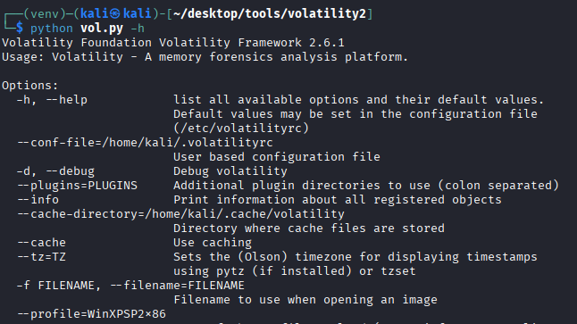

I want to execute volatility2 everywhere. It could be as follows:

```bash
nano /usr/local/bin/vol2
```

Paste this script:

```bash
#!/bin/bash
# Launcher for Volatility 2 on Kali with Python 2 virtualenv
# Adjust paths if your Volatility 2 folder is elsewhere

VENV_DIR="$HOME/desktop/tools/volatility2/venv"
VOL_DIR="$HOME/desktop/tools/volatility2"

# Check that virtualenv exists
if [ ! -d "$VENV_DIR" ]; then
    echo "[ERROR] Virtual environment not found at $VENV_DIR"
    exit 1
fi

# Activate virtualenv
source "$VENV_DIR/bin/activate"

# Run Volatility 2 with any arguments passed to this script
python "$VOL_DIR/vol.py" "$@"

# Deactivate virtualenv
deactivate
```

Deactivate the virtual environment created previously:

```bash
deactivate
```

Adjust the permissions:

```bash
sudo chmod +x /usr/local/bin/vol2
```

And feel free to use volatility2 everywhere:

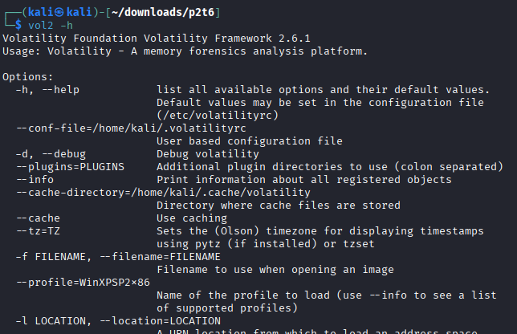

#### b. Prepare Volatility 2 to work with Linux profiles (linux overlays)

- Download this [volatility memory profile](https://drive.google.com/file/d/1bMbvUi50zUsxfeNgt5jT50eduAl7N5es/view?usp=share_link)and copy it into the correct directory (overlays/linux) so it can be used with Volatility 2.

Question:  
If you only had the memory dump, how could you determine the operating system version it belongs to?  
(Hint: banner modifier)

Move the volatility memory profile into the oeverlays/linux directory

```bash
cp debian10-4.19.0-23-686.zip ~/desktop/tools/volatility2/volatility/plugins/overlays/linux
```

Verify that volatility detects the profile correctly:

```bash
vol2 --info | grep Linuxdebian
```

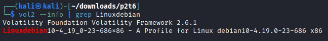

If we don't know the operating system version, we can use the following command to determine it:

```bash
strings ram.lime | grep "Linux version"
```

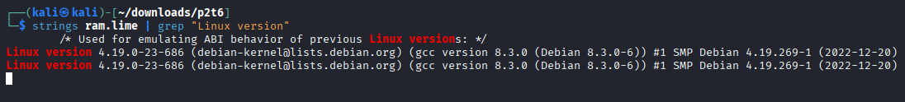

#### c. Perform basic analysis of Linux memory dumps

##### Process analysis

- linux_pslist

```bash
vol2 -f ram.lime --profile=Linuxdebian10-4_19_0-23-686x86 linux_pslist
```

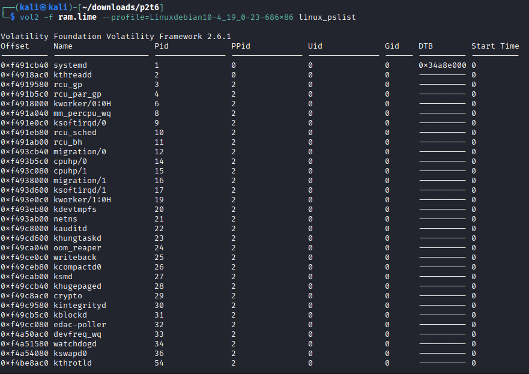

- linux_psaux

```bash
vol2 -f ram.lime --profile=Linuxdebian10-4_19_0-23-686x86 linux_psaux
```

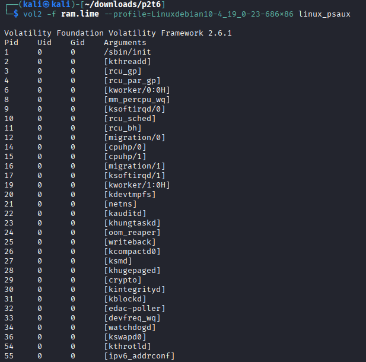

- linux_pstree

```bash
vol2 -f ram.lime --profile=Linuxdebian10-4_19_0-23-686x86 linux_pstree
```

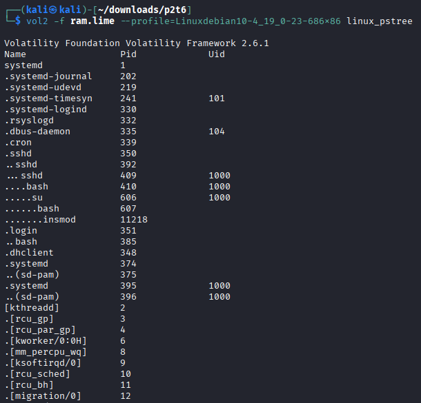

- linux_cpuinfo

```bash
vol2 -f ram.lime --profile=Linuxdebian10-4_19_0-23-686x86 linux_cpuinfo
```

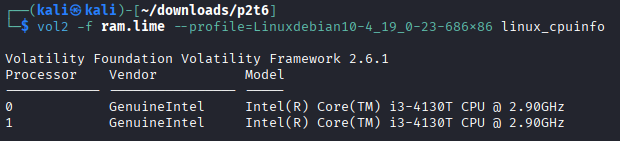

##### Network analysis

- linux_arp

```bash
vol2 -f ram.lime --profile=Linuxdebian10-4_19_0-23-686x86 linux_arp 
```

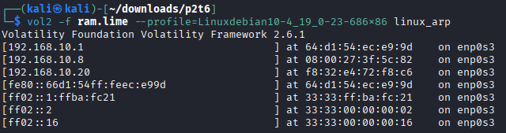

- linux_ifconfig

```bash
vol2 -f ram.lime --profile=Linuxdebian10-4_19_0-23-686x86 linux_ifconfig
```

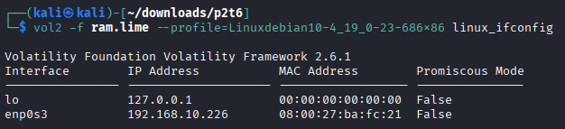

- linux_route_cache

```bash
vol2 -f ram.lime --profile=Linuxdebian10-4_19_0-23-686x86 linux_route_cache
```

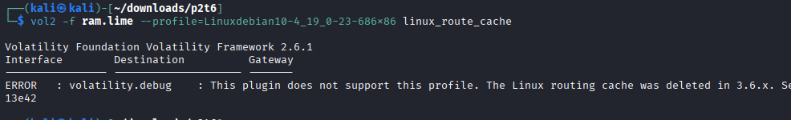

- linux_netstat

```bash
vol2 -f ram.lime --profile=Linuxdebian10-4_19_0-23-686x86 linux_netstat
```

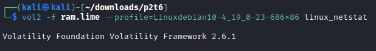

##### Files and kernel analysis

- linux_enumerate_files

```bash
vol2 -f ram.lime --profile=Linuxdebian10-4_19_0-23-686x86 linux_enumerate_files
```

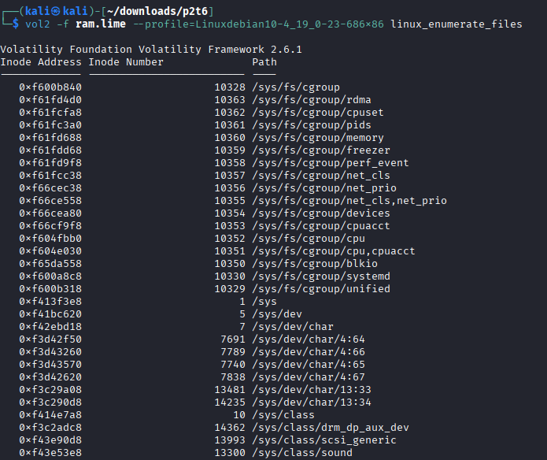

- linux_find_file

```bash
vol2 -f ram.lime --profile=Linuxdebian10-4_19_0-23-686x86 linux_find_file -F "/file"
```

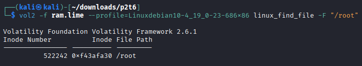

- linux_recover_filesystem

```bash
mkdir dump
sudo -E vol2 -f ram.lime --profile=Linuxdebian10-4_19_0-23-686x86 linux_recover_filesystem --dump-dir=dump
```

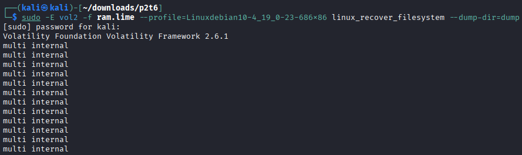

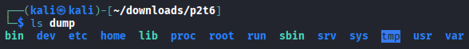

- linux_mount

```bash
vol2 -f ram.lime --profile=Linuxdebian10-4_19_0-23-686x86 linux_mount
```

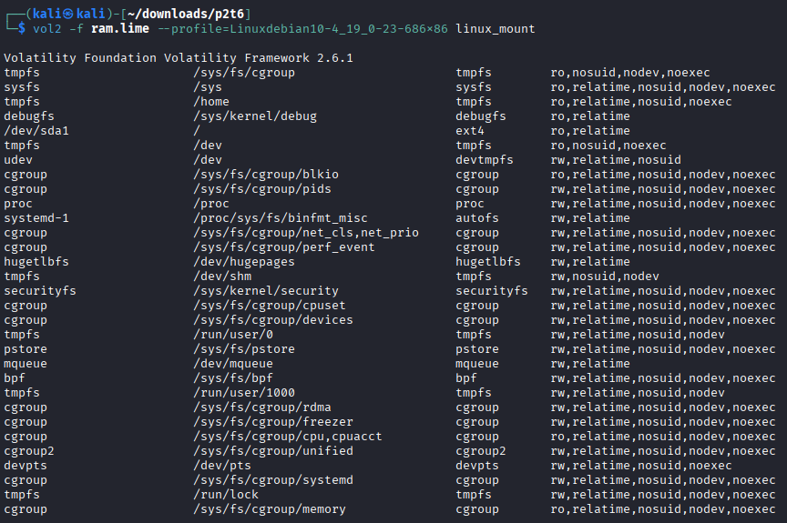

- linux_mount_cache

```bash
vol2 -f ram.lime --profile=Linuxdebian10-4_19_0-23-686x86 linux_mount_cache
```

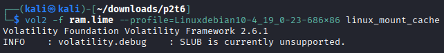

- linux_bash

```bash
vol2 -f ram.lime --profile=Linuxdebian10-4_19_0-23-686x86 linux_bash
```

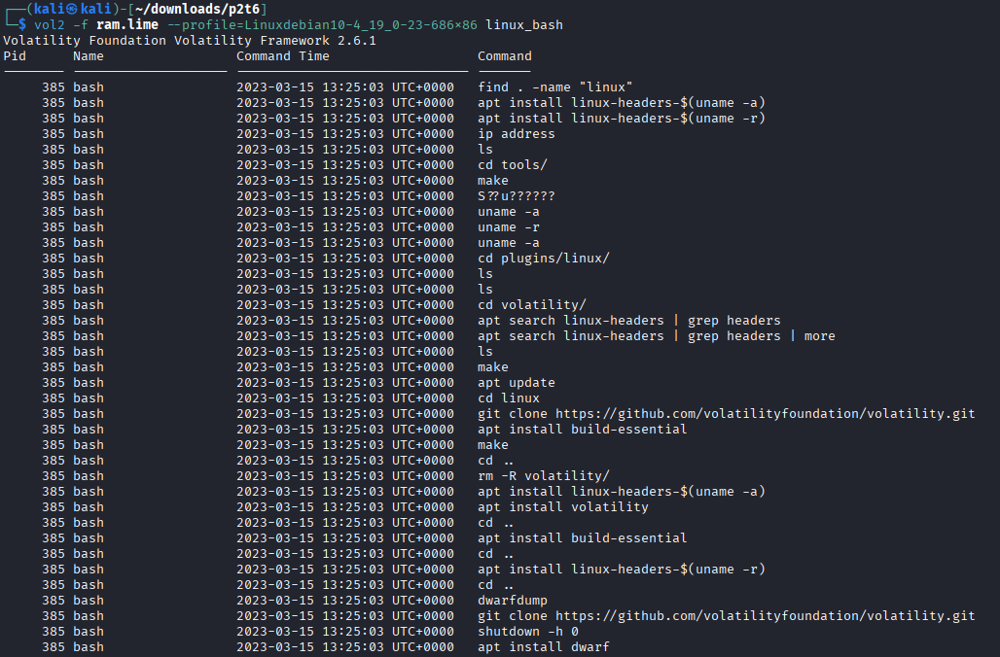

- linux_dmesg

```bash
vol2 -f ram.lime --profile=Linuxdebian10-4_19_0-23-686x86 linux_dmesg
```

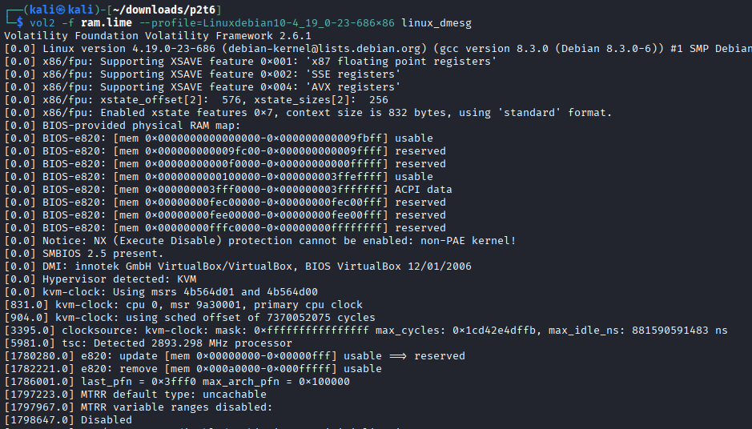

#### d. Generate specific profiles for Volatility

Follow the steps explained in class to generate a specific Volatility profile for the Linux system used in this practice using:

- module.dwarf
- /boot/config
- System.map

```bash
sudo apt install dwarfdump build-essential linux-./images/image-($uname -a) linux-headers-$(uname -r)
```

```bash
cd volatility2/tools/linux
make
```

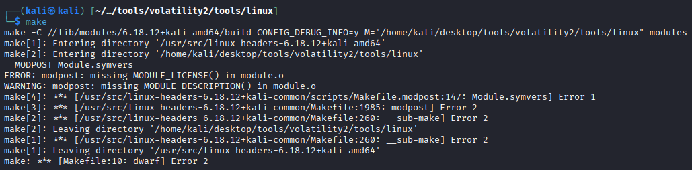

The previous error is due we have to accept the GLP license before compiling. Edit `module.c` to acept said license.

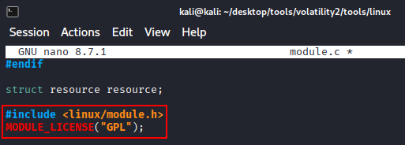

```bash
make
```

Note: After performing the following steps using my Kali I had problems, so that I decided to use another machine using an older kernel and it works correctly:

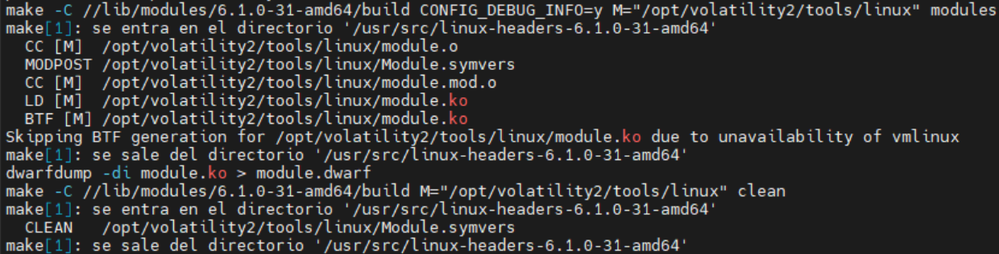

Make the zip file Debian-6.1.0-31-amd64

```bash
zip Debian-6.1.0-31-amd64 module.dwarf /usr/lib/debug/boot/System.map-6.1.0-31-amd64
```

Move it inside plugins/linux

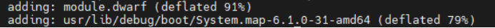

```bash
mv Debian-6.1.0-31-amd64 volatility2/volatility/plugins/linux/
```

Verify that volatility 2 correctly identifies it.

```bash
vol2 --info | grep Linux
```

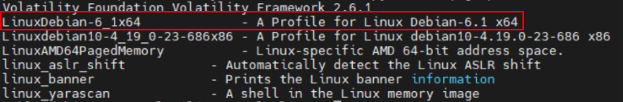

### 3. Volatility 3

#### a. Install Volatility 3

Run the following commands:

```bash
git clone htts://github.com/volatilityfoundation/volatility3.git
sudo apt install python3-pip python3-setuptools python3-wheel python3-distorm3 python3-construct python3-yara libsqlite3-dev tk-dev libc6-dev libbz2-dev
```

```bash
sudo nano /usr/local/bin/vol3
```

Paste this script.

```bash
#!/bin/bash
# Launcher for Volatility 3 on Kali with Python 3 virtualenv
# Adjust paths if your Volatility 3 folder is elsewhere

VENV_DIR="$HOME/desktop/tools/volatility3/venv"
VOL_DIR="$HOME/desktop/tools/volatility3"

# Check that virtualenv exists
if [ ! -d "$VENV_DIR" ]; then
    echo "[ERROR] Virtual environment not found at $VENV_DIR"
    exit 1
fi

# Activate virtualenv
source "$VENV_DIR/bin/activate"

# Run Volatility 3 with any arguments passed to this script
python "$VOL_DIR/vol.py" "$@"

# Deactivate virtualenv
deactivate
```

Change the permissions:

```bash
sudo chmod +x /usr/local/bin/vol3
```

Run volatility3 everywhere

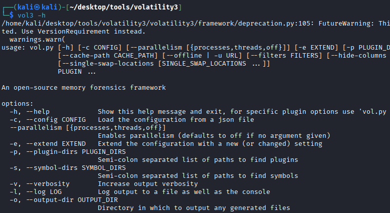


#### b. Prepare Volatility 3 to work with Linux profiles

- Download the profile that matches the dump from section (1).
- Copy it into the SYMBOLS directory of Volatility 3.


```bash
cp debian10-4.19.0-23-686.zip ~/desktop/tools/volatility3/volatility3/symbols
```

#### c. Perform basic analysis of Linux memory dumps

Note: I had some problems again with some commands in my personal Kali, I'm still investigating why, then, I will use the same Debian I used with volatility2

Use the following plugins:

- banners.Banners


```bash
vol3 -f ram.lime -s ~/desktop/tools/volatility3/volatility3/symbols/ banners.Banner
```

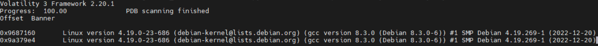

- linux.bash.Bash

```bash
vol3 -f ram.lime -s ~/desktop/tools/volatility3/volatility3/symbols/ linux.bash.Bash
```

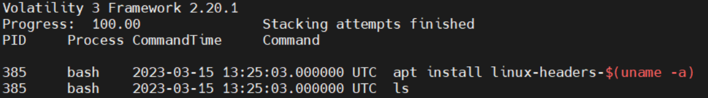

- linux.kmsg.Kmsg

```bash
vol3 -f ram.lime -s ~/desktop/tools/volatility3/volatility3/symbols/ linux.kmsg.Kmsg
```

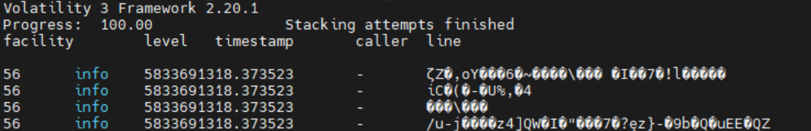

- linux.lsmod.Lsmod

```bash
vol3 -f ram.lime -s ~/desktop/tools/volatility3/volatility3/symbols/ linux.lsmod.Lsmod
```

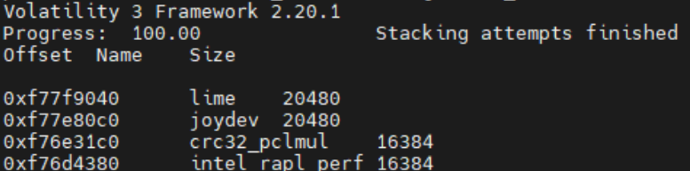

- linux.lsof.Lsof

```bash
vol3 -f ram.lime -s ~/desktop/tools/volatility3/volatility3/symbols/ linux.lsof.Lsof
```

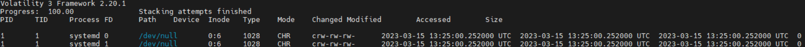

- linux.malfind.Malfind

```bash
vol3 -f ram.lime -s ~/desktop/tools/volatility3/volatility3/symbols/ linux.malfind.Malfind
```

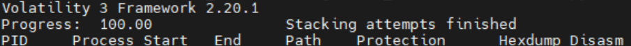

- linux.mountinfo.MountInfo

```bash
vol3 -f ram.lime -s ~/desktop/tools/volatility3/volatility3/symbols/ linux.mountinfo.MountInfo
```

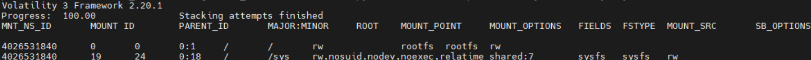

- linux.proc.Maps

```bash
vol3 -f ram.lime -s ~/desktop/tools/volatility3/volatility3/symbols/ linux.proc.Maps
```

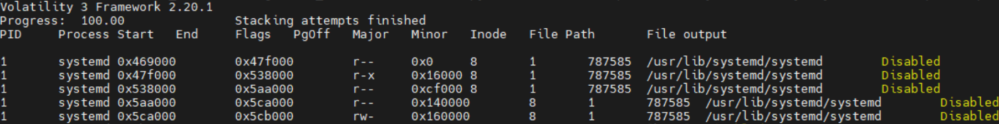

- linux.psaux.PsAux

```bash
vol3 -f ram.lime -s ~/desktop/tools/volatility3/volatility3/symbols/ linux.psaux.PsAux
```

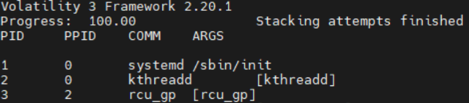

- linux.pslist.PsList

```bash
vol3 -f ram.lime -s ~/desktop/tools/volatility3/volatility3/symbols/ linux.pslist.PsList
```

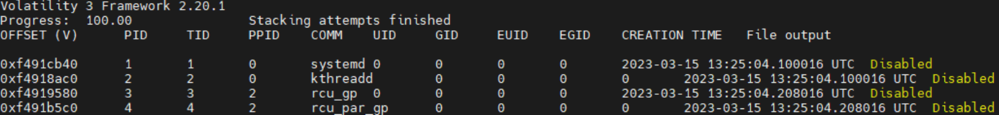

- linux.psscan.PsScan

```bash
vol3 -f ram.lime -s ~/desktop/tools/volatility3/volatility3/symbols/ linux.psscan.PsScan
```

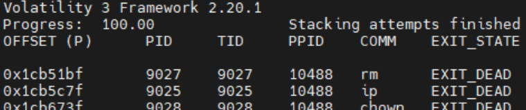

- linux.pstree.PsTree

```bash
vol3 -f ram.lime -s ~/desktop/tools/volatility3/volatility3/symbols/ linux.pstree.PsTree
```

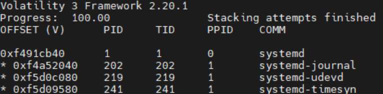

- linux.sockstat.Sockstat

```bash
vol3 -f ram.lime -s ~/desktop/tools/volatility3/volatility3/symbols/ linux.sockstat.Sockstat
```

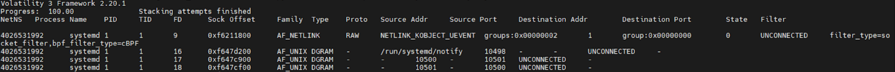

#### d. Generate specific profiles for Volatility

Follow the steps explained in class to generate a specific Volatility profile for the Linux system used in this practice using:

- dwarf2json
- vmlinux
- System.map

Generating a profile in volatility 3 is really easy. Run the following commands changing the kernel module from your real kernel version.

```bash
git clone https://github.com/volatilityfoundation/dwarf2json.git
sudo apt install golang-go
cd dwarf2json
sudo go build .
./dwarf2json linux --elf /usr/lib/debug/lib/modules/6.1.0-31-amd64/vmlinux > debian12-kernel.json
```

Then, verify that it has been compiled correctly:

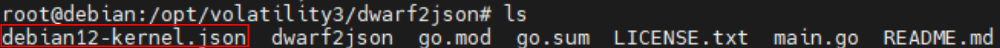


