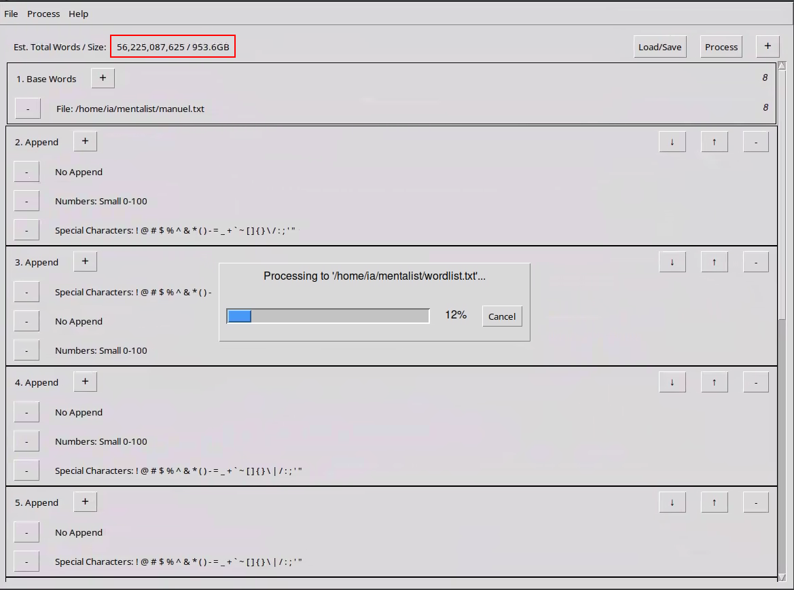

links

[ram](https://drive.google.com/file/d/1BmAR1cny_JfWmiTsWOXmmnGDmVPEzc8P/view?usp=sharing)

[disk](https://drive.google.com/file/d/1MOLyIXZJLdsFTofNxv1BuhV5ZVUIKTgj/view?usp=sharing)

la primera es muy fácil, meter el perfil y hacerle un sockscan

la segunda:

fdisk -l lampmunics.img

vemos que hay 2 partes

losetup -f -P lampmunics.img

mkdir /media/

mount /dev/loop0p1 /media/par1 -o ro

cd /media/part1CapC
dsffds](image-9.png)](image-8.png)](image-7.png)](image-6.png)](image-5.png)](image-4.png)](image-3.png)](image-2.png)](image-1.png)](image.png)
ls

vemos qu eno hay gran cosa

umount /media/par1

y montamos otra parte

mount /dev/loop0p2 /mnt/part1 -o ro

pero no funciona porque ess una partición lvm

podemos usar los comandos: pvs, vgs y lvs para listar las particiones de este

con esos comandos podemos ver que este lvm está hecho por 2 discos

con: vgchange -ay podemos activar los voñumenes lógicos´

mount /dev/VolGroup00/LogVol00 /media/part1 -o ro

cd /media/part1

ls

y vemos un sistea de linux entero. para cambiar el root y poder ejecutar comadnos como si esetuviéramos en esa máquina:

chroot /media/part1

pero nos saldrá un error, se corrige así:

mount --bind /dev /media/part1/dev
mount --bind /proc /media/part1/proc
mount --bind /sys /media/part1/sys

chroot /media/part1 /bin/bash

y ahora tenemos una bash con el sistema que estamos auditando

ahora si hacemos un history vemos qué comandos se han ejecutado

su - achen

history

vemos que ha hecho un sudo su