# Linux challenges

## Atenea challenge

### Introduction

Una de las alertas del SIEM ha reportado que determinado equipo Linux está realizando multitud de peticiones a una IP externa. Se sospecha que la máquina ha podido ser comprometida. Para comenzar la investigación se ha realizado un volcado de memoria antes de apagar dicho equipo.

Como analista forense deberás identificar el PID dañino responsable de esta alerta (por ejemplo: 1255)

Puede descargar el volcado de memoria [aquí](https://drive.google.com/file/d/1BmAR1cny_JfWmiTsWOXmmnGDmVPEzc8P/view?usp=sharing).

### Solution

First, verify what distro and kernel version the dump is by performing the following command:

```bash
vol3 -f dump-practica5 banners.Banner
```
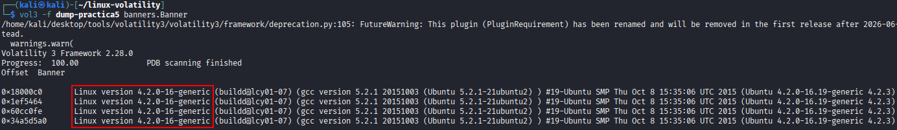

As shown, it is a Ubuntu 4.2.0-16 generic. Then, downlaod a volatility profile for said linux version from the following [github repository](https://github.com/Abyss-W4tcher/volatility2-profiles/blob/master/Ubuntu/amd64/4.2.0/16/generic/Ubuntu_4.2.0-16-generic_4.2.0-16.19_amd64.zip).

Move said `.zip` file into your volatility's plugin directory and verify that it is being used by volatility. Note that in this case I'm using volatility2 instead of volatility3.

```bash
mv ~/downloads/Ubuntu_4.2.0-16-generic_4.2.0-16.19_amd64.zip ~/desktop/tools/volatility2/volatility/plugins/overlays/linux/
vol2 --info | grep Linux
```

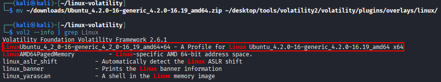

After all this configuration, we have more specific commands to create network maps and process listing of the memory. In order to see the connections, run the following command:

```bash
vol2 --profile=LinuxUbuntu_4_2_0-16-generic_4_2_0-16_19_amd64x64 -f dump-practica5 linux_netstat 
```

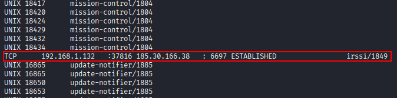

As shown, there is a connection between the device and a external IP using the "irssi" process.

Let's check for more weird processes using pslist:

```bash
vol2 --profile=LinuxUbuntu_4_2_0-16-generic_4_2_0-16_19_amd64x64 -f dump-practica5 linux_pslist 
```

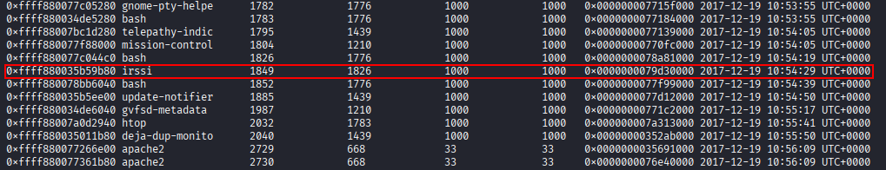

The same process "irssi" with PID 1849 is shown. After this analysis, SSH and irssi proccess may are suspicius.

Create a process map of irssi:

```bash
vol2 --profile=LinuxUbuntu_4_2_0-16-generic_4_2_0-16_19_amd64x64 -f dump-practica5 linux_proc_maps -p 1849
```

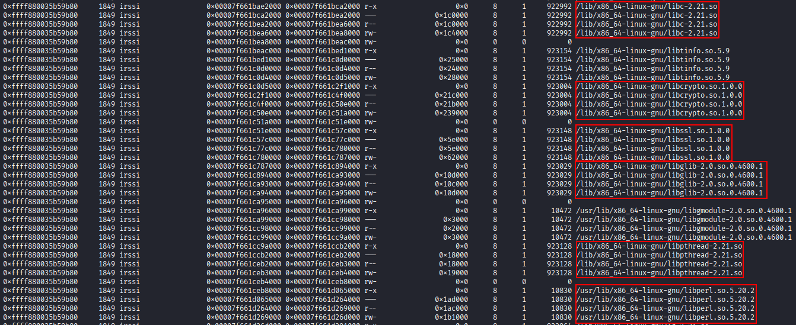

TBD explicar esto de aquí abajo, ponerlo en inglés y parafrasearlo:

Aquí encontramos varios elementos clave para determinar que se trata de este proceso.

    El proceso está usando librerías de criptografía y ssl, confirmando que se realizan comunicaciones cifradas.


    Tiene cargadas librerías para manejo de sockets y red.


    Tiene cargada una librería para soporte de Perl.


Esto es particularmente sospechoso porque significa que el proceso puede ejecutar scripts Perl, que es una capacidad comúnmente usada en malware basado en IRC para ejecutar comandos o payloads adicionales.

Conclusión

Si combinamos esto con la conexión establecida que encontramos antes:

    Conexión cifrada al puerto 6697 (IRC sobre SSL)
    Capacidad de ejecución de scripts Perl
    Conexión persistente a una IP externa

Todo apunta a que este proceso podría estar siendo usado como un bot IRC o un canal de comando y control (C2). Los atacantes frecuentemente usan clientes IRC legítimos como IRSSI modificados para mantener persistencia y control remoto en sistemas comprometidos.

## Forense Post-mortem Linux

El 5 de abril de 2022, la policía fue contactada por una empresa, ya que su sistema había sido hackeado. Has sido contratado para trabajar con la policía con el objetivo de ayudarles a encontrar evidencia que demuestre la invasión realizada por el cracker. Al hablar con el administrador del sistema, él afirmó que solo los siguientes puertos estaban abiertos en la máquina: 21, 22, 23, 3306, 123, algunos de los cuales son utilizados por él para realizar el mantenimiento del sistema.

### Objetivo:

El objetivo principal es encontrar evidencia, ya sean registros del sistema, comandos ingresados, puertos abiertos, aplicaciones maliciosas, entre otros.

### Consejos:

Se puede utilizar cualquier técnica forense, comando y herramienta para resolver el escenario.

### Pistas:

- ¿Qué usuario fue agregado por el atacante?
- ¿Hay algún malware instalado en la máquina?
- Intenta indicar la ruta del directorio en el que posiblemente se hayan accedido o modificado archivos considerados confidenciales.
- ¿Se han abierto puertos por el atacante? ¿Cuáles?
- ¿Se ha programado la ejecución de algún script malicioso?

Download the image disk form [here](https://drive.google.com/file/d/1MOLyIXZJLdsFTofNxv1BuhV5ZVUIKTgj/view?usp=sharing).

Once downloaded, mount the image:

```bash
sudo losetup -fP postmortem.img
mkdir postmortem
sudo mount -o ro /dev/loop0 postmortem
cd postmortem
```

Verify the content once mounted:

```bash
ls -lah
```

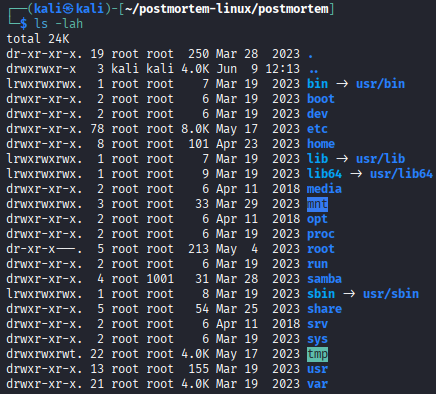

Firstly, check if there is somwthing weird between the users of the system:

```bash
cat etc/passwd
```

As shown above, a user called "ghostHacker" exists in the system. Probably it is not inteded to be there and may have been created by the hacker.

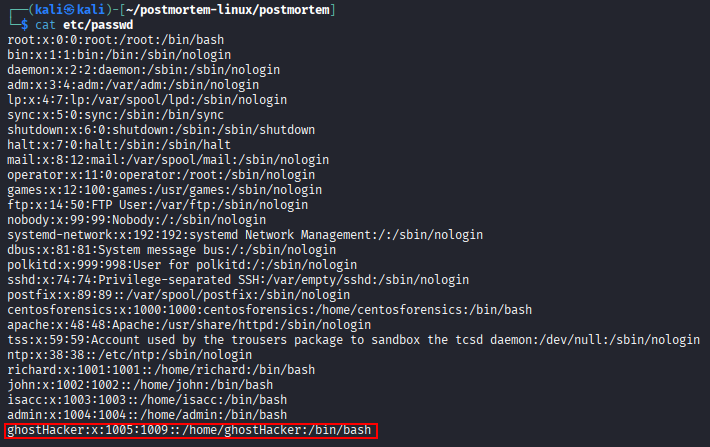

In order to know persistant scripts in the system, check the cron logs:

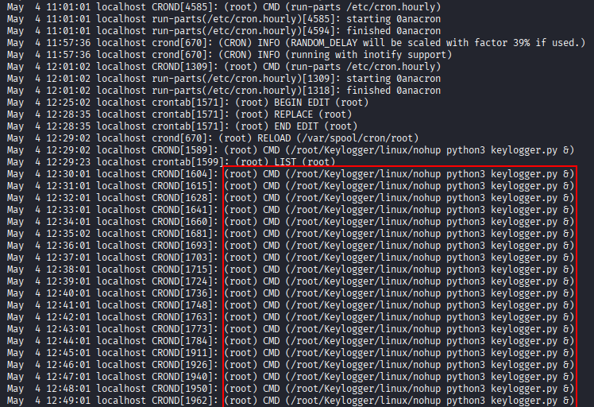

As shown, the logs demonstrate that there is a Keylogger in the system.

Verify ssh logs for possible extrange logs:

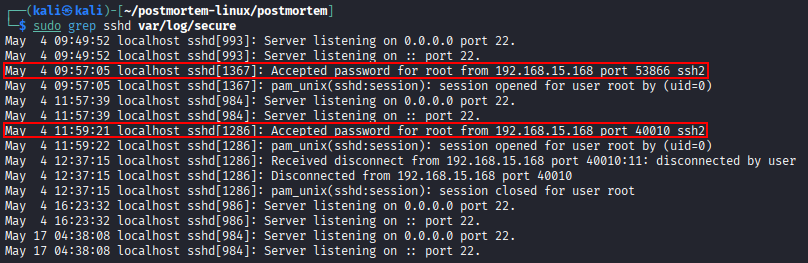

There are two SSH successull connections with user:password, maybe the hacker accessed the system via SSH once he obtained a password via phising or force bruting.

Check if the bash history has more evicences:

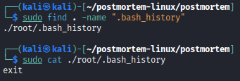

Only the "exit" command is shown, probably the hacker has removed all the history after performing the work.

After a few more investigation, a modified file can be shown:

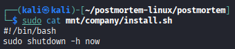

It was supposed to be an installer, however, it only shutdowns the PC.

After analyzing the firewalld logs, it can be seen that the port 88 is open. It can be intended or not.

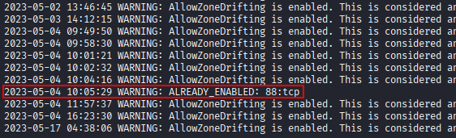

TBD poner mejor las conclusiones en base a lo que se ve arriba, parafrasear y poner en inglés:


Conclusiones
El atacante accedio al sistema como root usando la contraseña de ssh, posiblemente obtenida
mediante ingenieria social o fuerza bruta, pues en el registro se ven multiples intentos fallidos.
Una vez dentro, la linea de post-explotación fue la siguiente:
El atacante creo el usuario ghostHacker para establecer redundancia.
El atacante edito los ficheros en la ruta /mnt/company
El atacante abrio el puerto 88.
El atacante instalo un keyloger y programo su ejecución en crontab.
Una vez tenia lo que queria, borro los ficheros .bash_history y cerro de la shell