# Forensic analysis with diferent Linux file systems.

## Objective

- Learn how to access potential evidence contained in disk images acquired from Linux-based systems.
- Use file recovery tools for deleted data: foremost, PhotoRec, and Scalpel.

## Materials

- Kali Linux distribution.
- Built-in system tools: `mount`, `losetup`, `fdisk`, etc.
- Forensic tools: The Sleuth Kit, foremost, Scalpel, and PhotoRec.
- Online reference material.

One of the most common day-to-day tasks for a digital forensic examiner is to create forensic disk images — while maintaining proper chain of custody — and then analyze their contents.

To do this effectively, it is essential to understand the characteristics of the different file systems used by Linux operating systems, so that evidence stored in these images can be accessed correctly.

Investigators may also encounter more complex configurations such as LVM, ZFS, or LUKS encryption, which make access to stored data more challenging.

For this exercise, download the following disk images:

- **[Data](https://drive.google.com/file/d/1eN9oT3m66BphGWj5T-eEdU4GOpory-xm/view)** — a standard disk image (ext4). Mount the identified partitions and apply deleted-file recovery tools (PhotoRec, foremost, and Scalpel).
- **[LVM](https://drive.google.com/file/d/1Zy35lShfEQ4zTsOFdax09p4N1I-ko9Y8/view)** — a disk using logical volumes. Follow the steps required to activate the volume groups and logical volumes in order to access their contents.
- **[Encryption](https://drive.google.com/file/d/12BHCF2zr9Pp9wHRLlvic28pvehmarE27/view)** — a LUKS-encrypted disk (password: `"usuario"` — Spanish for *"user"*). Decrypt and access the data it contains.

## Solution

### Data

Attach and mount the image using the following commands. The loop device number may vary depending on whether other images are already attached. Begin with the first partition (`loopXp1`):

```bash
sudo losetup -fP datos.dd
mkdir evidences
sudo mount -o ro /dev/loop1p1 evidences
```

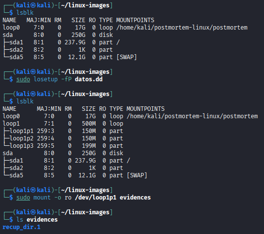

Only one directory is present: `recup_dir.1`. Review its contents:

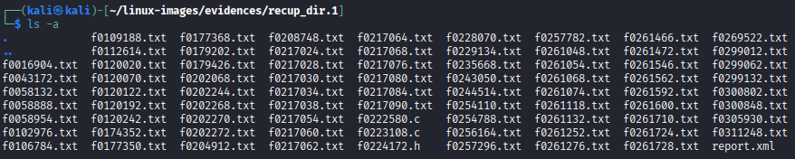

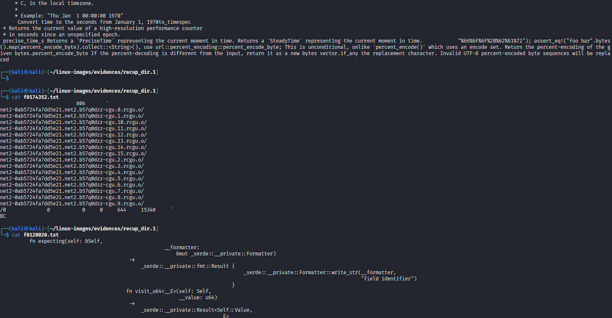

The directory contains multiple recovered files. Unmount the first partition and mount the second:

```bash
sudo umount /dev/loop1p1
sudo mount -o ro /dev/loop1p2 evidences
```

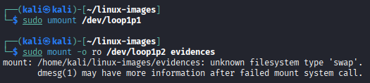

The second partition cannot be mounted because it is a swap partition. Mount the third and final partition instead:

```bash
sudo mount -o ro /dev/loop1p3 evidences
```

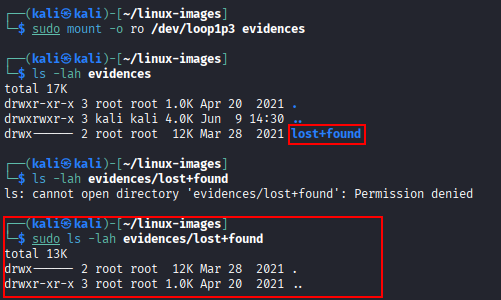

Only an empty `lost+found` directory is present — deleted files are not visible through a normal mount.

Use **PhotoRec** to recover deleted files. Launch the tool and select the first partition:

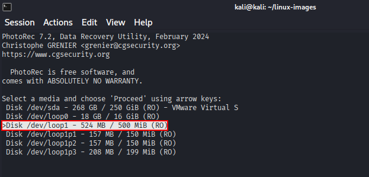

Select "Linux".

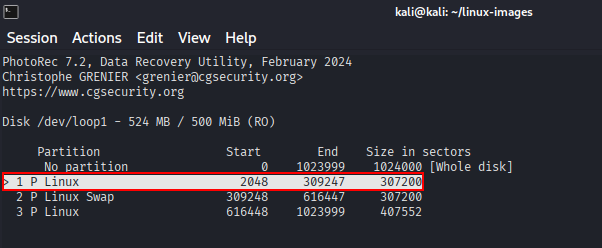

Select "ext2/ext3".

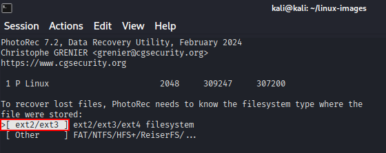

Select **Whole** to scan the entire partition and recover as many files as possible.

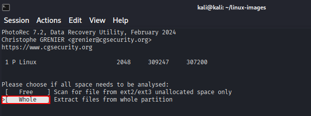

As shown below, many files have been recovered.

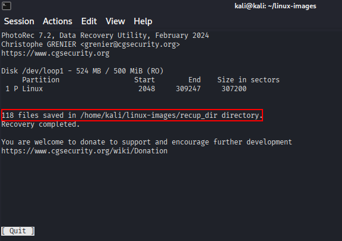

Repeat the same PhotoRec process for the third partition.

After both recovery runs, a large number of deleted files are restored:

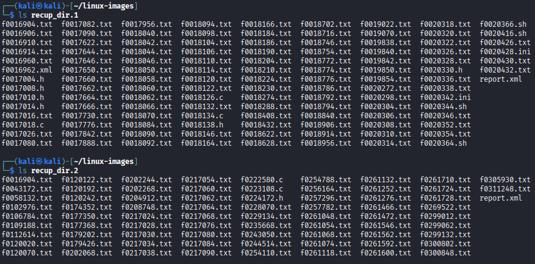

### LVM

Attach the image and verify the file system layout:

```bash
sudo losetup -fP lvm.dd
lsblk -f
```

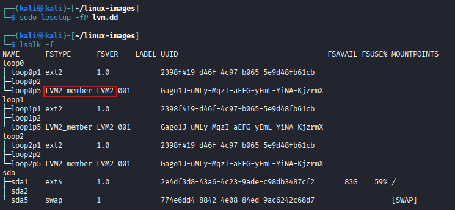

As shown, the disk uses **LVM2** (Logical Volume Manager).

Activate the volume group to expose the logical volumes:

```bash
sudo vgscan
sudo vgchange -ay
lsblk
```

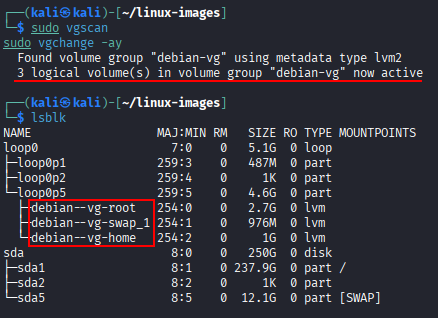

Mount the logical volumes and verify that the file systems are accessible:

```bash
sudo mount /dev/debian-vg/root evidences/root/
sudo mount /dev/debian-vg/home evidences/home/
```

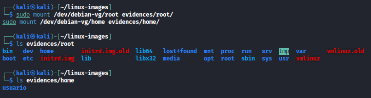

### Encryption

Attach the disk image and confirm that it is encrypted:

```bash
sudo losetup -fP cifrado.dd
lsblk
```

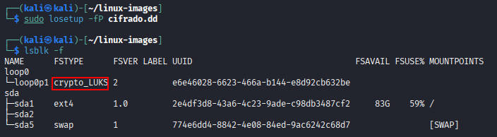

The partition is encrypted with **LUKS**, as shown above.

Additional metadata about the encrypted volume can be inspected with:

```bash
sudo cryptsetup luksDump /dev/loop0p1
```

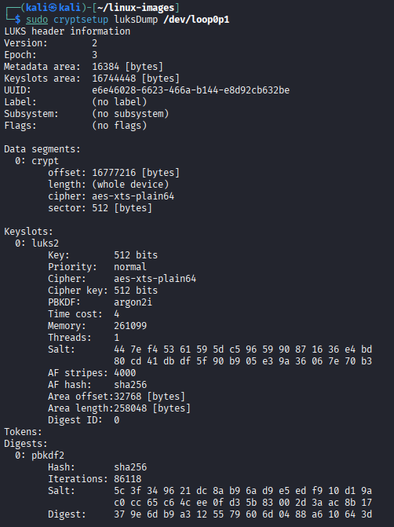

To decrypt the volume, open the LUKS container and enter the password `"usuario"` when prompted. Then mount the decrypted mapper device:

```bash
sudo cryptsetup luksOpen /dev/loop0p1 decrypted
sudo mount /dev/mapper/decrypted evidences
```

The file system becomes accessible and its contents can be examined normally.

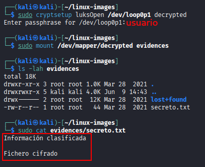