# Email Forensic Analysis

## Introduction

Email is one of the most common communication methods nowadays. Social networking sites have recently started to surpass email, but social networks are still mainly used for private communications.

Companies use email to communicate with future, current, and past customers. They rely on it for customer service, product support, and ongoing communication about product or policy changes. Help desk applications receive emails to create support tickets, and computers and applications send email alerts to administrators.

For a moment, think about how it would affect you if email stopped working for a day.

Email was not originally designed with security in mind. It was originally created to send text messages to designated people on a single machine and later through simple networks. The design allows malicious users to redirect email messages. It also allows anyone with access to a system that processes email to modify an email message.

Anyone with access to networks where emails are transmitted or to computers where emails are processed can read the emails stored there.

There is no built-in mechanism to make email confidential (such as encryption), to verify that the content of an email has not been modified (such as hashing), or to verify who sent the email (such as a digital signature).

Email does not have a built-in method to verify the identity of a sender. Although we are trusted to enter our correct identity into our email programs, nothing prevents us from using fraudulent addresses.

Someone can configure an email program to send emails with fake addresses, and even without an email client, it is quite trivial to use simple tools such as Telnet to create fraudulent emails with forged sender addresses. Some email providers try to solve this issue with special configurations on their mail servers, but many others do not.

Email was never created to maintain the confidentiality and privacy of email content. The text of a message is transmitted in plain text, meaning that anyone with a tool capable of monitoring the network can read the email.

Basic tools such as network monitoring utilities or packet sniffers can view emails. Common tools such as regular email clients and Telnet can also be used to create fraudulent emails.

The good news is that there are tools available that can overcome these challenges.

## Objectives

The aim of this practice is to become aware of the main security aspects related to email and to learn how to study forensic evidence provided by email headers.

## Materials

This exercise uses webmail, online analysis tools, and the email clients Thunderbird and Outlook.

## Tasks

### 1) Familiarization with Email Headers

**a) Open your personal webmail account.**

In this practice I use Gmail as my email provider and webmail client.


**b) Access the full format of one of your emails.**

To access the original email source code, I open the selected email, click the three-dots menu, and choose "Show original". Once opened, the complete raw email becomes visible, including all the headers generated during the delivery process.


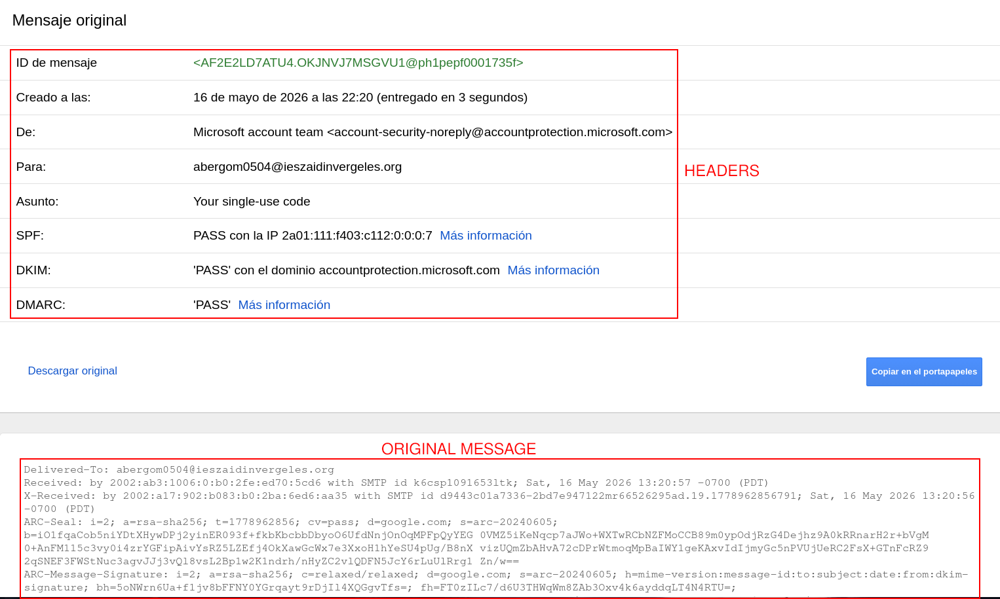

**c) Copy the complete format and use a tool to analyze the email headers.**

For the analysis of the email headers, I used the Google Message Header Analyzer:

https://toolbox.googleapps.com/apps/messageheader/analyzeheader

I copied the full raw email, pasted the content into the analysis tool, and reviewed the forensic information it produced. The tool reports details about message routing, origin servers, authentication mechanisms, delivery timestamps, and SPF, DKIM, and DMARC validation.


**d) Comment on the meaning of the headers.**

The headers of an email contain metadata generated during the transmission process between servers. These headers are essential in forensic investigations because they help identify the origin of a message, the route it followed, and whether authentication mechanisms were correctly applied.

| Header | Meaning |
|---|---|
| Message-ID | Unique identifier generated by the sending server. |
| Date | Date and time when the message was sent. |
| From | Sender email address. |
| To | Recipient email address. |
| Subject | Subject of the email. |
| Return-Path | Address where delivery errors are returned. |
| Received | Shows the route followed between mail servers. |
| SPF | Verifies whether the sending server is authorized to send emails for the domain. |
| DKIM | Verifies message integrity using digital signatures. |
| DMARC | Defines policies for SPF and DKIM validation failures. |
| MIME-Version | Indicates the MIME version used in the message. |
| Content-Type | Indicates the content format of the message. |

**e) Learn how to verify the DKIM information (selector, domain, and public DKIM key) that appears in the header: https://dkimcore.org/tools/**

To verify DKIM information, the first step is to locate the `DKIM-Signature` header inside the raw email source. Within that header, the signing domain (`d=`) and the DKIM selector (`s=`) are the fields that matter most. Those values can be entered into the DKIMCore tool, which retrieves the public DKIM key published in DNS and checks whether the signature is legitimate.

In practice, I located the `DKIM-Signature` line in the raw message, noted the selector and domain, ran the lookup in DKIMCore, and confirmed that the signature matched the published key.

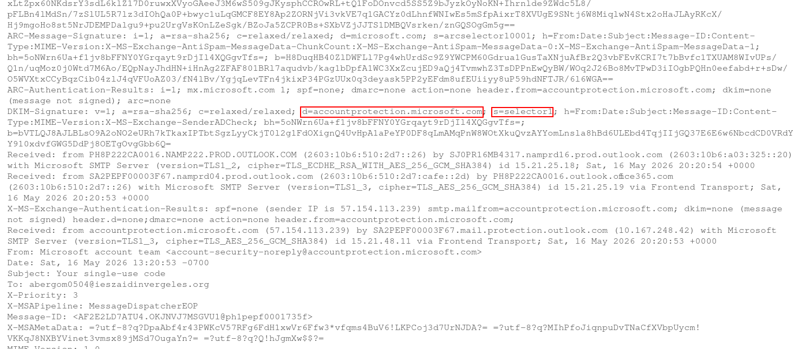

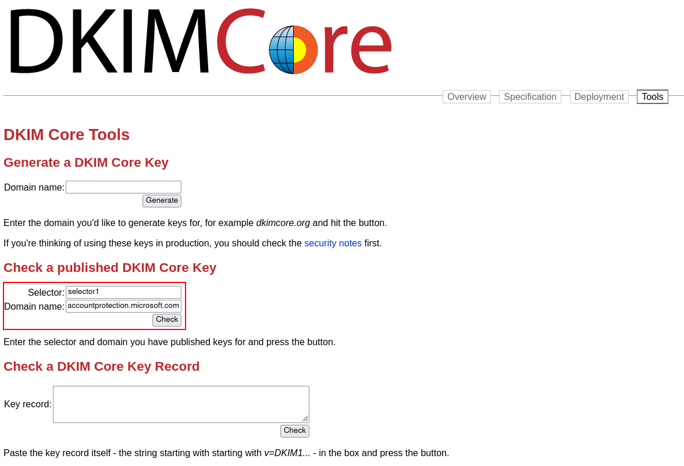


### 2) Spoofing

**a) Use an online tool to send yourself an email using identity spoofing techniques. For example, send yourself an email with the sender address: billgates@microsoft.com and your own email address as the recipient.**

For this test I used the online spoofing platform at https://emkei.cz/. The goal was to simulate a spoofed email, see whether the message reached the inbox, and observe how modern mail systems react to spoofed messages. After sending the message, I waited for the delivery result and checked both the inbox and spam folders.

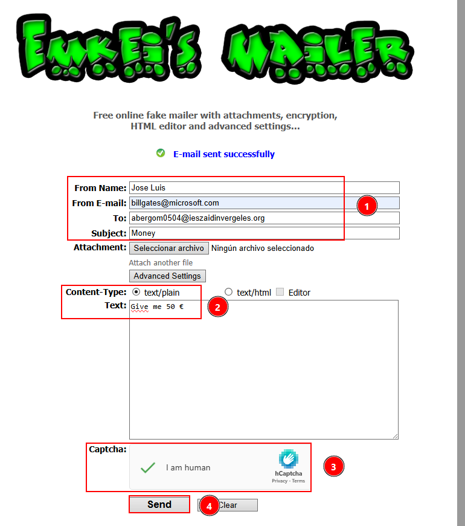


The message never arrived in my mailbox. SPF checks on the receiving side rejected or filtered it; on a server that does not enforce SPF, the same spoofed message might still be delivered.

**b) Explain which tools or protections prevent the email from reaching your inbox.**

Modern email providers implement several protection technologies designed to detect spoofed or malicious emails.

**SPF (Sender Policy Framework)** verifies whether the sending server is authorized to send mail on behalf of a domain. The domain owner publishes authorized mail servers in DNS, and the receiving server compares the sender IP against that record. If the source is not authorized, the message may be rejected or marked as spam.

**DKIM (DomainKeys Identified Mail)** adds a cryptographic signature to the email. The sending server signs the message with a private key, and the recipient verifies the signature using the public key in DNS. If the message was altered or never signed, verification fails.

**DMARC (Domain-based Message Authentication, Reporting and Conformance)** combines SPF and DKIM results and applies policies defined by the domain owner. Depending on that policy, a failed check can lead to rejection, quarantine in spam, or—in rare cases—delivery anyway.

**c) Repeat the sending process from section a), but this time use: billgates@microsoft.com as the sender and use the email address provided by: https://dkimvalidator.com/ as the recipient.**

For this second test, the spoofed email was sent to a temporary address generated by DKIMValidator.

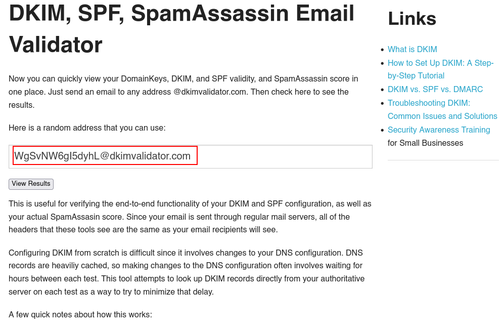


**d) Analyze the received email.**

Once the message was received, I examined the raw source and the validation results from the service.

The most noticeable finding is that the message carries no DKIM (or related) signature. That absence is exactly what keeps many spoofed messages from reaching well-known providers such as Gmail or IONOS. A second warning sign appears in the `Received` chain: the hostname of the server that handed off the mail does not match a legitimate Microsoft infrastructure and looks like an unrelated or disposable host.


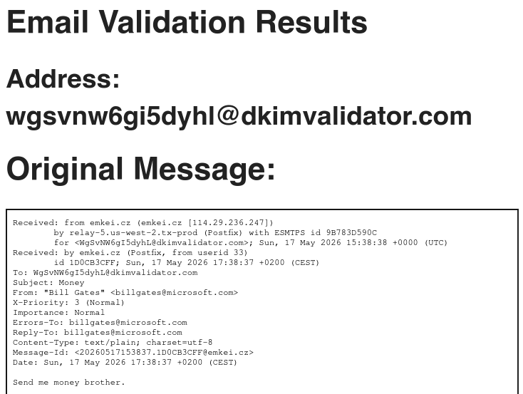

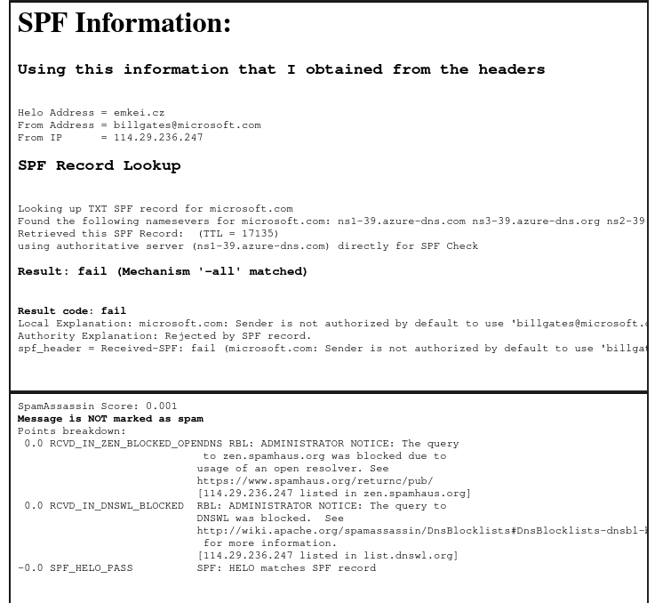

**e) Explain the conclusions you reached and the role that SPF, DKIM, and DMARC technologies play in preventing spoofing attacks.**

After completing the spoofing tests, several conclusions stand out about how email security works today.

Forging the visible sender address is technically easy, but large providers stack several verification layers on top of that weak default. SPF answers whether the delivering IP is allowed to send for the claimed domain. DKIM proves that the message body and selected headers were not changed in transit and were signed by someone who controls the domain’s key. DMARC tells the receiver what to do when SPF or DKIM (or both) fail, which is why most spoofed mail either never arrives or lands in spam rather than the inbox.

### 3) Install the Most Common Email Clients

**Install Mozilla Thunderbird and Outlook.**

Both Thunderbird and Outlook were installed and configured.

**Learn how to configure your email account in both clients. It is recommended to use IMAP.**

#### Thunderbird

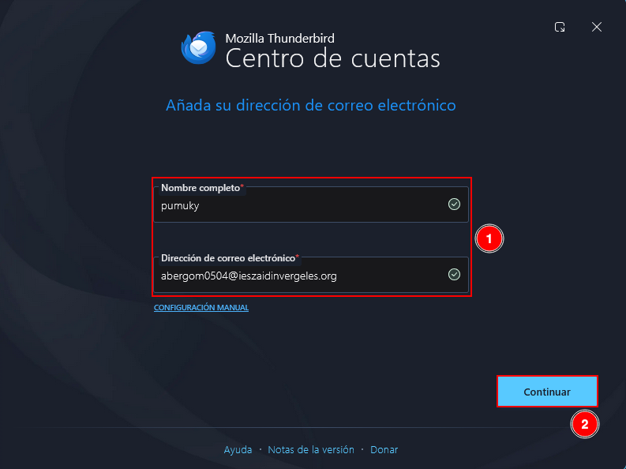


#### Outlook


**Investigate the files they use for storage and which ones may contain forensic evidence.**

On Windows, Thunderbird stores profile data under:

```
C:\Users\<USER>\AppData\Roaming\Thunderbird\Profiles\
```

From a forensic perspective, the profile may hold mailbox folders (Inbox, Sent, Drafts, Trash), mbox files, SQLite databases, and account configuration files that reveal how the client was set up and used.


Outlook keeps much of its local state here:

```
C:\Users\<USER>\AppData\Local\Microsoft\Olk\
```

Artifacts of interest include PST and OST files, logs, cached attachments, and account metadata that can support timeline reconstruction or user identification.

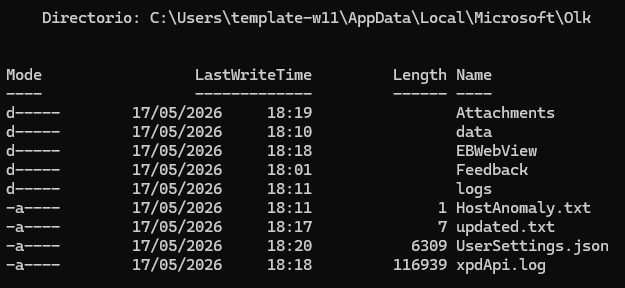
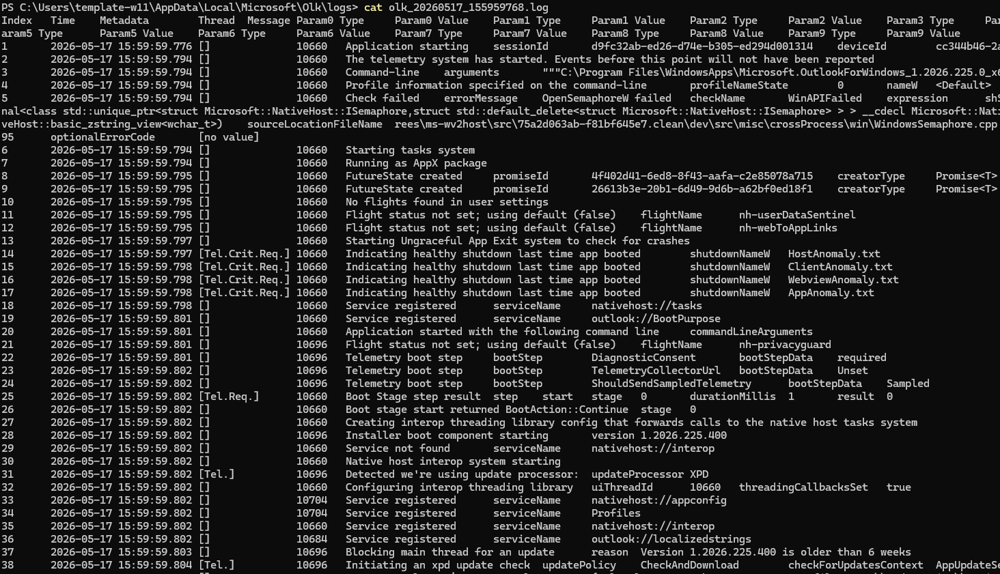

**Imagine that, during a disk clone analysis in a forensic investigation, we locate a Thunderbird profile directory. It would be interesting to access those emails, right? Search for “generic” tools capable of visualizing or interpreting the information stored in Thunderbird’s storage directory.**

During a forensic investigation, recovering email evidence from a Thunderbird profile can provide valuable information. Investigators can mount the profile in Thunderbird itself, open mbox files with an Mbox viewer, or use dedicated utilities such as 4n6 Thunderbird Forensics Wizard. Broader platforms like Autopsy or FTK Imager can also surface mailbox files and related artifacts from a disk image.

| Tool | Purpose |
|---|---|
| Thunderbird | Directly loads profile folders and emails. |
| Mbox Viewer | Reads Thunderbird mbox email files. |
| 4n6 Thunderbird Forensics Wizard | Specialized forensic analysis tool. |
| Autopsy | Digital forensics platform capable of analyzing email artifacts. |
| FTK Imager | Used to inspect files extracted from disk images. |

Such analysis may recover sent and deleted messages, attachments, metadata, contacts, account settings, and traces of client use.


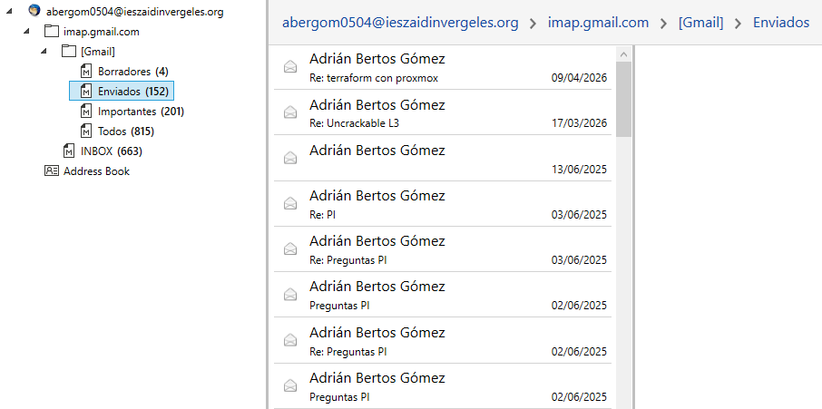
