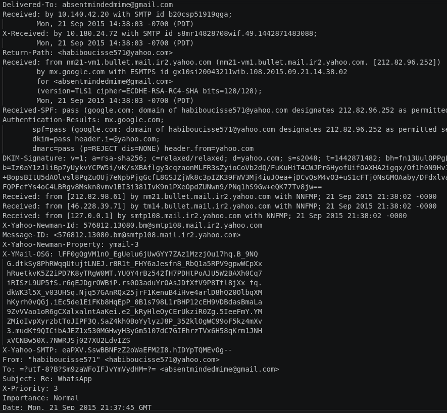
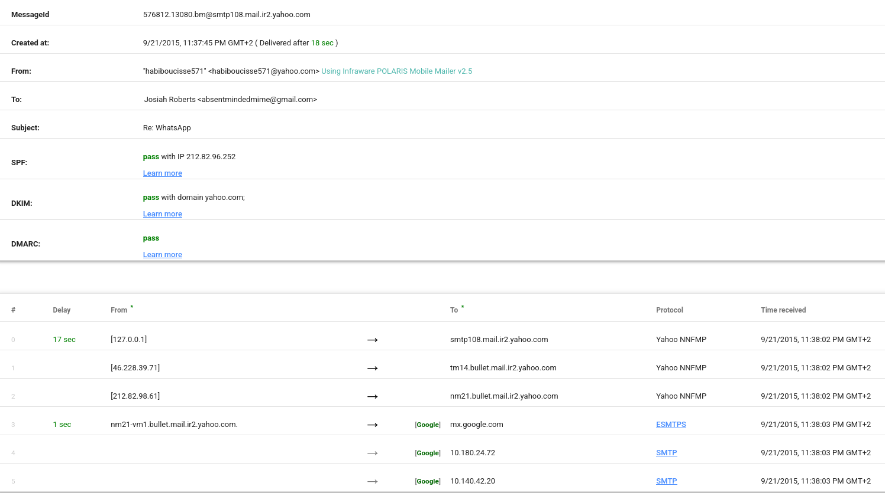
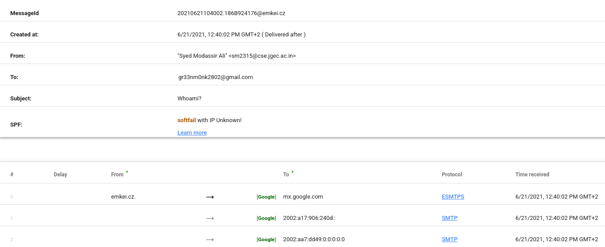
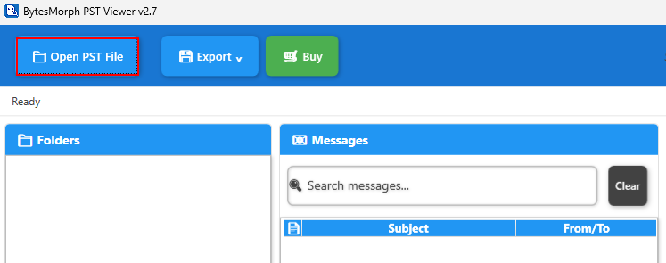
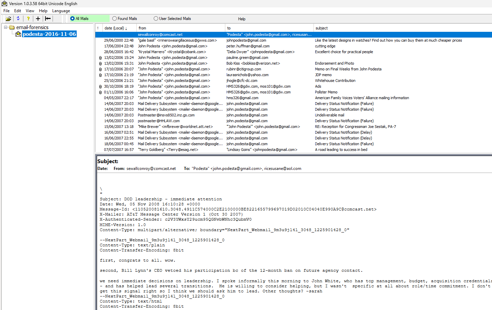
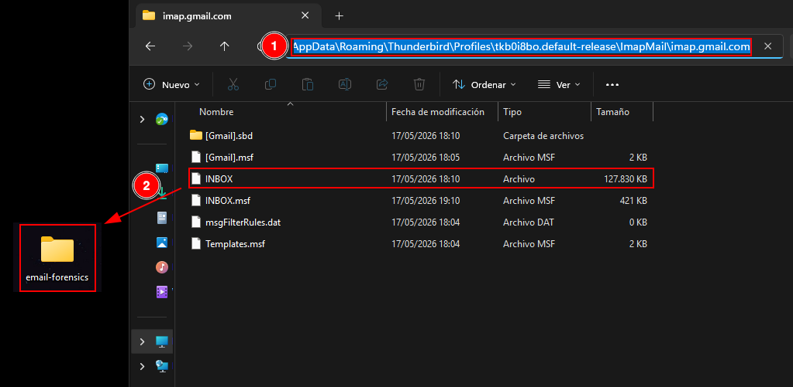
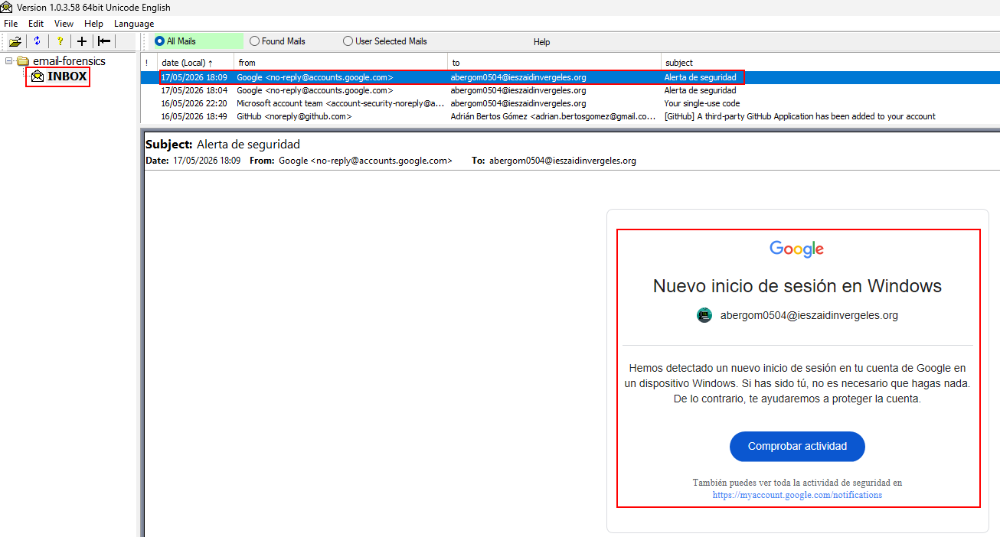

# Email Postmortem Analysis

## Introduction

In the field of cybersecurity and digital forensic analysis, examining email headers is a fundamental technique used to assess message authenticity, detect possible tampering, and trace the origin of communications. Email headers contain metadata that describes the route an email has taken through mail servers, as well as authentication and integrity information.

During a forensic investigation of a system, it is common to encounter multiple email storage formats, each associated with different email clients:

- **PST (Personal Storage Table) and OST (Offline Storage Table):** used by Microsoft Outlook to store emails locally or for offline access.
- **MBOX:** a widely used open format supported by clients such as Thunderbird, Apple Mail, and others.
- **EML and MSG:** single-email file formats, commonly used in Outlook-based systems.
- **DBX and MBX:** legacy formats used by older email clients such as Outlook Express and Eudora.
- **NSF:** used by IBM Lotus Notes for emails, calendars, and related data.

Beyond file formats, forensic analysis focuses heavily on authentication mechanisms such as SPF (Sender Policy Framework), DKIM (DomainKeys Identified Mail), and DMARC (Domain-based Message Authentication, Reporting, and Conformance). These mechanisms help determine whether an email is legitimate, altered, or potentially malicious.

Understanding these elements is essential for detecting phishing attempts, ensuring infrastructure security, and validating trust in electronic communications.

## Objectives

- Determine the authenticity of email messages.
- Analyze and interpret different email storage formats.

## Tasks

### 1. Manual and Automated Email Header Analysis (1.eml to 4.eml)

#### [Email 1](./eml/1.eml)

**Manual Analysis**

The email appears to originate from a Yahoo address and is delivered to a Gmail account through standard MX routing. The message content is benign and resembles a legitimate support or assistance request regarding a common software installation.

From a header perspective, the email passes through Yahoo and Google mail servers, and authentication results (SPF, DKIM, and DMARC) are correctly validated at the receiving end.

The main indicators supporting legitimacy are:
- Proper alignment between sending domain and mail infrastructure.
- Successful authentication checks (SPF, DKIM, DMARC).
- No suspicious routing anomalies.

Overall, both the technical analysis and the message content suggest that the email is legitimate.

**Automated Analysis**

Using external validation tools such as MXToolbox and Google Message Header Analyzer confirms that authentication signatures are valid and consistent with the manual inspection.

#### [Email 2](./eml/2.eml)

**Manual Analysis**

The content of this email is already suspicious from a social engineering perspective. The sender address belongs to an unfamiliar domain, and further inspection reveals inconsistencies in the sending infrastructure.

Key findings include:
- The sender IP address (85.250.54.29) does not match the claimed geographical origin.
- No valid DKIM signature is present.
- SPF validation fails or is neutral at best.
- Absence of strong authentication mechanisms reduces trust significantly.

Even without deep technical analysis, the combination of suspicious content and lack of authentication strongly suggests that the email is fraudulent.

**Automated Analysis**

Automated tools confirm the absence of valid authentication keys, reinforcing the conclusion that the message cannot be considered legitimate.

#### [Email 3](./eml/3.eml)

**Manual Analysis**

This email shows strong indicators of legitimacy. The authentication mechanisms are correctly implemented:

- SPF validation passes successfully.
- DKIM signatures are present and valid.
- DMARC validation succeeds.
- The routing path appears consistent with legitimate email infrastructure.

The email behaves as expected in a standard enterprise email flow, with no evidence of manipulation or spoofing.

**Automated Analysis**

Google’s header analysis tools confirm that all authentication mechanisms are valid, aligning with the manual findings.

#### [Email 4](./eml/4.eml)

**Manual Analysis**

This email presents multiple red flags from the beginning. The sender address appears unusual and unrelated to legitimate corporate domains.

Additional issues include:
- Missing SPF, DKIM, and DMARC records.
- SPF validation fails.
- Suspicious routing path with no trusted intermediaries.
- No cryptographic validation of message integrity.

These characteristics strongly indicate that the email is malicious or spoofed.

**Automated Analysis**

Automated validation tools confirm the manual assessment, showing failed authentication and lack of proper email signing mechanisms.

### 2. Forensic Analysis of PST and MBOX Files

During forensic investigations, email data is often extracted in PST or MBOX formats. Several tools can be used to analyze these files.

#### PST Files

To analyze PST files, applications such as BytesMorph (Microsoft Store) can be used. This tool allows direct loading of PST files and provides access to mailbox structures including inbox and sent items.

After opening the PST file, emails are displayed in a structured mailbox view, allowing forensic inspection of message contents and metadata.

The tool clearly displays email folders such as Inbox and Sent, making it suitable for forensic review.

#### MBOX Files

For MBOX analysis, MBox Viewer is a commonly used tool. It is open source and allows loading email archives by selecting the folder containing MBOX files.

Once loaded, all contained emails are rendered in a readable interface, allowing investigators to inspect message content and metadata.

After selecting the directory, the emails are displayed automatically in a structured format.

This tool is open source and its code can be found in its official repository on GitHub: https://github.com/eneam/mboxviewer

### 3. Analysis of DBX, MBX, and MBOX Artifacts

During forensic disk analysis, email artifacts may be extracted from email clients such as Thunderbird or Outlook Express.

#### Thunderbird Storage

Thunderbird stores email data in the user profile directory under AppData. Within this structure, key directories include Mail, ImapMail, and Local Folders.

These directories typically contain MBOX files representing mailbox structures such as Inbox, Sent, Trash, and Drafts. These files are valuable forensic artifacts as they contain raw email data.

The presence of these files allows investigators to reconstruct user email activity, including message history and communication patterns.

#### Outlook Storage

Microsoft Outlook stores email data in local directories that typically include PST and OST files. Common locations include the Local Microsoft Outlook folders under the user profile.

These files may also contain cached metadata, logs, and synchronization data, which can be valuable in forensic investigations.

The analysis of these artifacts allows investigators to reconstruct email timelines, detect anomalies, and verify communication integrity.

