# Secure Mail Server

Running a reasonably secure mail server requires a domain where you can publish SPF, DKIM, and DMARC records, plus a host that runs the mail stack (typically Postfix and related services). In this exercise I use **mailcow**, a Docker-based all-in-one mail suite.

Incoming mail is straightforward once DNS and the container are correct: forward the usual ports on the router (25 for SMTP, 587 for submission, 993 for IMAPS, and any others your setup needs). Outbound delivery is often harder at home: many ISPs block port 25, and residential IP addresses tend to have poor sender reputation. A common workaround is an external **SMTP relay** (here, IONOS) so outbound mail leaves through a provider with better deliverability. I still run mailcow locally for mailboxes and administration; IONOS handles relay authentication and outbound transport.

## IONOS relay account

The first step on the provider side is to create a mailbox used only for relay authentication. I created `relay@pumukydev.com` in the IONOS control panel.


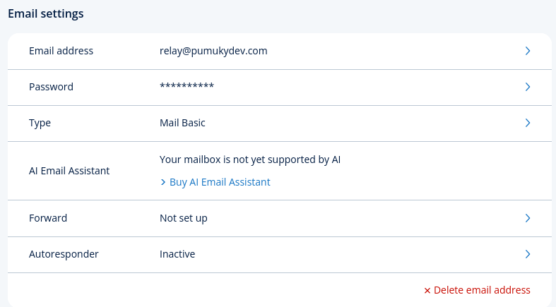

## DNS configuration

Create the hostname `mail.pumukydev.com` and point an **A record** at your public IP (VPS or home connection). Because I self-host at home, a DynDNS script keeps the domain and subdomains aligned with my changing public IP. For a similar setup, see [self-hosting](https://github.com/PumukyDev/self-hosting).

Add an **MX record** so other servers know where to deliver mail for the domain.


Publish **SPF** so receivers know which hosts may send mail for the domain. This record authorizes both the mailcow host and IONOS (`kundenserver.de`):

```text
v=spf1 a:mail.pumukydev.com include:kundenserver.de ~all
```


## Mailcow installation

Clone the mailcow repository and generate the initial configuration:

```bash
git clone https://github.com/mailcow/mailcow-dockerized.git
cd mailcow-dockerized/
./generate_config.sh
```

The script asks for the mail server hostname; I used `mail.pumukydev.com`. I chose branch **1** (stable). Mailcow then generates TLS certificates automatically.

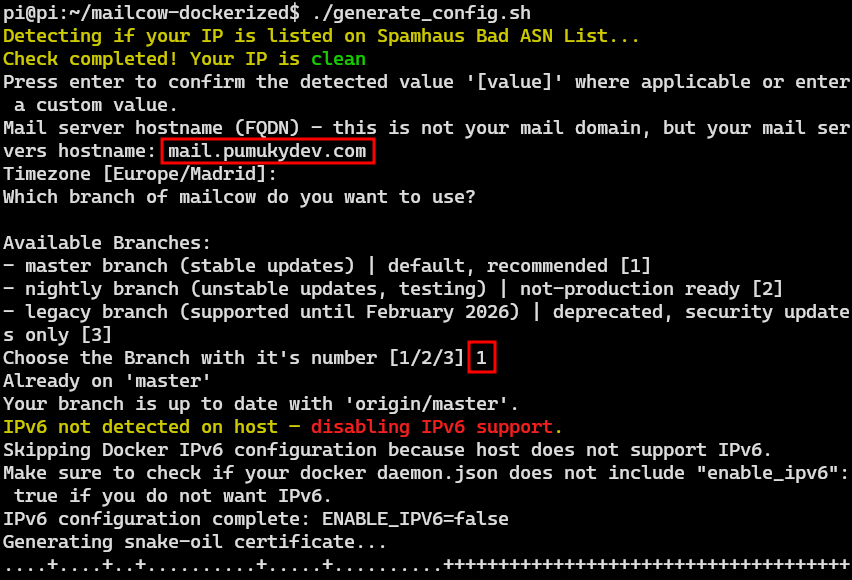

By default, the mailcow `docker-compose` exposes ports **443** and **80** for the web UI when nothing else is set in `mailcow.conf`. I already run a reverse proxy on those ports for other self-hosted services, so I remapped the HTTP/HTTPS bindings in the compose file and in `mailcow.conf`.


I also changed the Docker **network** name because the default network collides with other stacks on the same host.


Start the stack:

```bash
docker compose up -d --build
```

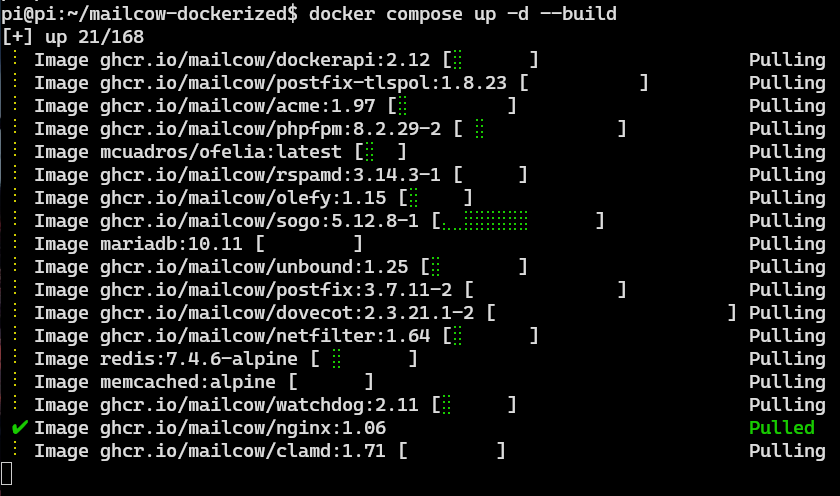

Open the mailcow URL in a browser (using the ports you configured).

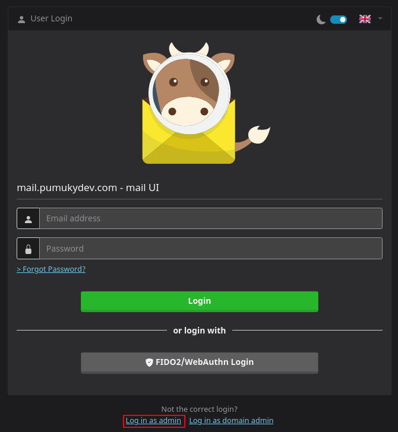

Log in with the default credentials `admin` / `moohoo` and change the password when prompted.


The admin dashboard appears (in my case, on a Raspberry Pi).


## Domain and mailbox

Add your domain in the mailcow UI:

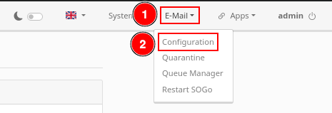

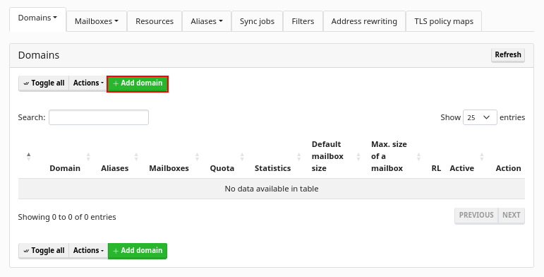

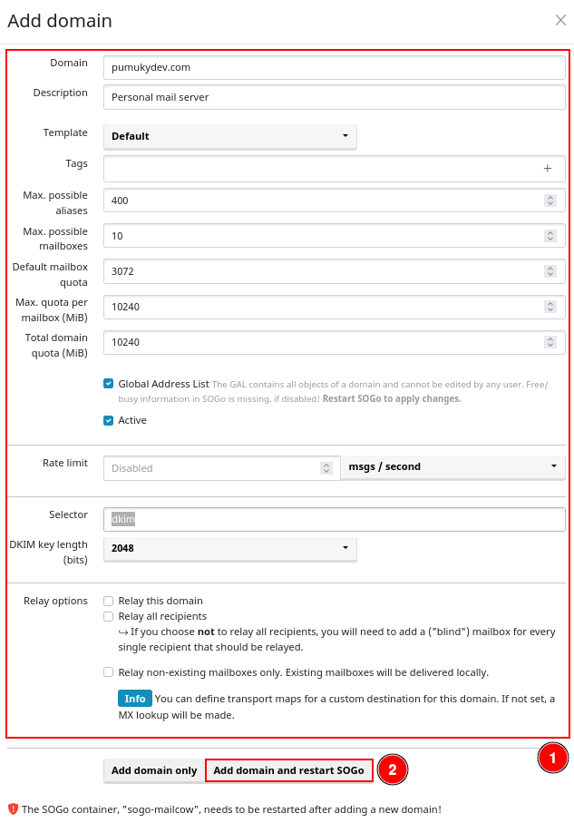

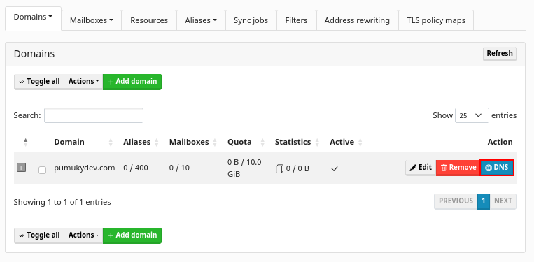

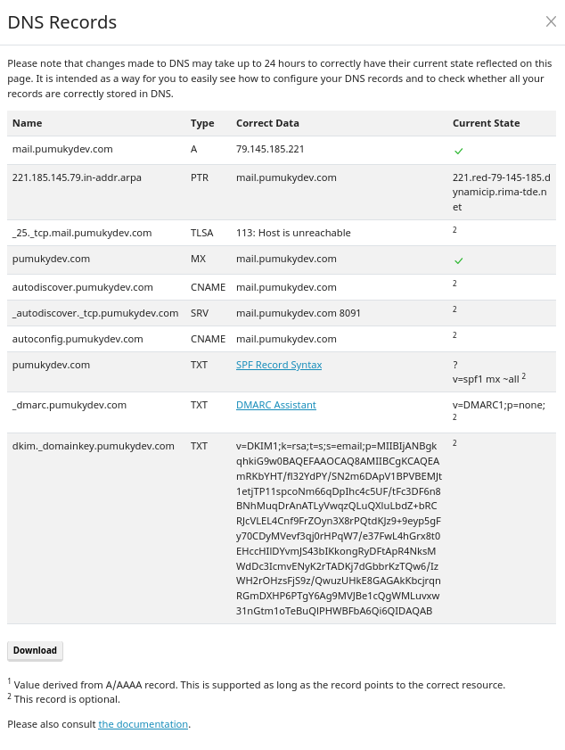

Create at least one mailbox for day-to-day testing.

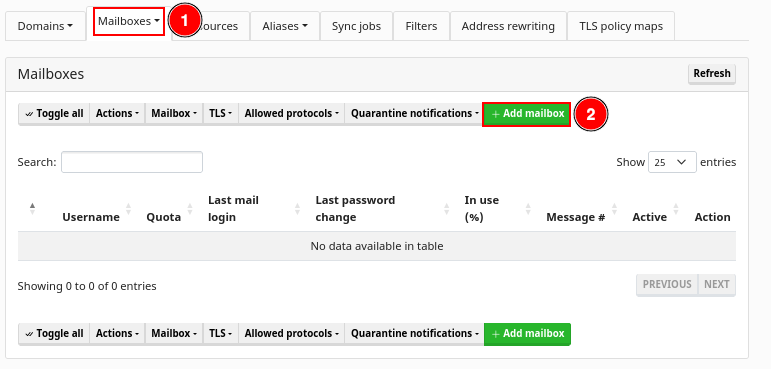


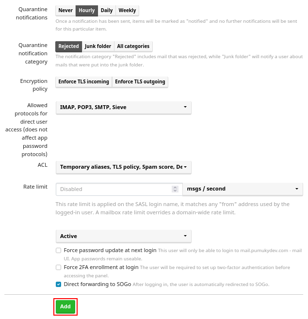

## Outbound relay through IONOS

To send outbound mail via IONOS, configure a transport map in mailcow (host, port, and credentials for `smtp.ionos.es`).

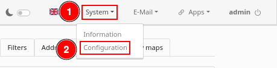


Scroll down to **Transport Maps** and enter the relay settings.

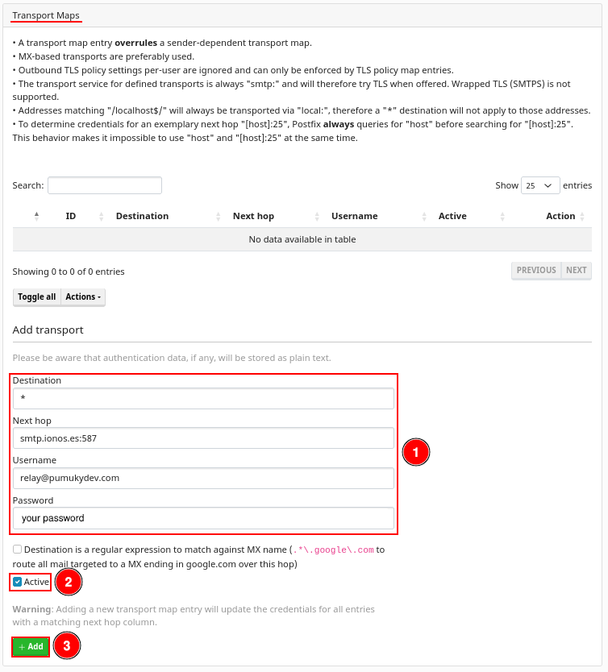

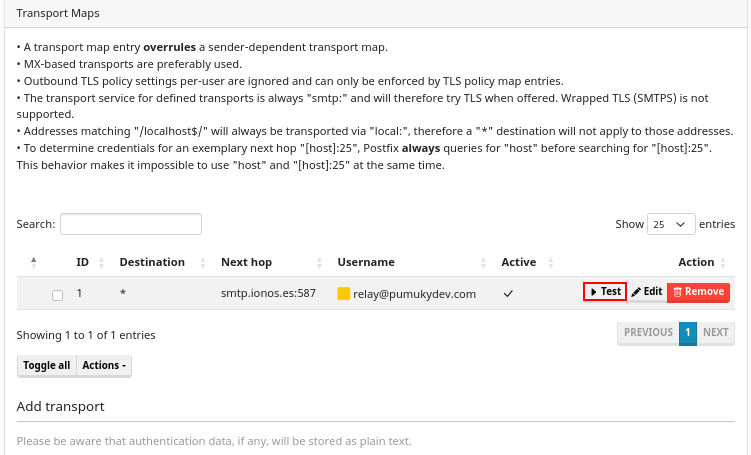

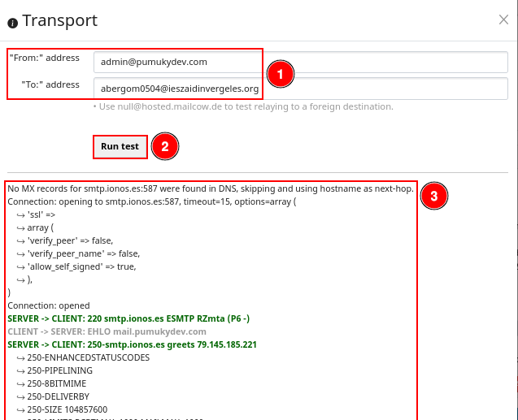

A successful SMTP test from the mailcow UI shows TLS negotiation, authentication, and delivery. The full session log looked like this:

```text
No MX records for smtp.ionos.es:587 were found in DNS, skipping and using hostname as next-hop.
Connection: opening to smtp.ionos.es:587, timeout=15, options=array (
    ↪ 'ssl' =>
    ↪ array (
    ↪ 'verify_peer' => false,
    ↪ 'verify_peer_name' => false,
    ↪ 'allow_self_signed' => true,
    ↪ ),
)
Connection: opened
SERVER -> CLIENT: 220 smtp.ionos.es ESMTP RZmta (P6 -)
CLIENT -> SERVER: EHLO mail.pumukydev.com
SERVER -> CLIENT: 250-smtp.ionos.es greets 79.145.185.221
    ↪ 250-ENHANCEDSTATUSCODES
    ↪ 250-PIPELINING
    ↪ 250-8BITMIME
    ↪ 250-DELIVERBY
    ↪ 250-SIZE 104857600
    ↪ 250-LIMITS RCPTMAX=1000 MAILMAX=1000
    ↪ 250-STARTTLS
    ↪ 250 HELP
CLIENT -> SERVER: STARTTLS
SERVER -> CLIENT: 220 Ready to start TLS
CLIENT -> SERVER: EHLO mail.pumukydev.com
SERVER -> CLIENT: 250-smtp.ionos.es greets 79.145.185.221
    ↪ 250-ENHANCEDSTATUSCODES
    ↪ 250-PIPELINING
    ↪ 250-8BITMIME
    ↪ 250-DELIVERBY
    ↪ 250-SIZE 104857600
    ↪ 250-LIMITS RCPTMAX=1000 MAILMAX=1000
    ↪ 250-AUTH PLAIN LOGIN
    ↪ 250 HELP
CLIENT -> SERVER: AUTH LOGIN
SERVER -> CLIENT: 334 VXNlcm5hbWU6
CLIENT -> SERVER: [credentials hidden]
SERVER -> CLIENT: 334 UGFzc3dvcmQ6
CLIENT -> SERVER: [credentials hidden]
SERVER -> CLIENT: 235 Authentication succeeded
CLIENT -> SERVER: MAIL FROM:<admin@pumukydev.com>
SERVER -> CLIENT: 250 Requested mail action okay, completed
CLIENT -> SERVER: RCPT TO:<abergom0504@ieszaidinvergeles.org>
SERVER -> CLIENT: 250 OK
CLIENT -> SERVER: DATA
SERVER -> CLIENT: 354 Start mail input; end with <CRLF>.<CRLF>
CLIENT -> SERVER: Date: Sat, 16 May 2026 13:19:33 +0200
CLIENT -> SERVER: To: Joe Null <abergom0504@ieszaidinvergeles.org>
CLIENT -> SERVER: From: Mailer <admin@pumukydev.com>
CLIENT -> SERVER: Subject: A subject for a SMTP test
CLIENT -> SERVER: Message-ID: <V25lE8PncaJTuZ8bJC7yu5a8LFUdpHQqKCHXACn2dts@mail.pumukydev.com>
CLIENT -> SERVER: X-Mailer: PHPMailer 6.6.0 (https://github.com/PHPMailer/PHPMailer)
CLIENT -> SERVER: MIME-Version: 1.0
CLIENT -> SERVER: Content-Type: text/plain; charset=iso-8859-1
CLIENT -> SERVER:
CLIENT -> SERVER: This is our test body
CLIENT -> SERVER:
CLIENT -> SERVER: .
SERVER -> CLIENT: 250 Requested mail action okay, completed: id=1MKsaz-1wevcp3BHR-00M7kH
CLIENT -> SERVER: QUIT
SERVER -> CLIENT: 221 kundenserver.de Service closing transmission channel
Connection: closed
```

The message reached my Gmail inbox. The complete message is saved as [smtp-test.eml](./eml/smtp-test.eml).

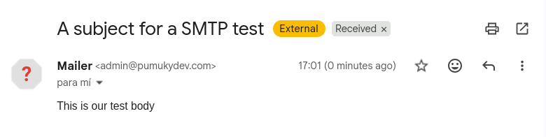

At this stage the setup was **not** fully aligned with modern authentication expectations: the message could be delivered, but without DKIM signing and a clear DMARC policy, receivers have less reason to trust it. The next steps harden outbound identity.

## DKIM and DMARC

Generate a DKIM key pair in mailcow and note the selector and public key for DNS.


Add the public key as a **text** record at IONOS (selector host name plus `v=DKIM1; ...` value).

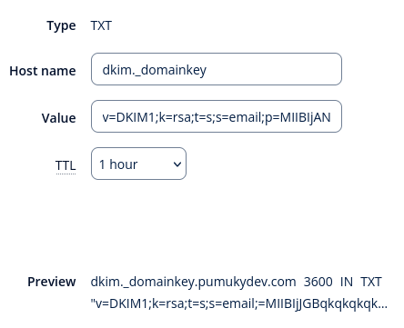

Define **DMARC** as well. I used the [EasyDMARC record generator](https://easydmarc.com/tools/dmarc-record-generator) to draft a policy record (monitoring or quarantine, depending on what you choose in the tool).


Copy the generated record.

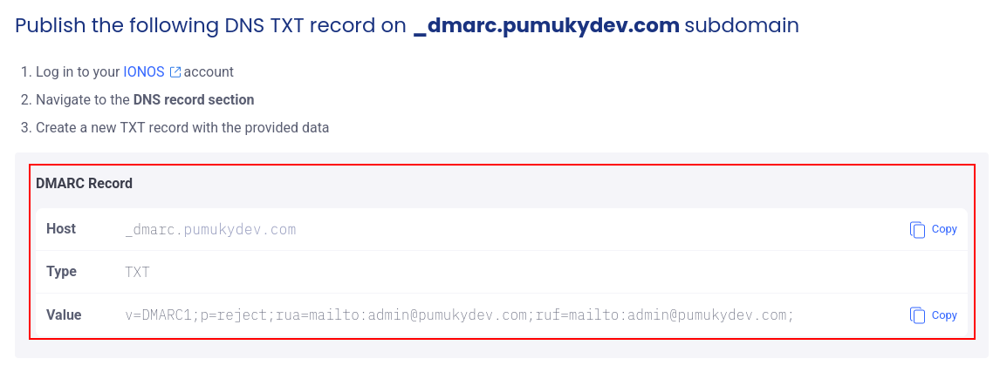

Publish it in the IONOS DNS zone for `_dmarc.pumukydev.com` (or your domain).


After DNS propagates, new outbound mail should include a valid DKIM signature and align with SPF and DMARC checks at major providers.

## Webmail test (send)

From the mailcow login page, use **Log in as user** to open SOGo or the web client as a mailbox user.


Enter the mailbox credentials.


Send a test message to an external address.


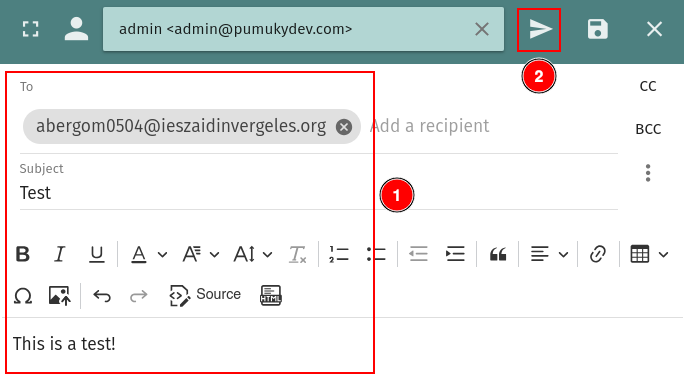

Delivery succeeded; the received message is archived as [test.eml](./eml/test.eml).

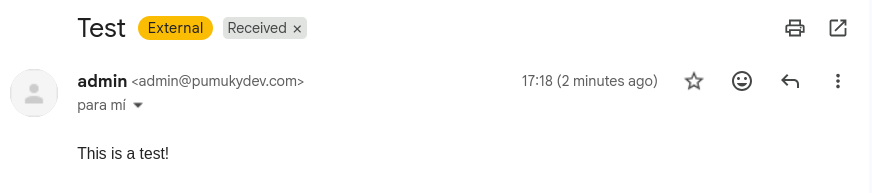

## Inbound mail and port forwarding

Receiving mail from the Internet requires the same SMTP and IMAP ports to reach mailcow on the LAN. On the home router, forward at least **25** (SMTP), **587** (submission, if used), and **993** (IMAPS) to the host running Docker.

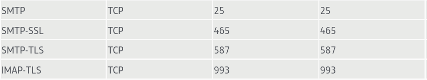

From Gmail (or another provider), send a message to a mailbox on your domain.

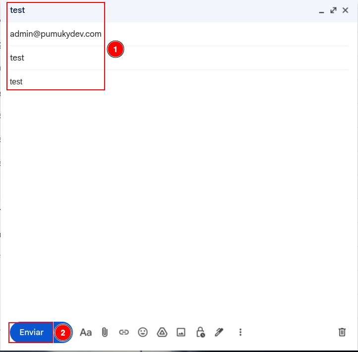

Initially **no inbound mail** arrived. After checking logs and transport settings, the problem was the IONOS relay configuration: it was affecting inbound paths as well as outbound. Disabling or narrowing the relay restored both sending and receiving on mailcow.

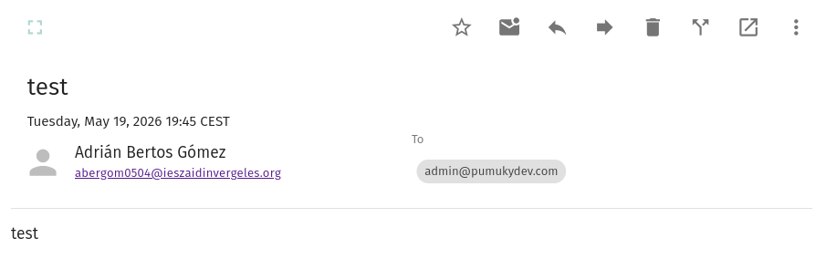

## Notes and next steps

This configuration works for lab and personal use, but it is not ideal for production. Residential IPs and ISP filtering can still block or downgrade direct SMTP. The relay should be used **only for outbound** submission, not as the MX target for inbound mail—otherwise messages may be accepted by IONOS and never land in the mailcow mailbox.

A cleaner design keeps MX pointing at `mail.pumukydev.com`, delivers inbound directly to mailcow, and uses IONOS solely as an authenticated smarthost on port 587 for outbound mail. That separation avoids the forwarding loop I hit and matches how most small self-hosted setups combine local mail storage with a reputable outbound relay.
