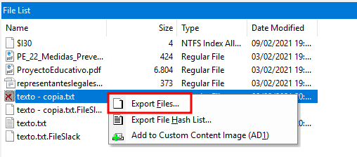

# PRACTICE 2 — NTFS ANALYSIS

The file system on any storage device is essential for the overall organization, storage mechanisms, and data control of the device. Understanding how these file systems work, as well as the design of key structures, storage mechanisms, associated metadata, and file system features, is crucial for conducting forensic investigations on a computer or other device.

NTFS and FAT file systems are two widely used and commonly encountered systems. Both offer significant and mandatory forensic evidence in any investigation.

## Main Objective of the Practice
- Study the metadata provided by the NTFS file system for forensic analysis.

## Software to Use
- FTK Imager 4.3 or higher  
- Active Disk Editor v7.0  
- MFT2Csv  
- NTFSLogFile  
- UsnJrl2Csv  
- ANJP  
- AlternateStreamViewer  
- Indx2Csv  

**Disk image to use:** Download it from the provided link.

## Tasks

1. Download the disk image and open it with Active Disk Editor (ADE). Try to identify, using ADE and by inspecting the 1 KB MFT records, which of them have been deleted based on the **FLAGS** property (`in use = 0`).
   a. Locate any entry corresponding to a deleted file (for example, “texto - copia.txt”), and take a screenshot. Memory position hint: go to position `03397XXXX`.  
   b. Recover the file using FTK Imager (found in the Recycle Bin folder).

2. Identify low-level attributes of one of the files (MFT records) using Active Disk Editor 7. The attributes of interest are **$10**, **$30**, and **$80**.  
   a. Where can you find the creation, modification, and access dates?  
   b. What does the **non-resident** property mean, and what are the values 0/1 associated with it?

3. Export the **$MFT** metadata file using FTK, process it with MFT2CSV, and import it into a spreadsheet editor to analyze the attributes. The goal is to study which files were deleted and when. Filter by the field **“in use = 0”** (deleted) and/or by **RecordActive = DELETED/ALLOCATED** to obtain the deletion date/time.

4. Export the **$LogFILE** metadata file. Together with the $MFT from the previous step, it provides information about file system transactions. Process the files using **NTFSLogFile Parse** to decode the information and obtain a CSV.  
   - Search for transactions where **lf_RedoOperation = DeallocateFileRecordSegment** to locate files that were permanently deleted, since this operation deallocates the file record segment.

5. Export the metadata file corresponding to **$USNJournal**  
   (`$Extend -> $USNjrl -> $J`).  
   Process it using **UsnJrl2Csv** to decode its stored information.  
   - Filter the resulting data by **Reason = CLOSE+DELETE** to obtain the timestamps of permanent file deletions.

6. Use the **ANJP** tool to perform a combined analysis of **$MFT**, **$LogFile**, and **$USNJournal**.  
   You will see that it processes the same information as the previous sections but in an integrated way. It includes a **Parse** tab and a **Report** tab.  
   - Use the tool and take a couple of screenshots of the generated report.  
   *(Note: This is a paid tool.)*

7. Use **FTK Imager** and **AlternateDataViewer** to study the origin of the files found in the `datos.dd` image.  
   - Take a screenshot with each tool showing one example.

8. Export the directory index metadata files (**$I30**) for the three directories present in the `datos.dd` disk image:  
   - the root directory,  
   - the directory named “carpeta”,  
   - and the Recycle Bin directory.  
   Process these files with **Indx2Csv**.  
   - Analyze which files exist now and which existed in the past in each directory.

9. Install the automated file recovery tool **Recuva**.  
   Mount the `datos.dd` disk image with **FTK Imager** and use Recuva to recover as many files as possible.  
   - Compare the recovered files with those that FTK Imager is able to recover (marked with the deletion cross icon).

# Practice 1 – Complete Solution  
**Disk Forensics with Active Disk Editor, FTK Imager and NTFS Analysis Tools**

---

## Section 1  
### Statement  
Download the disk image and open it with Active Disk Editor (ADE). Using ADE, and by inspecting the MFT records (1 KB), identify which entries have been deleted based on the FLAGS property (“in use” = 0).

a) Locate any entry corresponding to a deleted file. For example: “texto - copia.txt”. Make a screenshot. Memory position hint: go to address `03397XXXX`.

b) Recover the file using FTK Imager (found inside the “papelera” folder).

### Solution  
We start by opening Active Disk Editor and locating our device. To inspect the disk, we click **Open in File Browser**, which allows us to look at the files without mounting the drive. However, the file is indicated as deleted.

To search for the deleted file, we must right-click and select **Edit**.

Inside the editor, we use the search function (Right-Click → **Find**, or Ctrl + F). I noticed that ADE displays ASCII characters separated by dots, so I searched for:  
`t.e.x.t.o. .-. .c.o.p.i.a...t.x.t.` and clicked **Find ALL**.

At the bottom left, ADE displays all matches. I checked each result until finding one whose sector begins with `FILE0`, which indicates the start of an MFT entry.  
**Reminder:** set the template to **NTFS MFT File Record** and position the cursor at the start of `FILE0`.

Once the file is identified, we check the FLAGS attribute. Since the “in use” flag is unset, the file is confirmed as deleted.

Next, to recover the file, we must CLOSE Active Disk Editor because it conflicts with FTK Imager. Then we mount the disk (or load it as an image). I mounted the image for easier reading:

- **Image mounting → Select File**

Then:

- **Add Evidence Item → Physical Drive → (the last detected drive)**

TBD No sé hacer lo de Active no se qué

We browse the contents until we find `texto - copia.txt` under:  
**Datos → Root → Carpeta**

The file appears with a red cross meaning it was deleted.

To recover it:

1. Right-click the file  
2. Select **Export Files**  
3. Choose the destination folder  
4. Confirm

The file is successfully exported and recovered.

---

## Section 2  
### Statement  
Identify low-level attributes of an MFT record using ADE. We focus on attributes $10, $30 and $80.

a) Where are creation, modification and access timestamps stored?  
b) What does “non-resident” mean and what do the values 0/1 represent?

### Solution  
With the file entry selected (`FILE0`) and the template set to **NTFS MFT File Record**:

- **Attribute $10 (Standard Information)** contains:  
  - Creation time  
  - Last modification time  
  - Last access time  
  - Owner and security data  
  - Other metadata  

- **Attribute $30 (File Name)** contains:  
  - File name  
  - Flags (hidden, system, etc.)  
  - Additional timestamps  

- **Attribute $80 (Data)** contains:  
  - File data (if resident)  
  - Data runs (if non-resident)

**Answers:**

a) Timestamps for creation, modification and access are stored in **attribute $10**.  
b) **Non-resident = 1** means file content is stored *outside* the MFT entry.  
   **Non-resident = 0** means the file’s content is stored *inside* the MFT record (resident).

---

## Section 3  
### Statement  
Export the `$MFT` file using FTK Imager, process it with **MFT2CSV**, and import it into a spreadsheet. Filter the results by “in use = 0” and/or “RecordActive = DELETED/ALLOCATED” to determine deleted files and their timestamps.

### Solution  
Using FTK Imager, we extract the `$MFT` file from the Evidence Tree (same method as in Section 1).

We download **MFT2CSV** from GitHub. After opening it:

- We select the disk image path  
- We change the output separator for easier reading (recommended: semicolon `;`)  
- We select an output directory  
- We run the conversion

The output includes many files; the correct one is highlighted in green by the tool.

We open the CSV with OpenOffice and enable:  
**Data → Filter → AutoFilter**

Then we filter:

- Column **M** = deleted  
or  
- Column **RecordActive = DELETED**

This reveals the list of deleted files and their deletion timestamps.

---

## Section 4  
### Statement  
Export `$LogFile` and process it using **NTFSLogFile Parser**. Look for entries where `lf_RedoOperation = DeallocateFileRecordSegment`, which indicates permanent deletion of a file record.

### Solution  
We extract `$LogFile` using FTK Imager as before.

In NTFSLogFile Parser:

- Select `$LogFile`  
- Select the previously exported `$MFT`  
- Set separator to `;`  
- Choose an output directory  
- Click **Start**

The tool generates a folder containing `LogFile.csv`.  
Open it in OpenOffice and set the separator to `|`.

Filter:

- `lf_RedoOperation = DeallocateFileRecordSegment`

The resulting entries correspond to files whose MFT record segment was permanently deallocated—i.e., definitively deleted.

---

## Section 5  
### Statement  
Export `$USNJournal` (`$Extend → $USNjrl → $J`) and process it using **UsnJrl2Csv**. Filter the result by `Reason = CLOSE+DELETE` to find the timestamps of final deletions.

### Solution  
We extract `$J` using FTK Imager.

With UsnJrl2Csv:

- Set separator to `;`  
- Set output directory  
- Click **Start**

Open the resulting CSV and set separator to semicolon.

Filter:

- Column **Reason = CLOSE+DELETE**

This shows the exact time when each file was deleted and the handle closed.

---

## Section 6  
### Statement  
Use **ANJP**, which processes `$MFT`, `$LogFile` and `$USNJournal` together. Provide a couple screenshots of its report view.

### Solution  
ANJP integrates all previous tools. After launching it:

1. Enter a case name  
2. Select an output directory  
3. Load:  
   - `$MFT`  
   - `$LogFile`  
   - `$USNJournal`  
4. Click **Parse**

Once processed, go to **Reports**, where the tool displays all combined analysis.

For example:  
**LogFile → File Interactions** shows detailed activity for `texto - copia.txt`.

---

## Section 7  
### Statement  
Use FTK Imager and AlternateDataViewer to study the origin of the files in “datos.dd”. Provide one screenshot from each tool.

### Solution  
In FTK Imager:

1. Add Evidence Item → Physical Drive → Select the mounted disk  
2. Open the partition  
3. Browse to any file, e.g., `Proyecto Educativo.pdf`

Next to the file, we see an alternate stream:

- `Zone.Identifier`  
  Opening it reveals:  
  - `ZoneID=3` → File downloaded from Internet Explorer

Using **AlternateStreamView**:

1. Select the target directory (e.g., the partition root)  
2. It lists all files with ADS streams  
3. Double-clicking `Proyecto Educativo.pdf` shows its ADS metadata  
4. Extracting the ADS (Right-click → Extract Stream) allows reading it in plain text

---

## Section 8  
### Statement  
Export the directory index metadata `$I30` for the three directories in “datos.dd”:  
- root  
- carpeta  
- recycle bin  

Process them with **Indx2Csv** and analyze which files exist or previously existed.

### Solution  
Using FTK Imager, we extract:

- `$I30` from **carpeta**  
- `$I30` from **root**  
- `$I30` from the Recycle Bin subdirectory

Then with **Indx2Csv**, for each `$I30`:

- Set file path  
- Set output directory  
- Click **Start**

Each output is a `.csv`, which we open with OpenOffice.

Findings:

### Directory “carpeta”  
- Six entries appear  
- Three correspond to `texto.txt`, repeated because the file was opened or modified multiple times  
- We can analyze timestamps and deletion history

### Root  
- Contains visible files and hidden/system files  
- Shows creation, modification, and deletion metadata

### Recycle Bin  
- Contains many entries corresponding to deleted files

---

## Section 9  
### Statement  
Install **Recuva**, mount “datos.dd” with FTK Imager, and use Recuva to recover as many files as possible. Compare results with the deleted-file list in FTK Imager.

### Solution  
With Recuva:

1. Select the drive corresponding to the mounted image (e.g., G:)  
2. Click **Next**  
3. Recuva scans and displays recoverable files  
4. Select all files  
5. Click **Recover** and choose a destination folder

Recuva successfully recovers all selected files.

Comparison with FTK Imager:

- FTK Imager shows `calendarioSept2018.pdf` in the Root folder  
- `texto - copia.txt` is visible in the “carpeta” folder as deleted  
- Other recovered files match Recuva’s output, although some lack clear source information

---

