# Post-mortem analysis

## Main objectives of the practice
- Analyze the evidence provided by different artifacts in Windows operating systems.

---

## PART A

### 1. Regarding *prefetch*

- **What are they?**  
These are files generated by Windows that contain data about executed programs.

- **What file extension do they have?**  
.pf

- **In which directory can they be found?**  
The default path for prefetch files is `C:\Windows\Prefetch`.

- **What forensic information do they store that may be important for an investigation?**  
They allow reconstruction of user activity, showing a chronology of executed programs and sometimes how many times they were run.

### 2. Regarding *LOGs*

- **Which ones do you think are the most important based on the content they store?**  
Application logs are the most important for forensic analysis, as they show user actions. In enterprise environments, system logs are also crucial to check for damage caused by malware.

- **Where can they be found?**  
System logs are located at `C:\Windows\System32\winevt\Logs`.  
*These logs record security events, system events, and application events.*

### 3. Regarding the hibernation file `hiberfil.sys`

- **Where can it be found?**  
The typical location is the root of the disk: `C:\`.

- **Which tool can be used to decode its contents?**  
Rekall, Volatility, or WinDbg (Microsoft Windows Debugger), among others.

- **Do you think the information it contains is important?**  
Yes, it contains a snapshot of RAM when the system enters hibernation, potentially holding sensitive user data and system state.

### 4. Regarding snapshots, restore points and/or Volume Shadow Copies Service (VSS)

- **What file system is required to use this technology?**  
NTFS

- **Is it enabled by default or does the user need to activate it?**  
It is enabled by default, but periodic snapshots are not configured automatically.

- **How often are they created?**  
They are typically created during major installations or updates.

- **Think of a couple of scenarios where they may be useful:**  
1. Recovering the system after a ransomware attack.  
2. Undoing changes caused by faulty driver updates.

### 5. Questions related to the Windows Registry

- **Research how to import and export registry keys in CLI and GUI environments:**  
a) GUI: Open Regedit → select key → File → Export / Import  
  
b) CLI:  
reg export "(Key)" C:\(Name_to_export)  
reg import C:\(Name_of_the_key_to_import)  

- **List registry keys that are forensically interesting to export and analyze, explaining what information they reveal:**  
`Run`: Programs executed at startup.  
`RecentDocs`: Recently opened files.  
`USBStor`: USB devices connected to the system.

### 6. Events of forensic interest

- **What types of events may be interesting to inspect from a forensic perspective? Give a couple of examples:**  
Security events: Track user logins.  
System events: Track software installations and failures.

### 7. Software tools
**Tools for each artifact:**  
- **Prefetch:** [PECmd](https://github.com/EricZimmerman/PECmd)  
- **Logs:** [Event Log Explorer](https://www.eventlogxp.com/)  
- **Hibernation file:** [Volatility](https://volatilityfoundation.org/)  
- **Volume Shadow Copies Service:** [ShadowExplorer](https://www.shadowexplorer.com/downloads.html)  
- **System registry:** [FTK Imager](https://www.exterro.com/digital-forensics-software/ftk-imager)  
- **Event management:** [Event Log Explorer](https://www.eventlogxp.com/)  
- **Shortcuts & Caches and browsing history:** [Nirsoft](https://www.nirsoft.net/web_browser_tools.html)  
- **Recycle Bin:** [Rifiuti](https://abelcheung.github.io/rifiuti2/)

---

## PART B

The practice consists of extracting as much evidence as possible from a Windows operating system by performing targeted searches on the different artifacts it uses.

Although in a real scenario this would be done using a system image, for this practice it is recommended, for agility, to use the operating system installed on the student’s computer.

In my case, I will use a Windows partition that I use for a few things, but as I don't use it a lot some hives will not exist because I do not use Windows for daily life.

### Software to be used
- **A.** Windows 10 (32 or 64 bits)  
- **B.** FTK Imager  
- **C.** Arsenal Image Mounter  
- **D.** Registry Explorer  
- **E.** Reg Ripper  
- **F.** WRR  
- **G.** LinkParser  
- **H.** JumpListExplorer  
- **I.** ShellbagExplorer  
- **J.** USB Detective

### Evidence extraction

Open FTK Imager and click the image icon.  
  
*This will allow you to mount the disk image for analysis.*

Click "Logical Drive" and click on "Next".  
  

Select your disk and click "Finish".  
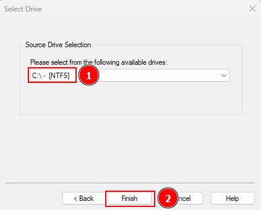  

Verify the evidence tree appears in FTK Imager.  
  

Now extract some files for analysis by navigating to `\root\Windows\System32\Config\` and clicking "Export Files..."  
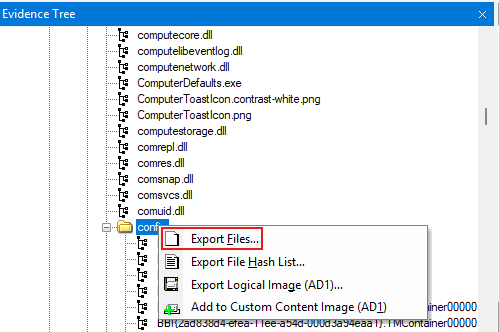  
*These are critical registry hives for forensic analysis.*

I'll save them as "windows-artifacts".  
  

Open WRR, click "File" → "Open...".  
  

Select "SOFTWARE", "SYSTEM" and "SAM" and click on "Open".  
  
*These registry hives contain software settings, system info, and user account data.*

Verify files were correctly exported to WRR.  
  

Repeat the same process for `root\Windows\Users\{USER}`.  
  

Add "NTUSER.DAT" inside {USER}\ and "UsrClass.DAT" inside {USER}\AppData\Local\Microsoft\Windows\ to WRR.  


---

### Artifacts and paths of interest

#### System information
- **System version**  
`Software\Microsoft\Windows NT\CurrentVersion`  
*Shows OS version, build, and install info.*  


- **Machine name**  
`System\ControlSet001\Control\ComputerName\ComputerName`  
*Stores the hostname of the computer.*  


- **Time zone**  
`System\ControlSet001\Control\TimeZoneInformation`  
*Shows local time zone settings.*  
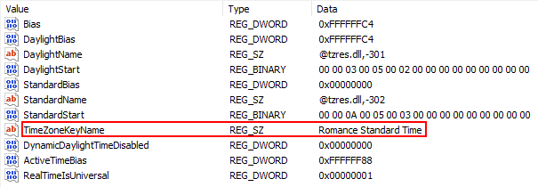

- **Last access timestamp**  
`System\ControlSet001\Control\Filesystem`  
  

*Controls if Windows updates the last access date of files and folders.*

| Value | Actual behavior |
|------:|-----------------|
| **0** | Updates the last access timestamp for both files and directories (legacy behavior, lower performance). |
| **1** | Does not update the last access timestamp for **files or directories**. |
| **2** | **System managed** (default since Windows Vista/7). Windows decides when to update to balance compatibility and performance. |
| **3** | Updates the last access timestamp **for directories only**, **not for files**. |


- **Shutdown time**  
`System\ControlSet001\Control\Windows`  
*Stores last shutdown or restart timestamps.*  
  


#### Network
- **Network interfaces**  
`System\ControlSet001\Services\Tcpip\Parameters\Interfaces\{GUID_INTERFACE}`  
*Stores DNS root servers and whether the computer has completed the network configuration after installation.*  
  


- **Network history**  
`Software\Microsoft\Windows NT\CurrentVersion\NetworkList\`  
*Contains networks the computer connected to, including SSIDs.*  
  
  

*These are the root DNS*

`Software\Microsoft\Windows NT\CurrentVersion\NetworkList\Nla\Cache`  
(Not present.)  
*Cached information about networks.*  

`Software\Microsoft\Windows NT\CurrentVersion\NetworkList\Nla\Wireless`  
*Cached information about wireless networks.*  
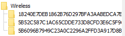  
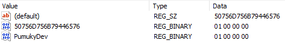

- **When a network was connected**  
`Software\Microsoft\Windows NT\CurrentVersion\NetworkList\Profiles`  
*Shows timestamps of network connections.*  
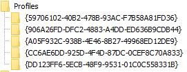  


#### Sharing and startup
- **Shared folders**  
`System\ControlSet001\Services\LanmanServer\Shares\`  
*Lists folders shared over the network.*  


- **Startup programs**  
`NTUSER.DAT\Software\Microsoft\Windows\CurrentVersion\Run`  
*Programs set to start automatically when the user logs in.*  


`NTUSER.DAT\Software\Microsoft\Windows\CurrentVersion\RunOnce`  
*Per-user programs that run once on the user’s next login.*  


`Software\Microsoft\Windows\CurrentVersion\RunOnce`  
*System-wide programs that run once at the next login for any use.*  


`Software\Microsoft\Windows\CurrentVersion\Policies\Explorer\Run`  
*Sometimes contains enforced startup items.*  
(Not present.)

`Software\Microsoft\Windows\CurrentVersion\Run`  
*Programs that start automatically every time the user logs in*


#### User activity
- **Searches in the search bar**  
`NTUSER.DAT\Software\Microsoft\Windows\CurrentVersion\Explorer\WordWheelQuery`  
*Stores user search queries in Windows Explorer/Start menu*  
(Not present.)

- **Typed paths in Start or Explorer**  
`NTUSER.DAT\Software\Microsoft\Windows\CurrentVersion\Explorer\TypedPaths`  
*Shows file paths the user manually entered.*  


- **Recent documents**  
`NTUSER.DAT\Software\Microsoft\Windows\CurrentVersion\Explorer\RecentDocs`  
*Tracks recently opened files.*  
  
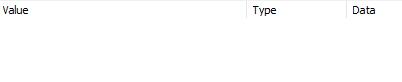

- **Recent Office documents**  
`NTUSER.DAT\Software\Microsoft\Office\{Version}\{Excel|Word}\UserMRU`  
*Tracks recently opened Office file.*  
(Not present.)

- **Reading position of last opened document**  
`NTUSER.DAT\Software\Microsoft\Office\Word\Reading Locations\Document X`  
*Stores where you left off in Word documents.*  
(Not present.)

- **Autosaved Office files**  
`C:\Users\{user}\AppData\Roaming\Microsoft\{Excel|Word|PowerPoint}\`  
*Temporary autosave files for Office apps.*  
(Not present.)

- **OpenSaveMRU**  
`NTUSER.DAT\Software\Microsoft\Windows\CurrentVersion\Explorer\ComDlg32\OpenSavePidlMRU`  
*Stores recently opened/saved files per application.*  


- **Last executed commands**  
`NTUSER.DAT\Software\Microsoft\Windows\CurrentVersion\Explorer\RunMRU`  
*Tracks commands typed in Run dialog.*  


`NTUSER.DAT\Software\Microsoft\Windows\CurrentVersion\Explorer\Policies\RunMRU`  
*Same as RunMRU but enforced by policies.*  
(Not present.)

- **UserAssist (programs executed)**  
`NTUSER.DAT\Software\Microsoft\Windows\CurrentVersion\Explorer\UserAssist\{GUID}\Count`  
*Tracks execution counts of applications.*  


- **Taskbar-related events**  
`NTUSER.DAT\Software\Microsoft\Windows\CurrentVersion\Explorer\FeatureUsage`  
*Tracks user interaction with taskbar features.*  
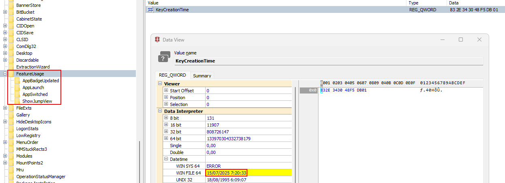  

`...\AppBadgeUpdated`  
  
*Records when a taskbar app badge (like notifications) is updated.*  

`...\AppLaunch`  
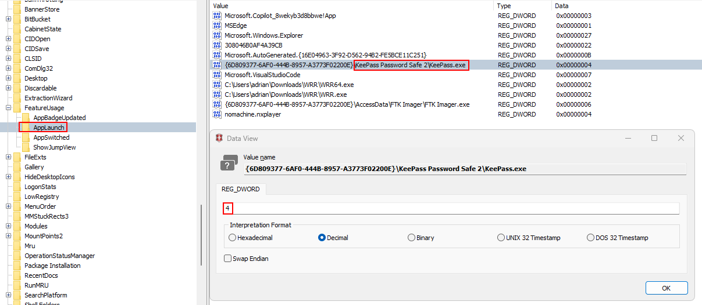  
*Logs when a user launches an application from the taskbar.*  

`...\AppSwitched`  
  
*Tracks when the user switches between apps pinned or open on the taskbar.*  

`...\ShowJumpView`  

*Logs when the user opens a jump list (right-click menu) on a taskbar app.*  

- **Recent applications**  
`Software\Microsoft\Windows\CurrentVersion\Search\RecentApps`  
*Lists recently used apps.*  
(Not present.)

#### Shortcuts and Jump Lists
- **Recent documents (LinkParser / LeCMD)**  
`C:\Users\{user}\AppData\Roaming\Microsoft\Windows\Recent`  
*Contains shortcut (.lnk) files of recently opened documents.*  
  

  

- **Jump Lists**  
`C:\Users\{user}\AppData\Roaming\Microsoft\Windows\Recent\AutomaticDestinations`  
*Shows recent and pinned items for applications.*  
  
  
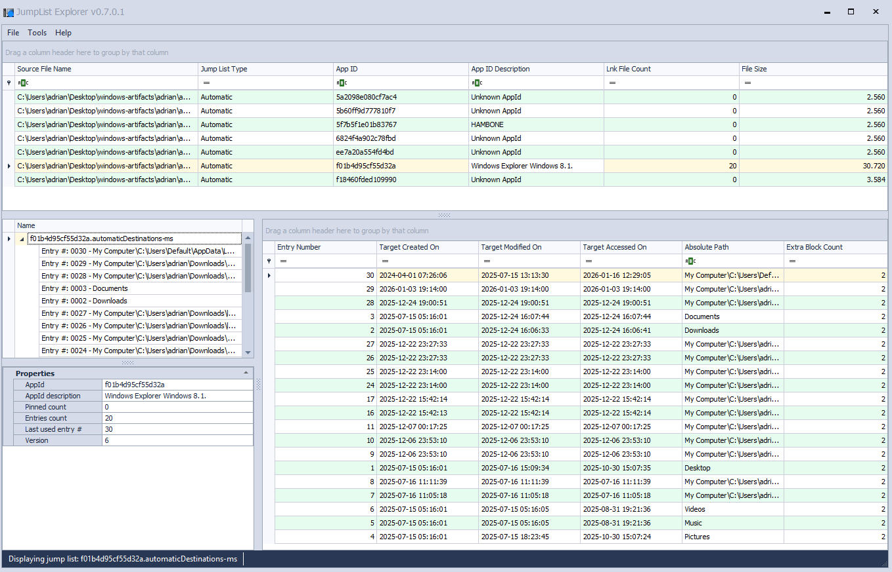  

`C:\Users\{user}\AppData\Roaming\Microsoft\Windows\Recent\CustomDestinations`  
  


#### Shellbags
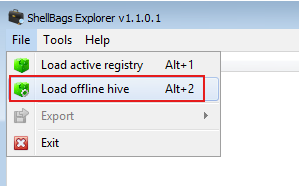  
`USRCLASS.DAT\Local Settings\Software\Microsoft\Windows\Shell\Bags`  
*Stores the view settings of folders (icon view, details view, window size, etc.) for individual folders.*  


`USRCLASS.DAT\Local Settings\Software\Microsoft\Windows\Shell\BagMRU`  
*Stores the hierarchy of folders that the user has accessed, linking to the corresponding Bags entries.*  
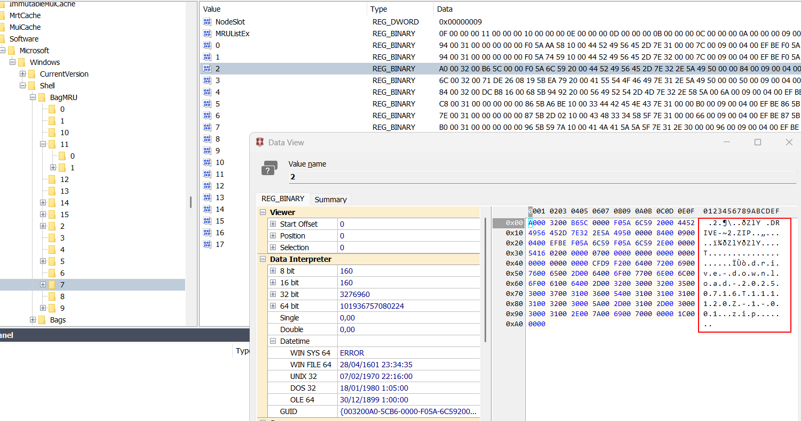

`NTUSER.DAT\Software\Microsoft\Windows\Shell\BagMRU`  
*Another location tracking folder access and structure, used by newer versions of Windows for the MRU (Most Recently Used) folder list.*  


Using a tool like Shellbags Explorer is it possible to visualize Shellbags on a easiest way.
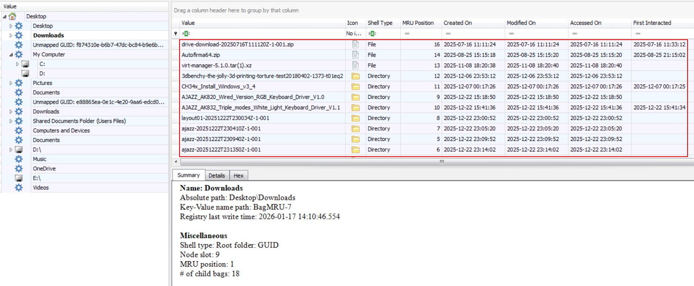

#### USB and MTP devices
- **MTP devices**  
`C:\Users\{user}\AppData\Local\Temp\WPDNSE\{GUID}`  
(Not present.)

- **USB storage (VID / PID)**  
`SYSTEM\ControlSet001\Enum\USBSTOR`  
*Shows vendor/product IDs and device serials.*  


- **USB volume names**  
`SOFTWARE\Microsoft\Windows Portable Devices\Devices`  
*Stores friendly device names.*  


- **User who used the USB device**  
`SYSTEM\MountedDevices`  
`NTUSER.DAT\Software\Microsoft\Windows\CurrentVersion\Explorer\MountPoints2`  
*Shows which user mounted the device and assigned drive letters.*  
  


- **Logical volume serial number**  
`Software\Microsoft\Windows NT\CurrentVersion\EMDMgmt`  
*Stores volume serials for identification.*  


- **First and last connection time**  
`SYSTEM\ControlSet001\Enum\USBSTOR\{VEN_PROD_VERSION}\{USB_SERIAL}\Properties\{83da6326-97a6-4088-9453-a1923f573b29}`  
*Tracks timestamps of USB device connections.*  


`C:\Windows\inf\setupapi.dev.log`  
*Tracks the installation and configuration of device drivers on the system*  


- **0064 – First connection (InstallDate)**  
  Indicates the first time the USB device was installed/connected on the system.
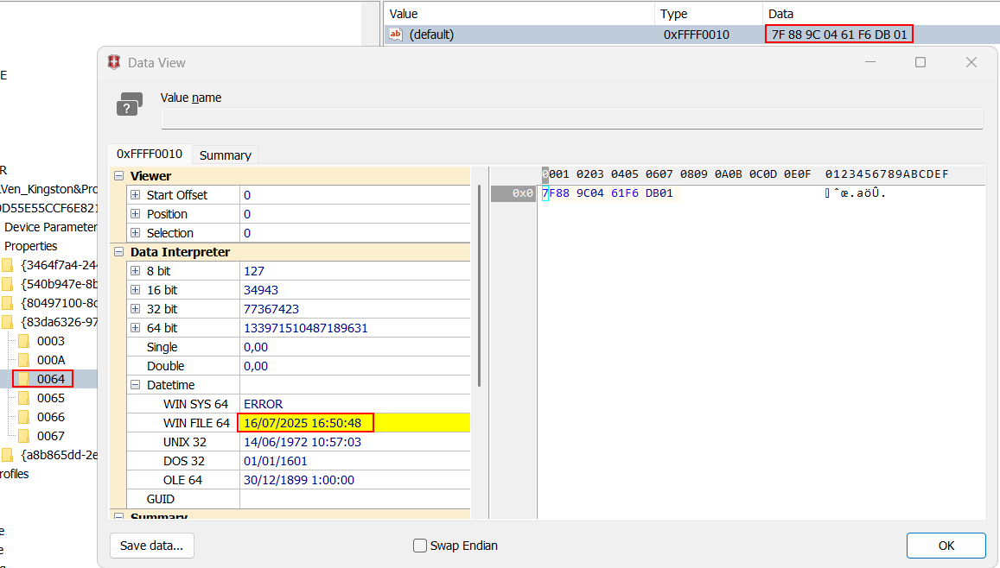

- **0065 – Last connection (LastArrivalDate)**  
  Indicates the most recent time the USB device was connected.
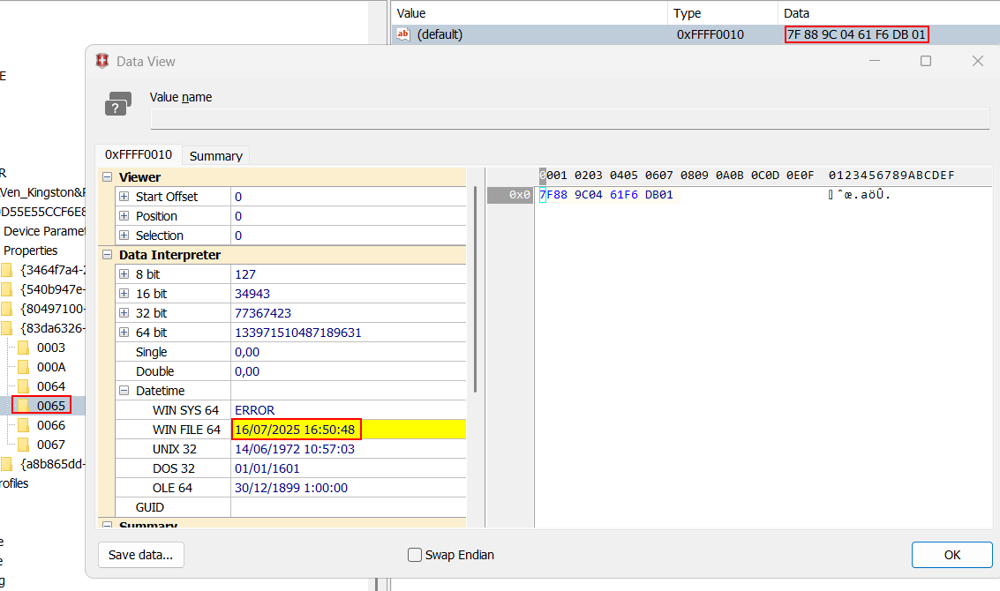

- **0066 – Last disconnection (LastRemovalDate)**  
  Indicates the most recent time the USB device was safely removed.


#### Databases and system artifacts
- **Cortana database**  
`C:\Users\{user}\AppData\Local\Packages\Microsoft.Windows.Cortana_xxxx\LocalState\ESEDatabase_CortanaCoreInstance\CortanaCoreDb.dat`  
(Not present.)

- **Windows notifications**  
`C:\Users\{user}\AppData\Local\Microsoft\Windows\Notifications\wpndatabase.db`  
*Tracks notifications shown to the user.*  
  
  
  


- **Timeline**  
`C:\Users\{user}\AppData\Local\ConnectedDevicesPlatform\ActivitiesCache.db`  
*Tracks app and file activity over time.*  


- **Windows Store**  
`Software\Microsoft\Windows\CurrentVersion\Appx\AppxAllUserStore\Applications\`  
*Contains Windows Store app installation state.*  


#### Other artifacts
- **Thumbnails and Thumbcache**  
`thumbs.db`  
`C:\Users\{user}\AppData\Local\Microsoft\Windows\Explorer`  
*Stores thumbnail images of files for faster previews.*  
  
  
  
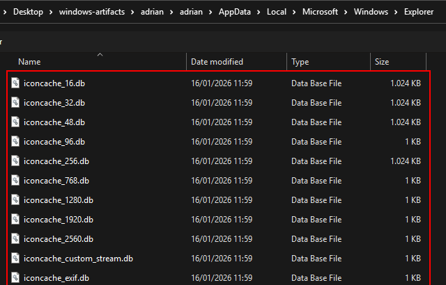  


- **Recycle Bin**  
`C:\$Recycle.Bin`  
*Stores deleted files.*  
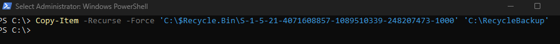

Copy for analysis:  

```powershell
Copy-Item -Recurse -Force 'C:\$Recycle.Bin\S-1-5-21-4071608857-1089510339-248207473-1000' 'C:\RecycleBackup'  
```


Export to CSV:  

```powershell
.\rifiuti-vista.exe -t "," -o "recycle-bin.csv" "C:\RecycleBackup"
```


- **OfficeFileCache**  
`C:\Users\{user}\AppData\Local\Microsoft\Office\{Version}\OfficeFileCache`  
(Not present.)

- **OfficeBackstage**  
`C:\Users\{user}\AppData\Local\Microsoft\Office\16.0\BackstageInAppNavCache`  
(Not present.)

- **Public IP (ETLParser)**  
`C:\Windows\ServiceProfiles\NetworkService\AppData\Local\Microsoft\Windows\DeliveryOptimization\Logs`  

```powershell
.\ETLParser.exe -c DeliveryLogs -s "C:\Windows\ServiceProfiles\NetworkService\AppData\Local\Microsoft\Windows\DeliveryOptimization\Logs" -o "C:\Users\adrian\Downloads\ETLOutput"
```

  
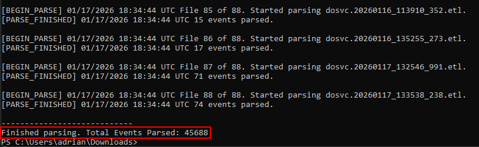  


- **PowerShell command history**  
`C:\Users\{user}\AppData\Roaming\Microsoft\Windows\PowerShell\PSReadLine\ConsoleHost_history.txt`  
*Stores previously executed PowerShell commands.*  


- **Prefetch**  
`C:\Windows\Prefetch`  
*Stores data about program execution.*  
  
  
  


- **SuperFetch**  
`C:\Windows\Prefetch\Ag*.db`  
*Caches frequently used applications to speed up loading.*  
*As I'm using a ssd superfetch files are not generated*

- **SRUM**  
`C:\Windows\System32\sru\SRUDB.dat`  
*Tracks network, CPU, and power usage.*
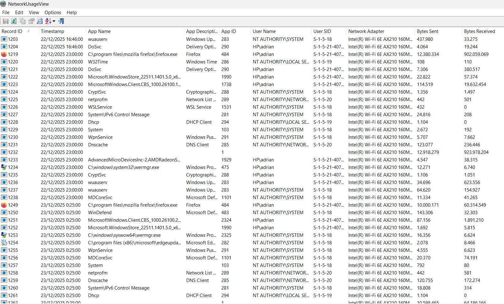

- **ShimCache**  
`SYSTEM\ControlSet001\Control\SessionManager\AppCompatCache\AppCompatCache`  
*Registry-based cache listing previously executed programs, even if deleted.*


- **AmCache (AppCompatCacheParser)**  
`C:\Windows\AppCompat\Programs\Amcache.hve`  
*Stores metadata about executed programs, installation times, and file paths.*


- **Scheduled Tasks**  
`SOFTWARE\Microsoft\Windows NT\Current Version\TaskCache\Tree`  
*Lists tasks scheduled by the system or users.*
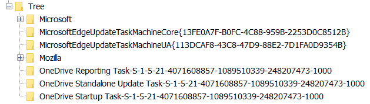

- **Services**  
`SYSTEM\ControlSet001\Services`  
*Registry keys storing installed services and their configuration.*
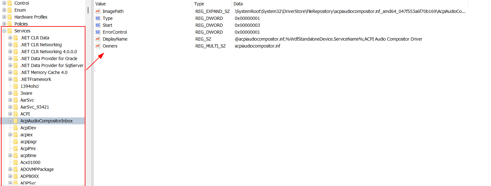

- **BAM (DCode)**  
*Tracks per-user application activity and resource usage.*
`SYSTEM\ControlSet001\Services\bam\UserSettings{SID}`  
*Not present*

`SYSTEM\ControlSet001\Services\bam\state\UserSettings{SID}`  


- **Windows Event Logs**  
`C:\Windows\System32\winevt\Logs`  
*Stores system, security, and application events for auditing and forensic analysis.*
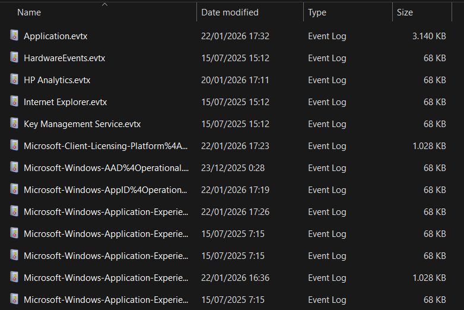
