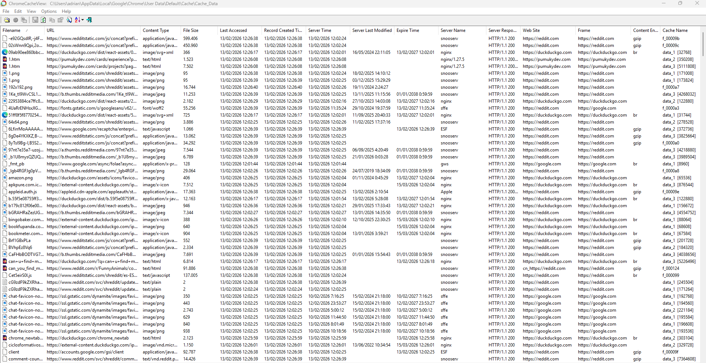
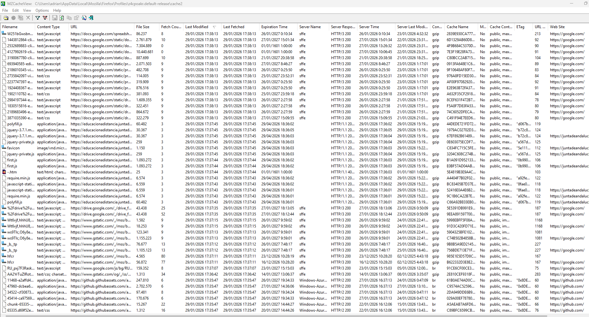
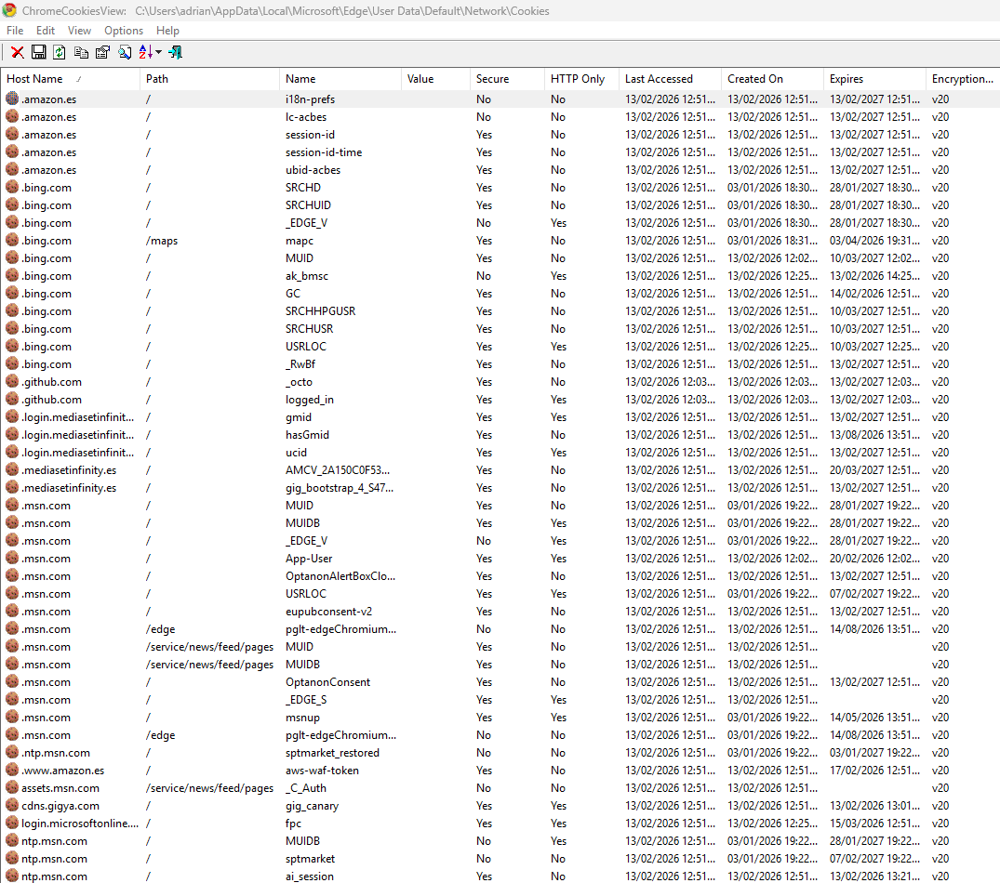
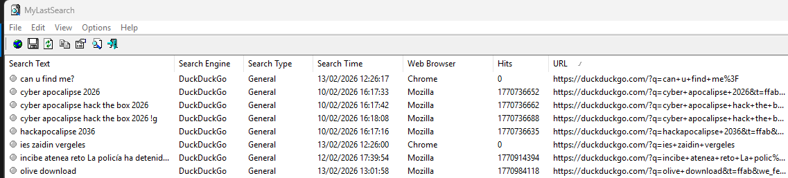

# Evidence in Web Browsers

Browser forensics analysis is a large and independent area of specialization.

Web browsers are used on mobile devices, tablets, netbooks, desktop computers, etc., and they are often used not only to browse the web, but also to navigate through the device’s file system. The web browser cache may contain images, videos, documents, executable files, and downloaded scripts. Web browsers may also store data entered into forms, such as search queries, logins and passwords for webmail accounts, social networks, other websites, and financial information (for example, credit card numbers). Bookmarks and search history can give investigators insight into the interests of the device owner.

Browser forensics analysis is mainly important in incident response to understand how an attack on a computer or a computer network began and to identify the source of the security compromise.

The main sources of malware, spyware, and adware are emails (including webmail), social networks, and other compromised websites. Typically, users access all these sources (webmail, social networks, websites) through web browsers.

One of the most well-known web browsers is Internet Explorer. This browser is a component of the Windows operating system and is often used as the default web browser. In Windows 10, Microsoft replaced Internet Explorer with Microsoft EDGE. Microsoft EDGE is a web browser that includes new features. Microsoft plans to replace Internet Explorer with Microsoft EDGE on all devices, including Android and iOS mobile devices. Internet Explorer and Microsoft EDGE can operate in InPrivate mode, without storing information about web resources visited by the user.

Another popular web browser is Google Chrome. It has the following characteristics:

- Integration with Google services.
- Synchronization of user passwords across devices.
- Ability to use extensions and add-ons.
- Fast operation.
- Collection of user data.
- High memory consumption.
- Google Chrome can operate in Incognito mode, which prevents the browser from permanently storing history information, cookies, site data, or form entries.

Third-party developers have created a large number of web browsers based on the Chrome Engine, such as: 360 Extreme Explorer, Avast SafeZone, Chromium, Comodo Dragon, CoolNovo, Cốc Cốc, Epic Browser, Flock, Vivaldi, Rockmelt, Sleipnir, SRWare Iron, Titan Browser, Torch Browser, Yandex.Browser, Opera, Orbitum, Breach, Nihrome, Perk, QIP Surf, Baidu Spark, Uran, Chromodo, Sputnik, Amigo, etc.

All these browsers have functionality similar to Google Chrome and produce web browser artifacts similar to those of Google Chrome. These browsers are compatible with most Google Chrome extensions and add-ons.

One of the most well-known web browsers based on the Google Chrome engine is Opera. Opera was the first to introduce features that were later adopted by other web browsers, such as speed dial, pop-up blocking, reopening recently closed pages, private browsing, and tabbed browsing. In addition, Opera includes a free Virtual Private Network (VPN) service that allows users to browse the web anonymously.

Firefox is a fairly popular web browser, and its artifacts can be found on devices under investigation. This web browser has the following characteristics:

- More secure (compared to other browsers).
- Advanced private browsing mode, which disables location tracking and user advertising.
- Its own extensions ecosystem.

Gecko is a browser engine developed by Mozilla. It is used in the Firefox browser, the Thunderbird email client, and many other projects.

Based on Gecko, third-party developers have created several web browsers, including: Firefox, Waterfox, Cyberfox, SeaMonkey, Netscape Navigator, CometBird, BlackHawk, IceCat, IceDragon, Pale Moon, Flock, K-Meleon, Galeon, FlashFox, Orfox, Vega.

Some web browser data is encrypted (for example, website passwords). Internet Explorer and Microsoft EDGE use the Data Protection Application Programming Interface (DPAPI). The DPAPI mechanism appeared in Windows 2000 and is used to protect stored passwords and confidential information on the computer. This mechanism includes data encryption and decryption functions and uses RAM.

A user password is required to decrypt encrypted data. If the password is registered in the account using a username and password, the operating system uses the password hash to decrypt the encrypted data.

As a general rule, data encryption is performed using the SHA1 algorithm; however, in some cases, data is encrypted using a less cryptographically secure algorithm.

A forensic examiner may often face the following difficulties when analyzing web browsers:

- Many browsers, large amounts of data.
- Different types of data.
- Encryption used to protect user data.
- User use of private mode (or incognito mode), in which the examined computer may not contain web browser artifacts.

Of course, each web browser leaves its own individual artifacts on the operating system. The types of web browser artifacts may vary depending on the browser version. Typically, when investigating web browser artifacts, the following types of artifacts can be extracted:

- Browsing history
- Files in the cache directory
- Cookies
- Typed URLs
- Sessions
- Most visited sites
- Screenshots
- Form values (searches, autocomplete)
- Downloaded files (Downloads)
- Bookmarks

(Source: [*An Overview of Web Browser Forensics | Digital Forensics | Computer Forensics | Blog*](https://www.digitalforensics.com/blog/articles/an-overview-of-web-browser-forensics/))

## Main Objectives of the Practice

- Identify where the evidence generated by web browsers is located and learn how to analyze it using various tools.

## Software to Be Used

A. File Explorer  
B. Various tools provided by NirSoft

## Practice Description

The practice consists of extracting all the evidence mentioned above in the introduction (history, downloads, cookies, cache, sessions, and form data).

## Tasks Required

1. Use the operating system of your own computer and/or a virtual machine where the most common browsers are installed: Firefox, Chrome, and Microsoft Edge.
2. Investigate the directory paths where each browser stores its evidence.
3. Download and test the different tools offered by NirSoft to analyze and process the evidence obtained in section 2.


### Microsoft Edge

```plaintext
Browsing history - %localappdata%\Microsoft\Edge\User Data\Default\History

Cache - %localappdata%\Microsoft\Edge\User Data\Default\Cache

Cookies - %localappdata%\Microsoft\Edge\User Data\Default\Cookies

Thumbnails - %localappdata%\Microsoft\Edge\User Data\Default\Cache\Cache_Data

Sessions - %localappdata%\Microsoft\Edge\User Data\Default\Sessions

Form values - %localappdata%\Microsoft\Edge\User Data\Default\Web Data

Download history - %localappdata%\Microsoft\Edge\User Data\Default\History

Bookmarks - %localappdata%\Microsoft\Edge\User Data\Default\Bookmarks
```

### Firefox

```plaintext
Browsing history - %appdata%\Mozilla\Firefox\Profiles\[Perfil]\places.sqlite

Files in the cache directory - %localappdata%\Mozilla\Firefox\Profiles\[Perfil]\cache2

Cookies - %appdata%\Mozilla\Firefox\Profiles\[Perfil]\cookies.sqlite

Thumbnails - %appdata%\Local\Mozilla\Firefox\Profiles\eqainsr.default-release\cache2\entries

Sessions - %appdata%\Roaming\Mozilla\Firefox\Profiles\[profile name]\

Form values - %appdata%\Mozilla\Firefox\Profiles\[Perfil]\formhistory.sqlite

Downloaded files (Downloads) - %appdata%\Mozilla\Firefox\Profiles\[Perfil]\places.sqlite

Bookmarks - %appdata%\Mozilla\Firefox\Profiles\[Perfil]\places.sqlite
```

### Google Chrome

```plaintext
Browsing history - %localappdata%\Google\Chrome\User Data\Default\History

Files in the cache directory - %localappdata%\Google\Chrome\User Data\Default\Cache

Cookies - %localappdata%\Google\Chrome\User Data\Default\Cookies

Sessions - %localappdata%\Google\Chrome\User Data\Default\Sessions

Thumbnails - %localappdata%\Google\Chrome\User Data\Default\Cache\Cache_Data

Form values - %localappdata%\Google\Chrome\User Data\Default\Web Data

Downloaded files (Downloads) - %localappdata%\Google\Chrome\User Data\Default\History

Bookmarks - %localappdata%\Google\Chrome\User Data\Default\Bookmarks
```

### Note

In both Chrome and Firefox we can have multiple users.

The name of the folder that contains the data varies depending on this, for example:

Firefox - profiles are stored in folders with names generated like name.default, etc.

Chrome - profiles are stored in folders according to the profile number; if no new profile has been created it will be Default.


_Firefox_


_Chrome_

## Browsing history

[Browsing History View](https://www.nirsoft.net/utils/browsinghistoryview-x64.zip)

### Edge, Chrome and Firefox


## Cache

[Mozilla cache viewer (GECKO)](https://www.nirsoft.net/utils/mzcacheview.zip)

[Chrome caché viewer (CHROMIUM)](https://www.nirsoft.net/utils/chromecacheview.zip)

### Chrome



### Edge


### Firefox



## Cookies

[MZCookiesView](https://www.nirsoft.net/utils/mzcv-x64.zip)

[ChromeCookiesView](https://www.nirsoft.net/utils/chromecookiesview-x64.zip)

### Note

Before accessing the cookie files, it is necessary to completely terminate the browser processes; otherwise, these files will be locked.

### Chrome


### Edge




### Firefox


## Thumbnails

[ImageCaché viewer](https://www.nirsoft.net/utils/imagecacheviewer.zip)


## Bookmarks

[WebBookmarks view](https://www.nirsoft.net/utils/webbrowserbookmarksview.zip)


## Downloaded files

[BrowserDownloads viewer](https://www.nirsoft.net/utils/browserdownloadsview.zip)


## Form values

[Web Browser pass view - password (wbpv28821@)](https://www.nirsoft.net/toolsdownload/webbrowserpassview.zip)

[Browser AutoFill view](https://www.nirsoft.net/utils/browserautofillview.zip)


_BrowserAutoFillView_


_WebBrowserPassView_

## Bonus - Searches

[MyLastSearch](https://www.nirsoft.net/utils/mylastsearch.zip)

