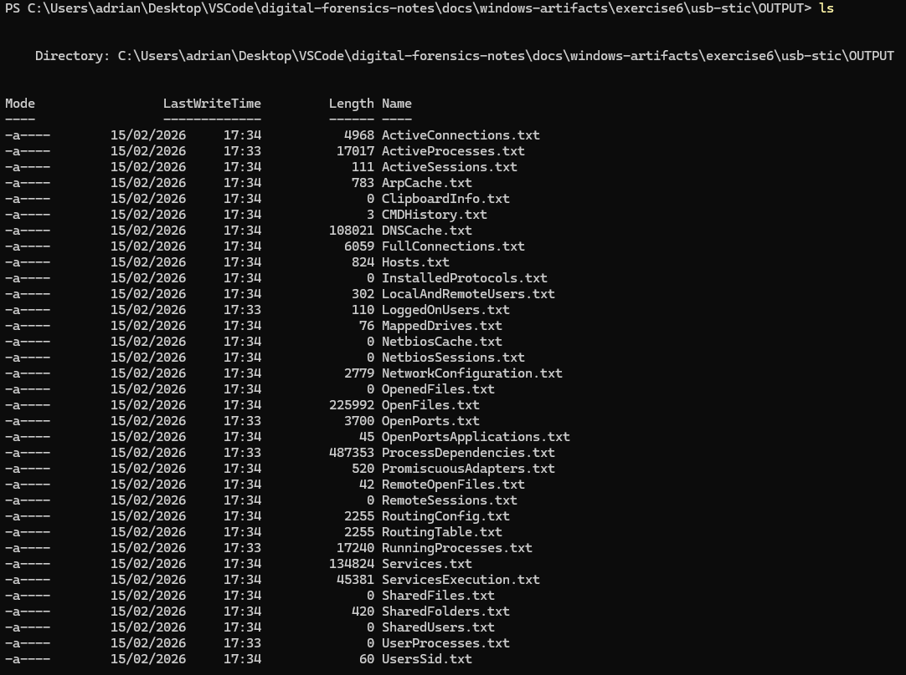
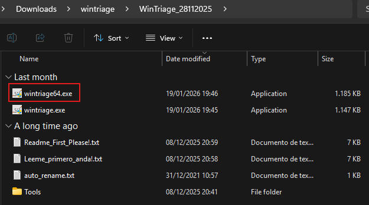
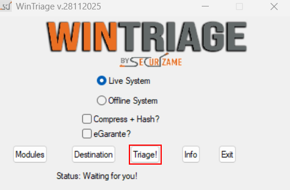
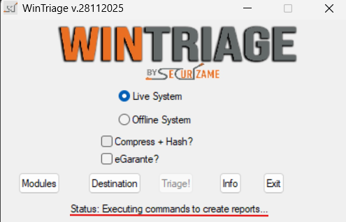
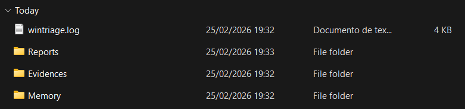
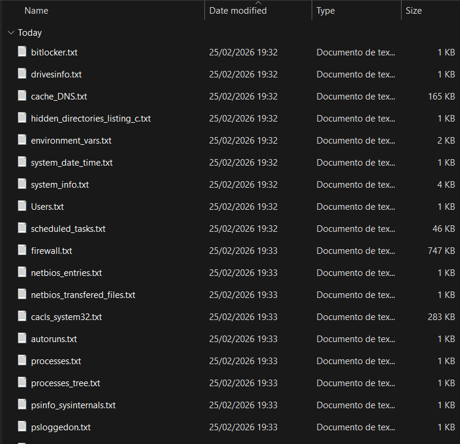
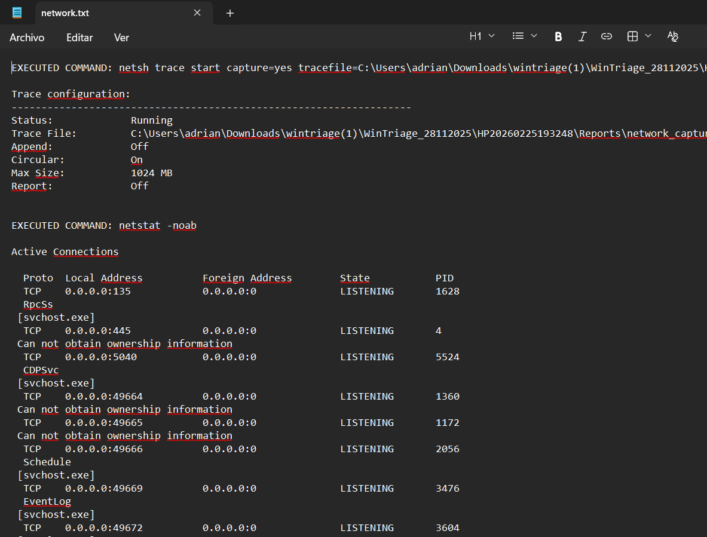
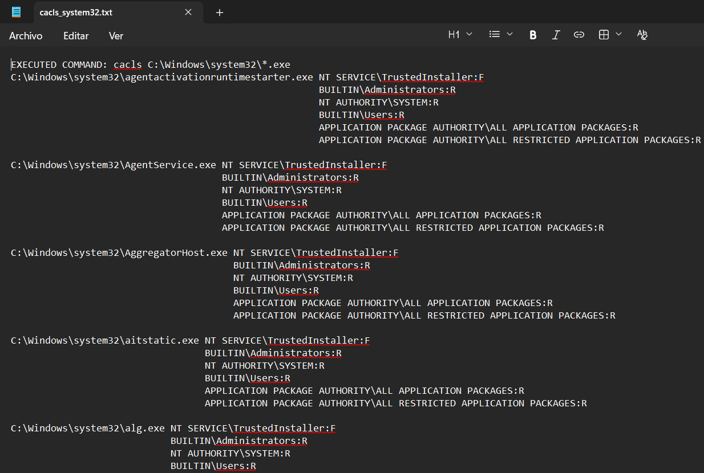

# Automatic forensics tools

## USB Stick

### Objective

- Develop a forensic tool composed of executable commands for evidence extraction and a batch processing file to launch them, in order to obtain the most relevant evidence studied in class.

### Materials

- Sysinternals Suite  
- NirSoft  
- ntsecurity.nu  
- Microsoft commands  
- Any other software you consider appropriate  

The idea is to create a USB stick containing the tools and a batch processing file. The BATCH file will be executed on the system to be examined. This BAT file will perform functions such as copying logs to the external USB drive and collecting information such as date, time, registered users, process tree, system uptime, etc.

### Solution

A script with multiple tools and utilities has been developed. In order to try that, clone the repository and navigate to the directory containing the tool.

```powershell
git clone https://github.com/PumukyDev/digital-forensics-notes.git
cd digital-forensics-notes/docs/windows-artifacts/exercise6/usb-stic
```

Then, run the following command:

```powershell
.\dfir-collector.bat
```

The tools has two modes:

- Automatic (1): Runs all the tools and scripts, showing multiple useful GUIs and saving the results into .txt files
- Manuel (2): Allows the user to select one specific tool instead of running all of them.


After the script finishes, and output containing all the logs will be generated.




## Wintriage

### Objective

- Prepare and use the graphical triage tool [Wintriage](https://www.securizame.com/wintriage-la-herramienta-de-triage-para-el-dfirer-en-windows/) for the rapid and structured acquisition of forensic evidence on Windows systems, allowing the controlled collection of relevant information during a live forensic analysis.

Wintriage is a graphical forensic tool designed to facilitate the initial collection of evidence on compromised Windows systems. Its main focus is forensic triage, that is, the rapid acquisition of key information that allows the analyst to assess the system’s state and decide on the next steps of the investigation.

For its use, the tool should preferably be executed from an external medium (for example, a forensic USB), thereby minimizing alteration of the analyzed system and avoiding the use of local tools that may have been manipulated. Wintriage allows easy selection of the artifacts to be collected and stores the results in a previously defined directory.

Prepare the tool, learn how to configure it, and perform a test of live digital evidence acquisition.

### Solution

Download the script fron [here](https://cursos.securizame.com/extra/wintriage.7z).

Run `wintriage64.exe` by doble click over it.



The Wintriage GUI should appear, click on "Triage!"



Some pharapheres willl indicate that the program is running somw jobs.



As shown, some folders will be created as "Reports", "Evidences", "Memory" and "wintriage.log"



Inside them we can see many files containing the logs of the program.



These are some results:



