# Data Recovery

## Introduction

File systems such as FAT, NTFS, and ext2/ext3/ext4 store user data in fixed-size **blocks** or **clusters**. The cluster size is chosen at format time and normally stays constant for the life of the volume. Operating systems try to place files contiguously to limit fragmentation. When a file is **deleted**, the name and directory entry are removed first; the cluster chain is marked free, but the underlying data often remains until new writes overwrite it. Recovery therefore depends on acting before that reuse and on choosing a method that matches how much metadata still exists.

**PhotoRec** recovers files by **carving** recognizable content from raw media. It does not rely on intact directory structures, which makes it effective on damaged or reformatted volumes—at the cost of losing original paths and filenames.

**TestDisk** focuses on **partition tables** and boot sectors: it can rebuild damaged MBR/GPT entries and restore bootability after partition-table loss or certain boot-sector corruption.

**Autopsy** provides a graphical case workflow on top of **The Sleuth Kit**, suited to structured examination, timelines, and reporting on larger images.

**Bulk Extractor** scans disk images for e-mail addresses, URLs, credit-card patterns, and other features without mounting the filesystem—useful as a fast triage pass alongside carving and GUI analysis.

## Objectives

Practice recovering data from an NTFS-based scenario using several forensic tools: partition inspection, file carving with PhotoRec, case-based analysis with Autopsy, feature scanning with Bulk Extractor, and MBR repair with TestDisk and Windows recovery media.

## Software

- FTK Imager 4.3 or higher  
- Active Disk Editor 7.0  
- PhotoRec  
- TestDisk  
- Bulk Extractor  
- Autopsy  


## Task 1 — Obtain the disk image

Download the forensic image **`recuperacion.dd`** supplied for the practice and verify its integrity (hash, if provided) before analysis.


## Task 2 — Analyze the disk layout

Examine `recuperacion.dd` with FTK Imager or Active Disk Editor and record partitioning scheme, partition count, sizes, and filesystem type.

### a. Partitioning scheme (MBR vs GPT)

The disk uses **GPT** (GUID Partition Table). The protective MBR and primary GPT header are visible in the sector view; partition entries reference modern GUID types rather than classic MBR CHS entries alone.

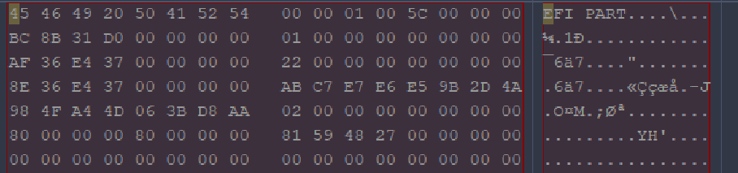

### b. Number of valid partitions and size

The image contains **one valid partition** in the partition table view—no additional active primary or extended partitions are listed for user data.

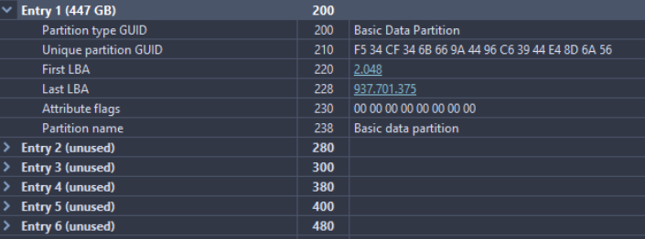

That partition spans approximately **447 GB** on the logical volume shown in the property pane (exact byte count depends on sector size and reported capacity in the tool).

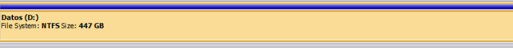

### c. Filesystem presence

The partition is formatted with **NTFS**. The volume boot record and filesystem metadata (e.g. “NTFS” OEM ID / BPB fields, depending on the tool) confirm that carved or logical recovery should assume NTFS cluster boundaries and resident data runs where metadata still exists.

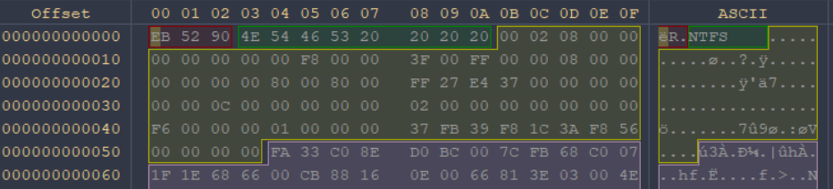


## Task 3 — Recover data from `recuperacion.dd`

### PhotoRec (file carving)

PhotoRec was pointed at the disk image. In the opening screen, the physical device or image file representing `recuperacion.dd` is selected as the source medium.

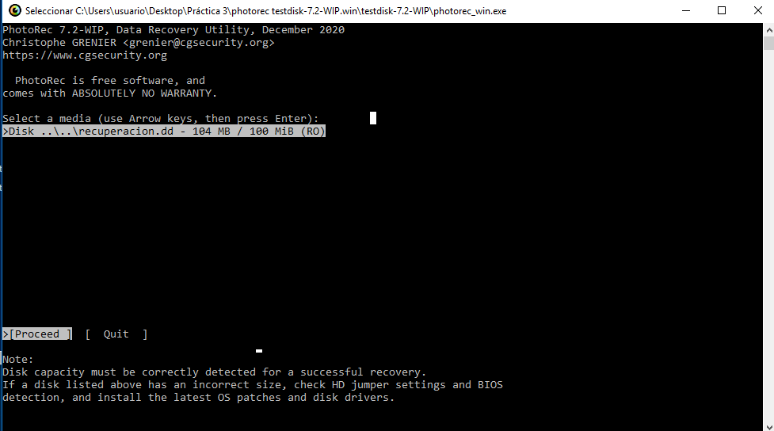

The **Search** option starts the carving pass (whole-disk / unallocated-oriented workflow as offered in this version).

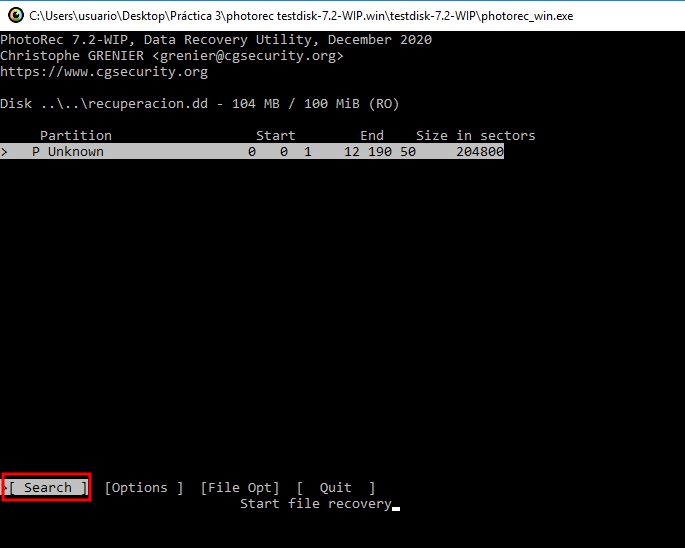

Filesystem type **Other** (or “Whole disk”) was chosen so PhotoRec does not depend on an intact NTFS catalog; recovered file types appear in the results tree as signatures are matched.

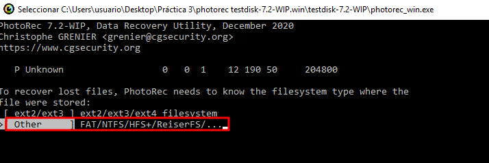

Press **C** to choose the output directory where recovered files will be written.

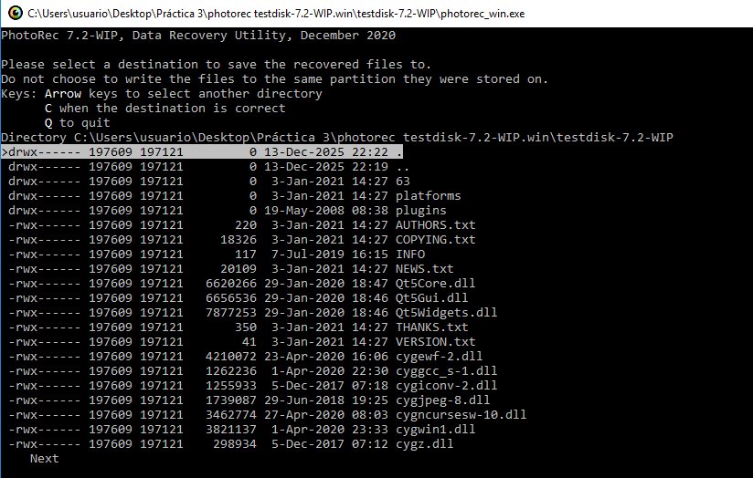

Confirm the destination folder on the analysis workstation.

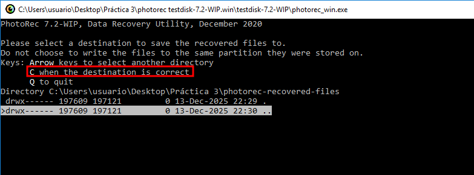

PhotoRec reports completion and the number of files recovered.

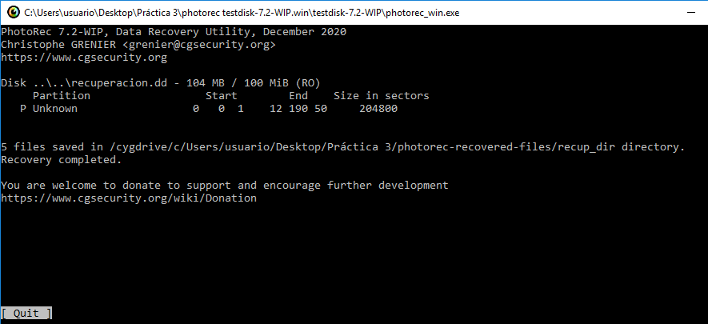

The output folder contains carved files grouped by extension; filenames are often generic (`f1234567.jpg`) because directory metadata was not available.

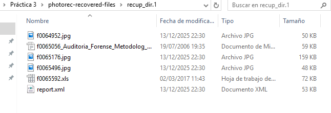

### Autopsy (case-based examination)

A new **Autopsy case** was created with a descriptive name and base directory for case metadata and exports.

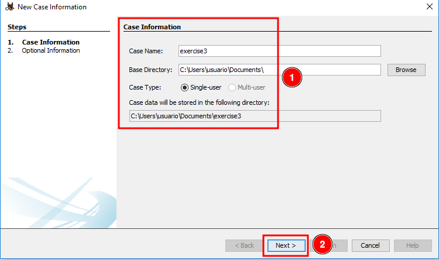

Case information and optional organizational fields were completed.

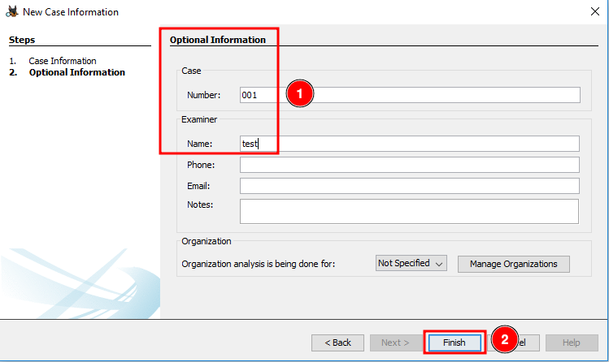

The data source step adds `recuperacion.dd` (or its mounted path) as an **image file** evidence source.

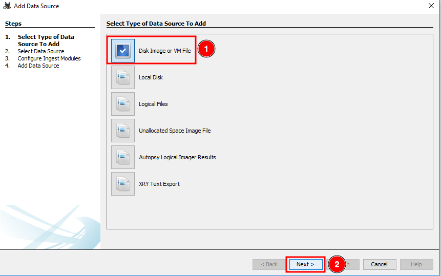

The disk image was selected and the ingest modules were accepted with **Next** through the wizard defaults appropriate for NTFS.

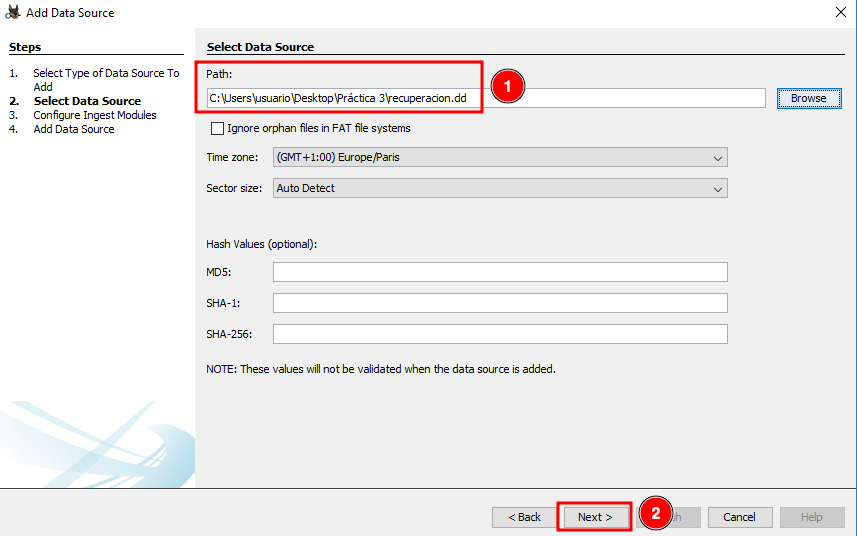

Ingest progress and module configuration during analysis.

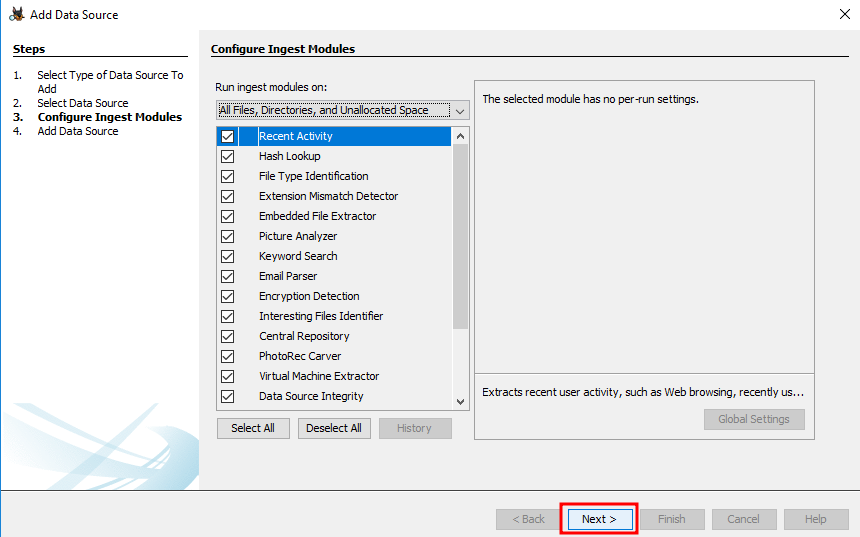

Results view after processing: directory tree, extracted views, and metadata panels.

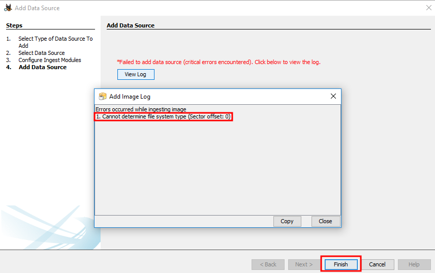

Autopsy exposes more structured context (paths where metadata exists, timestamps, hash sets, keyword hits) than PhotoRec alone. On a small image the interface can look busy relative to the file count; on larger corpora the same layout scales better for filtering and reporting. In this lab, Autopsy surfaced additional artifacts and organization compared with the flat carved output.

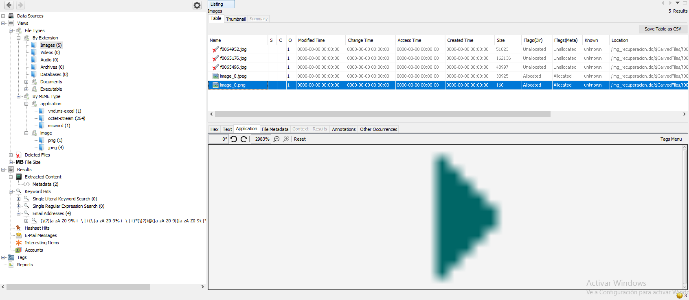

### Bulk Extractor (feature scan)

Bulk Extractor was launched, the image file selected, and a scan started. The tool writes feature files (e-mail, URL, credit card, etc.) under a report directory without fully parsing NTFS paths.

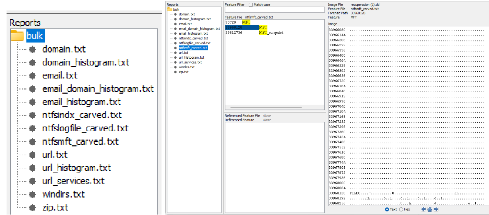

Recovered paths and features can be cross-checked with PhotoRec and Autopsy results.


## Task 4 — Repair MBR on the XP–Ubuntu VM (TestDisk)

A multi-boot virtual machine (Windows XP and Ubuntu) was imported from the provided OVA. The **master boot record** was damaged; the VM failed to boot.

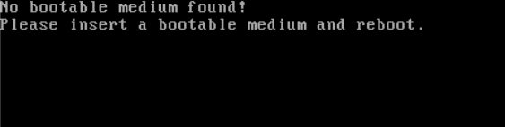

A Windows XP installation ISO was attached and the VM booted from optical media.

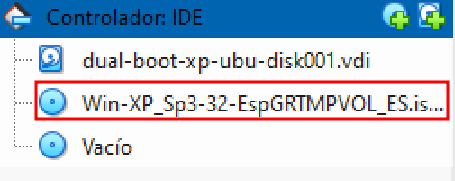

At the setup screen, **R** (Recovery Console / repair path as shown in the lab) was selected to reach a repair environment.

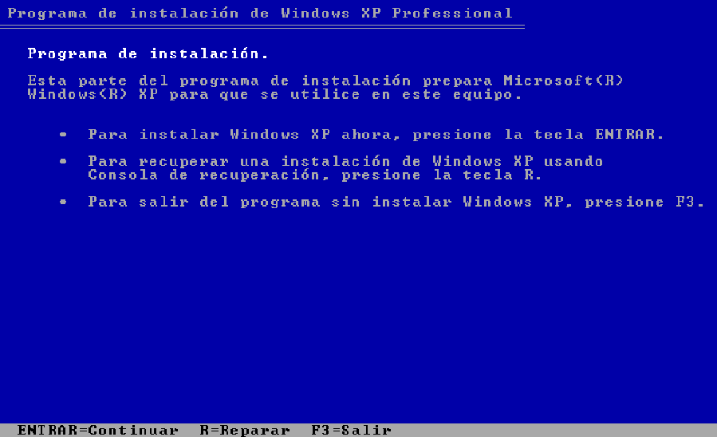

From the recovery command line, **`FIXMBR`** was executed to rewrite the master boot code.

```cmd
FIXMBR
```

The utility reported success.

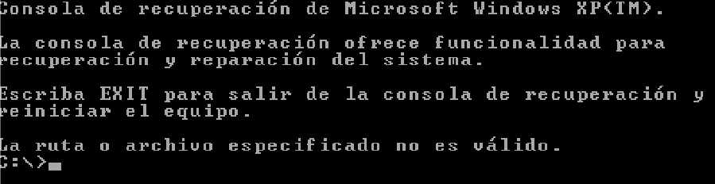

After reboot, the system still failed to start correctly from the hard disk alone.

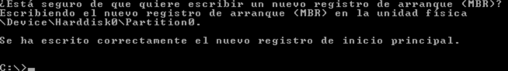

Further inspection showed boot code present but the **partition table** still inconsistent with the actual layout—`FIXMBR` repairs the first-stage loader in sector 0 but does not rebuild partition entries.


The partition view remained broken relative to the expected XP/Ubuntu layout.

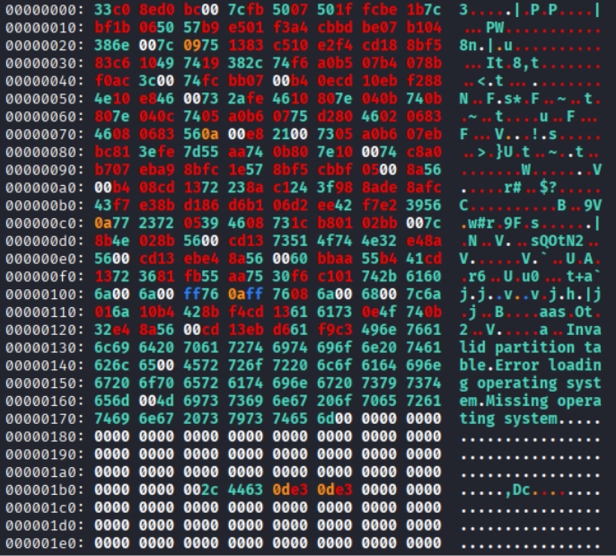

### TestDisk on Kali Linux

Analysis continued on a **Kali** host with TestDisk.

```bash
testdisk
```

**Create** a new log file so actions are documented for the report.

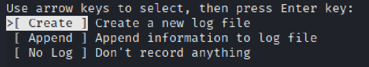

Select the physical disk or image representing the VM virtual disk.

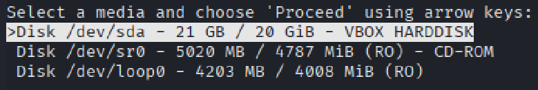

Choose **Intel** partition table type (standard PC MBR) for this VM.

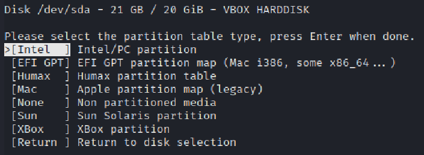

Run **Analyse** to inspect current and recoverable structures.

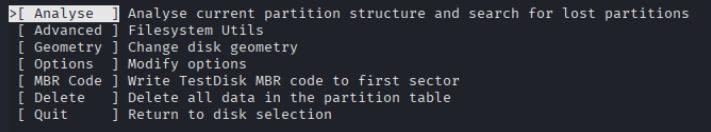

The analysis reflects a **destroyed partition table**: entries are missing or marked non-existent because the MBR sector was overwritten in the earlier exercise.

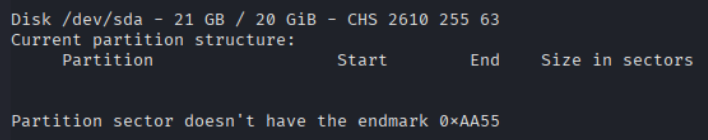

Run **Quick Search** to locate former partition boundaries.

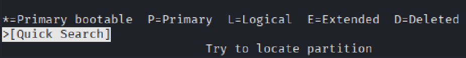

TestDisk found the expected partitions (Windows XP and Linux areas matching the original layout).

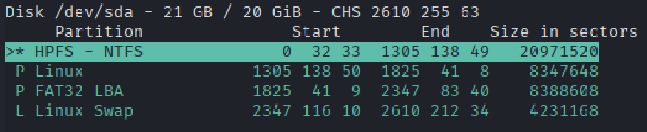

After verifying start/end sectors and types, **Write** commits the rebuilt partition table to disk.

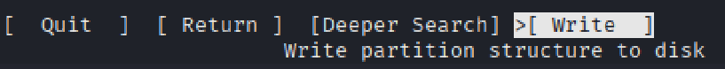

The VM boots again with the restored table.

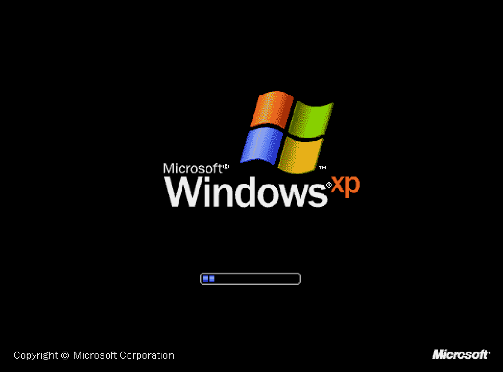


## Task 5 — Corrupt and recover MBR on the Windows 7–Debian VM

A second multi-boot VM (Windows 7 and Debian) was imported. The exercise **intentionally destroys** the MBR partition table, then attempts repair with Windows 7 installation media.

### Deliberate MBR corruption (Kali live)

The VM was started from a **Kali live** environment (not forensic boot mode, because the exercise requires **writing** to the disk). A second virtual disk using **MBR** was attached.

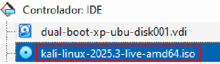

Identify the correct block device (in this lab, **`/dev/sda`**).

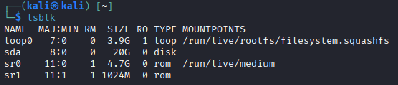

Overwrite the first sector(s) containing the **MBR** and partition table with `dd` (zeros or a prepared pattern), destroying partition entries while leaving much of the volume data intact.

```bash
# Example pattern used in the lab — adjust device and count to match your environment
sudo dd if=/dev/zero of=/dev/sda bs=512 count=1
```

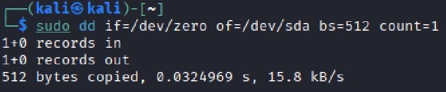

The partition table is no longer valid; the system will not boot until the MBR is repaired.

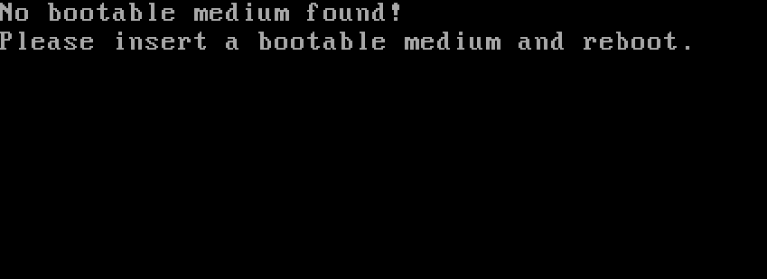

### Repair with Windows 7 installation media

Boot from a **Windows 7** ISO and open **Repair your computer**.

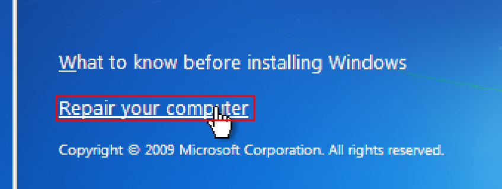

Open **Command Prompt** from the recovery options.

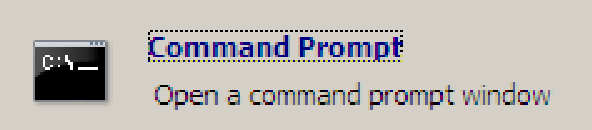

Restore the master boot record with:

```cmd
bootrec /fixmbr
```

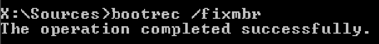

After reboot, **Windows 7** starts normally. The **Debian** side may still require **GRUB** repair (`boot-repair`, live ISO, or `grub-install` from a Linux environment) because `bootrec /fixmbr` only restores the Windows boot path in the MBR, not the full multi-boot menu.

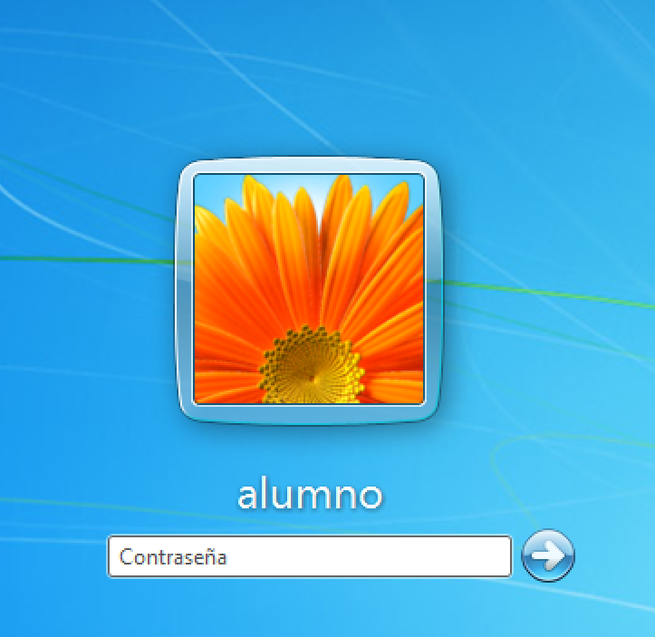
