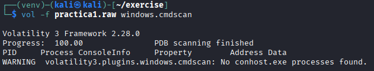
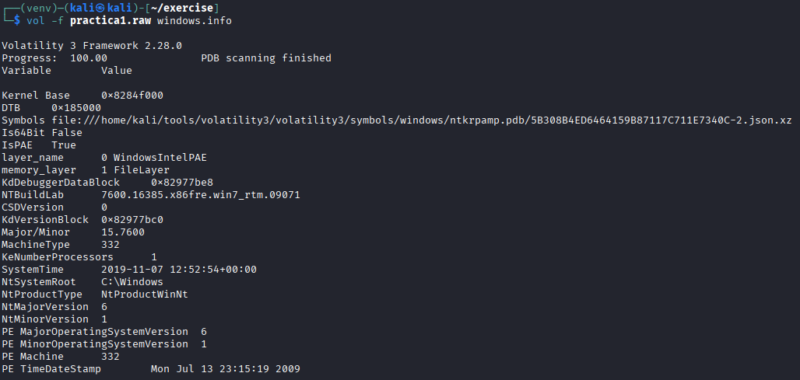
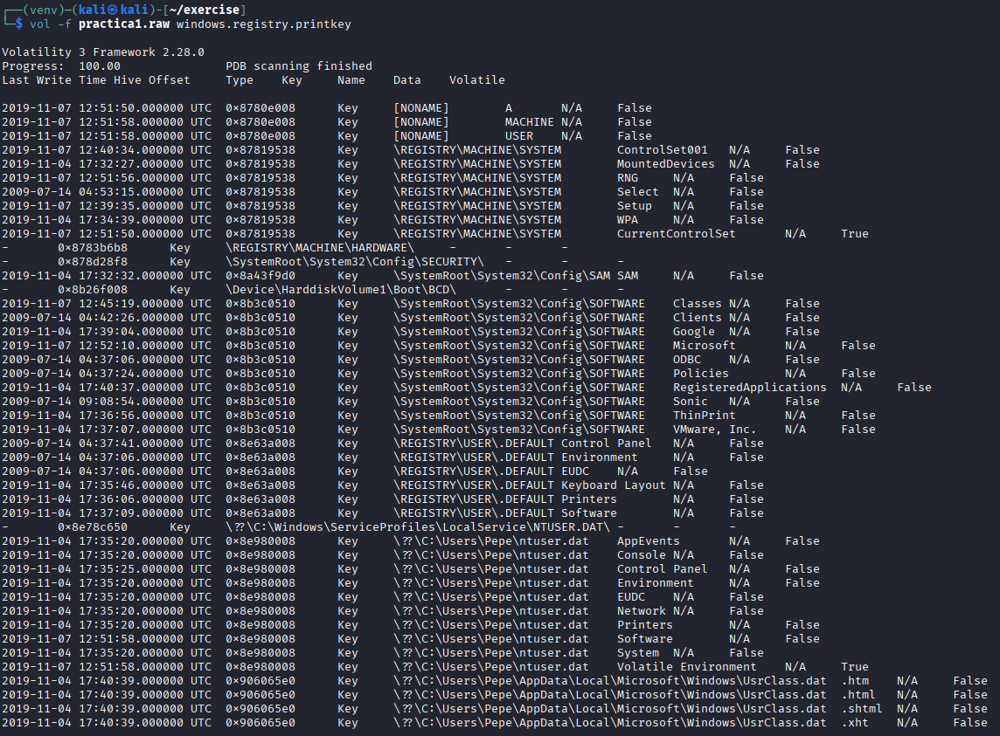

# Volatility

As we know, there are two types of forensic analysis: live and post-mortem.

The first occurs when the system is still active during the analysis. In this scenario, it is possible to acquire volatile data such as RAM, running processes, Internet connections, and temporary files. If disk encryption is used, this type of analysis allows the file system to be decrypted using the cached key. On the other hand, this type of analysis requires greater expertise, and the system constantly modifies its data, which may affect judicial admissibility.

The analyst should also not trust any tools provided by the system itself, as they may have been deliberately manipulated.


We have been provided with a [RAM capture](ram.7z) that must be subjected to a complete forensic analysis.

### Main Objectives of the Practice

- Analyze RAM memory  
- Install and learn how to use the VOLATILITY tool  

Detail the process (command used and screenshot of the command output) to obtain this information.

We are required to obtain the following information:

git clone https://github.com/volatilityfoundation/volatility3.git
cd volatility3
python3 -m venv venv
source venv/bin/activate
pip install -e [dev]

- Operating system profile  

```bash
vol -f practica1.raw windows.info
```


Note: Columns are not well formated, so they will be displayed as csv below the image too for a better visualization. It can be possible using the `-r csv` flag after the file.

| TreeDepth | Variable                       | Value                                                                                                                   |
|-----------|--------------------------------|-------------------------------------------------------------------------------------------------------------------------|
| 0         | Kernel Base                    | 0x8284f000                                                                                                              |
| 0         | DTB                            | 0x185000                                                                                                                |
| 0         | Symbols                        | file:///home/kali/tools/volatility3/volatility3/symbols/windows/ntkrpamp.pdb/5B308B4ED6464159B87117C711E7340C-2.json.xz |
| 0         | Is64Bit                        | False                                                                                                                   |
| 0         | IsPAE                          | True                                                                                                                    |
| 0         | layer_name                     | 0 WindowsIntelPAE                                                                                                       |
| 0         | memory_layer                   | 1 FileLayer                                                                                                             |
| 0         | KdDebuggerDataBlock            | 0x82977be8                                                                                                              |
| 0         | NTBuildLab                     | 7600.16385.x86fre.win7_rtm.09071                                                                                        |
| 0         | CSDVersion                     | 0                                                                                                                       |
| 0         | KdVersionBlock                 | 0x82977bc0                                                                                                              |
| 0         | Major/Minor                    | 15.7600                                                                                                                 |
| 0         | MachineType                    | 332                                                                                                                     |
| 0         | KeNumberProcessors             | 1                                                                                                                       |
| 0         | SystemTime                     | 2019-11-07 12:52:54+00:00                                                                                               |
| 0         | NtSystemRoot                   | C:\\Windows                                                                                                             |
| 0         | NtProductType                  | NtProductWinNt                                                                                                          |
| 0         | NtMajorVersion                 | 6                                                                                                                       |
| 0         | NtMinorVersion                 | 1                                                                                                                       |
| 0         | PE MajorOperatingSystemVersion | 6                                                                                                                       |
| 0         | PE MinorOperatingSystemVersion | 1                                                                                                                       |
| 0         | PE Machine                     | 332                                                                                                                     |
| 0         | PE TimeDateStamp               | Mon Jul 13 23:15:19 2009                                                                                                |


- Process list  

vol -f practica1.raw windows.pslist


|TreeDepth|PID |PPID|ImageFileName |Offset(V) |Threads|Handles|SessionId|Wow64|CreateTime                    |ExitTime|File output|
|---------|----|----|--------------|----------|-------|-------|---------|-----|------------------------------|--------|-----------|
|0        |4   |0   |System        |0x84f4a8e8|85     |507    |N/A      |False|2019-11-07 12:51:57.000000 UTC|N/A     |Disabled   |
|0        |248 |4   |smss.exe      |0x85aa8128|4      |29     |N/A      |False|2019-11-07 12:51:57.000000 UTC|N/A     |Disabled   |
|0        |336 |320 |csrss.exe     |0x85a7a030|9      |639    |0        |False|2019-11-07 12:51:57.000000 UTC|N/A     |Disabled   |
|0        |388 |320 |wininit.exe   |0x86398148|7      |90     |0        |False|2019-11-07 12:51:57.000000 UTC|N/A     |Disabled   |
|0        |396 |380 |csrss.exe     |0x863c3d40|10     |228    |1        |False|2019-11-07 12:51:57.000000 UTC|N/A     |Disabled   |
|0        |432 |380 |winlogon.exe  |0x863d1030|6      |119    |1        |False|2019-11-07 12:51:57.000000 UTC|N/A     |Disabled   |
|0        |492 |388 |services.exe  |0x863fe230|21     |248    |0        |False|2019-11-07 12:51:57.000000 UTC|N/A     |Disabled   |
|0        |500 |388 |lsass.exe     |0x86404840|10     |792    |0        |False|2019-11-07 12:51:57.000000 UTC|N/A     |Disabled   |
|0        |508 |388 |lsm.exe       |0x86407030|11     |153    |0        |False|2019-11-07 12:51:57.000000 UTC|N/A     |Disabled   |
|0        |616 |492 |svchost.exe   |0x86429c40|16     |366    |0        |False|2019-11-07 12:51:58.000000 UTC|N/A     |Disabled   |
|0        |672 |492 |vmacthlp.exe  |0x86444d40|5      |55     |0        |False|2019-11-07 12:51:58.000000 UTC|N/A     |Disabled   |
|0        |716 |492 |svchost.exe   |0x864595e8|11     |314    |0        |False|2019-11-07 12:51:58.000000 UTC|N/A     |Disabled   |
|0        |776 |492 |svchost.exe   |0x86479790|25     |528    |0        |False|2019-11-07 12:51:58.000000 UTC|N/A     |Disabled   |
|0        |848 |492 |svchost.exe   |0x8649eb90|32     |518    |0        |False|2019-11-07 12:51:58.000000 UTC|N/A     |Disabled   |
|0        |892 |492 |svchost.exe   |0x864a84e8|47     |857    |0        |False|2019-11-07 12:51:58.000000 UTC|N/A     |Disabled   |
|0        |976 |776 |audiodg.exe   |0x864cd5c0|6      |125    |0        |False|2019-11-07 12:51:58.000000 UTC|N/A     |Disabled   |
|0        |1052|492 |svchost.exe   |0x864f4510|37     |783    |0        |False|2019-11-07 12:51:58.000000 UTC|N/A     |Disabled   |
|0        |1136|492 |svchost.exe   |0x865054d8|22     |414    |0        |False|2019-11-07 12:51:58.000000 UTC|N/A     |Disabled   |
|0        |1348|492 |spoolsv.exe   |0x86563030|15     |322    |0        |False|2019-11-07 12:51:59.000000 UTC|N/A     |Disabled   |
|0        |1364|848 |dwm.exe       |0x8656c7e0|5      |72     |1        |False|2019-11-07 12:51:59.000000 UTC|N/A     |Disabled   |
|0        |1400|492 |svchost.exe   |0x8657cc88|24     |324    |0        |False|2019-11-07 12:51:59.000000 UTC|N/A     |Disabled   |
|0        |1408|1356|explorer.exe  |0x8657a400|39     |804    |1        |False|2019-11-07 12:51:59.000000 UTC|N/A     |Disabled   |
|0        |1420|492 |taskhost.exe  |0x8657c348|10     |210    |1        |False|2019-11-07 12:51:59.000000 UTC|N/A     |Disabled   |
|0        |1648|1408|vmtoolsd.exe  |0x865fdc28|10     |196    |1        |False|2019-11-07 12:51:59.000000 UTC|N/A     |Disabled   |
|0        |1676|892 |taskeng.exe   |0x87d03d40|6      |81     |0        |False|2019-11-07 12:52:00.000000 UTC|N/A     |Disabled   |
|0        |1764|492 |VGAuthService.|0x87d09878|4      |88     |0        |False|2019-11-07 12:52:00.000000 UTC|N/A     |Disabled   |
|0        |1824|492 |vmtoolsd.exe  |0x865f2140|9      |293    |0        |False|2019-11-07 12:52:00.000000 UTC|N/A     |Disabled   |
|0        |560 |492 |dllhost.exe   |0x87c73b38|21     |202    |0        |False|2019-11-07 12:52:01.000000 UTC|N/A     |Disabled   |
|0        |1176|616 |WmiPrvSE.exe  |0x87c79a60|10     |186    |0        |False|2019-11-07 12:52:01.000000 UTC|N/A     |Disabled   |
|0        |1724|492 |dllhost.exe   |0x87c7a548|18     |207    |0        |False|2019-11-07 12:52:01.000000 UTC|N/A     |Disabled   |
|0        |644 |492 |msdtc.exe     |0x87d094c0|15     |155    |0        |False|2019-11-07 12:52:03.000000 UTC|N/A     |Disabled   |
|0        |2192|492 |VSSVC.exe     |0x87d11d40|7      |119    |0        |False|2019-11-07 12:52:04.000000 UTC|N/A     |Disabled   |
|0        |2268|492 |SearchIndexer.|0x87ce9d10|14     |586    |0        |False|2019-11-07 12:52:05.000000 UTC|N/A     |Disabled   |
|0        |2336|2268|SearchProtocol|0x87c08400|8      |312    |0        |False|2019-11-07 12:52:05.000000 UTC|N/A     |Disabled   |
|0        |2356|2268|SearchFilterHo|0x87cfdc98|6      |82     |0        |False|2019-11-07 12:52:05.000000 UTC|N/A     |Disabled   |
|0        |2468|492 |wmpnetwk.exe  |0x87dadd40|17     |482    |0        |False|2019-11-07 12:52:06.000000 UTC|N/A     |Disabled   |
|0        |2552|492 |svchost.exe   |0x87de8a88|29     |333    |0        |False|2019-11-07 12:52:06.000000 UTC|N/A     |Disabled   |
|0        |2780|492 |svchost.exe   |0x925198d8|11     |356    |0        |False|2019-11-07 12:52:07.000000 UTC|N/A     |Disabled   |
|0        |2904|616 |WmiPrvSE.exe  |0x87dc0618|13     |298    |0        |False|2019-11-07 12:52:08.000000 UTC|N/A     |Disabled   |
|0        |3112|1408|notepad.exe   |0x87cc79b8|12     |293    |1        |False|2019-11-07 12:52:11.000000 UTC|N/A     |Disabled   |
|0        |3316|1408|MagnetRAMCaptu|0x92549d40|13     |296    |1        |False|2019-11-07 12:52:15.000000 UTC|N/A     |Disabled   |
|0        |3624|492 |WmiApSrv.exe  |0x85602030|7      |117    |0        |False|2019-11-07 12:52:23.000000 UTC|N/A     |Disabled   |


vol -f practica1.raw windows.pstree


|TreeDepth|PID |PPID|ImageFileName |Offset(V) |Threads|Handles|SessionId|Wow64|CreateTime                    |ExitTime|Audit   |Cmd                                                                                                                                                                                                                                                                                                                              |Path                                                 |
|---------|----|----|--------------|----------|-------|-------|---------|-----|------------------------------|--------|--------|---------------------------------------------------------------------------------------------------------------------------------------------------------------------------------------------------------------------------------------------------------------------------------------------------------------------------------|-----------------------------------------------------|
|0        |4   |0   |System        |0x84f4a8e8|85     |507    |N/A      |False|2019-11-07 12:51:57.000000 UTC|N/A     |-       |-                                                                                                                                                                                                                                                                                                                                |-                                                    |
|1        |248 |4   |smss.exe      |0x85aa8128|4      |29     |N/A      |False|2019-11-07 12:51:57.000000 UTC|N/A     |\\Device\\HarddiskVolume1\\Windows\\System32\\smss.exe|\\SystemRoot\\System32\\smss.exe                                                                                                                                                                                                                                                                                                 |\\SystemRoot\\System32\\smss.exe                     |
|0        |336 |320 |csrss.exe     |0x85a7a030|9      |639    |0        |False|2019-11-07 12:51:57.000000 UTC|N/A     |\\Device\\HarddiskVolume1\\Windows\\System32\\csrss.exe|%SystemRoot%\\system32\\csrss.exe ObjectDirectory=\\Windows SharedSection=1024,12288,512 Windows=On SubSystemType=Windows ServerDll=basesrv,1 ServerDll=winsrv:UserServerDllInitialization,3 ServerDll=winsrv:ConServerDllInitialization,2 ServerDll=sxssrv,4 ProfileControl=Off MaxRequestThreads=16                            |C:\\Windows\\system32\\csrss.exe                     |
|0        |388 |320 |wininit.exe   |0x86398148|7      |90     |0        |False|2019-11-07 12:51:57.000000 UTC|N/A     |\\Device\\HarddiskVolume1\\Windows\\System32\\wininit.exe|wininit.exe                                                                                                                                                                                                                                                                                                                      |C:\\Windows\\system32\\wininit.exe                   |
|1        |508 |388 |lsm.exe       |0x86407030|11     |153    |0        |False|2019-11-07 12:51:57.000000 UTC|N/A     |\\Device\\HarddiskVolume1\\Windows\\System32\\lsm.exe|C:\\Windows\\system32\\lsm.exe                                                                                                                                                                                                                                                                                                   |C:\\Windows\\system32\\lsm.exe                       |
|1        |492 |388 |services.exe  |0x863fe230|21     |248    |0        |False|2019-11-07 12:51:57.000000 UTC|N/A     |\\Device\\HarddiskVolume1\\Windows\\System32\\services.exe|C:\\Windows\\system32\\services.exe                                                                                                                                                                                                                                                                                              |C:\\Windows\\system32\\services.exe                  |
|2        |644 |492 |msdtc.exe     |0x87d094c0|15     |155    |0        |False|2019-11-07 12:52:03.000000 UTC|N/A     |\\Device\\HarddiskVolume1\\Windows\\System32\\msdtc.exe|C:\\Windows\\System32\\msdtc.exe                                                                                                                                                                                                                                                                                                 |C:\\Windows\\System32\\msdtc.exe                     |
|2        |776 |492 |svchost.exe   |0x86479790|25     |528    |0        |False|2019-11-07 12:51:58.000000 UTC|N/A     |\\Device\\HarddiskVolume1\\Windows\\System32\\svchost.exe|C:\\Windows\\System32\\svchost.exe -k LocalServiceNetworkRestricted                                                                                                                                                                                                                                                              |C:\\Windows\\System32\\svchost.exe                   |
|3        |976 |776 |audiodg.exe   |0x864cd5c0|6      |125    |0        |False|2019-11-07 12:51:58.000000 UTC|N/A     |\\Device\\HarddiskVolume1\\Windows\\System32\\audiodg.exe|C:\\Windows\\system32\\AUDIODG.EXE 0x2cc                                                                                                                                                                                                                                                                                         |C:\\Windows\\system32\\AUDIODG.EXE                   |
|2        |1420|492 |taskhost.exe  |0x8657c348|10     |210    |1        |False|2019-11-07 12:51:59.000000 UTC|N/A     |\\Device\\HarddiskVolume1\\Windows\\System32\\taskhost.exe|"taskhost.exe"                                                                                                                                                                                                                                                                                                                   |C:\\Windows\\system32\\taskhost.exe                  |
|2        |2192|492 |VSSVC.exe     |0x87d11d40|7      |119    |0        |False|2019-11-07 12:52:04.000000 UTC|N/A     |\\Device\\HarddiskVolume1\\Windows\\System32\\VSSVC.exe|C:\\Windows\\system32\\vssvc.exe                                                                                                                                                                                                                                                                                                 |C:\\Windows\\system32\\vssvc.exe                     |
|2        |1052|492 |svchost.exe   |0x864f4510|37     |783    |0        |False|2019-11-07 12:51:58.000000 UTC|N/A     |\\Device\\HarddiskVolume1\\Windows\\System32\\svchost.exe|C:\\Windows\\system32\\svchost.exe -k LocalService                                                                                                                                                                                                                                                                               |C:\\Windows\\system32\\svchost.exe                   |
|2        |672 |492 |vmacthlp.exe  |0x86444d40|5      |55     |0        |False|2019-11-07 12:51:58.000000 UTC|N/A     |\\Device\\HarddiskVolume1\\Program Files\\VMware\\VMware Tools\\vmacthlp.exe|"C:\\Program Files\\VMware\\VMware Tools\\vmacthlp.exe"                                                                                                                                                                                                                                                                          |C:\\Program Files\\VMware\\VMware Tools\\vmacthlp.exe|
|2        |1824|492 |vmtoolsd.exe  |0x865f2140|9      |293    |0        |False|2019-11-07 12:52:00.000000 UTC|N/A     |\\Device\\HarddiskVolume1\\Program Files\\VMware\\VMware Tools\\vmtoolsd.exe|"C:\\Program Files\\VMware\\VMware Tools\\vmtoolsd.exe"                                                                                                                                                                                                                                                                          |C:\\Program Files\\VMware\\VMware Tools\\vmtoolsd.exe|
|2        |2468|492 |wmpnetwk.exe  |0x87dadd40|17     |482    |0        |False|2019-11-07 12:52:06.000000 UTC|N/A     |\\Device\\HarddiskVolume1\\Program Files\\Windows Media Player\\wmpnetwk.exe|"C:\\Program Files\\Windows Media Player\\wmpnetwk.exe"                                                                                                                                                                                                                                                                          |C:\\Program Files\\Windows Media Player\\wmpnetwk.exe|
|2        |2552|492 |svchost.exe   |0x87de8a88|29     |333    |0        |False|2019-11-07 12:52:06.000000 UTC|N/A     |\\Device\\HarddiskVolume1\\Windows\\System32\\svchost.exe|C:\\Windows\\system32\\svchost.exe -k LocalServiceAndNoImpersonation                                                                                                                                                                                                                                                             |C:\\Windows\\system32\\svchost.exe                   |
|2        |3624|492 |WmiApSrv.exe  |0x85602030|7      |117    |0        |False|2019-11-07 12:52:23.000000 UTC|N/A     |\\Device\\HarddiskVolume1\\Windows\\System32\\wbem\\WmiApSrv.exe|C:\\Windows\\system32\\wbem\\WmiApSrv.exe                                                                                                                                                                                                                                                                                        |C:\\Windows\\system32\\wbem\\WmiApSrv.exe            |
|2        |560 |492 |dllhost.exe   |0x87c73b38|21     |202    |0        |False|2019-11-07 12:52:01.000000 UTC|N/A     |\\Device\\HarddiskVolume1\\Windows\\System32\\dllhost.exe|C:\\Windows\\system32\\dllhost.exe /Processid:{3F001838-1624-40D9-8AFB-DBEBFBFF9AC2}                                                                                                                                                                                                                                             |C:\\Windows\\system32\\dllhost.exe                   |
|2        |1724|492 |dllhost.exe   |0x87c7a548|18     |207    |0        |False|2019-11-07 12:52:01.000000 UTC|N/A     |\\Device\\HarddiskVolume1\\Windows\\System32\\dllhost.exe|C:\\Windows\\system32\\dllhost.exe /Processid:{02D4B3F1-FD88-11D1-960D-00805FC79235}                                                                                                                                                                                                                                             |C:\\Windows\\system32\\dllhost.exe                   |
|2        |1348|492 |spoolsv.exe   |0x86563030|15     |322    |0        |False|2019-11-07 12:51:59.000000 UTC|N/A     |\\Device\\HarddiskVolume1\\Windows\\System32\\spoolsv.exe|C:\\Windows\\System32\\spoolsv.exe                                                                                                                                                                                                                                                                                               |C:\\Windows\\System32\\spoolsv.exe                   |
|2        |716 |492 |svchost.exe   |0x864595e8|11     |314    |0        |False|2019-11-07 12:51:58.000000 UTC|N/A     |\\Device\\HarddiskVolume1\\Windows\\System32\\svchost.exe|C:\\Windows\\system32\\svchost.exe -k RPCSS                                                                                                                                                                                                                                                                                      |C:\\Windows\\system32\\svchost.exe                   |
|2        |848 |492 |svchost.exe   |0x8649eb90|32     |518    |0        |False|2019-11-07 12:51:58.000000 UTC|N/A     |\\Device\\HarddiskVolume1\\Windows\\System32\\svchost.exe|C:\\Windows\\System32\\svchost.exe -k LocalSystemNetworkRestricted                                                                                                                                                                                                                                                               |C:\\Windows\\System32\\svchost.exe                   |
|3        |1364|848 |dwm.exe       |0x8656c7e0|5      |72     |1        |False|2019-11-07 12:51:59.000000 UTC|N/A     |\\Device\\HarddiskVolume1\\Windows\\System32\\dwm.exe|"C:\\Windows\\system32\\Dwm.exe"                                                                                                                                                                                                                                                                                                 |C:\\Windows\\system32\\Dwm.exe                       |
|2        |2268|492 |SearchIndexer.|0x87ce9d10|14     |586    |0        |False|2019-11-07 12:52:05.000000 UTC|N/A     |\\Device\\HarddiskVolume1\\Windows\\System32\\SearchIndexer.exe|C:\\Windows\\system32\\SearchIndexer.exe /Embedding                                                                                                                                                                                                                                                                              |C:\\Windows\\system32\\SearchIndexer.exe             |
|3        |2336|2268|SearchProtocol|0x87c08400|8      |312    |0        |False|2019-11-07 12:52:05.000000 UTC|N/A     |\\Device\\HarddiskVolume1\\Windows\\System32\\SearchProtocolHost.exe|"C:\\Windows\\system32\\SearchProtocolHost.exe" Global\\UsGthrFltPipeMssGthrPipe1_ Global\\UsGthrCtrlFltPipeMssGthrPipe1 1 -2147483646 "Software\\Microsoft\\Windows Search" "Mozilla/4.0 (compatible; MSIE 6.0; Windows NT; MS Search 4.0 Robot)" "C:\\ProgramData\\Microsoft\\Search\\Data\\Temp\\usgthrsvc" "DownLevelDaemon" |C:\\Windows\\system32\\SearchProtocolHost.exe        |
|3        |2356|2268|SearchFilterHo|0x87cfdc98|6      |82     |0        |False|2019-11-07 12:52:05.000000 UTC|N/A     |\\Device\\HarddiskVolume1\\Windows\\System32\\SearchFilterHost.exe|"C:\\Windows\\system32\\SearchFilterHost.exe" 0 512 516 524 65536 520                                                                                                                                                                                                                                                            |C:\\Windows\\system32\\SearchFilterHost.exe          |
|2        |2780|492 |svchost.exe   |0x925198d8|11     |356    |0        |False|2019-11-07 12:52:07.000000 UTC|N/A     |\\Device\\HarddiskVolume1\\Windows\\System32\\svchost.exe|C:\\Windows\\System32\\svchost.exe -k LocalServicePeerNet                                                                                                                                                                                                                                                                        |C:\\Windows\\System32\\svchost.exe                   |
|2        |1764|492 |VGAuthService.|0x87d09878|4      |88     |0        |False|2019-11-07 12:52:00.000000 UTC|N/A     |\\Device\\HarddiskVolume1\\Program Files\\VMware\\VMware Tools\\VMware VGAuth\\VGAuthService.exe|-                                                                                                                                                                                                                                                                                                                                |-                                                    |
|2        |616 |492 |svchost.exe   |0x86429c40|16     |366    |0        |False|2019-11-07 12:51:58.000000 UTC|N/A     |\\Device\\HarddiskVolume1\\Windows\\System32\\svchost.exe|C:\\Windows\\system32\\svchost.exe -k DcomLaunch                                                                                                                                                                                                                                                                                 |C:\\Windows\\system32\\svchost.exe                   |
|3        |1176|616 |WmiPrvSE.exe  |0x87c79a60|10     |186    |0        |False|2019-11-07 12:52:01.000000 UTC|N/A     |\\Device\\HarddiskVolume1\\Windows\\System32\\wbem\\WmiPrvSE.exe|C:\\Windows\\system32\\wbem\\wmiprvse.exe                                                                                                                                                                                                                                                                                        |C:\\Windows\\system32\\wbem\\wmiprvse.exe            |
|3        |2904|616 |WmiPrvSE.exe  |0x87dc0618|13     |298    |0        |False|2019-11-07 12:52:08.000000 UTC|N/A     |\\Device\\HarddiskVolume1\\Windows\\System32\\wbem\\WmiPrvSE.exe|C:\\Windows\\system32\\wbem\\wmiprvse.exe                                                                                                                                                                                                                                                                                        |C:\\Windows\\system32\\wbem\\wmiprvse.exe            |
|2        |1136|492 |svchost.exe   |0x865054d8|22     |414    |0        |False|2019-11-07 12:51:58.000000 UTC|N/A     |\\Device\\HarddiskVolume1\\Windows\\System32\\svchost.exe|C:\\Windows\\system32\\svchost.exe -k NetworkService                                                                                                                                                                                                                                                                             |C:\\Windows\\system32\\svchost.exe                   |
|2        |1400|492 |svchost.exe   |0x8657cc88|24     |324    |0        |False|2019-11-07 12:51:59.000000 UTC|N/A     |\\Device\\HarddiskVolume1\\Windows\\System32\\svchost.exe|C:\\Windows\\system32\\svchost.exe -k LocalServiceNoNetwork                                                                                                                                                                                                                                                                      |C:\\Windows\\system32\\svchost.exe                   |
|2        |892 |492 |svchost.exe   |0x864a84e8|47     |857    |0        |False|2019-11-07 12:51:58.000000 UTC|N/A     |\\Device\\HarddiskVolume1\\Windows\\System32\\svchost.exe|C:\\Windows\\system32\\svchost.exe -k netsvcs                                                                                                                                                                                                                                                                                    |C:\\Windows\\system32\\svchost.exe                   |
|3        |1676|892 |taskeng.exe   |0x87d03d40|6      |81     |0        |False|2019-11-07 12:52:00.000000 UTC|N/A     |\\Device\\HarddiskVolume1\\Windows\\System32\\taskeng.exe|taskeng.exe {DDA1A96D-6506-43B5-B1E5-2B42A93E0E29}                                                                                                                                                                                                                                                                               |C:\\Windows\\system32\\taskeng.exe                   |
|1        |500 |388 |lsass.exe     |0x86404840|10     |792    |0        |False|2019-11-07 12:51:57.000000 UTC|N/A     |\\Device\\HarddiskVolume1\\Windows\\System32\\lsass.exe|C:\\Windows\\system32\\lsass.exe                                                                                                                                                                                                                                                                                                 |C:\\Windows\\system32\\lsass.exe                     |
|0        |396 |380 |csrss.exe     |0x863c3d40|10     |228    |1        |False|2019-11-07 12:51:57.000000 UTC|N/A     |\\Device\\HarddiskVolume1\\Windows\\System32\\csrss.exe|%SystemRoot%\\system32\\csrss.exe ObjectDirectory=\\Windows SharedSection=1024,12288,512 Windows=On SubSystemType=Windows ServerDll=basesrv,1 ServerDll=winsrv:UserServerDllInitialization,3 ServerDll=winsrv:ConServerDllInitialization,2 ServerDll=sxssrv,4 ProfileControl=Off MaxRequestThreads=16                            |C:\\Windows\\system32\\csrss.exe                     |
|0        |432 |380 |winlogon.exe  |0x863d1030|6      |119    |1        |False|2019-11-07 12:51:57.000000 UTC|N/A     |\\Device\\HarddiskVolume1\\Windows\\System32\\winlogon.exe|winlogon.exe                                                                                                                                                                                                                                                                                                                     |C:\\Windows\\system32\\winlogon.exe                  |
|0        |1408|1356|explorer.exe  |0x8657a400|39     |804    |1        |False|2019-11-07 12:51:59.000000 UTC|N/A     |\\Device\\HarddiskVolume1\\Windows\\explorer.exe|C:\\Windows\\Explorer.EXE                                                                                                                                                                                                                                                                                                        |C:\\Windows\\Explorer.EXE                            |
|1        |1648|1408|vmtoolsd.exe  |0x865fdc28|10     |196    |1        |False|2019-11-07 12:51:59.000000 UTC|N/A     |\\Device\\HarddiskVolume1\\Program Files\\VMware\\VMware Tools\\vmtoolsd.exe|"C:\\Program Files\\VMware\\VMware Tools\\vmtoolsd.exe" -n vmusr                                                                                                                                                                                                                                                                 |C:\\Program Files\\VMware\\VMware Tools\\vmtoolsd.exe|
|1        |3112|1408|notepad.exe   |0x87cc79b8|12     |293    |1        |False|2019-11-07 12:52:11.000000 UTC|N/A     |\\Device\\HarddiskVolume1\\Windows\\System32\\notepad.exe|"C:\\Windows\\system32\\notepad.exe"                                                                                                                                                                                                                                                                                             |C:\\Windows\\system32\\notepad.exe                   |
|1        |3316|1408|MagnetRAMCaptu|0x92549d40|13     |296    |1        |False|2019-11-07 12:52:15.000000 UTC|N/A     |\\Device\\HarddiskVolume1\\Users\\Pepe\\Desktop\\MagnetRAMCapture.exe|"C:\\Users\\Pepe\\Desktop\\MagnetRAMCapture.exe"                                                                                                                                                                                                                                                                                 |C:\\Users\\Pepe\\Desktop\\MagnetRAMCapture.exe       |


vol -f practica1.raw windows.psscan


TreeDepth,PID,PPID,ImageFileName,Offset(V),Threads,Handles,SessionId,Wow64,CreateTime,ExitTime,Audit,Cmd,Path
0,4,0,System,0x84f4a8e8,85,507,N/A,False,2019-11-07 12:51:57.000000 UTC,N/A,-,-,-
1,248,4,smss.exe,0x85aa8128,4,29,N/A,False,2019-11-07 12:51:57.000000 UTC,N/A,\\Device\\HarddiskVolume1\\Windows\\System32\\smss.exe,\\SystemRoot\\System32\\smss.exe,\\SystemRoot\\System32\\smss.exe
0,336,320,csrss.exe,0x85a7a030,9,639,0,False,2019-11-07 12:51:57.000000 UTC,N/A,\\Device\\HarddiskVolume1\\Windows\\System32\\csrss.exe,"%SystemRoot%\\system32\\csrss.exe ObjectDirectory=\\Windows SharedSection=1024,12288,512 Windows=On SubSystemType=Windows ServerDll=basesrv,1 ServerDll=winsrv:UserServerDllInitialization,3 ServerDll=winsrv:ConServerDllInitialization,2 ServerDll=sxssrv,4 ProfileControl=Off MaxRequestThreads=16",C:\\Windows\\system32\\csrss.exe
0,388,320,wininit.exe,0x86398148,7,90,0,False,2019-11-07 12:51:57.000000 UTC,N/A,\\Device\\HarddiskVolume1\\Windows\\System32\\wininit.exe,wininit.exe,C:\\Windows\\system32\\wininit.exe
1,508,388,lsm.exe,0x86407030,11,153,0,False,2019-11-07 12:51:57.000000 UTC,N/A,\\Device\\HarddiskVolume1\\Windows\\System32\\lsm.exe,C:\\Windows\\system32\\lsm.exe,C:\\Windows\\system32\\lsm.exe
1,492,388,services.exe,0x863fe230,21,248,0,False,2019-11-07 12:51:57.000000 UTC,N/A,\\Device\\HarddiskVolume1\\Windows\\System32\\services.exe,C:\\Windows\\system32\\services.exe,C:\\Windows\\system32\\services.exe
2,644,492,msdtc.exe,0x87d094c0,15,155,0,False,2019-11-07 12:52:03.000000 UTC,N/A,\\Device\\HarddiskVolume1\\Windows\\System32\\msdtc.exe,C:\\Windows\\System32\\msdtc.exe,C:\\Windows\\System32\\msdtc.exe
2,776,492,svchost.exe,0x86479790,25,528,0,False,2019-11-07 12:51:58.000000 UTC,N/A,\\Device\\HarddiskVolume1\\Windows\\System32\\svchost.exe,C:\\Windows\\System32\\svchost.exe -k LocalServiceNetworkRestricted,C:\\Windows\\System32\\svchost.exe
3,976,776,audiodg.exe,0x864cd5c0,6,125,0,False,2019-11-07 12:51:58.000000 UTC,N/A,\\Device\\HarddiskVolume1\\Windows\\System32\\audiodg.exe,C:\\Windows\\system32\\AUDIODG.EXE 0x2cc,C:\\Windows\\system32\\AUDIODG.EXE
2,1420,492,taskhost.exe,0x8657c348,10,210,1,False,2019-11-07 12:51:59.000000 UTC,N/A,\\Device\\HarddiskVolume1\\Windows\\System32\\taskhost.exe,"""taskhost.exe""",C:\\Windows\\system32\\taskhost.exe
2,2192,492,VSSVC.exe,0x87d11d40,7,119,0,False,2019-11-07 12:52:04.000000 UTC,N/A,\\Device\\HarddiskVolume1\\Windows\\System32\\VSSVC.exe,C:\\Windows\\system32\\vssvc.exe,C:\\Windows\\system32\\vssvc.exe
2,1052,492,svchost.exe,0x864f4510,37,783,0,False,2019-11-07 12:51:58.000000 UTC,N/A,\\Device\\HarddiskVolume1\\Windows\\System32\\svchost.exe,C:\\Windows\\system32\\svchost.exe -k LocalService,C:\\Windows\\system32\\svchost.exe
2,672,492,vmacthlp.exe,0x86444d40,5,55,0,False,2019-11-07 12:51:58.000000 UTC,N/A,\\Device\\HarddiskVolume1\\Program Files\\VMware\\VMware Tools\\vmacthlp.exe,"""C:\\Program Files\\VMware\\VMware Tools\\vmacthlp.exe""",C:\\Program Files\\VMware\\VMware Tools\\vmacthlp.exe
2,1824,492,vmtoolsd.exe,0x865f2140,9,293,0,False,2019-11-07 12:52:00.000000 UTC,N/A,\\Device\\HarddiskVolume1\\Program Files\\VMware\\VMware Tools\\vmtoolsd.exe,"""C:\\Program Files\\VMware\\VMware Tools\\vmtoolsd.exe""",C:\\Program Files\\VMware\\VMware Tools\\vmtoolsd.exe
2,2468,492,wmpnetwk.exe,0x87dadd40,17,482,0,False,2019-11-07 12:52:06.000000 UTC,N/A,\\Device\\HarddiskVolume1\\Program Files\\Windows Media Player\\wmpnetwk.exe,"""C:\\Program Files\\Windows Media Player\\wmpnetwk.exe""",C:\\Program Files\\Windows Media Player\\wmpnetwk.exe
2,2552,492,svchost.exe,0x87de8a88,29,333,0,False,2019-11-07 12:52:06.000000 UTC,N/A,\\Device\\HarddiskVolume1\\Windows\\System32\\svchost.exe,C:\\Windows\\system32\\svchost.exe -k LocalServiceAndNoImpersonation,C:\\Windows\\system32\\svchost.exe
2,3624,492,WmiApSrv.exe,0x85602030,7,117,0,False,2019-11-07 12:52:23.000000 UTC,N/A,\\Device\\HarddiskVolume1\\Windows\\System32\\wbem\\WmiApSrv.exe,C:\\Windows\\system32\\wbem\\WmiApSrv.exe,C:\\Windows\\system32\\wbem\\WmiApSrv.exe
2,560,492,dllhost.exe,0x87c73b38,21,202,0,False,2019-11-07 12:52:01.000000 UTC,N/A,\\Device\\HarddiskVolume1\\Windows\\System32\\dllhost.exe,C:\\Windows\\system32\\dllhost.exe /Processid:{3F001838-1624-40D9-8AFB-DBEBFBFF9AC2},C:\\Windows\\system32\\dllhost.exe
2,1724,492,dllhost.exe,0x87c7a548,18,207,0,False,2019-11-07 12:52:01.000000 UTC,N/A,\\Device\\HarddiskVolume1\\Windows\\System32\\dllhost.exe,C:\\Windows\\system32\\dllhost.exe /Processid:{02D4B3F1-FD88-11D1-960D-00805FC79235},C:\\Windows\\system32\\dllhost.exe
2,1348,492,spoolsv.exe,0x86563030,15,322,0,False,2019-11-07 12:51:59.000000 UTC,N/A,\\Device\\HarddiskVolume1\\Windows\\System32\\spoolsv.exe,C:\\Windows\\System32\\spoolsv.exe,C:\\Windows\\System32\\spoolsv.exe
2,716,492,svchost.exe,0x864595e8,11,314,0,False,2019-11-07 12:51:58.000000 UTC,N/A,\\Device\\HarddiskVolume1\\Windows\\System32\\svchost.exe,C:\\Windows\\system32\\svchost.exe -k RPCSS,C:\\Windows\\system32\\svchost.exe
2,848,492,svchost.exe,0x8649eb90,32,518,0,False,2019-11-07 12:51:58.000000 UTC,N/A,\\Device\\HarddiskVolume1\\Windows\\System32\\svchost.exe,C:\\Windows\\System32\\svchost.exe -k LocalSystemNetworkRestricted,C:\\Windows\\System32\\svchost.exe
3,1364,848,dwm.exe,0x8656c7e0,5,72,1,False,2019-11-07 12:51:59.000000 UTC,N/A,\\Device\\HarddiskVolume1\\Windows\\System32\\dwm.exe,"""C:\\Windows\\system32\\Dwm.exe""",C:\\Windows\\system32\\Dwm.exe
2,2268,492,SearchIndexer.,0x87ce9d10,14,586,0,False,2019-11-07 12:52:05.000000 UTC,N/A,\\Device\\HarddiskVolume1\\Windows\\System32\\SearchIndexer.exe,C:\\Windows\\system32\\SearchIndexer.exe /Embedding,C:\\Windows\\system32\\SearchIndexer.exe
3,2336,2268,SearchProtocol,0x87c08400,8,312,0,False,2019-11-07 12:52:05.000000 UTC,N/A,\\Device\\HarddiskVolume1\\Windows\\System32\\SearchProtocolHost.exe,"""C:\\Windows\\system32\\SearchProtocolHost.exe"" Global\\UsGthrFltPipeMssGthrPipe1_ Global\\UsGthrCtrlFltPipeMssGthrPipe1 1 -2147483646 ""Software\\Microsoft\\Windows Search"" ""Mozilla/4.0 (compatible; MSIE 6.0; Windows NT; MS Search 4.0 Robot)"" ""C:\\ProgramData\\Microsoft\\Search\\Data\\Temp\\usgthrsvc"" ""DownLevelDaemon"" ",C:\\Windows\\system32\\SearchProtocolHost.exe
3,2356,2268,SearchFilterHo,0x87cfdc98,6,82,0,False,2019-11-07 12:52:05.000000 UTC,N/A,\\Device\\HarddiskVolume1\\Windows\\System32\\SearchFilterHost.exe,"""C:\\Windows\\system32\\SearchFilterHost.exe"" 0 512 516 524 65536 520 ",C:\\Windows\\system32\\SearchFilterHost.exe
2,2780,492,svchost.exe,0x925198d8,11,356,0,False,2019-11-07 12:52:07.000000 UTC,N/A,\\Device\\HarddiskVolume1\\Windows\\System32\\svchost.exe,C:\\Windows\\System32\\svchost.exe -k LocalServicePeerNet,C:\\Windows\\System32\\svchost.exe
2,1764,492,VGAuthService.,0x87d09878,4,88,0,False,2019-11-07 12:52:00.000000 UTC,N/A,\\Device\\HarddiskVolume1\\Program Files\\VMware\\VMware Tools\\VMware VGAuth\\VGAuthService.exe,-,-
2,616,492,svchost.exe,0x86429c40,16,366,0,False,2019-11-07 12:51:58.000000 UTC,N/A,\\Device\\HarddiskVolume1\\Windows\\System32\\svchost.exe,C:\\Windows\\system32\\svchost.exe -k DcomLaunch,C:\\Windows\\system32\\svchost.exe
3,1176,616,WmiPrvSE.exe,0x87c79a60,10,186,0,False,2019-11-07 12:52:01.000000 UTC,N/A,\\Device\\HarddiskVolume1\\Windows\\System32\\wbem\\WmiPrvSE.exe,C:\\Windows\\system32\\wbem\\wmiprvse.exe,C:\\Windows\\system32\\wbem\\wmiprvse.exe
3,2904,616,WmiPrvSE.exe,0x87dc0618,13,298,0,False,2019-11-07 12:52:08.000000 UTC,N/A,\\Device\\HarddiskVolume1\\Windows\\System32\\wbem\\WmiPrvSE.exe,C:\\Windows\\system32\\wbem\\wmiprvse.exe,C:\\Windows\\system32\\wbem\\wmiprvse.exe
2,1136,492,svchost.exe,0x865054d8,22,414,0,False,2019-11-07 12:51:58.000000 UTC,N/A,\\Device\\HarddiskVolume1\\Windows\\System32\\svchost.exe,C:\\Windows\\system32\\svchost.exe -k NetworkService,C:\\Windows\\system32\\svchost.exe
2,1400,492,svchost.exe,0x8657cc88,24,324,0,False,2019-11-07 12:51:59.000000 UTC,N/A,\\Device\\HarddiskVolume1\\Windows\\System32\\svchost.exe,C:\\Windows\\system32\\svchost.exe -k LocalServiceNoNetwork,C:\\Windows\\system32\\svchost.exe
2,892,492,svchost.exe,0x864a84e8,47,857,0,False,2019-11-07 12:51:58.000000 UTC,N/A,\\Device\\HarddiskVolume1\\Windows\\System32\\svchost.exe,C:\\Windows\\system32\\svchost.exe -k netsvcs,C:\\Windows\\system32\\svchost.exe
3,1676,892,taskeng.exe,0x87d03d40,6,81,0,False,2019-11-07 12:52:00.000000 UTC,N/A,\\Device\\HarddiskVolume1\\Windows\\System32\\taskeng.exe,taskeng.exe {DDA1A96D-6506-43B5-B1E5-2B42A93E0E29},C:\\Windows\\system32\\taskeng.exe
1,500,388,lsass.exe,0x86404840,10,792,0,False,2019-11-07 12:51:57.000000 UTC,N/A,\\Device\\HarddiskVolume1\\Windows\\System32\\lsass.exe,C:\\Windows\\system32\\lsass.exe,C:\\Windows\\system32\\lsass.exe
0,396,380,csrss.exe,0x863c3d40,10,228,1,False,2019-11-07 12:51:57.000000 UTC,N/A,\\Device\\HarddiskVolume1\\Windows\\System32\\csrss.exe,"%SystemRoot%\\system32\\csrss.exe ObjectDirectory=\\Windows SharedSection=1024,12288,512 Windows=On SubSystemType=Windows ServerDll=basesrv,1 ServerDll=winsrv:UserServerDllInitialization,3 ServerDll=winsrv:ConServerDllInitialization,2 ServerDll=sxssrv,4 ProfileControl=Off MaxRequestThreads=16",C:\\Windows\\system32\\csrss.exe
0,432,380,winlogon.exe,0x863d1030,6,119,1,False,2019-11-07 12:51:57.000000 UTC,N/A,\\Device\\HarddiskVolume1\\Windows\\System32\\winlogon.exe,winlogon.exe,C:\\Windows\\system32\\winlogon.exe
0,1408,1356,explorer.exe,0x8657a400,39,804,1,False,2019-11-07 12:51:59.000000 UTC,N/A,\\Device\\HarddiskVolume1\\Windows\\explorer.exe,C:\\Windows\\Explorer.EXE,C:\\Windows\\Explorer.EXE
1,1648,1408,vmtoolsd.exe,0x865fdc28,10,196,1,False,2019-11-07 12:51:59.000000 UTC,N/A,\\Device\\HarddiskVolume1\\Program Files\\VMware\\VMware Tools\\vmtoolsd.exe,"""C:\\Program Files\\VMware\\VMware Tools\\vmtoolsd.exe"" -n vmusr",C:\\Program Files\\VMware\\VMware Tools\\vmtoolsd.exe
1,3112,1408,notepad.exe,0x87cc79b8,12,293,1,False,2019-11-07 12:52:11.000000 UTC,N/A,\\Device\\HarddiskVolume1\\Windows\\System32\\notepad.exe,"""C:\\Windows\\system32\\notepad.exe"" ",C:\\Windows\\system32\\notepad.exe
1,3316,1408,MagnetRAMCaptu,0x92549d40,13,296,1,False,2019-11-07 12:52:15.000000 UTC,N/A,\\Device\\HarddiskVolume1\\Users\\Pepe\\Desktop\\MagnetRAMCapture.exe,"""C:\\Users\\Pepe\\Desktop\\MagnetRAMCapture.exe"" ",C:\\Users\\Pepe\\Desktop\\MagnetRAMCapture.exe


- Command history  

vol -f practica1.raw windows.cmdscan



vol -f practica1.raw windows.consoles


- Detailed operating system information  

vol -f practica1.raw windows.info



|TreeDepth|Variable|Value        PDB scanning finished|
|---------|--------|----------------------------------|
|0        |Kernel Base|0x8284f000                        |
|0        |DTB     |0x185000                          |
|0        |Symbols |file:///home/kali/tools/volatility3/volatility3/symbols/windows/ntkrpamp.pdb/5B308B4ED6464159B87117C711E7340C-2.json.xz|
|0        |Is64Bit |False                             |
|0        |IsPAE   |True                              |
|0        |layer_name|0 WindowsIntelPAE                 |
|0        |memory_layer|1 FileLayer                       |
|0        |KdDebuggerDataBlock|0x82977be8                        |
|0        |NTBuildLab|7600.16385.x86fre.win7_rtm.09071  |
|0        |CSDVersion|0                                 |
|0        |KdVersionBlock|0x82977bc0                        |
|0        |Major/Minor|15.7600                           |
|0        |MachineType|332                               |
|0        |KeNumberProcessors|1                                 |
|0        |SystemTime|2019-11-07 12:52:54+00:00         |
|0        |NtSystemRoot|C:\\Windows                       |
|0        |NtProductType|NtProductWinNt                    |
|0        |NtMajorVersion|6                                 |
|0        |NtMinorVersion|1                                 |
|0        |PE MajorOperatingSystemVersion|6                                 |
|0        |PE MinorOperatingSystemVersion|1                                 |
|0        |PE Machine|332                               |
|0        |PE TimeDateStamp|Mon Jul 13 23:15:19 2009          |


vol -f practica1.raw windows.registry.hivelist


|TreeDepth|Offset|FileFullPath|File outputing finished|
|---------|------|------------|-----------------------|
|0        |0x8780e008|            |Disabled               |
|0        |0x87819538|\\REGISTRY\\MACHINE\\SYSTEM|Disabled               |
|0        |0x8783b6b8|\\REGISTRY\\MACHINE\\HARDWARE|Disabled               |
|0        |0x878d28f8|\\SystemRoot\\System32\\Config\\SECURITY|Disabled               |
|0        |0x8a43f9d0|\\SystemRoot\\System32\\Config\\SAM|Disabled               |
|0        |0x8a4f29d0|\\REGISTRY\\USER\\S-1-5-20|Disabled               |
|0        |0x8b26f008|\\Device\\HarddiskVolume1\\Boot\\BCD|Disabled               |
|0        |0x8b3c0510|\\SystemRoot\\System32\\Config\\SOFTWARE|Disabled               |
|0        |0x8e63a008|\\REGISTRY\\USER\\.DEFAULT|Disabled               |
|0        |0x8e78c650|\\??\\C:\\Windows\\ServiceProfiles\\LocalService\\NTUSER.DAT|Disabled               |
|0        |0x8e980008|\\??\\C:\\Users\\Pepe\\ntuser.dat|Disabled               |
|0        |0x906065e0|\\??\\C:\\Users\\Pepe\\AppData\\Local\\Microsoft\\Windows\\UsrClass.dat|Disabled               |


vol -f practica1.raw windows.registry.printkey



|TreeDepth|Last Write Time|Hive Offset|Type    |Key                                                                    |Name                  |Data|Volatile|
|---------|---------------|-----------|--------|-----------------------------------------------------------------------|----------------------|----|--------|
|0        |2019-11-07 12:51:50.000000 UTC|0x8780e008 |Key     |[NONAME]                                                               |A                     |N/A |False   |
|0        |2019-11-07 12:51:58.000000 UTC|0x8780e008 |Key     |[NONAME]                                                               |MACHINE               |N/A |False   |
|0        |2019-11-07 12:51:58.000000 UTC|0x8780e008 |Key     |[NONAME]                                                               |USER                  |N/A |False   |
|0        |2019-11-07 12:40:34.000000 UTC|0x87819538 |Key     |\\REGISTRY\\MACHINE\\SYSTEM                                            |ControlSet001         |N/A |False   |
|0        |2019-11-04 17:32:27.000000 UTC|0x87819538 |Key     |\\REGISTRY\\MACHINE\\SYSTEM                                            |MountedDevices        |N/A |False   |
|0        |2019-11-07 12:51:56.000000 UTC|0x87819538 |Key     |\\REGISTRY\\MACHINE\\SYSTEM                                            |RNG                   |N/A |False   |
|0        |2009-07-14 04:53:15.000000 UTC|0x87819538 |Key     |\\REGISTRY\\MACHINE\\SYSTEM                                            |Select                |N/A |False   |
|0        |2019-11-07 12:39:35.000000 UTC|0x87819538 |Key     |\\REGISTRY\\MACHINE\\SYSTEM                                            |Setup                 |N/A |False   |
|0        |2019-11-04 17:34:39.000000 UTC|0x87819538 |Key     |\\REGISTRY\\MACHINE\\SYSTEM                                            |WPA                   |N/A |False   |
|0        |2019-11-07 12:51:50.000000 UTC|0x87819538 |Key     |\\REGISTRY\\MACHINE\\SYSTEM                                            |CurrentControlSet     |N/A |True    |
|0        |-              |0x8783b6b8 |Key     |\\REGISTRY\\MACHINE\\HARDWARE\\                                        |-                     |-   |-       |
|0        |-              |0x878d28f8 |Key     |\\SystemRoot\\System32\\Config\\SECURITY\\                             |-                     |-   |-       |
|0        |2019-11-04 17:32:32.000000 UTC|0x8a43f9d0 |Key     |\\SystemRoot\\System32\\Config\\SAM                                    |SAM                   |N/A |False   |
|0        |-              |0x8b26f008 |Key     |\\Device\\HarddiskVolume1\\Boot\\BCD\\                                 |-                     |-   |-       |
|0        |2019-11-07 12:45:19.000000 UTC|0x8b3c0510 |Key     |\\SystemRoot\\System32\\Config\\SOFTWARE                               |Classes               |N/A |False   |
|0        |2009-07-14 04:42:26.000000 UTC|0x8b3c0510 |Key     |\\SystemRoot\\System32\\Config\\SOFTWARE                               |Clients               |N/A |False   |
|0        |2019-11-04 17:39:04.000000 UTC|0x8b3c0510 |Key     |\\SystemRoot\\System32\\Config\\SOFTWARE                               |Google                |N/A |False   |
|0        |2019-11-07 12:52:10.000000 UTC|0x8b3c0510 |Key     |\\SystemRoot\\System32\\Config\\SOFTWARE                               |Microsoft             |N/A |False   |
|0        |2009-07-14 04:37:06.000000 UTC|0x8b3c0510 |Key     |\\SystemRoot\\System32\\Config\\SOFTWARE                               |ODBC                  |N/A |False   |
|0        |2009-07-14 04:37:24.000000 UTC|0x8b3c0510 |Key     |\\SystemRoot\\System32\\Config\\SOFTWARE                               |Policies              |N/A |False   |
|0        |2019-11-04 17:40:37.000000 UTC|0x8b3c0510 |Key     |\\SystemRoot\\System32\\Config\\SOFTWARE                               |RegisteredApplications|N/A |False   |
|0        |2009-07-14 09:08:54.000000 UTC|0x8b3c0510 |Key     |\\SystemRoot\\System32\\Config\\SOFTWARE                               |Sonic                 |N/A |False   |
|0        |2019-11-04 17:36:56.000000 UTC|0x8b3c0510 |Key     |\\SystemRoot\\System32\\Config\\SOFTWARE                               |ThinPrint             |N/A |False   |
|0        |2019-11-04 17:37:07.000000 UTC|0x8b3c0510 |Key     |\\SystemRoot\\System32\\Config\\SOFTWARE                               |VMware, Inc.          |N/A |False   |
|0        |2009-07-14 04:37:41.000000 UTC|0x8e63a008 |Key     |\\REGISTRY\\USER\\.DEFAULT                                             |Control Panel         |N/A |False   |
|0        |2009-07-14 04:37:06.000000 UTC|0x8e63a008 |Key     |\\REGISTRY\\USER\\.DEFAULT                                             |Environment           |N/A |False   |
|0        |2009-07-14 04:37:06.000000 UTC|0x8e63a008 |Key     |\\REGISTRY\\USER\\.DEFAULT                                             |EUDC                  |N/A |False   |
|0        |2019-11-04 17:35:46.000000 UTC|0x8e63a008 |Key     |\\REGISTRY\\USER\\.DEFAULT                                             |Keyboard Layout       |N/A |False   |
|0        |2019-11-04 17:36:06.000000 UTC|0x8e63a008 |Key     |\\REGISTRY\\USER\\.DEFAULT                                             |Printers              |N/A |False   |
|0        |2019-11-04 17:37:09.000000 UTC|0x8e63a008 |Key     |\\REGISTRY\\USER\\.DEFAULT                                             |Software              |N/A |False   |
|0        |-              |0x8e78c650 |Key     |\\??\\C:\\Windows\\ServiceProfiles\\LocalService\\NTUSER.DAT\\         |-                     |-   |-       |
|0        |2019-11-04 17:35:20.000000 UTC|0x8e980008 |Key     |\\??\\C:\\Users\\Pepe\\ntuser.dat                                      |AppEvents             |N/A |False   |
|0        |2019-11-04 17:35:20.000000 UTC|0x8e980008 |Key     |\\??\\C:\\Users\\Pepe\\ntuser.dat                                      |Console               |N/A |False   |
|0        |2019-11-04 17:35:25.000000 UTC|0x8e980008 |Key     |\\??\\C:\\Users\\Pepe\\ntuser.dat                                      |Control Panel         |N/A |False   |
|0        |2019-11-04 17:35:20.000000 UTC|0x8e980008 |Key     |\\??\\C:\\Users\\Pepe\\ntuser.dat                                      |Environment           |N/A |False   |
|0        |2019-11-04 17:35:20.000000 UTC|0x8e980008 |Key     |\\??\\C:\\Users\\Pepe\\ntuser.dat                                      |EUDC                  |N/A |False   |
|0        |2019-11-04 17:35:20.000000 UTC|0x8e980008 |Key     |\\??\\C:\\Users\\Pepe\\ntuser.dat                                      |Network               |N/A |False   |
|0        |2019-11-04 17:35:20.000000 UTC|0x8e980008 |Key     |\\??\\C:\\Users\\Pepe\\ntuser.dat                                      |Printers              |N/A |False   |
|0        |2019-11-07 12:51:58.000000 UTC|0x8e980008 |Key     |\\??\\C:\\Users\\Pepe\\ntuser.dat                                      |Software              |N/A |False   |
|0        |2019-11-04 17:35:20.000000 UTC|0x8e980008 |Key     |\\??\\C:\\Users\\Pepe\\ntuser.dat                                      |System                |N/A |False   |
|0        |2019-11-07 12:51:58.000000 UTC|0x8e980008 |Key     |\\??\\C:\\Users\\Pepe\\ntuser.dat                                      |Volatile Environment  |N/A |True    |
|0        |2019-11-04 17:40:39.000000 UTC|0x906065e0 |Key     |\\??\\C:\\Users\\Pepe\\AppData\\Local\\Microsoft\\Windows\\UsrClass.dat|.htm                  |N/A |False   |
|0        |2019-11-04 17:40:39.000000 UTC|0x906065e0 |Key     |\\??\\C:\\Users\\Pepe\\AppData\\Local\\Microsoft\\Windows\\UsrClass.dat|.html                 |N/A |False   |
|0        |2019-11-04 17:40:39.000000 UTC|0x906065e0 |Key     |\\??\\C:\\Users\\Pepe\\AppData\\Local\\Microsoft\\Windows\\UsrClass.dat|.shtml                |N/A |False   |
|0        |2019-11-04 17:40:39.000000 UTC|0x906065e0 |Key     |\\??\\C:\\Users\\Pepe\\AppData\\Local\\Microsoft\\Windows\\UsrClass.dat|.xht                  |N/A |False   |
|0        |2019-11-04 17:40:39.000000 UTC|0x906065e0 |Key     |\\??\\C:\\Users\\Pepe\\AppData\\Local\\Microsoft\\Windows\\UsrClass.dat|.xhtml                |N/A |False   |
|0        |2019-11-04 17:40:39.000000 UTC|0x906065e0 |Key     |\\??\\C:\\Users\\Pepe\\AppData\\Local\\Microsoft\\Windows\\UsrClass.dat|ftp                   |N/A |False   |
|0        |2019-11-04 17:40:39.000000 UTC|0x906065e0 |Key     |\\??\\C:\\Users\\Pepe\\AppData\\Local\\Microsoft\\Windows\\UsrClass.dat|http                  |N/A |False   |
|0        |2019-11-04 17:40:39.000000 UTC|0x906065e0 |Key     |\\??\\C:\\Users\\Pepe\\AppData\\Local\\Microsoft\\Windows\\UsrClass.dat|https                 |N/A |False   |
|0        |2019-11-04 17:35:35.000000 UTC|0x906065e0 |Key     |\\??\\C:\\Users\\Pepe\\AppData\\Local\\Microsoft\\Windows\\UsrClass.dat|Local Settings        |N/A |False   |
|0        |2019-11-04 17:38:05.000000 UTC|0x906065e0 |Key     |\\??\\C:\\Users\\Pepe\\AppData\\Local\\Microsoft\\Windows\\UsrClass.dat|VirtualStore          |N/A |False   |


- Files loaded into memory  

vol -f practica1.raw windows.filescan


|TreeDepth|Offset|Name           PDB scanning finished|
|---------|------|------------------------------------|
|0        |0x30e1d0|\\                                  |
|0        |0x30ecc8|\\Windows\\System32\\wbem\\wbemess.dll|
|0        |0x35b038|\\Program Files\\Internet Explorer\\ieproxy.dll|
|0        |0x35b4c8|\\Users\\Pepe\\AppData\\Local\\Microsoft\\Media Player\\CurrentDatabase_372.wmdb|
|0        |0x35bf80|\\$Directory                        |
|0  |0x416038|\\Users\\Public\\Music|
|0  |0x56f038|\\browser|
|0  |0x56f488|\\$Directory|
|0  |0x56faa0|\\srvsvc|
|0  |0x5fc390|\\Windows\\winsxs\\x86_microsoft.windows.common-controls_6595b64144ccf1df_6.0.7600.16385_none_421189da2b7fabfc|
|0  |0x5fcc00|\\Windows\\System32|
|0  |0x703238|\\$Directory|
|0  |0x703a28|\\Windows\\Registration\\R000000000006.clb|
|0  |0x73f350|\\Windows\\System32\\usbmon.dll|
|0  |0x75fb20|\\Users\\Public\\Videos\\Sample Videos\\desktop.ini|
|0  |0x7c7118|\\Windows\\Registration\\R000000000006.clb|
|0  |0x819490|\\Windows\\System32\\msdtctm.dll|
|0  |0x858318|\\Windows\\System32\\es-ES\\KernelBase.dll.mui|
|0  |0x864f80|\\Windows\\ServiceProfiles\\NetworkService\\AppData\\Local\\Microsoft\\Windows Media Player NSS\\3.0\\Icon Files|
|0  |0x884aa0|\\lsass|
|0  |0x8928a0|\\Windows\\System32\\cscobj.dll|
|0  |0x89be40|\\Windows\\winsxs\\x86_microsoft.windows.common-controls_6595b64144ccf1df_6.0.7600.16385_none_421189da2b7fabfc|
|0  |0x8bbce8|\\Windows\\System32\\mssprxy.dll|
|0  |0x8e1ed8|\\Windows\\System32\\hgcpl.dll|
|0  |0x8e2c30|\\ProgramData\\Microsoft\\Search\\Data\\Applications\\Windows\\MSS.log|
|0  |0x8e2da0|\\Windows\\System32\\catroot2\\edb.log|
|0  |0x8ea820|\\Windows\\winsxs\\x86_microsoft.windows.common-controls_6595b64144ccf1df_6.0.7600.16385_none_421189da2b7fabfc|
|0  |0x991380|\\Windows\\System32\\fundisc.dll|
|0  |0x991768|\\Windows\\System32\\vss_ps.dll|
|0  |0x9918c8|\\Windows\\System32\\fdProxy.dll|
|0  |0x991c10|\\Windows\\System32\\catroot2\\{127D0A1D-4EF2-11D1-8608-00C04FC295EE}\\catdb|
|0  |0x991e28|\\Windows\\System32|
|0  |0x9ba280|\\Windows\\System32\\SearchFolder.dll|
|0  |0x9ba958|\\Windows\\System32\\catroot2\\{F750E6C3-38EE-11D1-85E5-00C04FC295EE}\\catdb|
|0  |0x9c9038|\\Windows\\System32\\catsrvut.dll|
|0  |0x9c9cd0|\\ProgramData\\Microsoft\\Search\\Data\\Applications\\Windows\\Projects\\SystemIndex\\Indexer\\CiFiles\\00010004.wsb|
|0  |0xaf1440|\\Users\\Pepe\\AppData\\Local\\Microsoft\\Windows\\Explorer\\thumbcache_256.db|
|0  |0xaf15f0|\\browser|
|0  |0xaf1b50|\\srvsvc|
|0  |0xaf1c08|\\$Directory|
|0  |0xb2e5d0|\\Windows\\System32\\msdtclog.dll|
|0  |0xb2e9a0|\\$Directory|
|0  |0xc4a038|\\Windows\\ehome\\ehSSO.dll|
|0  |0xc4a248|\\Windows\\winsxs\\x86_microsoft.windows.common-controls_6595b64144ccf1df_6.0.7600.16385_none_421189da2b7fabfc|
|0  |0xc4abd0|\\Windows\\System32\\Syncreg.dll|
|0  |0xe37b50|\\Windows\\Fonts\\sserife.fon|
|0  |0xe37d28|\\Users\\Pepe\\AppData\\Local\\Microsoft\\Windows\\Explorer\\thumbcache_1024.db|
|0  |0xe37f80|\\Windows\\winsxs\\x86_microsoft.windows.common-controls_6595b64144ccf1df_6.0.7600.16385_none_421189da2b7fabfc|
|0  |0xf13690|\\Endpoint|
|0  |0xf138d0|\\Windows\\winsxs\\x86_microsoft.windows.common-controls_6595b64144ccf1df_6.0.7600.16385_none_421189da2b7fabfc|
|0  |0xf13ce0|\\wkssvc|
|0  |0xf38498|\\Windows\\System32\\rasapi32.dll|
|0  |0xf38810|\\Windows\\winsxs\\x86_microsoft.windows.common-controls_6595b64144ccf1df_6.0.7600.16385_none_421189da2b7fabfc|
|0  |0xf98ef0|\\Windows\\System32\\es-ES\\KernelBase.dll.mui|
|0  |0x1049620|\\$Directory|
|0  |0x10501a0|\\Windows\\System32\\xolehlp.dll|
|0  |0x10a5d48|\\Windows\\System32\\mtxclu.dll|
|0  |0x10a5f40|\\Windows\\System32\\msdtcprx.dll|
|0  |0x10bb3b8|\\Windows\\Registration\\R000000000006.clb|
|0  |0x1159668|\\Windows\\System32\\mtxoci.dll|
|0  |0x1197bf0|\\Windows\\winsxs\\x86_microsoft.vc90.crt_1fc8b3b9a1e18e3b_9.0.30729.6161_none_50934f2ebcb7eb57|
|0  |0x12ab778|\\Endpoint|
|0  |0x12cf488|\\srvsvc|
|0  |0x142d5c8|\\Windows\\System32\\QAGENT.DLL|
|0  |0x1481670|\\Windows\\System32\\msidle.dll|
|0  |0x15e7aa8|\\Users\\Pepe\\AppData\\Local\\Microsoft\\Windows\\Explorer\\thumbcache_96.db|
|0  |0x15ea170|\\$Directory|
|0  |0x15ea968|\\Windows\\System32\\winbrand.dll|
|0  |0x15eaab0|\\Windows\\System32\\pcasvc.dll|
|0  |0x15ead70|\\Windows\\System32\\spoolss.dll|
|0  |0x16a9440|\\Windows\\Fonts\\segoeuib.ttf|
|0  |0x16a99b8|\\Windows\\System32\\asycfilt.dll|
|0  |0x16a9ce0|\\Windows\\Fonts\\verdana.ttf|
|0  |0x16bf5d8|\\Windows\\Registration\\R000000000006.clb|
|0  |0x16bfe78|\\Windows\\System32\\es-ES\\msdtcVSp1res.dll.mui|
|0  |0x17493f8|\\Windows\\System32\\tcpmon.dll|
|0  |0x1959c88|\\Windows\\System32\\TPVMMon.dll|
|0  |0x1987348|\\Windows\\System32\\fdPnp.dll|
|0  |0x1987400|\\lsass|
|0  |0x1987680|\\Windows\\System32\\catroot2\\{F750E6C3-38EE-11D1-85E5-00C04FC295EE}\\catdb|
|0  |0x19c8e10|\\Endpoint|
|0  |0x19c8f80|\\Endpoint|
|0  |0x19d14c0|\\Windows\\System32|
|0  |0x1a8a818|\\Windows\\System32\\netman.dll|
|0  |0x1a8ab88|\\Windows\\System32\\QUTIL.DLL|
|0  |0x1ad72c8|\\Windows\\System32|
|0  |0x1bdd878|\\Windows\\System32\\srchadmin.dll|
|0  |0x1c11f38|\\Users\\Pepe\\AppData\\Local\\Temp\\~DF0A17A1F336D1B2E1.TMP|
|0  |0x1c6c138|\\Windows\\winsxs\\x86_microsoft.vc90.crt_1fc8b3b9a1e18e3b_9.0.30729.6161_none_50934f2ebcb7eb57|
|0  |0x1c6c238|\\Windows\\winsxs\\x86_microsoft.vc90.crt_1fc8b3b9a1e18e3b_9.0.30729.6161_none_50934f2ebcb7eb57|
|0  |0x1c6cc18|\\$Directory|
|0  |0x1c6cde0|\\Users\\Pepe\\AppData\\Local\\Microsoft\\Windows\\Explorer\\thumbcache_sr.db|
|0  |0x1c6d208|\\ProgramData\\Microsoft\\Search\\Data\\Applications\\Windows\\GatherLogs\\SystemIndex\\SystemIndex.2.Crwl|
|0  |0x1c6d2c0|\\ProgramData\\Microsoft\\Search\\Data\\Applications\\Windows\\GatherLogs\\SystemIndex\\SystemIndex.2.gthr|
|0  |0x1c6d568|\\$Directory|
|0  |0x1cae450|\\Windows\\System32\\provsvc.dll|
|0  |0x1cae860|\\Windows\\Registration\\R000000000006.clb|
|0  |0x1cb5c40|\\Windows\\System32\\wsock32.dll|
|0  |0x1cc0470|\\srvsvc|
|0  |0x1defec8|\\wkssvc|
|0  |0x1deff80|\\Windows\\System32\\SyncCenter.dll|
|0  |0x1f582b0|\\samr|
|0  |0x1f58450|\\Users\\Pepe\\AppData\\Roaming\\Microsoft\\Windows\\Printer Shortcuts|
|0  |0x1f58bd0|\\Windows\\winsxs\\x86_microsoft.windows.common-controls_6595b64144ccf1df_6.0.7600.16385_none_421189da2b7fabfc|
|0  |0x1fae080|\\Windows\\System32\\msdtcVSp1res.dll|
|0  |0x20374c0|\\Windows\\System32\\perfh00A.dat|
|0  |0x2037da0|\\Windows\\System32\\perfc00A.dat|
|0  |0x20c40d8|\\Windows\\System32\\WWanAPI.dll|
|0  |0x2194360|\\Windows\\winsxs\\x86_microsoft.windows.common-controls_6595b64144ccf1df_6.0.7600.16385_none_421189da2b7fabfc|
|0  |0x21b3038|\\Windows\\System32\\msxml6.dll|
|0  |0x2343858|\\Windows\\winsxs\\x86_microsoft.windows.gdiplus_6595b64144ccf1df_1.1.7600.16385_none_72fc7cbf861225ca|
|0  |0x2445108|\\Endpoint|
|0  |0x2494610|\\Windows\\System32\\perfnet.dll|
|0  |0x2494958|\\Users\\Pepe\\AppData\\Roaming\\Microsoft\\Windows\\Printer Shortcuts|
|0  |0x2494d90|\\ProgramData\\Microsoft\\Search\\Data\\Applications\\Windows\\MSS.log|
|0  |0x2494f80|\\Windows\\System32\\catsrv.dll|
|0  |0x24d0428|\\Endpoint|
|0  |0x25a7038|\\Windows\\System32\\bthprops.cpl|
|0  |0x25a7680|\\Windows\\System32\\mssph.dll|
|0  |0x260ac98|\\Windows\\System32\\wmpmde.dll|
|0  |0x263c278|\\$Directory|
|0  |0x263ce50|\\Windows\\System32\\msvbvm60.dll|
|0  |0x26990d0|\\Windows\\System32\\es-ES\\FXSRESM.dll.mui|
|0  |0x2699290|\\Windows\\System32\\FXSST.dll|
|0  |0x2699400|\\Windows\\Microsoft.NET\\Framework\\v2.0.50727\\CORPerfMonExt.dll|
|0  |0x26996e8|\\Windows\\System32\\FXSAPI.dll|
|0  |0x2699c60|\\Windows\\System32\\udhisapi.dll|
|0  |0x2699d20|\\$Directory|
|0  |0x2699f80|\\Windows\\System32\\UIAnimation.dll|
|0  |0x26fc038|\\Windows\\System32\\oleaccrc.dll|
|0  |0x26fc3c0|\\srvsvc|
|0  |0x26fcd90|\\$Directory|
|0  |0x26fcf20|\\Windows\\ServiceProfiles\\LocalService\\AppData\\Local\\Microsoft\\Windows\\History\\History.IE5\\index.dat|
|0  |0x2af3608|\\Windows\\System32\\IdListen.dll|
|0  |0x2af36c0|\\samr|
|0  |0x2d84038|\\Windows\\System32\\fontsub.dll|
|0  |0x2dc48d0|\\Windows\\winsxs\\x86_microsoft.windows.common-controls_6595b64144ccf1df_5.82.7600.16385_none_ebf82fc36c758ad5|
|0  |0x2f52f38|\\Users\\Pepe\\AppData\\Local\\Microsoft\\Windows\\Explorer\\thumbcache_32.db|
|0  |0x2fcb9a8|\\Windows\\System32\\PortableDeviceTypes.dll|
|0  |0x33ce3a8|\\Windows\\System32\\es-ES\\duser.dll.mui|
|0  |0x33ce690|\\srvsvc|
|0  |0x33ce748|\\Windows\\winsxs\\x86_microsoft.windows.common-controls_6595b64144ccf1df_6.0.7600.16385_none_421189da2b7fabfc|
|0  |0x33ce800|\\srvsvc|
|0  |0x33ce958|\\Windows\\winsxs\\x86_microsoft.windows.common-controls_6595b64144ccf1df_6.0.7600.16385_none_421189da2b7fabfc|
|0  |0x37f29b8|\\Windows\\System32\\AudioSes.dll|
|0  |0x39064a0|\\Users\\Public\\Desktop|
|0  |0x3906778|\\Users\\Pepe\\Desktop|
|0  |0x3906a50|\\Users\\Pepe\\Desktop|
|0  |0x3906ce8|\\Users\\Pepe\\AppData\\Roaming\\Microsoft\\Windows\\Start Menu|
|0  |0x3906f80|\\Users\\Pepe\\AppData\\Roaming\\Microsoft\\Windows\\Start Menu|
|0  |0x3963400|\\Users\\Pepe\\AppData\\Roaming\\Microsoft\\Windows\\Libraries|
|0  |0x3ac8330|\\Users\\Public\\Recorded TV|
|0  |0x3ac83e8|\\Users\\Public\\Pictures|
|0  |0x3ac8938|\\Users\\Public\\Videos|
|0  |0x3ac89f0|\\Users\\Public\\Videos|
|0  |0x3ac8c88|\\Users\\Public\\Recorded TV|
|0  |0x3e27398|\\Windows\\System32\\esent.dll|
|0  |0x41aa220|\\Windows\\winsxs\\x86_microsoft.windows.common-controls_6595b64144ccf1df_6.0.7600.16385_none_421189da2b7fabfc|
|0  |0x41aaaf0|\\Windows\\System32\\SearchFilterHost.exe|
|0  |0x41abb08|\\Program Files\\Windows Media Player\\WMPMediaSharing.dll|
|0  |0x42bf490|\\Windows\\System32\\wmpps.dll|
|0  |0x42bf768|\\Windows\\System32\\ListSvc.dll|
|0  |0x42bf9a0|\\wkssvc|
|0  |0x42bfaf8|\\wkssvc|
|0  |0x42fd038|\\Windows\\System32\\wwapi.dll|
|0  |0x4346038|\\Windows\\System32\\comsvcs.dll|
|0  |0x4346a48|\\Windows\\System32\\winevt\\Logs\\Microsoft-Windows-Application-Experience%4Program-Compatibility-Assistant.evtx|
|0  |0x43cee10|\\Windows\\System32\\drmv2clt.dll|
|0  |0x44e6c80|\\Windows\\System32\\winevt\\Logs\\Microsoft-Windows-NCSI%4Operational.evtx|
|0  |0x4525380|\\ProgramData\\Microsoft\\Search\\Data\\Applications\\Windows\\Projects\\SystemIndex\\Indexer\\CiFiles\\00010004.dir|
|0  |0x4525438|\\ProgramData\\Microsoft\\Search\\Data\\Applications\\Windows\\Projects\\SystemIndex\\Indexer\\CiFiles\\00010004.ci|
|0  |0x45ac510|\\Windows\\System32\\wdiasqmmodule.dll|
|0  |0x45ebc90|\\Windows\\System32\\radardt.dll|
|0  |0x487cb58|\\Windows\\System32\\WSDApi.dll|
|0  |0x487cc10|\\Windows\\System32\\fdWSD.dll|
|0  |0x487cd58|\\Windows\\Registration\\R000000000006.clb|
|0  |0x4883510|\\Windows\\winsxs\\x86_microsoft.windows.common-controls_6595b64144ccf1df_6.0.7600.16385_none_421189da2b7fabfc|
|0  |0x4a26038|\\browser|
|0  |0x4a262b0|\\Windows\\System32\\WlS0WndH.dll|
|0  |0x4bcdd48|\\Windows\\System32\\framedynos.dll|
|0  |0x4c062b8|\\Users\\Pepe\\AppData\\Local\\Microsoft\\Windows\\History\\History.IE5\\index.dat|
|0  |0x4c06620|\\Users\\Pepe\\AppData\\Roaming\\Microsoft\\Windows\\Cookies\\index.dat|
|0  |0x4c06e58|\\$Directory|
|0  |0x4d73700|\\Users\\Pepe\\AppData\\Local\\Microsoft\\Windows\\Explorer\\thumbcache_idx.db|
|0  |0x4d73848|\\Windows\\System32\\localspl.dll|
|0  |0x4e1e1c0|\\Windows\\System32\\fdSSDP.dll|
|0  |0x4e1e5b8|\\Endpoint|
|0  |0x4e366b0|\\Endpoint|
|0  |0x4ead3f0|\\ProgramData\\Microsoft\\Windows\\Start Menu|
|0  |0x4ead4e8|\\ProgramData\\Microsoft\\Windows\\Start Menu|
|0  |0x4ead5e0|\\Users\\Pepe\\AppData\\Roaming\\Microsoft\\Internet Explorer\\Quick Launch\\User Pinned|
|0  |0x4ecf4e0|\\Windows\\System32\\wsnmp32.dll|
|0  |0x4ecf7b8|\\Windows\\System32\\snmpapi.dll|
|0  |0x4ecfa70|\\srvsvc|
|0  |0x4eed038|\\Windows\\System32\\netfxperf.dll|
|0  |0x4eed278|\\$Directory|
|0  |0x4f0fd08|\\Windows\\System32\\drt.dll|
|0  |0x4f19638|\\Endpoint|
|0  |0x4f19798|\\lsarpc|
|0  |0x4fe8920|\\Windows\\System32\\devenum.dll|
|0  |0x4fe8c80|\\Windows\\winsxs\\x86_microsoft.windows.common-controls_6595b64144ccf1df_6.0.7600.16385_none_421189da2b7fabfc|
|0  |0x5146968|\\Endpoint|
|0  |0x5146db8|\\Endpoint|
|0  |0x5147dc8|\\Program Files\\VMware\\VMware Tools\\VMware VGAuth\\xerces-c_3_1.dll|
|0  |0x5147e80|\\Windows\\winsxs\\x86_microsoft.vc90.crt_1fc8b3b9a1e18e3b_9.0.30729.6161_none_50934f2ebcb7eb57|
|0  |0x519a6b8|\\Users\\Pepe\\AppData\\Local\\Microsoft\\Windows\\Explorer\\thumbcache_idx.db|
|0  |0x528e038|\\samr|
|0  |0x528e440|\\srvsvc|
|0  |0x528e8b8|\\lsass|
|0  |0x5397038|\\Windows\\System32\\WinSATAPI.dll|
|0  |0x53975f0|\\$Directory|
|0  |0x5397950|\\$Directory|
|0  |0x5397a08|\\Windows\\ServiceProfiles\\NetworkService\\AppData\\Local\\Microsoft\\Windows\\Temporary Internet Files\\Content.IE5\\index.dat|
|0  |0x5522f80|\\srvsvc|
|0  |0x5542988|\\Endpoint|
|0  |0x5542dd0|\\Windows\\winsxs\\x86_microsoft.windows.common-controls_6595b64144ccf1df_6.0.7600.16385_none_421189da2b7fabfc|
|0  |0x5620a88|\\srvsvc|
|0  |0x573a038|\\Users\\Pepe|
|0  |0x597b380|\\Windows\\winsxs\\x86_microsoft.vc90.crt_1fc8b3b9a1e18e3b_9.0.30729.6161_none_50934f2ebcb7eb57|
|0  |0x5a3d208|\\Windows\\Fonts\\StaticCache.dat|
|0  |0x5a3d520|\\Windows\\Fonts\\trebuc.ttf|
|0  |0x5a3d5d8|\\Windows\\winsxs\\x86_microsoft.windows.common-controls_6595b64144ccf1df_6.0.7600.16385_none_421189da2b7fabfc|
|0  |0x5a3dc98|\\Windows\\System32\\scrrun.dll|
|0  |0x5a4b5c0|\\Windows\\System32\\winevt\\Logs\\Microsoft-Windows-Application-Experience%4Program-Compatibility-Troubleshooter.evtx|
|0  |0x5a4b868|\\Windows\\System32\\winevt\\Logs\\Microsoft-Windows-Application-Experience%4Problem-Steps-Recorder.evtx|
|0  |0x5ac9eb8|\\Windows\\System32\\winrnr.dll|
|0  |0x5c050f8|\\Windows\\winsxs\\x86_microsoft.vc90.crt_1fc8b3b9a1e18e3b_9.0.30729.6161_none_50934f2ebcb7eb57|
|0  |0x5c05518|\\Program Files\\VMware\\VMware Tools\\plugins\\common\\vix.dll|
|0  |0x5c05f38|\\Windows\\winsxs\\x86_microsoft.vc90.crt_1fc8b3b9a1e18e3b_9.0.30729.6161_none_50934f2ebcb7eb57|
|0  |0x5dd8360|\\$Directory|
|0  |0x5dfb710|\\Windows\\System32\\NlsLexicons000a.dll|
|0  |0x5dfb908|\\Windows\\System32\\NlsData000a.dll|
|0  |0x5dfbbd8|\\Windows\\System32\\NaturalLanguage6.dll|
|0  |0x5e1e248|\\Windows\\System32\\MSMPEG2ENC.DLL|
|0  |0x5e1e960|\\Windows\\System32\\FDResPub.dll|
|0  |0x5efd2d8|\\Windows\\System32\\msacm32.drv|
|0  |0x5efd4a8|\\Program Files\\VMware\\VMware Tools\\plugins\\vmusr\\dndcp.dll|
|0  |0x5efd828|\\Windows\\System32\\winevt\\Logs\\Microsoft-Windows-Winlogon%4Operational.evtx|
|0  |0x5efd8e0|\\Windows\\winsxs\\x86_microsoft.vc90.crt_1fc8b3b9a1e18e3b_9.0.30729.6161_none_50934f2ebcb7eb57|
|0  |0x5efdc90|\\Windows\\System32\\winevt\\Logs\\Microsoft-Windows-Dhcpv6-Client%4Admin.evtx|
|0  |0x5efdf80|\\Windows\\System32\\winevt\\Logs\\Microsoft-Windows-TerminalServices-LocalSessionManager%4Operational.evtx|
|0  |0x5fc8840|\\$Directory|
|0  |0x600ec48|\\Windows\\SERVIC~2\\LOCALS~1\\AppData\\Roaming\\PEERNE~1\\008755~1.HOM\\0E3BB2~1\\grouping\\db.mdb|
|0  |0x600ef80|\\Windows\\SERVIC~2\\LOCALS~1\\AppData\\Roaming\\PEERNE~1\\008755~1.HOM\\0E3BB2~1\\grouping\\db.mdb|
|0  |0x60221b0|\\Windows\\System32\\drttransport.dll|
|0  |0x60d68c0|\\Windows\\System32\\NapiNSP.dll|
|0  |0x60d6b58|\\Windows\\winsxs\\x86_microsoft.vc90.crt_1fc8b3b9a1e18e3b_9.0.30729.6161_none_50934f2ebcb7eb57|
|0  |0x60d6c58|\\Windows\\winsxs\\x86_microsoft.vc90.crt_1fc8b3b9a1e18e3b_9.0.30729.6161_none_50934f2ebcb7eb57|
|0  |0x60d6ec8|\\Windows\\System32\\Msdtc\\MSDTC.LOG|
|0  |0x610db08|\\Windows\\System32\\TPVMW32.dll|
|0  |0x616c390|\\Users\\Pepe\\Music|
|0  |0x62f73e8|\\ProgramData\\Microsoft\\Search\\Data\\Applications\\Windows\\Windows.edb|
|0  |0x62f7b18|\\Windows\\System32\\rasdlg.dll|
|0  |0x62f7cf8|\\Windows\\System32\\mfcsubs.dll|
|0  |0x62f7e58|\\ProgramData\\Microsoft\\Search\\Data\\Applications\\Windows\\Projects\\SystemIndex\\Indexer\\CiFiles\\00010001.dir|
|0  |0x63a9388|\\Windows\\System32\\Msdtc\\Trace\\dtctrace.log|
|0  |0x63a9e80|\\lsarpc|
|0  |0x63c2328|\\Windows\\System32\\p2pcollab.dll|
|0  |0x63c2648|\\Windows\\System32\\P2P.dll|
|0  |0x64b6268|\\samr|
|0  |0x64b6e40|\\Users\\Pepe\\AppData\\Local\\Microsoft\\Windows\\Temporary Internet Files\\Content.IE5\\index.dat|
|0  |0x6586b38|\\Windows\\System32\\pnpts.dll|
|0  |0x664e678|\\Users\\Pepe\\AppData\\Local\\Microsoft\\Windows\\Explorer\\thumbcache_idx.db|
|0  |0x684f368|\\Windows\\System32\\sfc.dll|
|0  |0x684f790|\\$Directory|
|0  |0x686e298|\\Windows\\Registration\\R000000000006.clb|
|0  |0x6a88410|\\Windows\\winsxs\\x86_microsoft.windows.common-controls_6595b64144ccf1df_6.0.7600.16385_none_421189da2b7fabfc|
|0  |0x6a88938|\\Users\\Pepe\\AppData\\Local\\Microsoft\\Windows\\History\\History.IE5\\MSHist012019110720191108\\index.dat|
|0  |0x6a88ca0|\\$Directory|
|0  |0x6b39888|\\Windows\\System32\\perftrack.dll|
|0  |0x6b39f40|\\Windows\\System32\\dimsjob.dll|
|0  |0x6b9ca90|\\Windows\\Registration\\R000000000006.clb|
|0  |0x6bca3c8|\\wkssvc|
|0  |0x6bca520|\\wkssvc|
|0  |0x6bcadc8|\\Windows\\Registration\\R000000000006.clb|
|0  |0x6c49360|\\Windows\\winsxs\\x86_microsoft.vc90.crt_1fc8b3b9a1e18e3b_9.0.30729.6161_none_50934f2ebcb7eb57|
|0  |0x6c49418|\\Program Files\\VMware\\VMware Tools\\libeay32.dll|
|0  |0x6c494d0|\\Windows\\System32\\diagperf.dll|
|0  |0x6d29900|\\Windows\\System32\\PortableDeviceConnectApi.dll|
|0  |0x6d299f8|\\Windows\\winsxs\\x86_microsoft.vc90.crt_1fc8b3b9a1e18e3b_9.0.30729.6161_none_50934f2ebcb7eb57|
|0  |0x6f29ab0|\\Users\\Pepe\\AppData\\Local\\Microsoft\\Windows\\Explorer\\thumbcache_32.db|
|0  |0x6f341b8|\\Windows\\System32\\es-ES\\KernelBase.dll.mui|
|0  |0x6f34b40|\\Users\\Pepe\\AppData\\Local\\Microsoft\\Media Player\\CurrentDatabase_372.wmdb|
|0  |0x705e5a0|\\Windows\\System32\\npmproxy.dll|
|0  |0x705ec38|\\Windows\\winsxs\\x86_microsoft.vc90.crt_1fc8b3b9a1e18e3b_9.0.30729.6161_none_50934f2ebcb7eb57|
|0  |0x705ee08|\\Program Files\\VMware\\VMware Tools\\ssleay32.dll|
|0  |0x70b1f80|\\Windows\\winsxs\\x86_microsoft.windows.c..-controls.resources_6595b64144ccf1df_6.0.7600.16385_es-es_57e82fa3584ccf8e\\comctl32.dll.mui|
|0  |0x71269a0|\\$Directory|
|0  |0x712f0a8|\\Windows\\System32\\WSDMon.dll|
|0  |0x71acae0|\\Endpoint|
|0  |0x71acc40|\\Users\\Pepe\\AppData\\Local\\Microsoft\\Windows\\Explorer\\thumbcache_1024.db|
|0  |0x71e5348|\\Windows\\System32\\pnrpsvc.dll|
|0  |0x748c600|\\Windows\\Fonts\\lucon.ttf|
|0  |0x748c6b8|\\Windows\\winsxs\\x86_microsoft.windows.common-controls_6595b64144ccf1df_6.0.7600.16385_none_421189da2b7fabfc|
|0  |0x748c7b8|\\Windows\\Fonts\\StaticCache.dat|
|0  |0x7493638|\\Endpoint|
|0  |0x7557f80|\\Windows\\System32\\es-ES\\KernelBase.dll.mui|
|0  |0x75ea870|\\Windows\\System32\\wbem\\ntevt.dll|
|0  |0x75eac88|\\lsass|
|0  |0x75eada0|\\$Directory|
|0  |0x787b7b8|\\Windows\\System32\\davhlpr.dll|
|0  |0x787bf38|\\Windows\\System32\\drprov.dll|
|0  |0x7886b78|\\Endpoint|
|0  |0x7886e20|\\$Directory|
|0  |0x7a37e58|\\Windows\\System32\\wbem\\WmiPrvSE.exe|
|0  |0x7b31af0|\\Windows\\winsxs\\x86_microsoft.vc90.crt_1fc8b3b9a1e18e3b_9.0.30729.6161_none_50934f2ebcb7eb57|
|0  |0x7b46398|\\Windows\\winsxs\\x86_microsoft.windows.common-controls_6595b64144ccf1df_6.0.7600.16385_none_421189da2b7fabfc|
|0  |0x7d006c8|\\Windows\\System32\\midimap.dll|
|0  |0x7d008b8|\\Program Files\\VMware\\VMware Tools\\sigc-2.0.dll|
|0  |0x7d00a30|\\Windows\\System32\\msacm32.dll|
|0  |0x7d00c30|\\$Directory|
|0  |0x7d3f1a0|\\Endpoint|
|0  |0x7d3fe40|\\Endpoint|
|0  |0x7d3ff40|\\Windows\\System32\\msdmo.dll|
|0  |0x7d8a1f8|\\Winsock2\\CatalogChangeListener-1f4-0|
|0  |0x7ed5388|\\Windows\\System32\\mscoree.dll|
|0  |0x7efc550|\\srvsvc|
|0  |0x7f085d0|\\$Directory|
|0  |0x7f08970|\\$Directory|
|0  |0x7f08a28|\\Windows\\System32\\wbem\\wmiprov.dll|
|0  |0x7f74548|\\Windows\\System32\\upnphost.dll|
|0  |0x7f9f338|\\Windows\\winsxs\\x86_microsoft.vc90.crt_1fc8b3b9a1e18e3b_9.0.30729.6161_none_50934f2ebcb7eb57|
|0  |0x7ff53e0|\\Windows\\System32\\wmdrmdev.dll|
|0  |0x80cf090|\\Windows\\System32\\winevt\\Logs\\Microsoft-Windows-GroupPolicy%4Operational.evtx|
|0  |0x80cf610|\\Windows\\System32\\winevt\\Logs\\Microsoft-Windows-OfflineFiles%4Operational.evtx|
|0  |0x823aed8|\\Endpoint|
|0  |0x840e3b8|\\wkssvc|
|0  |0x841f038|\\Windows\\System32|
|0  |0x841fd70|\\Windows\\System32\\comsvcs.dll|
|0  |0x84abbd8|\\Windows\\System32\\winspool.drv|
|0  |0x85ce970|\\wkssvc|
|0  |0x85cea28|\\wkssvc|
|0  |0x85e5518|\\Windows\\Registration\\R000000000006.clb|
|0  |0x8697d60|\\Windows\\winsxs\\x86_microsoft.windows.common-controls_6595b64144ccf1df_6.0.7600.16385_none_421189da2b7fabfc|
|0  |0x8982b80|\\$ConvertToNonresident|
|0  |0x8982dd8|\\Windows\\Temp\\vmware-vmvss.log|
|0  |0x9010230|\\$Directory|
|0  |0x9010608|\\$Directory|
|0  |0x908c038|\\Windows\\System32\\PortableDeviceApi.dll|
|0  |0x908c550|\\Windows\\Registration\\R000000000006.clb|
|0  |0x920b990|\\ProgramData\\Microsoft\\Search\\Data\\Applications\\Windows\\Windows.edb|
|0  |0x92c4380|\\Program Files\\VMware\\VMware Tools\\glibmm-2.4.dll|
|0  |0x92c4f80|\\Windows\\System32\\AudioEng.dll|
|0  |0x93941d0|\\lsass|
|0  |0x93bc3d8|\\Users\\Pepe\\Pictures|
|0  |0x93bc490|\\Users\\Pepe\\Music|
|0  |0x93bc5e0|\\Users\\Public\\Pictures|
|0  |0x93bc698|\\Users\\Public\\Music|
|0  |0x93bc928|\\Windows\\System32\\StructuredQuery.dll|
|0  |0x9495d10|\\Endpoint|
|0  |0x96c6158|\\Program Files\\Windows Media Player\\wmpnetwk.exe|
|0  |0x98a1c30|\\Endpoint|
|0  |0x98a1f80|\\Endpoint|
|0  |0x9a05f80|\\samr|
|0  |0x9a38038|\\Windows\\System32\\wpdbusenum.dll|
|0  |0x9a38140|\\Windows\\System32\\fltLib.dll|
|0  |0x9a386d0|\\Windows\\System32\\winevt\\Logs\\Microsoft-Windows-Diagnosis-DPS%4Operational.evtx|
|0  |0x9a38e88|\\Program Files\\VMware\\VMware Tools\\VMToolsHook.dll|
|0  |0x9d553e8|\\Windows\\System32\\ncobjapi.dll|
|0  |0x9d55960|\\Windows\\System32\\msshooks.dll|
|0  |0x9d55af0|\\$Directory|
|0  |0x9d55d10|\\Windows\\System32\\wbem\\WmiPrvSD.dll|
|0  |0x9d68cd0|\\$Directory|
|0  |0x9d68f38|\\Windows\\System32\\sfc_os.dll|
|0  |0x9dee318|\\lsass|
|0  |0x9dee3d0|\\lsarpc|
|0  |0x9dee9d8|\\lsass|
|0  |0x9ec3f80|\\Windows\\System32\\appinfo.dll|
|0  |0xa054038|\\Program Files\\VMware\\VMware Tools\\plugins\\vmusr\\vmtray.dll|
|0  |0xa0543e8|\\Windows\\System32\\WMALFXGFXDSP.dll|
|0  |0xa054758|\\$Directory|
|0  |0xa054810|\\Windows\\winsxs\\x86_microsoft.vc90.mfc_1fc8b3b9a1e18e3b_9.0.30729.6161_none_4bf7e3e2bf9ada4c\\mfc90u.dll|
|0  |0xa054bc8|\\Windows\\winsxs\\x86_microsoft.vc90.mfc_1fc8b3b9a1e18e3b_9.0.30729.6161_none_4bf7e3e2bf9ada4c|
|0  |0xa06d3a0|\\Windows\\SERVIC~2\\LOCALS~1\\AppData\\Roaming\\PEERNE~1\\008755~1.HOM\\0E3BB2~1\\grouping\\tmp.edb|
|0  |0xa06d518|\\Windows\\SERVIC~2\\LOCALS~1\\AppData\\Roaming\\PEERNE~1\\008755~1.HOM\\0E3BB2~1\\grouping\\edb.log|
|0  |0xa06d9d0|\\$Directory|
|0  |0xa0fe3d8|\\Windows\\System32\\hgprint.dll|
|0  |0xa0feaf8|\\Windows\\System32\\blackbox.dll|
|0  |0xa0feda8|\\Windows\\ServiceProfiles\\NetworkService\\AppData\\Roaming\\Microsoft\\Windows\\Cookies\\index.dat|
|0  |0xa0fef80|\\Windows\\System32\\es-ES\\WinSATAPI.dll.mui|
|0  |0xa14d928|\\Windows\\System32|
|0  |0xa1efb20|\\Windows\\System32\\wlanapi.dll|
|0  |0xa42a6b0|\\ProgramData\\Microsoft\\Search\\Data\\Applications\\Windows\\Projects\\SystemIndex\\PropMap\\CiPT0000.000|
|0  |0xa42af18|\\Windows\\System32\\SearchIndexer.exe|
|0  |0xa4a9538|\\Windows\\System32\\P2PGraph.dll|
|0  |0xa4a96c0|\\Windows\\System32\\winevt\\Logs\\Microsoft-Windows-HomeGroup Provider Service%4Operational.evtx|
|0  |0xa62bdf8|\\Windows\\System32\\msdtcuiu.dll|
|0  |0xa727f80|\\Windows\\winsxs\\x86_microsoft.windows.common-controls_6595b64144ccf1df_6.0.7600.16385_none_421189da2b7fabfc|
|0  |0xa7e11e0|\\Users\\Pepe\\Pictures|
|0  |0xa7e1388|\\Users\\Pepe\\Videos|
|0  |0xa7e1440|\\Users\\Pepe\\Videos|
|0  |0xa815450|\\Windows\\System32\\httpapi.dll|
|0  |0xa815508|\\Windows\\System32|
|0  |0xa815ab0|\\Windows\\System32\\stobject.dll|
|0  |0xa815d18|\\Windows\\Registration\\R000000000006.clb|
|0  |0xa815ed0|\\Windows\\System32|
|0  |0xa89f0c8|\\ProgramData\\Microsoft\\Windows\\DRM\\drmstore.hds|
|0  |0xa89fa58|\\Windows\\winsxs\\x86_microsoft.windows.gdiplus_6595b64144ccf1df_1.1.7600.16385_none_72fc7cbf861225ca|
|0  |0xa95f598|\\Endpoint|
|0  |0xa95fc28|\\Endpoint|
|0  |0xa982b70|\\Windows\\System32\\prnfldr.dll|
|0  |0xaaf62f0|\\Users\\Pepe\\AppData\\Local\\Microsoft\\Windows\\Explorer\\thumbcache_96.db|
|0  |0xaaf6640|\\Users\\Pepe\\AppData\\Local\\Microsoft\\Windows\\Explorer\\thumbcache_256.db|
|0  |0xab0c8a8|\\Windows\\Registration\\R000000000006.clb|
|0  |0xac8d208|\\Endpoint|
|0  |0xac8d490|\\Endpoint|
|0  |0xae1a240|\\Windows\\System32\\winevt\\Logs\\Microsoft-Windows-Application-Experience%4Program-Telemetry.evtx|
|0  |0xb0227f8|\\Windows\\System32\\WPDShServiceObj.dll|
|0  |0xb0741a0|\\Windows\\System32\\odbcint.dll|
|0  |0xb074588|\\Windows\\winsxs\\x86_microsoft.windows.common-controls_6595b64144ccf1df_5.82.7600.16385_none_ebf82fc36c758ad5|
|0  |0xb0746d0|\\Windows\\winsxs\\x86_microsoft.vc90.crt_1fc8b3b9a1e18e3b_9.0.30729.6161_none_50934f2ebcb7eb57|
|0  |0xb074b68|\\Windows\\System32\\mfplat.dll|
|0  |0xb1c66d0|\\Windows\\System32\\catroot2\\{127D0A1D-4EF2-11D1-8608-00C04FC295EE}\\catdb|
|0  |0xb1c6840|\\Windows\\System32\\catroot2\\edb.log|
|0  |0xb1c6908|\\Windows\\System32\\fdPHost.dll|
|0  |0xb35f0d0|\\Windows\\System32\\perfc009.dat|
|0  |0xb35f568|\\$Directory|
|0  |0xb35f638|\\Windows\\System32\\esentprf.dll|
|0  |0xb64e528|\\Endpoint|
|0  |0xb7a79b0|\\Windows\\winsxs\\x86_microsoft.windows.common-controls_6595b64144ccf1df_6.0.7600.16385_none_421189da2b7fabfc|
|0  |0xb85c038|\\$Directory|
|0  |0xb85c508|\\Windows\\System32\\PrintIsolationProxy.dll|
|0  |0xb85c868|\\Windows\\System32\\FXSMON.dll|
|0  |0xb85cd20|\\Windows\\System32\\umb.dll|
|0  |0xb85ce20|\\Windows\\Registration\\R000000000006.clb|
|0  |0xb9082e8|\\Program Files\\VMware\\VMware Tools\\VMware VGAuth\\ssleay32.dll|
|0  |0xb9083a0|\\Windows\\winsxs\\x86_microsoft.vc90.crt_1fc8b3b9a1e18e3b_9.0.30729.6161_none_50934f2ebcb7eb57|
|0  |0xb908e08|\\Windows\\winsxs\\x86_microsoft.vc90.crt_1fc8b3b9a1e18e3b_9.0.30729.6161_none_50934f2ebcb7eb57|
|0  |0xb908f80|\\Windows\\winsxs\\x86_microsoft.vc90.crt_1fc8b3b9a1e18e3b_9.0.30729.6161_none_50934f2ebcb7eb57|
|0  |0xb9da260|\\Users\\Pepe\\AppData\\Roaming\\Microsoft\\Windows\\Recent|
|0  |0xb9dab50|\\$Directory|
|0  |0xbb9d038|\\Windows\\winsxs\\x86_microsoft.windows.common-controls_6595b64144ccf1df_6.0.7600.16385_none_421189da2b7fabfc|
|0  |0xbb9d298|\\ProgramData\\Microsoft\\Windows\\Caches\\{67D69890-D853-4011-A87E-AA64FA83CE5A}.2.ver0x0000000000000001.db|
|0  |0xbb9dc70|\\Windows\\System32\\networkexplorer.dll|
|0  |0xbc44038|\\Users\\Public\\Desktop|
|0  |0xbc44ac8|\\Users\\Pepe\\AppData\\Local\\Microsoft\\Windows\\Burn|
|0  |0xbc44da0|\\Users\\Pepe\\AppData\\Local\\Microsoft\\Windows\\Burn|
|0  |0xbff46e8|\\Windows\\winsxs\\x86_microsoft.vc80.crt_1fc8b3b9a1e18e3b_8.0.50727.4927_none_d08a205e442db5b5\\msvcr80.dll|
|0  |0xc119288|\\Program Files\\VMware\\VMware Tools\\plugins\\vmusr\\unity.dll|
|0  |0xc145388|\\Windows\\winsxs\\x86_microsoft.vc90.crt_1fc8b3b9a1e18e3b_9.0.30729.6161_none_50934f2ebcb7eb57|
|0  |0xc35ac68|\\Windows\\ServiceProfiles\\LocalService\\AppData\\Roaming\\Microsoft\\SystemCertificates\\My|
|0  |0xc3c6538|\\Program Files\\VMware\\VMware Tools\\VMware VGAuth\\iconv.dll|
|0  |0xc3c6d18|\\Program Files\\VMware\\VMware Tools\\VMware VGAuth\\intl.dll|
|0  |0xc3c6dd0|\\Windows\\winsxs\\x86_microsoft.vc90.crt_1fc8b3b9a1e18e3b_9.0.30729.6161_none_50934f2ebcb7eb57|
|0  |0xc505430|\\$Directory|
|0  |0xc5e85f8|\\Endpoint|
|0  |0xc60e740|\\Windows\\System32\\AUDIOKSE.dll|
|0  |0xc60ef80|\\Windows\\winsxs\\x86_microsoft.vc90.crt_1fc8b3b9a1e18e3b_9.0.30729.6161_none_50934f2ebcb7eb57|
|0  |0xc6c2878|\\Windows\\winsxs\\x86_microsoft.windows.common-controls_6595b64144ccf1df_6.0.7600.16385_none_421189da2b7fabfc|
|0  |0xc6c2930|\\Users\\Pepe\\AppData\\Roaming\\Microsoft\\Windows\\Start Menu|
|0  |0xc8674a0|\\Windows\\System32\\win32spl.dll|
|0  |0xc8fc650|\\Windows\\winsxs\\x86_microsoft.windows.c..-controls.resources_6595b64144ccf1df_6.0.7600.16385_es-es_57e82fa3584ccf8e|
|0  |0xc8fc780|\\Endpoint|
|0  |0xc8fccd8|\\wkssvc|
|0  |0xc8fcef0|\\Windows\\winsxs\\x86_microsoft.vc80.crt_1fc8b3b9a1e18e3b_8.0.50727.4927_none_d08a205e442db5b5|
|0  |0xc975190|\\lsass|
|0  |0xca33e20|\\ProgramData\\Microsoft\\Search\\Data\\Applications\\Windows\\Projects\\SystemIndex\\Indexer\\CiFiles\\INDEX.000|
|0  |0xcabe568|\\$Directory|
|0  |0xcc17630|\\Endpoint|
|0  |0xcc17838|\\Endpoint|
|0  |0xd2a23f0|\\$Directory|
|0  |0xd2a2560|\\srvsvc|
|0  |0xd2a2858|\\Windows\\System32\\perfctrs.dll|
|0  |0xd2a2a70|\\$Directory|
|0  |0xd2a2b98|\\Windows\\System32\\usbperf.dll|
|0  |0xd2fa500|\\Windows\\System32|
|0  |0xd30f038|\\$Directory|
|0  |0xd30f768|\\Program Files\\VMware\\VMware Tools\\VMware VGAuth\\VGAuthService.exe|
|0  |0xd374d68|\\Windows\\System32\\cryptnet.dll|
|0  |0xd4dd9c8|\\Windows\\System32\\mssrch.dll|
|0  |0xd4ddb68|\\ProgramData\\Microsoft\\Search\\Data\\Applications\\Windows\\Projects\\SystemIndex\\Indexer\\CiFiles\\00010001.wid|
|0  |0xd4ddc48|\\Windows\\System32\\tquery.dll|
|0  |0xd505970|\\Windows\\Registration\\{02D4B3F1-FD88-11D1-960D-00805FC79235}.{FEFCEE35-66C6-4E39-9DB3-7BA5DEDDDF45}.crmlog|
|0  |0xd57f360|\\Windows\\System32\\wmp.dll|
|0  |0xd795278|\\$Directory|
|0  |0xd7958a0|\\srvsvc|
|0  |0xd795db8|\\srvsvc|
|0  |0xd795f80|\\srvsvc|
|0  |0xd8cbd40|\\Windows\\System32\\mlang.dll|
|0  |0xd8cbf38|\\Windows\\System32\\webservices.dll|
|0  |0xdbbbbe0|\\Windows\\System32|
|0  |0xdc019b0|\\Windows\\System32\\ssdpsrv.dll|
|0  |0xde33218|\\Windows\\System32\\p2psvc.dll|
|0  |0xde33860|\\Endpoint|
|0  |0xde33e20|\\Endpoint|
|0  |0xde5a4b0|\\Windows\\System32\\spool\\prtprocs\\w32x86\\TPWinPrn.dll|
|0  |0xde5aaa8|\\lsass|
|0  |0xde5ac58|\\Windows\\System32\\spool\\prtprocs\\w32x86\\winprint.dll|
|0  |0xde5ae38|\\Windows\\System32\\tapiperf.dll|
|0  |0xde86db0|\\Windows\\System32\\dssenh.dll|
|0  |0xe2fbc38|\\Windows\\winsxs\\x86_microsoft.windows.common-controls_6595b64144ccf1df_6.0.7600.16385_none_421189da2b7fabfc|
|0  |0xe2fbd38|\\Windows\\Registration\\R000000000006.clb|
|0  |0xe49f128|\\Windows\\System32\\netshell.dll|
|0  |0xe5043d8|\\Windows\\System32\\batmeter.dll|
|0  |0xe5cd1a0|\\Windows\\System32\\sscore.dll|
|0  |0xe631120|\\Windows\\System32\\vmhgfs.dll|
|0  |0xe68c918|\\$Directory|
|0  |0xe800d90|\\trkwks|
|0  |0xe800f80|\\Endpoint|
|0  |0xe801750|\\Windows\\System32\\cryptbase.dll|
|0  |0xe801a48|\\$Extend\\$ObjId|
|0  |0xe802238|\\Windows\\Registration\\R000000000006.clb|
|0  |0xe802718|\\Windows\\System32\\lsass.exe|
|0  |0xe802948|\\Windows\\System32|
|0  |0xe802cd8|\\Windows\\System32\\apphelp.dll|
|0  |0xe803038|\\lsass|
|0  |0xe803bd8|\\Windows\\Fonts\\segoeuii.ttf|
|0  |0xe805038|\\Windows\\System32\\lsm.exe|
|0  |0xe805ab0|\\Windows\\System32|
|0  |0xe805c88|\\Windows\\System32\\sspicli.dll|
|0  |0xe806810|\\$Directory|
|0  |0xe8068c8|\\Windows\\System32\\sysntfy.dll|
|0  |0xe807598|\\Windows\\System32|
|0  |0xe807f80|\\Windows\\System32\\sspisrv.dll|
|0  |0xe808488|\\Windows\\System32\\wmsgapi.dll|
|0  |0xe8087d8|\\Windows\\System32\\authui.dll|
|0  |0xe808890|\\Windows\\System32\\lsasrv.dll|
|0  |0xe809370|\\Windows\\System32\\secur32.dll|
|0  |0xe809b60|\\Windows\\System32\\samsrv.dll|
|0  |0xe809da8|\\Windows\\System32\\scext.dll|
|0  |0xe80a2b0|\\Windows\\System32\\wevtapi.dll|
|0  |0xe80a4f8|\\Windows\\System32\\srvcli.dll|
|0  |0xe80aaf8|\\Windows\\System32\\cryptdll.dll|
|0  |0xe80aeb8|\\Windows\\System32\\scesrv.dll|
|0  |0xe80d198|\\Windows\\System32\\cngaudit.dll|
|0  |0xe80e7f0|\\Windows\\System32\\audiodg.exe|
|0  |0xe80e8e8|\\Windows\\System32\\authz.dll|
|0  |0xe80ea10|\\Windows\\System32\\kerberos.dll|
|0  |0xe80f5e8|\\Windows\\System32\\ncrypt.dll|
|0  |0xe810c68|\\Windows\\System32\\bcrypt.dll|
|0  |0xe811788|\\ProgramData\\Microsoft\\Windows\\Start Menu|
|0  |0xe811a20|\\Windows\\System32\\browser.dll|
|0  |0xe811b48|\\srvsvc|
|0  |0xe8123e0|\\Windows\\System32\\trkwks.dll|
|0  |0xe812ad8|\\lsass|
|0  |0xe813038|\\Windows\\System32\\dnsapi.dll|
|0  |0xe8131b0|\\Users\\Pepe\\AppData\\Local\\Microsoft\\Credentials|
|0  |0xe813f80|\\Windows\\winsxs\\x86_microsoft.vc90.crt_1fc8b3b9a1e18e3b_9.0.30729.6161_none_50934f2ebcb7eb57|
|0  |0xe814038|\\Windows\\debug\\PASSWD.LOG|
|0  |0xe814f80|\\Windows\\System32\\logoncli.dll|
|0  |0xe8150a8|\\Windows\\System32\\bcryptprimitives.dll|
|0  |0xe8154a0|\\Windows\\System32\\vsstrace.dll|
|0  |0xe815b10|\\$Directory|
|0  |0xe8165e0|\\Windows\\System32\\msls31.dll|
|0  |0xe816f80|\\Windows\\System32\\credssp.dll|
|0  |0xe817038|\\Windows\\System32\\pku2u.dll|
|0  |0xe818198|\\Windows\\ServiceProfiles\\LocalService\\AppData\\Local\\lastalive0.dat|
|0  |0xe819038|\\eventlog|
|0  |0xe819b68|\\Windows\\System32\\cryptui.dll|
|0  |0xe819c70|\\Windows\\System32\\wdscore.dll|
|0  |0xe819d70|\\eventlog|
|0  |0xe81a340|\\Windows\\Registration\\R000000000006.clb|
|0  |0xe81a8e8|\\Windows\\System32\\cryptsp.dll|
|0  |0xe81c190|\\Windows\\System32\\netlogon.dll|
|0  |0xe81d2d8|\\Users\\Pepe\\AppData\\Local\\Microsoft\\Windows\\UsrClass.dat{6d6b3886-ff29-11e9-ae45-000c29021919}.TMContainer00000000000000000002.regtrans-ms|
|0  |0xe81d6c0|\\Windows\\System32\\schannel.dll|
|0  |0xe81d788|\\Device\\HarddiskVolume1\\Users\\Pepe\\AppData\\Local\\Microsoft\\Windows\\UsrClass.dat{6d6b3886-ff29-11e9-ae45-000c29021919}.TM|
|0  |0xe81e038|\\Users\\Pepe\\AppData\\Roaming\\Microsoft\\Credentials|
|0  |0xe81e760|\\Users\\Pepe\\AppData\\Local\\Microsoft\\Windows\\UsrClass.dat{6d6b3886-ff29-11e9-ae45-000c29021919}.TM.blf|
|0  |0xe81eb78|\\Program Files\\VMware\\VMware Tools\\intl.dll|
|0  |0xe81ed90|\\$Directory|
|0  |0xe81eeb8|\\Users\\Pepe\\AppData\\Local\\Microsoft\\Windows\\UsrClass.dat{6d6b3886-ff29-11e9-ae45-000c29021919}.TMContainer00000000000000000001.regtrans-ms|
|0  |0xe81f4b0|\\Users\\Pepe\\AppData\\Local\\Microsoft\\Windows\\UsrClass.dat.LOG1|
|0  |0xe81f580|\\Windows\\System32\\wbem\\esscli.dll|
|0  |0xe81f6a0|\\Users\\Pepe\\AppData\\Local\\Microsoft\\Windows\\UsrClass.dat.LOG2|
|0  |0xe81fd48|\\Windows\\System32\\wdigest.dll|
|0  |0xe820cc0|\\Windows\\System32\\C_28591.NLS|
|0  |0xe8218c8|\\ntsvcs|
|0  |0xe821980|\\ntsvcs|
|0  |0xe821a80|\\ntsvcs|
|0  |0xe822258|\\scerpc|
|0  |0xe822310|\\scerpc|
|0  |0xe822410|\\scerpc|
|0  |0xe822c10|\\protected_storage|
|0  |0xe822cc8|\\protected_storage|
|0  |0xe822db8|\\protected_storage|
|0  |0xe8232d8|\\Windows\\System32\\config\\SAM|
|0  |0xe823a70|\\Program Files\\Common Files\\microsoft shared\\ink\\tiptsf.dll|
|0  |0xe823de0|\\Windows\\winsxs\\x86_microsoft.vc90.crt_1fc8b3b9a1e18e3b_9.0.30729.6161_none_50934f2ebcb7eb57|
|0  |0xe824348|\\Windows\\System32\\ubpm.dll|
|0  |0xe824e70|\\Windows\\System32\\config\\SAM.LOG2|
|0  |0xe824f80|\\Windows\\System32\\config\\SAM.LOG1|
|0  |0xe825f18|\\Windows\\System32\\config\\RegBack\\SAM|
|0  |0xe826f80|\\Windows\\System32\\pdh.dll|
|0  |0xe82a848|\\Windows\\System32\\svchost.exe|
|0  |0xe82bbb8|\\Windows\\System32|
|0  |0xe82bd28|\\Windows\\ServiceProfiles\\LocalService\\AppData\\Local\\Microsoft\\Windows\\Temporary Internet Files\\Content.IE5\\index.dat|
|0  |0xe82c1c0|\\Windows\\System32\\umpnpmgr.dll|
|0  |0xe82d998|\\Windows\\System32\\devrtl.dll|
|0  |0xe82de40|\\Windows\\System32\\SPInf.dll|
|0  |0xe8303a0|\\Windows\\System32\\userenv.dll|
|0  |0xe830648|\\plugplay|
|0  |0xe830700|\\plugplay|
|0  |0xe8307b8|\\plugplay|
|0  |0xe831b58|\\Windows\\System32\\gpapi.dll|
|0  |0xe832350|\\$ConvertToNonresident|
|0  |0xe832e18|\\Windows\\System32\\LogFiles\\WMI\\RtBackup\\EtwRTUBPM.etl|
|0  |0xe833ac0|\\Windows\\System32\\LogFiles\\WMI\\RtBackup\\EtwRTEventLog-Application.etl|
|0  |0xe834c78|\\$Directory|
|0  |0xe834d20|\\Windows\\System32\\LogFiles\\WMI\\RtBackup\\EtwRTEventLog-System.etl|
|0  |0xe834e58|\\Windows\\System32\\LogFiles\\WMI\\RtBackup\\EtwRTEventlog-Security.etl|
|0  |0xe835278|\\$Directory|
|0  |0xe8359e0|\\$ConvertToNonresident|
|0  |0xe8403c0|\\Windows\\System32\\pcwum.dll|
|0  |0xe8407f8|\\Windows\\System32\\umpo.dll|
|0  |0xe842df8|\\Windows\\System32\\powrprof.dll|
|0  |0xe8433e8|\\Users\\Pepe\\AppData\\Local\\Microsoft\\Windows\\Explorer\\thumbcache_96.db|
|0  |0xe844620|\\Endpoint|
|0  |0xe845180|\\$Directory|
|0  |0xe845e70|\\Program Files\\VMware\\VMware Tools\\vmacthlp.exe|
|0  |0xe847810|\\Windows\\winsxs\\x86_microsoft.vc90.crt_1fc8b3b9a1e18e3b_9.0.30729.6161_none_50934f2ebcb7eb57\\msvcp90.dll|
|0  |0xe847c50|\\Program Files\\VMware\\VMware Tools\\VMware VGAuth\\xsec_1_6.dll|
|0  |0xe847e38|\\Windows\\System32\\shfolder.dll|
|0  |0xe849490|\\Windows\\winsxs\\x86_microsoft.vc90.crt_1fc8b3b9a1e18e3b_9.0.30729.6161_none_50934f2ebcb7eb57\\msvcr90.dll|
|0  |0xe8495b0|\\Windows\\winsxs\\x86_microsoft.vc90.crt_1fc8b3b9a1e18e3b_9.0.30729.6161_none_50934f2ebcb7eb57|
|0  |0xe849e98|\\Windows\\System32\\ieframe.dll|
|0  |0xe853478|\\Program Files\\VMware\\VMware Tools|
|0  |0xe854e20|\\samr|
|0  |0xe855468|\\$Directory|
|0  |0xe855998|\\Windows\\System32\\rpcss.dll|
|0  |0xe856608|\\Windows\\ServiceProfiles\\NetworkService\\NTUSER.DAT{6cced2f1-6e01-11de-8bed-001e0bcd1824}.TM.blf|
|0  |0xe856980|\\Windows\\System32|
|0  |0xe856c08|\\Windows\\ServiceProfiles\\NetworkService\\NTUSER.DAT.LOG2|
|0  |0xe856df0|\\Windows\\ServiceProfiles\\NetworkService\\NTUSER.DAT.LOG1|
|0  |0xe8586f8|\\Device\\HarddiskVolume1\\Windows\\ServiceProfiles\\NetworkService\\NTUSER.DAT{6cced2f1-6e01-11de-8bed-001e0bcd1824}.TM|
|0  |0xe858bb8|\\Device\\HarddiskVolume1\\Windows\\ServiceProfiles\\NetworkService\\NTUSER.DAT{6cced2f1-6e01-11de-8bed-001e0bcd1824}.TM|
|0  |0xe85b818|\\Windows\\System32\\RpcEpMap.dll|
|0  |0xe85f038|\\Windows\\Registration\\R000000000006.clb|
|0  |0xe860a28|\\Windows\\System32\\keyiso.dll|
|0  |0xe862188|\\$Directory|
|0  |0xe862370|\\Windows\\System32\\WSHTCPIP.DLL|
|0  |0xe862d08|\\Windows\\winsxs\\x86_microsoft.vc90.crt_1fc8b3b9a1e18e3b_9.0.30729.6161_none_50934f2ebcb7eb57|
|0  |0xe8635b8|\\Endpoint|
|0  |0xe863e78|\\Endpoint|
|0  |0xe86a7f0|\\Endpoint|
|0  |0xe86a930|\\Winsock2\\CatalogChangeListener-2cc-0|
|0  |0xe86af80|\\Endpoint|
|0  |0xe86b0f8|\\Endpoint|
|0  |0xe86b2c8|\\Endpoint|
|0  |0xe86ba40|\\Endpoint|
|0  |0xe86eb98|\\Windows\\System32|
|0  |0xe86faa0|\\Endpoint|
|0  |0xe870e58|\\$Directory|
|0  |0xe870f80|\\Windows\\winsxs\\x86_microsoft.windows.common-controls_6595b64144ccf1df_6.0.7600.16385_none_421189da2b7fabfc|
|0  |0xe871ec8|\\epmapper|
|0  |0xe871f80|\\epmapper|
|0  |0xe872898|\\Windows\\System32\\FirewallAPI.dll|
|0  |0xe872f80|\\Winsock2\\CatalogChangeListener-184-0|
|0  |0xe8781e0|\\$Directory|
|0  |0xe878af0|\\Device\\HarddiskVolume1\\Windows\\ServiceProfiles\\LocalService\\NTUSER.DAT{6cced2f1-6e01-11de-8bed-001e0bcd1824}.TM|
|0  |0xe878f80|\\Device\\HarddiskVolume1\\Windows\\ServiceProfiles\\LocalService\\NTUSER.DAT{6cced2f1-6e01-11de-8bed-001e0bcd1824}.TM|
|0  |0xe87b838|\\Windows\\System32|
|0  |0xe880bc0|\\LSM_API_service|
|0  |0xe880c78|\\LSM_API_service|
|0  |0xe880d78|\\LSM_API_service|
|0  |0xe886590|\\Users\\Pepe\\NTUSER.DAT{6cced2f1-6e01-11de-8bed-001e0bcd1824}.TMContainer00000000000000000002.regtrans-ms|
|0  |0xe886778|\\Users\\Pepe\\NTUSER.DAT{6cced2f1-6e01-11de-8bed-001e0bcd1824}.TMContainer00000000000000000001.regtrans-ms|
|0  |0xe8874f0|\\Windows\\System32\\wevtsvc.dll|
|0  |0xe887630|\\Windows\\System32\\odbc32.dll|
|0  |0xe8889e8|\\Windows\\System32\\wbem\\cimwin32.dll|
|0  |0xe8895a8|\\Windows\\System32\\imapi2.dll|
|0  |0xe88b778|\\Windows\\System32\\rasadhlp.dll|
|0  |0xe88d368|\\Windows\\winsxs\\x86_microsoft.vc90.crt_1fc8b3b9a1e18e3b_9.0.30729.6161_none_50934f2ebcb7eb57|
|0  |0xe88d818|\\Windows\\System32\\C_1256.NLS|
|0  |0xe88f650|\\Windows\\Registration\\R000000000006.clb|
|0  |0xe892480|\\Endpoint|
|0  |0xe8926d8|\\Winsock2\\CatalogChangeListener-308-0|
|0  |0xe892f18|\\Windows\\ServiceProfiles\\LocalService\\AppData\\Local\\lastalive1.dat|
|0  |0xe89c038|\\Windows\\System32\\rascfg.dll|
|0  |0xe89c668|\\lsass|
|0  |0xe89cd60|\\Endpoint|
|0  |0xe89e038|\\Windows\\System32\\shacct.dll|
|0  |0xe89e210|\\Windows\\System32|
|0  |0xe89f038|\\Windows\\System32\\samlib.dll|
|0  |0xe8a09e8|\\lsass|
|0  |0xe8a14a8|\\Windows\\System32\\propsys.dll|
|0  |0xe8a2420|\\Endpoint|
|0  |0xe8a2568|\\Windows\\System32\\winevt\\Logs\\System.evtx|
|0  |0xe8a29b0|\\Endpoint|
|0  |0xe8a3a48|\\Windows\\System32\\uxtheme.dll|
|0  |0xe8a3db8|\\$Directory|
|0  |0xe8a4038|\\Windows\\System32\\winevt\\Logs\\Application.evtx|
|0  |0xe8a4d48|\\Windows\\System32\\mmcss.dll|
|0  |0xe8a5370|\\Windows\\System32\\winevt\\Logs\\ThinPrint Diagnostics.evtx|
|0  |0xe8a57c0|\\Windows\\System32\\winevt\\Logs\\Windows PowerShell.evtx|
|0  |0xe8a5ec8|\\Windows\\System32\\winevt\\Logs\\Security.evtx|
|0  |0xe8a5f80|\\Windows\\winsxs\\x86_microsoft.windows.gdiplus_6595b64144ccf1df_1.1.7600.16385_none_72fc7cbf861225ca\\GdiPlus.dll|
|0  |0xe8a6390|\\Windows\\System32\\winevt\\Logs\\Media Center.evtx|
|0  |0xe8a7600|\\Windows\\System32\\dui70.dll|
|0  |0xe8a78a8|\\Windows\\System32\\winevt\\Logs\\HardwareEvents.evtx|
|0  |0xe8a7b50|\\Windows\\System32\\winevt\\Logs\\Internet Explorer.evtx|
|0  |0xe8a7e80|\\Windows\\System32\\winevt\\Logs\\Key Management Service.evtx|
|0  |0xe8a7f80|\\Windows\\System32\\audiosrv.dll|
|0  |0xe8a8a90|\\$PrepareToShrinkFileSize|
|0  |0xe8a8e08|\\$PrepareToShrinkFileSize|
|0  |0xe8a9498|\\Windows\\System32\\hid.dll|
|0  |0xe8a9550|\\Endpoint|
|0  |0xe8a9608|\\Windows\\System32\\perfos.dll|
|0  |0xe8a9d50|\\Windows\\System32\\SndVolSSO.dll|
|0  |0xe8aa748|\\Windows\\System32\\winevt\\Logs\\Microsoft-Windows-User Profile Service%4Operational.evtx|
|0  |0xe8aa888|\\Windows\\System32|
|0  |0xe8aaa98|\\Windows\\System32\\profsvc.dll|
|0  |0xe8aac48|\\Windows\\System32\\duser.dll|
|0  |0xe8ab8b0|\\Windows\\Fonts\\arial.ttf|
|0  |0xe8ab9d0|\\Windows\\System32\\MMDevAPI.dll|
|0  |0xe8abf80|\\Windows\\System32\\AltTab.dll|
|0  |0xe8ac600|\\Windows\\System32\\dwmapi.dll|
|0  |0xe8ae430|\\Windows\\System32\\wdi.dll|
|0  |0xe8ae9c0|\\Windows\\System32\\tcpipcfg.dll|
|0  |0xe8aef80|\\Windows\\System32\\xmllite.dll|
|0  |0xe8af808|\\Windows\\System32\\winevt\\Logs\\Microsoft-Windows-Kernel-Power%4Thermal-Operational.evtx|
|0  |0xe8b0110|\\Windows\\System32\\ndiscapCfg.dll|
|0  |0xe8b05f8|\\Windows\\System32\\winevt\\Logs\\Microsoft-Windows-Kernel-WHEA%4Errors.evtx|
|0  |0xe8b14b8|\\Windows\\System32\\winevt\\Logs\\Microsoft-Windows-Kernel-WHEA%4Operational.evtx|
|0  |0xe8b1638|\\Windows\\System32\\imageres.dll|
|0  |0xe8b2558|\\Windows\\System32\\winevt\\Logs\\Microsoft-Windows-Known Folders API Service.evtx|
|0  |0xe8b29b8|\\Windows\\System32\\WindowsCodecs.dll|
|0  |0xe8b32d8|\\$Directory|
|0  |0xe8b63d8|\\Windows\\winsxs\\x86_microsoft.vc90.crt_1fc8b3b9a1e18e3b_9.0.30729.6161_none_50934f2ebcb7eb57|
|0  |0xe8b6548|\\$Directory|
|0  |0xe8b6d08|\\Windows\\System32\\avrt.dll|
|0  |0xe8b6f80|\\Program Files\\VMware\\VMware Tools\\plugins\\vmsvc\\guestInfo.dll|
|0  |0xe8b8038|\\Windows\\System32\\wtsapi32.dll|
|0  |0xe8b8230|\\Windows\\System32\\netcfgx.dll|
|0  |0xe8b8ba8|\\Windows\\System32\\winevt\\Logs\\Microsoft-Windows-NetworkProfile%4Operational.evtx|
|0  |0xe8b9d08|\\Windows\\System32\\MPSSVC.dll|
|0  |0xe8ba610|\\Windows\\System32\\winevt\\Logs\\Microsoft-Windows-Windows Firewall With Advanced Security%4ConnectionSecurity.evtx|
|0  |0xe8babb8|\\Windows\\System32\\winevt\\Logs\\Microsoft-Windows-Windows Firewall With Advanced Security%4Firewall.evtx|
|0  |0xe8bbaa0|\\Windows\\Fonts\\app850.fon|
|0  |0xe8bbdb8|\\samr|
|0  |0xe8bc3f0|\\Windows\\System32\\netutils.dll|
|0  |0xe8bce68|\\Windows\\System32\\netapi32.dll|
|0  |0xe8be670|\\Windows\\System32\\wkscli.dll|
|0  |0xe8be770|\\Windows\\Registration\\R000000000006.clb|
|0  |0xe8bf880|\\Windows\\System32\\samcli.dll|
|0  |0xe8c18e8|\\elineouttopo|
|0  |0xe8c2368|\\Windows\\Fonts\\cga40850.fon|
|0  |0xe8c3858|\\Windows\\System32\\rtutils.dll|
|0  |0xe8c3a70|\\emicintopo|
|0  |0xe8c4398|\\Windows\\Fonts\\StaticCache.dat|
|0  |0xe8cd9d0|\\Windows\\System32\\es-ES\\KernelBase.dll.mui|
|0  |0xe8cde28|\\Windows|
|0  |0xe8ce1b0|\\$Directory|
|0  |0xe8ce458|\\$Directory|
|0  |0xe8d83b0|\\Program Files\\VMware\\VMware Tools\\VMware VGAuth\\libeay32.dll|
|0  |0xe8d8d08|\\$Directory|
|0  |0xe8d9320|\\Windows\\System32\\es-ES\\audiodg.exe.mui|
|0  |0xe8d9558|\\Endpoint|
|0  |0xe8d9c00|\\Windows\\System32\\es-ES\\KernelBase.dll.mui|
|0  |0xe8e4f30|\\Windows\\Fonts\\cga80850.fon|
|0  |0xe8e5308|\\elineoutwave|
|0  |0xe8e5690|\\Windows\\System32\\ntmarta.dll|
|0  |0xe8e5c48|\\elineouttopo|
|0  |0xe8e5eb8|\\Windows\\System32\\schedcli.dll|
|0  |0xe8e6850|\\emicinwave|
|0  |0xe8e6ae8|\\emicintopo|
|0  |0xe8e8828|\\Windows\\System32\\mprapi.dll|
|0  |0xe8e8da0|\\Windows\\System32\\msimg32.dll|
|0  |0xe8e92c0|\\Windows\\System32\\gpsvc.dll|
|0  |0xe8e9538|\\Windows\\System32\\cscsvc.dll|
|0  |0xe8e97e0|\\Windows\\Registration\\R000000000006.clb|
|0  |0xe8eca90|\\Windows\\System32\\PeerDist.dll|
|0  |0xe8ee148|\\Windows\\CSC\\v2.0.6|
|0  |0xe8ee2f8|\\Windows\\CSC|
|0  |0xe8ef038|\\$MapAttributeValue|
|0  |0xe8ef220|\\Program Files\\VMware\\VMware Tools\\deployPkg.dll|
|0  |0xe8ef2d8|ꖠ   |
|0  |0xe8ef648|\\Windows\\CSC\\v2.0.6\\pq|
|0  |0xe8ef838|\\Windows\\System32\\atl.dll|
|0  |0xe8efc70|\\$Directory|
|0  |0xe8f0328|ꖦ   |
|0  |0xe8f0598|\\.\\.|
|0  |0xe8f0f80|\\Windows\\CSC\\v2.0.6\\namespace|
|0  |0xe8f1528|\\Windows\\System32\\themeservice.dll|
|0  |0xe8f2f80|\\Windows\\System32\\taskschd.dll|
|0  |0xe8f4c58|\\Windows\\System32\\mstask.dll|
|0  |0xe8f5790|\\Windows\\winsxs\\x86_microsoft.windows.common-controls_6595b64144ccf1df_6.0.7600.16385_none_421189da2b7fabfc|
|0  |0xe8f6488|\\Windows\\System32\\thumbcache.dll|
|0  |0xe8f6588|\\Windows\\System32|
|0  |0xe8f67f0|\\Windows\\Registration\\R000000000006.clb|
|0  |0xe8f94c0|\\Windows\\System32\\dsrole.dll|
|0  |0xe8fb038|\\lsarpc|
|0  |0xe8fb988|\\Windows\\System32\\es.dll|
|0  |0xe8fbe28|\\Windows\\System32\\slc.dll|
|0  |0xe8fbf80|\\lsass|
|0  |0xe8fe2b0|\\Windows\\System32\\Sens.dll|
|0  |0xe8ff038|\\Windows\\System32\\davclnt.dll|
|0  |0xe8ff1f8|\\Windows\\System32\\uxsms.dll|
|0  |0xe902de0|\\Windows\\System32\\lmhsvc.dll|
|0  |0xe903850|\\Windows\\System32\\nsisvc.dll|
|0  |0xe903978|\\Windows\\System32|
|0  |0xe905038|\\Windows\\System32\\IPHLPAPI.DLL|
|0  |0xe905180|\\Windows\\System32|
|0  |0xe9081e0|\\Windows\\System32\\winnsi.dll|
|0  |0xe909278|\\Endpoint|
|0  |0xe909558|\\Windows\\System32\\msftedit.dll|
|0  |0xe909790|\\Windows\\System32\\nrpsrv.dll|
|0  |0xe909ef8|\\Windows\\System32\\dnsrslvr.dll|
|0  |0xe90adc0|\\Windows\\System32\\dhcpcore.dll|
|0  |0xe90b180|\\Windows\\System32\\dhcpcore6.dll|
|0  |0xe90bbf8|\\Windows\\System32\\FWPUCLNT.DLL|
|0  |0xe90c8e0|\\Windows\\System32\\dnsext.dll|
|0  |0xe90e6a8|\\Windows\\System32\\drivers\\etc|
|0  |0xe90ea70|\\Windows\\System32\\wmploc.DLL|
|0  |0xe90fce0|\\Windows\\System32\\wbem\\WmiPerfClass.dll|
|0  |0xe923398|\\Windows\\System32\\UXInit.dll|
|0  |0xe925d78|\\$PrepareToShrinkFileSize|
|0  |0xe927360|\\Windows\\System32\\dhcpcsvc6.dll|
|0  |0xe928b08|\\Windows\\System32\\shsvcs.dll|
|0  |0xe929b10|\\Windows\\System32\\dhcpcsvc.dll|
|0  |0xe92b798|\\Windows\\System32\\pnidui.dll|
|0  |0xe9302b0|\\Endpoint|
|0  |0xe930598|\\Endpoint|
|0  |0xe930768|\\Endpoint|
|0  |0xe9308d8|\\Winsock2\\CatalogChangeListener-1ec-0|
|0  |0xe9334a8|\\Windows\\System32\\mpr.dll|
|0  |0xe935038|\\atsvc|
|0  |0xe935568|\\Windows\\winsxs\\x86_microsoft.vc90.crt_1fc8b3b9a1e18e3b_9.0.30729.6161_none_50934f2ebcb7eb57|
|0  |0xe935620|\\atsvc|
|0  |0xe9356d8|\\atsvc|
|0  |0xe935790|\\Windows\\Tasks|
|0  |0xe935a60|\\Windows\\System32\\fveapi.dll|
|0  |0xe935b18|\\Windows\\System32\\ktmw32.dll|
|0  |0xe9368b8|\\Windows\\winsxs\\x86_microsoft.vc90.crt_1fc8b3b9a1e18e3b_9.0.30729.6161_none_50934f2ebcb7eb57|
|0  |0xe937878|\\Windows\\System32\\tbs.dll|
|0  |0xe937cd8|\\srvsvc|
|0  |0xe938cf0|\\Windows\\System32\\fvecerts.dll|
|0  |0xe939130|\\Windows\\System32\\schedsvc.dll|
|0  |0xe939ab0|\\Windows\\winsxs\\x86_microsoft.vc90.crt_1fc8b3b9a1e18e3b_9.0.30729.6161_none_50934f2ebcb7eb57|
|0  |0xe93ab68|\\Windows\\System32\\wiarpc.dll|
|0  |0xe93b7f8|\\Users\\Pepe\\ntuser.dat.LOG1|
|0  |0xe93bf30|\\Users\\Pepe\\NTUSER.DAT|
|0  |0xe93c278|\\Users\\Pepe\\NTUSER.DAT{6cced2f1-6e01-11de-8bed-001e0bcd1824}.TM.blf|
|0  |0xe93c5b8|\\Users\\Pepe\\AppData\\Local\\Microsoft\\Windows\\UsrClass.dat|
|0  |0xe93cb80|\\Users\\Pepe\\ntuser.dat.LOG2|
|0  |0xe93e3b8|\\Windows\\System32\\dllhost.exe|
|0  |0xe93e900|\\Program Files\\VMware\\VMware Tools\\plugins\\vmsvc\\timeSync.dll|
|0  |0xe9403d0|\\MsFteWds|
|0  |0xe940f80|\\Windows\\System32\\catsrvps.dll|
|0  |0xe942990|\\ProgramData\\Microsoft\\Search\\Data\\Applications\\Windows\\Projects\\SystemIndex\\SecStore\\CiST0000.000|
|0  |0xe9434f8|\\$Directory|
|0  |0xe943ec8|\\lsass|
|0  |0xe946e58|\\Windows\\System32\\winevt\\Logs\\Microsoft-Windows-Application-Experience%4Program-Inventory.evtx|
|0  |0xe94bbd8|\\Endpoint|
|0  |0xe958890|\\Windows\\System32\\sqmapi.dll|
|0  |0xe958dc8|\\Winsock2\\CatalogChangeListener-37c-0|
|0  |0xe958e80|\\Endpoint|
|0  |0xe9591d8|\\Endpoint|
|0  |0xe959620|\\Endpoint|
|0  |0xe95c850|\\Program Files\\VMware\\VMware Tools\\plugins\\vmsvc\\deployPkgPlugin.dll|
|0  |0xe95caf8|\\Program Files\\VMware\\VMware Tools\\gobject-2.0.dll|
|0  |0xe962258|\\Windows\\System32\\spoolsv.exe|
|0  |0xe9628a8|\\Windows\\System32\\virtdisk.dll|
|0  |0xe9639d8|\\Windows\\winsxs\\x86_microsoft.vc90.crt_1fc8b3b9a1e18e3b_9.0.30729.6161_none_50934f2ebcb7eb57|
|0  |0xe967390|\\samr|
|0  |0xe967a80|\\Windows\\winsxs\\x86_microsoft.vc90.crt_1fc8b3b9a1e18e3b_9.0.30729.6161_none_50934f2ebcb7eb57|
|0  |0xe968bf8|\\Endpoint|
|0  |0xe9692b0|\\Windows\\System32\\dbghelp.dll|
|0  |0xe969800|\\Windows\\System32|
|0  |0xe969af8|\\Windows\\winsxs\\x86_microsoft.windows.common-controls_6595b64144ccf1df_6.0.7600.16385_none_421189da2b7fabfc|
|0  |0xe96a9d8|\\Windows\\System32\\oleacc.dll|
|0  |0xe96b2e8|\\Windows\\explorer.exe|
|0  |0xe96b3a0|\\Windows\\winsxs\\x86_microsoft.windows.common-controls_6595b64144ccf1df_6.0.7600.16385_none_421189da2b7fabfc|
|0  |0xe96bce8|\\Windows\\System32\\ssdpapi.dll|
|0  |0xe96cb68|\\Program Files\\VMware\\VMware Tools\\plugins\\vmsvc\\bitMapper.dll|
|0  |0xe96cf80|\\Windows\\System32\\dwm.exe|
|0  |0xe96d808|\\Windows\\winsxs\\x86_microsoft.vc90.crt_1fc8b3b9a1e18e3b_9.0.30729.6161_none_50934f2ebcb7eb57|
|0  |0xe96dd28|\\Windows\\System32\\dwmredir.dll|
|0  |0xe96eaa8|\\Windows\\System32|
|0  |0xe970248|\\Windows\\Fonts\\vga850.fon|
|0  |0xe970390|\\Windows\\winsxs\\x86_microsoft.vc90.crt_1fc8b3b9a1e18e3b_9.0.30729.6161_none_50934f2ebcb7eb57|
|0  |0xe970d08|\\Program Files\\VMware\\VMware Tools\\plugins\\vmsvc\\autoUpgrade.dll|
|0  |0xe970f80|\\Windows\\System32\\d3d10_1.dll|
|0  |0xe971038|\\Windows\\System32\\dwmcore.dll|
|0  |0xe972378|\\Windows\\System32\\dxgi.dll|
|0  |0xe972d10|\\Program Files\\VMware\\VMware Tools\\gmodule-2.0.dll|
|0  |0xe972f40|\\Windows\\System32\\d3d10_1core.dll|
|0  |0xe973310|\\Program Files\\VMware\\VMware Tools\\plugins\\common\\hgfsServer.dll|
|0  |0xe973490|\\Windows\\System32\\upnp.dll|
|0  |0xe973bb8|\\Windows\\winsxs\\x86_microsoft.vc90.crt_1fc8b3b9a1e18e3b_9.0.30729.6161_none_50934f2ebcb7eb57|
|0  |0xe974108|\\Windows\\System32\\C_1253.NLS|
|0  |0xe976370|\\Windows\\System32\\webio.dll|
|0  |0xe977eb8|\\Windows\\System32\\C_1250.NLS|
|0  |0xe978e00|\\Windows\\System32\\msdtc.exe|
|0  |0xe97a7c0|\\Windows\\System32\\taskhost.exe|
|0  |0xe97b750|\\Users\\Pepe\\AppData\\Local\\Microsoft\\Windows\\Explorer\\thumbcache_32.db|
|0  |0xe97ddf8|\\Windows\\System32|
|0  |0xe97f3d0|\\Windows\\System32|
|0  |0xe981f80|\\Windows\\System32\\ExplorerFrame.dll|
|0  |0xe9823a0|\\Users\\Pepe\\AppData\\Local\\Microsoft\\Windows\\Explorer\\thumbcache_sr.db|
|0  |0xe983bf0|\\Windows\\winsxs\\x86_microsoft.windows.gdiplus_6595b64144ccf1df_1.1.7600.16385_none_72fc7cbf861225ca|
|0  |0xe98e420|\\Program Files\\VMware\\VMware Tools\\plugins\\vmsvc\\powerOps.dll|
|0  |0xe98e8a0|\\Windows\\System32\\C_950.NLS|
|0  |0xe98ef80|\\Windows\\System32\\taskeng.exe|
|0  |0xe990598|\\Windows\\System32\\C_1251.NLS|
|0  |0xe991620|\\Windows\\winsxs\\x86_microsoft.windows.common-controls_6595b64144ccf1df_6.0.7600.16385_none_421189da2b7fabfc|
|0  |0xe991c38|\\Program Files\\VMware\\VMware Tools\\pcre.dll|
|0  |0xe992038|\\Windows\\System32\\wbem\\wbemprox.dll|
|0  |0xe992168|\\Windows\\System32\\wbem\\wbemcore.dll|
|0  |0xe992668|\\Windows\\System32\\winhttp.dll|
|0  |0xe993760|\\Windows\\System32\\EhStorShell.dll|
|0  |0xe993860|\\Windows\\Registration\\R000000000006.clb|
|0  |0xe9946d8|\\Windows\\winsxs\\x86_microsoft.windows.common-controls_6595b64144ccf1df_6.0.7600.16385_none_421189da2b7fabfc|
|0  |0xe995b80|\\Windows\\System32\\winmm.dll|
|0  |0xe995f80|\\Windows\\System32\\cscui.dll|
|0  |0xe996ca0|\\Windows\\System32\\cscdll.dll|
|0  |0xe9976b8|\\Windows\\System32\\ncsi.dll|
|0  |0xe997b68|\\Windows\\System32\\cscapi.dll|
|0  |0xe997f80|\\Windows\\winsxs\\x86_microsoft.windows.common-controls_6595b64144ccf1df_6.0.7600.16385_none_421189da2b7fabfc|
|0  |0xe998258|\\Windows\\winsxs\\x86_microsoft.vc90.crt_1fc8b3b9a1e18e3b_9.0.30729.6161_none_50934f2ebcb7eb57|
|0  |0xe998e18|\\Users\\Pepe\\AppData\\Local\\Microsoft\\Windows\\Explorer\\thumbcache_256.db|
|0  |0xe999918|\\Windows\\System32\\ntshrui.dll|
|0  |0xe99a820|\\Windows\\winsxs\\x86_microsoft.vc90.crt_1fc8b3b9a1e18e3b_9.0.30729.6161_none_50934f2ebcb7eb57|
|0  |0xe99af80|\\Windows\\System32\\nlasvc.dll|
|0  |0xe99c390|\\$Directory|
|0  |0xe99c570|\\Windows\\System32\\wfapigp.dll|
|0  |0xe99db78|\\Windows\\winsxs\\x86_microsoft.vc90.crt_1fc8b3b9a1e18e3b_9.0.30729.6161_none_50934f2ebcb7eb57|
|0  |0xe9a33f8|\\Windows\\winsxs\\x86_microsoft.windows.c..-controls.resources_6595b64144ccf1df_6.0.7600.16385_es-es_57e82fa3584ccf8e|
|0  |0xe9a34b0|\\Windows\\Fonts\\StaticCache.dat|
|0  |0xe9a4480|\\Windows\\winsxs\\x86_microsoft.windows.c..-controls.resources_6595b64144ccf1df_6.0.7600.16385_es-es_57e82fa3584ccf8e\\comctl32.dll.mui|
|0  |0xe9a52f8|\\Windows\\System32\\es-ES\\KernelBase.dll.mui|
|0  |0xe9a59f8|\\Windows\\winsxs\\x86_microsoft.windows.common-controls_6595b64144ccf1df_6.0.7600.16385_none_421189da2b7fabfc|
|0  |0xe9a5f18|\\$Directory|
|0  |0xe9aae38|\\Program Files\\VMware\\VMware Tools\\hgfs.dll|
|0  |0xe9ab6b0|\\Program Files\\VMware\\VMware Tools\\plugins\\vmsvc\\autoLogon.dll|
|0  |0xe9ac990|\\Windows\\System32\\wdmaud.drv|
|0  |0xe9acf00|\\Windows\\winsxs\\x86_microsoft.windows.common-controls_6595b64144ccf1df_6.0.7600.16385_none_421189da2b7fabfc|
|0  |0xe9ae3d0|\\Windows\\winsxs\\x86_microsoft.windows.common-controls_6595b64144ccf1df_6.0.7600.16385_none_421189da2b7fabfc|
|0  |0xe9aea08|\\Windows\\winsxs\\x86_microsoft.vc90.crt_1fc8b3b9a1e18e3b_9.0.30729.6161_none_50934f2ebcb7eb57|
|0  |0xe9afd10|\\Windows\\System32\\ntdsapi.dll|
|0  |0xe9b09b8|\\Program Files\\VMware\\VMware Tools\\icudt44l.dat|
|0  |0xe9b2758|\\$Directory|
|0  |0xe9b2d40|\\Windows\\System32\\ksuser.dll|
|0  |0xe9bc0e0|\\Windows\\winsxs\\x86_microsoft.vc90.crt_1fc8b3b9a1e18e3b_9.0.30729.6161_none_50934f2ebcb7eb57|
|0  |0xe9bca98|\\Windows\\winsxs\\x86_microsoft.vc90.crt_1fc8b3b9a1e18e3b_9.0.30729.6161_none_50934f2ebcb7eb57|
|0  |0xe9bccf8|\\samr|
|0  |0xe9bd038|\\Windows\\System32\\actxprxy.dll|
|0  |0xe9bd798|\\Windows\\winsxs\\x86_microsoft.windows.common-controls_6595b64144ccf1df_6.0.7600.16385_none_421189da2b7fabfc|
|0  |0xe9be790|\\Windows\\System32\\wbem\\WmiDcPrv.dll|
|0  |0xe9be9b0|\\lsass|
|0  |0xe9bead0|\\Windows\\System32\\wkssvc.dll|
|0  |0xe9c06e8|\\Windows\\System32\\winevt\\Logs\\Microsoft-Windows-Kernel-StoreMgr%4Operational.evtx|
|0  |0xe9c0f80|\\vgauth-service|
|0  |0xe9c12b0|\\wkssvc|
|0  |0xe9c1368|\\wkssvc|
|0  |0xe9c1a00|\\Program Files\\Common Files\\VMware\\Drivers\\vss\\VCBSnapshotProvider.dll|
|0  |0xe9c1d88|\\wkssvc|
|0  |0xe9c5f80|\\Windows\\System32\\wbem\\MOF|
|0  |0xe9c67a8|\\Windows\\System32\\wbem\\WinMgmtR.dll|
|0  |0xe9c6990|\\wkssvc|
|0  |0xe9c7cc8|\\Windows\\System32\\stdole2.tlb|
|0  |0xe9ca1d0|\\Windows\\System32\\VSSVC.exe|
|0  |0xe9ca588|\\$Directory|
|0  |0xe9cad78|\\Windows\\System32\\es.dll|
|0  |0xe9cb728|\\$Directory|
|0  |0xe9cb928|\\Windows\\System32\\wbemcomn.dll|
|0  |0xe9cbd50|\\Windows\\System32\\SearchProtocolHost.exe|
|0  |0xe9cbe88|\\Windows\\Temp\\vmware-vmusr.log|
|0  |0xe9cd340|\\Users\\Pepe\\AppData\\Local\\Microsoft\\Windows\\Explorer\\thumbcache_idx.db|
|0  |0xe9ce450|\\Windows\\winsxs\\x86_microsoft.vc90.crt_1fc8b3b9a1e18e3b_9.0.30729.6161_none_50934f2ebcb7eb57|
|0  |0xe9cf190|\\Users\\Pepe\\AppData\\Local\\Microsoft\\Windows\\Caches\\{AFBF9F1A-8EE8-4C77-AF34-C647E37CA0D9}.1.ver0x0000000000000004.db|
|0  |0xe9cf378|\\Windows\\System32\\wbem\\WMIsvc.dll|
|0  |0xe9cff80|\\Windows\\System32\\notepad.exe|
|0  |0xe9d0468|\\Windows\\System32|
|0  |0xe9d0bb0|\\Windows\\Temp\\vmware-vmsvc.log|
|0  |0xe9d0f80|\\Windows\\System32\\TSChannel.dll|
|0  |0xe9d1658|\\Windows\\System32\\wlanutil.dll|
|0  |0xe9d2660|\\Windows\\System32\\perfdisk.dll|
|0  |0xe9d2940|\\Windows\\System32\\cryptsvc.dll|
|0  |0xe9d2ec8|\\Windows\\winsxs\\x86_microsoft.windows.common-controls_6595b64144ccf1df_6.0.7600.16385_none_421189da2b7fabfc|
|0  |0xe9d2f80|\\Windows\\System32\\shdocvw.dll|
|0  |0xe9d47c0|\\$Directory|
|0  |0xe9d4c30|\\Windows\\winsxs\\x86_microsoft.windows.common-controls_6595b64144ccf1df_6.0.7600.16385_none_421189da2b7fabfc|
|0  |0xe9d5100|\\Windows\\System32\\linkinfo.dll|
|0  |0xe9d59e8|\\Windows\\System32\\msxml6r.dll|
|0  |0xe9d5c28|\\Windows\\System32\\winevt\\Logs\\Microsoft-Windows-Resource-Exhaustion-Detector%4Operational.evtx|
|0  |0xe9d5dd0|\\$Directory|
|0  |0xe9d6ce8|\\Users\\Pepe\\AppData\\Roaming\\Microsoft\\Internet Explorer\\Quick Launch\\User Pinned|
|0  |0xe9d6de0|\\Users\\Pepe\\AppData\\Roaming\\Microsoft\\Windows\\Libraries|
|0  |0xe9d6ed8|\\Users\\Pepe\\AppData\\Roaming\\Microsoft\\Windows\\Libraries|
|0  |0xe9d7080|\\$Directory|
|0  |0xe9d71c8|\\ProgramData\\Microsoft\\Windows\\Caches\\cversions.2.db|
|0  |0xe9d75e0|\\keysvc|
|0  |0xe9d7698|\\keysvc|
|0  |0xe9d7770|\\keysvc|
|0  |0xe9d82d0|\\Windows\\System32\\vssapi.dll|
|0  |0xe9d8588|\\Windows\\System32\\dps.dll|
|0  |0xe9d87c0|\\ProgramData\\Microsoft\\Windows\\Caches\\{6AF0698E-D558-4F6E-9B3C-3716689AF493}.2.ver0x0000000000000003.db|
|0  |0xe9d8c90|\\Windows\\System32\\perfproc.dll|
|0  |0xe9d9e80|\\Windows\\winsxs\\x86_microsoft.vc90.mfcloc_1fc8b3b9a1e18e3b_9.0.30729.6161_none_49768ef57548175e|
|0  |0xe9d9f38|\\ProgramData\\Microsoft\\Windows\\Caches\\{DDF571F2-BE98-426D-8288-1A9A39C3FDA2}.2.ver0x0000000000000001.db|
|0  |0xe9e22c8|\\$Directory|
|0  |0xe9e2488|\\Windows\\System32\\PlaySndSrv.dll|
|0  |0xe9e2ec8|\\$Directory|
|0  |0xe9e2f80|\\ProgramData\\VMware\\VMware VGAuth\\logfile.txt.0|
|0  |0xe9e37f0|\\Endpoint|
|0  |0xe9e3908|\\Windows\\System32\\wbem\\wmiutils.dll|
|0  |0xe9e3f80|\\Windows\\System32\\mapi32.dll|
|0  |0xe9e8d48|\\Windows\\System32\\nci.dll|
|0  |0xe9ea1a0|\\Windows\\System32\\netprofm.dll|
|0  |0xe9ea470|\\Windows\\System32\\wbem\\Repository\\INDEX.BTR|
|0  |0xe9ea528|\\Windows\\System32\\wbem\\Repository\\OBJECTS.DATA|
|0  |0xe9eb038|\\Program Files\\VMware\\VMware Tools\\plugins\\vmsvc\\vmbackup.dll|
|0  |0xe9ece00|\\Windows\\System32\\wbem\\Repository\\MAPPING3.MAP|
|0  |0xe9eceb8|\\Windows\\System32\\wbem\\Repository\\MAPPING2.MAP|
|0  |0xe9ed4f8|\\  |
|0  |0xe9ee038|\\trkwks|
|0  |0xe9efdc8|\\Windows\\winsxs\\x86_microsoft.windows.common-controls_6595b64144ccf1df_6.0.7600.16385_none_421189da2b7fabfc|
|0  |0xe9f0630|\\Windows\\Registration\\R000000000006.clb|
|0  |0xe9f0758|\\Windows\\winsxs\\x86_microsoft.vc90.crt_1fc8b3b9a1e18e3b_9.0.30729.6161_none_50934f2ebcb7eb57|
|0  |0xe9f0858|\\trkwks|
|0  |0xe9f4250|\\Windows\\winsxs\\x86_microsoft.vc90.crt_1fc8b3b9a1e18e3b_9.0.30729.6161_none_50934f2ebcb7eb57|
|0  |0xe9f4ab8|\\Program Files\\VMware\\VMware Tools\\VMware VGAuth\\glib-2.0.dll|
|0  |0xe9f4f80|\\Windows\\winsxs\\x86_microsoft.vc90.crt_1fc8b3b9a1e18e3b_9.0.30729.6161_none_50934f2ebcb7eb57|
|0  |0xe9f5730|\\System Volume Information\\tracking.log|
|0  |0xe9f6af0|\\Windows\\System32|
|0  |0xe9f7038|\\Windows\\winsxs\\x86_microsoft.vc80.crt_1fc8b3b9a1e18e3b_8.0.50727.4927_none_d08a205e442db5b5|
|0  |0xe9f9398|\\Windows\\System32\\ActionCenter.dll|
|0  |0xe9f97e0|\\Windows\\Registration\\R000000000006.clb|
|0  |0xeb98610|\\Windows\\System32\\MsCtfMonitor.dll|
|0  |0xeb986c8|\\Windows\\System32\\wininit.exe|
|0  |0xeba2438|\\Windows\\System32\\winevt\\Logs\\Microsoft-Windows-TerminalServices-LocalSessionManager%4Admin.evtx|
|0  |0xeba26e0|\\Windows\\System32\\winevt\\Logs\\Microsoft-Windows-Dhcp-Client%4Admin.evtx|
|0  |0xeba29a8|\\Program Files\\VMware\\VMware Tools\\plugins\\vmusr\\desktopEvents.dll|
|0  |0xeba2ef0|\\Windows\\System32\\winevt\\Logs\\Microsoft-Windows-BranchCacheSMB%4Operational.evtx|
|0  |0xeba36f8|\\Windows\\System32\\es-ES\\msdtc.exe.mui|
|0  |0xebab7b8|\\Windows\\System32\\wship6.dll|
|0  |0xebab938|\\Windows\\winsxs\\x86_microsoft.vc90.crt_1fc8b3b9a1e18e3b_9.0.30729.6161_none_50934f2ebcb7eb57|
|0  |0xebabc50|\\Windows\\winsxs\\x86_microsoft.vc90.mfcloc_1fc8b3b9a1e18e3b_9.0.30729.6161_none_49768ef57548175e\\MFC90ESN.DLL|
|0  |0xebad348|\\$Directory|
|0  |0xebad7f8|\\Windows\\System32\\es-ES\\win32k.sys.mui|
|0  |0xebbd6c0|\\$Directory|
|0  |0xebbd808|\\Windows\\Fonts\\vgasys.fon|
|0  |0xebbe3e0|\\Windows\\System32\\msutb.dll|
|0  |0xebbe4a8|\\Program Files\\VMware\\VMware Tools\\gthread-2.0.dll|
|0  |0xebbf558|\\Windows\\System32\\sxssrv.dll|
|0  |0xebc14a8|\\Windows\\System32|
|0  |0xebc1b40|\\Windows\\System32|
|0  |0xebc1eb8|\\Windows\\System32\\profapi.dll|
|0  |0xebc2158|\\Windows\\System32|
|0  |0xebc4408|\\Windows\\System32\\taskcomp.dll|
|0  |0xebc6e38|\\Windows\\System32\\stdole2.tlb|
|0  |0xebc6f80|\\Windows\\Tasks\\SCHEDLGU.TXT|
|0  |0xebc7e90|\\Windows\\Fonts\\8514sys.fon|
|0  |0xebd0900|\\$Directory|
|0  |0xebd0f80|\\Windows\\System32\\winlogon.exe|
|0  |0xebd1620|\\Windows\\System32\\winsta.dll|
|0  |0xebd38a8|\\Windows\\ServiceProfiles\\NetworkService\\NTUSER.DAT{6cced2f1-6e01-11de-8bed-001e0bcd1824}.TMContainer00000000000000000002.regtrans-ms|
|0  |0xebd3ad0|\\Windows\\ServiceProfiles\\NetworkService\\NTUSER.DAT{6cced2f1-6e01-11de-8bed-001e0bcd1824}.TMContainer00000000000000000001.regtrans-ms|
|0  |0xebd6a68|\\Windows\\System32\\RpcRtRemote.dll|
|0  |0xebd7510|\\Windows\\System32\\wbem\\repdrvfs.dll|
|0  |0xebd9480|\\Windows\\System32\\TSpkg.dll|
|0  |0xebd9d78|\\Windows\\System32\\gameux.dll|
|0  |0xebda9b0|\\Program Files\\VMware\\VMware Tools\\plugins\\vmsvc\\grabbitmqProxy.dll|
|0  |0xebdd038|\\Endpoint|
|0  |0xebdda10|\\Windows\\ServiceProfiles\\LocalService\\NTUSER.DAT{6cced2f1-6e01-11de-8bed-001e0bcd1824}.TM.blf|
|0  |0xebdf6c0|\\Program Files\\VMware\\VMware Tools\\plugins\\vmsvc\\diskWiper.dll|
|0  |0xebdfc68|\\Windows\\winsxs\\x86_microsoft.vc90.crt_1fc8b3b9a1e18e3b_9.0.30729.6161_none_50934f2ebcb7eb57|
|0  |0xebdfe58|\\Windows\\System32\\rsaenh.dll|
|0  |0xebe0460|\\Endpoint|
|0  |0xebe0bc8|\\Endpoint|
|0  |0xebe0d60|\\Windows\\System32\\wbem\\wbemsvc.dll|
|0  |0xebe0f80|\\$Directory|
|0  |0xebe1968|\\Users\\Pepe\\AppData\\Local\\Microsoft\\Windows\\Explorer\\thumbcache_1024.db|
|0  |0xebe1b48|\\Windows\\winsxs\\x86_microsoft.vc90.crt_1fc8b3b9a1e18e3b_9.0.30729.6161_none_50934f2ebcb7eb57|
|0  |0xebe1d98|\\Windows\\Registration\\R000000000006.clb|
|0  |0xebe2268|\\Windows\\winsxs\\x86_microsoft.vc90.crt_1fc8b3b9a1e18e3b_9.0.30729.6161_none_50934f2ebcb7eb57|
|0  |0xebe2590|\\Windows\\winsxs\\x86_microsoft.windows.common-controls_6595b64144ccf1df_6.0.7600.16385_none_421189da2b7fabfc|
|0  |0xebe26b8|\\Windows\\System32\\BFE.DLL|
|0  |0xebe3f80|\\Windows\\System32\\resutils.dll|
|0  |0xebe43d0|\\Endpoint|
|0  |0xebe4888|\\Windows\\Fonts\\segoeui.ttf|
|0  |0xebe4d90|\\Windows\\System32\\rasctrs.dll|
|0  |0xebe5370|\\Program Files\\VMware\\VMware Tools\\plugins\\vmsvc\\hwUpgradeHelper.dll|
|0  |0xebe72d8|\\Windows\\System32\\ntlanman.dll|
|0  |0xebe77c0|\\Windows\\ServiceProfiles\\LocalService\\NTUSER.DAT.LOG1|
|0  |0xebe79b0|\\Windows\\ServiceProfiles\\LocalService\\NTUSER.DAT.LOG2|
|0  |0xebe7ba0|\\Windows\\ServiceProfiles\\LocalService\\NTUSER.DAT|
|0  |0xebe8790|\\Windows\\Fonts\\micross.ttf|
|0  |0xebe8f80|\\Windows\\winsxs\\x86_microsoft.vc90.crt_1fc8b3b9a1e18e3b_9.0.30729.6161_none_50934f2ebcb7eb57|
|0  |0xebeae70|\\Windows\\Fonts\\marlett.ttf|
|0  |0xebecd00|\\Program Files\\VMware\\VMware Tools\\iconv.dll|
|0  |0xebf6038|\\eventlog|
|0  |0xebf6500|\\Windows\\winsxs\\x86_microsoft.windows.common-controls_6595b64144ccf1df_6.0.7600.16385_none_421189da2b7fabfc\\comctl32.dll|
|0  |0xebf6958|\\Windows\\System32|
|0  |0xebf7240|\\Windows\\winsxs\\x86_microsoft.vc90.crt_1fc8b3b9a1e18e3b_9.0.30729.6161_none_50934f2ebcb7eb57|
|0  |0xebf8be0|\\Windows\\winsxs\\x86_microsoft.windows.common-controls_6595b64144ccf1df_6.0.7600.16385_none_421189da2b7fabfc|
|0  |0xebf8f80|\\Windows\\System32\\browcli.dll|
|0  |0xebfdb18|\\Windows\\Globalization\\Sorting\\SortDefault.nls|
|0  |0xebfdd48|\\InitShutdown|
|0  |0xebfde00|\\InitShutdown|
|0  |0xebfdeb8|\\InitShutdown|
|0  |0xebfe9b0|\\Windows\\System32\\services.exe|
|0  |0xebff038|\\Windows\\System32\\sxs.dll|
|0  |0xebff810|\\$Directory|
|0  |0xebfff80|\\Windows\\System32\\pnrpnsp.dll|
|0  |0xed44b80|\\Windows\\System32\\es-ES\\KernelBase.dll.mui|
|0  |0xed4f760|\\Windows\\bootstat.dat|
|0  |0xed56b70|\\$Directory|
|0  |0xed581e8|\\Windows\\System32\\mswsock.dll|
|0  |0xf26d210|\\Windows\\winsxs\\x86_microsoft.vc90.crt_1fc8b3b9a1e18e3b_9.0.30729.6161_none_50934f2ebcb7eb57|
|0  |0xf26dd90|\\lsass|
|0  |0xf26ec68|\\lsass|
|0  |0xf26ee38|\\Windows\\System32\\efslsaext.dll|
|0  |0xf26f038|\\$Directory|
|0  |0xf278290|\\Windows\\System32\\config\\RegBack\\DEFAULT|
|0  |0xf278508|\\Windows\\System32\\config\\DEFAULT.LOG2|
|0  |0xf2786e0|\\Windows\\System32\\config\\DEFAULT.LOG1|
|0  |0xf2788b8|\\Windows\\System32\\config\\DEFAULT|
|0  |0xf2797a8|\\Windows\\System32\\winsrv.dll|
|0  |0xf279bf8|\\Windows\\System32\\basesrv.dll|
|0  |0xf27a768|\\Windows\\System32\\csrsrv.dll|
|0  |0xf27a8e8|\\Windows\\System32|
|0  |0xf27b0b0|\\Windows\\System32\\hnetcfg.dll|
|0  |0xf27b668|\\srvsvc|
|0  |0xf27bf80|\\Windows\\System32\\locale.nls|
|0  |0xf27cc30|\\Windows\\winsxs\\x86_microsoft.vc90.crt_1fc8b3b9a1e18e3b_9.0.30729.6161_none_50934f2ebcb7eb57|
|0  |0xf27cce8|\\Windows\\System32\\IconCodecService.dll|
|0  |0xf27ed58|\\Users\\Pepe\\Desktop\\captura.raw|
|0  |0xf281278|\\Windows\\winsxs\\x86_microsoft.vc90.crt_1fc8b3b9a1e18e3b_9.0.30729.6161_none_50934f2ebcb7eb57|
|0  |0xf281c20|\\$Directory|
|0  |0xf294718|\\Windows\\winsxs\\x86_microsoft.vc90.crt_1fc8b3b9a1e18e3b_9.0.30729.6161_none_50934f2ebcb7eb57|
|0  |0xf2961f8|\\ProtectedPrefix\\LocalService|
|0  |0xf2962b0|\\ProtectedPrefix\\Administrators|
|0  |0xf296368|\\ProtectedPrefix\\Administrators|
|0  |0xf296420|\\ProtectedPrefix|
|0  |0xf2964d8|\\ProtectedPrefix|
|0  |0xf296818|\\Windows|
|0  |0xf298b10|\\Windows\\System32\\es-ES\\KernelBase.dll.mui|
|0  |0xf298c50|\\samr|
|0  |0xf2a2038|\\Windows\\System32\\wbem\\WmiPerfInst.dll|
|0  |0xf2a4038|\\Windows\\System32\\wbem\\fastprox.dll|
|0  |0xf2a4f80|\\$Directory|
|0  |0xf2a85d0|\\Windows\\System32\\smss.exe|
|0  |0xf2a8eb8|\\Windows\\System32\\apisetschema.dll|
|0  |0xf2b3038|\\ProtectedPrefix\\LocalService|
|0  |0xf2b3ec8|\\ProtectedPrefix\\NetWorkService|
|0  |0xf2b3f80|\\ProtectedPrefix\\NetWorkService|
|0  |0xf2b5e00|\\Windows\\System32\\config\\SYSTEM.LOG2|
|0  |0xf2b5ea8|\\Windows\\System32\\config\\SYSTEM|
|0  |0xf2b5f80|\\Windows\\System32\\config\\SOFTWARE|
|0  |0xf2b76d0|\\$Directory|
|0  |0xf2b7c08|\\Windows\\System32\\timedate.cpl|
|0  |0xf2b8570|\\Windows\\System32\\csrss.exe|
|0  |0xf2b8878|\\$Directory|
|0  |0xf2b89b0|\\Windows\\System32\\config\\TxR\\{6cced301-6e01-11de-8bed-001e0bcd1824}.TM.blf|
|0  |0xf2bb258|\\Windows\\System32\\shlwapi.dll|
|0  |0xf2bc3d0|\\Boot\\BCD.LOG|
|0  |0xf2bc4f0|\\Boot\\BCD|
|0  |0xf2bd620|\\Windows\\System32\\oleaut32.dll|
|0  |0xf2be9c8|\\Windows\\System32\\psapi.dll|
|0  |0xf2c1cf8|\\Windows\\System32\\provthrd.dll|
|0  |0xf2c1db0|\\Windows\\System32\\iertutil.dll|
|0  |0xf2c2930|\\Windows\\System32\\shell32.dll|
|0  |0xf2c38c0|\\srvsvc|
|0  |0xf2c3c70|\\Windows\\System32\\kernel32.dll|
|0  |0xf2c4eb8|\\Windows\\System32\\ole32.dll|
|0  |0xf2c5038|\\Windows\\System32\\sechost.dll|
|0  |0xf2c5168|\\Windows\\System32\\msvcrt.dll|
|0  |0xf2c54f0|\\Windows\\System32\\advapi32.dll|
|0  |0xf2c5dc0|\\$Directory|
|0  |0xf2c6a70|\\Windows\\System32\\msctf.dll|
|0  |0xf2c6de8|\\Windows\\System32\\nsi.dll|
|0  |0xf2d2f80|\\Windows\\System32\\rpcrt4.dll|
|0  |0xf2d4cb8|\\Windows\\System32\\user32.dll|
|0  |0xf2e9ee0|\\Windows\\System32\\clbcatq.dll|
|0  |0xf2f3b60|\\Windows\\System32\\comdlg32.dll|
|0  |0xf2f4d58|\\Windows\\System32\\imagehlp.dll|
|0  |0xf2f5810|\\Windows\\System32\\Wldap32.dll|
|0  |0xf302be0|\\Windows\\System32\\lpk.dll|
|0  |0xf3059e8|\\Windows\\System32\\gdi32.dll|
|0  |0xf306288|\\Windows\\System32\\difxapi.dll|
|0  |0xf308cd8|\\Windows\\System32\\ws2_32.dll|
|0  |0xf308f18|\\Windows\\System32\\config\\SYSTEM.LOG1|
|0  |0xf309038|\\Program Files\\VMware\\VMware Tools\\vmtoolsd.exe|
|0  |0xf309a60|\\Windows\\System32\\setupapi.dll|
|0  |0xf309bd0|\\Windows\\System32\\config\\SOFTWARE.LOG1|
|0  |0xf309cf0|\\Windows\\System32\\imm32.dll|
|0  |0xf30ce88|\\$Directory|
|0  |0xf30f298|\\$Directory|
|0  |0xf30f9b8|\\Windows\\System32\\wdi\\LogFiles\\BootCKCL.etl|
|0  |0xf310db8|\\Windows\\System32\\wininet.dll|
|0  |0xf311ef0|\\$Directory|
|0  |0xf316430|\\Windows\\System32\\usp10.dll|
|0  |0xf3167d0|\\Windows\\System32\\urlmon.dll|
|0  |0xf318c88|\\Windows\\Microsoft.NET\\Framework\\v2.0.50727\\mscorwks.dll|
|0  |0xf318f80|\\Windows\\System32\\wdi\\LogFiles\\WdiContextLog.etl.002|
|0  |0xf31e698|\\$Directory|
|0  |0xf31e9c0|\\$Directory|
|0  |0xf31eaf8|\\Windows\\System32\\LogFiles\\WMI\\RtBackup\\EtwRTDiagLog.etl|
|0  |0xf31ff80|\\Windows\\System32\\crypt32.dll|
|0  |0xf322490|\\$Directory|
|0  |0xf322ec8|\\$Directory|
|0  |0xf3239f8|\\$Directory|
|0  |0xf323ab0|\\Windows\\SERVIC~2\\LOCALS~1\\AppData\\Roaming\\PEERNE~1\\008755~1.HOM\\0E3BB2~1\\grouping\\edb.log|
|0  |0xf324038|\\Windows\\winsxs\\x86_microsoft.windows.common-controls_6595b64144ccf1df_6.0.7600.16385_none_421189da2b7fabfc|
|0  |0xf3247b0|\\Windows\\System32\\msscntrs.dll|
|0  |0xf324a58|\\$Directory|
|0  |0xf3259b0|\\Users\\Pepe\\AppData\\Local\\Microsoft\\Windows\\Explorer\\thumbcache_sr.db|
|0  |0xf325ab0|\\Users\\Pepe\\AppData\\Local\\Microsoft\\Windows\\Explorer\\thumbcache_1024.db|
|0  |0xf325d68|\\Users\\Pepe\\AppData\\Local\\Microsoft\\Windows\\Explorer\\thumbcache_32.db|
|0  |0xf325e20|\\Users\\Pepe\\AppData\\Local\\Microsoft\\Windows\\Explorer\\thumbcache_idx.db|
|0  |0xf327300|\\Windows\\System32\\comctl32.dll|
|0  |0xf327700|\\$Directory|
|0  |0xf327800|\\Windows\\System32\\cfgmgr32.dll|
|0  |0xf328c88|\\Windows\\System32\\devobj.dll|
|0  |0xf32a508|\\Windows\\System32\\KernelBase.dll|
|0  |0xf32a890|\\Windows\\System32\\wintrust.dll|
|0  |0xf32b210|\\Program Files\\VMware\\VMware Tools\\plugins\\common\\hgfsUsability.dll|
|0  |0xf32c038|\\Windows\\winsxs\\x86_microsoft.windows.common-controls_6595b64144ccf1df_6.0.7600.16385_none_421189da2b7fabfc|
|0  |0xf32cbf0|\\Windows\\System32\\msasn1.dll|
|0  |0xf32cf80|\\Windows\\System32\\HotStartUserAgent.dll|
|0  |0xf3324f0|\\Windows\\System32\\config\\TxR\\{6cced301-6e01-11de-8bed-001e0bcd1824}.TMContainer00000000000000000002.regtrans-ms|
|0  |0xf3326c8|\\Windows\\System32\\config\\TxR\\{6cced301-6e01-11de-8bed-001e0bcd1824}.TMContainer00000000000000000001.regtrans-ms|
|0  |0xf3427b0|\\SystemRoot\\System32\\Config\\TxR\\{6cced301-6e01-11de-8bed-001e0bcd1824}.TM|
|0  |0xf343aa0|\\$Directory|
|0  |0xf344358|\\Windows\\System32\\config\\RegBack\\SOFTWARE|
|0  |0xf344420|\\Windows\\System32\\aepic.dll|
|0  |0xf6043d0|\\Windows\\Registration\\R000000000006.clb|
|0  |0xf632598|\\$Directory|
|0  |0xf6326a8|\\$Extend\\$RmMetadata\\$TxfLog\\$TxfLog.blf|
|0  |0xf632990|\\Windows\\System32\\Apphlpdm.dll|
|0  |0xf632ac8|\\Windows\\winsxs\\x86_microsoft.windows.common-controls_6595b64144ccf1df_6.0.7600.16385_none_421189da2b7fabfc|
|0  |0xf6486b0|\\$Mft|
|0  |0xf648c08|\\System Volume Information\\{3808876b-c176-4e48-b7ae-04046e6cc752}|
|0  |0xf64af28|\\$MftMirr|
|0  |0xf64b038|\\$Directory|
|0  |0xf64be20|\\$LogFile|
|0  |0xf6527b0|\\$Mft|
|0  |0xf652f80|\\$BitMap|
|0  |0xf653a80|\\$Directory|
|0  |0xf6559c8|\\Windows\\System32\\tprdpw32.dll|
|0  |0xf656760|\\Windows\\System32\\config\\RegBack\\SYSTEM|
|0  |0xf656c78|\\$Directory|
|0  |0xf657028|\\Windows\\System32\\config\\SOFTWARE.LOG2|
|0  |0xf657b38|\\$Directory|
|0  |0xf65bc78|\\Device\\HarddiskVolume1\\$Extend\\$RmMetadata\\$TxfLog\\$TxfLog|
|0  |0xf65bf80|\\$Directory|
|0  |0xf65c028|\\$Directory|
|0  |0xf65d490|\\$Directory|
|0  |0xf65dbd0|\\Windows\\System32\\iphlpsvc.dll|
|0  |0xf65eea8|\\Program Files\\VMware\\VMware Tools\\vmtools.dll|
|0  |0xf65ef80|\\$Directory|
|0  |0xf65fa78|\\$Extend\\$RmMetadata\\$TxfLog\\$TxfLogContainer00000000000000000002|
|0  |0xf65fc48|\\$Extend\\$RmMetadata\\$TxfLog\\$TxfLogContainer00000000000000000001|
|0  |0xf663f80|TxfLog|
|0  |0xf6640b0|\\$Directory|
|0  |0xf664b28|KtmLog|
|0  |0xf664d28|\\Device\\HarddiskVolume1\\$Extend\\$RmMetadata\\$TxfLog\\$TxfLog|
|0  |0xf665028|\\$Directory|
|0  |0xf665460|\\System Volume Information\\{6d6b39d2-ff29-11e9-ae45-000c29021919}{3808876b-c176-4e48-b7ae-04046e6cc752}|
|0  |0xf6659b8|\\$Directory|
|0  |0xf66b268|\\Windows\\System32\\scecli.dll|
|0  |0xf66b478|\\Windows\\winsxs\\x86_microsoft.vc90.crt_1fc8b3b9a1e18e3b_9.0.30729.6161_none_50934f2ebcb7eb57|
|0  |0xf66ce20|\\pagefile.sys|
|0  |0xf66d628|\\Windows\\System32\\netjoin.dll|
|0  |0xf671538|\\Windows\\System32\\negoexts.dll|
|0  |0xf671a70|\\$Directory|
|0  |0xf677810|\\Windows\\System32\\config\\RegBack\\SECURITY|
|0  |0xf677d88|\\Windows\\System32\\config\\SECURITY|
|0  |0xf679bb8|\\Windows\\System32\\srvsvc.dll|
|0  |0xf67aa48|\\Windows\\System32\\msprivs.dll|
|0  |0xf67ab70|\\Windows\\winsxs\\x86_microsoft.vc90.crt_1fc8b3b9a1e18e3b_9.0.30729.6161_none_50934f2ebcb7eb57|
|0  |0xf67ae10|\\Windows\\System32\\config\\SECURITY.LOG2|
|0  |0xf67af80|\\Windows\\System32\\config\\SECURITY.LOG1|
|0  |0xf67cb30|\\$Directory|
|0  |0xf67e748|\\$Directory|
|0  |0xf67f988|\\Windows\\Registration\\R000000000006.clb|
|0  |0xf67fd48|\\Windows\\System32\\msv1_0.dll|
|0  |0xf8eb4e8|\\Windows\\winsxs\\x86_microsoft.windows.common-controls_6595b64144ccf1df_6.0.7600.16385_none_421189da2b7fabfc|
|0  |0xf8eb720|\\Windows\\winsxs\\x86_microsoft.windows.common-controls_6595b64144ccf1df_6.0.7600.16385_none_421189da2b7fabfc|
|0  |0xf8ebae8|\\Windows\\winsxs\\x86_microsoft.windows.common-controls_6595b64144ccf1df_6.0.7600.16385_none_421189da2b7fabfc|
|0  |0xf8ebe38|\\Users\\Pepe\\Desktop|
|0  |0xf8ec0d0|\\Endpoint|
|0  |0xf8ec1d0|\\Windows\\Registration\\R000000000006.clb|
|0  |0xf8ec500|\\srvsvc|
|0  |0xf8ec990|\\srvsvc|
|0  |0xf8ed9d8|\\Windows\\winsxs\\x86_microsoft.windows.common-controls_6595b64144ccf1df_6.0.7600.16385_none_421189da2b7fabfc|
|0  |0xf8eeb88|\\Windows\\winsxs\\x86_microsoft.vc80.crt_1fc8b3b9a1e18e3b_8.0.50727.4927_none_d08a205e442db5b5|
|0  |0xf969220|\\Windows\\System32\\msxml3.dll|
|0  |0xf969a18|\\Users\\Public\\Libraries|
|0  |0xf96a178|\\$Directory|
|0  |0xf96a340|\\Windows\\winsxs\\x86_microsoft.windows.common-controls_6595b64144ccf1df_6.0.7600.16385_none_421189da2b7fabfc|
|0  |0xf96a960|\\Windows\\System32\\perfh009.dat|
|0  |0xf96aeb0|\\Windows\\System32\\msxml3r.dll|
|0  |0xf96b038|\\$Directory|
|0  |0xf96b5b0|\\Windows\\ServiceProfiles\\LocalService\\AppData\\Roaming\\Microsoft\\Windows\\Cookies\\index.dat|
|0  |0xf96b6f8|\\$Directory|
|0  |0xf96c500|\\Users\\Pepe\\Desktop\\MagnetRAMCapture.exe|
|0  |0xf979c40|\\Windows\\System32\\clusapi.dll|
|0  |0xf9f8f30|\\Windows\\System32\\ntdll.dll|
|0  |0xfa5d640|\\$Directory|
|0  |0xfa5dc60|\\Windows\\winsxs\\x86_microsoft.windows.common-controls_6595b64144ccf1df_5.82.7600.16385_none_ebf82fc36c758ad5|
|0  |0xfa5ddf8|\\Windows\\System32\\msvcirt.dll|
|0  |0xfa5e218|\\Windows\\System32\\security.dll|
|0  |0xfa62450|\\ProgramData\\Microsoft\\Search\\Data\\Applications\\Windows\\Projects\\SystemIndex\\Indexer\\CiFiles\\00010004.wid|
|0  |0xfa629b8|\\browser|
|0  |0xfa62e30|\\Windows\\System32|
|0  |0xfa63cd8|\\ProgramData\\Microsoft\\Search\\Data\\Applications\\Windows\\Projects\\SystemIndex\\Indexer\\CiFiles\\00010001.ci|
|0  |0xfa63e38|\\Windows\\System32\\es-ES\\KernelBase.dll.mui|
|0  |0xfa63ef0|\\Windows\\System32\\es-ES\\KernelBase.dll.mui|
|0  |0xfa64ef0|\\Windows\\System32\\stdole2.tlb|
|0  |0xfa69848|\\Windows\\System32\\winevt\\Logs\\Microsoft-Windows-NetworkAccessProtection%4Operational.evtx|
|0  |0xfa69e48|\\Windows\\System32\\comres.dll|
|0  |0xfda3350|\\MsFteWds|
|0  |0xfda4400|\\Windows\\System32\\FXSRESM.dll|
|0  |0xfda44b8|\\$Directory|
|0  |0xfda4570|\\Users\\Pepe\\AppData\\Local\\Temp\\FXSAPIDebugLogFile.txt|
|0  |0xfda55b0|\\$Directory|
|0  |0xfda5b78|\\Windows\\System32\\sysmain.dll|
|0  |0xfda5f80|\\MsFteWds|
|0  |0xff212b0|\\Windows\\System32\\perfts.dll|
|0  |0xff21e80|\\Windows\\System32\\inetpp.dll|
|0  |0xff22038|\\srvsvc|
|0  |0xff23248|\\$Directory|
|0  |0xff23468|\\Windows\\System32\\loadperf.dll|
|0  |0xff23520|\\Windows\\System32\\wbem\\WmiApRpl.dll|
|0  |0xff23f80|\\Windows\\System32\\utildll.dll|
|0  |0xff24380|\\Windows\\System32\\wbem\\WmiApSrv.exe|
|0  |0xff24490|\\Windows\\System32|


vol -f practica1.raw windows.dlllist


|TreeDepth|PID |Process|Base      |Size    |Name                        |Path                                                                                                                           |LoadCount|LoadTime                      |File output|
|---------|----|-------|----------|--------|----------------------------|-------------------------------------------------------------------------------------------------------------------------------|---------|------------------------------|-----------|
|0        |248 |smss.exe|0x48260000|0x13000 |smss.exe                    |\\SystemRoot\\System32\\smss.exe                                                                                               |-1       |N/A                           |Disabled   |
|0        |248 |smss.exe|0x76e90000|0x13c000|ntdll.dll                   |C:\\Windows\\SYSTEM32\\ntdll.dll                                                                                               |-1       |N/A                           |Disabled   |
|0        |336 |csrss.exe|0x49710000|0x5000  |csrss.exe                   |C:\\Windows\\system32\\csrss.exe                                                                                               |-1       |N/A                           |Disabled   |
|0        |336 |csrss.exe|0x76e90000|0x13c000|ntdll.dll                   |C:\\Windows\\SYSTEM32\\ntdll.dll                                                                                               |-1       |N/A                           |Disabled   |
|0        |336 |csrss.exe|0x75040000|0xd000  |CSRSRV.dll                  |C:\\Windows\\system32\\CSRSRV.dll                                                                                              |-1       |2019-11-07 12:51:57.000000 UTC|Disabled   |
|0        |336 |csrss.exe|0x75030000|0xe000  |basesrv.DLL                 |C:\\Windows\\system32\\basesrv.DLL                                                                                             |4        |2019-11-07 12:51:57.000000 UTC|Disabled   |
|0        |336 |csrss.exe|0x75000000|0x2c000 |winsrv.DLL                  |C:\\Windows\\system32\\winsrv.DLL                                                                                              |2        |2019-11-07 12:51:57.000000 UTC|Disabled   |
|0        |336 |csrss.exe|0x759d0000|0xc9000 |USER32.dll                  |C:\\Windows\\system32\\USER32.dll                                                                                              |11       |2019-11-07 12:51:57.000000 UTC|Disabled   |
|0        |336 |csrss.exe|0x75820000|0x4e000 |GDI32.dll                   |C:\\Windows\\system32\\GDI32.dll                                                                                               |12       |2019-11-07 12:51:57.000000 UTC|Disabled   |
|0        |336 |csrss.exe|0x76bb0000|0xd4000 |kernel32.dll                |C:\\Windows\\SYSTEM32\\kernel32.dll                                                                                            |69       |2019-11-07 12:51:57.000000 UTC|Disabled   |
|0        |336 |csrss.exe|0x75080000|0x4a000 |KERNELBASE.dll              |C:\\Windows\\system32\\KERNELBASE.dll                                                                                          |224      |2019-11-07 12:51:57.000000 UTC|Disabled   |
|0        |336 |csrss.exe|0x76fe0000|0xa000  |LPK.dll                     |C:\\Windows\\system32\\LPK.dll                                                                                                 |3        |2019-11-07 12:51:57.000000 UTC|Disabled   |
|0        |336 |csrss.exe|0x752e0000|0x9d000 |USP10.dll                   |C:\\Windows\\system32\\USP10.dll                                                                                               |3        |2019-11-07 12:51:57.000000 UTC|Disabled   |
|0        |336 |csrss.exe|0x76900000|0xac000 |msvcrt.dll                  |C:\\Windows\\system32\\msvcrt.dll                                                                                              |3        |2019-11-07 12:51:57.000000 UTC|Disabled   |
|0        |336 |csrss.exe|0x74ff0000|0x9000  |sxssrv.DLL                  |C:\\Windows\\system32\\sxssrv.DLL                                                                                              |1        |2019-11-07 12:51:57.000000 UTC|Disabled   |
|0        |336 |csrss.exe|0x74f40000|0x5f000 |sxs.dll                     |C:\\Windows\\system32\\sxs.dll                                                                                                 |1        |2019-11-07 12:51:57.000000 UTC|Disabled   |
|0        |336 |csrss.exe|0x76780000|0xa1000 |RPCRT4.dll                  |C:\\Windows\\system32\\RPCRT4.dll                                                                                              |1        |2019-11-07 12:51:57.000000 UTC|Disabled   |
|0        |336 |csrss.exe|0x74f30000|0xc000  |CRYPTBASE.dll               |C:\\Windows\\system32\\CRYPTBASE.dll                                                                                           |1        |2019-11-07 12:51:57.000000 UTC|Disabled   |
|0        |388 |wininit.exe|0x7a0000  |0x1a000 |wininit.exe                 |C:\\Windows\\system32\\wininit.exe                                                                                             |-1       |N/A                           |Disabled   |
|0        |388 |wininit.exe|0x76e90000|0x13c000|ntdll.dll                   |C:\\Windows\\SYSTEM32\\ntdll.dll                                                                                               |-1       |N/A                           |Disabled   |
|0        |388 |wininit.exe|0x76bb0000|0xd4000 |kernel32.dll                |C:\\Windows\\system32\\kernel32.dll                                                                                            |-1       |2019-11-07 12:51:57.000000 UTC|Disabled   |
|0        |388 |wininit.exe|0x75080000|0x4a000 |KERNELBASE.dll              |C:\\Windows\\system32\\KERNELBASE.dll                                                                                          |-1       |2019-11-07 12:51:57.000000 UTC|Disabled   |
|0        |388 |wininit.exe|0x759d0000|0xc9000 |USER32.dll                  |C:\\Windows\\system32\\USER32.dll                                                                                              |-1       |2019-11-07 12:51:57.000000 UTC|Disabled   |
|0        |388 |wininit.exe|0x75820000|0x4e000 |GDI32.dll                   |C:\\Windows\\system32\\GDI32.dll                                                                                               |-1       |2019-11-07 12:51:57.000000 UTC|Disabled   |
|0        |388 |wininit.exe|0x76fe0000|0xa000  |LPK.dll                     |C:\\Windows\\system32\\LPK.dll                                                                                                 |-1       |2019-11-07 12:51:57.000000 UTC|Disabled   |
|0        |388 |wininit.exe|0x752e0000|0x9d000 |USP10.dll                   |C:\\Windows\\system32\\USP10.dll                                                                                               |-1       |2019-11-07 12:51:57.000000 UTC|Disabled   |
|0        |388 |wininit.exe|0x76900000|0xac000 |msvcrt.dll                  |C:\\Windows\\system32\\msvcrt.dll                                                                                              |-1       |2019-11-07 12:51:57.000000 UTC|Disabled   |
|0        |388 |wininit.exe|0x76780000|0xa1000 |RPCRT4.dll                  |C:\\Windows\\system32\\RPCRT4.dll                                                                                              |-1       |2019-11-07 12:51:57.000000 UTC|Disabled   |
|0        |388 |wininit.exe|0x77000000|0x19000 |sechost.dll                 |C:\\Windows\\SYSTEM32\\sechost.dll                                                                                             |-1       |2019-11-07 12:51:57.000000 UTC|Disabled   |
|0        |388 |wininit.exe|0x74fe0000|0xb000  |profapi.dll                 |C:\\Windows\\system32\\profapi.dll                                                                                             |-1       |2019-11-07 12:51:57.000000 UTC|Disabled   |
|0        |388 |wininit.exe|0x75760000|0x1f000 |IMM32.DLL                   |C:\\Windows\\system32\\IMM32.DLL                                                                                               |2        |2019-11-07 12:51:57.000000 UTC|Disabled   |
|0        |388 |wininit.exe|0x76830000|0xcc000 |MSCTF.dll                   |C:\\Windows\\system32\\MSCTF.dll                                                                                               |1        |2019-11-07 12:51:57.000000 UTC|Disabled   |
|0        |388 |wininit.exe|0x74fa0000|0xe000  |RpcRtRemote.dll             |C:\\Windows\\system32\\RpcRtRemote.dll                                                                                         |1        |2019-11-07 12:51:57.000000 UTC|Disabled   |
|0        |388 |wininit.exe|0x74ee0000|0x4b000 |apphelp.dll                 |C:\\Windows\\system32\\apphelp.dll                                                                                             |-1       |2019-11-07 12:51:57.000000 UTC|Disabled   |
|0        |388 |wininit.exe|0x74f30000|0xc000  |CRYPTBASE.dll               |C:\\Windows\\system32\\CRYPTBASE.dll                                                                                           |1        |2019-11-07 12:51:58.000000 UTC|Disabled   |
|0        |388 |wininit.exe|0x75780000|0x35000 |WS2_32.dll                  |C:\\Windows\\system32\\WS2_32.dll                                                                                              |6        |2019-11-07 12:51:58.000000 UTC|Disabled   |
|0        |388 |wininit.exe|0x76ff0000|0x6000  |NSI.dll                     |C:\\Windows\\system32\\NSI.dll                                                                                                 |6        |2019-11-07 12:51:58.000000 UTC|Disabled   |
|0        |388 |wininit.exe|0x74a20000|0x3c000 |mswsock.dll                 |C:\\Windows\\system32\\mswsock.dll                                                                                             |3        |2019-11-07 12:51:58.000000 UTC|Disabled   |
|0        |388 |wininit.exe|0x74420000|0x5000  |wshtcpip.dll                |C:\\Windows\\System32\\wshtcpip.dll                                                                                            |1        |2019-11-07 12:51:58.000000 UTC|Disabled   |
|0        |388 |wininit.exe|0x74a10000|0x6000  |wship6.dll                  |C:\\Windows\\System32\\wship6.dll                                                                                              |1        |2019-11-07 12:51:58.000000 UTC|Disabled   |
|0        |388 |wininit.exe|0x74ce0000|0x8000  |secur32.dll                 |C:\\Windows\\system32\\secur32.dll                                                                                             |1        |2019-11-07 12:51:58.000000 UTC|Disabled   |
|0        |388 |wininit.exe|0x74ec0000|0x1a000 |SSPICLI.DLL                 |C:\\Windows\\system32\\SSPICLI.DLL                                                                                             |2        |2019-11-07 12:51:58.000000 UTC|Disabled   |
|0        |388 |wininit.exe|0x74730000|0x8000  |credssp.dll                 |C:\\Windows\\system32\\credssp.dll                                                                                             |1        |2019-11-07 12:51:58.000000 UTC|Disabled   |
|0        |388 |wininit.exe|0x769b0000|0xa0000 |ADVAPI32.dll                |C:\\Windows\\system32\\ADVAPI32.dll                                                                                            |1        |2019-11-07 12:52:07.000000 UTC|Disabled   |
|0        |396 |csrss.exe|0x49710000|0x5000  |csrss.exe                   |C:\\Windows\\system32\\csrss.exe                                                                                               |-1       |N/A                           |Disabled   |
|0        |396 |csrss.exe|0x76e90000|0x13c000|ntdll.dll                   |C:\\Windows\\SYSTEM32\\ntdll.dll                                                                                               |-1       |N/A                           |Disabled   |
|0        |396 |csrss.exe|0x75040000|0xd000  |CSRSRV.dll                  |C:\\Windows\\system32\\CSRSRV.dll                                                                                              |-1       |2019-11-07 12:51:57.000000 UTC|Disabled   |
|0        |396 |csrss.exe|0x75030000|0xe000  |basesrv.DLL                 |C:\\Windows\\system32\\basesrv.DLL                                                                                             |4        |2019-11-07 12:51:57.000000 UTC|Disabled   |
|0        |396 |csrss.exe|0x75000000|0x2c000 |winsrv.DLL                  |C:\\Windows\\system32\\winsrv.DLL                                                                                              |2        |2019-11-07 12:51:57.000000 UTC|Disabled   |
|0        |396 |csrss.exe|0x759d0000|0xc9000 |USER32.dll                  |C:\\Windows\\system32\\USER32.dll                                                                                              |11       |2019-11-07 12:51:57.000000 UTC|Disabled   |
|0        |396 |csrss.exe|0x75820000|0x4e000 |GDI32.dll                   |C:\\Windows\\system32\\GDI32.dll                                                                                               |12       |2019-11-07 12:51:57.000000 UTC|Disabled   |
|0        |396 |csrss.exe|0x76bb0000|0xd4000 |kernel32.dll                |C:\\Windows\\SYSTEM32\\kernel32.dll                                                                                            |69       |2019-11-07 12:51:57.000000 UTC|Disabled   |
|0        |396 |csrss.exe|0x75080000|0x4a000 |KERNELBASE.dll              |C:\\Windows\\system32\\KERNELBASE.dll                                                                                          |224      |2019-11-07 12:51:57.000000 UTC|Disabled   |
|0        |396 |csrss.exe|0x76fe0000|0xa000  |LPK.dll                     |C:\\Windows\\system32\\LPK.dll                                                                                                 |3        |2019-11-07 12:51:57.000000 UTC|Disabled   |
|0        |396 |csrss.exe|0x752e0000|0x9d000 |USP10.dll                   |C:\\Windows\\system32\\USP10.dll                                                                                               |3        |2019-11-07 12:51:57.000000 UTC|Disabled   |
|0        |396 |csrss.exe|0x76900000|0xac000 |msvcrt.dll                  |C:\\Windows\\system32\\msvcrt.dll                                                                                              |3        |2019-11-07 12:51:57.000000 UTC|Disabled   |
|0        |396 |csrss.exe|0x74ff0000|0x9000  |sxssrv.DLL                  |C:\\Windows\\system32\\sxssrv.DLL                                                                                              |1        |2019-11-07 12:51:57.000000 UTC|Disabled   |
|0        |396 |csrss.exe|0x74f40000|0x5f000 |sxs.dll                     |C:\\Windows\\system32\\sxs.dll                                                                                                 |1        |2019-11-07 12:51:58.000000 UTC|Disabled   |
|0        |396 |csrss.exe|0x76780000|0xa1000 |RPCRT4.dll                  |C:\\Windows\\system32\\RPCRT4.dll                                                                                              |1        |2019-11-07 12:51:58.000000 UTC|Disabled   |
|0        |396 |csrss.exe|0x74f30000|0xc000  |CRYPTBASE.dll               |C:\\Windows\\system32\\CRYPTBASE.dll                                                                                           |1        |2019-11-07 12:51:58.000000 UTC|Disabled   |
|0        |432 |winlogon.exe|0x2c0000  |0x47000 |winlogon.exe                |C:\\Windows\\system32\\winlogon.exe                                                                                            |-1       |N/A                           |Disabled   |
|0        |432 |winlogon.exe|0x76e90000|0x13c000|ntdll.dll                   |C:\\Windows\\SYSTEM32\\ntdll.dll                                                                                               |-1       |N/A                           |Disabled   |
|0        |432 |winlogon.exe|0x76bb0000|0xd4000 |kernel32.dll                |C:\\Windows\\system32\\kernel32.dll                                                                                            |-1       |2019-11-07 12:51:57.000000 UTC|Disabled   |
|0        |432 |winlogon.exe|0x75080000|0x4a000 |KERNELBASE.dll              |C:\\Windows\\system32\\KERNELBASE.dll                                                                                          |-1       |2019-11-07 12:51:57.000000 UTC|Disabled   |
|0        |432 |winlogon.exe|0x759d0000|0xc9000 |USER32.dll                  |C:\\Windows\\system32\\USER32.dll                                                                                              |-1       |2019-11-07 12:51:57.000000 UTC|Disabled   |
|0        |432 |winlogon.exe|0x75820000|0x4e000 |GDI32.dll                   |C:\\Windows\\system32\\GDI32.dll                                                                                               |-1       |2019-11-07 12:51:57.000000 UTC|Disabled   |
|0        |432 |winlogon.exe|0x76fe0000|0xa000  |LPK.dll                     |C:\\Windows\\system32\\LPK.dll                                                                                                 |-1       |2019-11-07 12:51:57.000000 UTC|Disabled   |
|0        |432 |winlogon.exe|0x752e0000|0x9d000 |USP10.dll                   |C:\\Windows\\system32\\USP10.dll                                                                                               |-1       |2019-11-07 12:51:57.000000 UTC|Disabled   |
|0        |432 |winlogon.exe|0x76900000|0xac000 |msvcrt.dll                  |C:\\Windows\\system32\\msvcrt.dll                                                                                              |-1       |2019-11-07 12:51:57.000000 UTC|Disabled   |
|0        |432 |winlogon.exe|0x74fb0000|0x29000 |WINSTA.dll                  |C:\\Windows\\system32\\WINSTA.dll                                                                                              |-1       |2019-11-07 12:51:57.000000 UTC|Disabled   |
|0        |432 |winlogon.exe|0x76780000|0xa1000 |RPCRT4.dll                  |C:\\Windows\\system32\\RPCRT4.dll                                                                                              |-1       |2019-11-07 12:51:57.000000 UTC|Disabled   |
|0        |432 |winlogon.exe|0x75760000|0x1f000 |IMM32.DLL                   |C:\\Windows\\system32\\IMM32.DLL                                                                                               |2        |2019-11-07 12:51:57.000000 UTC|Disabled   |
|0        |432 |winlogon.exe|0x76830000|0xcc000 |MSCTF.dll                   |C:\\Windows\\system32\\MSCTF.dll                                                                                               |1        |2019-11-07 12:51:57.000000 UTC|Disabled   |
|0        |432 |winlogon.exe|0x769b0000|0xa0000 |ADVAPI32.dll                |C:\\Windows\\system32\\ADVAPI32.dll                                                                                            |6        |2019-11-07 12:51:57.000000 UTC|Disabled   |
|0        |432 |winlogon.exe|0x77000000|0x19000 |sechost.dll                 |C:\\Windows\\SYSTEM32\\sechost.dll                                                                                             |34       |2019-11-07 12:51:57.000000 UTC|Disabled   |
|0        |432 |winlogon.exe|0x74fe0000|0xb000  |profapi.dll                 |C:\\Windows\\system32\\profapi.dll                                                                                             |1        |2019-11-07 12:51:57.000000 UTC|Disabled   |
|0        |432 |winlogon.exe|0x74fa0000|0xe000  |RpcRtRemote.dll             |C:\\Windows\\system32\\RpcRtRemote.dll                                                                                         |1        |2019-11-07 12:51:57.000000 UTC|Disabled   |
|0        |432 |winlogon.exe|0x74ee0000|0x4b000 |apphelp.dll                 |C:\\Windows\\system32\\apphelp.dll                                                                                             |-1       |2019-11-07 12:51:58.000000 UTC|Disabled   |
|0        |432 |winlogon.exe|0x72f30000|0x8000  |UXINIT.dll                  |C:\\Windows\\system32\\UXINIT.dll                                                                                              |1        |2019-11-07 12:51:58.000000 UTC|Disabled   |
|0        |432 |winlogon.exe|0x73c70000|0x40000 |UxTheme.dll                 |C:\\Windows\\system32\\UxTheme.dll                                                                                             |3        |2019-11-07 12:51:58.000000 UTC|Disabled   |
|0        |432 |winlogon.exe|0x74a60000|0x16000 |CRYPTSP.dll                 |C:\\Windows\\system32\\CRYPTSP.dll                                                                                             |1        |2019-11-07 12:51:58.000000 UTC|Disabled   |
|0        |432 |winlogon.exe|0x74800000|0x3b000 |rsaenh.dll                  |C:\\Windows\\system32\\rsaenh.dll                                                                                              |1        |2019-11-07 12:51:58.000000 UTC|Disabled   |
|0        |432 |winlogon.exe|0x74f30000|0xc000  |CRYPTBASE.dll               |C:\\Windows\\system32\\CRYPTBASE.dll                                                                                           |1        |2019-11-07 12:51:58.000000 UTC|Disabled   |
|0        |432 |winlogon.exe|0x73710000|0xfb000 |WindowsCodecs.dll           |C:\\Windows\\system32\\WindowsCodecs.dll                                                                                       |1        |2019-11-07 12:51:58.000000 UTC|Disabled   |
|0        |432 |winlogon.exe|0x76a50000|0x15c000|ole32.dll                   |C:\\Windows\\system32\\ole32.dll                                                                                               |1        |2019-11-07 12:51:58.000000 UTC|Disabled   |
|0        |432 |winlogon.exe|0x73610000|0xf000  |wkscli.dll                  |C:\\Windows\\system32\\wkscli.dll                                                                                              |1        |2019-11-07 12:51:58.000000 UTC|Disabled   |
|0        |432 |winlogon.exe|0x74b30000|0x2b000 |netjoin.dll                 |C:\\Windows\\system32\\netjoin.dll                                                                                             |1        |2019-11-07 12:51:58.000000 UTC|Disabled   |
|0        |432 |winlogon.exe|0x73690000|0x9000  |netutils.dll                |C:\\Windows\\system32\\netutils.dll                                                                                            |2        |2019-11-07 12:51:58.000000 UTC|Disabled   |
|0        |432 |winlogon.exe|0x74ec0000|0x1a000 |SspiCli.dll                 |C:\\Windows\\system32\\SspiCli.dll                                                                                             |1        |2019-11-07 12:51:58.000000 UTC|Disabled   |
|0        |432 |winlogon.exe|0x73110000|0xa000  |slc.dll                     |C:\\Windows\\system32\\slc.dll                                                                                                 |1        |2019-11-07 12:51:59.000000 UTC|Disabled   |
|0        |432 |winlogon.exe|0x71970000|0x12000 |MPR.dll                     |C:\\Windows\\system32\\MPR.dll                                                                                                 |1        |2019-11-07 12:51:59.000000 UTC|Disabled   |
|0        |492 |services.exe|0x170000  |0x41000 |services.exe                |C:\\Windows\\system32\\services.exe                                                                                            |-1       |N/A                           |Disabled   |
|0        |492 |services.exe|0x76e90000|0x13c000|ntdll.dll                   |C:\\Windows\\SYSTEM32\\ntdll.dll                                                                                               |-1       |N/A                           |Disabled   |
|0        |492 |services.exe|0x76bb0000|0xd4000 |kernel32.dll                |C:\\Windows\\system32\\kernel32.dll                                                                                            |-1       |2019-11-07 12:51:57.000000 UTC|Disabled   |
|0        |492 |services.exe|0x75080000|0x4a000 |KERNELBASE.dll              |C:\\Windows\\system32\\KERNELBASE.dll                                                                                          |-1       |2019-11-07 12:51:57.000000 UTC|Disabled   |
|0        |492 |services.exe|0x76900000|0xac000 |msvcrt.dll                  |C:\\Windows\\system32\\msvcrt.dll                                                                                              |-1       |2019-11-07 12:51:57.000000 UTC|Disabled   |
|0        |492 |services.exe|0x76780000|0xa1000 |RPCRT4.dll                  |C:\\Windows\\system32\\RPCRT4.dll                                                                                              |-1       |2019-11-07 12:51:57.000000 UTC|Disabled   |
|0        |492 |services.exe|0x74ec0000|0x1a000 |SspiCli.dll                 |C:\\Windows\\system32\\SspiCli.dll                                                                                             |-1       |2019-11-07 12:51:57.000000 UTC|Disabled   |
|0        |492 |services.exe|0x74fe0000|0xb000  |profapi.dll                 |C:\\Windows\\system32\\profapi.dll                                                                                             |-1       |2019-11-07 12:51:57.000000 UTC|Disabled   |
|0        |492 |services.exe|0x77000000|0x19000 |sechost.dll                 |C:\\Windows\\SYSTEM32\\sechost.dll                                                                                             |-1       |2019-11-07 12:51:57.000000 UTC|Disabled   |
|0        |492 |services.exe|0x74f30000|0xc000  |CRYPTBASE.dll               |C:\\Windows\\system32\\CRYPTBASE.dll                                                                                           |-1       |2019-11-07 12:51:57.000000 UTC|Disabled   |
|0        |492 |services.exe|0x74d80000|0xf000  |scext.dll                   |C:\\Windows\\system32\\scext.dll                                                                                               |1        |2019-11-07 12:51:58.000000 UTC|Disabled   |
|0        |492 |services.exe|0x759d0000|0xc9000 |USER32.dll                  |C:\\Windows\\system32\\USER32.dll                                                                                              |24       |2019-11-07 12:51:58.000000 UTC|Disabled   |
|0        |492 |services.exe|0x75820000|0x4e000 |GDI32.dll                   |C:\\Windows\\system32\\GDI32.dll                                                                                               |21       |2019-11-07 12:51:58.000000 UTC|Disabled   |
|0        |492 |services.exe|0x76fe0000|0xa000  |LPK.dll                     |C:\\Windows\\system32\\LPK.dll                                                                                                 |6        |2019-11-07 12:51:58.000000 UTC|Disabled   |
|0        |492 |services.exe|0x752e0000|0x9d000 |USP10.dll                   |C:\\Windows\\system32\\USP10.dll                                                                                               |6        |2019-11-07 12:51:58.000000 UTC|Disabled   |
|0        |492 |services.exe|0x74ce0000|0x8000  |Secur32.dll                 |C:\\Windows\\system32\\Secur32.dll                                                                                             |2        |2019-11-07 12:51:58.000000 UTC|Disabled   |
|0        |492 |services.exe|0x74c90000|0x4e000 |SCESRV.dll                  |C:\\Windows\\system32\\SCESRV.dll                                                                                              |1        |2019-11-07 12:51:58.000000 UTC|Disabled   |
|0        |492 |services.exe|0x74c50000|0x19000 |srvcli.dll                  |C:\\Windows\\system32\\srvcli.dll                                                                                              |1        |2019-11-07 12:51:58.000000 UTC|Disabled   |
|0        |492 |services.exe|0x75760000|0x1f000 |IMM32.DLL                   |C:\\Windows\\system32\\IMM32.DLL                                                                                               |2        |2019-11-07 12:51:58.000000 UTC|Disabled   |
|0        |492 |services.exe|0x76830000|0xcc000 |MSCTF.dll                   |C:\\Windows\\system32\\MSCTF.dll                                                                                               |1        |2019-11-07 12:51:58.000000 UTC|Disabled   |
|0        |492 |services.exe|0x74fa0000|0xe000  |RpcRtRemote.dll             |C:\\Windows\\system32\\RpcRtRemote.dll                                                                                         |1        |2019-11-07 12:51:58.000000 UTC|Disabled   |
|0        |492 |services.exe|0x74730000|0x8000  |credssp.dll                 |C:\\Windows\\system32\\credssp.dll                                                                                             |1        |2019-11-07 12:51:58.000000 UTC|Disabled   |
|0        |492 |services.exe|0x74bd0000|0x1b000 |AUTHZ.dll                   |C:\\Windows\\system32\\AUTHZ.dll                                                                                               |1        |2019-11-07 12:51:58.000000 UTC|Disabled   |
|0        |492 |services.exe|0x74700000|0x2c000 |UBPM.dll                    |C:\\Windows\\system32\\UBPM.dll                                                                                                |1        |2019-11-07 12:51:58.000000 UTC|Disabled   |
|0        |492 |services.exe|0x769b0000|0xa0000 |ADVAPI32.dll                |C:\\Windows\\system32\\ADVAPI32.dll                                                                                            |2        |2019-11-07 12:51:58.000000 UTC|Disabled   |
|0        |492 |services.exe|0x74ee0000|0x4b000 |apphelp.dll                 |C:\\Windows\\system32\\apphelp.dll                                                                                             |-1       |2019-11-07 12:51:58.000000 UTC|Disabled   |
|0        |492 |services.exe|0x73700000|0xd000  |WTSAPI32.dll                |C:\\Windows\\system32\\WTSAPI32.dll                                                                                            |1        |2019-11-07 12:51:58.000000 UTC|Disabled   |
|0        |492 |services.exe|0x74fb0000|0x29000 |WINSTA.dll                  |C:\\Windows\\system32\\WINSTA.dll                                                                                              |1        |2019-11-07 12:51:58.000000 UTC|Disabled   |
|0        |492 |services.exe|0x75780000|0x35000 |WS2_32.dll                  |C:\\Windows\\system32\\WS2_32.dll                                                                                              |6        |2019-11-07 12:52:01.000000 UTC|Disabled   |
|0        |492 |services.exe|0x76ff0000|0x6000  |NSI.dll                     |C:\\Windows\\system32\\NSI.dll                                                                                                 |6        |2019-11-07 12:52:01.000000 UTC|Disabled   |
|0        |492 |services.exe|0x74a20000|0x3c000 |mswsock.dll                 |C:\\Windows\\system32\\mswsock.dll                                                                                             |3        |2019-11-07 12:52:01.000000 UTC|Disabled   |
|0        |492 |services.exe|0x74420000|0x5000  |wshtcpip.dll                |C:\\Windows\\System32\\wshtcpip.dll                                                                                            |1        |2019-11-07 12:52:01.000000 UTC|Disabled   |
|0        |492 |services.exe|0x74a10000|0x6000  |wship6.dll                  |C:\\Windows\\System32\\wship6.dll                                                                                              |1        |2019-11-07 12:52:01.000000 UTC|Disabled   |
|0        |500 |lsass.exe|0xb40000  |0x9000  |lsass.exe                   |C:\\Windows\\system32\\lsass.exe                                                                                               |-1       |N/A                           |Disabled   |
|0        |500 |lsass.exe|0x76e90000|0x13c000|ntdll.dll                   |C:\\Windows\\SYSTEM32\\ntdll.dll                                                                                               |-1       |N/A                           |Disabled   |
|0        |500 |lsass.exe|0x76bb0000|0xd4000 |kernel32.dll                |C:\\Windows\\system32\\kernel32.dll                                                                                            |-1       |2019-11-07 12:51:57.000000 UTC|Disabled   |
|0        |500 |lsass.exe|0x75080000|0x4a000 |KERNELBASE.dll              |C:\\Windows\\system32\\KERNELBASE.dll                                                                                          |-1       |2019-11-07 12:51:57.000000 UTC|Disabled   |
|0        |500 |lsass.exe|0x76900000|0xac000 |msvcrt.dll                  |C:\\Windows\\system32\\msvcrt.dll                                                                                              |-1       |2019-11-07 12:51:57.000000 UTC|Disabled   |
|0        |500 |lsass.exe|0x76780000|0xa1000 |RPCRT4.dll                  |C:\\Windows\\system32\\RPCRT4.dll                                                                                              |-1       |2019-11-07 12:51:57.000000 UTC|Disabled   |
|0        |500 |lsass.exe|0x74eb0000|0x7000  |SspiSrv.dll                 |C:\\Windows\\system32\\SspiSrv.dll                                                                                             |-1       |2019-11-07 12:51:57.000000 UTC|Disabled   |
|0        |500 |lsass.exe|0x74da0000|0x100000|lsasrv.dll                  |C:\\Windows\\system32\\lsasrv.dll                                                                                              |21       |2019-11-07 12:51:58.000000 UTC|Disabled   |
|0        |500 |lsass.exe|0x77000000|0x19000 |sechost.dll                 |C:\\Windows\\SYSTEM32\\sechost.dll                                                                                             |175      |2019-11-07 12:51:58.000000 UTC|Disabled   |
|0        |500 |lsass.exe|0x74ec0000|0x1a000 |SspiCli.dll                 |C:\\Windows\\system32\\SspiCli.dll                                                                                             |20       |2019-11-07 12:51:58.000000 UTC|Disabled   |
|0        |500 |lsass.exe|0x769b0000|0xa0000 |ADVAPI32.dll                |C:\\Windows\\system32\\ADVAPI32.dll                                                                                            |25       |2019-11-07 12:51:58.000000 UTC|Disabled   |
|0        |500 |lsass.exe|0x759d0000|0xc9000 |USER32.dll                  |C:\\Windows\\system32\\USER32.dll                                                                                              |68       |2019-11-07 12:51:58.000000 UTC|Disabled   |
|0        |500 |lsass.exe|0x75820000|0x4e000 |GDI32.dll                   |C:\\Windows\\system32\\GDI32.dll                                                                                               |54       |2019-11-07 12:51:58.000000 UTC|Disabled   |
|0        |500 |lsass.exe|0x76fe0000|0xa000  |LPK.dll                     |C:\\Windows\\system32\\LPK.dll                                                                                                 |17       |2019-11-07 12:51:58.000000 UTC|Disabled   |
|0        |500 |lsass.exe|0x752e0000|0x9d000 |USP10.dll                   |C:\\Windows\\system32\\USP10.dll                                                                                               |17       |2019-11-07 12:51:58.000000 UTC|Disabled   |
|0        |500 |lsass.exe|0x74cf0000|0x8b000 |SAMSRV.dll                  |C:\\Windows\\system32\\SAMSRV.dll                                                                                              |14       |2019-11-07 12:51:58.000000 UTC|Disabled   |
|0        |500 |lsass.exe|0x74c70000|0x11000 |cryptdll.dll                |C:\\Windows\\system32\\cryptdll.dll                                                                                            |22       |2019-11-07 12:51:58.000000 UTC|Disabled   |
|0        |500 |lsass.exe|0x75050000|0xc000  |MSASN1.dll                  |C:\\Windows\\system32\\MSASN1.dll                                                                                              |32       |2019-11-07 12:51:58.000000 UTC|Disabled   |
|0        |500 |lsass.exe|0x74c00000|0x42000 |wevtapi.dll                 |C:\\Windows\\system32\\wevtapi.dll                                                                                             |12       |2019-11-07 12:51:58.000000 UTC|Disabled   |
|0        |500 |lsass.exe|0x75760000|0x1f000 |IMM32.DLL                   |C:\\Windows\\system32\\IMM32.DLL                                                                                               |2        |2019-11-07 12:51:58.000000 UTC|Disabled   |
|0        |500 |lsass.exe|0x76830000|0xcc000 |MSCTF.dll                   |C:\\Windows\\system32\\MSCTF.dll                                                                                               |1        |2019-11-07 12:51:58.000000 UTC|Disabled   |
|0        |500 |lsass.exe|0x74bf0000|0x6000  |cngaudit.dll                |C:\\Windows\\system32\\cngaudit.dll                                                                                            |1        |2019-11-07 12:51:58.000000 UTC|Disabled   |
|0        |500 |lsass.exe|0x74bd0000|0x1b000 |AUTHZ.dll                   |C:\\Windows\\system32\\AUTHZ.dll                                                                                               |1        |2019-11-07 12:51:58.000000 UTC|Disabled   |
|0        |500 |lsass.exe|0x74b90000|0x38000 |ncrypt.dll                  |C:\\Windows\\system32\\ncrypt.dll                                                                                              |4        |2019-11-07 12:51:58.000000 UTC|Disabled   |
|0        |500 |lsass.exe|0x74b70000|0x17000 |bcrypt.dll                  |C:\\Windows\\system32\\bcrypt.dll                                                                                              |33       |2019-11-07 12:51:58.000000 UTC|Disabled   |
|0        |500 |lsass.exe|0x74b60000|0x2000  |msprivs.DLL                 |C:\\Windows\\system32\\msprivs.DLL                                                                                             |1        |2019-11-07 12:51:58.000000 UTC|Disabled   |
|0        |500 |lsass.exe|0x74b30000|0x2b000 |netjoin.dll                 |C:\\Windows\\system32\\netjoin.dll                                                                                             |1        |2019-11-07 12:51:58.000000 UTC|Disabled   |
|0        |500 |lsass.exe|0x74b10000|0x1b000 |negoexts.DLL                |C:\\Windows\\system32\\negoexts.DLL                                                                                            |1        |2019-11-07 12:51:58.000000 UTC|Disabled   |
|0        |500 |lsass.exe|0x74ce0000|0x8000  |Secur32.dll                 |C:\\Windows\\system32\\Secur32.dll                                                                                             |4        |2019-11-07 12:51:58.000000 UTC|Disabled   |
|0        |500 |lsass.exe|0x74f30000|0xc000  |cryptbase.dll               |C:\\Windows\\system32\\cryptbase.dll                                                                                           |6        |2019-11-07 12:51:58.000000 UTC|Disabled   |
|0        |500 |lsass.exe|0x74a80000|0x88000 |kerberos.DLL                |C:\\Windows\\system32\\kerberos.DLL                                                                                            |2        |2019-11-07 12:51:58.000000 UTC|Disabled   |
|0        |500 |lsass.exe|0x74a60000|0x16000 |CRYPTSP.dll                 |C:\\Windows\\system32\\CRYPTSP.dll                                                                                             |7        |2019-11-07 12:51:58.000000 UTC|Disabled   |
|0        |500 |lsass.exe|0x75780000|0x35000 |WS2_32.dll                  |C:\\Windows\\system32\\WS2_32.dll                                                                                              |11       |2019-11-07 12:51:58.000000 UTC|Disabled   |
|0        |500 |lsass.exe|0x76ff0000|0x6000  |NSI.dll                     |C:\\Windows\\system32\\NSI.dll                                                                                                 |16       |2019-11-07 12:51:58.000000 UTC|Disabled   |
|0        |500 |lsass.exe|0x74a20000|0x3c000 |mswsock.dll                 |C:\\Windows\\system32\\mswsock.dll                                                                                             |3        |2019-11-07 12:51:58.000000 UTC|Disabled   |
|0        |500 |lsass.exe|0x74a10000|0x6000  |wship6.dll                  |C:\\Windows\\System32\\wship6.dll                                                                                              |1        |2019-11-07 12:51:58.000000 UTC|Disabled   |
|0        |500 |lsass.exe|0x749c0000|0x42000 |msv1_0.DLL                  |C:\\Windows\\system32\\msv1_0.DLL                                                                                              |5        |2019-11-07 12:51:58.000000 UTC|Disabled   |
|0        |500 |lsass.exe|0x74930000|0x8c000 |netlogon.DLL                |C:\\Windows\\system32\\netlogon.DLL                                                                                            |2        |2019-11-07 12:51:58.000000 UTC|Disabled   |
|0        |500 |lsass.exe|0x748e0000|0x44000 |DNSAPI.dll                  |C:\\Windows\\system32\\DNSAPI.dll                                                                                              |3        |2019-11-07 12:51:58.000000 UTC|Disabled   |
|0        |500 |lsass.exe|0x748b0000|0x22000 |logoncli.dll                |C:\\Windows\\system32\\logoncli.dll                                                                                            |2        |2019-11-07 12:51:58.000000 UTC|Disabled   |
|0        |500 |lsass.exe|0x74870000|0x39000 |schannel.DLL                |C:\\Windows\\system32\\schannel.DLL                                                                                            |1        |2019-11-07 12:51:58.000000 UTC|Disabled   |
|0        |500 |lsass.exe|0x751c0000|0x11c000|CRYPT32.dll                 |C:\\Windows\\system32\\CRYPT32.dll                                                                                             |13       |2019-11-07 12:51:58.000000 UTC|Disabled   |
|0        |500 |lsass.exe|0x74840000|0x2c000 |wdigest.DLL                 |C:\\Windows\\system32\\wdigest.DLL                                                                                             |1        |2019-11-07 12:51:58.000000 UTC|Disabled   |
|0        |500 |lsass.exe|0x74800000|0x3b000 |rsaenh.dll                  |C:\\Windows\\system32\\rsaenh.dll                                                                                              |1        |2019-11-07 12:51:58.000000 UTC|Disabled   |
|0        |500 |lsass.exe|0x747c0000|0x12000 |tspkg.DLL                   |C:\\Windows\\system32\\tspkg.DLL                                                                                               |1        |2019-11-07 12:51:58.000000 UTC|Disabled   |
|0        |500 |lsass.exe|0x74780000|0x34000 |pku2u.DLL                   |C:\\Windows\\system32\\pku2u.DLL                                                                                               |1        |2019-11-07 12:51:58.000000 UTC|Disabled   |
|0        |500 |lsass.exe|0x74740000|0x3d000 |bcryptprimitives.dll        |C:\\Windows\\system32\\bcryptprimitives.dll                                                                                    |1        |2019-11-07 12:51:58.000000 UTC|Disabled   |
|0        |500 |lsass.exe|0x74fa0000|0xe000  |RpcRtRemote.dll             |C:\\Windows\\system32\\RpcRtRemote.dll                                                                                         |1        |2019-11-07 12:51:58.000000 UTC|Disabled   |
|0        |500 |lsass.exe|0x747f0000|0xd000  |efslsaext.dll               |C:\\Windows\\system32\\efslsaext.dll                                                                                           |1        |2019-11-07 12:51:58.000000 UTC|Disabled   |
|0        |500 |lsass.exe|0x746d0000|0x2e000 |scecli.DLL                  |C:\\Windows\\system32\\scecli.DLL                                                                                              |1        |2019-11-07 12:51:58.000000 UTC|Disabled   |
|0        |500 |lsass.exe|0x74730000|0x8000  |credssp.dll                 |C:\\Windows\\system32\\credssp.dll                                                                                             |1        |2019-11-07 12:51:58.000000 UTC|Disabled   |
|0        |500 |lsass.exe|0x74fb0000|0x29000 |WINSTA.dll                  |C:\\Windows\\system32\\WINSTA.dll                                                                                              |1        |2019-11-07 12:51:58.000000 UTC|Disabled   |
|0        |500 |lsass.exe|0x73060000|0x1c000 |IPHLPAPI.DLL                |C:\\Windows\\system32\\IPHLPAPI.DLL                                                                                            |1        |2019-11-07 12:51:58.000000 UTC|Disabled   |
|0        |500 |lsass.exe|0x73050000|0x7000  |WINNSI.DLL                  |C:\\Windows\\system32\\WINNSI.DLL                                                                                              |1        |2019-11-07 12:51:58.000000 UTC|Disabled   |
|0        |500 |lsass.exe|0x73690000|0x9000  |netutils.dll                |C:\\Windows\\system32\\netutils.dll                                                                                            |2        |2019-11-07 12:51:58.000000 UTC|Disabled   |
|0        |500 |lsass.exe|0x74640000|0x17000 |USERENV.dll                 |C:\\Windows\\system32\\USERENV.dll                                                                                             |4        |2019-11-07 12:51:58.000000 UTC|Disabled   |
|0        |500 |lsass.exe|0x74fe0000|0xb000  |profapi.dll                 |C:\\Windows\\system32\\profapi.dll                                                                                             |4        |2019-11-07 12:51:58.000000 UTC|Disabled   |
|0        |500 |lsass.exe|0x73600000|0xf000  |samcli.dll                  |C:\\Windows\\system32\\samcli.dll                                                                                              |1        |2019-11-07 12:52:00.000000 UTC|Disabled   |
|0        |500 |lsass.exe|0x73db0000|0x12000 |SAMLIB.dll                  |C:\\Windows\\system32\\SAMLIB.dll                                                                                              |1        |2019-11-07 12:52:00.000000 UTC|Disabled   |
|0        |500 |lsass.exe|0x74420000|0x5000  |wshtcpip.dll                |C:\\Windows\\System32\\wshtcpip.dll                                                                                            |1        |2019-11-07 12:52:08.000000 UTC|Disabled   |
|0        |500 |lsass.exe|0x69750000|0x27000 |dssenh.dll                  |C:\\Windows\\system32\\dssenh.dll                                                                                              |1        |2019-11-07 12:52:18.000000 UTC|Disabled   |
|0        |500 |lsass.exe|0x74620000|0x16000 |GPAPI.dll                   |C:\\Windows\\system32\\GPAPI.dll                                                                                               |7        |2019-11-07 12:52:18.000000 UTC|Disabled   |
|0        |500 |lsass.exe|0x69720000|0x1c000 |cryptnet.dll                |C:\\Windows\\system32\\cryptnet.dll                                                                                            |11       |2019-11-07 12:52:18.000000 UTC|Disabled   |
|0        |500 |lsass.exe|0x75870000|0x45000 |WLDAP32.dll                 |C:\\Windows\\system32\\WLDAP32.dll                                                                                             |11       |2019-11-07 12:52:18.000000 UTC|Disabled   |
|0        |500 |lsass.exe|0x67530000|0x8000  |keyiso.dll                  |C:\\Windows\\system32\\keyiso.dll                                                                                              |1        |2019-11-07 12:52:28.000000 UTC|Disabled   |
|0        |508 |lsm.exe|0x7f0000  |0x42000 |lsm.exe                     |C:\\Windows\\system32\\lsm.exe                                                                                                 |-1       |N/A                           |Disabled   |
|0        |508 |lsm.exe|0x76e90000|0x13c000|ntdll.dll                   |C:\\Windows\\SYSTEM32\\ntdll.dll                                                                                               |-1       |N/A                           |Disabled   |
|0        |508 |lsm.exe|0x76bb0000|0xd4000 |kernel32.dll                |C:\\Windows\\system32\\kernel32.dll                                                                                            |-1       |2019-11-07 12:51:57.000000 UTC|Disabled   |
|0        |508 |lsm.exe|0x75080000|0x4a000 |KERNELBASE.dll              |C:\\Windows\\system32\\KERNELBASE.dll                                                                                          |-1       |2019-11-07 12:51:57.000000 UTC|Disabled   |
|0        |508 |lsm.exe|0x76900000|0xac000 |msvcrt.dll                  |C:\\Windows\\system32\\msvcrt.dll                                                                                              |-1       |2019-11-07 12:51:57.000000 UTC|Disabled   |
|0        |508 |lsm.exe|0x77000000|0x19000 |sechost.dll                 |C:\\Windows\\SYSTEM32\\sechost.dll                                                                                             |-1       |2019-11-07 12:51:57.000000 UTC|Disabled   |
|0        |508 |lsm.exe|0x76780000|0xa1000 |RPCRT4.dll                  |C:\\Windows\\system32\\RPCRT4.dll                                                                                              |-1       |2019-11-07 12:51:57.000000 UTC|Disabled   |
|0        |508 |lsm.exe|0x74ea0000|0x7000  |SYSNTFY.dll                 |C:\\Windows\\system32\\SYSNTFY.dll                                                                                             |-1       |2019-11-07 12:51:58.000000 UTC|Disabled   |
|0        |508 |lsm.exe|0x74d90000|0x6000  |WMsgAPI.dll                 |C:\\Windows\\system32\\WMsgAPI.dll                                                                                             |-1       |2019-11-07 12:51:58.000000 UTC|Disabled   |
|0        |508 |lsm.exe|0x74f30000|0xc000  |CRYPTBASE.dll               |C:\\Windows\\system32\\CRYPTBASE.dll                                                                                           |1        |2019-11-07 12:51:58.000000 UTC|Disabled   |
|0        |508 |lsm.exe|0x745f0000|0xb000  |pcwum.dll                   |C:\\Windows\\system32\\pcwum.dll                                                                                               |1        |2019-11-07 12:51:58.000000 UTC|Disabled   |
|0        |508 |lsm.exe|0x74fa0000|0xe000  |RpcRtRemote.dll             |C:\\Windows\\system32\\RpcRtRemote.dll                                                                                         |1        |2019-11-07 12:51:58.000000 UTC|Disabled   |
|0        |508 |lsm.exe|0x74ce0000|0x8000  |secur32.dll                 |C:\\Windows\\system32\\secur32.dll                                                                                             |1        |2019-11-07 12:51:58.000000 UTC|Disabled   |
|0        |508 |lsm.exe|0x74ec0000|0x1a000 |SSPICLI.DLL                 |C:\\Windows\\system32\\SSPICLI.DLL                                                                                             |2        |2019-11-07 12:51:58.000000 UTC|Disabled   |
|0        |508 |lsm.exe|0x74730000|0x8000  |credssp.dll                 |C:\\Windows\\system32\\credssp.dll                                                                                             |1        |2019-11-07 12:51:58.000000 UTC|Disabled   |
|0        |508 |lsm.exe|0x769b0000|0xa0000 |ADVAPI32.dll                |C:\\Windows\\system32\\ADVAPI32.dll                                                                                            |1        |2019-11-07 12:51:58.000000 UTC|Disabled   |
|0        |616 |svchost.exe|0x560000  |0x8000  |svchost.exe                 |C:\\Windows\\system32\\svchost.exe                                                                                             |-1       |N/A                           |Disabled   |
|0        |616 |svchost.exe|0x76e90000|0x13c000|ntdll.dll                   |C:\\Windows\\SYSTEM32\\ntdll.dll                                                                                               |-1       |N/A                           |Disabled   |
|0        |616 |svchost.exe|0x76bb0000|0xd4000 |kernel32.dll                |C:\\Windows\\system32\\kernel32.dll                                                                                            |-1       |2019-11-07 12:51:58.000000 UTC|Disabled   |
|0        |616 |svchost.exe|0x75080000|0x4a000 |KERNELBASE.dll              |C:\\Windows\\system32\\KERNELBASE.dll                                                                                          |-1       |2019-11-07 12:51:58.000000 UTC|Disabled   |
|0        |616 |svchost.exe|0x76900000|0xac000 |msvcrt.dll                  |C:\\Windows\\system32\\msvcrt.dll                                                                                              |-1       |2019-11-07 12:51:58.000000 UTC|Disabled   |
|0        |616 |svchost.exe|0x77000000|0x19000 |sechost.dll                 |C:\\Windows\\SYSTEM32\\sechost.dll                                                                                             |-1       |2019-11-07 12:51:58.000000 UTC|Disabled   |
|0        |616 |svchost.exe|0x76780000|0xa1000 |RPCRT4.dll                  |C:\\Windows\\system32\\RPCRT4.dll                                                                                              |-1       |2019-11-07 12:51:58.000000 UTC|Disabled   |
|0        |616 |svchost.exe|0x74680000|0x49000 |umpnpmgr.dll                |c:\\windows\\system32\\umpnpmgr.dll                                                                                            |1        |2019-11-07 12:51:58.000000 UTC|Disabled   |
|0        |616 |svchost.exe|0x74660000|0x15000 |SPINF.dll                   |c:\\windows\\system32\\SPINF.dll                                                                                               |1        |2019-11-07 12:51:58.000000 UTC|Disabled   |
|0        |616 |svchost.exe|0x759d0000|0xc9000 |USER32.dll                  |C:\\Windows\\system32\\USER32.dll                                                                                              |72       |2019-11-07 12:51:58.000000 UTC|Disabled   |
|0        |616 |svchost.exe|0x75820000|0x4e000 |GDI32.dll                   |C:\\Windows\\system32\\GDI32.dll                                                                                               |65       |2019-11-07 12:51:58.000000 UTC|Disabled   |
|0        |616 |svchost.exe|0x76fe0000|0xa000  |LPK.dll                     |C:\\Windows\\system32\\LPK.dll                                                                                                 |14       |2019-11-07 12:51:58.000000 UTC|Disabled   |
|0        |616 |svchost.exe|0x752e0000|0x9d000 |USP10.dll                   |C:\\Windows\\system32\\USP10.dll                                                                                               |14       |2019-11-07 12:51:58.000000 UTC|Disabled   |
|0        |616 |svchost.exe|0x747e0000|0xe000  |DEVRTL.dll                  |c:\\windows\\system32\\DEVRTL.dll                                                                                              |1        |2019-11-07 12:51:58.000000 UTC|Disabled   |
|0        |616 |svchost.exe|0x75760000|0x1f000 |IMM32.DLL                   |C:\\Windows\\system32\\IMM32.DLL                                                                                               |2        |2019-11-07 12:51:58.000000 UTC|Disabled   |
|0        |616 |svchost.exe|0x76830000|0xcc000 |MSCTF.dll                   |C:\\Windows\\system32\\MSCTF.dll                                                                                               |1        |2019-11-07 12:51:58.000000 UTC|Disabled   |
|0        |616 |svchost.exe|0x74fa0000|0xe000  |RpcRtRemote.dll             |C:\\Windows\\system32\\RpcRtRemote.dll                                                                                         |1        |2019-11-07 12:51:58.000000 UTC|Disabled   |
|0        |616 |svchost.exe|0x74640000|0x17000 |USERENV.dll                 |C:\\Windows\\system32\\USERENV.dll                                                                                             |1        |2019-11-07 12:51:58.000000 UTC|Disabled   |
|0        |616 |svchost.exe|0x74fe0000|0xb000  |profapi.dll                 |C:\\Windows\\system32\\profapi.dll                                                                                             |1        |2019-11-07 12:51:58.000000 UTC|Disabled   |
|0        |616 |svchost.exe|0x74620000|0x16000 |GPAPI.dll                   |C:\\Windows\\system32\\GPAPI.dll                                                                                               |4        |2019-11-07 12:51:58.000000 UTC|Disabled   |
|0        |616 |svchost.exe|0x74f30000|0xc000  |CRYPTBASE.dll               |C:\\Windows\\system32\\CRYPTBASE.dll                                                                                           |2        |2019-11-07 12:51:58.000000 UTC|Disabled   |
|0        |616 |svchost.exe|0x74600000|0x20000 |umpo.dll                    |c:\\windows\\system32\\umpo.dll                                                                                                |1        |2019-11-07 12:51:58.000000 UTC|Disabled   |
|0        |616 |svchost.exe|0x74fb0000|0x29000 |WINSTA.dll                  |c:\\windows\\system32\\WINSTA.dll                                                                                              |3        |2019-11-07 12:51:58.000000 UTC|Disabled   |
|0        |616 |svchost.exe|0x755c0000|0x19d000|SETUPAPI.dll                |C:\\Windows\\system32\\SETUPAPI.dll                                                                                            |1        |2019-11-07 12:51:58.000000 UTC|Disabled   |
|0        |616 |svchost.exe|0x75190000|0x27000 |CFGMGR32.dll                |C:\\Windows\\system32\\CFGMGR32.dll                                                                                            |3        |2019-11-07 12:51:58.000000 UTC|Disabled   |
|0        |616 |svchost.exe|0x769b0000|0xa0000 |ADVAPI32.dll                |C:\\Windows\\system32\\ADVAPI32.dll                                                                                            |14       |2019-11-07 12:51:58.000000 UTC|Disabled   |
|0        |616 |svchost.exe|0x77030000|0x8f000 |OLEAUT32.dll                |C:\\Windows\\system32\\OLEAUT32.dll                                                                                            |13       |2019-11-07 12:51:58.000000 UTC|Disabled   |
|0        |616 |svchost.exe|0x76a50000|0x15c000|ole32.dll                   |C:\\Windows\\system32\\ole32.dll                                                                                               |22       |2019-11-07 12:51:58.000000 UTC|Disabled   |
|0        |616 |svchost.exe|0x75060000|0x12000 |DEVOBJ.dll                  |C:\\Windows\\system32\\DEVOBJ.dll                                                                                              |1        |2019-11-07 12:51:58.000000 UTC|Disabled   |
|0        |616 |svchost.exe|0x745f0000|0xb000  |pcwum.DLL                   |c:\\windows\\system32\\pcwum.DLL                                                                                               |1        |2019-11-07 12:51:58.000000 UTC|Disabled   |
|0        |616 |svchost.exe|0x74440000|0x5f000 |rpcss.dll                   |c:\\windows\\system32\\rpcss.dll                                                                                               |-1       |2019-11-07 12:51:58.000000 UTC|Disabled   |
|0        |616 |svchost.exe|0x74ec0000|0x1a000 |SspiCli.dll                 |c:\\windows\\system32\\SspiCli.dll                                                                                             |-1       |2019-11-07 12:51:58.000000 UTC|Disabled   |
|0        |616 |svchost.exe|0x74730000|0x8000  |credssp.dll                 |C:\\Windows\\system32\\credssp.dll                                                                                             |1        |2019-11-07 12:51:58.000000 UTC|Disabled   |
|0        |616 |svchost.exe|0x766f0000|0x83000 |CLBCatQ.DLL                 |C:\\Windows\\system32\\CLBCatQ.DLL                                                                                             |2        |2019-11-07 12:51:58.000000 UTC|Disabled   |
|0        |616 |svchost.exe|0x74ee0000|0x4b000 |apphelp.dll                 |C:\\Windows\\system32\\apphelp.dll                                                                                             |-1       |2019-11-07 12:51:58.000000 UTC|Disabled   |
|0        |616 |svchost.exe|0x73700000|0xd000  |WTSAPI32.dll                |C:\\Windows\\system32\\WTSAPI32.dll                                                                                            |1        |2019-11-07 12:51:59.000000 UTC|Disabled   |
|0        |616 |svchost.exe|0x733d0000|0x21000 |ntmarta.dll                 |C:\\Windows\\system32\\ntmarta.dll                                                                                             |1        |2019-11-07 12:52:00.000000 UTC|Disabled   |
|0        |616 |svchost.exe|0x75870000|0x45000 |WLDAP32.dll                 |C:\\Windows\\system32\\WLDAP32.dll                                                                                             |1        |2019-11-07 12:52:00.000000 UTC|Disabled   |
|0        |616 |svchost.exe|0x6f170000|0x23000 |wmidcprv.dll                |C:\\Windows\\system32\\wbem\\wmidcprv.dll                                                                                      |1        |2019-11-07 12:52:00.000000 UTC|Disabled   |
|0        |616 |svchost.exe|0x6f0d0000|0x96000 |FastProx.dll                |C:\\Windows\\system32\\wbem\\FastProx.dll                                                                                      |2        |2019-11-07 12:52:00.000000 UTC|Disabled   |
|0        |616 |svchost.exe|0x70cb0000|0x5c000 |wbemcomn.dll                |C:\\Windows\\system32\\wbemcomn.dll                                                                                            |5        |2019-11-07 12:52:00.000000 UTC|Disabled   |
|0        |616 |svchost.exe|0x75780000|0x35000 |WS2_32.dll                  |C:\\Windows\\system32\\WS2_32.dll                                                                                              |7        |2019-11-07 12:52:00.000000 UTC|Disabled   |
|0        |616 |svchost.exe|0x76ff0000|0x6000  |NSI.dll                     |C:\\Windows\\system32\\NSI.dll                                                                                                 |4        |2019-11-07 12:52:00.000000 UTC|Disabled   |
|0        |616 |svchost.exe|0x6f0b0000|0x18000 |NTDSAPI.dll                 |C:\\Windows\\system32\\NTDSAPI.dll                                                                                             |2        |2019-11-07 12:52:00.000000 UTC|Disabled   |
|0        |616 |svchost.exe|0x6f0a0000|0xa000  |wbemprox.dll                |C:\\Windows\\system32\\wbem\\wbemprox.dll                                                                                      |1        |2019-11-07 12:52:00.000000 UTC|Disabled   |
|0        |616 |svchost.exe|0x74a60000|0x16000 |CRYPTSP.dll                 |C:\\Windows\\system32\\CRYPTSP.dll                                                                                             |1        |2019-11-07 12:52:00.000000 UTC|Disabled   |
|0        |616 |svchost.exe|0x74800000|0x3b000 |rsaenh.dll                  |C:\\Windows\\system32\\rsaenh.dll                                                                                              |1        |2019-11-07 12:52:00.000000 UTC|Disabled   |
|0        |616 |svchost.exe|0x6ec80000|0xf000  |wbemsvc.dll                 |C:\\Windows\\system32\\wbem\\wbemsvc.dll                                                                                       |1        |2019-11-07 12:52:01.000000 UTC|Disabled   |
|0        |616 |svchost.exe|0x6eb80000|0x17000 |wmiutils.dll                |C:\\Windows\\system32\\wbem\\wmiutils.dll                                                                                      |1        |2019-11-07 12:52:01.000000 UTC|Disabled   |
|0        |616 |svchost.exe|0x750d0000|0x2d000 |WINTRUST.dll                |C:\\Windows\\system32\\WINTRUST.dll                                                                                            |1        |2019-11-07 12:52:01.000000 UTC|Disabled   |
|0        |616 |svchost.exe|0x751c0000|0x11c000|CRYPT32.dll                 |C:\\Windows\\system32\\CRYPT32.dll                                                                                             |1        |2019-11-07 12:52:01.000000 UTC|Disabled   |
|0        |616 |svchost.exe|0x75050000|0xc000  |MSASN1.dll                  |C:\\Windows\\system32\\MSASN1.dll                                                                                              |2        |2019-11-07 12:52:01.000000 UTC|Disabled   |
|0        |672 |vmacthlp.exe|0xca0000  |0x8a000 |vmacthlp.exe                |C:\\Program Files\\VMware\\VMware Tools\\vmacthlp.exe                                                                          |-1       |N/A                           |Disabled   |
|0        |672 |vmacthlp.exe|0x76e90000|0x13c000|ntdll.dll                   |C:\\Windows\\SYSTEM32\\ntdll.dll                                                                                               |-1       |N/A                           |Disabled   |
|0        |672 |vmacthlp.exe|0x76bb0000|0xd4000 |kernel32.dll                |C:\\Windows\\system32\\kernel32.dll                                                                                            |-1       |2019-11-07 12:51:58.000000 UTC|Disabled   |
|0        |672 |vmacthlp.exe|0x75080000|0x4a000 |KERNELBASE.dll              |C:\\Windows\\system32\\KERNELBASE.dll                                                                                          |-1       |2019-11-07 12:51:58.000000 UTC|Disabled   |
|0        |672 |vmacthlp.exe|0x74540000|0xa3000 |MSVCR90.dll                 |C:\\Windows\\WinSxS\\x86_microsoft.vc90.crt_1fc8b3b9a1e18e3b_9.0.30729.6161_none_50934f2ebcb7eb57\\MSVCR90.dll                 |-1       |2019-11-07 12:51:58.000000 UTC|Disabled   |
|0        |672 |vmacthlp.exe|0x769b0000|0xa0000 |ADVAPI32.dll                |C:\\Windows\\system32\\ADVAPI32.dll                                                                                            |-1       |2019-11-07 12:51:58.000000 UTC|Disabled   |
|0        |672 |vmacthlp.exe|0x76900000|0xac000 |msvcrt.dll                  |C:\\Windows\\system32\\msvcrt.dll                                                                                              |-1       |2019-11-07 12:51:58.000000 UTC|Disabled   |
|0        |672 |vmacthlp.exe|0x77000000|0x19000 |sechost.dll                 |C:\\Windows\\SYSTEM32\\sechost.dll                                                                                             |-1       |2019-11-07 12:51:58.000000 UTC|Disabled   |
|0        |672 |vmacthlp.exe|0x76780000|0xa1000 |RPCRT4.dll                  |C:\\Windows\\system32\\RPCRT4.dll                                                                                              |-1       |2019-11-07 12:51:58.000000 UTC|Disabled   |
|0        |672 |vmacthlp.exe|0x74530000|0x5000  |SHFOLDER.dll                |C:\\Windows\\system32\\SHFOLDER.dll                                                                                            |-1       |2019-11-07 12:51:58.000000 UTC|Disabled   |
|0        |672 |vmacthlp.exe|0x75aa0000|0xc49000|SHELL32.dll                 |C:\\Windows\\system32\\SHELL32.dll                                                                                             |-1       |2019-11-07 12:51:58.000000 UTC|Disabled   |
|0        |672 |vmacthlp.exe|0x75970000|0x57000 |SHLWAPI.dll                 |C:\\Windows\\system32\\SHLWAPI.dll                                                                                             |-1       |2019-11-07 12:51:58.000000 UTC|Disabled   |
|0        |672 |vmacthlp.exe|0x75820000|0x4e000 |GDI32.dll                   |C:\\Windows\\system32\\GDI32.dll                                                                                               |-1       |2019-11-07 12:51:58.000000 UTC|Disabled   |
|0        |672 |vmacthlp.exe|0x759d0000|0xc9000 |USER32.dll                  |C:\\Windows\\system32\\USER32.dll                                                                                              |-1       |2019-11-07 12:51:58.000000 UTC|Disabled   |
|0        |672 |vmacthlp.exe|0x76fe0000|0xa000  |LPK.dll                     |C:\\Windows\\system32\\LPK.dll                                                                                                 |-1       |2019-11-07 12:51:58.000000 UTC|Disabled   |
|0        |672 |vmacthlp.exe|0x752e0000|0x9d000 |USP10.dll                   |C:\\Windows\\system32\\USP10.dll                                                                                               |-1       |2019-11-07 12:51:58.000000 UTC|Disabled   |
|0        |672 |vmacthlp.exe|0x76a50000|0x15c000|ole32.dll                   |C:\\Windows\\system32\\ole32.dll                                                                                               |-1       |2019-11-07 12:51:58.000000 UTC|Disabled   |
|0        |672 |vmacthlp.exe|0x77030000|0x8f000 |OLEAUT32.dll                |C:\\Windows\\system32\\OLEAUT32.dll                                                                                            |-1       |2019-11-07 12:51:58.000000 UTC|Disabled   |
|0        |672 |vmacthlp.exe|0x744a0000|0x8e000 |MSVCP90.dll                 |C:\\Windows\\WinSxS\\x86_microsoft.vc90.crt_1fc8b3b9a1e18e3b_9.0.30729.6161_none_50934f2ebcb7eb57\\MSVCP90.dll                 |-1       |2019-11-07 12:51:58.000000 UTC|Disabled   |
|0        |672 |vmacthlp.exe|0x75760000|0x1f000 |IMM32.DLL                   |C:\\Windows\\system32\\IMM32.DLL                                                                                               |2        |2019-11-07 12:51:58.000000 UTC|Disabled   |
|0        |672 |vmacthlp.exe|0x76830000|0xcc000 |MSCTF.dll                   |C:\\Windows\\system32\\MSCTF.dll                                                                                               |1        |2019-11-07 12:51:58.000000 UTC|Disabled   |
|0        |672 |vmacthlp.exe|0x74fe0000|0xb000  |profapi.dll                 |C:\\Windows\\system32\\profapi.dll                                                                                             |1        |2019-11-07 12:51:58.000000 UTC|Disabled   |
|0        |716 |svchost.exe|0x560000  |0x8000  |svchost.exe                 |C:\\Windows\\system32\\svchost.exe                                                                                             |-1       |N/A                           |Disabled   |
|0        |716 |svchost.exe|0x76e90000|0x13c000|ntdll.dll                   |C:\\Windows\\SYSTEM32\\ntdll.dll                                                                                               |-1       |N/A                           |Disabled   |
|0        |716 |svchost.exe|0x76bb0000|0xd4000 |kernel32.dll                |C:\\Windows\\system32\\kernel32.dll                                                                                            |-1       |2019-11-07 12:51:58.000000 UTC|Disabled   |
|0        |716 |svchost.exe|0x75080000|0x4a000 |KERNELBASE.dll              |C:\\Windows\\system32\\KERNELBASE.dll                                                                                          |-1       |2019-11-07 12:51:58.000000 UTC|Disabled   |
|0        |716 |svchost.exe|0x76900000|0xac000 |msvcrt.dll                  |C:\\Windows\\system32\\msvcrt.dll                                                                                              |-1       |2019-11-07 12:51:58.000000 UTC|Disabled   |
|0        |716 |svchost.exe|0x77000000|0x19000 |sechost.dll                 |C:\\Windows\\SYSTEM32\\sechost.dll                                                                                             |-1       |2019-11-07 12:51:58.000000 UTC|Disabled   |
|0        |716 |svchost.exe|0x76780000|0xa1000 |RPCRT4.dll                  |C:\\Windows\\system32\\RPCRT4.dll                                                                                              |-1       |2019-11-07 12:51:58.000000 UTC|Disabled   |
|0        |716 |svchost.exe|0x74430000|0xe000  |rpcepmap.dll                |c:\\windows\\system32\\rpcepmap.dll                                                                                            |1        |2019-11-07 12:51:58.000000 UTC|Disabled   |
|0        |716 |svchost.exe|0x74fa0000|0xe000  |RpcRtRemote.dll             |C:\\Windows\\system32\\RpcRtRemote.dll                                                                                         |3        |2019-11-07 12:51:58.000000 UTC|Disabled   |
|0        |716 |svchost.exe|0x74ce0000|0x8000  |secur32.dll                 |C:\\Windows\\system32\\secur32.dll                                                                                             |1        |2019-11-07 12:51:58.000000 UTC|Disabled   |
|0        |716 |svchost.exe|0x74ec0000|0x1a000 |SSPICLI.DLL                 |C:\\Windows\\system32\\SSPICLI.DLL                                                                                             |-1       |2019-11-07 12:51:58.000000 UTC|Disabled   |
|0        |716 |svchost.exe|0x74730000|0x8000  |credssp.dll                 |C:\\Windows\\system32\\credssp.dll                                                                                             |1        |2019-11-07 12:51:58.000000 UTC|Disabled   |
|0        |716 |svchost.exe|0x74f30000|0xc000  |CRYPTBASE.dll               |C:\\Windows\\system32\\CRYPTBASE.dll                                                                                           |2        |2019-11-07 12:51:58.000000 UTC|Disabled   |
|0        |716 |svchost.exe|0x74440000|0x5f000 |rpcss.dll                   |c:\\windows\\system32\\rpcss.dll                                                                                               |-1       |2019-11-07 12:51:58.000000 UTC|Disabled   |
|0        |716 |svchost.exe|0x769b0000|0xa0000 |ADVAPI32.dll                |C:\\Windows\\system32\\ADVAPI32.dll                                                                                            |5        |2019-11-07 12:51:58.000000 UTC|Disabled   |
|0        |716 |svchost.exe|0x74a60000|0x16000 |CRYPTSP.dll                 |C:\\Windows\\system32\\CRYPTSP.dll                                                                                             |1        |2019-11-07 12:51:58.000000 UTC|Disabled   |
|0        |716 |svchost.exe|0x74800000|0x3b000 |rsaenh.dll                  |C:\\Windows\\system32\\rsaenh.dll                                                                                              |1        |2019-11-07 12:51:58.000000 UTC|Disabled   |
|0        |716 |svchost.exe|0x75780000|0x35000 |WS2_32.dll                  |C:\\Windows\\system32\\WS2_32.dll                                                                                              |7        |2019-11-07 12:51:58.000000 UTC|Disabled   |
|0        |716 |svchost.exe|0x76ff0000|0x6000  |NSI.dll                     |C:\\Windows\\system32\\NSI.dll                                                                                                 |7        |2019-11-07 12:51:58.000000 UTC|Disabled   |
|0        |716 |svchost.exe|0x74a20000|0x3c000 |mswsock.dll                 |C:\\Windows\\system32\\mswsock.dll                                                                                             |3        |2019-11-07 12:51:58.000000 UTC|Disabled   |
|0        |716 |svchost.exe|0x759d0000|0xc9000 |user32.dll                  |C:\\Windows\\system32\\user32.dll                                                                                              |30       |2019-11-07 12:51:58.000000 UTC|Disabled   |
|0        |716 |svchost.exe|0x75820000|0x4e000 |GDI32.dll                   |C:\\Windows\\system32\\GDI32.dll                                                                                               |27       |2019-11-07 12:51:58.000000 UTC|Disabled   |
|0        |716 |svchost.exe|0x76fe0000|0xa000  |LPK.dll                     |C:\\Windows\\system32\\LPK.dll                                                                                                 |7        |2019-11-07 12:51:58.000000 UTC|Disabled   |
|0        |716 |svchost.exe|0x752e0000|0x9d000 |USP10.dll                   |C:\\Windows\\system32\\USP10.dll                                                                                               |7        |2019-11-07 12:51:58.000000 UTC|Disabled   |
|0        |716 |svchost.exe|0x75760000|0x1f000 |IMM32.DLL                   |C:\\Windows\\system32\\IMM32.DLL                                                                                               |2        |2019-11-07 12:51:58.000000 UTC|Disabled   |
|0        |716 |svchost.exe|0x76830000|0xcc000 |MSCTF.dll                   |C:\\Windows\\system32\\MSCTF.dll                                                                                               |1        |2019-11-07 12:51:58.000000 UTC|Disabled   |
|0        |716 |svchost.exe|0x74420000|0x5000  |wshtcpip.dll                |C:\\Windows\\System32\\wshtcpip.dll                                                                                            |1        |2019-11-07 12:51:58.000000 UTC|Disabled   |
|0        |716 |svchost.exe|0x74a10000|0x6000  |wship6.dll                  |C:\\Windows\\System32\\wship6.dll                                                                                              |1        |2019-11-07 12:51:58.000000 UTC|Disabled   |
|0        |716 |svchost.exe|0x743a0000|0x76000 |FirewallAPI.dll             |C:\\Windows\\system32\\FirewallAPI.dll                                                                                         |1        |2019-11-07 12:51:58.000000 UTC|Disabled   |
|0        |716 |svchost.exe|0x74390000|0x9000  |VERSION.dll                 |C:\\Windows\\system32\\VERSION.dll                                                                                             |1        |2019-11-07 12:51:58.000000 UTC|Disabled   |
|0        |716 |svchost.exe|0x766f0000|0x83000 |CLBCatQ.DLL                 |C:\\Windows\\system32\\CLBCatQ.DLL                                                                                             |1        |2019-11-07 12:51:58.000000 UTC|Disabled   |
|0        |716 |svchost.exe|0x76a50000|0x15c000|ole32.dll                   |C:\\Windows\\system32\\ole32.dll                                                                                               |3        |2019-11-07 12:51:58.000000 UTC|Disabled   |
|0        |716 |svchost.exe|0x77030000|0x8f000 |OLEAUT32.dll                |C:\\Windows\\system32\\OLEAUT32.dll                                                                                            |1        |2019-11-07 12:51:58.000000 UTC|Disabled   |
|0        |716 |svchost.exe|0x72f90000|0x38000 |fwpuclnt.dll                |C:\\Windows\\system32\\fwpuclnt.dll                                                                                            |1        |2019-11-07 12:51:59.000000 UTC|Disabled   |
|0        |716 |svchost.exe|0x733d0000|0x21000 |ntmarta.dll                 |C:\\Windows\\system32\\ntmarta.dll                                                                                             |1        |2019-11-07 12:52:01.000000 UTC|Disabled   |
|0        |716 |svchost.exe|0x75870000|0x45000 |WLDAP32.dll                 |C:\\Windows\\system32\\WLDAP32.dll                                                                                             |1        |2019-11-07 12:52:01.000000 UTC|Disabled   |
|0        |776 |svchost.exe|0x560000  |0x8000  |svchost.exe                 |C:\\Windows\\System32\\svchost.exe                                                                                             |-1       |N/A                           |Disabled   |
|0        |776 |svchost.exe|0x76e90000|0x13c000|ntdll.dll                   |C:\\Windows\\SYSTEM32\\ntdll.dll                                                                                               |-1       |N/A                           |Disabled   |
|0        |776 |svchost.exe|0x76bb0000|0xd4000 |kernel32.dll                |C:\\Windows\\system32\\kernel32.dll                                                                                            |-1       |2019-11-07 12:51:58.000000 UTC|Disabled   |
|0        |776 |svchost.exe|0x75080000|0x4a000 |KERNELBASE.dll              |C:\\Windows\\system32\\KERNELBASE.dll                                                                                          |-1       |2019-11-07 12:51:58.000000 UTC|Disabled   |
|0        |776 |svchost.exe|0x76900000|0xac000 |msvcrt.dll                  |C:\\Windows\\system32\\msvcrt.dll                                                                                              |-1       |2019-11-07 12:51:58.000000 UTC|Disabled   |
|0        |776 |svchost.exe|0x77000000|0x19000 |sechost.dll                 |C:\\Windows\\SYSTEM32\\sechost.dll                                                                                             |-1       |2019-11-07 12:51:58.000000 UTC|Disabled   |
|0        |776 |svchost.exe|0x76780000|0xa1000 |RPCRT4.dll                  |C:\\Windows\\system32\\RPCRT4.dll                                                                                              |-1       |2019-11-07 12:51:58.000000 UTC|Disabled   |
|0        |776 |svchost.exe|0x76a50000|0x15c000|ole32.dll                   |C:\\Windows\\system32\\ole32.dll                                                                                               |37       |2019-11-07 12:51:58.000000 UTC|Disabled   |
|0        |776 |svchost.exe|0x75820000|0x4e000 |GDI32.dll                   |C:\\Windows\\system32\\GDI32.dll                                                                                               |176      |2019-11-07 12:51:58.000000 UTC|Disabled   |
|0        |776 |svchost.exe|0x759d0000|0xc9000 |USER32.dll                  |C:\\Windows\\system32\\USER32.dll                                                                                              |200      |2019-11-07 12:51:58.000000 UTC|Disabled   |
|0        |776 |svchost.exe|0x76fe0000|0xa000  |LPK.dll                     |C:\\Windows\\system32\\LPK.dll                                                                                                 |39       |2019-11-07 12:51:58.000000 UTC|Disabled   |
|0        |776 |svchost.exe|0x752e0000|0x9d000 |USP10.dll                   |C:\\Windows\\system32\\USP10.dll                                                                                               |39       |2019-11-07 12:51:58.000000 UTC|Disabled   |
|0        |776 |svchost.exe|0x75760000|0x1f000 |IMM32.DLL                   |C:\\Windows\\system32\\IMM32.DLL                                                                                               |2        |2019-11-07 12:51:58.000000 UTC|Disabled   |
|0        |776 |svchost.exe|0x76830000|0xcc000 |MSCTF.dll                   |C:\\Windows\\system32\\MSCTF.dll                                                                                               |1        |2019-11-07 12:51:58.000000 UTC|Disabled   |
|0        |776 |svchost.exe|0x74f30000|0xc000  |CRYPTBASE.dll               |C:\\Windows\\System32\\CRYPTBASE.dll                                                                                           |6        |2019-11-07 12:51:58.000000 UTC|Disabled   |
|0        |776 |svchost.exe|0x769b0000|0xa0000 |ADVAPI32.dll                |C:\\Windows\\system32\\ADVAPI32.dll                                                                                            |90       |2019-11-07 12:51:58.000000 UTC|Disabled   |
|0        |776 |svchost.exe|0x74280000|0x10c000|wevtsvc.dll                 |c:\\windows\\system32\\wevtsvc.dll                                                                                             |74       |2019-11-07 12:51:58.000000 UTC|Disabled   |
|0        |776 |svchost.exe|0x74fa0000|0xe000  |RpcRtRemote.dll             |C:\\Windows\\System32\\RpcRtRemote.dll                                                                                         |1        |2019-11-07 12:51:58.000000 UTC|Disabled   |
|0        |776 |svchost.exe|0x74ce0000|0x8000  |secur32.dll                 |C:\\Windows\\System32\\secur32.dll                                                                                             |1        |2019-11-07 12:51:58.000000 UTC|Disabled   |
|0        |776 |svchost.exe|0x74ec0000|0x1a000 |SSPICLI.DLL                 |C:\\Windows\\System32\\SSPICLI.DLL                                                                                             |3        |2019-11-07 12:51:58.000000 UTC|Disabled   |
|0        |776 |svchost.exe|0x74730000|0x8000  |credssp.dll                 |C:\\Windows\\System32\\credssp.dll                                                                                             |1        |2019-11-07 12:51:58.000000 UTC|Disabled   |
|0        |776 |svchost.exe|0x75780000|0x35000 |WS2_32.dll                  |C:\\Windows\\system32\\WS2_32.dll                                                                                              |18       |2019-11-07 12:51:58.000000 UTC|Disabled   |
|0        |776 |svchost.exe|0x76ff0000|0x6000  |NSI.dll                     |C:\\Windows\\system32\\NSI.dll                                                                                                 |34       |2019-11-07 12:51:58.000000 UTC|Disabled   |
|0        |776 |svchost.exe|0x74a20000|0x3c000 |mswsock.dll                 |C:\\Windows\\system32\\mswsock.dll                                                                                             |3        |2019-11-07 12:51:58.000000 UTC|Disabled   |
|0        |776 |svchost.exe|0x74420000|0x5000  |wshtcpip.dll                |C:\\Windows\\System32\\wshtcpip.dll                                                                                            |1        |2019-11-07 12:51:58.000000 UTC|Disabled   |
|0        |776 |svchost.exe|0x74a10000|0x6000  |wship6.dll                  |C:\\Windows\\System32\\wship6.dll                                                                                              |1        |2019-11-07 12:51:58.000000 UTC|Disabled   |
|0        |776 |svchost.exe|0x74620000|0x16000 |GPAPI.dll                   |C:\\Windows\\System32\\GPAPI.dll                                                                                               |2        |2019-11-07 12:51:58.000000 UTC|Disabled   |
|0        |776 |svchost.exe|0x739a0000|0x7a000 |audiosrv.dll                |c:\\windows\\system32\\audiosrv.dll                                                                                            |1        |2019-11-07 12:51:58.000000 UTC|Disabled   |
|0        |776 |svchost.exe|0x738f0000|0x25000 |POWRPROF.dll                |c:\\windows\\system32\\POWRPROF.dll                                                                                            |1        |2019-11-07 12:51:58.000000 UTC|Disabled   |
|0        |776 |svchost.exe|0x755c0000|0x19d000|SETUPAPI.dll                |C:\\Windows\\system32\\SETUPAPI.dll                                                                                            |2        |2019-11-07 12:51:58.000000 UTC|Disabled   |
|0        |776 |svchost.exe|0x75190000|0x27000 |CFGMGR32.dll                |C:\\Windows\\system32\\CFGMGR32.dll                                                                                            |8        |2019-11-07 12:51:58.000000 UTC|Disabled   |
|0        |776 |svchost.exe|0x77030000|0x8f000 |OLEAUT32.dll                |C:\\Windows\\system32\\OLEAUT32.dll                                                                                            |19       |2019-11-07 12:51:58.000000 UTC|Disabled   |
|0        |776 |svchost.exe|0x75060000|0x12000 |DEVOBJ.dll                  |C:\\Windows\\system32\\DEVOBJ.dll                                                                                              |2        |2019-11-07 12:51:58.000000 UTC|Disabled   |
|0        |776 |svchost.exe|0x73840000|0x39000 |MMDevAPI.DLL                |c:\\windows\\system32\\MMDevAPI.DLL                                                                                            |5        |2019-11-07 12:51:58.000000 UTC|Disabled   |
|0        |776 |svchost.exe|0x73cb0000|0xf5000 |PROPSYS.dll                 |c:\\windows\\system32\\PROPSYS.dll                                                                                             |9        |2019-11-07 12:51:58.000000 UTC|Disabled   |
|0        |776 |svchost.exe|0x73880000|0x7000  |AVRT.dll                    |c:\\windows\\system32\\AVRT.dll                                                                                                |1        |2019-11-07 12:51:58.000000 UTC|Disabled   |
|0        |776 |svchost.exe|0x766f0000|0x83000 |CLBCatQ.DLL                 |C:\\Windows\\system32\\CLBCatQ.DLL                                                                                             |1        |2019-11-07 12:51:58.000000 UTC|Disabled   |
|0        |776 |svchost.exe|0x73090000|0x8000  |lmhsvc.dll                  |c:\\windows\\system32\\lmhsvc.dll                                                                                              |1        |2019-11-07 12:51:58.000000 UTC|Disabled   |
|0        |776 |svchost.exe|0x73060000|0x1c000 |IPHLPAPI.DLL                |c:\\windows\\system32\\IPHLPAPI.DLL                                                                                            |6        |2019-11-07 12:51:58.000000 UTC|Disabled   |
|0        |776 |svchost.exe|0x73050000|0x7000  |WINNSI.DLL                  |c:\\windows\\system32\\WINNSI.DLL                                                                                              |8        |2019-11-07 12:51:58.000000 UTC|Disabled   |
|0        |776 |svchost.exe|0x73010000|0x6000  |nrpsrv.DLL                  |c:\\windows\\system32\\nrpsrv.DLL                                                                                              |1        |2019-11-07 12:51:58.000000 UTC|Disabled   |
|0        |776 |svchost.exe|0x72fd0000|0x40000 |dhcpcore.dll                |c:\\windows\\system32\\dhcpcore.dll                                                                                            |1        |2019-11-07 12:51:58.000000 UTC|Disabled   |
|0        |776 |svchost.exe|0x748e0000|0x44000 |DNSAPI.dll                  |c:\\windows\\system32\\DNSAPI.dll                                                                                              |2        |2019-11-07 12:51:58.000000 UTC|Disabled   |
|0        |776 |svchost.exe|0x743a0000|0x76000 |firewallapi.dll             |C:\\Windows\\System32\\firewallapi.dll                                                                                         |2        |2019-11-07 12:51:58.000000 UTC|Disabled   |
|0        |776 |svchost.exe|0x74390000|0x9000  |VERSION.dll                 |C:\\Windows\\System32\\VERSION.dll                                                                                             |2        |2019-11-07 12:51:58.000000 UTC|Disabled   |
|0        |776 |svchost.exe|0x72f50000|0x31000 |dhcpcore6.dll               |C:\\Windows\\System32\\dhcpcore6.dll                                                                                           |1        |2019-11-07 12:51:58.000000 UTC|Disabled   |
|0        |776 |svchost.exe|0x74fb0000|0x29000 |WINSTA.dll                  |C:\\Windows\\System32\\WINSTA.dll                                                                                              |1        |2019-11-07 12:51:58.000000 UTC|Disabled   |
|0        |776 |svchost.exe|0x75970000|0x57000 |SHLWAPI.dll                 |C:\\Windows\\system32\\SHLWAPI.dll                                                                                             |10       |2019-11-07 12:52:00.000000 UTC|Disabled   |
|0        |776 |svchost.exe|0x74a60000|0x16000 |CRYPTSP.dll                 |C:\\Windows\\System32\\CRYPTSP.dll                                                                                             |2        |2019-11-07 12:52:00.000000 UTC|Disabled   |
|0        |776 |svchost.exe|0x74800000|0x3b000 |rsaenh.dll                  |C:\\Windows\\system32\\rsaenh.dll                                                                                              |1        |2019-11-07 12:52:00.000000 UTC|Disabled   |
|0        |776 |svchost.exe|0x70390000|0x36000 |audioses.dll                |C:\\Windows\\System32\\audioses.dll                                                                                            |1        |2019-11-07 12:52:00.000000 UTC|Disabled   |
|0        |776 |svchost.exe|0x71d10000|0x2b000 |provsvc.dll                 |c:\\windows\\system32\\provsvc.dll                                                                                             |3        |2019-11-07 12:52:07.000000 UTC|Disabled   |
|0        |776 |svchost.exe|0x71350000|0x4e000 |actxprxy.dll                |C:\\Windows\\system32\\actxprxy.dll                                                                                            |1        |2019-11-07 12:52:07.000000 UTC|Disabled   |
|0        |776 |svchost.exe|0x736c0000|0x8000  |npmproxy.dll                |C:\\Windows\\System32\\npmproxy.dll                                                                                            |1        |2019-11-07 12:52:07.000000 UTC|Disabled   |
|0        |776 |svchost.exe|0x71d50000|0x2b000 |FunDisc.dll                 |C:\\Windows\\system32\\FunDisc.dll                                                                                             |2        |2019-11-07 12:52:07.000000 UTC|Disabled   |
|0        |776 |svchost.exe|0x73200000|0x14000 |ATL.DLL                     |C:\\Windows\\system32\\ATL.DLL                                                                                                 |2        |2019-11-07 12:52:07.000000 UTC|Disabled   |
|0        |776 |svchost.exe|0x6c9f0000|0x157000|msxml6.dll                  |C:\\Windows\\System32\\msxml6.dll                                                                                              |1        |2019-11-07 12:52:07.000000 UTC|Disabled   |
|0        |776 |svchost.exe|0x71d40000|0xa000  |fdproxy.dll                 |C:\\Windows\\system32\\fdproxy.dll                                                                                             |1        |2019-11-07 12:52:07.000000 UTC|Disabled   |
|0        |776 |svchost.exe|0x6b270000|0x38000 |P2P.dll                     |C:\\Windows\\System32\\P2P.dll                                                                                                 |2        |2019-11-07 12:52:07.000000 UTC|Disabled   |
|0        |776 |svchost.exe|0x6b200000|0x68000 |P2PCOLLAB.dll               |C:\\Windows\\System32\\P2PCOLLAB.dll                                                                                           |1        |2019-11-07 12:52:07.000000 UTC|Disabled   |
|0        |776 |svchost.exe|0x75aa0000|0xc49000|SHELL32.dll                 |C:\\Windows\\system32\\SHELL32.dll                                                                                             |2        |2019-11-07 12:52:07.000000 UTC|Disabled   |
|0        |776 |svchost.exe|0x6ded0000|0x2b000 |ieproxy.dll                 |C:\\Program Files\\Internet Explorer\\ieproxy.dll                                                                              |1        |2019-11-07 12:52:07.000000 UTC|Disabled   |
|0        |776 |svchost.exe|0x72f20000|0xd000  |dhcpcsvc6.DLL               |C:\\Windows\\System32\\dhcpcsvc6.DLL                                                                                           |1        |2019-11-07 12:52:09.000000 UTC|Disabled   |
|0        |776 |svchost.exe|0x72ea0000|0x12000 |dhcpcsvc.DLL                |C:\\Windows\\System32\\dhcpcsvc.DLL                                                                                            |1        |2019-11-07 12:52:09.000000 UTC|Disabled   |
|0        |776 |svchost.exe|0x72800000|0x12000 |pnrpnsp.dll                 |C:\\Windows\\system32\\pnrpnsp.dll                                                                                             |1        |2019-11-07 12:52:18.000000 UTC|Disabled   |
|0        |776 |svchost.exe|0x73810000|0x2f000 |XmlLite.dll                 |C:\\Windows\\System32\\XmlLite.dll                                                                                             |1        |2019-11-07 12:52:28.000000 UTC|Disabled   |
|0        |776 |svchost.exe|0x751c0000|0x11c000|CRYPT32.dll                 |C:\\Windows\\system32\\CRYPT32.dll                                                                                             |2        |2019-11-07 12:52:28.000000 UTC|Disabled   |
|0        |776 |svchost.exe|0x75050000|0xc000  |MSASN1.dll                  |C:\\Windows\\system32\\MSASN1.dll                                                                                              |2        |2019-11-07 12:52:28.000000 UTC|Disabled   |
|0        |776 |svchost.exe|0x74640000|0x17000 |USERENV.dll                 |C:\\Windows\\System32\\USERENV.dll                                                                                             |1        |2019-11-07 12:52:28.000000 UTC|Disabled   |
|0        |776 |svchost.exe|0x74fe0000|0xb000  |profapi.dll                 |C:\\Windows\\System32\\profapi.dll                                                                                             |1        |2019-11-07 12:52:28.000000 UTC|Disabled   |
|0        |848 |svchost.exe|0x560000  |0x8000  |svchost.exe                 |C:\\Windows\\System32\\svchost.exe                                                                                             |-1       |N/A                           |Disabled   |
|0        |848 |svchost.exe|0x76e90000|0x13c000|ntdll.dll                   |C:\\Windows\\SYSTEM32\\ntdll.dll                                                                                               |-1       |N/A                           |Disabled   |
|0        |848 |svchost.exe|0x76bb0000|0xd4000 |kernel32.dll                |C:\\Windows\\system32\\kernel32.dll                                                                                            |-1       |2019-11-07 12:51:58.000000 UTC|Disabled   |
|0        |848 |svchost.exe|0x75080000|0x4a000 |KERNELBASE.dll              |C:\\Windows\\system32\\KERNELBASE.dll                                                                                          |-1       |2019-11-07 12:51:58.000000 UTC|Disabled   |
|0        |848 |svchost.exe|0x76900000|0xac000 |msvcrt.dll                  |C:\\Windows\\system32\\msvcrt.dll                                                                                              |-1       |2019-11-07 12:51:58.000000 UTC|Disabled   |
|0        |848 |svchost.exe|0x77000000|0x19000 |sechost.dll                 |C:\\Windows\\SYSTEM32\\sechost.dll                                                                                             |-1       |2019-11-07 12:51:58.000000 UTC|Disabled   |
|0        |848 |svchost.exe|0x76780000|0xa1000 |RPCRT4.dll                  |C:\\Windows\\system32\\RPCRT4.dll                                                                                              |-1       |2019-11-07 12:51:58.000000 UTC|Disabled   |
|0        |848 |svchost.exe|0x76a50000|0x15c000|ole32.dll                   |C:\\Windows\\system32\\ole32.dll                                                                                               |76       |2019-11-07 12:51:58.000000 UTC|Disabled   |
|0        |848 |svchost.exe|0x75820000|0x4e000 |GDI32.dll                   |C:\\Windows\\system32\\GDI32.dll                                                                                               |454      |2019-11-07 12:51:58.000000 UTC|Disabled   |
|0        |848 |svchost.exe|0x759d0000|0xc9000 |USER32.dll                  |C:\\Windows\\system32\\USER32.dll                                                                                              |490      |2019-11-07 12:51:58.000000 UTC|Disabled   |
|0        |848 |svchost.exe|0x76fe0000|0xa000  |LPK.dll                     |C:\\Windows\\system32\\LPK.dll                                                                                                 |98       |2019-11-07 12:51:58.000000 UTC|Disabled   |
|0        |848 |svchost.exe|0x752e0000|0x9d000 |USP10.dll                   |C:\\Windows\\system32\\USP10.dll                                                                                               |98       |2019-11-07 12:51:58.000000 UTC|Disabled   |
|0        |848 |svchost.exe|0x75760000|0x1f000 |IMM32.DLL                   |C:\\Windows\\system32\\IMM32.DLL                                                                                               |4        |2019-11-07 12:51:58.000000 UTC|Disabled   |
|0        |848 |svchost.exe|0x76830000|0xcc000 |MSCTF.dll                   |C:\\Windows\\system32\\MSCTF.dll                                                                                               |2        |2019-11-07 12:51:58.000000 UTC|Disabled   |
|0        |848 |svchost.exe|0x74f30000|0xc000  |CRYPTBASE.dll               |C:\\Windows\\System32\\CRYPTBASE.dll                                                                                           |3        |2019-11-07 12:51:58.000000 UTC|Disabled   |
|0        |848 |svchost.exe|0x769b0000|0xa0000 |ADVAPI32.dll                |C:\\Windows\\system32\\ADVAPI32.dll                                                                                            |48       |2019-11-07 12:51:58.000000 UTC|Disabled   |
|0        |848 |svchost.exe|0x739a0000|0x7a000 |audiosrv.dll                |c:\\windows\\system32\\audiosrv.dll                                                                                            |1        |2019-11-07 12:51:58.000000 UTC|Disabled   |
|0        |848 |svchost.exe|0x738f0000|0x25000 |POWRPROF.dll                |c:\\windows\\system32\\POWRPROF.dll                                                                                            |1        |2019-11-07 12:51:58.000000 UTC|Disabled   |
|0        |848 |svchost.exe|0x755c0000|0x19d000|SETUPAPI.dll                |C:\\Windows\\system32\\SETUPAPI.dll                                                                                            |8        |2019-11-07 12:51:58.000000 UTC|Disabled   |
|0        |848 |svchost.exe|0x75190000|0x27000 |CFGMGR32.dll                |C:\\Windows\\system32\\CFGMGR32.dll                                                                                            |23       |2019-11-07 12:51:58.000000 UTC|Disabled   |
|0        |848 |svchost.exe|0x77030000|0x8f000 |OLEAUT32.dll                |C:\\Windows\\system32\\OLEAUT32.dll                                                                                            |40       |2019-11-07 12:51:58.000000 UTC|Disabled   |
|0        |848 |svchost.exe|0x75060000|0x12000 |DEVOBJ.dll                  |C:\\Windows\\system32\\DEVOBJ.dll                                                                                              |8        |2019-11-07 12:51:58.000000 UTC|Disabled   |
|0        |848 |svchost.exe|0x73840000|0x39000 |MMDevAPI.DLL                |c:\\windows\\system32\\MMDevAPI.DLL                                                                                            |5        |2019-11-07 12:51:58.000000 UTC|Disabled   |
|0        |848 |svchost.exe|0x73cb0000|0xf5000 |PROPSYS.dll                 |c:\\windows\\system32\\PROPSYS.dll                                                                                             |11       |2019-11-07 12:51:58.000000 UTC|Disabled   |
|0        |848 |svchost.exe|0x73880000|0x7000  |AVRT.dll                    |c:\\windows\\system32\\AVRT.dll                                                                                                |1        |2019-11-07 12:51:58.000000 UTC|Disabled   |
|0        |848 |svchost.exe|0x766f0000|0x83000 |CLBCatQ.DLL                 |C:\\Windows\\system32\\CLBCatQ.DLL                                                                                             |1        |2019-11-07 12:51:58.000000 UTC|Disabled   |
|0        |848 |svchost.exe|0x75970000|0x57000 |SHLWAPI.dll                 |C:\\Windows\\system32\\SHLWAPI.dll                                                                                             |43       |2019-11-07 12:51:58.000000 UTC|Disabled   |
|0        |848 |svchost.exe|0x73330000|0x88000 |cscsvc.dll                  |c:\\windows\\system32\\cscsvc.dll                                                                                              |1        |2019-11-07 12:51:58.000000 UTC|Disabled   |
|0        |848 |svchost.exe|0x74640000|0x17000 |USERENV.dll                 |c:\\windows\\system32\\USERENV.dll                                                                                             |7        |2019-11-07 12:51:58.000000 UTC|Disabled   |
|0        |848 |svchost.exe|0x74fe0000|0xb000  |profapi.dll                 |c:\\windows\\system32\\profapi.dll                                                                                             |9        |2019-11-07 12:51:58.000000 UTC|Disabled   |
|0        |848 |svchost.exe|0x745f0000|0xb000  |pcwum.dll                   |C:\\Windows\\System32\\pcwum.dll                                                                                               |1        |2019-11-07 12:51:58.000000 UTC|Disabled   |
|0        |848 |svchost.exe|0x73250000|0x25000 |PeerDist.dll                |C:\\Windows\\System32\\PeerDist.dll                                                                                            |1        |2019-11-07 12:51:58.000000 UTC|Disabled   |
|0        |848 |svchost.exe|0x74bd0000|0x1b000 |AUTHZ.dll                   |C:\\Windows\\System32\\AUTHZ.dll                                                                                               |1        |2019-11-07 12:51:58.000000 UTC|Disabled   |
|0        |848 |svchost.exe|0x73180000|0x7b000 |taskschd.dll                |C:\\Windows\\system32\\taskschd.dll                                                                                            |1        |2019-11-07 12:51:58.000000 UTC|Disabled   |
|0        |848 |svchost.exe|0x74ec0000|0x1a000 |SspiCli.dll                 |C:\\Windows\\System32\\SspiCli.dll                                                                                             |4        |2019-11-07 12:51:58.000000 UTC|Disabled   |
|0        |848 |svchost.exe|0x73130000|0x35000 |mstask.dll                  |C:\\Windows\\System32\\mstask.dll                                                                                              |1        |2019-11-07 12:51:58.000000 UTC|Disabled   |
|0        |848 |svchost.exe|0x73e20000|0x19e000|COMCTL32.dll                |C:\\Windows\\WinSxS\\x86_microsoft.windows.common-controls_6595b64144ccf1df_6.0.7600.16385_none_421189da2b7fabfc\\COMCTL32.dll |5        |2019-11-07 12:51:58.000000 UTC|Disabled   |
|0        |848 |svchost.exe|0x74a60000|0x16000 |CRYPTSP.dll                 |C:\\Windows\\System32\\CRYPTSP.dll                                                                                             |1        |2019-11-07 12:51:58.000000 UTC|Disabled   |
|0        |848 |svchost.exe|0x74800000|0x3b000 |rsaenh.dll                  |C:\\Windows\\system32\\rsaenh.dll                                                                                              |1        |2019-11-07 12:51:58.000000 UTC|Disabled   |
|0        |848 |svchost.exe|0x74fa0000|0xe000  |RpcRtRemote.dll             |C:\\Windows\\System32\\RpcRtRemote.dll                                                                                         |1        |2019-11-07 12:51:58.000000 UTC|Disabled   |
|0        |848 |svchost.exe|0x73700000|0xd000  |WTSAPI32.dll                |C:\\Windows\\System32\\WTSAPI32.dll                                                                                            |6        |2019-11-07 12:51:58.000000 UTC|Disabled   |
|0        |848 |svchost.exe|0x74fb0000|0x29000 |WINSTA.dll                  |C:\\Windows\\System32\\WINSTA.dll                                                                                              |1        |2019-11-07 12:51:58.000000 UTC|Disabled   |
|0        |848 |svchost.exe|0x74620000|0x16000 |GPAPI.dll                   |C:\\Windows\\System32\\GPAPI.dll                                                                                               |6        |2019-11-07 12:51:58.000000 UTC|Disabled   |
|0        |848 |svchost.exe|0x730a0000|0xb000  |uxsms.dll                   |c:\\windows\\system32\\uxsms.dll                                                                                               |2        |2019-11-07 12:51:58.000000 UTC|Disabled   |
|0        |848 |svchost.exe|0x74ee0000|0x4b000 |apphelp.dll                 |C:\\Windows\\system32\\apphelp.dll                                                                                             |-1       |2019-11-07 12:51:59.000000 UTC|Disabled   |
|0        |848 |svchost.exe|0x73810000|0x2f000 |XmlLite.dll                 |C:\\Windows\\System32\\XmlLite.dll                                                                                             |2        |2019-11-07 12:52:00.000000 UTC|Disabled   |
|0        |848 |svchost.exe|0x6f8b0000|0x15000 |trkwks.dll                  |c:\\windows\\system32\\trkwks.dll                                                                                              |1        |2019-11-07 12:52:00.000000 UTC|Disabled   |
|0        |848 |svchost.exe|0x73630000|0x18000 |wpdbusenum.dll              |c:\\windows\\system32\\wpdbusenum.dll                                                                                          |2        |2019-11-07 12:52:01.000000 UTC|Disabled   |
|0        |848 |svchost.exe|0x73650000|0x15000 |wdi.dll                     |c:\\windows\\system32\\wdi.dll                                                                                                 |2        |2019-11-07 12:52:01.000000 UTC|Disabled   |
|0        |848 |svchost.exe|0x73510000|0x89000 |PortableDeviceApi.dll       |C:\\Windows\\system32\\PortableDeviceApi.dll                                                                                   |1        |2019-11-07 12:52:01.000000 UTC|Disabled   |
|0        |848 |svchost.exe|0x734f0000|0x12000 |portabledeviceconnectapi.dll|C:\\Windows\\System32\\portabledeviceconnectapi.dll                                                                            |1        |2019-11-07 12:52:01.000000 UTC|Disabled   |
|0        |848 |svchost.exe|0x750d0000|0x2d000 |WINTRUST.dll                |C:\\Windows\\system32\\WINTRUST.dll                                                                                            |1        |2019-11-07 12:52:01.000000 UTC|Disabled   |
|0        |848 |svchost.exe|0x751c0000|0x11c000|CRYPT32.dll                 |C:\\Windows\\system32\\CRYPT32.dll                                                                                             |4        |2019-11-07 12:52:01.000000 UTC|Disabled   |
|0        |848 |svchost.exe|0x75050000|0xc000  |MSASN1.dll                  |C:\\Windows\\system32\\MSASN1.dll                                                                                              |7        |2019-11-07 12:52:01.000000 UTC|Disabled   |
|0        |848 |svchost.exe|0x73400000|0xa000  |APPHLPDM.DLL                |C:\\Windows\\SYSTEM32\\APPHLPDM.DLL                                                                                            |1        |2019-11-07 12:52:01.000000 UTC|Disabled   |
|0        |848 |svchost.exe|0x75aa0000|0xc49000|SHELL32.dll                 |C:\\Windows\\system32\\SHELL32.dll                                                                                             |14       |2019-11-07 12:52:01.000000 UTC|Disabled   |
|0        |848 |svchost.exe|0x70d40000|0x60000 |wer.dll                     |C:\\Windows\\System32\\wer.dll                                                                                                 |1        |2019-11-07 12:52:01.000000 UTC|Disabled   |
|0        |848 |svchost.exe|0x71b90000|0x47000 |netman.dll                  |c:\\windows\\system32\\netman.dll                                                                                              |1        |2019-11-07 12:52:05.000000 UTC|Disabled   |
|0        |848 |svchost.exe|0x76ff0000|0x6000  |NSI.dll                     |C:\\Windows\\system32\\NSI.dll                                                                                                 |21       |2019-11-07 12:52:05.000000 UTC|Disabled   |
|0        |848 |svchost.exe|0x73050000|0x7000  |WINNSI.DLL                  |c:\\windows\\system32\\WINNSI.DLL                                                                                              |5        |2019-11-07 12:52:05.000000 UTC|Disabled   |
|0        |848 |svchost.exe|0x6e6f0000|0x265000|netshell.dll                |C:\\Windows\\System32\\netshell.dll                                                                                            |1        |2019-11-07 12:52:05.000000 UTC|Disabled   |
|0        |848 |svchost.exe|0x73060000|0x1c000 |IPHLPAPI.DLL                |C:\\Windows\\System32\\IPHLPAPI.DLL                                                                                            |3        |2019-11-07 12:52:05.000000 UTC|Disabled   |
|0        |848 |svchost.exe|0x73280000|0x10000 |nlaapi.dll                  |C:\\Windows\\System32\\nlaapi.dll                                                                                              |1        |2019-11-07 12:52:05.000000 UTC|Disabled   |
|0        |848 |svchost.exe|0x6dfe0000|0xc1000 |RASDLG.dll                  |C:\\Windows\\System32\\RASDLG.dll                                                                                              |1        |2019-11-07 12:52:05.000000 UTC|Disabled   |
|0        |848 |svchost.exe|0x73890000|0x29000 |MPRAPI.dll                  |C:\\Windows\\System32\\MPRAPI.dll                                                                                              |1        |2019-11-07 12:52:05.000000 UTC|Disabled   |
|0        |848 |svchost.exe|0x71b30000|0x52000 |RASAPI32.dll                |C:\\Windows\\System32\\RASAPI32.dll                                                                                            |2        |2019-11-07 12:52:05.000000 UTC|Disabled   |
|0        |848 |svchost.exe|0x71b10000|0x15000 |rasman.dll                  |C:\\Windows\\System32\\rasman.dll                                                                                              |3        |2019-11-07 12:52:05.000000 UTC|Disabled   |
|0        |848 |svchost.exe|0x75780000|0x35000 |WS2_32.dll                  |C:\\Windows\\system32\\WS2_32.dll                                                                                              |13       |2019-11-07 12:52:05.000000 UTC|Disabled   |
|0        |848 |svchost.exe|0x734d0000|0xd000  |rtutils.dll                 |C:\\Windows\\System32\\rtutils.dll                                                                                             |1        |2019-11-07 12:52:05.000000 UTC|Disabled   |
|0        |848 |svchost.exe|0x73120000|0x9000  |dsrole.dll                  |C:\\Windows\\System32\\dsrole.dll                                                                                              |2        |2019-11-07 12:52:05.000000 UTC|Disabled   |
|0        |848 |svchost.exe|0x6f290000|0x25000 |cscobj.dll                  |C:\\Windows\\system32\\cscobj.dll                                                                                              |1        |2019-11-07 12:52:05.000000 UTC|Disabled   |
|0        |848 |svchost.exe|0x6eba0000|0x66000 |netcfgx.dll                 |C:\\Windows\\system32\\netcfgx.dll                                                                                             |1        |2019-11-07 12:52:05.000000 UTC|Disabled   |
|0        |848 |svchost.exe|0x73110000|0xa000  |slc.dll                     |C:\\Windows\\system32\\slc.dll                                                                                                 |3        |2019-11-07 12:52:05.000000 UTC|Disabled   |
|0        |848 |svchost.exe|0x747e0000|0xe000  |devrtl.DLL                  |C:\\Windows\\System32\\devrtl.DLL                                                                                              |1        |2019-11-07 12:52:05.000000 UTC|Disabled   |
|0        |848 |svchost.exe|0x6eb30000|0x4a000 |hnetcfg.dll                 |C:\\Windows\\system32\\hnetcfg.dll                                                                                             |1        |2019-11-07 12:52:05.000000 UTC|Disabled   |
|0        |848 |svchost.exe|0x73200000|0x14000 |ATL.DLL                     |C:\\Windows\\system32\\ATL.DLL                                                                                                 |1        |2019-11-07 12:52:05.000000 UTC|Disabled   |
|0        |848 |svchost.exe|0x6f0a0000|0xa000  |wbemprox.dll                |C:\\Windows\\system32\\wbem\\wbemprox.dll                                                                                      |1        |2019-11-07 12:52:05.000000 UTC|Disabled   |
|0        |848 |svchost.exe|0x70cb0000|0x5c000 |wbemcomn.dll                |C:\\Windows\\system32\\wbemcomn.dll                                                                                            |2        |2019-11-07 12:52:05.000000 UTC|Disabled   |
|0        |848 |svchost.exe|0x6ec80000|0xf000  |wbemsvc.dll                 |C:\\Windows\\system32\\wbem\\wbemsvc.dll                                                                                       |1        |2019-11-07 12:52:05.000000 UTC|Disabled   |
|0        |848 |svchost.exe|0x6f0d0000|0x96000 |fastprox.dll                |C:\\Windows\\system32\\wbem\\fastprox.dll                                                                                      |1        |2019-11-07 12:52:05.000000 UTC|Disabled   |
|0        |848 |svchost.exe|0x6f0b0000|0x18000 |NTDSAPI.dll                 |C:\\Windows\\system32\\NTDSAPI.dll                                                                                             |1        |2019-11-07 12:52:05.000000 UTC|Disabled   |
|0        |848 |svchost.exe|0x6de90000|0x32000 |listsvc.dll                 |c:\\windows\\system32\\listsvc.dll                                                                                             |7        |2019-11-07 12:52:07.000000 UTC|Disabled   |
|0        |848 |svchost.exe|0x743a0000|0x76000 |FirewallAPI.dll             |C:\\Windows\\system32\\FirewallAPI.dll                                                                                         |2        |2019-11-07 12:52:07.000000 UTC|Disabled   |
|0        |848 |svchost.exe|0x74390000|0x9000  |VERSION.dll                 |C:\\Windows\\system32\\VERSION.dll                                                                                             |4        |2019-11-07 12:52:07.000000 UTC|Disabled   |
|0        |848 |svchost.exe|0x71350000|0x4e000 |actxprxy.dll                |C:\\Windows\\system32\\actxprxy.dll                                                                                            |1        |2019-11-07 12:52:08.000000 UTC|Disabled   |
|0        |848 |svchost.exe|0x699c0000|0x27000 |IdListen.dll                |C:\\Windows\\System32\\IdListen.dll                                                                                            |1        |2019-11-07 12:52:08.000000 UTC|Disabled   |
|0        |848 |svchost.exe|0x736a0000|0x11000 |NETAPI32.dll                |C:\\Windows\\System32\\NETAPI32.dll                                                                                            |1        |2019-11-07 12:52:08.000000 UTC|Disabled   |
|0        |848 |svchost.exe|0x73690000|0x9000  |netutils.dll                |C:\\Windows\\System32\\netutils.dll                                                                                            |5        |2019-11-07 12:52:08.000000 UTC|Disabled   |
|0        |848 |svchost.exe|0x74c50000|0x19000 |srvcli.dll                  |C:\\Windows\\System32\\srvcli.dll                                                                                              |2        |2019-11-07 12:52:08.000000 UTC|Disabled   |
|0        |848 |svchost.exe|0x73610000|0xf000  |wkscli.dll                  |C:\\Windows\\System32\\wkscli.dll                                                                                              |4        |2019-11-07 12:52:08.000000 UTC|Disabled   |
|0        |848 |svchost.exe|0x73600000|0xf000  |SAMCLI.DLL                  |C:\\Windows\\System32\\SAMCLI.DLL                                                                                              |4        |2019-11-07 12:52:08.000000 UTC|Disabled   |
|0        |848 |svchost.exe|0x74b90000|0x38000 |ncrypt.dll                  |C:\\Windows\\System32\\ncrypt.dll                                                                                              |2        |2019-11-07 12:52:08.000000 UTC|Disabled   |
|0        |848 |svchost.exe|0x74b70000|0x17000 |bcrypt.dll                  |C:\\Windows\\System32\\bcrypt.dll                                                                                              |2        |2019-11-07 12:52:08.000000 UTC|Disabled   |
|0        |848 |svchost.exe|0x69990000|0x29000 |hgprint.dll                 |C:\\Windows\\system32\\hgprint.dll                                                                                             |1        |2019-11-07 12:52:08.000000 UTC|Disabled   |
|0        |848 |svchost.exe|0x71d90000|0x51000 |WINSPOOL.DRV                |C:\\Windows\\system32\\WINSPOOL.DRV                                                                                            |1        |2019-11-07 12:52:08.000000 UTC|Disabled   |
|0        |848 |svchost.exe|0x697a0000|0x28000 |pcasvc.dll                  |c:\\windows\\system32\\pcasvc.dll                                                                                              |1        |2019-11-07 12:52:15.000000 UTC|Disabled   |
|0        |848 |svchost.exe|0x73420000|0x12000 |AEPIC.dll                   |c:\\windows\\system32\\AEPIC.dll                                                                                               |1        |2019-11-07 12:52:15.000000 UTC|Disabled   |
|0        |848 |svchost.exe|0x734e0000|0x3000  |sfc.dll                     |c:\\windows\\system32\\sfc.dll                                                                                                 |2        |2019-11-07 12:52:15.000000 UTC|Disabled   |
|0        |848 |svchost.exe|0x73410000|0xd000  |sfc_os.DLL                  |c:\\windows\\system32\\sfc_os.DLL                                                                                              |2        |2019-11-07 12:52:15.000000 UTC|Disabled   |
|0        |848 |svchost.exe|0x74c00000|0x42000 |wevtapi.dll                 |c:\\windows\\system32\\wevtapi.dll                                                                                             |1        |2019-11-07 12:52:15.000000 UTC|Disabled   |
|0        |848 |svchost.exe|0x73db0000|0x12000 |SAMLIB.dll                  |C:\\Windows\\System32\\SAMLIB.dll                                                                                              |3        |2019-11-07 12:52:28.000000 UTC|Disabled   |
|0        |848 |svchost.exe|0x73e00000|0x1e000 |shacct.dll                  |C:\\Windows\\System32\\shacct.dll                                                                                              |1        |2019-11-07 12:52:28.000000 UTC|Disabled   |
|0        |848 |svchost.exe|0x75100000|0x84000 |COMCTL32.dll                |C:\\Windows\\WinSxS\\x86_microsoft.windows.common-controls_6595b64144ccf1df_5.82.7600.16385_none_ebf82fc36c758ad5\\COMCTL32.dll|1        |2019-11-07 12:52:28.000000 UTC|Disabled   |
|0        |848 |svchost.exe|0x68870000|0x23000 |WMPMediaSharing.dll         |C:\\Program Files\\Windows Media Player\\WMPMediaSharing.dll                                                                   |1        |2019-11-07 12:52:28.000000 UTC|Disabled   |
|0        |848 |svchost.exe|0x733d0000|0x21000 |ntmarta.dll                 |C:\\Windows\\System32\\ntmarta.dll                                                                                             |1        |2019-11-07 12:52:28.000000 UTC|Disabled   |
|0        |848 |svchost.exe|0x75870000|0x45000 |WLDAP32.dll                 |C:\\Windows\\system32\\WLDAP32.dll                                                                                             |1        |2019-11-07 12:52:28.000000 UTC|Disabled   |
|0        |848 |svchost.exe|0x714b0000|0xb000  |cscapi.dll                  |C:\\Windows\\System32\\cscapi.dll                                                                                              |1        |2019-11-07 12:52:29.000000 UTC|Disabled   |
|0        |892 |svchost.exe|0x560000  |0x8000  |svchost.exe                 |C:\\Windows\\system32\\svchost.exe                                                                                             |-1       |N/A                           |Disabled   |
|0        |892 |svchost.exe|0x76e90000|0x13c000|ntdll.dll                   |C:\\Windows\\SYSTEM32\\ntdll.dll                                                                                               |-1       |N/A                           |Disabled   |
|0        |892 |svchost.exe|0x76bb0000|0xd4000 |kernel32.dll                |C:\\Windows\\system32\\kernel32.dll                                                                                            |-1       |2019-11-07 12:51:58.000000 UTC|Disabled   |
|0        |892 |svchost.exe|0x75080000|0x4a000 |KERNELBASE.dll              |C:\\Windows\\system32\\KERNELBASE.dll                                                                                          |-1       |2019-11-07 12:51:58.000000 UTC|Disabled   |
|0        |892 |svchost.exe|0x76900000|0xac000 |msvcrt.dll                  |C:\\Windows\\system32\\msvcrt.dll                                                                                              |-1       |2019-11-07 12:51:58.000000 UTC|Disabled   |
|0        |892 |svchost.exe|0x77000000|0x19000 |sechost.dll                 |C:\\Windows\\SYSTEM32\\sechost.dll                                                                                             |-1       |2019-11-07 12:51:58.000000 UTC|Disabled   |
|0        |892 |svchost.exe|0x76780000|0xa1000 |RPCRT4.dll                  |C:\\Windows\\system32\\RPCRT4.dll                                                                                              |-1       |2019-11-07 12:51:58.000000 UTC|Disabled   |
|0        |892 |svchost.exe|0x76a50000|0x15c000|ole32.dll                   |C:\\Windows\\system32\\ole32.dll                                                                                               |95       |2019-11-07 12:51:58.000000 UTC|Disabled   |
|0        |892 |svchost.exe|0x75820000|0x4e000 |GDI32.dll                   |C:\\Windows\\system32\\GDI32.dll                                                                                               |392      |2019-11-07 12:51:58.000000 UTC|Disabled   |
|0        |892 |svchost.exe|0x759d0000|0xc9000 |USER32.dll                  |C:\\Windows\\system32\\USER32.dll                                                                                              |437      |2019-11-07 12:51:58.000000 UTC|Disabled   |
|0        |892 |svchost.exe|0x76fe0000|0xa000  |LPK.dll                     |C:\\Windows\\system32\\LPK.dll                                                                                                 |87       |2019-11-07 12:51:58.000000 UTC|Disabled   |
|0        |892 |svchost.exe|0x752e0000|0x9d000 |USP10.dll                   |C:\\Windows\\system32\\USP10.dll                                                                                               |87       |2019-11-07 12:51:58.000000 UTC|Disabled   |
|0        |892 |svchost.exe|0x75760000|0x1f000 |IMM32.DLL                   |C:\\Windows\\system32\\IMM32.DLL                                                                                               |2        |2019-11-07 12:51:58.000000 UTC|Disabled   |
|0        |892 |svchost.exe|0x76830000|0xcc000 |MSCTF.dll                   |C:\\Windows\\system32\\MSCTF.dll                                                                                               |1        |2019-11-07 12:51:58.000000 UTC|Disabled   |
|0        |892 |svchost.exe|0x74f30000|0xc000  |CRYPTBASE.dll               |C:\\Windows\\system32\\CRYPTBASE.dll                                                                                           |2        |2019-11-07 12:51:58.000000 UTC|Disabled   |
|0        |892 |svchost.exe|0x769b0000|0xa0000 |ADVAPI32.dll                |C:\\Windows\\system32\\ADVAPI32.dll                                                                                            |71       |2019-11-07 12:51:58.000000 UTC|Disabled   |
|0        |892 |svchost.exe|0x73670000|0x12000 |mmcss.dll                   |c:\\windows\\system32\\mmcss.dll                                                                                               |1        |2019-11-07 12:51:58.000000 UTC|Disabled   |
|0        |892 |svchost.exe|0x73880000|0x7000  |AVRT.dll                    |c:\\windows\\system32\\AVRT.dll                                                                                                |1        |2019-11-07 12:51:58.000000 UTC|Disabled   |
|0        |892 |svchost.exe|0x73290000|0x93000 |gpsvc.dll                   |c:\\windows\\system32\\gpsvc.dll                                                                                               |8        |2019-11-07 12:51:58.000000 UTC|Disabled   |
|0        |892 |svchost.exe|0x74620000|0x16000 |GPAPI.dll                   |c:\\windows\\system32\\GPAPI.dll                                                                                               |12       |2019-11-07 12:51:58.000000 UTC|Disabled   |
|0        |892 |svchost.exe|0x75870000|0x45000 |WLDAP32.dll                 |C:\\Windows\\system32\\WLDAP32.dll                                                                                             |9        |2019-11-07 12:51:58.000000 UTC|Disabled   |
|0        |892 |svchost.exe|0x74ce0000|0x8000  |Secur32.dll                 |c:\\windows\\system32\\Secur32.dll                                                                                             |9        |2019-11-07 12:51:58.000000 UTC|Disabled   |
|0        |892 |svchost.exe|0x74ec0000|0x1a000 |SSPICLI.DLL                 |c:\\windows\\system32\\SSPICLI.DLL                                                                                             |16       |2019-11-07 12:51:58.000000 UTC|Disabled   |
|0        |892 |svchost.exe|0x76ff0000|0x6000  |NSI.dll                     |C:\\Windows\\system32\\NSI.dll                                                                                                 |57       |2019-11-07 12:51:58.000000 UTC|Disabled   |
|0        |892 |svchost.exe|0x74ea0000|0x7000  |SYSNTFY.dll                 |c:\\windows\\system32\\SYSNTFY.dll                                                                                             |10       |2019-11-07 12:51:58.000000 UTC|Disabled   |
|0        |892 |svchost.exe|0x73280000|0x10000 |nlaapi.dll                  |c:\\windows\\system32\\nlaapi.dll                                                                                              |9        |2019-11-07 12:51:58.000000 UTC|Disabled   |
|0        |892 |svchost.exe|0x73220000|0x2b000 |profsvc.dll                 |c:\\windows\\system32\\profsvc.dll                                                                                             |1        |2019-11-07 12:51:58.000000 UTC|Disabled   |
|0        |892 |svchost.exe|0x77030000|0x8f000 |OLEAUT32.dll                |C:\\Windows\\system32\\OLEAUT32.dll                                                                                            |57       |2019-11-07 12:51:58.000000 UTC|Disabled   |
|0        |892 |svchost.exe|0x74640000|0x17000 |USERENV.dll                 |c:\\windows\\system32\\USERENV.dll                                                                                             |5        |2019-11-07 12:51:58.000000 UTC|Disabled   |
|0        |892 |svchost.exe|0x74fe0000|0xb000  |profapi.dll                 |c:\\windows\\system32\\profapi.dll                                                                                             |7        |2019-11-07 12:51:58.000000 UTC|Disabled   |
|0        |892 |svchost.exe|0x75970000|0x57000 |SHLWAPI.dll                 |C:\\Windows\\system32\\SHLWAPI.dll                                                                                             |8        |2019-11-07 12:51:58.000000 UTC|Disabled   |
|0        |892 |svchost.exe|0x73200000|0x14000 |ATL.DLL                     |c:\\windows\\system32\\ATL.DLL                                                                                                 |3        |2019-11-07 12:51:58.000000 UTC|Disabled   |
|0        |892 |svchost.exe|0x73170000|0xc000  |themeservice.dll            |c:\\windows\\system32\\themeservice.dll                                                                                        |1        |2019-11-07 12:51:58.000000 UTC|Disabled   |
|0        |892 |svchost.exe|0x74fa0000|0xe000  |RpcRtRemote.dll             |C:\\Windows\\system32\\RpcRtRemote.dll                                                                                         |1        |2019-11-07 12:51:58.000000 UTC|Disabled   |
|0        |892 |svchost.exe|0x766f0000|0x83000 |CLBCatQ.DLL                 |C:\\Windows\\system32\\CLBCatQ.DLL                                                                                             |1        |2019-11-07 12:51:58.000000 UTC|Disabled   |
|0        |892 |svchost.exe|0x74a60000|0x16000 |CRYPTSP.dll                 |C:\\Windows\\system32\\CRYPTSP.dll                                                                                             |4        |2019-11-07 12:51:58.000000 UTC|Disabled   |
|0        |892 |svchost.exe|0x74800000|0x3b000 |rsaenh.dll                  |C:\\Windows\\system32\\rsaenh.dll                                                                                              |1        |2019-11-07 12:51:58.000000 UTC|Disabled   |
|0        |892 |svchost.exe|0x74fb0000|0x29000 |WINSTA.dll                  |C:\\Windows\\system32\\WINSTA.dll                                                                                              |2        |2019-11-07 12:51:58.000000 UTC|Disabled   |
|0        |892 |svchost.exe|0x73120000|0x9000  |dsrole.dll                  |C:\\Windows\\system32\\dsrole.dll                                                                                              |1        |2019-11-07 12:51:58.000000 UTC|Disabled   |
|0        |892 |svchost.exe|0x73110000|0xa000  |slc.dll                     |C:\\Windows\\system32\\slc.dll                                                                                                 |6        |2019-11-07 12:51:58.000000 UTC|Disabled   |
|0        |892 |svchost.exe|0x730b0000|0xf000  |sens.dll                    |c:\\windows\\system32\\sens.dll                                                                                                |1        |2019-11-07 12:51:58.000000 UTC|Disabled   |
|0        |892 |svchost.exe|0x75780000|0x35000 |WS2_32.dll                  |C:\\Windows\\system32\\WS2_32.dll                                                                                              |32       |2019-11-07 12:51:58.000000 UTC|Disabled   |
|0        |892 |svchost.exe|0x73db0000|0x12000 |SAMLIB.dll                  |C:\\Windows\\system32\\SAMLIB.dll                                                                                              |2        |2019-11-07 12:51:58.000000 UTC|Disabled   |
|0        |892 |svchost.exe|0x72ec0000|0x52000 |shsvcs.dll                  |c:\\windows\\system32\\shsvcs.dll                                                                                              |1        |2019-11-07 12:51:58.000000 UTC|Disabled   |
|0        |892 |svchost.exe|0x73c70000|0x40000 |UxTheme.dll                 |C:\\Windows\\system32\\UxTheme.dll                                                                                             |1        |2019-11-07 12:51:58.000000 UTC|Disabled   |
|0        |892 |svchost.exe|0x75190000|0x27000 |CFGMGR32.dll                |C:\\Windows\\system32\\CFGMGR32.dll                                                                                            |29       |2019-11-07 12:51:58.000000 UTC|Disabled   |
|0        |892 |svchost.exe|0x755c0000|0x19d000|SETUPAPI.dll                |C:\\Windows\\system32\\SETUPAPI.dll                                                                                            |6        |2019-11-07 12:51:58.000000 UTC|Disabled   |
|0        |892 |svchost.exe|0x75060000|0x12000 |DEVOBJ.dll                  |C:\\Windows\\system32\\DEVOBJ.dll                                                                                              |6        |2019-11-07 12:51:58.000000 UTC|Disabled   |
|0        |892 |svchost.exe|0x750d0000|0x2d000 |WINTRUST.dll                |C:\\Windows\\system32\\WINTRUST.dll                                                                                            |1        |2019-11-07 12:51:58.000000 UTC|Disabled   |
|0        |892 |svchost.exe|0x751c0000|0x11c000|CRYPT32.dll                 |C:\\Windows\\system32\\CRYPT32.dll                                                                                             |3        |2019-11-07 12:51:58.000000 UTC|Disabled   |
|0        |892 |svchost.exe|0x75050000|0xc000  |MSASN1.dll                  |C:\\Windows\\system32\\MSASN1.dll                                                                                              |4        |2019-11-07 12:51:58.000000 UTC|Disabled   |
|0        |892 |svchost.exe|0x72e50000|0x43000 |FVEAPI.dll                  |C:\\Windows\\system32\\FVEAPI.dll                                                                                              |2        |2019-11-07 12:51:58.000000 UTC|Disabled   |
|0        |892 |svchost.exe|0x71ae0000|0x7000  |tbs.dll                     |C:\\Windows\\system32\\tbs.dll                                                                                                 |2        |2019-11-07 12:51:58.000000 UTC|Disabled   |
|0        |892 |svchost.exe|0x71ad0000|0x8000  |FVECERTS.dll                |C:\\Windows\\system32\\FVECERTS.dll                                                                                            |2        |2019-11-07 12:51:58.000000 UTC|Disabled   |
|0        |892 |svchost.exe|0x736a0000|0x11000 |NETAPI32.dll                |C:\\Windows\\system32\\NETAPI32.dll                                                                                            |3        |2019-11-07 12:51:58.000000 UTC|Disabled   |
|0        |892 |svchost.exe|0x73690000|0x9000  |netutils.dll                |C:\\Windows\\system32\\netutils.dll                                                                                            |12       |2019-11-07 12:51:58.000000 UTC|Disabled   |
|0        |892 |svchost.exe|0x74c50000|0x19000 |srvcli.dll                  |C:\\Windows\\system32\\srvcli.dll                                                                                              |4        |2019-11-07 12:51:58.000000 UTC|Disabled   |
|0        |892 |svchost.exe|0x73610000|0xf000  |wkscli.dll                  |C:\\Windows\\system32\\wkscli.dll                                                                                              |5        |2019-11-07 12:51:58.000000 UTC|Disabled   |
|0        |892 |svchost.exe|0x748b0000|0x22000 |LOGONCLI.DLL                |C:\\Windows\\system32\\LOGONCLI.DLL                                                                                            |3        |2019-11-07 12:51:58.000000 UTC|Disabled   |
|0        |892 |svchost.exe|0x71a10000|0xb8000 |schedsvc.dll                |c:\\windows\\system32\\schedsvc.dll                                                                                            |1        |2019-11-07 12:51:58.000000 UTC|Disabled   |
|0        |892 |svchost.exe|0x745f0000|0xb000  |pcwum.dll                   |c:\\windows\\system32\\pcwum.dll                                                                                               |2        |2019-11-07 12:51:58.000000 UTC|Disabled   |
|0        |892 |svchost.exe|0x75aa0000|0xc49000|SHELL32.dll                 |C:\\Windows\\system32\\SHELL32.dll                                                                                             |3        |2019-11-07 12:51:58.000000 UTC|Disabled   |
|0        |892 |svchost.exe|0x74c00000|0x42000 |wevtapi.dll                 |c:\\windows\\system32\\wevtapi.dll                                                                                             |13       |2019-11-07 12:51:58.000000 UTC|Disabled   |
|0        |892 |svchost.exe|0x74bd0000|0x1b000 |AUTHZ.dll                   |c:\\windows\\system32\\AUTHZ.dll                                                                                               |2        |2019-11-07 12:51:58.000000 UTC|Disabled   |
|0        |892 |svchost.exe|0x74700000|0x2c000 |UBPM.dll                    |c:\\windows\\system32\\UBPM.dll                                                                                                |1        |2019-11-07 12:51:58.000000 UTC|Disabled   |
|0        |892 |svchost.exe|0x71a00000|0x9000  |ktmw32.dll                  |c:\\windows\\system32\\ktmw32.dll                                                                                              |2        |2019-11-07 12:51:58.000000 UTC|Disabled   |
|0        |892 |svchost.exe|0x73810000|0x2f000 |XmlLite.dll                 |c:\\windows\\system32\\XmlLite.dll                                                                                             |1        |2019-11-07 12:51:58.000000 UTC|Disabled   |
|0        |892 |svchost.exe|0x719f0000|0xb000  |wiarpc.dll                  |C:\\Windows\\system32\\wiarpc.dll                                                                                              |1        |2019-11-07 12:51:58.000000 UTC|Disabled   |
|0        |892 |svchost.exe|0x733d0000|0x21000 |ntmarta.dll                 |C:\\Windows\\system32\\ntmarta.dll                                                                                             |1        |2019-11-07 12:51:58.000000 UTC|Disabled   |
|0        |892 |svchost.exe|0x74730000|0x8000  |credssp.dll                 |C:\\Windows\\system32\\credssp.dll                                                                                             |1        |2019-11-07 12:51:58.000000 UTC|Disabled   |
|0        |892 |svchost.exe|0x73700000|0xd000  |WTSAPI32.dll                |C:\\Windows\\system32\\WTSAPI32.dll                                                                                            |2        |2019-11-07 12:51:58.000000 UTC|Disabled   |
|0        |892 |svchost.exe|0x730c0000|0x47000 |ES.DLL                      |C:\\Windows\\system32\\ES.DLL                                                                                                  |2        |2019-11-07 12:51:59.000000 UTC|Disabled   |
|0        |892 |svchost.exe|0x74f40000|0x5f000 |SXS.DLL                     |C:\\Windows\\system32\\SXS.DLL                                                                                                 |1        |2019-11-07 12:51:59.000000 UTC|Disabled   |
|0        |892 |svchost.exe|0x71990000|0x4d000 |taskcomp.dll                |C:\\Windows\\system32\\taskcomp.dll                                                                                            |1        |2019-11-07 12:51:59.000000 UTC|Disabled   |
|0        |892 |svchost.exe|0x74390000|0x9000  |VERSION.dll                 |C:\\Windows\\system32\\VERSION.dll                                                                                             |5        |2019-11-07 12:51:59.000000 UTC|Disabled   |
|0        |892 |svchost.exe|0x74a20000|0x3c000 |mswsock.dll                 |C:\\Windows\\system32\\mswsock.dll                                                                                             |6        |2019-11-07 12:51:59.000000 UTC|Disabled   |
|0        |892 |svchost.exe|0x74420000|0x5000  |wshtcpip.dll                |C:\\Windows\\System32\\wshtcpip.dll                                                                                            |1        |2019-11-07 12:51:59.000000 UTC|Disabled   |
|0        |892 |svchost.exe|0x74a10000|0x6000  |wship6.dll                  |C:\\Windows\\System32\\wship6.dll                                                                                              |1        |2019-11-07 12:51:59.000000 UTC|Disabled   |
|0        |892 |svchost.exe|0x74b30000|0x2b000 |netjoin.dll                 |C:\\Windows\\system32\\netjoin.dll                                                                                             |1        |2019-11-07 12:51:59.000000 UTC|Disabled   |
|0        |892 |svchost.exe|0x71350000|0x4e000 |actxprxy.dll                |C:\\Windows\\system32\\actxprxy.dll                                                                                            |1        |2019-11-07 12:51:59.000000 UTC|Disabled   |
|0        |892 |svchost.exe|0x73e20000|0x19e000|comctl32.dll                |C:\\Windows\\WinSxS\\x86_microsoft.windows.common-controls_6595b64144ccf1df_6.0.7600.16385_none_421189da2b7fabfc\\comctl32.dll |2        |2019-11-07 12:51:59.000000 UTC|Disabled   |
|0        |892 |svchost.exe|0x73cb0000|0xf5000 |PROPSYS.dll                 |C:\\Windows\\system32\\PROPSYS.dll                                                                                             |4        |2019-11-07 12:51:59.000000 UTC|Disabled   |
|0        |892 |svchost.exe|0x74ee0000|0x4b000 |apphelp.dll                 |C:\\Windows\\system32\\apphelp.dll                                                                                             |-1       |2019-11-07 12:52:00.000000 UTC|Disabled   |
|0        |892 |svchost.exe|0x70d10000|0x2b000 |wmisvc.dll                  |c:\\windows\\system32\\wbem\\wmisvc.dll                                                                                        |1        |2019-11-07 12:52:00.000000 UTC|Disabled   |
|0        |892 |svchost.exe|0x70cb0000|0x5c000 |wbemcomn.dll                |C:\\Windows\\system32\\wbemcomn.dll                                                                                            |15       |2019-11-07 12:52:00.000000 UTC|Disabled   |
|0        |892 |svchost.exe|0x6f1a0000|0x7d000 |iphlpsvc.dll                |c:\\windows\\system32\\iphlpsvc.dll                                                                                            |1        |2019-11-07 12:52:00.000000 UTC|Disabled   |
|0        |892 |svchost.exe|0x73050000|0x7000  |WINNSI.DLL                  |c:\\windows\\system32\\WINNSI.DLL                                                                                              |10       |2019-11-07 12:52:00.000000 UTC|Disabled   |
|0        |892 |svchost.exe|0x743a0000|0x76000 |FirewallAPI.dll             |c:\\windows\\system32\\FirewallAPI.dll                                                                                         |4        |2019-11-07 12:52:00.000000 UTC|Disabled   |
|0        |892 |svchost.exe|0x73060000|0x1c000 |IPHLPAPI.DLL                |c:\\windows\\system32\\IPHLPAPI.DLL                                                                                            |8        |2019-11-07 12:52:00.000000 UTC|Disabled   |
|0        |892 |svchost.exe|0x72f90000|0x38000 |fwpuclnt.dll                |c:\\windows\\system32\\fwpuclnt.dll                                                                                            |2        |2019-11-07 12:52:00.000000 UTC|Disabled   |
|0        |892 |svchost.exe|0x734d0000|0xd000  |rtutils.dll                 |c:\\windows\\system32\\rtutils.dll                                                                                             |2        |2019-11-07 12:52:00.000000 UTC|Disabled   |
|0        |892 |svchost.exe|0x6ef70000|0x33000 |sqmapi.dll                  |c:\\windows\\system32\\sqmapi.dll                                                                                              |1        |2019-11-07 12:52:00.000000 UTC|Disabled   |
|0        |892 |svchost.exe|0x6ef30000|0x32000 |WDSCORE.dll                 |c:\\windows\\system32\\WDSCORE.dll                                                                                             |1        |2019-11-07 12:52:00.000000 UTC|Disabled   |
|0        |892 |svchost.exe|0x71020000|0x115000|VSSAPI.DLL                  |C:\\Windows\\system32\\VSSAPI.DLL                                                                                              |1        |2019-11-07 12:52:00.000000 UTC|Disabled   |
|0        |892 |svchost.exe|0x70be0000|0x10000 |VssTrace.DLL                |C:\\Windows\\system32\\VssTrace.DLL                                                                                            |2        |2019-11-07 12:52:00.000000 UTC|Disabled   |
|0        |892 |svchost.exe|0x73600000|0xf000  |samcli.dll                  |C:\\Windows\\system32\\samcli.dll                                                                                              |1        |2019-11-07 12:52:00.000000 UTC|Disabled   |
|0        |892 |svchost.exe|0x6ef00000|0x2c000 |srvsvc.dll                  |c:\\windows\\system32\\srvsvc.dll                                                                                              |1        |2019-11-07 12:52:00.000000 UTC|Disabled   |
|0        |892 |svchost.exe|0x6eed0000|0x1b000 |browser.dll                 |c:\\windows\\system32\\browser.dll                                                                                             |2        |2019-11-07 12:52:00.000000 UTC|Disabled   |
|0        |892 |svchost.exe|0x6ed30000|0xc1000 |wbemcore.dll                |C:\\Windows\\system32\\wbem\\wbemcore.dll                                                                                      |1        |2019-11-07 12:52:01.000000 UTC|Disabled   |
|0        |892 |svchost.exe|0x6ecc0000|0x44000 |esscli.dll                  |C:\\Windows\\system32\\wbem\\esscli.dll                                                                                        |3        |2019-11-07 12:52:01.000000 UTC|Disabled   |
|0        |892 |svchost.exe|0x6f0d0000|0x96000 |FastProx.dll                |C:\\Windows\\system32\\wbem\\FastProx.dll                                                                                      |7        |2019-11-07 12:52:01.000000 UTC|Disabled   |
|0        |892 |svchost.exe|0x6f0b0000|0x18000 |NTDSAPI.dll                 |C:\\Windows\\system32\\NTDSAPI.dll                                                                                             |5        |2019-11-07 12:52:01.000000 UTC|Disabled   |
|0        |892 |svchost.exe|0x6ec80000|0xf000  |wbemsvc.dll                 |C:\\Windows\\system32\\wbem\\wbemsvc.dll                                                                                       |1        |2019-11-07 12:52:01.000000 UTC|Disabled   |
|0        |892 |svchost.exe|0x6ec70000|0x6000  |SSCORE.DLL                  |C:\\Windows\\system32\\SSCORE.DLL                                                                                              |1        |2019-11-07 12:52:01.000000 UTC|Disabled   |
|0        |892 |svchost.exe|0x6ec30000|0x3b000 |CLUSAPI.DLL                 |C:\\Windows\\system32\\CLUSAPI.DLL                                                                                             |2        |2019-11-07 12:52:01.000000 UTC|Disabled   |
|0        |892 |svchost.exe|0x74c70000|0x11000 |cryptdll.dll                |C:\\Windows\\system32\\cryptdll.dll                                                                                            |2        |2019-11-07 12:52:01.000000 UTC|Disabled   |
|0        |892 |svchost.exe|0x6ec10000|0x14000 |RESUTILS.DLL                |C:\\Windows\\system32\\RESUTILS.DLL                                                                                            |1        |2019-11-07 12:52:01.000000 UTC|Disabled   |
|0        |892 |svchost.exe|0x6eba0000|0x66000 |netcfgx.dll                 |C:\\Windows\\system32\\netcfgx.dll                                                                                             |1        |2019-11-07 12:52:01.000000 UTC|Disabled   |
|0        |892 |svchost.exe|0x6eca0000|0x8000  |tschannel.dll               |C:\\Windows\\system32\\tschannel.dll                                                                                           |1        |2019-11-07 12:52:01.000000 UTC|Disabled   |
|0        |892 |svchost.exe|0x747e0000|0xe000  |devrtl.DLL                  |C:\\Windows\\system32\\devrtl.DLL                                                                                              |4        |2019-11-07 12:52:01.000000 UTC|Disabled   |
|0        |892 |svchost.exe|0x6eb80000|0x17000 |wmiutils.dll                |C:\\Windows\\system32\\wbem\\wmiutils.dll                                                                                      |1        |2019-11-07 12:52:01.000000 UTC|Disabled   |
|0        |892 |svchost.exe|0x6eb30000|0x4a000 |hnetcfg.dll                 |C:\\Windows\\system32\\hnetcfg.dll                                                                                             |1        |2019-11-07 12:52:01.000000 UTC|Disabled   |
|0        |892 |svchost.exe|0x6ead0000|0x5a000 |netprofm.dll                |C:\\Windows\\System32\\netprofm.dll                                                                                            |1        |2019-11-07 12:52:01.000000 UTC|Disabled   |
|0        |892 |svchost.exe|0x6f0a0000|0xa000  |wbemprox.dll                |C:\\Windows\\system32\\wbem\\wbemprox.dll                                                                                      |1        |2019-11-07 12:52:01.000000 UTC|Disabled   |
|0        |892 |svchost.exe|0x6eab0000|0x16000 |NCI.dll                     |C:\\Windows\\system32\\NCI.dll                                                                                                 |1        |2019-11-07 12:52:01.000000 UTC|Disabled   |
|0        |892 |svchost.exe|0x6ea60000|0x4c000 |repdrvfs.dll                |C:\\Windows\\system32\\wbem\\repdrvfs.dll                                                                                      |1        |2019-11-07 12:52:01.000000 UTC|Disabled   |
|0        |892 |svchost.exe|0x74660000|0x15000 |SPINF.dll                   |C:\\Windows\\system32\\SPINF.dll                                                                                               |1        |2019-11-07 12:52:01.000000 UTC|Disabled   |
|0        |892 |svchost.exe|0x6e9e0000|0x80000 |wmiprvsd.dll                |C:\\Windows\\system32\\wbem\\wmiprvsd.dll                                                                                      |1        |2019-11-07 12:52:01.000000 UTC|Disabled   |
|0        |892 |svchost.exe|0x6e9d0000|0xf000  |NCObjAPI.DLL                |C:\\Windows\\system32\\NCObjAPI.DLL                                                                                            |2        |2019-11-07 12:52:01.000000 UTC|Disabled   |
|0        |892 |svchost.exe|0x6e970000|0x56000 |wbemess.dll                 |C:\\Windows\\system32\\wbem\\wbemess.dll                                                                                       |1        |2019-11-07 12:52:01.000000 UTC|Disabled   |
|0        |892 |svchost.exe|0x72f20000|0xd000  |dhcpcsvc6.DLL               |C:\\Windows\\system32\\dhcpcsvc6.DLL                                                                                           |1        |2019-11-07 12:52:01.000000 UTC|Disabled   |
|0        |892 |svchost.exe|0x72ea0000|0x12000 |dhcpcsvc.DLL                |C:\\Windows\\system32\\dhcpcsvc.DLL                                                                                            |2        |2019-11-07 12:52:01.000000 UTC|Disabled   |
|0        |892 |svchost.exe|0x738e0000|0xd000  |ndiscapCfg.dll              |C:\\Windows\\system32\\ndiscapCfg.dll                                                                                          |1        |2019-11-07 12:52:01.000000 UTC|Disabled   |
|0        |892 |svchost.exe|0x738c0000|0x17000 |rascfg.dll                  |C:\\Windows\\system32\\rascfg.dll                                                                                              |1        |2019-11-07 12:52:01.000000 UTC|Disabled   |
|0        |892 |svchost.exe|0x73890000|0x29000 |MPRAPI.dll                  |C:\\Windows\\system32\\MPRAPI.dll                                                                                              |1        |2019-11-07 12:52:01.000000 UTC|Disabled   |
|0        |892 |svchost.exe|0x748e0000|0x44000 |DNSAPI.dll                  |C:\\Windows\\system32\\DNSAPI.dll                                                                                              |2        |2019-11-07 12:52:01.000000 UTC|Disabled   |
|0        |892 |svchost.exe|0x736d0000|0x30000 |tcpipcfg.dll                |C:\\Windows\\system32\\tcpipcfg.dll                                                                                            |1        |2019-11-07 12:52:01.000000 UTC|Disabled   |
|0        |892 |svchost.exe|0x73920000|0x6000  |rasadhlp.dll                |C:\\Windows\\system32\\rasadhlp.dll                                                                                            |1        |2019-11-07 12:52:01.000000 UTC|Disabled   |
|0        |892 |svchost.exe|0x736c0000|0x8000  |npmproxy.dll                |C:\\Windows\\System32\\npmproxy.dll                                                                                            |1        |2019-11-07 12:52:01.000000 UTC|Disabled   |
|0        |892 |svchost.exe|0x697d0000|0xf000  |appinfo.dll                 |c:\\windows\\system32\\appinfo.dll                                                                                             |1        |2019-11-07 12:52:13.000000 UTC|Disabled   |
|0        |976 |audiodg.exe|0xce0000  |0x1e000 |AUDIODG.EXE                 |C:\\Windows\\system32\\AUDIODG.EXE                                                                                             |-1       |N/A                           |Disabled   |
|0        |976 |audiodg.exe|0x76e90000|0x13c000|ntdll.dll                   |C:\\Windows\\SYSTEM32\\ntdll.dll                                                                                               |-1       |N/A                           |Disabled   |
|0        |976 |audiodg.exe|0x76bb0000|0xd4000 |kernel32.dll                |C:\\Windows\\System32\\kernel32.dll                                                                                            |-1       |2019-11-07 12:51:58.000000 UTC|Disabled   |
|0        |976 |audiodg.exe|0x75080000|0x4a000 |KERNELBASE.dll              |C:\\Windows\\System32\\KERNELBASE.dll                                                                                          |-1       |2019-11-07 12:51:58.000000 UTC|Disabled   |
|0        |976 |audiodg.exe|0x76900000|0xac000 |msvcrt.dll                  |C:\\Windows\\System32\\msvcrt.dll                                                                                              |-1       |2019-11-07 12:51:58.000000 UTC|Disabled   |
|0        |976 |audiodg.exe|0x76780000|0xa1000 |RPCRT4.dll                  |C:\\Windows\\System32\\RPCRT4.dll                                                                                              |-1       |2019-11-07 12:51:58.000000 UTC|Disabled   |
|0        |976 |audiodg.exe|0x73840000|0x39000 |MMDevAPI.DLL                |C:\\Windows\\System32\\MMDevAPI.DLL                                                                                            |-1       |2019-11-07 12:51:58.000000 UTC|Disabled   |
|0        |976 |audiodg.exe|0x77000000|0x19000 |sechost.dll                 |C:\\Windows\\SYSTEM32\\sechost.dll                                                                                             |-1       |2019-11-07 12:51:58.000000 UTC|Disabled   |
|0        |976 |audiodg.exe|0x759d0000|0xc9000 |USER32.dll                  |C:\\Windows\\System32\\USER32.dll                                                                                              |-1       |2019-11-07 12:51:58.000000 UTC|Disabled   |
|0        |976 |audiodg.exe|0x75820000|0x4e000 |GDI32.dll                   |C:\\Windows\\System32\\GDI32.dll                                                                                               |-1       |2019-11-07 12:51:58.000000 UTC|Disabled   |
|0        |976 |audiodg.exe|0x76fe0000|0xa000  |LPK.dll                     |C:\\Windows\\System32\\LPK.dll                                                                                                 |-1       |2019-11-07 12:51:58.000000 UTC|Disabled   |
|0        |976 |audiodg.exe|0x752e0000|0x9d000 |USP10.dll                   |C:\\Windows\\System32\\USP10.dll                                                                                               |-1       |2019-11-07 12:51:58.000000 UTC|Disabled   |
|0        |976 |audiodg.exe|0x73cb0000|0xf5000 |PROPSYS.dll                 |C:\\Windows\\System32\\PROPSYS.dll                                                                                             |-1       |2019-11-07 12:51:58.000000 UTC|Disabled   |
|0        |976 |audiodg.exe|0x76a50000|0x15c000|ole32.dll                   |C:\\Windows\\System32\\ole32.dll                                                                                               |-1       |2019-11-07 12:51:58.000000 UTC|Disabled   |
|0        |976 |audiodg.exe|0x77030000|0x8f000 |OLEAUT32.dll                |C:\\Windows\\System32\\OLEAUT32.dll                                                                                            |-1       |2019-11-07 12:51:58.000000 UTC|Disabled   |
|0        |976 |audiodg.exe|0x75760000|0x1f000 |IMM32.DLL                   |C:\\Windows\\system32\\IMM32.DLL                                                                                               |2        |2019-11-07 12:51:58.000000 UTC|Disabled   |
|0        |976 |audiodg.exe|0x76830000|0xcc000 |MSCTF.dll                   |C:\\Windows\\system32\\MSCTF.dll                                                                                               |1        |2019-11-07 12:51:58.000000 UTC|Disabled   |
|0        |976 |audiodg.exe|0x769b0000|0xa0000 |ADVAPI32.dll                |C:\\Windows\\system32\\ADVAPI32.dll                                                                                            |-1       |2019-11-07 12:51:58.000000 UTC|Disabled   |
|0        |976 |audiodg.exe|0x74f30000|0xc000  |CRYPTBASE.dll               |C:\\Windows\\system32\\CRYPTBASE.dll                                                                                           |2        |2019-11-07 12:51:58.000000 UTC|Disabled   |
|0        |976 |audiodg.exe|0x74fa0000|0xe000  |RpcRtRemote.dll             |C:\\Windows\\system32\\RpcRtRemote.dll                                                                                         |1        |2019-11-07 12:51:58.000000 UTC|Disabled   |
|0        |976 |audiodg.exe|0x733d0000|0x21000 |ntmarta.dll                 |C:\\Windows\\system32\\ntmarta.dll                                                                                             |1        |2019-11-07 12:51:58.000000 UTC|Disabled   |
|0        |976 |audiodg.exe|0x75870000|0x45000 |WLDAP32.dll                 |C:\\Windows\\system32\\WLDAP32.dll                                                                                             |1        |2019-11-07 12:51:58.000000 UTC|Disabled   |
|0        |976 |audiodg.exe|0x766f0000|0x83000 |CLBCatQ.DLL                 |C:\\Windows\\system32\\CLBCatQ.DLL                                                                                             |1        |2019-11-07 12:51:58.000000 UTC|Disabled   |
|0        |976 |audiodg.exe|0x74a60000|0x16000 |CRYPTSP.dll                 |C:\\Windows\\system32\\CRYPTSP.dll                                                                                             |1        |2019-11-07 12:51:58.000000 UTC|Disabled   |
|0        |976 |audiodg.exe|0x74800000|0x3b000 |rsaenh.dll                  |C:\\Windows\\system32\\rsaenh.dll                                                                                              |1        |2019-11-07 12:51:58.000000 UTC|Disabled   |
|0        |976 |audiodg.exe|0x70390000|0x36000 |audioses.dll                |C:\\Windows\\System32\\audioses.dll                                                                                            |1        |2019-11-07 12:52:00.000000 UTC|Disabled   |
|0        |976 |audiodg.exe|0x6ffa0000|0x61000 |audioeng.dll                |C:\\Windows\\System32\\audioeng.dll                                                                                            |3        |2019-11-07 12:52:00.000000 UTC|Disabled   |
|0        |976 |audiodg.exe|0x73880000|0x7000  |AVRT.dll                    |C:\\Windows\\System32\\AVRT.dll                                                                                                |-1       |2019-11-07 12:52:00.000000 UTC|Disabled   |
|0        |976 |audiodg.exe|0x755c0000|0x19d000|SETUPAPI.dll                |C:\\Windows\\system32\\SETUPAPI.dll                                                                                            |2        |2019-11-07 12:52:00.000000 UTC|Disabled   |
|0        |976 |audiodg.exe|0x75190000|0x27000 |CFGMGR32.dll                |C:\\Windows\\system32\\CFGMGR32.dll                                                                                            |6        |2019-11-07 12:52:00.000000 UTC|Disabled   |
|0        |976 |audiodg.exe|0x75060000|0x12000 |DEVOBJ.dll                  |C:\\Windows\\system32\\DEVOBJ.dll                                                                                              |2        |2019-11-07 12:52:00.000000 UTC|Disabled   |
|0        |976 |audiodg.exe|0x6fe70000|0x72000 |audiokse.dll                |C:\\Windows\\System32\\audiokse.dll                                                                                            |1        |2019-11-07 12:52:00.000000 UTC|Disabled   |
|0        |976 |audiodg.exe|0x751c0000|0x11c000|CRYPT32.dll                 |C:\\Windows\\System32\\CRYPT32.dll                                                                                             |2        |2019-11-07 12:52:00.000000 UTC|Disabled   |
|0        |976 |audiodg.exe|0x75050000|0xc000  |MSASN1.dll                  |C:\\Windows\\System32\\MSASN1.dll                                                                                              |2        |2019-11-07 12:52:00.000000 UTC|Disabled   |
|0        |976 |audiodg.exe|0x750d0000|0x2d000 |WINTRUST.dll                |C:\\Windows\\System32\\WINTRUST.dll                                                                                            |1        |2019-11-07 12:52:00.000000 UTC|Disabled   |
|0        |976 |audiodg.exe|0x70430000|0x4000  |ksuser.dll                  |C:\\Windows\\System32\\ksuser.dll                                                                                              |1        |2019-11-07 12:52:00.000000 UTC|Disabled   |
|0        |976 |audiodg.exe|0x75970000|0x57000 |SHLWAPI.dll                 |C:\\Windows\\system32\\SHLWAPI.dll                                                                                             |-1       |2019-11-07 12:52:00.000000 UTC|Disabled   |
|0        |976 |audiodg.exe|0x6f940000|0x15a000|WMALFXGFXDSP.dll            |C:\\Windows\\system32\\WMALFXGFXDSP.dll                                                                                        |1        |2019-11-07 12:52:00.000000 UTC|Disabled   |
|0        |976 |audiodg.exe|0x6f8e0000|0x59000 |mfplat.DLL                  |C:\\Windows\\system32\\mfplat.DLL                                                                                              |-1       |2019-11-07 12:52:00.000000 UTC|Disabled   |
|0        |976 |audiodg.exe|0x75780000|0x35000 |WS2_32.dll                  |C:\\Windows\\system32\\WS2_32.dll                                                                                              |-1       |2019-11-07 12:52:00.000000 UTC|Disabled   |
|0        |976 |audiodg.exe|0x76ff0000|0x6000  |NSI.dll                     |C:\\Windows\\system32\\NSI.dll                                                                                                 |-1       |2019-11-07 12:52:00.000000 UTC|Disabled   |
|0        |1052|svchost.exe|0x560000  |0x8000  |svchost.exe                 |C:\\Windows\\system32\\svchost.exe                                                                                             |-1       |N/A                           |Disabled   |
|0        |1052|svchost.exe|0x76e90000|0x13c000|ntdll.dll                   |C:\\Windows\\SYSTEM32\\ntdll.dll                                                                                               |-1       |N/A                           |Disabled   |
|0        |1052|svchost.exe|0x76bb0000|0xd4000 |kernel32.dll                |C:\\Windows\\system32\\kernel32.dll                                                                                            |-1       |2019-11-07 12:51:58.000000 UTC|Disabled   |
|0        |1052|svchost.exe|0x75080000|0x4a000 |KERNELBASE.dll              |C:\\Windows\\system32\\KERNELBASE.dll                                                                                          |-1       |2019-11-07 12:51:58.000000 UTC|Disabled   |
|0        |1052|svchost.exe|0x76900000|0xac000 |msvcrt.dll                  |C:\\Windows\\system32\\msvcrt.dll                                                                                              |-1       |2019-11-07 12:51:58.000000 UTC|Disabled   |
|0        |1052|svchost.exe|0x77000000|0x19000 |sechost.dll                 |C:\\Windows\\SYSTEM32\\sechost.dll                                                                                             |-1       |2019-11-07 12:51:58.000000 UTC|Disabled   |
|0        |1052|svchost.exe|0x76780000|0xa1000 |RPCRT4.dll                  |C:\\Windows\\system32\\RPCRT4.dll                                                                                              |-1       |2019-11-07 12:51:58.000000 UTC|Disabled   |
|0        |1052|svchost.exe|0x76a50000|0x15c000|ole32.dll                   |C:\\Windows\\system32\\ole32.dll                                                                                               |41       |2019-11-07 12:51:58.000000 UTC|Disabled   |
|0        |1052|svchost.exe|0x75820000|0x4e000 |GDI32.dll                   |C:\\Windows\\system32\\GDI32.dll                                                                                               |191      |2019-11-07 12:51:58.000000 UTC|Disabled   |
|0        |1052|svchost.exe|0x759d0000|0xc9000 |USER32.dll                  |C:\\Windows\\system32\\USER32.dll                                                                                              |205      |2019-11-07 12:51:58.000000 UTC|Disabled   |
|0        |1052|svchost.exe|0x76fe0000|0xa000  |LPK.dll                     |C:\\Windows\\system32\\LPK.dll                                                                                                 |39       |2019-11-07 12:51:58.000000 UTC|Disabled   |
|0        |1052|svchost.exe|0x752e0000|0x9d000 |USP10.dll                   |C:\\Windows\\system32\\USP10.dll                                                                                               |39       |2019-11-07 12:51:58.000000 UTC|Disabled   |
|0        |1052|svchost.exe|0x75760000|0x1f000 |IMM32.DLL                   |C:\\Windows\\system32\\IMM32.DLL                                                                                               |2        |2019-11-07 12:51:58.000000 UTC|Disabled   |
|0        |1052|svchost.exe|0x76830000|0xcc000 |MSCTF.dll                   |C:\\Windows\\system32\\MSCTF.dll                                                                                               |1        |2019-11-07 12:51:58.000000 UTC|Disabled   |
|0        |1052|svchost.exe|0x74f30000|0xc000  |CRYPTBASE.dll               |C:\\Windows\\system32\\CRYPTBASE.dll                                                                                           |2        |2019-11-07 12:51:58.000000 UTC|Disabled   |
|0        |1052|svchost.exe|0x769b0000|0xa0000 |ADVAPI32.dll                |C:\\Windows\\system32\\ADVAPI32.dll                                                                                            |22       |2019-11-07 12:51:58.000000 UTC|Disabled   |
|0        |1052|svchost.exe|0x730c0000|0x47000 |es.dll                      |c:\\windows\\system32\\es.dll                                                                                                  |2        |2019-11-07 12:51:58.000000 UTC|Disabled   |
|0        |1052|svchost.exe|0x77030000|0x8f000 |OLEAUT32.dll                |C:\\Windows\\system32\\OLEAUT32.dll                                                                                            |17       |2019-11-07 12:51:58.000000 UTC|Disabled   |
|0        |1052|svchost.exe|0x74a60000|0x16000 |CRYPTSP.dll                 |C:\\Windows\\system32\\CRYPTSP.dll                                                                                             |2        |2019-11-07 12:51:58.000000 UTC|Disabled   |
|0        |1052|svchost.exe|0x74800000|0x3b000 |rsaenh.dll                  |C:\\Windows\\system32\\rsaenh.dll                                                                                              |1        |2019-11-07 12:51:58.000000 UTC|Disabled   |
|0        |1052|svchost.exe|0x74fa0000|0xe000  |RpcRtRemote.dll             |C:\\Windows\\system32\\RpcRtRemote.dll                                                                                         |1        |2019-11-07 12:51:58.000000 UTC|Disabled   |
|0        |1052|svchost.exe|0x766f0000|0x83000 |CLBCatQ.DLL                 |C:\\Windows\\system32\\CLBCatQ.DLL                                                                                             |1        |2019-11-07 12:51:58.000000 UTC|Disabled   |
|0        |1052|svchost.exe|0x73080000|0x8000  |nsisvc.dll                  |c:\\windows\\system32\\nsisvc.dll                                                                                              |1        |2019-11-07 12:51:58.000000 UTC|Disabled   |
|0        |1052|svchost.exe|0x76ff0000|0x6000  |NSI.dll                     |C:\\Windows\\system32\\NSI.dll                                                                                                 |65       |2019-11-07 12:51:58.000000 UTC|Disabled   |
|0        |1052|svchost.exe|0x74f40000|0x5f000 |SXS.DLL                     |C:\\Windows\\system32\\SXS.DLL                                                                                                 |1        |2019-11-07 12:52:00.000000 UTC|Disabled   |
|0        |1052|svchost.exe|0x6ead0000|0x5a000 |netprofm.dll                |c:\\windows\\system32\\netprofm.dll                                                                                            |1        |2019-11-07 12:52:01.000000 UTC|Disabled   |
|0        |1052|svchost.exe|0x73280000|0x10000 |nlaapi.dll                  |c:\\windows\\system32\\nlaapi.dll                                                                                              |2        |2019-11-07 12:52:01.000000 UTC|Disabled   |
|0        |1052|svchost.exe|0x73650000|0x15000 |wdi.dll                     |c:\\windows\\system32\\wdi.dll                                                                                                 |2        |2019-11-07 12:52:01.000000 UTC|Disabled   |
|0        |1052|svchost.exe|0x736c0000|0x8000  |npmproxy.dll                |C:\\Windows\\System32\\npmproxy.dll                                                                                            |1        |2019-11-07 12:52:01.000000 UTC|Disabled   |
|0        |1052|svchost.exe|0x73440000|0x90000 |perftrack.dll               |C:\\Windows\\system32\\perftrack.dll                                                                                           |1        |2019-11-07 12:52:01.000000 UTC|Disabled   |
|0        |1052|svchost.exe|0x70d40000|0x60000 |wer.dll                     |C:\\Windows\\system32\\wer.dll                                                                                                 |1        |2019-11-07 12:52:01.000000 UTC|Disabled   |
|0        |1052|svchost.exe|0x73970000|0x13000 |dwmapi.dll                  |C:\\Windows\\system32\\dwmapi.dll                                                                                              |1        |2019-11-07 12:52:01.000000 UTC|Disabled   |
|0        |1052|svchost.exe|0x74ce0000|0x8000  |Secur32.dll                 |C:\\Windows\\system32\\Secur32.dll                                                                                             |1        |2019-11-07 12:52:01.000000 UTC|Disabled   |
|0        |1052|svchost.exe|0x74ec0000|0x1a000 |SSPICLI.DLL                 |C:\\Windows\\system32\\SSPICLI.DLL                                                                                             |3        |2019-11-07 12:52:01.000000 UTC|Disabled   |
|0        |1052|svchost.exe|0x73420000|0x12000 |AEPIC.dll                   |C:\\Windows\\system32\\AEPIC.dll                                                                                               |1        |2019-11-07 12:52:01.000000 UTC|Disabled   |
|0        |1052|svchost.exe|0x734e0000|0x3000  |sfc.dll                     |C:\\Windows\\system32\\sfc.dll                                                                                                 |1        |2019-11-07 12:52:01.000000 UTC|Disabled   |
|0        |1052|svchost.exe|0x73410000|0xd000  |sfc_os.DLL                  |C:\\Windows\\system32\\sfc_os.DLL                                                                                              |1        |2019-11-07 12:52:01.000000 UTC|Disabled   |
|0        |1052|svchost.exe|0x74390000|0x9000  |VERSION.dll                 |C:\\Windows\\system32\\VERSION.dll                                                                                             |8        |2019-11-07 12:52:01.000000 UTC|Disabled   |
|0        |1052|svchost.exe|0x74ee0000|0x4b000 |apphelp.dll                 |C:\\Windows\\system32\\apphelp.dll                                                                                             |1        |2019-11-07 12:52:01.000000 UTC|Disabled   |
|0        |1052|svchost.exe|0x75780000|0x35000 |WS2_32.dll                  |C:\\Windows\\system32\\WS2_32.dll                                                                                              |30       |2019-11-07 12:52:01.000000 UTC|Disabled   |
|0        |1052|svchost.exe|0x73060000|0x1c000 |IPHLPAPI.DLL                |C:\\Windows\\system32\\IPHLPAPI.DLL                                                                                            |20       |2019-11-07 12:52:01.000000 UTC|Disabled   |
|0        |1052|svchost.exe|0x73050000|0x7000  |WINNSI.DLL                  |C:\\Windows\\system32\\WINNSI.DLL                                                                                              |14       |2019-11-07 12:52:01.000000 UTC|Disabled   |
|0        |1052|svchost.exe|0x74620000|0x16000 |GPAPI.dll                   |C:\\Windows\\system32\\GPAPI.dll                                                                                               |2        |2019-11-07 12:52:01.000000 UTC|Disabled   |
|0        |1052|svchost.exe|0x73cb0000|0xf5000 |PROPSYS.dll                 |C:\\Windows\\system32\\PROPSYS.dll                                                                                             |3        |2019-11-07 12:52:02.000000 UTC|Disabled   |
|0        |1052|svchost.exe|0x70660000|0x58000 |winhttp.dll                 |C:\\Windows\\system32\\winhttp.dll                                                                                             |12       |2019-11-07 12:52:03.000000 UTC|Disabled   |
|0        |1052|svchost.exe|0x705b0000|0x4f000 |webio.dll                   |C:\\Windows\\system32\\webio.dll                                                                                               |12       |2019-11-07 12:52:03.000000 UTC|Disabled   |
|0        |1052|svchost.exe|0x75970000|0x57000 |SHLWAPI.dll                 |C:\\Windows\\system32\\SHLWAPI.dll                                                                                             |10       |2019-11-07 12:52:03.000000 UTC|Disabled   |
|0        |1052|svchost.exe|0x73250000|0x25000 |peerdist.dll                |C:\\Windows\\system32\\peerdist.dll                                                                                            |1        |2019-11-07 12:52:03.000000 UTC|Disabled   |
|0        |1052|svchost.exe|0x74640000|0x17000 |USERENV.dll                 |C:\\Windows\\system32\\USERENV.dll                                                                                             |1        |2019-11-07 12:52:03.000000 UTC|Disabled   |
|0        |1052|svchost.exe|0x74fe0000|0xb000  |profapi.dll                 |C:\\Windows\\system32\\profapi.dll                                                                                             |1        |2019-11-07 12:52:03.000000 UTC|Disabled   |
|0        |1052|svchost.exe|0x74bd0000|0x1b000 |AUTHZ.dll                   |C:\\Windows\\system32\\AUTHZ.dll                                                                                               |1        |2019-11-07 12:52:03.000000 UTC|Disabled   |
|0        |1052|svchost.exe|0x74730000|0x8000  |credssp.dll                 |C:\\Windows\\system32\\credssp.dll                                                                                             |1        |2019-11-07 12:52:03.000000 UTC|Disabled   |
|0        |1052|svchost.exe|0x748e0000|0x44000 |DNSAPI.dll                  |C:\\Windows\\system32\\DNSAPI.dll                                                                                              |2        |2019-11-07 12:52:03.000000 UTC|Disabled   |
|0        |1052|svchost.exe|0x74a20000|0x3c000 |mswsock.dll                 |C:\\Windows\\System32\\mswsock.dll                                                                                             |4        |2019-11-07 12:52:03.000000 UTC|Disabled   |
|0        |1052|svchost.exe|0x72830000|0x8000  |winrnr.dll                  |C:\\Windows\\System32\\winrnr.dll                                                                                              |1        |2019-11-07 12:52:03.000000 UTC|Disabled   |
|0        |1052|svchost.exe|0x72820000|0x10000 |napinsp.dll                 |C:\\Windows\\system32\\napinsp.dll                                                                                             |1        |2019-11-07 12:52:03.000000 UTC|Disabled   |
|0        |1052|svchost.exe|0x72800000|0x12000 |pnrpnsp.dll                 |C:\\Windows\\system32\\pnrpnsp.dll                                                                                             |2        |2019-11-07 12:52:03.000000 UTC|Disabled   |
|0        |1052|svchost.exe|0x74420000|0x5000  |wshtcpip.dll                |C:\\Windows\\System32\\wshtcpip.dll                                                                                            |1        |2019-11-07 12:52:03.000000 UTC|Disabled   |
|0        |1052|svchost.exe|0x74a10000|0x6000  |wship6.dll                  |C:\\Windows\\System32\\wship6.dll                                                                                              |1        |2019-11-07 12:52:03.000000 UTC|Disabled   |
|0        |1052|svchost.exe|0x73920000|0x6000  |rasadhlp.dll                |C:\\Windows\\system32\\rasadhlp.dll                                                                                            |1        |2019-11-07 12:52:03.000000 UTC|Disabled   |
|0        |1052|svchost.exe|0x72f90000|0x38000 |fwpuclnt.dll                |C:\\Windows\\System32\\fwpuclnt.dll                                                                                            |1        |2019-11-07 12:52:03.000000 UTC|Disabled   |
|0        |1052|svchost.exe|0x72f20000|0xd000  |dhcpcsvc6.DLL               |C:\\Windows\\system32\\dhcpcsvc6.DLL                                                                                           |1        |2019-11-07 12:52:03.000000 UTC|Disabled   |
|0        |1052|svchost.exe|0x72ea0000|0x12000 |dhcpcsvc.DLL                |C:\\Windows\\system32\\dhcpcsvc.DLL                                                                                            |2        |2019-11-07 12:52:03.000000 UTC|Disabled   |
|0        |1052|svchost.exe|0x6eef0000|0x6000  |fdphost.dll                 |c:\\windows\\system32\\fdphost.dll                                                                                             |1        |2019-11-07 12:52:07.000000 UTC|Disabled   |
|0        |1052|svchost.exe|0x6ccf0000|0x1c000 |fdwsd.dll                   |C:\\Windows\\system32\\fdwsd.dll                                                                                               |6        |2019-11-07 12:52:07.000000 UTC|Disabled   |
|0        |1052|svchost.exe|0x73200000|0x14000 |ATL.DLL                     |C:\\Windows\\system32\\ATL.DLL                                                                                                 |9        |2019-11-07 12:52:07.000000 UTC|Disabled   |
|0        |1052|svchost.exe|0x74b70000|0x17000 |bcrypt.dll                  |C:\\Windows\\system32\\bcrypt.dll                                                                                              |9        |2019-11-07 12:52:07.000000 UTC|Disabled   |
|0        |1052|svchost.exe|0x751c0000|0x11c000|CRYPT32.dll                 |C:\\Windows\\system32\\CRYPT32.dll                                                                                             |7        |2019-11-07 12:52:07.000000 UTC|Disabled   |
|0        |1052|svchost.exe|0x75050000|0xc000  |MSASN1.dll                  |C:\\Windows\\system32\\MSASN1.dll                                                                                              |7        |2019-11-07 12:52:07.000000 UTC|Disabled   |
|0        |1052|svchost.exe|0x6cb70000|0x2e000 |MLANG.dll                   |C:\\Windows\\system32\\MLANG.dll                                                                                               |6        |2019-11-07 12:52:07.000000 UTC|Disabled   |
|0        |1052|svchost.exe|0x6cc70000|0x73000 |wsdapi.dll                  |C:\\Windows\\system32\\wsdapi.dll                                                                                              |7        |2019-11-07 12:52:07.000000 UTC|Disabled   |
|0        |1052|svchost.exe|0x6cba0000|0xc2000 |webservices.dll             |C:\\Windows\\system32\\webservices.dll                                                                                         |7        |2019-11-07 12:52:07.000000 UTC|Disabled   |
|0        |1052|svchost.exe|0x743a0000|0x76000 |FirewallAPI.dll             |C:\\Windows\\system32\\FirewallAPI.dll                                                                                         |7        |2019-11-07 12:52:07.000000 UTC|Disabled   |
|0        |1052|svchost.exe|0x6cb50000|0x15000 |fdssdp.dll                  |C:\\Windows\\system32\\fdssdp.dll                                                                                              |2        |2019-11-07 12:52:07.000000 UTC|Disabled   |
|0        |1052|svchost.exe|0x70b40000|0xd000  |SSDPAPI.dll                 |C:\\Windows\\system32\\SSDPAPI.dll                                                                                             |2        |2019-11-07 12:52:07.000000 UTC|Disabled   |
|0        |1052|svchost.exe|0x71d40000|0xa000  |fdproxy.dll                 |C:\\Windows\\system32\\fdproxy.dll                                                                                             |1        |2019-11-07 12:52:07.000000 UTC|Disabled   |
|0        |1052|svchost.exe|0x74740000|0x3d000 |bcryptprimitives.dll        |C:\\Windows\\system32\\bcryptprimitives.dll                                                                                    |1        |2019-11-07 12:52:07.000000 UTC|Disabled   |
|0        |1052|svchost.exe|0x73810000|0x2f000 |XmlLite.dll                 |C:\\Windows\\system32\\XmlLite.dll                                                                                             |1        |2019-11-07 12:52:07.000000 UTC|Disabled   |
|0        |1052|svchost.exe|0x71d50000|0x2b000 |FunDisc.dll                 |C:\\Windows\\system32\\FunDisc.dll                                                                                             |1        |2019-11-07 12:52:07.000000 UTC|Disabled   |
|0        |1052|svchost.exe|0x6c9f0000|0x157000|msxml6.dll                  |C:\\Windows\\System32\\msxml6.dll                                                                                              |1        |2019-11-07 12:52:07.000000 UTC|Disabled   |
|0        |1052|svchost.exe|0x6ded0000|0x2b000 |ieproxy.dll                 |C:\\Program Files\\Internet Explorer\\ieproxy.dll                                                                              |1        |2019-11-07 12:52:07.000000 UTC|Disabled   |
|0        |1136|svchost.exe|0x560000  |0x8000  |svchost.exe                 |C:\\Windows\\system32\\svchost.exe                                                                                             |-1       |N/A                           |Disabled   |
|0        |1136|svchost.exe|0x76e90000|0x13c000|ntdll.dll                   |C:\\Windows\\SYSTEM32\\ntdll.dll                                                                                               |-1       |N/A                           |Disabled   |
|0        |1136|svchost.exe|0x76bb0000|0xd4000 |kernel32.dll                |C:\\Windows\\system32\\kernel32.dll                                                                                            |-1       |2019-11-07 12:51:58.000000 UTC|Disabled   |
|0        |1136|svchost.exe|0x75080000|0x4a000 |KERNELBASE.dll              |C:\\Windows\\system32\\KERNELBASE.dll                                                                                          |-1       |2019-11-07 12:51:58.000000 UTC|Disabled   |
|0        |1136|svchost.exe|0x76900000|0xac000 |msvcrt.dll                  |C:\\Windows\\system32\\msvcrt.dll                                                                                              |-1       |2019-11-07 12:51:58.000000 UTC|Disabled   |
|0        |1136|svchost.exe|0x77000000|0x19000 |sechost.dll                 |C:\\Windows\\SYSTEM32\\sechost.dll                                                                                             |-1       |2019-11-07 12:51:58.000000 UTC|Disabled   |
|0        |1136|svchost.exe|0x76780000|0xa1000 |RPCRT4.dll                  |C:\\Windows\\system32\\RPCRT4.dll                                                                                              |-1       |2019-11-07 12:51:58.000000 UTC|Disabled   |
|0        |1136|svchost.exe|0x76a50000|0x15c000|ole32.dll                   |C:\\Windows\\system32\\ole32.dll                                                                                               |15       |2019-11-07 12:51:58.000000 UTC|Disabled   |
|0        |1136|svchost.exe|0x75820000|0x4e000 |GDI32.dll                   |C:\\Windows\\system32\\GDI32.dll                                                                                               |79       |2019-11-07 12:51:58.000000 UTC|Disabled   |
|0        |1136|svchost.exe|0x759d0000|0xc9000 |USER32.dll                  |C:\\Windows\\system32\\USER32.dll                                                                                              |86       |2019-11-07 12:51:58.000000 UTC|Disabled   |
|0        |1136|svchost.exe|0x76fe0000|0xa000  |LPK.dll                     |C:\\Windows\\system32\\LPK.dll                                                                                                 |19       |2019-11-07 12:51:58.000000 UTC|Disabled   |
|0        |1136|svchost.exe|0x752e0000|0x9d000 |USP10.dll                   |C:\\Windows\\system32\\USP10.dll                                                                                               |19       |2019-11-07 12:51:58.000000 UTC|Disabled   |
|0        |1136|svchost.exe|0x75760000|0x1f000 |IMM32.DLL                   |C:\\Windows\\system32\\IMM32.DLL                                                                                               |2        |2019-11-07 12:51:58.000000 UTC|Disabled   |
|0        |1136|svchost.exe|0x76830000|0xcc000 |MSCTF.dll                   |C:\\Windows\\system32\\MSCTF.dll                                                                                               |1        |2019-11-07 12:51:58.000000 UTC|Disabled   |
|0        |1136|svchost.exe|0x74f30000|0xc000  |CRYPTBASE.dll               |C:\\Windows\\system32\\CRYPTBASE.dll                                                                                           |3        |2019-11-07 12:51:58.000000 UTC|Disabled   |
|0        |1136|svchost.exe|0x769b0000|0xa0000 |ADVAPI32.dll                |C:\\Windows\\system32\\ADVAPI32.dll                                                                                            |17       |2019-11-07 12:51:58.000000 UTC|Disabled   |
|0        |1136|svchost.exe|0x73020000|0x23000 |dnsrslvr.dll                |c:\\windows\\system32\\dnsrslvr.dll                                                                                            |2        |2019-11-07 12:51:58.000000 UTC|Disabled   |
|0        |1136|svchost.exe|0x75780000|0x35000 |WS2_32.dll                  |C:\\Windows\\system32\\WS2_32.dll                                                                                              |23       |2019-11-07 12:51:58.000000 UTC|Disabled   |
|0        |1136|svchost.exe|0x76ff0000|0x6000  |NSI.dll                     |C:\\Windows\\system32\\NSI.dll                                                                                                 |70       |2019-11-07 12:51:58.000000 UTC|Disabled   |
|0        |1136|svchost.exe|0x748e0000|0x44000 |DNSAPI.dll                  |c:\\windows\\system32\\DNSAPI.dll                                                                                              |6        |2019-11-07 12:51:58.000000 UTC|Disabled   |
|0        |1136|svchost.exe|0x73050000|0x7000  |WINNSI.DLL                  |c:\\windows\\system32\\WINNSI.DLL                                                                                              |19       |2019-11-07 12:51:58.000000 UTC|Disabled   |
|0        |1136|svchost.exe|0x72f90000|0x38000 |Fwpuclnt.dll                |C:\\Windows\\system32\\Fwpuclnt.dll                                                                                            |3        |2019-11-07 12:51:58.000000 UTC|Disabled   |
|0        |1136|svchost.exe|0x72f40000|0x5000  |dnsext.dll                  |C:\\Windows\\System32\\dnsext.dll                                                                                              |1        |2019-11-07 12:51:58.000000 UTC|Disabled   |
|0        |1136|svchost.exe|0x74640000|0x17000 |USERENV.dll                 |C:\\Windows\\system32\\USERENV.dll                                                                                             |2        |2019-11-07 12:51:58.000000 UTC|Disabled   |
|0        |1136|svchost.exe|0x74fe0000|0xb000  |profapi.dll                 |C:\\Windows\\system32\\profapi.dll                                                                                             |2        |2019-11-07 12:51:58.000000 UTC|Disabled   |
|0        |1136|svchost.exe|0x74620000|0x16000 |GPAPI.dll                   |C:\\Windows\\system32\\GPAPI.dll                                                                                               |2        |2019-11-07 12:51:58.000000 UTC|Disabled   |
|0        |1136|svchost.exe|0x74fa0000|0xe000  |RpcRtRemote.dll             |C:\\Windows\\system32\\RpcRtRemote.dll                                                                                         |1        |2019-11-07 12:51:58.000000 UTC|Disabled   |
|0        |1136|svchost.exe|0x74a20000|0x3c000 |mswsock.dll                 |C:\\Windows\\system32\\mswsock.dll                                                                                             |4        |2019-11-07 12:51:58.000000 UTC|Disabled   |
|0        |1136|svchost.exe|0x74a10000|0x6000  |wship6.dll                  |C:\\Windows\\System32\\wship6.dll                                                                                              |1        |2019-11-07 12:51:58.000000 UTC|Disabled   |
|0        |1136|svchost.exe|0x73060000|0x1c000 |iphlpapi.dll                |C:\\Windows\\system32\\iphlpapi.dll                                                                                            |16       |2019-11-07 12:51:58.000000 UTC|Disabled   |
|0        |1136|svchost.exe|0x72f20000|0xd000  |dhcpcsvc6.DLL               |C:\\Windows\\system32\\dhcpcsvc6.DLL                                                                                           |1        |2019-11-07 12:51:58.000000 UTC|Disabled   |
|0        |1136|svchost.exe|0x72ea0000|0x12000 |dhcpcsvc.DLL                |C:\\Windows\\system32\\dhcpcsvc.DLL                                                                                            |4        |2019-11-07 12:51:58.000000 UTC|Disabled   |
|0        |1136|svchost.exe|0x74420000|0x5000  |wshtcpip.dll                |C:\\Windows\\System32\\wshtcpip.dll                                                                                            |1        |2019-11-07 12:51:58.000000 UTC|Disabled   |
|0        |1136|svchost.exe|0x71330000|0x17000 |wkssvc.dll                  |c:\\windows\\system32\\wkssvc.dll                                                                                              |1        |2019-11-07 12:51:59.000000 UTC|Disabled   |
|0        |1136|svchost.exe|0x73690000|0x9000  |netutils.dll                |c:\\windows\\system32\\netutils.dll                                                                                            |5        |2019-11-07 12:51:59.000000 UTC|Disabled   |
|0        |1136|svchost.exe|0x74b30000|0x2b000 |netjoin.dll                 |c:\\windows\\system32\\netjoin.dll                                                                                             |1        |2019-11-07 12:51:59.000000 UTC|Disabled   |
|0        |1136|svchost.exe|0x74ec0000|0x1a000 |SspiCli.dll                 |C:\\Windows\\system32\\SspiCli.dll                                                                                             |4        |2019-11-07 12:51:59.000000 UTC|Disabled   |
|0        |1136|svchost.exe|0x712c0000|0x24000 |cryptsvc.dll                |c:\\windows\\system32\\cryptsvc.dll                                                                                            |1        |2019-11-07 12:51:59.000000 UTC|Disabled   |
|0        |1136|svchost.exe|0x751c0000|0x11c000|CRYPT32.dll                 |C:\\Windows\\system32\\CRYPT32.dll                                                                                             |1        |2019-11-07 12:51:59.000000 UTC|Disabled   |
|0        |1136|svchost.exe|0x75050000|0xc000  |MSASN1.dll                  |C:\\Windows\\system32\\MSASN1.dll                                                                                              |1        |2019-11-07 12:51:59.000000 UTC|Disabled   |
|0        |1136|svchost.exe|0x71020000|0x115000|VSSAPI.DLL                  |C:\\Windows\\system32\\VSSAPI.DLL                                                                                              |1        |2019-11-07 12:51:59.000000 UTC|Disabled   |
|0        |1136|svchost.exe|0x73200000|0x14000 |ATL.DLL                     |C:\\Windows\\system32\\ATL.DLL                                                                                                 |1        |2019-11-07 12:52:00.000000 UTC|Disabled   |
|0        |1136|svchost.exe|0x70be0000|0x10000 |VssTrace.DLL                |C:\\Windows\\system32\\VssTrace.DLL                                                                                            |2        |2019-11-07 12:52:00.000000 UTC|Disabled   |
|0        |1136|svchost.exe|0x70b50000|0x3e000 |nlasvc.dll                  |c:\\windows\\system32\\nlasvc.dll                                                                                              |1        |2019-11-07 12:52:00.000000 UTC|Disabled   |
|0        |1136|svchost.exe|0x74c00000|0x42000 |wevtapi.dll                 |c:\\windows\\system32\\wevtapi.dll                                                                                             |8        |2019-11-07 12:52:00.000000 UTC|Disabled   |
|0        |1136|svchost.exe|0x70700000|0x28000 |ncsi.dll                    |c:\\windows\\system32\\ncsi.dll                                                                                                |1        |2019-11-07 12:52:00.000000 UTC|Disabled   |
|0        |1136|svchost.exe|0x70660000|0x58000 |WINHTTP.dll                 |c:\\windows\\system32\\WINHTTP.dll                                                                                             |2        |2019-11-07 12:52:00.000000 UTC|Disabled   |
|0        |1136|svchost.exe|0x705b0000|0x4f000 |webio.dll                   |c:\\windows\\system32\\webio.dll                                                                                               |2        |2019-11-07 12:52:00.000000 UTC|Disabled   |
|0        |1136|svchost.exe|0x75190000|0x27000 |CFGMGR32.dll                |C:\\Windows\\system32\\CFGMGR32.dll                                                                                            |1        |2019-11-07 12:52:00.000000 UTC|Disabled   |
|0        |1136|svchost.exe|0x77030000|0x8f000 |OLEAUT32.dll                |C:\\Windows\\system32\\OLEAUT32.dll                                                                                            |6        |2019-11-07 12:52:00.000000 UTC|Disabled   |
|0        |1136|svchost.exe|0x73600000|0xf000  |samcli.dll                  |C:\\Windows\\system32\\samcli.dll                                                                                              |1        |2019-11-07 12:52:00.000000 UTC|Disabled   |
|0        |1136|svchost.exe|0x73db0000|0x12000 |SAMLIB.dll                  |C:\\Windows\\system32\\SAMLIB.dll                                                                                              |1        |2019-11-07 12:52:00.000000 UTC|Disabled   |
|0        |1136|svchost.exe|0x74a60000|0x16000 |CRYPTSP.dll                 |C:\\Windows\\system32\\CRYPTSP.dll                                                                                             |1        |2019-11-07 12:52:00.000000 UTC|Disabled   |
|0        |1136|svchost.exe|0x74800000|0x3b000 |rsaenh.dll                  |C:\\Windows\\system32\\rsaenh.dll                                                                                              |1        |2019-11-07 12:52:00.000000 UTC|Disabled   |
|0        |1136|svchost.exe|0x74ce0000|0x8000  |secur32.dll                 |C:\\Windows\\system32\\secur32.dll                                                                                             |1        |2019-11-07 12:52:00.000000 UTC|Disabled   |
|0        |1136|svchost.exe|0x74730000|0x8000  |credssp.dll                 |C:\\Windows\\system32\\credssp.dll                                                                                             |1        |2019-11-07 12:52:00.000000 UTC|Disabled   |
|0        |1136|svchost.exe|0x70b40000|0xd000  |ssdpapi.dll                 |C:\\Windows\\system32\\ssdpapi.dll                                                                                             |1        |2019-11-07 12:52:00.000000 UTC|Disabled   |
|0        |1136|svchost.exe|0x766f0000|0x83000 |CLBCatQ.DLL                 |C:\\Windows\\system32\\CLBCatQ.DLL                                                                                             |1        |2019-11-07 12:52:00.000000 UTC|Disabled   |
|0        |1136|svchost.exe|0x730c0000|0x47000 |es.dll                      |C:\\Windows\\system32\\es.dll                                                                                                  |1        |2019-11-07 12:52:00.000000 UTC|Disabled   |
|0        |1136|svchost.exe|0x73cb0000|0xf5000 |PROPSYS.dll                 |C:\\Windows\\system32\\PROPSYS.dll                                                                                             |2        |2019-11-07 12:52:00.000000 UTC|Disabled   |
|0        |1136|svchost.exe|0x73610000|0xf000  |wkscli.dll                  |C:\\Windows\\system32\\wkscli.dll                                                                                              |1        |2019-11-07 12:52:00.000000 UTC|Disabled   |
|0        |1136|svchost.exe|0x74b70000|0x17000 |bcrypt.dll                  |C:\\Windows\\system32\\bcrypt.dll                                                                                              |2        |2019-11-07 12:52:00.000000 UTC|Disabled   |
|0        |1136|svchost.exe|0x74740000|0x3d000 |bcryptprimitives.dll        |C:\\Windows\\system32\\bcryptprimitives.dll                                                                                    |1        |2019-11-07 12:52:00.000000 UTC|Disabled   |
|0        |1136|svchost.exe|0x73700000|0xd000  |WTSAPI32.dll                |C:\\Windows\\system32\\WTSAPI32.dll                                                                                            |1        |2019-11-07 12:52:01.000000 UTC|Disabled   |
|0        |1136|svchost.exe|0x74fb0000|0x29000 |WINSTA.dll                  |C:\\Windows\\system32\\WINSTA.dll                                                                                              |1        |2019-11-07 12:52:01.000000 UTC|Disabled   |
|0        |1136|svchost.exe|0x75970000|0x57000 |SHLWAPI.dll                 |C:\\Windows\\system32\\SHLWAPI.dll                                                                                             |1        |2019-11-07 12:52:03.000000 UTC|Disabled   |
|0        |1136|svchost.exe|0x73250000|0x25000 |peerdist.dll                |C:\\Windows\\system32\\peerdist.dll                                                                                            |1        |2019-11-07 12:52:03.000000 UTC|Disabled   |
|0        |1136|svchost.exe|0x74bd0000|0x1b000 |AUTHZ.dll                   |C:\\Windows\\system32\\AUTHZ.dll                                                                                               |1        |2019-11-07 12:52:03.000000 UTC|Disabled   |
|0        |1136|svchost.exe|0x748b0000|0x22000 |logoncli.dll                |C:\\Windows\\system32\\logoncli.dll                                                                                            |1        |2019-11-07 12:52:03.000000 UTC|Disabled   |
|0        |1136|svchost.exe|0x6e260000|0x1a2000|ESENT.dll                   |C:\\Windows\\system32\\ESENT.dll                                                                                               |1        |2019-11-07 12:52:06.000000 UTC|Disabled   |
|0        |1136|svchost.exe|0x77020000|0x5000  |psapi.dll                   |C:\\Windows\\system32\\psapi.dll                                                                                               |1        |2019-11-07 12:52:06.000000 UTC|Disabled   |
|0        |1136|svchost.exe|0x73920000|0x6000  |rasadhlp.dll                |C:\\Windows\\system32\\rasadhlp.dll                                                                                            |1        |2019-11-07 12:52:21.000000 UTC|Disabled   |
|0        |1348|spoolsv.exe|0xd20000  |0x50000 |spoolsv.exe                 |C:\\Windows\\System32\\spoolsv.exe                                                                                             |-1       |N/A                           |Disabled   |
|0        |1348|spoolsv.exe|0x76e90000|0x13c000|ntdll.dll                   |C:\\Windows\\SYSTEM32\\ntdll.dll                                                                                               |-1       |N/A                           |Disabled   |
|0        |1348|spoolsv.exe|0x76bb0000|0xd4000 |kernel32.dll                |C:\\Windows\\system32\\kernel32.dll                                                                                            |-1       |2019-11-07 12:51:59.000000 UTC|Disabled   |
|0        |1348|spoolsv.exe|0x75080000|0x4a000 |KERNELBASE.dll              |C:\\Windows\\system32\\KERNELBASE.dll                                                                                          |-1       |2019-11-07 12:51:59.000000 UTC|Disabled   |
|0        |1348|spoolsv.exe|0x76900000|0xac000 |msvcrt.dll                  |C:\\Windows\\system32\\msvcrt.dll                                                                                              |-1       |2019-11-07 12:51:59.000000 UTC|Disabled   |
|0        |1348|spoolsv.exe|0x77000000|0x19000 |sechost.dll                 |C:\\Windows\\SYSTEM32\\sechost.dll                                                                                             |-1       |2019-11-07 12:51:59.000000 UTC|Disabled   |
|0        |1348|spoolsv.exe|0x76780000|0xa1000 |RPCRT4.dll                  |C:\\Windows\\system32\\RPCRT4.dll                                                                                              |-1       |2019-11-07 12:51:59.000000 UTC|Disabled   |
|0        |1348|spoolsv.exe|0x759d0000|0xc9000 |USER32.dll                  |C:\\Windows\\system32\\USER32.dll                                                                                              |-1       |2019-11-07 12:51:59.000000 UTC|Disabled   |
|0        |1348|spoolsv.exe|0x75820000|0x4e000 |GDI32.dll                   |C:\\Windows\\system32\\GDI32.dll                                                                                               |-1       |2019-11-07 12:51:59.000000 UTC|Disabled   |
|0        |1348|spoolsv.exe|0x76fe0000|0xa000  |LPK.dll                     |C:\\Windows\\system32\\LPK.dll                                                                                                 |-1       |2019-11-07 12:51:59.000000 UTC|Disabled   |
|0        |1348|spoolsv.exe|0x752e0000|0x9d000 |USP10.dll                   |C:\\Windows\\system32\\USP10.dll                                                                                               |-1       |2019-11-07 12:51:59.000000 UTC|Disabled   |
|0        |1348|spoolsv.exe|0x738f0000|0x25000 |POWRPROF.dll                |C:\\Windows\\System32\\POWRPROF.dll                                                                                            |-1       |2019-11-07 12:51:59.000000 UTC|Disabled   |
|0        |1348|spoolsv.exe|0x755c0000|0x19d000|SETUPAPI.dll                |C:\\Windows\\system32\\SETUPAPI.dll                                                                                            |-1       |2019-11-07 12:51:59.000000 UTC|Disabled   |
|0        |1348|spoolsv.exe|0x75190000|0x27000 |CFGMGR32.dll                |C:\\Windows\\system32\\CFGMGR32.dll                                                                                            |-1       |2019-11-07 12:51:59.000000 UTC|Disabled   |
|0        |1348|spoolsv.exe|0x769b0000|0xa0000 |ADVAPI32.dll                |C:\\Windows\\system32\\ADVAPI32.dll                                                                                            |-1       |2019-11-07 12:51:59.000000 UTC|Disabled   |
|0        |1348|spoolsv.exe|0x77030000|0x8f000 |OLEAUT32.dll                |C:\\Windows\\system32\\OLEAUT32.dll                                                                                            |-1       |2019-11-07 12:51:59.000000 UTC|Disabled   |
|0        |1348|spoolsv.exe|0x76a50000|0x15c000|ole32.dll                   |C:\\Windows\\system32\\ole32.dll                                                                                               |-1       |2019-11-07 12:51:59.000000 UTC|Disabled   |
|0        |1348|spoolsv.exe|0x75060000|0x12000 |DEVOBJ.dll                  |C:\\Windows\\system32\\DEVOBJ.dll                                                                                              |-1       |2019-11-07 12:51:59.000000 UTC|Disabled   |
|0        |1348|spoolsv.exe|0x748e0000|0x44000 |DNSAPI.dll                  |C:\\Windows\\System32\\DNSAPI.dll                                                                                              |-1       |2019-11-07 12:51:59.000000 UTC|Disabled   |
|0        |1348|spoolsv.exe|0x75780000|0x35000 |WS2_32.dll                  |C:\\Windows\\system32\\WS2_32.dll                                                                                              |-1       |2019-11-07 12:51:59.000000 UTC|Disabled   |
|0        |1348|spoolsv.exe|0x76ff0000|0x6000  |NSI.dll                     |C:\\Windows\\system32\\NSI.dll                                                                                                 |-1       |2019-11-07 12:51:59.000000 UTC|Disabled   |
|0        |1348|spoolsv.exe|0x75760000|0x1f000 |IMM32.DLL                   |C:\\Windows\\system32\\IMM32.DLL                                                                                               |6        |2019-11-07 12:51:59.000000 UTC|Disabled   |
|0        |1348|spoolsv.exe|0x76830000|0xcc000 |MSCTF.dll                   |C:\\Windows\\system32\\MSCTF.dll                                                                                               |3        |2019-11-07 12:51:59.000000 UTC|Disabled   |
|0        |1348|spoolsv.exe|0x74f30000|0xc000  |CRYPTBASE.dll               |C:\\Windows\\System32\\CRYPTBASE.dll                                                                                           |2        |2019-11-07 12:51:59.000000 UTC|Disabled   |
|0        |1348|spoolsv.exe|0x73110000|0xa000  |slc.dll                     |C:\\Windows\\System32\\slc.dll                                                                                                 |1        |2019-11-07 12:51:59.000000 UTC|Disabled   |
|0        |1348|spoolsv.exe|0x74fa0000|0xe000  |RpcRtRemote.dll             |C:\\Windows\\System32\\RpcRtRemote.dll                                                                                         |1        |2019-11-07 12:51:59.000000 UTC|Disabled   |
|0        |1348|spoolsv.exe|0x74ce0000|0x8000  |secur32.dll                 |C:\\Windows\\System32\\secur32.dll                                                                                             |1        |2019-11-07 12:51:59.000000 UTC|Disabled   |
|0        |1348|spoolsv.exe|0x74ec0000|0x1a000 |SSPICLI.DLL                 |C:\\Windows\\System32\\SSPICLI.DLL                                                                                             |2        |2019-11-07 12:51:59.000000 UTC|Disabled   |
|0        |1348|spoolsv.exe|0x74730000|0x8000  |credssp.dll                 |C:\\Windows\\System32\\credssp.dll                                                                                             |1        |2019-11-07 12:51:59.000000 UTC|Disabled   |
|0        |1348|spoolsv.exe|0x73060000|0x1c000 |IPHLPAPI.DLL                |C:\\Windows\\System32\\IPHLPAPI.DLL                                                                                            |4        |2019-11-07 12:52:22.000000 UTC|Disabled   |
|0        |1348|spoolsv.exe|0x73050000|0x7000  |WINNSI.DLL                  |C:\\Windows\\System32\\WINNSI.DLL                                                                                              |4        |2019-11-07 12:52:22.000000 UTC|Disabled   |
|0        |1348|spoolsv.exe|0x74a20000|0x3c000 |mswsock.dll                 |C:\\Windows\\system32\\mswsock.dll                                                                                             |4        |2019-11-07 12:52:22.000000 UTC|Disabled   |
|0        |1348|spoolsv.exe|0x74420000|0x5000  |wshtcpip.dll                |C:\\Windows\\System32\\wshtcpip.dll                                                                                            |1        |2019-11-07 12:52:22.000000 UTC|Disabled   |
|0        |1348|spoolsv.exe|0x74a10000|0x6000  |wship6.dll                  |C:\\Windows\\System32\\wship6.dll                                                                                              |1        |2019-11-07 12:52:22.000000 UTC|Disabled   |
|0        |1348|spoolsv.exe|0x73920000|0x6000  |rasadhlp.dll                |C:\\Windows\\System32\\rasadhlp.dll                                                                                            |1        |2019-11-07 12:52:22.000000 UTC|Disabled   |
|0        |1348|spoolsv.exe|0x72f90000|0x38000 |fwpuclnt.dll                |C:\\Windows\\System32\\fwpuclnt.dll                                                                                            |1        |2019-11-07 12:52:22.000000 UTC|Disabled   |
|0        |1348|spoolsv.exe|0x766f0000|0x83000 |CLBCatQ.DLL                 |C:\\Windows\\system32\\CLBCatQ.DLL                                                                                             |1        |2019-11-07 12:52:22.000000 UTC|Disabled   |
|0        |1348|spoolsv.exe|0x72110000|0xf000  |umb.dll                     |C:\\Windows\\system32\\umb.dll                                                                                                 |1        |2019-11-07 12:52:22.000000 UTC|Disabled   |
|0        |1348|spoolsv.exe|0x73200000|0x14000 |ATL.DLL                     |C:\\Windows\\system32\\ATL.DLL                                                                                                 |4        |2019-11-07 12:52:22.000000 UTC|Disabled   |
|0        |1348|spoolsv.exe|0x750d0000|0x2d000 |WINTRUST.dll                |C:\\Windows\\system32\\WINTRUST.dll                                                                                            |1        |2019-11-07 12:52:22.000000 UTC|Disabled   |
|0        |1348|spoolsv.exe|0x751c0000|0x11c000|CRYPT32.dll                 |C:\\Windows\\system32\\CRYPT32.dll                                                                                             |1        |2019-11-07 12:52:22.000000 UTC|Disabled   |
|0        |1348|spoolsv.exe|0x75050000|0xc000  |MSASN1.dll                  |C:\\Windows\\system32\\MSASN1.dll                                                                                              |2        |2019-11-07 12:52:22.000000 UTC|Disabled   |
|0        |1348|spoolsv.exe|0x72050000|0xbf000 |localspl.dll                |C:\\Windows\\System32\\localspl.dll                                                                                            |3        |2019-11-07 12:52:22.000000 UTC|Disabled   |
|0        |1348|spoolsv.exe|0x72040000|0xe000  |SPOOLSS.DLL                 |C:\\Windows\\System32\\SPOOLSS.DLL                                                                                             |12       |2019-11-07 12:52:22.000000 UTC|Disabled   |
|0        |1348|spoolsv.exe|0x74c50000|0x19000 |srvcli.dll                  |C:\\Windows\\System32\\srvcli.dll                                                                                              |4        |2019-11-07 12:52:22.000000 UTC|Disabled   |
|0        |1348|spoolsv.exe|0x71d90000|0x51000 |winspool.drv                |C:\\Windows\\system32\\winspool.drv                                                                                            |6        |2019-11-07 12:52:22.000000 UTC|Disabled   |
|0        |1348|spoolsv.exe|0x72030000|0xc000  |PrintIsolationProxy.dll     |C:\\Windows\\System32\\PrintIsolationProxy.dll                                                                                 |1        |2019-11-07 12:52:22.000000 UTC|Disabled   |
|0        |1348|spoolsv.exe|0x72020000|0xd000  |FXSMON.DLL                  |C:\\Windows\\System32\\FXSMON.DLL                                                                                              |1        |2019-11-07 12:52:22.000000 UTC|Disabled   |
|0        |1348|spoolsv.exe|0x696e0000|0x27000 |tcpmon.dll                  |C:\\Windows\\System32\\tcpmon.dll                                                                                              |1        |2019-11-07 12:52:22.000000 UTC|Disabled   |
|0        |1348|spoolsv.exe|0x72010000|0x9000  |snmpapi.dll                 |C:\\Windows\\System32\\snmpapi.dll                                                                                             |1        |2019-11-07 12:52:22.000000 UTC|Disabled   |
|0        |1348|spoolsv.exe|0x69740000|0xf000  |wsnmp32.dll                 |C:\\Windows\\System32\\wsnmp32.dll                                                                                             |1        |2019-11-07 12:52:22.000000 UTC|Disabled   |
|0        |1348|spoolsv.exe|0x6c9f0000|0x157000|msxml6.dll                  |C:\\Windows\\System32\\msxml6.dll                                                                                              |1        |2019-11-07 12:52:22.000000 UTC|Disabled   |
|0        |1348|spoolsv.exe|0x75970000|0x57000 |SHLWAPI.dll                 |C:\\Windows\\system32\\SHLWAPI.dll                                                                                             |4        |2019-11-07 12:52:22.000000 UTC|Disabled   |
|0        |1348|spoolsv.exe|0x68bf0000|0x1b5000|TPVMMon.dll                 |C:\\Windows\\System32\\TPVMMon.dll                                                                                             |1        |2019-11-07 12:52:22.000000 UTC|Disabled   |
|0        |1348|spoolsv.exe|0x74390000|0x9000  |VERSION.dll                 |C:\\Windows\\System32\\VERSION.dll                                                                                             |6        |2019-11-07 12:52:22.000000 UTC|Disabled   |
|0        |1348|spoolsv.exe|0x733c0000|0x5000  |MSIMG32.dll                 |C:\\Windows\\System32\\MSIMG32.dll                                                                                             |1        |2019-11-07 12:52:22.000000 UTC|Disabled   |
|0        |1348|spoolsv.exe|0x758f0000|0x7b000 |COMDLG32.dll                |C:\\Windows\\system32\\COMDLG32.dll                                                                                            |1        |2019-11-07 12:52:22.000000 UTC|Disabled   |
|0        |1348|spoolsv.exe|0x75100000|0x84000 |COMCTL32.dll                |C:\\Windows\\WinSxS\\x86_microsoft.windows.common-controls_6595b64144ccf1df_5.82.7600.16385_none_ebf82fc36c758ad5\\COMCTL32.dll|2        |2019-11-07 12:52:22.000000 UTC|Disabled   |
|0        |1348|spoolsv.exe|0x75aa0000|0xc49000|SHELL32.dll                 |C:\\Windows\\system32\\SHELL32.dll                                                                                             |2        |2019-11-07 12:52:22.000000 UTC|Disabled   |
|0        |1348|spoolsv.exe|0x73ae0000|0x190000|gdiplus.dll                 |C:\\Windows\\WinSxS\\x86_microsoft.windows.gdiplus_6595b64144ccf1df_1.1.7600.16385_none_72fc7cbf861225ca\\gdiplus.dll          |1        |2019-11-07 12:52:22.000000 UTC|Disabled   |
|0        |1348|spoolsv.exe|0x6d120000|0x3c000 |OLEACC.dll                  |C:\\Windows\\System32\\OLEACC.dll                                                                                              |1        |2019-11-07 12:52:22.000000 UTC|Disabled   |
|0        |1348|spoolsv.exe|0x706c0000|0x32000 |WINMM.dll                   |C:\\Windows\\System32\\WINMM.dll                                                                                               |1        |2019-11-07 12:52:22.000000 UTC|Disabled   |
|0        |1348|spoolsv.exe|0x73c70000|0x40000 |UxTheme.dll                 |C:\\Windows\\System32\\UxTheme.dll                                                                                             |1        |2019-11-07 12:52:22.000000 UTC|Disabled   |
|0        |1348|spoolsv.exe|0x73970000|0x13000 |dwmapi.dll                  |C:\\Windows\\system32\\dwmapi.dll                                                                                              |1        |2019-11-07 12:52:22.000000 UTC|Disabled   |
|0        |1348|spoolsv.exe|0x68bc0000|0x25000 |TPVMW32.dll                 |C:\\Windows\\System32\\TPVMW32.dll                                                                                             |1        |2019-11-07 12:52:22.000000 UTC|Disabled   |
|0        |1348|spoolsv.exe|0x68b80000|0x35000 |TPRDPW32.dll                |C:\\Windows\\System32\\TPRDPW32.dll                                                                                            |1        |2019-11-07 12:52:22.000000 UTC|Disabled   |
|0        |1348|spoolsv.exe|0x73700000|0xd000  |WTSAPI32.dll                |C:\\Windows\\System32\\WTSAPI32.dll                                                                                            |2        |2019-11-07 12:52:22.000000 UTC|Disabled   |
|0        |1348|spoolsv.exe|0x68b70000|0xb000  |usbmon.dll                  |C:\\Windows\\System32\\usbmon.dll                                                                                              |1        |2019-11-07 12:52:23.000000 UTC|Disabled   |
|0        |1348|spoolsv.exe|0x68b60000|0x6000  |wls0wndh.dll                |C:\\Windows\\system32\\wls0wndh.dll                                                                                            |1        |2019-11-07 12:52:23.000000 UTC|Disabled   |
|0        |1348|spoolsv.exe|0x68b30000|0x2f000 |WSDMon.dll                  |C:\\Windows\\System32\\WSDMon.dll                                                                                              |1        |2019-11-07 12:52:23.000000 UTC|Disabled   |
|0        |1348|spoolsv.exe|0x6cc70000|0x73000 |wsdapi.dll                  |C:\\Windows\\System32\\wsdapi.dll                                                                                              |1        |2019-11-07 12:52:23.000000 UTC|Disabled   |
|0        |1348|spoolsv.exe|0x6cba0000|0xc2000 |webservices.dll             |C:\\Windows\\System32\\webservices.dll                                                                                         |1        |2019-11-07 12:52:23.000000 UTC|Disabled   |
|0        |1348|spoolsv.exe|0x743a0000|0x76000 |FirewallAPI.dll             |C:\\Windows\\System32\\FirewallAPI.dll                                                                                         |1        |2019-11-07 12:52:23.000000 UTC|Disabled   |
|0        |1348|spoolsv.exe|0x71d50000|0x2b000 |FunDisc.dll                 |C:\\Windows\\system32\\FunDisc.dll                                                                                             |2        |2019-11-07 12:52:23.000000 UTC|Disabled   |
|0        |1348|spoolsv.exe|0x68b20000|0xd000  |fdPnp.dll                   |C:\\Windows\\system32\\fdPnp.dll                                                                                               |1        |2019-11-07 12:52:23.000000 UTC|Disabled   |
|0        |1348|spoolsv.exe|0x68b10000|0xa000  |winprint.dll                |C:\\Windows\\system32\\spool\\PRTPROCS\\W32X86\\winprint.dll                                                                   |1        |2019-11-07 12:52:23.000000 UTC|Disabled   |
|0        |1348|spoolsv.exe|0x74640000|0x17000 |USERENV.dll                 |C:\\Windows\\System32\\USERENV.dll                                                                                             |2        |2019-11-07 12:52:23.000000 UTC|Disabled   |
|0        |1348|spoolsv.exe|0x74fe0000|0xb000  |profapi.dll                 |C:\\Windows\\System32\\profapi.dll                                                                                             |2        |2019-11-07 12:52:23.000000 UTC|Disabled   |
|0        |1348|spoolsv.exe|0x74620000|0x16000 |GPAPI.dll                   |C:\\Windows\\System32\\GPAPI.dll                                                                                               |3        |2019-11-07 12:52:23.000000 UTC|Disabled   |
|0        |1348|spoolsv.exe|0x68a40000|0xce000 |TPWinPrn.dll                |C:\\Windows\\system32\\spool\\PRTPROCS\\W32X86\\TPWinPrn.dll                                                                   |1        |2019-11-07 12:52:23.000000 UTC|Disabled   |
|0        |1348|spoolsv.exe|0x6ec30000|0x3b000 |CLUSAPI.dll                 |C:\\Windows\\System32\\CLUSAPI.dll                                                                                             |2        |2019-11-07 12:52:23.000000 UTC|Disabled   |
|0        |1348|spoolsv.exe|0x74c70000|0x11000 |cryptdll.dll                |C:\\Windows\\System32\\cryptdll.dll                                                                                            |1        |2019-11-07 12:52:23.000000 UTC|Disabled   |
|0        |1348|spoolsv.exe|0x719e0000|0x7000  |WSOCK32.dll                 |C:\\Windows\\System32\\WSOCK32.dll                                                                                             |1        |2019-11-07 12:52:23.000000 UTC|Disabled   |
|0        |1348|spoolsv.exe|0x6ec10000|0x14000 |RESUTILS.dll                |C:\\Windows\\System32\\RESUTILS.dll                                                                                            |1        |2019-11-07 12:52:23.000000 UTC|Disabled   |
|0        |1348|spoolsv.exe|0x68a20000|0x14000 |FontSub.dll                 |C:\\Windows\\System32\\FontSub.dll                                                                                             |1        |2019-11-07 12:52:23.000000 UTC|Disabled   |
|0        |1348|spoolsv.exe|0x736a0000|0x11000 |netapi32.dll                |C:\\Windows\\System32\\netapi32.dll                                                                                            |1        |2019-11-07 12:52:23.000000 UTC|Disabled   |
|0        |1348|spoolsv.exe|0x73690000|0x9000  |netutils.dll                |C:\\Windows\\System32\\netutils.dll                                                                                            |3        |2019-11-07 12:52:23.000000 UTC|Disabled   |
|0        |1348|spoolsv.exe|0x73610000|0xf000  |wkscli.dll                  |C:\\Windows\\System32\\wkscli.dll                                                                                              |1        |2019-11-07 12:52:23.000000 UTC|Disabled   |
|0        |1348|spoolsv.exe|0x73600000|0xf000  |SAMCLI.DLL                  |C:\\Windows\\System32\\SAMCLI.DLL                                                                                              |1        |2019-11-07 12:52:23.000000 UTC|Disabled   |
|0        |1348|spoolsv.exe|0x73db0000|0x12000 |SAMLIB.dll                  |C:\\Windows\\System32\\SAMLIB.dll                                                                                              |1        |2019-11-07 12:52:23.000000 UTC|Disabled   |
|0        |1348|spoolsv.exe|0x73120000|0x9000  |dsrole.dll                  |C:\\Windows\\System32\\dsrole.dll                                                                                              |1        |2019-11-07 12:52:23.000000 UTC|Disabled   |
|0        |1348|spoolsv.exe|0x689a0000|0x7b000 |win32spl.dll                |C:\\Windows\\System32\\win32spl.dll                                                                                            |1        |2019-11-07 12:52:23.000000 UTC|Disabled   |
|0        |1348|spoolsv.exe|0x747e0000|0xe000  |DEVRTL.dll                  |C:\\Windows\\System32\\DEVRTL.dll                                                                                              |1        |2019-11-07 12:52:23.000000 UTC|Disabled   |
|0        |1348|spoolsv.exe|0x74660000|0x15000 |SPINF.dll                   |C:\\Windows\\System32\\SPINF.dll                                                                                               |1        |2019-11-07 12:52:23.000000 UTC|Disabled   |
|0        |1348|spoolsv.exe|0x68970000|0x21000 |inetpp.dll                  |C:\\Windows\\System32\\inetpp.dll                                                                                              |1        |2019-11-07 12:52:23.000000 UTC|Disabled   |
|0        |1348|spoolsv.exe|0x714b0000|0xb000  |cscapi.dll                  |C:\\Windows\\System32\\cscapi.dll                                                                                              |1        |2019-11-07 12:52:23.000000 UTC|Disabled   |
|0        |1348|spoolsv.exe|0x74a60000|0x16000 |CRYPTSP.dll                 |C:\\Windows\\System32\\CRYPTSP.dll                                                                                             |1        |2019-11-07 12:52:23.000000 UTC|Disabled   |
|0        |1348|spoolsv.exe|0x74fb0000|0x29000 |WINSTA.dll                  |C:\\Windows\\System32\\WINSTA.dll                                                                                              |1        |2019-11-07 12:52:23.000000 UTC|Disabled   |
|0        |1348|spoolsv.exe|0x74800000|0x3b000 |rsaenh.dll                  |C:\\Windows\\system32\\rsaenh.dll                                                                                              |1        |2019-11-07 12:52:23.000000 UTC|Disabled   |
|0        |1364|dwm.exe|0xa70000  |0x1a000 |Dwm.exe                     |C:\\Windows\\system32\\Dwm.exe                                                                                                 |-1       |N/A                           |Disabled   |
|0        |1364|dwm.exe|0x76e90000|0x13c000|ntdll.dll                   |C:\\Windows\\SYSTEM32\\ntdll.dll                                                                                               |-1       |N/A                           |Disabled   |
|0        |1364|dwm.exe|0x76bb0000|0xd4000 |kernel32.dll                |C:\\Windows\\system32\\kernel32.dll                                                                                            |-1       |2019-11-07 12:51:59.000000 UTC|Disabled   |
|0        |1364|dwm.exe|0x75080000|0x4a000 |KERNELBASE.dll              |C:\\Windows\\system32\\KERNELBASE.dll                                                                                          |-1       |2019-11-07 12:51:59.000000 UTC|Disabled   |
|0        |1364|dwm.exe|0x75820000|0x4e000 |GDI32.dll                   |C:\\Windows\\system32\\GDI32.dll                                                                                               |-1       |2019-11-07 12:51:59.000000 UTC|Disabled   |
|0        |1364|dwm.exe|0x759d0000|0xc9000 |USER32.dll                  |C:\\Windows\\system32\\USER32.dll                                                                                              |-1       |2019-11-07 12:51:59.000000 UTC|Disabled   |
|0        |1364|dwm.exe|0x76fe0000|0xa000  |LPK.dll                     |C:\\Windows\\system32\\LPK.dll                                                                                                 |-1       |2019-11-07 12:51:59.000000 UTC|Disabled   |
|0        |1364|dwm.exe|0x752e0000|0x9d000 |USP10.dll                   |C:\\Windows\\system32\\USP10.dll                                                                                               |-1       |2019-11-07 12:51:59.000000 UTC|Disabled   |
|0        |1364|dwm.exe|0x76900000|0xac000 |msvcrt.dll                  |C:\\Windows\\system32\\msvcrt.dll                                                                                              |-1       |2019-11-07 12:51:59.000000 UTC|Disabled   |
|0        |1364|dwm.exe|0x73c70000|0x40000 |UxTheme.dll                 |C:\\Windows\\system32\\UxTheme.dll                                                                                             |-1       |2019-11-07 12:51:59.000000 UTC|Disabled   |
|0        |1364|dwm.exe|0x75760000|0x1f000 |IMM32.dll                   |C:\\Windows\\system32\\IMM32.dll                                                                                               |-1       |2019-11-07 12:51:59.000000 UTC|Disabled   |
|0        |1364|dwm.exe|0x76830000|0xcc000 |MSCTF.dll                   |C:\\Windows\\system32\\MSCTF.dll                                                                                               |-1       |2019-11-07 12:51:59.000000 UTC|Disabled   |
|0        |1364|dwm.exe|0x71950000|0x1b000 |dwmredir.dll                |C:\\Windows\\system32\\dwmredir.dll                                                                                            |-1       |2019-11-07 12:51:59.000000 UTC|Disabled   |
|0        |1364|dwm.exe|0x717f0000|0x151000|dwmcore.dll                 |C:\\Windows\\system32\\dwmcore.dll                                                                                             |-1       |2019-11-07 12:51:59.000000 UTC|Disabled   |
|0        |1364|dwm.exe|0x769b0000|0xa0000 |ADVAPI32.dll                |C:\\Windows\\system32\\ADVAPI32.dll                                                                                            |-1       |2019-11-07 12:51:59.000000 UTC|Disabled   |
|0        |1364|dwm.exe|0x77000000|0x19000 |sechost.dll                 |C:\\Windows\\SYSTEM32\\sechost.dll                                                                                             |-1       |2019-11-07 12:51:59.000000 UTC|Disabled   |
|0        |1364|dwm.exe|0x76780000|0xa1000 |RPCRT4.dll                  |C:\\Windows\\system32\\RPCRT4.dll                                                                                              |-1       |2019-11-07 12:51:59.000000 UTC|Disabled   |
|0        |1364|dwm.exe|0x73710000|0xfb000 |WindowsCodecs.dll           |C:\\Windows\\system32\\WindowsCodecs.dll                                                                                       |-1       |2019-11-07 12:51:59.000000 UTC|Disabled   |
|0        |1364|dwm.exe|0x76a50000|0x15c000|ole32.dll                   |C:\\Windows\\system32\\ole32.dll                                                                                               |-1       |2019-11-07 12:51:59.000000 UTC|Disabled   |
|0        |1364|dwm.exe|0x717c0000|0x2c000 |d3d10_1.dll                 |C:\\Windows\\system32\\d3d10_1.dll                                                                                             |-1       |2019-11-07 12:51:59.000000 UTC|Disabled   |
|0        |1364|dwm.exe|0x71780000|0x3a000 |d3d10_1core.dll             |C:\\Windows\\system32\\d3d10_1core.dll                                                                                         |-1       |2019-11-07 12:51:59.000000 UTC|Disabled   |
|0        |1364|dwm.exe|0x716f0000|0x83000 |dxgi.dll                    |C:\\Windows\\system32\\dxgi.dll                                                                                                |-1       |2019-11-07 12:51:59.000000 UTC|Disabled   |
|0        |1364|dwm.exe|0x74390000|0x9000  |VERSION.dll                 |C:\\Windows\\system32\\VERSION.dll                                                                                             |-1       |2019-11-07 12:51:59.000000 UTC|Disabled   |
|0        |1364|dwm.exe|0x73970000|0x13000 |dwmapi.dll                  |C:\\Windows\\system32\\dwmapi.dll                                                                                              |-1       |2019-11-07 12:51:59.000000 UTC|Disabled   |
|0        |1364|dwm.exe|0x750d0000|0x2d000 |WINTRUST.dll                |C:\\Windows\\system32\\WINTRUST.dll                                                                                            |1        |2019-11-07 12:51:59.000000 UTC|Disabled   |
|0        |1364|dwm.exe|0x751c0000|0x11c000|CRYPT32.dll                 |C:\\Windows\\system32\\CRYPT32.dll                                                                                             |1        |2019-11-07 12:51:59.000000 UTC|Disabled   |
|0        |1364|dwm.exe|0x75050000|0xc000  |MSASN1.dll                  |C:\\Windows\\system32\\MSASN1.dll                                                                                              |2        |2019-11-07 12:51:59.000000 UTC|Disabled   |
|0        |1400|svchost.exe|0x560000  |0x8000  |svchost.exe                 |C:\\Windows\\system32\\svchost.exe                                                                                             |-1       |N/A                           |Disabled   |
|0        |1400|svchost.exe|0x76e90000|0x13c000|ntdll.dll                   |C:\\Windows\\SYSTEM32\\ntdll.dll                                                                                               |-1       |N/A                           |Disabled   |
|0        |1400|svchost.exe|0x76bb0000|0xd4000 |kernel32.dll                |C:\\Windows\\system32\\kernel32.dll                                                                                            |-1       |2019-11-07 12:51:59.000000 UTC|Disabled   |
|0        |1400|svchost.exe|0x75080000|0x4a000 |KERNELBASE.dll              |C:\\Windows\\system32\\KERNELBASE.dll                                                                                          |-1       |2019-11-07 12:51:59.000000 UTC|Disabled   |
|0        |1400|svchost.exe|0x76900000|0xac000 |msvcrt.dll                  |C:\\Windows\\system32\\msvcrt.dll                                                                                              |-1       |2019-11-07 12:51:59.000000 UTC|Disabled   |
|0        |1400|svchost.exe|0x77000000|0x19000 |sechost.dll                 |C:\\Windows\\SYSTEM32\\sechost.dll                                                                                             |-1       |2019-11-07 12:51:59.000000 UTC|Disabled   |
|0        |1400|svchost.exe|0x76780000|0xa1000 |RPCRT4.dll                  |C:\\Windows\\system32\\RPCRT4.dll                                                                                              |-1       |2019-11-07 12:51:59.000000 UTC|Disabled   |
|0        |1400|svchost.exe|0x76a50000|0x15c000|ole32.dll                   |C:\\Windows\\system32\\ole32.dll                                                                                               |10       |2019-11-07 12:51:59.000000 UTC|Disabled   |
|0        |1400|svchost.exe|0x75820000|0x4e000 |GDI32.dll                   |C:\\Windows\\system32\\GDI32.dll                                                                                               |112      |2019-11-07 12:51:59.000000 UTC|Disabled   |
|0        |1400|svchost.exe|0x759d0000|0xc9000 |USER32.dll                  |C:\\Windows\\system32\\USER32.dll                                                                                              |122      |2019-11-07 12:51:59.000000 UTC|Disabled   |
|0        |1400|svchost.exe|0x76fe0000|0xa000  |LPK.dll                     |C:\\Windows\\system32\\LPK.dll                                                                                                 |30       |2019-11-07 12:51:59.000000 UTC|Disabled   |
|0        |1400|svchost.exe|0x752e0000|0x9d000 |USP10.dll                   |C:\\Windows\\system32\\USP10.dll                                                                                               |30       |2019-11-07 12:51:59.000000 UTC|Disabled   |
|0        |1400|svchost.exe|0x75760000|0x1f000 |IMM32.DLL                   |C:\\Windows\\system32\\IMM32.DLL                                                                                               |2        |2019-11-07 12:51:59.000000 UTC|Disabled   |
|0        |1400|svchost.exe|0x76830000|0xcc000 |MSCTF.dll                   |C:\\Windows\\system32\\MSCTF.dll                                                                                               |1        |2019-11-07 12:51:59.000000 UTC|Disabled   |
|0        |1400|svchost.exe|0x74f30000|0xc000  |CRYPTBASE.dll               |C:\\Windows\\system32\\CRYPTBASE.dll                                                                                           |2        |2019-11-07 12:51:59.000000 UTC|Disabled   |
|0        |1400|svchost.exe|0x769b0000|0xa0000 |ADVAPI32.dll                |C:\\Windows\\system32\\ADVAPI32.dll                                                                                            |14       |2019-11-07 12:51:59.000000 UTC|Disabled   |
|0        |1400|svchost.exe|0x711d0000|0x7d000 |bfe.dll                     |c:\\windows\\system32\\bfe.dll                                                                                                 |1        |2019-11-07 12:51:59.000000 UTC|Disabled   |
|0        |1400|svchost.exe|0x74bd0000|0x1b000 |AUTHZ.dll                   |c:\\windows\\system32\\AUTHZ.dll                                                                                               |4        |2019-11-07 12:51:59.000000 UTC|Disabled   |
|0        |1400|svchost.exe|0x73110000|0xa000  |slc.dll                     |c:\\windows\\system32\\slc.dll                                                                                                 |1        |2019-11-07 12:51:59.000000 UTC|Disabled   |
|0        |1400|svchost.exe|0x74ec0000|0x1a000 |SspiCli.dll                 |C:\\Windows\\system32\\SspiCli.dll                                                                                             |4        |2019-11-07 12:51:59.000000 UTC|Disabled   |
|0        |1400|svchost.exe|0x745f0000|0xb000  |pcwum.dll                   |C:\\Windows\\system32\\pcwum.dll                                                                                               |1        |2019-11-07 12:51:59.000000 UTC|Disabled   |
|0        |1400|svchost.exe|0x74fa0000|0xe000  |RpcRtRemote.dll             |C:\\Windows\\system32\\RpcRtRemote.dll                                                                                         |2        |2019-11-07 12:51:59.000000 UTC|Disabled   |
|0        |1400|svchost.exe|0x71140000|0x8d000 |mpssvc.dll                  |c:\\windows\\system32\\mpssvc.dll                                                                                              |1        |2019-11-07 12:51:59.000000 UTC|Disabled   |
|0        |1400|svchost.exe|0x743a0000|0x76000 |FirewallAPI.dll             |c:\\windows\\system32\\FirewallAPI.dll                                                                                         |4        |2019-11-07 12:51:59.000000 UTC|Disabled   |
|0        |1400|svchost.exe|0x74390000|0x9000  |VERSION.dll                 |c:\\windows\\system32\\VERSION.dll                                                                                             |6        |2019-11-07 12:51:59.000000 UTC|Disabled   |
|0        |1400|svchost.exe|0x72f90000|0x38000 |fwpuclnt.dll                |c:\\windows\\system32\\fwpuclnt.dll                                                                                            |1        |2019-11-07 12:51:59.000000 UTC|Disabled   |
|0        |1400|svchost.exe|0x76ff0000|0x6000  |NSI.dll                     |C:\\Windows\\system32\\NSI.dll                                                                                                 |17       |2019-11-07 12:51:59.000000 UTC|Disabled   |
|0        |1400|svchost.exe|0x75190000|0x27000 |CFGMGR32.dll                |C:\\Windows\\system32\\CFGMGR32.dll                                                                                            |1        |2019-11-07 12:51:59.000000 UTC|Disabled   |
|0        |1400|svchost.exe|0x75970000|0x57000 |SHLWAPI.dll                 |C:\\Windows\\system32\\SHLWAPI.dll                                                                                             |3        |2019-11-07 12:51:59.000000 UTC|Disabled   |
|0        |1400|svchost.exe|0x74ce0000|0x8000  |secur32.dll                 |C:\\Windows\\system32\\secur32.dll                                                                                             |1        |2019-11-07 12:51:59.000000 UTC|Disabled   |
|0        |1400|svchost.exe|0x74730000|0x8000  |credssp.dll                 |C:\\Windows\\system32\\credssp.dll                                                                                             |1        |2019-11-07 12:51:59.000000 UTC|Disabled   |
|0        |1400|svchost.exe|0x74640000|0x17000 |USERENV.dll                 |C:\\Windows\\system32\\USERENV.dll                                                                                             |3        |2019-11-07 12:51:59.000000 UTC|Disabled   |
|0        |1400|svchost.exe|0x74fe0000|0xb000  |profapi.dll                 |C:\\Windows\\system32\\profapi.dll                                                                                             |3        |2019-11-07 12:51:59.000000 UTC|Disabled   |
|0        |1400|svchost.exe|0x74620000|0x16000 |GPAPI.dll                   |C:\\Windows\\system32\\GPAPI.dll                                                                                               |4        |2019-11-07 12:51:59.000000 UTC|Disabled   |
|0        |1400|svchost.exe|0x75780000|0x35000 |WS2_32.dll                  |C:\\Windows\\system32\\WS2_32.dll                                                                                              |8        |2019-11-07 12:51:59.000000 UTC|Disabled   |
|0        |1400|svchost.exe|0x73060000|0x1c000 |IPHLPAPI.DLL                |C:\\Windows\\system32\\IPHLPAPI.DLL                                                                                            |3        |2019-11-07 12:51:59.000000 UTC|Disabled   |
|0        |1400|svchost.exe|0x73050000|0x7000  |WINNSI.DLL                  |C:\\Windows\\system32\\WINNSI.DLL                                                                                              |3        |2019-11-07 12:51:59.000000 UTC|Disabled   |
|0        |1400|svchost.exe|0x72f20000|0xd000  |dhcpcsvc6.DLL               |C:\\Windows\\system32\\dhcpcsvc6.DLL                                                                                           |1        |2019-11-07 12:51:59.000000 UTC|Disabled   |
|0        |1400|svchost.exe|0x72ea0000|0x12000 |dhcpcsvc.DLL                |C:\\Windows\\system32\\dhcpcsvc.DLL                                                                                            |1        |2019-11-07 12:51:59.000000 UTC|Disabled   |
|0        |1400|svchost.exe|0x74a20000|0x3c000 |mswsock.dll                 |C:\\Windows\\system32\\mswsock.dll                                                                                             |3        |2019-11-07 12:51:59.000000 UTC|Disabled   |
|0        |1400|svchost.exe|0x74a10000|0x6000  |wship6.dll                  |C:\\Windows\\System32\\wship6.dll                                                                                              |1        |2019-11-07 12:51:59.000000 UTC|Disabled   |
|0        |1400|svchost.exe|0x74420000|0x5000  |wshtcpip.dll                |C:\\Windows\\System32\\wshtcpip.dll                                                                                            |1        |2019-11-07 12:51:59.000000 UTC|Disabled   |
|0        |1400|svchost.exe|0x71320000|0x8000  |wfapigp.dll                 |C:\\Windows\\system32\\wfapigp.dll                                                                                             |1        |2019-11-07 12:51:59.000000 UTC|Disabled   |
|0        |1400|svchost.exe|0x71280000|0x25000 |dps.dll                     |c:\\windows\\system32\\dps.dll                                                                                                 |1        |2019-11-07 12:51:59.000000 UTC|Disabled   |
|0        |1400|svchost.exe|0x77030000|0x8f000 |OLEAUT32.dll                |C:\\Windows\\system32\\OLEAUT32.dll                                                                                            |4        |2019-11-07 12:51:59.000000 UTC|Disabled   |
|0        |1400|svchost.exe|0x766f0000|0x83000 |CLBCatQ.DLL                 |C:\\Windows\\system32\\CLBCatQ.DLL                                                                                             |1        |2019-11-07 12:51:59.000000 UTC|Disabled   |
|0        |1400|svchost.exe|0x73180000|0x7b000 |taskschd.dll                |C:\\Windows\\system32\\taskschd.dll                                                                                            |1        |2019-11-07 12:51:59.000000 UTC|Disabled   |
|0        |1400|svchost.exe|0x733d0000|0x21000 |ntmarta.dll                 |C:\\Windows\\system32\\ntmarta.dll                                                                                             |2        |2019-11-07 12:51:59.000000 UTC|Disabled   |
|0        |1400|svchost.exe|0x75870000|0x45000 |WLDAP32.dll                 |C:\\Windows\\system32\\WLDAP32.dll                                                                                             |2        |2019-11-07 12:51:59.000000 UTC|Disabled   |
|0        |1400|svchost.exe|0x73650000|0x15000 |wdi.dll                     |C:\\Windows\\system32\\wdi.dll                                                                                                 |6        |2019-11-07 12:52:01.000000 UTC|Disabled   |
|0        |1400|svchost.exe|0x72d70000|0xd6000 |diagperf.dll                |C:\\Windows\\system32\\diagperf.dll                                                                                            |3        |2019-11-07 12:52:01.000000 UTC|Disabled   |
|0        |1400|svchost.exe|0x72d60000|0x6000  |pnpts.dll                   |C:\\Windows\\system32\\pnpts.dll                                                                                               |1        |2019-11-07 12:52:01.000000 UTC|Disabled   |
|0        |1400|svchost.exe|0x6ead0000|0x5a000 |netprofm.dll                |C:\\Windows\\System32\\netprofm.dll                                                                                            |1        |2019-11-07 12:52:01.000000 UTC|Disabled   |
|0        |1400|svchost.exe|0x73280000|0x10000 |nlaapi.dll                  |C:\\Windows\\System32\\nlaapi.dll                                                                                              |1        |2019-11-07 12:52:01.000000 UTC|Disabled   |
|0        |1400|svchost.exe|0x74a60000|0x16000 |CRYPTSP.dll                 |C:\\Windows\\system32\\CRYPTSP.dll                                                                                             |1        |2019-11-07 12:52:01.000000 UTC|Disabled   |
|0        |1400|svchost.exe|0x74800000|0x3b000 |rsaenh.dll                  |C:\\Windows\\system32\\rsaenh.dll                                                                                              |1        |2019-11-07 12:52:01.000000 UTC|Disabled   |
|0        |1400|svchost.exe|0x72d40000|0x18000 |radardt.dll                 |C:\\Windows\\system32\\radardt.dll                                                                                             |2        |2019-11-07 12:52:01.000000 UTC|Disabled   |
|0        |1400|svchost.exe|0x73700000|0xd000  |WTSAPI32.dll                |C:\\Windows\\system32\\WTSAPI32.dll                                                                                            |2        |2019-11-07 12:52:01.000000 UTC|Disabled   |
|0        |1400|svchost.exe|0x72d30000|0xb000  |wdiasqmmodule.dll           |C:\\Windows\\system32\\wdiasqmmodule.dll                                                                                       |1        |2019-11-07 12:52:01.000000 UTC|Disabled   |
|0        |1400|svchost.exe|0x736c0000|0x8000  |npmproxy.dll                |C:\\Windows\\System32\\npmproxy.dll                                                                                            |1        |2019-11-07 12:52:03.000000 UTC|Disabled   |
|0        |1400|svchost.exe|0x74b70000|0x17000 |bcrypt.dll                  |C:\\Windows\\system32\\bcrypt.dll                                                                                              |1        |2019-11-07 12:52:03.000000 UTC|Disabled   |
|0        |1408|explorer.exe|0x890000  |0x280000|Explorer.EXE                |C:\\Windows\\Explorer.EXE                                                                                                      |-1       |N/A                           |Disabled   |
|0        |1408|explorer.exe|0x76e90000|0x13c000|ntdll.dll                   |C:\\Windows\\SYSTEM32\\ntdll.dll                                                                                               |-1       |N/A                           |Disabled   |
|0        |1408|explorer.exe|0x76bb0000|0xd4000 |kernel32.dll                |C:\\Windows\\system32\\kernel32.dll                                                                                            |-1       |2019-11-07 12:51:59.000000 UTC|Disabled   |
|0        |1408|explorer.exe|0x75080000|0x4a000 |KERNELBASE.dll              |C:\\Windows\\system32\\KERNELBASE.dll                                                                                          |-1       |2019-11-07 12:51:59.000000 UTC|Disabled   |
|0        |1408|explorer.exe|0x769b0000|0xa0000 |ADVAPI32.dll                |C:\\Windows\\system32\\ADVAPI32.dll                                                                                            |-1       |2019-11-07 12:51:59.000000 UTC|Disabled   |
|0        |1408|explorer.exe|0x76900000|0xac000 |msvcrt.dll                  |C:\\Windows\\system32\\msvcrt.dll                                                                                              |-1       |2019-11-07 12:51:59.000000 UTC|Disabled   |
|0        |1408|explorer.exe|0x77000000|0x19000 |sechost.dll                 |C:\\Windows\\SYSTEM32\\sechost.dll                                                                                             |-1       |2019-11-07 12:51:59.000000 UTC|Disabled   |
|0        |1408|explorer.exe|0x76780000|0xa1000 |RPCRT4.dll                  |C:\\Windows\\system32\\RPCRT4.dll                                                                                              |-1       |2019-11-07 12:51:59.000000 UTC|Disabled   |
|0        |1408|explorer.exe|0x75820000|0x4e000 |GDI32.dll                   |C:\\Windows\\system32\\GDI32.dll                                                                                               |-1       |2019-11-07 12:51:59.000000 UTC|Disabled   |
|0        |1408|explorer.exe|0x759d0000|0xc9000 |USER32.dll                  |C:\\Windows\\system32\\USER32.dll                                                                                              |-1       |2019-11-07 12:51:59.000000 UTC|Disabled   |
|0        |1408|explorer.exe|0x76fe0000|0xa000  |LPK.dll                     |C:\\Windows\\system32\\LPK.dll                                                                                                 |-1       |2019-11-07 12:51:59.000000 UTC|Disabled   |
|0        |1408|explorer.exe|0x752e0000|0x9d000 |USP10.dll                   |C:\\Windows\\system32\\USP10.dll                                                                                               |-1       |2019-11-07 12:51:59.000000 UTC|Disabled   |
|0        |1408|explorer.exe|0x75970000|0x57000 |SHLWAPI.dll                 |C:\\Windows\\system32\\SHLWAPI.dll                                                                                             |-1       |2019-11-07 12:51:59.000000 UTC|Disabled   |
|0        |1408|explorer.exe|0x75aa0000|0xc49000|SHELL32.dll                 |C:\\Windows\\system32\\SHELL32.dll                                                                                             |-1       |2019-11-07 12:51:59.000000 UTC|Disabled   |
|0        |1408|explorer.exe|0x76a50000|0x15c000|ole32.dll                   |C:\\Windows\\system32\\ole32.dll                                                                                               |-1       |2019-11-07 12:51:59.000000 UTC|Disabled   |
|0        |1408|explorer.exe|0x77030000|0x8f000 |OLEAUT32.dll                |C:\\Windows\\system32\\OLEAUT32.dll                                                                                            |-1       |2019-11-07 12:51:59.000000 UTC|Disabled   |
|0        |1408|explorer.exe|0x71580000|0x16f000|EXPLORERFRAME.dll           |C:\\Windows\\system32\\EXPLORERFRAME.dll                                                                                       |-1       |2019-11-07 12:51:59.000000 UTC|Disabled   |
|0        |1408|explorer.exe|0x73dd0000|0x2f000 |DUser.dll                   |C:\\Windows\\system32\\DUser.dll                                                                                               |-1       |2019-11-07 12:51:59.000000 UTC|Disabled   |
|0        |1408|explorer.exe|0x73a20000|0xb2000 |DUI70.dll                   |C:\\Windows\\system32\\DUI70.dll                                                                                               |-1       |2019-11-07 12:51:59.000000 UTC|Disabled   |
|0        |1408|explorer.exe|0x75760000|0x1f000 |IMM32.dll                   |C:\\Windows\\system32\\IMM32.dll                                                                                               |-1       |2019-11-07 12:51:59.000000 UTC|Disabled   |
|0        |1408|explorer.exe|0x76830000|0xcc000 |MSCTF.dll                   |C:\\Windows\\system32\\MSCTF.dll                                                                                               |-1       |2019-11-07 12:51:59.000000 UTC|Disabled   |
|0        |1408|explorer.exe|0x73c70000|0x40000 |UxTheme.dll                 |C:\\Windows\\system32\\UxTheme.dll                                                                                             |-1       |2019-11-07 12:51:59.000000 UTC|Disabled   |
|0        |1408|explorer.exe|0x738f0000|0x25000 |POWRPROF.dll                |C:\\Windows\\system32\\POWRPROF.dll                                                                                            |-1       |2019-11-07 12:51:59.000000 UTC|Disabled   |
|0        |1408|explorer.exe|0x755c0000|0x19d000|SETUPAPI.dll                |C:\\Windows\\system32\\SETUPAPI.dll                                                                                            |-1       |2019-11-07 12:51:59.000000 UTC|Disabled   |
|0        |1408|explorer.exe|0x75190000|0x27000 |CFGMGR32.dll                |C:\\Windows\\system32\\CFGMGR32.dll                                                                                            |-1       |2019-11-07 12:51:59.000000 UTC|Disabled   |
|0        |1408|explorer.exe|0x75060000|0x12000 |DEVOBJ.dll                  |C:\\Windows\\system32\\DEVOBJ.dll                                                                                              |-1       |2019-11-07 12:51:59.000000 UTC|Disabled   |
|0        |1408|explorer.exe|0x73970000|0x13000 |dwmapi.dll                  |C:\\Windows\\system32\\dwmapi.dll                                                                                              |-1       |2019-11-07 12:51:59.000000 UTC|Disabled   |
|0        |1408|explorer.exe|0x73110000|0xa000  |slc.dll                     |C:\\Windows\\system32\\slc.dll                                                                                                 |-1       |2019-11-07 12:51:59.000000 UTC|Disabled   |
|0        |1408|explorer.exe|0x73ae0000|0x190000|gdiplus.dll                 |C:\\Windows\\WinSxS\\x86_microsoft.windows.gdiplus_6595b64144ccf1df_1.1.7600.16385_none_72fc7cbf861225ca\\gdiplus.dll          |-1       |2019-11-07 12:51:59.000000 UTC|Disabled   |
|0        |1408|explorer.exe|0x74ce0000|0x8000  |Secur32.dll                 |C:\\Windows\\system32\\Secur32.dll                                                                                             |-1       |2019-11-07 12:51:59.000000 UTC|Disabled   |
|0        |1408|explorer.exe|0x74ec0000|0x1a000 |SSPICLI.DLL                 |C:\\Windows\\system32\\SSPICLI.DLL                                                                                             |-1       |2019-11-07 12:51:59.000000 UTC|Disabled   |
|0        |1408|explorer.exe|0x73cb0000|0xf5000 |PROPSYS.dll                 |C:\\Windows\\system32\\PROPSYS.dll                                                                                             |-1       |2019-11-07 12:51:59.000000 UTC|Disabled   |
|0        |1408|explorer.exe|0x74f30000|0xc000  |CRYPTBASE.dll               |C:\\Windows\\system32\\CRYPTBASE.dll                                                                                           |2        |2019-11-07 12:51:59.000000 UTC|Disabled   |
|0        |1408|explorer.exe|0x73e20000|0x19e000|comctl32.dll                |C:\\Windows\\WinSxS\\x86_microsoft.windows.common-controls_6595b64144ccf1df_6.0.7600.16385_none_421189da2b7fabfc\\comctl32.dll |57       |2019-11-07 12:51:59.000000 UTC|Disabled   |
|0        |1408|explorer.exe|0x73710000|0xfb000 |WindowsCodecs.dll           |C:\\Windows\\system32\\WindowsCodecs.dll                                                                                       |2        |2019-11-07 12:51:59.000000 UTC|Disabled   |
|0        |1408|explorer.exe|0x74fe0000|0xb000  |profapi.dll                 |C:\\Windows\\system32\\profapi.dll                                                                                             |6        |2019-11-07 12:51:59.000000 UTC|Disabled   |
|0        |1408|explorer.exe|0x74ee0000|0x4b000 |apphelp.dll                 |C:\\Windows\\system32\\apphelp.dll                                                                                             |-1       |2019-11-07 12:51:59.000000 UTC|Disabled   |
|0        |1408|explorer.exe|0x766f0000|0x83000 |CLBCatQ.DLL                 |C:\\Windows\\system32\\CLBCatQ.DLL                                                                                             |1        |2019-11-07 12:51:59.000000 UTC|Disabled   |
|0        |1408|explorer.exe|0x71540000|0x31000 |EhStorShell.dll             |C:\\Windows\\system32\\EhStorShell.dll                                                                                         |2        |2019-11-07 12:51:59.000000 UTC|Disabled   |
|0        |1408|explorer.exe|0x714d0000|0x6a000 |cscui.dll                   |C:\\Windows\\System32\\cscui.dll                                                                                               |2        |2019-11-07 12:51:59.000000 UTC|Disabled   |
|0        |1408|explorer.exe|0x714c0000|0x9000  |CSCDLL.dll                  |C:\\Windows\\System32\\CSCDLL.dll                                                                                              |2        |2019-11-07 12:51:59.000000 UTC|Disabled   |
|0        |1408|explorer.exe|0x714b0000|0xb000  |CSCAPI.dll                  |C:\\Windows\\system32\\CSCAPI.dll                                                                                              |3        |2019-11-07 12:51:59.000000 UTC|Disabled   |
|0        |1408|explorer.exe|0x71430000|0x6f000 |ntshrui.dll                 |C:\\Windows\\system32\\ntshrui.dll                                                                                             |4        |2019-11-07 12:51:59.000000 UTC|Disabled   |
|0        |1408|explorer.exe|0x74c50000|0x19000 |srvcli.dll                  |C:\\Windows\\system32\\srvcli.dll                                                                                              |1        |2019-11-07 12:51:59.000000 UTC|Disabled   |
|0        |1408|explorer.exe|0x713a0000|0x6000  |IconCodecService.dll        |C:\\Windows\\system32\\IconCodecService.dll                                                                                    |1        |2019-11-07 12:51:59.000000 UTC|Disabled   |
|0        |1408|explorer.exe|0x74a60000|0x16000 |CRYPTSP.dll                 |C:\\Windows\\system32\\CRYPTSP.dll                                                                                             |1        |2019-11-07 12:51:59.000000 UTC|Disabled   |
|0        |1408|explorer.exe|0x74800000|0x3b000 |rsaenh.dll                  |C:\\Windows\\system32\\rsaenh.dll                                                                                              |1        |2019-11-07 12:51:59.000000 UTC|Disabled   |
|0        |1408|explorer.exe|0x74fa0000|0xe000  |RpcRtRemote.dll             |C:\\Windows\\system32\\RpcRtRemote.dll                                                                                         |1        |2019-11-07 12:51:59.000000 UTC|Disabled   |
|0        |1408|explorer.exe|0x73930000|0x38000 |SndVolSSO.DLL               |C:\\Windows\\system32\\SndVolSSO.DLL                                                                                           |3        |2019-11-07 12:51:59.000000 UTC|Disabled   |
|0        |1408|explorer.exe|0x73990000|0x9000  |HID.DLL                     |C:\\Windows\\system32\\HID.DLL                                                                                                 |4        |2019-11-07 12:51:59.000000 UTC|Disabled   |
|0        |1408|explorer.exe|0x73840000|0x39000 |MMDevApi.dll                |C:\\Windows\\System32\\MMDevApi.dll                                                                                            |12       |2019-11-07 12:51:59.000000 UTC|Disabled   |
|0        |1408|explorer.exe|0x713b0000|0x78000 |timedate.cpl                |C:\\Windows\\system32\\timedate.cpl                                                                                            |1        |2019-11-07 12:51:59.000000 UTC|Disabled   |
|0        |1408|explorer.exe|0x73200000|0x14000 |ATL.DLL                     |C:\\Windows\\system32\\ATL.DLL                                                                                                 |2        |2019-11-07 12:51:59.000000 UTC|Disabled   |
|0        |1408|explorer.exe|0x71350000|0x4e000 |actxprxy.dll                |C:\\Windows\\system32\\actxprxy.dll                                                                                            |1        |2019-11-07 12:51:59.000000 UTC|Disabled   |
|0        |1408|explorer.exe|0x733d0000|0x21000 |ntmarta.dll                 |C:\\Windows\\system32\\ntmarta.dll                                                                                             |1        |2019-11-07 12:51:59.000000 UTC|Disabled   |
|0        |1408|explorer.exe|0x75870000|0x45000 |WLDAP32.dll                 |C:\\Windows\\system32\\WLDAP32.dll                                                                                             |1        |2019-11-07 12:51:59.000000 UTC|Disabled   |
|0        |1408|explorer.exe|0x712f0000|0x2e000 |shdocvw.dll                 |C:\\Windows\\System32\\shdocvw.dll                                                                                             |3        |2019-11-07 12:51:59.000000 UTC|Disabled   |
|0        |1408|explorer.exe|0x712b0000|0x9000  |LINKINFO.dll                |C:\\Windows\\system32\\LINKINFO.dll                                                                                            |1        |2019-11-07 12:51:59.000000 UTC|Disabled   |
|0        |1408|explorer.exe|0x71250000|0x2c000 |msutb.dll                   |C:\\Windows\\system32\\msutb.dll                                                                                               |1        |2019-11-07 12:51:59.000000 UTC|Disabled   |
|0        |1408|explorer.exe|0x74640000|0x17000 |USERENV.dll                 |C:\\Windows\\system32\\USERENV.dll                                                                                             |5        |2019-11-07 12:51:59.000000 UTC|Disabled   |
|0        |1408|explorer.exe|0x70da0000|0x278000|gameux.dll                  |C:\\Windows\\System32\\gameux.dll                                                                                              |1        |2019-11-07 12:51:59.000000 UTC|Disabled   |
|0        |1408|explorer.exe|0x73810000|0x2f000 |XmlLite.dll                 |C:\\Windows\\System32\\XmlLite.dll                                                                                             |2        |2019-11-07 12:51:59.000000 UTC|Disabled   |
|0        |1408|explorer.exe|0x751c0000|0x11c000|CRYPT32.dll                 |C:\\Windows\\system32\\CRYPT32.dll                                                                                             |13       |2019-11-07 12:51:59.000000 UTC|Disabled   |
|0        |1408|explorer.exe|0x75050000|0xc000  |MSASN1.dll                  |C:\\Windows\\system32\\MSASN1.dll                                                                                              |13       |2019-11-07 12:51:59.000000 UTC|Disabled   |
|0        |1408|explorer.exe|0x70d40000|0x60000 |wer.dll                     |C:\\Windows\\System32\\wer.dll                                                                                                 |1        |2019-11-07 12:51:59.000000 UTC|Disabled   |
|0        |1408|explorer.exe|0x73e00000|0x1e000 |shacct.dll                  |C:\\Windows\\System32\\shacct.dll                                                                                              |1        |2019-11-07 12:51:59.000000 UTC|Disabled   |
|0        |1408|explorer.exe|0x73db0000|0x12000 |SAMLIB.dll                  |C:\\Windows\\system32\\SAMLIB.dll                                                                                              |2        |2019-11-07 12:51:59.000000 UTC|Disabled   |
|0        |1408|explorer.exe|0x73600000|0xf000  |samcli.dll                  |C:\\Windows\\system32\\samcli.dll                                                                                              |1        |2019-11-07 12:51:59.000000 UTC|Disabled   |
|0        |1408|explorer.exe|0x73690000|0x9000  |netutils.dll                |C:\\Windows\\system32\\netutils.dll                                                                                            |3        |2019-11-07 12:51:59.000000 UTC|Disabled   |
|0        |1408|explorer.exe|0x70bf0000|0x2a000 |msls31.dll                  |C:\\Windows\\system32\\msls31.dll                                                                                              |3        |2019-11-07 12:51:59.000000 UTC|Disabled   |
|0        |1408|explorer.exe|0x70c40000|0x58000 |tiptsf.dll                  |C:\\Program Files\\Common Files\\microsoft shared\\ink\\tiptsf.dll                                                             |1        |2019-11-07 12:51:59.000000 UTC|Disabled   |
|0        |1408|explorer.exe|0x740c0000|0x1b7000|authui.dll                  |C:\\Windows\\system32\\authui.dll                                                                                              |1        |2019-11-07 12:51:59.000000 UTC|Disabled   |
|0        |1408|explorer.exe|0x73fc0000|0xf8000 |CRYPTUI.dll                 |C:\\Windows\\system32\\CRYPTUI.dll                                                                                             |1        |2019-11-07 12:51:59.000000 UTC|Disabled   |
|0        |1408|explorer.exe|0x75380000|0x135000|urlmon.dll                  |C:\\Windows\\system32\\urlmon.dll                                                                                              |5        |2019-11-07 12:51:59.000000 UTC|Disabled   |
|0        |1408|explorer.exe|0x76c90000|0x1f9000|iertutil.dll                |C:\\Windows\\system32\\iertutil.dll                                                                                            |7        |2019-11-07 12:51:59.000000 UTC|Disabled   |
|0        |1408|explorer.exe|0x709a0000|0x198000|NetworkExplorer.dll         |C:\\Windows\\system32\\NetworkExplorer.dll                                                                                     |1        |2019-11-07 12:51:59.000000 UTC|Disabled   |
|0        |1408|explorer.exe|0x71970000|0x12000 |MPR.dll                     |C:\\Windows\\system32\\MPR.dll                                                                                                 |1        |2019-11-07 12:51:59.000000 UTC|Disabled   |
|0        |1408|explorer.exe|0x70980000|0x1f000 |vmhgfs.dll                  |C:\\Windows\\System32\\vmhgfs.dll                                                                                              |1        |2019-11-07 12:51:59.000000 UTC|Disabled   |
|0        |1408|explorer.exe|0x74390000|0x9000  |VERSION.dll                 |C:\\Windows\\System32\\VERSION.dll                                                                                             |2        |2019-11-07 12:51:59.000000 UTC|Disabled   |
|0        |1408|explorer.exe|0x70c20000|0x8000  |drprov.dll                  |C:\\Windows\\System32\\drprov.dll                                                                                              |1        |2019-11-07 12:51:59.000000 UTC|Disabled   |
|0        |1408|explorer.exe|0x74fb0000|0x29000 |WINSTA.dll                  |C:\\Windows\\System32\\WINSTA.dll                                                                                              |4        |2019-11-07 12:51:59.000000 UTC|Disabled   |
|0        |1408|explorer.exe|0x70960000|0x14000 |ntlanman.dll                |C:\\Windows\\System32\\ntlanman.dll                                                                                            |1        |2019-11-07 12:51:59.000000 UTC|Disabled   |
|0        |1408|explorer.exe|0x70940000|0x16000 |davclnt.dll                 |C:\\Windows\\System32\\davclnt.dll                                                                                             |1        |2019-11-07 12:51:59.000000 UTC|Disabled   |
|0        |1408|explorer.exe|0x70930000|0x8000  |DAVHLPR.dll                 |C:\\Windows\\System32\\DAVHLPR.dll                                                                                             |1        |2019-11-07 12:51:59.000000 UTC|Disabled   |
|0        |1408|explorer.exe|0x70bb0000|0x16000 |thumbcache.dll              |C:\\Windows\\system32\\thumbcache.dll                                                                                          |1        |2019-11-07 12:51:59.000000 UTC|Disabled   |
|0        |1408|explorer.exe|0x77020000|0x5000  |PSAPI.DLL                   |C:\\Windows\\system32\\PSAPI.DLL                                                                                               |2        |2019-11-07 12:51:59.000000 UTC|Disabled   |
|0        |1408|explorer.exe|0x706c0000|0x32000 |WINMM.dll                   |C:\\Windows\\system32\\WINMM.dll                                                                                               |12       |2019-11-07 12:52:00.000000 UTC|Disabled   |
|0        |1408|explorer.exe|0x70440000|0x30000 |wdmaud.drv                  |C:\\Windows\\system32\\wdmaud.drv                                                                                              |5        |2019-11-07 12:52:00.000000 UTC|Disabled   |
|0        |1408|explorer.exe|0x70430000|0x4000  |ksuser.dll                  |C:\\Windows\\system32\\ksuser.dll                                                                                              |5        |2019-11-07 12:52:00.000000 UTC|Disabled   |
|0        |1408|explorer.exe|0x73880000|0x7000  |AVRT.dll                    |C:\\Windows\\system32\\AVRT.dll                                                                                                |5        |2019-11-07 12:52:00.000000 UTC|Disabled   |
|0        |1408|explorer.exe|0x70390000|0x36000 |AUDIOSES.DLL                |C:\\Windows\\system32\\AUDIOSES.DLL                                                                                            |2        |2019-11-07 12:52:00.000000 UTC|Disabled   |
|0        |1408|explorer.exe|0x70250000|0x8000  |msacm32.drv                 |C:\\Windows\\system32\\msacm32.drv                                                                                             |2        |2019-11-07 12:52:00.000000 UTC|Disabled   |
|0        |1408|explorer.exe|0x70230000|0x14000 |MSACM32.dll                 |C:\\Windows\\system32\\MSACM32.dll                                                                                             |2        |2019-11-07 12:52:00.000000 UTC|Disabled   |
|0        |1408|explorer.exe|0x70200000|0x7000  |midimap.dll                 |C:\\Windows\\system32\\midimap.dll                                                                                             |1        |2019-11-07 12:52:00.000000 UTC|Disabled   |
|0        |1408|explorer.exe|0x72760000|0x94000 |MsftEdit.dll                |C:\\Windows\\system32\\MsftEdit.dll                                                                                            |1        |2019-11-07 12:52:03.000000 UTC|Disabled   |
|0        |1408|explorer.exe|0x71f20000|0x39000 |stobject.dll                |C:\\Windows\\system32\\stobject.dll                                                                                            |5        |2019-11-07 12:52:04.000000 UTC|Disabled   |
|0        |1408|explorer.exe|0x71e60000|0xb7000 |BatMeter.dll                |C:\\Windows\\system32\\BatMeter.dll                                                                                            |5        |2019-11-07 12:52:04.000000 UTC|Disabled   |
|0        |1408|explorer.exe|0x73700000|0xd000  |WTSAPI32.dll                |C:\\Windows\\system32\\WTSAPI32.dll                                                                                            |1        |2019-11-07 12:52:04.000000 UTC|Disabled   |
|0        |1408|explorer.exe|0x730c0000|0x47000 |es.dll                      |C:\\Windows\\system32\\es.dll                                                                                                  |1        |2019-11-07 12:52:04.000000 UTC|Disabled   |
|0        |1408|explorer.exe|0x71df0000|0x64000 |prnfldr.dll                 |C:\\Windows\\system32\\prnfldr.dll                                                                                             |1        |2019-11-07 12:52:04.000000 UTC|Disabled   |
|0        |1408|explorer.exe|0x71d90000|0x51000 |WINSPOOL.DRV                |C:\\Windows\\system32\\WINSPOOL.DRV                                                                                            |2        |2019-11-07 12:52:04.000000 UTC|Disabled   |
|0        |1408|explorer.exe|0x71d50000|0x2b000 |FunDisc.dll                 |C:\\Windows\\system32\\FunDisc.dll                                                                                             |1        |2019-11-07 12:52:04.000000 UTC|Disabled   |
|0        |1408|explorer.exe|0x71d40000|0xa000  |fdproxy.dll                 |C:\\Windows\\system32\\fdproxy.dll                                                                                             |1        |2019-11-07 12:52:04.000000 UTC|Disabled   |
|0        |1408|explorer.exe|0x71d10000|0x2b000 |provsvc.dll                 |C:\\Windows\\System32\\provsvc.dll                                                                                             |1        |2019-11-07 12:52:04.000000 UTC|Disabled   |
|0        |1408|explorer.exe|0x75780000|0x35000 |WS2_32.dll                  |C:\\Windows\\system32\\WS2_32.dll                                                                                              |7        |2019-11-07 12:52:04.000000 UTC|Disabled   |
|0        |1408|explorer.exe|0x76ff0000|0x6000  |NSI.dll                     |C:\\Windows\\system32\\NSI.dll                                                                                                 |18       |2019-11-07 12:52:04.000000 UTC|Disabled   |
|0        |1408|explorer.exe|0x71ca0000|0x64000 |dxp.dll                     |C:\\Windows\\system32\\dxp.dll                                                                                                 |1        |2019-11-07 12:52:05.000000 UTC|Disabled   |
|0        |1408|explorer.exe|0x71c90000|0x10000 |Syncreg.dll                 |C:\\Windows\\system32\\Syncreg.dll                                                                                             |1        |2019-11-07 12:52:05.000000 UTC|Disabled   |
|0        |1408|explorer.exe|0x71c80000|0x8000  |ehSSO.dll                   |C:\\Windows\\ehome\\ehSSO.dll                                                                                                  |1        |2019-11-07 12:52:05.000000 UTC|Disabled   |
|0        |1408|explorer.exe|0x6e6f0000|0x265000|netshell.dll                |C:\\Windows\\System32\\netshell.dll                                                                                            |1        |2019-11-07 12:52:05.000000 UTC|Disabled   |
|0        |1408|explorer.exe|0x73060000|0x1c000 |IPHLPAPI.DLL                |C:\\Windows\\System32\\IPHLPAPI.DLL                                                                                            |4        |2019-11-07 12:52:05.000000 UTC|Disabled   |
|0        |1408|explorer.exe|0x73050000|0x7000  |WINNSI.DLL                  |C:\\Windows\\System32\\WINNSI.DLL                                                                                              |4        |2019-11-07 12:52:05.000000 UTC|Disabled   |
|0        |1408|explorer.exe|0x73280000|0x10000 |nlaapi.dll                  |C:\\Windows\\System32\\nlaapi.dll                                                                                              |2        |2019-11-07 12:52:05.000000 UTC|Disabled   |
|0        |1408|explorer.exe|0x71c70000|0xe000  |AltTab.dll                  |C:\\Windows\\System32\\AltTab.dll                                                                                              |2        |2019-11-07 12:52:05.000000 UTC|Disabled   |
|0        |1408|explorer.exe|0x71c50000|0x1d000 |wpdshserviceobj.dll         |C:\\Windows\\system32\\wpdshserviceobj.dll                                                                                     |1        |2019-11-07 12:52:05.000000 UTC|Disabled   |
|0        |1408|explorer.exe|0x71c20000|0x2b000 |PortableDeviceTypes.dll     |C:\\Windows\\system32\\PortableDeviceTypes.dll                                                                                 |1        |2019-11-07 12:52:05.000000 UTC|Disabled   |
|0        |1408|explorer.exe|0x73510000|0x89000 |PortableDeviceApi.dll       |C:\\Windows\\system32\\PortableDeviceApi.dll                                                                                   |1        |2019-11-07 12:52:05.000000 UTC|Disabled   |
|0        |1408|explorer.exe|0x750d0000|0x2d000 |WINTRUST.dll                |C:\\Windows\\system32\\WINTRUST.dll                                                                                            |1        |2019-11-07 12:52:05.000000 UTC|Disabled   |
|0        |1408|explorer.exe|0x73180000|0x7b000 |taskschd.dll                |C:\\Windows\\system32\\taskschd.dll                                                                                            |1        |2019-11-07 12:52:05.000000 UTC|Disabled   |
|0        |1408|explorer.exe|0x71c00000|0xc000  |mssprxy.dll                 |C:\\Windows\\system32\\mssprxy.dll                                                                                             |1        |2019-11-07 12:52:05.000000 UTC|Disabled   |
|0        |1408|explorer.exe|0x6e0b0000|0x1ae000|pnidui.dll                  |C:\\Windows\\System32\\pnidui.dll                                                                                              |1        |2019-11-07 12:52:05.000000 UTC|Disabled   |
|0        |1408|explorer.exe|0x71be0000|0x17000 |QUtil.dll                   |C:\\Windows\\System32\\QUtil.dll                                                                                               |2        |2019-11-07 12:52:05.000000 UTC|Disabled   |
|0        |1408|explorer.exe|0x74c00000|0x42000 |wevtapi.dll                 |C:\\Windows\\System32\\wevtapi.dll                                                                                             |6        |2019-11-07 12:52:05.000000 UTC|Disabled   |
|0        |1408|explorer.exe|0x70660000|0x58000 |WINHTTP.dll                 |C:\\Windows\\system32\\WINHTTP.dll                                                                                             |1        |2019-11-07 12:52:05.000000 UTC|Disabled   |
|0        |1408|explorer.exe|0x705b0000|0x4f000 |webio.dll                   |C:\\Windows\\system32\\webio.dll                                                                                               |1        |2019-11-07 12:52:05.000000 UTC|Disabled   |
|0        |1408|explorer.exe|0x72f20000|0xd000  |dhcpcsvc6.DLL               |C:\\Windows\\system32\\dhcpcsvc6.DLL                                                                                           |1        |2019-11-07 12:52:05.000000 UTC|Disabled   |
|0        |1408|explorer.exe|0x72ea0000|0x12000 |dhcpcsvc.DLL                |C:\\Windows\\system32\\dhcpcsvc.DLL                                                                                            |1        |2019-11-07 12:52:05.000000 UTC|Disabled   |
|0        |1408|explorer.exe|0x73250000|0x25000 |peerdist.dll                |C:\\Windows\\system32\\peerdist.dll                                                                                            |1        |2019-11-07 12:52:05.000000 UTC|Disabled   |
|0        |1408|explorer.exe|0x74bd0000|0x1b000 |AUTHZ.dll                   |C:\\Windows\\system32\\AUTHZ.dll                                                                                               |1        |2019-11-07 12:52:05.000000 UTC|Disabled   |
|0        |1408|explorer.exe|0x74730000|0x8000  |credssp.dll                 |C:\\Windows\\system32\\credssp.dll                                                                                             |1        |2019-11-07 12:52:05.000000 UTC|Disabled   |
|0        |1408|explorer.exe|0x736c0000|0x8000  |npmproxy.dll                |C:\\Windows\\System32\\npmproxy.dll                                                                                            |1        |2019-11-07 12:52:05.000000 UTC|Disabled   |
|0        |1408|explorer.exe|0x6f290000|0x25000 |cscobj.dll                  |C:\\Windows\\System32\\cscobj.dll                                                                                              |2        |2019-11-07 12:52:05.000000 UTC|Disabled   |
|0        |1408|explorer.exe|0x6df90000|0x4d000 |srchadmin.dll               |C:\\Windows\\System32\\srchadmin.dll                                                                                           |1        |2019-11-07 12:52:05.000000 UTC|Disabled   |
|0        |1408|explorer.exe|0x6f220000|0x16000 |Wlanapi.dll                 |C:\\Windows\\system32\\Wlanapi.dll                                                                                             |1        |2019-11-07 12:52:05.000000 UTC|Disabled   |
|0        |1408|explorer.exe|0x71b00000|0x6000  |wlanutil.dll                |C:\\Windows\\system32\\wlanutil.dll                                                                                            |1        |2019-11-07 12:52:06.000000 UTC|Disabled   |
|0        |1408|explorer.exe|0x6df40000|0x48000 |wwanapi.dll                 |C:\\Windows\\system32\\wwanapi.dll                                                                                             |1        |2019-11-07 12:52:06.000000 UTC|Disabled   |
|0        |1408|explorer.exe|0x71af0000|0xa000  |wwapi.dll                   |C:\\Windows\\system32\\wwapi.dll                                                                                               |1        |2019-11-07 12:52:06.000000 UTC|Disabled   |
|0        |1408|explorer.exe|0x74f40000|0x5f000 |SXS.DLL                     |C:\\Windows\\system32\\SXS.DLL                                                                                                 |1        |2019-11-07 12:52:06.000000 UTC|Disabled   |
|0        |1408|explorer.exe|0x6df10000|0x2e000 |QAgent.dll                  |C:\\Windows\\System32\\QAgent.dll                                                                                              |1        |2019-11-07 12:52:06.000000 UTC|Disabled   |
|0        |1408|explorer.exe|0x6dc60000|0xb0000 |bthprops.cpl                |C:\\Windows\\System32\\bthprops.cpl                                                                                            |1        |2019-11-07 12:52:06.000000 UTC|Disabled   |
|0        |1408|explorer.exe|0x6d1e0000|0xa7c000|ieframe.dll                 |C:\\Windows\\System32\\ieframe.dll                                                                                             |1        |2019-11-07 12:52:06.000000 UTC|Disabled   |
|0        |1408|explorer.exe|0x6d120000|0x3c000 |OLEACC.dll                  |C:\\Windows\\System32\\OLEACC.dll                                                                                              |1        |2019-11-07 12:52:06.000000 UTC|Disabled   |
|0        |1408|explorer.exe|0x6cf10000|0x20e000|SyncCenter.dll              |C:\\Windows\\System32\\SyncCenter.dll                                                                                          |1        |2019-11-07 12:52:06.000000 UTC|Disabled   |
|0        |1408|explorer.exe|0x6cd90000|0xba000 |Actioncenter.dll            |C:\\Windows\\System32\\Actioncenter.dll                                                                                        |2        |2019-11-07 12:52:06.000000 UTC|Disabled   |
|0        |1408|explorer.exe|0x6cd20000|0x64000 |imapi2.dll                  |C:\\Windows\\system32\\imapi2.dll                                                                                              |1        |2019-11-07 12:52:06.000000 UTC|Disabled   |
|0        |1408|explorer.exe|0x6ce50000|0x4f000 |hgcpl.dll                   |C:\\Windows\\System32\\hgcpl.dll                                                                                               |1        |2019-11-07 12:52:07.000000 UTC|Disabled   |
|0        |1408|explorer.exe|0x6b110000|0x9f000 |SearchFolder.dll            |C:\\Windows\\system32\\SearchFolder.dll                                                                                        |3        |2019-11-07 12:52:07.000000 UTC|Disabled   |
|0        |1408|explorer.exe|0x6b0b0000|0x5c000 |StructuredQuery.dll         |C:\\Windows\\System32\\StructuredQuery.dll                                                                                     |2        |2019-11-07 12:52:07.000000 UTC|Disabled   |
|0        |1408|explorer.exe|0x6afe0000|0xc6000 |NaturalLanguage6.dll        |C:\\Windows\\System32\\NaturalLanguage6.dll                                                                                    |1        |2019-11-07 12:52:07.000000 UTC|Disabled   |
|0        |1408|explorer.exe|0x6a610000|0x9ca000|NLSData000a.dll             |C:\\Windows\\System32\\NLSData000a.dll                                                                                         |1        |2019-11-07 12:52:07.000000 UTC|Disabled   |
|0        |1408|explorer.exe|0x69c90000|0x971000|NLSLexicons000a.dll         |C:\\Windows\\System32\\NLSLexicons000a.dll                                                                                     |1        |2019-11-07 12:52:07.000000 UTC|Disabled   |
|0        |1408|explorer.exe|0x73610000|0xf000  |wkscli.dll                  |C:\\Windows\\system32\\wkscli.dll                                                                                              |2        |2019-11-07 12:52:09.000000 UTC|Disabled   |
|0        |1408|explorer.exe|0x6e570000|0x17e000|tquery.dll                  |C:\\Windows\\system32\\tquery.dll                                                                                              |1        |2019-11-07 12:52:09.000000 UTC|Disabled   |
|0        |1408|explorer.exe|0x69600000|0xd2000 |fxsst.dll                   |C:\\Windows\\system32\\fxsst.dll                                                                                               |1        |2019-11-07 12:52:09.000000 UTC|Disabled   |
|0        |1408|explorer.exe|0x695c0000|0x3a000 |FXSAPI.dll                  |C:\\Windows\\system32\\FXSAPI.dll                                                                                              |1        |2019-11-07 12:52:09.000000 UTC|Disabled   |
|0        |1408|explorer.exe|0x694d0000|0xe3000 |FXSRESM.DLL                 |C:\\Windows\\system32\\FXSRESM.DLL                                                                                             |1        |2019-11-07 12:52:09.000000 UTC|Disabled   |
|0        |1408|explorer.exe|0x6c9f0000|0x157000|msxml6.dll                  |C:\\Windows\\System32\\msxml6.dll                                                                                              |1        |2019-11-07 12:52:09.000000 UTC|Disabled   |
|0        |1408|explorer.exe|0x697e0000|0x1b000 |UIAnimation.dll             |C:\\Windows\\System32\\UIAnimation.dll                                                                                         |1        |2019-11-07 12:52:11.000000 UTC|Disabled   |
|0        |1408|explorer.exe|0x6ded0000|0x2b000 |ieproxy.dll                 |C:\\Program Files\\Internet Explorer\\ieproxy.dll                                                                              |1        |2019-11-07 12:52:13.000000 UTC|Disabled   |
|0        |1408|explorer.exe|0x747e0000|0xe000  |DEVRTL.dll                  |C:\\Windows\\system32\\DEVRTL.dll                                                                                              |1        |2019-11-07 12:52:15.000000 UTC|Disabled   |
|0        |1408|explorer.exe|0x6ead0000|0x5a000 |netprofm.dll                |C:\\Windows\\System32\\netprofm.dll                                                                                            |1        |2019-11-07 12:52:18.000000 UTC|Disabled   |
|0        |1408|explorer.exe|0x6cb70000|0x2e000 |MLANG.dll                   |C:\\Windows\\system32\\MLANG.dll                                                                                               |1        |2019-11-07 12:52:24.000000 UTC|Disabled   |
|0        |1408|explorer.exe|0x754c0000|0xf4000 |WININET.dll                 |C:\\Windows\\system32\\WININET.dll                                                                                             |1        |2019-11-07 12:52:24.000000 UTC|Disabled   |
|0        |1408|explorer.exe|0x76fd0000|0x3000  |Normaliz.dll                |C:\\Windows\\system32\\Normaliz.dll                                                                                            |1        |2019-11-07 12:52:24.000000 UTC|Disabled   |
|0        |1420|taskhost.exe|0x7f0000  |0xf000  |taskhost.exe                |C:\\Windows\\system32\\taskhost.exe                                                                                            |-1       |N/A                           |Disabled   |
|0        |1420|taskhost.exe|0x76e90000|0x13c000|ntdll.dll                   |C:\\Windows\\SYSTEM32\\ntdll.dll                                                                                               |-1       |N/A                           |Disabled   |
|0        |1420|taskhost.exe|0x76bb0000|0xd4000 |kernel32.dll                |C:\\Windows\\system32\\kernel32.dll                                                                                            |-1       |2019-11-07 12:51:59.000000 UTC|Disabled   |
|0        |1420|taskhost.exe|0x75080000|0x4a000 |KERNELBASE.dll              |C:\\Windows\\system32\\KERNELBASE.dll                                                                                          |-1       |2019-11-07 12:51:59.000000 UTC|Disabled   |
|0        |1420|taskhost.exe|0x76900000|0xac000 |msvcrt.dll                  |C:\\Windows\\system32\\msvcrt.dll                                                                                              |-1       |2019-11-07 12:51:59.000000 UTC|Disabled   |
|0        |1420|taskhost.exe|0x76a50000|0x15c000|ole32.dll                   |C:\\Windows\\system32\\ole32.dll                                                                                               |-1       |2019-11-07 12:51:59.000000 UTC|Disabled   |
|0        |1420|taskhost.exe|0x75820000|0x4e000 |GDI32.dll                   |C:\\Windows\\system32\\GDI32.dll                                                                                               |-1       |2019-11-07 12:51:59.000000 UTC|Disabled   |
|0        |1420|taskhost.exe|0x759d0000|0xc9000 |USER32.dll                  |C:\\Windows\\system32\\USER32.dll                                                                                              |-1       |2019-11-07 12:51:59.000000 UTC|Disabled   |
|0        |1420|taskhost.exe|0x76fe0000|0xa000  |LPK.dll                     |C:\\Windows\\system32\\LPK.dll                                                                                                 |-1       |2019-11-07 12:51:59.000000 UTC|Disabled   |
|0        |1420|taskhost.exe|0x752e0000|0x9d000 |USP10.dll                   |C:\\Windows\\system32\\USP10.dll                                                                                               |-1       |2019-11-07 12:51:59.000000 UTC|Disabled   |
|0        |1420|taskhost.exe|0x76780000|0xa1000 |RPCRT4.dll                  |C:\\Windows\\system32\\RPCRT4.dll                                                                                              |-1       |2019-11-07 12:51:59.000000 UTC|Disabled   |
|0        |1420|taskhost.exe|0x77030000|0x8f000 |OLEAUT32.dll                |C:\\Windows\\system32\\OLEAUT32.dll                                                                                            |-1       |2019-11-07 12:51:59.000000 UTC|Disabled   |
|0        |1420|taskhost.exe|0x75760000|0x1f000 |IMM32.DLL                   |C:\\Windows\\system32\\IMM32.DLL                                                                                               |4        |2019-11-07 12:51:59.000000 UTC|Disabled   |
|0        |1420|taskhost.exe|0x76830000|0xcc000 |MSCTF.dll                   |C:\\Windows\\system32\\MSCTF.dll                                                                                               |7        |2019-11-07 12:51:59.000000 UTC|Disabled   |
|0        |1420|taskhost.exe|0x74f30000|0xc000  |CRYPTBASE.dll               |C:\\Windows\\system32\\CRYPTBASE.dll                                                                                           |2        |2019-11-07 12:51:59.000000 UTC|Disabled   |
|0        |1420|taskhost.exe|0x77000000|0x19000 |sechost.dll                 |C:\\Windows\\SYSTEM32\\sechost.dll                                                                                             |111      |2019-11-07 12:51:59.000000 UTC|Disabled   |
|0        |1420|taskhost.exe|0x769b0000|0xa0000 |ADVAPI32.dll                |C:\\Windows\\system32\\ADVAPI32.dll                                                                                            |18       |2019-11-07 12:51:59.000000 UTC|Disabled   |
|0        |1420|taskhost.exe|0x73c70000|0x40000 |uxtheme.dll                 |C:\\Windows\\system32\\uxtheme.dll                                                                                             |3        |2019-11-07 12:51:59.000000 UTC|Disabled   |
|0        |1420|taskhost.exe|0x73970000|0x13000 |dwmapi.dll                  |C:\\Windows\\system32\\dwmapi.dll                                                                                              |2        |2019-11-07 12:51:59.000000 UTC|Disabled   |
|0        |1420|taskhost.exe|0x766f0000|0x83000 |CLBCatQ.DLL                 |C:\\Windows\\system32\\CLBCatQ.DLL                                                                                             |1        |2019-11-07 12:51:59.000000 UTC|Disabled   |
|0        |1420|taskhost.exe|0x714a0000|0x9000  |HotStartUserAgent.dll       |C:\\Windows\\System32\\HotStartUserAgent.dll                                                                                   |1        |2019-11-07 12:51:59.000000 UTC|Disabled   |
|0        |1420|taskhost.exe|0x70c30000|0x8000  |MsCtfMonitor.dll            |C:\\Windows\\system32\\MsCtfMonitor.dll                                                                                        |2        |2019-11-07 12:51:59.000000 UTC|Disabled   |
|0        |1420|taskhost.exe|0x71250000|0x2c000 |MSUTB.dll                   |C:\\Windows\\system32\\MSUTB.dll                                                                                               |2        |2019-11-07 12:52:00.000000 UTC|Disabled   |
|0        |1420|taskhost.exe|0x74fb0000|0x29000 |WINSTA.dll                  |C:\\Windows\\system32\\WINSTA.dll                                                                                              |2        |2019-11-07 12:52:00.000000 UTC|Disabled   |
|0        |1420|taskhost.exe|0x73700000|0xd000  |WTSAPI32.dll                |C:\\Windows\\system32\\WTSAPI32.dll                                                                                            |2        |2019-11-07 12:52:00.000000 UTC|Disabled   |
|0        |1420|taskhost.exe|0x70490000|0x16000 |PlaySndSrv.dll              |C:\\Windows\\System32\\PlaySndSrv.dll                                                                                          |2        |2019-11-07 12:52:00.000000 UTC|Disabled   |
|0        |1420|taskhost.exe|0x74fa0000|0xe000  |RpcRtRemote.dll             |C:\\Windows\\system32\\RpcRtRemote.dll                                                                                         |1        |2019-11-07 12:52:00.000000 UTC|Disabled   |
|0        |1420|taskhost.exe|0x73110000|0xa000  |slc.dll                     |C:\\Windows\\system32\\slc.dll                                                                                                 |1        |2019-11-07 12:52:00.000000 UTC|Disabled   |
|0        |1420|taskhost.exe|0x706c0000|0x32000 |WINMM.dll                   |C:\\Windows\\system32\\WINMM.dll                                                                                               |12       |2019-11-07 12:52:01.000000 UTC|Disabled   |
|0        |1420|taskhost.exe|0x73620000|0xb000  |dimsjob.dll                 |C:\\Windows\\system32\\dimsjob.dll                                                                                             |1        |2019-11-07 12:52:01.000000 UTC|Disabled   |
|0        |1420|taskhost.exe|0x75970000|0x57000 |SHLWAPI.dll                 |C:\\Windows\\system32\\SHLWAPI.dll                                                                                             |2        |2019-11-07 12:52:01.000000 UTC|Disabled   |
|0        |1420|taskhost.exe|0x73180000|0x7b000 |taskschd.dll                |C:\\Windows\\system32\\taskschd.dll                                                                                            |1        |2019-11-07 12:52:02.000000 UTC|Disabled   |
|0        |1420|taskhost.exe|0x74ec0000|0x1a000 |SspiCli.dll                 |C:\\Windows\\system32\\SspiCli.dll                                                                                             |1        |2019-11-07 12:52:03.000000 UTC|Disabled   |
|0        |1420|taskhost.exe|0x6ead0000|0x5a000 |netprofm.dll                |C:\\Windows\\System32\\netprofm.dll                                                                                            |1        |2019-11-07 12:52:03.000000 UTC|Disabled   |
|0        |1420|taskhost.exe|0x76ff0000|0x6000  |NSI.dll                     |C:\\Windows\\system32\\NSI.dll                                                                                                 |1        |2019-11-07 12:52:03.000000 UTC|Disabled   |
|0        |1420|taskhost.exe|0x73280000|0x10000 |nlaapi.dll                  |C:\\Windows\\System32\\nlaapi.dll                                                                                              |1        |2019-11-07 12:52:03.000000 UTC|Disabled   |
|0        |1420|taskhost.exe|0x74a60000|0x16000 |CRYPTSP.dll                 |C:\\Windows\\system32\\CRYPTSP.dll                                                                                             |1        |2019-11-07 12:52:03.000000 UTC|Disabled   |
|0        |1420|taskhost.exe|0x74800000|0x3b000 |rsaenh.dll                  |C:\\Windows\\system32\\rsaenh.dll                                                                                              |1        |2019-11-07 12:52:03.000000 UTC|Disabled   |
|0        |1420|taskhost.exe|0x736c0000|0x8000  |npmproxy.dll                |C:\\Windows\\System32\\npmproxy.dll                                                                                            |1        |2019-11-07 12:52:03.000000 UTC|Disabled   |
|0        |1420|taskhost.exe|0x73120000|0x9000  |dsrole.dll                  |C:\\Windows\\system32\\dsrole.dll                                                                                              |1        |2019-11-07 12:52:03.000000 UTC|Disabled   |
|0        |1420|taskhost.exe|0x73840000|0x39000 |MMDevAPI.DLL                |C:\\Windows\\system32\\MMDevAPI.DLL                                                                                            |11       |2019-11-07 12:52:22.000000 UTC|Disabled   |
|0        |1420|taskhost.exe|0x73cb0000|0xf5000 |PROPSYS.dll                 |C:\\Windows\\system32\\PROPSYS.dll                                                                                             |12       |2019-11-07 12:52:22.000000 UTC|Disabled   |
|0        |1420|taskhost.exe|0x70440000|0x30000 |wdmaud.drv                  |C:\\Windows\\system32\\wdmaud.drv                                                                                              |5        |2019-11-07 12:52:22.000000 UTC|Disabled   |
|0        |1420|taskhost.exe|0x70430000|0x4000  |ksuser.dll                  |C:\\Windows\\system32\\ksuser.dll                                                                                              |5        |2019-11-07 12:52:22.000000 UTC|Disabled   |
|0        |1420|taskhost.exe|0x73880000|0x7000  |AVRT.dll                    |C:\\Windows\\system32\\AVRT.dll                                                                                                |5        |2019-11-07 12:52:22.000000 UTC|Disabled   |
|0        |1420|taskhost.exe|0x755c0000|0x19d000|SETUPAPI.dll                |C:\\Windows\\system32\\SETUPAPI.dll                                                                                            |1        |2019-11-07 12:52:22.000000 UTC|Disabled   |
|0        |1420|taskhost.exe|0x75190000|0x27000 |CFGMGR32.dll                |C:\\Windows\\system32\\CFGMGR32.dll                                                                                            |4        |2019-11-07 12:52:22.000000 UTC|Disabled   |
|0        |1420|taskhost.exe|0x75060000|0x12000 |DEVOBJ.dll                  |C:\\Windows\\system32\\DEVOBJ.dll                                                                                              |1        |2019-11-07 12:52:22.000000 UTC|Disabled   |
|0        |1420|taskhost.exe|0x70390000|0x36000 |AUDIOSES.DLL                |C:\\Windows\\system32\\AUDIOSES.DLL                                                                                            |2        |2019-11-07 12:52:22.000000 UTC|Disabled   |
|0        |1420|taskhost.exe|0x70250000|0x8000  |msacm32.drv                 |C:\\Windows\\system32\\msacm32.drv                                                                                             |2        |2019-11-07 12:52:22.000000 UTC|Disabled   |
|0        |1420|taskhost.exe|0x70230000|0x14000 |MSACM32.dll                 |C:\\Windows\\system32\\MSACM32.dll                                                                                             |2        |2019-11-07 12:52:22.000000 UTC|Disabled   |
|0        |1420|taskhost.exe|0x70200000|0x7000  |midimap.dll                 |C:\\Windows\\system32\\midimap.dll                                                                                             |1        |2019-11-07 12:52:22.000000 UTC|Disabled   |
|0        |1648|vmtoolsd.exe|0xbe0000  |0x11000 |vmtoolsd.exe                |C:\\Program Files\\VMware\\VMware Tools\\vmtoolsd.exe                                                                          |-1       |N/A                           |Disabled   |
|0        |1648|vmtoolsd.exe|0x76e90000|0x13c000|ntdll.dll                   |C:\\Windows\\SYSTEM32\\ntdll.dll                                                                                               |-1       |N/A                           |Disabled   |
|0        |1648|vmtoolsd.exe|0x76bb0000|0xd4000 |kernel32.dll                |C:\\Windows\\system32\\kernel32.dll                                                                                            |-1       |2019-11-07 12:51:59.000000 UTC|Disabled   |
|0        |1648|vmtoolsd.exe|0x75080000|0x4a000 |KERNELBASE.dll              |C:\\Windows\\system32\\KERNELBASE.dll                                                                                          |-1       |2019-11-07 12:51:59.000000 UTC|Disabled   |
|0        |1648|vmtoolsd.exe|0x769b0000|0xa0000 |ADVAPI32.dll                |C:\\Windows\\system32\\ADVAPI32.dll                                                                                            |-1       |2019-11-07 12:52:00.000000 UTC|Disabled   |
|0        |1648|vmtoolsd.exe|0x76900000|0xac000 |msvcrt.dll                  |C:\\Windows\\system32\\msvcrt.dll                                                                                              |-1       |2019-11-07 12:52:00.000000 UTC|Disabled   |
|0        |1648|vmtoolsd.exe|0x77000000|0x19000 |sechost.dll                 |C:\\Windows\\SYSTEM32\\sechost.dll                                                                                             |-1       |2019-11-07 12:52:00.000000 UTC|Disabled   |
|0        |1648|vmtoolsd.exe|0x76780000|0xa1000 |RPCRT4.dll                  |C:\\Windows\\system32\\RPCRT4.dll                                                                                              |-1       |2019-11-07 12:52:00.000000 UTC|Disabled   |
|0        |1648|vmtoolsd.exe|0x76a50000|0x15c000|ole32.dll                   |C:\\Windows\\system32\\ole32.dll                                                                                               |-1       |2019-11-07 12:52:00.000000 UTC|Disabled   |
|0        |1648|vmtoolsd.exe|0x75820000|0x4e000 |GDI32.dll                   |C:\\Windows\\system32\\GDI32.dll                                                                                               |-1       |2019-11-07 12:52:00.000000 UTC|Disabled   |
|0        |1648|vmtoolsd.exe|0x759d0000|0xc9000 |USER32.dll                  |C:\\Windows\\system32\\USER32.dll                                                                                              |-1       |2019-11-07 12:52:00.000000 UTC|Disabled   |
|0        |1648|vmtoolsd.exe|0x76fe0000|0xa000  |LPK.dll                     |C:\\Windows\\system32\\LPK.dll                                                                                                 |-1       |2019-11-07 12:52:00.000000 UTC|Disabled   |
|0        |1648|vmtoolsd.exe|0x752e0000|0x9d000 |USP10.dll                   |C:\\Windows\\system32\\USP10.dll                                                                                               |-1       |2019-11-07 12:52:00.000000 UTC|Disabled   |
|0        |1648|vmtoolsd.exe|0x74390000|0x9000  |VERSION.dll                 |C:\\Windows\\system32\\VERSION.dll                                                                                             |-1       |2019-11-07 12:52:00.000000 UTC|Disabled   |
|0        |1648|vmtoolsd.exe|0x74540000|0xa3000 |MSVCR90.dll                 |C:\\Windows\\WinSxS\\x86_microsoft.vc90.crt_1fc8b3b9a1e18e3b_9.0.30729.6161_none_50934f2ebcb7eb57\\MSVCR90.dll                 |-1       |2019-11-07 12:52:00.000000 UTC|Disabled   |
|0        |1648|vmtoolsd.exe|0x70b90000|0x17000 |intl.dll                    |C:\\Program Files\\VMware\\VMware Tools\\intl.dll                                                                              |-1       |2019-11-07 12:52:00.000000 UTC|Disabled   |
|0        |1648|vmtoolsd.exe|0x70840000|0xe4000 |iconv.dll                   |C:\\Program Files\\VMware\\VMware Tools\\iconv.dll                                                                             |-1       |2019-11-07 12:52:00.000000 UTC|Disabled   |
|0        |1648|vmtoolsd.exe|0x70730000|0x10b000|glib-2.0.dll                |C:\\Program Files\\VMware\\VMware Tools\\glib-2.0.dll                                                                          |-1       |2019-11-07 12:52:00.000000 UTC|Disabled   |
|0        |1648|vmtoolsd.exe|0x75780000|0x35000 |WS2_32.dll                  |C:\\Windows\\system32\\WS2_32.dll                                                                                              |-1       |2019-11-07 12:52:00.000000 UTC|Disabled   |
|0        |1648|vmtoolsd.exe|0x76ff0000|0x6000  |NSI.dll                     |C:\\Windows\\system32\\NSI.dll                                                                                                 |-1       |2019-11-07 12:52:00.000000 UTC|Disabled   |
|0        |1648|vmtoolsd.exe|0x706c0000|0x32000 |WINMM.dll                   |C:\\Windows\\system32\\WINMM.dll                                                                                               |-1       |2019-11-07 12:52:00.000000 UTC|Disabled   |
|0        |1648|vmtoolsd.exe|0x70600000|0x56000 |pcre.dll                    |C:\\Program Files\\VMware\\VMware Tools\\pcre.dll                                                                              |-1       |2019-11-07 12:52:00.000000 UTC|Disabled   |
|0        |1648|vmtoolsd.exe|0x75aa0000|0xc49000|SHELL32.dll                 |C:\\Windows\\system32\\SHELL32.dll                                                                                             |-1       |2019-11-07 12:52:00.000000 UTC|Disabled   |
|0        |1648|vmtoolsd.exe|0x75970000|0x57000 |SHLWAPI.dll                 |C:\\Windows\\system32\\SHLWAPI.dll                                                                                             |-1       |2019-11-07 12:52:00.000000 UTC|Disabled   |
|0        |1648|vmtoolsd.exe|0x70bd0000|0x7000  |gmodule-2.0.dll             |C:\\Program Files\\VMware\\VMware Tools\\gmodule-2.0.dll                                                                       |-1       |2019-11-07 12:52:00.000000 UTC|Disabled   |
|0        |1648|vmtoolsd.exe|0x70560000|0x44000 |gobject-2.0.dll             |C:\\Program Files\\VMware\\VMware Tools\\gobject-2.0.dll                                                                       |-1       |2019-11-07 12:52:00.000000 UTC|Disabled   |
|0        |1648|vmtoolsd.exe|0x704b0000|0xa9000 |vmtools.dll                 |C:\\Program Files\\VMware\\VMware Tools\\vmtools.dll                                                                           |-1       |2019-11-07 12:52:00.000000 UTC|Disabled   |
|0        |1648|vmtoolsd.exe|0x77030000|0x8f000 |OLEAUT32.dll                |C:\\Windows\\system32\\OLEAUT32.dll                                                                                            |-1       |2019-11-07 12:52:00.000000 UTC|Disabled   |
|0        |1648|vmtoolsd.exe|0x751c0000|0x11c000|CRYPT32.dll                 |C:\\Windows\\system32\\CRYPT32.dll                                                                                             |-1       |2019-11-07 12:52:00.000000 UTC|Disabled   |
|0        |1648|vmtoolsd.exe|0x75050000|0xc000  |MSASN1.dll                  |C:\\Windows\\system32\\MSASN1.dll                                                                                              |-1       |2019-11-07 12:52:00.000000 UTC|Disabled   |
|0        |1648|vmtoolsd.exe|0x75760000|0x1f000 |IMM32.DLL                   |C:\\Windows\\system32\\IMM32.DLL                                                                                               |5        |2019-11-07 12:52:00.000000 UTC|Disabled   |
|0        |1648|vmtoolsd.exe|0x76830000|0xcc000 |MSCTF.dll                   |C:\\Windows\\system32\\MSCTF.dll                                                                                               |4        |2019-11-07 12:52:00.000000 UTC|Disabled   |
|0        |1648|vmtoolsd.exe|0x73060000|0x1c000 |IpHlpApi.dll                |C:\\Windows\\system32\\IpHlpApi.dll                                                                                            |1        |2019-11-07 12:52:00.000000 UTC|Disabled   |
|0        |1648|vmtoolsd.exe|0x73050000|0x7000  |WINNSI.DLL                  |C:\\Windows\\system32\\WINNSI.DLL                                                                                              |1        |2019-11-07 12:52:00.000000 UTC|Disabled   |
|0        |1648|vmtoolsd.exe|0x74fe0000|0xb000  |profapi.dll                 |C:\\Windows\\system32\\profapi.dll                                                                                             |4        |2019-11-07 12:52:00.000000 UTC|Disabled   |
|0        |1648|vmtoolsd.exe|0x74ec0000|0x1a000 |SspiCli.dll                 |C:\\Windows\\system32\\SspiCli.dll                                                                                             |12       |2019-11-07 12:52:00.000000 UTC|Disabled   |
|0        |1648|vmtoolsd.exe|0x73c70000|0x40000 |uxtheme.dll                 |C:\\Windows\\system32\\uxtheme.dll                                                                                             |3        |2019-11-07 12:52:00.000000 UTC|Disabled   |
|0        |1648|vmtoolsd.exe|0x70470000|0x11000 |vsocklib.dll                |C:\\Windows\\system32\\vsocklib.dll                                                                                            |1        |2019-11-07 12:52:00.000000 UTC|Disabled   |
|0        |1648|vmtoolsd.exe|0x70410000|0x17000 |hgfsServer.dll              |C:\\Program Files\\VMware\\VMware Tools\\plugins\\common\\hgfsServer.dll                                                       |1        |2019-11-07 12:52:00.000000 UTC|Disabled   |
|0        |1648|vmtoolsd.exe|0x703e0000|0x22000 |hgfs.dll                    |C:\\Program Files\\VMware\\VMware Tools\\hgfs.dll                                                                              |5        |2019-11-07 12:52:00.000000 UTC|Disabled   |
|0        |1648|vmtoolsd.exe|0x71970000|0x12000 |MPR.dll                     |C:\\Windows\\system32\\MPR.dll                                                                                                 |7        |2019-11-07 12:52:00.000000 UTC|Disabled   |
|0        |1648|vmtoolsd.exe|0x703d0000|0xb000  |hgfsUsability.dll           |C:\\Program Files\\VMware\\VMware Tools\\plugins\\common\\hgfsUsability.dll                                                    |1        |2019-11-07 12:52:00.000000 UTC|Disabled   |
|0        |1648|vmtoolsd.exe|0x74640000|0x17000 |USERENV.dll                 |C:\\Windows\\system32\\USERENV.dll                                                                                             |3        |2019-11-07 12:52:00.000000 UTC|Disabled   |
|0        |1648|vmtoolsd.exe|0x702e0000|0x99000 |vix.dll                     |C:\\Program Files\\VMware\\VMware Tools\\plugins\\common\\vix.dll                                                              |1        |2019-11-07 12:52:00.000000 UTC|Disabled   |
|0        |1648|vmtoolsd.exe|0x74ce0000|0x8000  |Secur32.dll                 |C:\\Windows\\system32\\Secur32.dll                                                                                             |1        |2019-11-07 12:52:00.000000 UTC|Disabled   |
|0        |1648|vmtoolsd.exe|0x736a0000|0x11000 |NETAPI32.dll                |C:\\Windows\\system32\\NETAPI32.dll                                                                                            |1        |2019-11-07 12:52:00.000000 UTC|Disabled   |
|0        |1648|vmtoolsd.exe|0x73690000|0x9000  |netutils.dll                |C:\\Windows\\system32\\netutils.dll                                                                                            |2        |2019-11-07 12:52:00.000000 UTC|Disabled   |
|0        |1648|vmtoolsd.exe|0x74c50000|0x19000 |srvcli.dll                  |C:\\Windows\\system32\\srvcli.dll                                                                                              |1        |2019-11-07 12:52:00.000000 UTC|Disabled   |
|0        |1648|vmtoolsd.exe|0x73610000|0xf000  |wkscli.dll                  |C:\\Windows\\system32\\wkscli.dll                                                                                              |1        |2019-11-07 12:52:00.000000 UTC|Disabled   |
|0        |1648|vmtoolsd.exe|0x73600000|0xf000  |SAMCLI.DLL                  |C:\\Windows\\system32\\SAMCLI.DLL                                                                                              |1        |2019-11-07 12:52:00.000000 UTC|Disabled   |
|0        |1648|vmtoolsd.exe|0x702c0000|0x12000 |desktopEvents.dll           |C:\\Program Files\\VMware\\VMware Tools\\plugins\\vmusr\\desktopEvents.dll                                                     |1        |2019-11-07 12:52:00.000000 UTC|Disabled   |
|0        |1648|vmtoolsd.exe|0x73700000|0xd000  |WTSAPI32.dll                |C:\\Windows\\system32\\WTSAPI32.dll                                                                                            |2        |2019-11-07 12:52:00.000000 UTC|Disabled   |
|0        |1648|vmtoolsd.exe|0x744a0000|0x8e000 |MSVCP90.dll                 |C:\\Windows\\WinSxS\\x86_microsoft.vc90.crt_1fc8b3b9a1e18e3b_9.0.30729.6161_none_50934f2ebcb7eb57\\MSVCP90.dll                 |6        |2019-11-07 12:52:00.000000 UTC|Disabled   |
|0        |1648|vmtoolsd.exe|0x70260000|0x5d000 |dndcp.dll                   |C:\\Program Files\\VMware\\VMware Tools\\plugins\\vmusr\\dndcp.dll                                                             |1        |2019-11-07 12:52:00.000000 UTC|Disabled   |
|0        |1648|vmtoolsd.exe|0x70210000|0x13000 |sigc-2.0.dll                |C:\\Program Files\\VMware\\VMware Tools\\sigc-2.0.dll                                                                          |3        |2019-11-07 12:52:00.000000 UTC|Disabled   |
|0        |1648|vmtoolsd.exe|0x70010000|0x1e5000|unity.dll                   |C:\\Program Files\\VMware\\VMware Tools\\plugins\\vmusr\\unity.dll                                                             |1        |2019-11-07 12:52:00.000000 UTC|Disabled   |
|0        |1648|vmtoolsd.exe|0x73970000|0x13000 |dwmapi.dll                  |C:\\Windows\\system32\\dwmapi.dll                                                                                              |3        |2019-11-07 12:52:00.000000 UTC|Disabled   |
|0        |1648|vmtoolsd.exe|0x77020000|0x5000  |PSAPI.DLL                   |C:\\Windows\\system32\\PSAPI.DLL                                                                                               |1        |2019-11-07 12:52:00.000000 UTC|Disabled   |
|0        |1648|vmtoolsd.exe|0x6fef0000|0xb0000 |glibmm-2.4.dll              |C:\\Program Files\\VMware\\VMware Tools\\glibmm-2.4.dll                                                                        |1        |2019-11-07 12:52:00.000000 UTC|Disabled   |
|0        |1648|vmtoolsd.exe|0x6fe50000|0x17000 |vmtray.dll                  |C:\\Program Files\\VMware\\VMware Tools\\plugins\\vmusr\\vmtray.dll                                                            |1        |2019-11-07 12:52:00.000000 UTC|Disabled   |
|0        |1648|vmtoolsd.exe|0x6faa0000|0x3a1000|mfc90u.dll                  |C:\\Windows\\WinSxS\\x86_microsoft.vc90.mfc_1fc8b3b9a1e18e3b_9.0.30729.6161_none_4bf7e3e2bf9ada4c\\mfc90u.dll                  |1        |2019-11-07 12:52:00.000000 UTC|Disabled   |
|0        |1648|vmtoolsd.exe|0x75100000|0x84000 |COMCTL32.dll                |C:\\Windows\\WinSxS\\x86_microsoft.windows.common-controls_6595b64144ccf1df_5.82.7600.16385_none_ebf82fc36c758ad5\\COMCTL32.dll|1        |2019-11-07 12:52:00.000000 UTC|Disabled   |
|0        |1648|vmtoolsd.exe|0x733c0000|0x5000  |MSIMG32.dll                 |C:\\Windows\\system32\\MSIMG32.dll                                                                                             |1        |2019-11-07 12:52:00.000000 UTC|Disabled   |
|0        |1648|vmtoolsd.exe|0x6f8d0000|0xf000  |MFC90ESN.DLL                |C:\\Windows\\WinSxS\\x86_microsoft.vc90.mfcloc_1fc8b3b9a1e18e3b_9.0.30729.6161_none_49768ef57548175e\\MFC90ESN.DLL             |1        |2019-11-07 12:52:00.000000 UTC|Disabled   |
|0        |1648|vmtoolsd.exe|0x733d0000|0x21000 |ntmarta.dll                 |C:\\Windows\\system32\\ntmarta.dll                                                                                             |1        |2019-11-07 12:52:00.000000 UTC|Disabled   |
|0        |1648|vmtoolsd.exe|0x75870000|0x45000 |WLDAP32.dll                 |C:\\Windows\\system32\\WLDAP32.dll                                                                                             |1        |2019-11-07 12:52:00.000000 UTC|Disabled   |
|0        |1648|vmtoolsd.exe|0x74f30000|0xc000  |CRYPTBASE.dll               |C:\\Windows\\system32\\CRYPTBASE.dll                                                                                           |2        |2019-11-07 12:52:01.000000 UTC|Disabled   |
|0        |1648|vmtoolsd.exe|0x74fb0000|0x29000 |WINSTA.dll                  |C:\\Windows\\system32\\WINSTA.dll                                                                                              |2        |2019-11-07 12:52:01.000000 UTC|Disabled   |
|0        |1648|vmtoolsd.exe|0x735a0000|0x58000 |VMToolsHook.dll             |C:\\Program Files\\VMware\\VMware Tools\\VMToolsHook.dll                                                                       |1        |2019-11-07 12:52:01.000000 UTC|Disabled   |
|0        |1648|vmtoolsd.exe|0x73e20000|0x19e000|comctl32.dll                |C:\\Windows\\WinSxS\\x86_microsoft.windows.common-controls_6595b64144ccf1df_6.0.7600.16385_none_421189da2b7fabfc\\comctl32.dll |2        |2019-11-07 12:52:02.000000 UTC|Disabled   |
|0        |1648|vmtoolsd.exe|0x766f0000|0x83000 |CLBCatQ.DLL                 |C:\\Windows\\system32\\CLBCatQ.DLL                                                                                             |1        |2019-11-07 12:52:02.000000 UTC|Disabled   |
|0        |1648|vmtoolsd.exe|0x73cb0000|0xf5000 |propsys.dll                 |C:\\Windows\\system32\\propsys.dll                                                                                             |2        |2019-11-07 12:52:02.000000 UTC|Disabled   |
|0        |1648|vmtoolsd.exe|0x755c0000|0x19d000|SETUPAPI.dll                |C:\\Windows\\system32\\SETUPAPI.dll                                                                                            |1        |2019-11-07 12:52:02.000000 UTC|Disabled   |
|0        |1648|vmtoolsd.exe|0x75190000|0x27000 |CFGMGR32.dll                |C:\\Windows\\system32\\CFGMGR32.dll                                                                                            |4        |2019-11-07 12:52:02.000000 UTC|Disabled   |
|0        |1648|vmtoolsd.exe|0x75060000|0x12000 |DEVOBJ.dll                  |C:\\Windows\\system32\\DEVOBJ.dll                                                                                              |1        |2019-11-07 12:52:02.000000 UTC|Disabled   |
|0        |1648|vmtoolsd.exe|0x74a60000|0x16000 |CRYPTSP.dll                 |C:\\Windows\\system32\\CRYPTSP.dll                                                                                             |1        |2019-11-07 12:52:03.000000 UTC|Disabled   |
|0        |1648|vmtoolsd.exe|0x74800000|0x3b000 |rsaenh.dll                  |C:\\Windows\\system32\\rsaenh.dll                                                                                              |1        |2019-11-07 12:52:03.000000 UTC|Disabled   |
|0        |1648|vmtoolsd.exe|0x74fa0000|0xe000  |RpcRtRemote.dll             |C:\\Windows\\system32\\RpcRtRemote.dll                                                                                         |1        |2019-11-07 12:52:03.000000 UTC|Disabled   |
|0        |1676|taskeng.exe|0xc80000  |0x30000 |taskeng.exe                 |C:\\Windows\\system32\\taskeng.exe                                                                                             |-1       |N/A                           |Disabled   |
|0        |1676|taskeng.exe|0x76e90000|0x13c000|ntdll.dll                   |C:\\Windows\\SYSTEM32\\ntdll.dll                                                                                               |-1       |N/A                           |Disabled   |
|0        |1676|taskeng.exe|0x76bb0000|0xd4000 |kernel32.dll                |C:\\Windows\\system32\\kernel32.dll                                                                                            |-1       |2019-11-07 12:52:00.000000 UTC|Disabled   |
|0        |1676|taskeng.exe|0x75080000|0x4a000 |KERNELBASE.dll              |C:\\Windows\\system32\\KERNELBASE.dll                                                                                          |-1       |2019-11-07 12:52:00.000000 UTC|Disabled   |
|0        |1676|taskeng.exe|0x759d0000|0xc9000 |USER32.dll                  |C:\\Windows\\system32\\USER32.dll                                                                                              |-1       |2019-11-07 12:52:00.000000 UTC|Disabled   |
|0        |1676|taskeng.exe|0x75820000|0x4e000 |GDI32.dll                   |C:\\Windows\\system32\\GDI32.dll                                                                                               |-1       |2019-11-07 12:52:00.000000 UTC|Disabled   |
|0        |1676|taskeng.exe|0x76fe0000|0xa000  |LPK.dll                     |C:\\Windows\\system32\\LPK.dll                                                                                                 |-1       |2019-11-07 12:52:00.000000 UTC|Disabled   |
|0        |1676|taskeng.exe|0x752e0000|0x9d000 |USP10.dll                   |C:\\Windows\\system32\\USP10.dll                                                                                               |-1       |2019-11-07 12:52:00.000000 UTC|Disabled   |
|0        |1676|taskeng.exe|0x76900000|0xac000 |msvcrt.dll                  |C:\\Windows\\system32\\msvcrt.dll                                                                                              |-1       |2019-11-07 12:52:00.000000 UTC|Disabled   |
|0        |1676|taskeng.exe|0x76a50000|0x15c000|ole32.dll                   |C:\\Windows\\system32\\ole32.dll                                                                                               |-1       |2019-11-07 12:52:00.000000 UTC|Disabled   |
|0        |1676|taskeng.exe|0x76780000|0xa1000 |RPCRT4.dll                  |C:\\Windows\\system32\\RPCRT4.dll                                                                                              |-1       |2019-11-07 12:52:00.000000 UTC|Disabled   |
|0        |1676|taskeng.exe|0x77030000|0x8f000 |OLEAUT32.dll                |C:\\Windows\\system32\\OLEAUT32.dll                                                                                            |-1       |2019-11-07 12:52:00.000000 UTC|Disabled   |
|0        |1676|taskeng.exe|0x75760000|0x1f000 |IMM32.DLL                   |C:\\Windows\\system32\\IMM32.DLL                                                                                               |2        |2019-11-07 12:52:00.000000 UTC|Disabled   |
|0        |1676|taskeng.exe|0x76830000|0xcc000 |MSCTF.dll                   |C:\\Windows\\system32\\MSCTF.dll                                                                                               |1        |2019-11-07 12:52:00.000000 UTC|Disabled   |
|0        |1676|taskeng.exe|0x74f30000|0xc000  |CRYPTBASE.dll               |C:\\Windows\\system32\\CRYPTBASE.dll                                                                                           |2        |2019-11-07 12:52:00.000000 UTC|Disabled   |
|0        |1676|taskeng.exe|0x77000000|0x19000 |sechost.dll                 |C:\\Windows\\SYSTEM32\\sechost.dll                                                                                             |18       |2019-11-07 12:52:00.000000 UTC|Disabled   |
|0        |1676|taskeng.exe|0x769b0000|0xa0000 |ADVAPI32.dll                |C:\\Windows\\system32\\ADVAPI32.dll                                                                                            |4        |2019-11-07 12:52:00.000000 UTC|Disabled   |
|0        |1676|taskeng.exe|0x75970000|0x57000 |SHLWAPI.dll                 |C:\\Windows\\system32\\SHLWAPI.dll                                                                                             |1        |2019-11-07 12:52:00.000000 UTC|Disabled   |
|0        |1676|taskeng.exe|0x74ec0000|0x1a000 |SspiCli.dll                 |C:\\Windows\\system32\\SspiCli.dll                                                                                             |1        |2019-11-07 12:52:00.000000 UTC|Disabled   |
|0        |1676|taskeng.exe|0x74a60000|0x16000 |CRYPTSP.dll                 |C:\\Windows\\system32\\CRYPTSP.dll                                                                                             |1        |2019-11-07 12:52:00.000000 UTC|Disabled   |
|0        |1676|taskeng.exe|0x74800000|0x3b000 |rsaenh.dll                  |C:\\Windows\\system32\\rsaenh.dll                                                                                              |1        |2019-11-07 12:52:00.000000 UTC|Disabled   |
|0        |1676|taskeng.exe|0x74fa0000|0xe000  |RpcRtRemote.dll             |C:\\Windows\\system32\\RpcRtRemote.dll                                                                                         |1        |2019-11-07 12:52:00.000000 UTC|Disabled   |
|0        |1676|taskeng.exe|0x766f0000|0x83000 |CLBCatQ.DLL                 |C:\\Windows\\system32\\CLBCatQ.DLL                                                                                             |1        |2019-11-07 12:52:01.000000 UTC|Disabled   |
|0        |1676|taskeng.exe|0x6eca0000|0x8000  |tschannel.dll               |C:\\Windows\\system32\\tschannel.dll                                                                                           |1        |2019-11-07 12:52:01.000000 UTC|Disabled   |
|0        |1676|taskeng.exe|0x73810000|0x2f000 |XmlLite.dll                 |C:\\Windows\\system32\\XmlLite.dll                                                                                             |1        |2019-11-07 12:52:01.000000 UTC|Disabled   |
|0        |1676|taskeng.exe|0x74ee0000|0x4b000 |apphelp.dll                 |C:\\Windows\\system32\\apphelp.dll                                                                                             |-1       |2019-11-07 12:52:01.000000 UTC|Disabled   |
|0        |1764|VGAuthService.|0x8d0000  |0x24000 |VGAuthService.exe           |C:\\Program Files\\VMware\\VMware Tools\\VMware VGAuth\\VGAuthService.exe                                                      |-1       |N/A                           |Disabled   |
|0        |1764|VGAuthService.|0x76e90000|0x13c000|ntdll.dll                   |C:\\Windows\\SYSTEM32\\ntdll.dll                                                                                               |-1       |N/A                           |Disabled   |
|0        |1764|VGAuthService.|0x76bb0000|0xd4000 |kernel32.dll                |C:\\Windows\\system32\\kernel32.dll                                                                                            |-1       |2019-11-07 12:52:00.000000 UTC|Disabled   |
|0        |1764|VGAuthService.|0x75080000|0x4a000 |KERNELBASE.dll              |C:\\Windows\\system32\\KERNELBASE.dll                                                                                          |-1       |2019-11-07 12:52:00.000000 UTC|Disabled   |
|0        |1764|VGAuthService.|0x74540000|0xa3000 |MSVCR90.dll                 |C:\\Windows\\WinSxS\\x86_microsoft.vc90.crt_1fc8b3b9a1e18e3b_9.0.30729.6161_none_50934f2ebcb7eb57\\MSVCR90.dll                 |-1       |2019-11-07 12:52:00.000000 UTC|Disabled   |
|0        |1764|VGAuthService.|0x769b0000|0xa0000 |ADVAPI32.dll                |C:\\Windows\\system32\\ADVAPI32.dll                                                                                            |-1       |2019-11-07 12:52:00.000000 UTC|Disabled   |
|0        |1764|VGAuthService.|0x76900000|0xac000 |msvcrt.dll                  |C:\\Windows\\system32\\msvcrt.dll                                                                                              |-1       |2019-11-07 12:52:00.000000 UTC|Disabled   |
|0        |1764|VGAuthService.|0x77000000|0x19000 |sechost.dll                 |C:\\Windows\\SYSTEM32\\sechost.dll                                                                                             |-1       |2019-11-07 12:52:00.000000 UTC|Disabled   |
|0        |1764|VGAuthService.|0x76780000|0xa1000 |RPCRT4.dll                  |C:\\Windows\\system32\\RPCRT4.dll                                                                                              |-1       |2019-11-07 12:52:00.000000 UTC|Disabled   |
|0        |1764|VGAuthService.|0x6f7a0000|0x10b000|glib-2.0.dll                |C:\\Program Files\\VMware\\VMware Tools\\VMware VGAuth\\glib-2.0.dll                                                           |-1       |2019-11-07 12:52:00.000000 UTC|Disabled   |
|0        |1764|VGAuthService.|0x75780000|0x35000 |WS2_32.dll                  |C:\\Windows\\system32\\WS2_32.dll                                                                                              |-1       |2019-11-07 12:52:00.000000 UTC|Disabled   |
|0        |1764|VGAuthService.|0x76ff0000|0x6000  |NSI.dll                     |C:\\Windows\\system32\\NSI.dll                                                                                                 |-1       |2019-11-07 12:52:00.000000 UTC|Disabled   |
|0        |1764|VGAuthService.|0x706c0000|0x32000 |WINMM.dll                   |C:\\Windows\\system32\\WINMM.dll                                                                                               |-1       |2019-11-07 12:52:00.000000 UTC|Disabled   |
|0        |1764|VGAuthService.|0x759d0000|0xc9000 |USER32.dll                  |C:\\Windows\\system32\\USER32.dll                                                                                              |-1       |2019-11-07 12:52:00.000000 UTC|Disabled   |
|0        |1764|VGAuthService.|0x75820000|0x4e000 |GDI32.dll                   |C:\\Windows\\system32\\GDI32.dll                                                                                               |-1       |2019-11-07 12:52:00.000000 UTC|Disabled   |
|0        |1764|VGAuthService.|0x76fe0000|0xa000  |LPK.dll                     |C:\\Windows\\system32\\LPK.dll                                                                                                 |-1       |2019-11-07 12:52:00.000000 UTC|Disabled   |
|0        |1764|VGAuthService.|0x752e0000|0x9d000 |USP10.dll                   |C:\\Windows\\system32\\USP10.dll                                                                                               |-1       |2019-11-07 12:52:00.000000 UTC|Disabled   |
|0        |1764|VGAuthService.|0x6f740000|0x56000 |pcre.dll                    |C:\\Program Files\\VMware\\VMware Tools\\VMware VGAuth\\pcre.dll                                                               |-1       |2019-11-07 12:52:00.000000 UTC|Disabled   |
|0        |1764|VGAuthService.|0x6f720000|0x17000 |intl.dll                    |C:\\Program Files\\VMware\\VMware Tools\\VMware VGAuth\\intl.dll                                                               |-1       |2019-11-07 12:52:00.000000 UTC|Disabled   |
|0        |1764|VGAuthService.|0x6f630000|0xe4000 |iconv.dll                   |C:\\Program Files\\VMware\\VMware Tools\\VMware VGAuth\\iconv.dll                                                              |-1       |2019-11-07 12:52:00.000000 UTC|Disabled   |
|0        |1764|VGAuthService.|0x75aa0000|0xc49000|SHELL32.dll                 |C:\\Windows\\system32\\SHELL32.dll                                                                                             |-1       |2019-11-07 12:52:00.000000 UTC|Disabled   |
|0        |1764|VGAuthService.|0x75970000|0x57000 |SHLWAPI.dll                 |C:\\Windows\\system32\\SHLWAPI.dll                                                                                             |-1       |2019-11-07 12:52:00.000000 UTC|Disabled   |
|0        |1764|VGAuthService.|0x76a50000|0x15c000|ole32.dll                   |C:\\Windows\\system32\\ole32.dll                                                                                               |-1       |2019-11-07 12:52:00.000000 UTC|Disabled   |
|0        |1764|VGAuthService.|0x736a0000|0x11000 |NETAPI32.dll                |C:\\Windows\\system32\\NETAPI32.dll                                                                                            |-1       |2019-11-07 12:52:00.000000 UTC|Disabled   |
|0        |1764|VGAuthService.|0x73690000|0x9000  |netutils.dll                |C:\\Windows\\system32\\netutils.dll                                                                                            |-1       |2019-11-07 12:52:00.000000 UTC|Disabled   |
|0        |1764|VGAuthService.|0x74c50000|0x19000 |srvcli.dll                  |C:\\Windows\\system32\\srvcli.dll                                                                                              |-1       |2019-11-07 12:52:00.000000 UTC|Disabled   |
|0        |1764|VGAuthService.|0x73610000|0xf000  |wkscli.dll                  |C:\\Windows\\system32\\wkscli.dll                                                                                              |-1       |2019-11-07 12:52:00.000000 UTC|Disabled   |
|0        |1764|VGAuthService.|0x73600000|0xf000  |SAMCLI.DLL                  |C:\\Windows\\system32\\SAMCLI.DLL                                                                                              |-1       |2019-11-07 12:52:00.000000 UTC|Disabled   |
|0        |1764|VGAuthService.|0xfb00000 |0x174000|LIBEAY32.dll                |C:\\Program Files\\VMware\\VMware Tools\\VMware VGAuth\\LIBEAY32.dll                                                           |-1       |2019-11-07 12:52:00.000000 UTC|Disabled   |
|0        |1764|VGAuthService.|0x10000000|0x47000 |SSLEAY32.dll                |C:\\Program Files\\VMware\\VMware Tools\\VMware VGAuth\\SSLEAY32.dll                                                           |-1       |2019-11-07 12:52:00.000000 UTC|Disabled   |
|0        |1764|VGAuthService.|0x73700000|0xd000  |WTSAPI32.dll                |C:\\Windows\\system32\\WTSAPI32.dll                                                                                            |-1       |2019-11-07 12:52:00.000000 UTC|Disabled   |
|0        |1764|VGAuthService.|0x6f450000|0x1d1000|xerces-c_3_1.dll            |C:\\Program Files\\VMware\\VMware Tools\\VMware VGAuth\\xerces-c_3_1.dll                                                       |-1       |2019-11-07 12:52:00.000000 UTC|Disabled   |
|0        |1764|VGAuthService.|0x6f3b0000|0x93000 |xsec_1_6.dll                |C:\\Program Files\\VMware\\VMware Tools\\VMware VGAuth\\xsec_1_6.dll                                                           |-1       |2019-11-07 12:52:00.000000 UTC|Disabled   |
|0        |1764|VGAuthService.|0x751c0000|0x11c000|CRYPT32.dll                 |C:\\Windows\\system32\\CRYPT32.dll                                                                                             |-1       |2019-11-07 12:52:00.000000 UTC|Disabled   |
|0        |1764|VGAuthService.|0x75050000|0xc000  |MSASN1.dll                  |C:\\Windows\\system32\\MSASN1.dll                                                                                              |-1       |2019-11-07 12:52:00.000000 UTC|Disabled   |
|0        |1764|VGAuthService.|0x744a0000|0x8e000 |MSVCP90.dll                 |C:\\Windows\\WinSxS\\x86_microsoft.vc90.crt_1fc8b3b9a1e18e3b_9.0.30729.6161_none_50934f2ebcb7eb57\\MSVCP90.dll                 |-1       |2019-11-07 12:52:00.000000 UTC|Disabled   |
|0        |1764|VGAuthService.|0x74ce0000|0x8000  |Secur32.dll                 |C:\\Windows\\system32\\Secur32.dll                                                                                             |-1       |2019-11-07 12:52:00.000000 UTC|Disabled   |
|0        |1764|VGAuthService.|0x74ec0000|0x1a000 |SSPICLI.DLL                 |C:\\Windows\\system32\\SSPICLI.DLL                                                                                             |-1       |2019-11-07 12:52:00.000000 UTC|Disabled   |
|0        |1764|VGAuthService.|0x75760000|0x1f000 |IMM32.DLL                   |C:\\Windows\\system32\\IMM32.DLL                                                                                               |2        |2019-11-07 12:52:00.000000 UTC|Disabled   |
|0        |1764|VGAuthService.|0x76830000|0xcc000 |MSCTF.dll                   |C:\\Windows\\system32\\MSCTF.dll                                                                                               |1        |2019-11-07 12:52:00.000000 UTC|Disabled   |
|0        |1764|VGAuthService.|0x6f2c0000|0xeb000 |dbghelp.dll                 |C:\\Windows\\system32\\dbghelp.dll                                                                                             |1        |2019-11-07 12:52:00.000000 UTC|Disabled   |
|0        |1764|VGAuthService.|0x733d0000|0x21000 |ntmarta.dll                 |C:\\Windows\\system32\\ntmarta.dll                                                                                             |1        |2019-11-07 12:52:00.000000 UTC|Disabled   |
|0        |1764|VGAuthService.|0x75870000|0x45000 |WLDAP32.dll                 |C:\\Windows\\system32\\WLDAP32.dll                                                                                             |1        |2019-11-07 12:52:00.000000 UTC|Disabled   |
|0        |1764|VGAuthService.|0x74a60000|0x16000 |CRYPTSP.dll                 |C:\\Windows\\system32\\CRYPTSP.dll                                                                                             |1        |2019-11-07 12:52:00.000000 UTC|Disabled   |
|0        |1764|VGAuthService.|0x74800000|0x3b000 |rsaenh.dll                  |C:\\Windows\\system32\\rsaenh.dll                                                                                              |1        |2019-11-07 12:52:00.000000 UTC|Disabled   |
|0        |1764|VGAuthService.|0x74f30000|0xc000  |CRYPTBASE.dll               |C:\\Windows\\system32\\CRYPTBASE.dll                                                                                           |1        |2019-11-07 12:52:00.000000 UTC|Disabled   |
|0        |1824|vmtoolsd.exe|0xbe0000  |0x11000 |vmtoolsd.exe                |C:\\Program Files\\VMware\\VMware Tools\\vmtoolsd.exe                                                                          |-1       |N/A                           |Disabled   |
|0        |1824|vmtoolsd.exe|0x76e90000|0x13c000|ntdll.dll                   |C:\\Windows\\SYSTEM32\\ntdll.dll                                                                                               |-1       |N/A                           |Disabled   |
|0        |1824|vmtoolsd.exe|0x76bb0000|0xd4000 |kernel32.dll                |C:\\Windows\\system32\\kernel32.dll                                                                                            |-1       |2019-11-07 12:52:00.000000 UTC|Disabled   |
|0        |1824|vmtoolsd.exe|0x75080000|0x4a000 |KERNELBASE.dll              |C:\\Windows\\system32\\KERNELBASE.dll                                                                                          |-1       |2019-11-07 12:52:00.000000 UTC|Disabled   |
|0        |1824|vmtoolsd.exe|0x769b0000|0xa0000 |ADVAPI32.dll                |C:\\Windows\\system32\\ADVAPI32.dll                                                                                            |-1       |2019-11-07 12:52:00.000000 UTC|Disabled   |
|0        |1824|vmtoolsd.exe|0x76900000|0xac000 |msvcrt.dll                  |C:\\Windows\\system32\\msvcrt.dll                                                                                              |-1       |2019-11-07 12:52:00.000000 UTC|Disabled   |
|0        |1824|vmtoolsd.exe|0x77000000|0x19000 |sechost.dll                 |C:\\Windows\\SYSTEM32\\sechost.dll                                                                                             |-1       |2019-11-07 12:52:00.000000 UTC|Disabled   |
|0        |1824|vmtoolsd.exe|0x76780000|0xa1000 |RPCRT4.dll                  |C:\\Windows\\system32\\RPCRT4.dll                                                                                              |-1       |2019-11-07 12:52:00.000000 UTC|Disabled   |
|0        |1824|vmtoolsd.exe|0x76a50000|0x15c000|ole32.dll                   |C:\\Windows\\system32\\ole32.dll                                                                                               |-1       |2019-11-07 12:52:00.000000 UTC|Disabled   |
|0        |1824|vmtoolsd.exe|0x75820000|0x4e000 |GDI32.dll                   |C:\\Windows\\system32\\GDI32.dll                                                                                               |-1       |2019-11-07 12:52:00.000000 UTC|Disabled   |
|0        |1824|vmtoolsd.exe|0x759d0000|0xc9000 |USER32.dll                  |C:\\Windows\\system32\\USER32.dll                                                                                              |-1       |2019-11-07 12:52:00.000000 UTC|Disabled   |
|0        |1824|vmtoolsd.exe|0x76fe0000|0xa000  |LPK.dll                     |C:\\Windows\\system32\\LPK.dll                                                                                                 |-1       |2019-11-07 12:52:00.000000 UTC|Disabled   |
|0        |1824|vmtoolsd.exe|0x752e0000|0x9d000 |USP10.dll                   |C:\\Windows\\system32\\USP10.dll                                                                                               |-1       |2019-11-07 12:52:00.000000 UTC|Disabled   |
|0        |1824|vmtoolsd.exe|0x74390000|0x9000  |VERSION.dll                 |C:\\Windows\\system32\\VERSION.dll                                                                                             |-1       |2019-11-07 12:52:00.000000 UTC|Disabled   |
|0        |1824|vmtoolsd.exe|0x74540000|0xa3000 |MSVCR90.dll                 |C:\\Windows\\WinSxS\\x86_microsoft.vc90.crt_1fc8b3b9a1e18e3b_9.0.30729.6161_none_50934f2ebcb7eb57\\MSVCR90.dll                 |-1       |2019-11-07 12:52:00.000000 UTC|Disabled   |
|0        |1824|vmtoolsd.exe|0x70b90000|0x17000 |intl.dll                    |C:\\Program Files\\VMware\\VMware Tools\\intl.dll                                                                              |-1       |2019-11-07 12:52:00.000000 UTC|Disabled   |
|0        |1824|vmtoolsd.exe|0x70840000|0xe4000 |iconv.dll                   |C:\\Program Files\\VMware\\VMware Tools\\iconv.dll                                                                             |-1       |2019-11-07 12:52:00.000000 UTC|Disabled   |
|0        |1824|vmtoolsd.exe|0x70730000|0x10b000|glib-2.0.dll                |C:\\Program Files\\VMware\\VMware Tools\\glib-2.0.dll                                                                          |-1       |2019-11-07 12:52:00.000000 UTC|Disabled   |
|0        |1824|vmtoolsd.exe|0x75780000|0x35000 |WS2_32.dll                  |C:\\Windows\\system32\\WS2_32.dll                                                                                              |-1       |2019-11-07 12:52:00.000000 UTC|Disabled   |
|0        |1824|vmtoolsd.exe|0x76ff0000|0x6000  |NSI.dll                     |C:\\Windows\\system32\\NSI.dll                                                                                                 |-1       |2019-11-07 12:52:00.000000 UTC|Disabled   |
|0        |1824|vmtoolsd.exe|0x706c0000|0x32000 |WINMM.dll                   |C:\\Windows\\system32\\WINMM.dll                                                                                               |-1       |2019-11-07 12:52:00.000000 UTC|Disabled   |
|0        |1824|vmtoolsd.exe|0x70600000|0x56000 |pcre.dll                    |C:\\Program Files\\VMware\\VMware Tools\\pcre.dll                                                                              |-1       |2019-11-07 12:52:00.000000 UTC|Disabled   |
|0        |1824|vmtoolsd.exe|0x75aa0000|0xc49000|SHELL32.dll                 |C:\\Windows\\system32\\SHELL32.dll                                                                                             |-1       |2019-11-07 12:52:00.000000 UTC|Disabled   |
|0        |1824|vmtoolsd.exe|0x75970000|0x57000 |SHLWAPI.dll                 |C:\\Windows\\system32\\SHLWAPI.dll                                                                                             |-1       |2019-11-07 12:52:00.000000 UTC|Disabled   |
|0        |1824|vmtoolsd.exe|0x70bd0000|0x7000  |gmodule-2.0.dll             |C:\\Program Files\\VMware\\VMware Tools\\gmodule-2.0.dll                                                                       |-1       |2019-11-07 12:52:00.000000 UTC|Disabled   |
|0        |1824|vmtoolsd.exe|0x70560000|0x44000 |gobject-2.0.dll             |C:\\Program Files\\VMware\\VMware Tools\\gobject-2.0.dll                                                                       |-1       |2019-11-07 12:52:00.000000 UTC|Disabled   |
|0        |1824|vmtoolsd.exe|0x704b0000|0xa9000 |vmtools.dll                 |C:\\Program Files\\VMware\\VMware Tools\\vmtools.dll                                                                           |-1       |2019-11-07 12:52:00.000000 UTC|Disabled   |
|0        |1824|vmtoolsd.exe|0x77030000|0x8f000 |OLEAUT32.dll                |C:\\Windows\\system32\\OLEAUT32.dll                                                                                            |-1       |2019-11-07 12:52:00.000000 UTC|Disabled   |
|0        |1824|vmtoolsd.exe|0x751c0000|0x11c000|CRYPT32.dll                 |C:\\Windows\\system32\\CRYPT32.dll                                                                                             |-1       |2019-11-07 12:52:00.000000 UTC|Disabled   |
|0        |1824|vmtoolsd.exe|0x75050000|0xc000  |MSASN1.dll                  |C:\\Windows\\system32\\MSASN1.dll                                                                                              |-1       |2019-11-07 12:52:00.000000 UTC|Disabled   |
|0        |1824|vmtoolsd.exe|0x75760000|0x1f000 |IMM32.DLL                   |C:\\Windows\\system32\\IMM32.DLL                                                                                               |2        |2019-11-07 12:52:00.000000 UTC|Disabled   |
|0        |1824|vmtoolsd.exe|0x76830000|0xcc000 |MSCTF.dll                   |C:\\Windows\\system32\\MSCTF.dll                                                                                               |1        |2019-11-07 12:52:00.000000 UTC|Disabled   |
|0        |1824|vmtoolsd.exe|0x73060000|0x1c000 |IpHlpApi.dll                |C:\\Windows\\system32\\IpHlpApi.dll                                                                                            |7        |2019-11-07 12:52:00.000000 UTC|Disabled   |
|0        |1824|vmtoolsd.exe|0x73050000|0x7000  |WINNSI.DLL                  |C:\\Windows\\system32\\WINNSI.DLL                                                                                              |7        |2019-11-07 12:52:00.000000 UTC|Disabled   |
|0        |1824|vmtoolsd.exe|0x74fe0000|0xb000  |profapi.dll                 |C:\\Windows\\system32\\profapi.dll                                                                                             |4        |2019-11-07 12:52:00.000000 UTC|Disabled   |
|0        |1824|vmtoolsd.exe|0x74ec0000|0x1a000 |SspiCli.dll                 |C:\\Windows\\system32\\SspiCli.dll                                                                                             |12       |2019-11-07 12:52:00.000000 UTC|Disabled   |
|0        |1824|vmtoolsd.exe|0x733d0000|0x21000 |ntmarta.dll                 |C:\\Windows\\system32\\ntmarta.dll                                                                                             |1        |2019-11-07 12:52:00.000000 UTC|Disabled   |
|0        |1824|vmtoolsd.exe|0x75870000|0x45000 |WLDAP32.dll                 |C:\\Windows\\system32\\WLDAP32.dll                                                                                             |1        |2019-11-07 12:52:00.000000 UTC|Disabled   |
|0        |1824|vmtoolsd.exe|0x70470000|0x11000 |vsocklib.dll                |C:\\Windows\\system32\\vsocklib.dll                                                                                            |1        |2019-11-07 12:52:00.000000 UTC|Disabled   |
|0        |1824|vmtoolsd.exe|0x70410000|0x17000 |hgfsServer.dll              |C:\\Program Files\\VMware\\VMware Tools\\plugins\\common\\hgfsServer.dll                                                       |1        |2019-11-07 12:52:00.000000 UTC|Disabled   |
|0        |1824|vmtoolsd.exe|0x703e0000|0x22000 |hgfs.dll                    |C:\\Program Files\\VMware\\VMware Tools\\hgfs.dll                                                                              |3        |2019-11-07 12:52:00.000000 UTC|Disabled   |
|0        |1824|vmtoolsd.exe|0x71970000|0x12000 |MPR.dll                     |C:\\Windows\\system32\\MPR.dll                                                                                                 |5        |2019-11-07 12:52:00.000000 UTC|Disabled   |
|0        |1824|vmtoolsd.exe|0x703d0000|0xb000  |hgfsUsability.dll           |C:\\Program Files\\VMware\\VMware Tools\\plugins\\common\\hgfsUsability.dll                                                    |1        |2019-11-07 12:52:00.000000 UTC|Disabled   |
|0        |1824|vmtoolsd.exe|0x74640000|0x17000 |USERENV.dll                 |C:\\Windows\\system32\\USERENV.dll                                                                                             |3        |2019-11-07 12:52:00.000000 UTC|Disabled   |
|0        |1824|vmtoolsd.exe|0x702e0000|0x99000 |vix.dll                     |C:\\Program Files\\VMware\\VMware Tools\\plugins\\common\\vix.dll                                                              |1        |2019-11-07 12:52:00.000000 UTC|Disabled   |
|0        |1824|vmtoolsd.exe|0x74ce0000|0x8000  |Secur32.dll                 |C:\\Windows\\system32\\Secur32.dll                                                                                             |1        |2019-11-07 12:52:00.000000 UTC|Disabled   |
|0        |1824|vmtoolsd.exe|0x736a0000|0x11000 |NETAPI32.dll                |C:\\Windows\\system32\\NETAPI32.dll                                                                                            |1        |2019-11-07 12:52:00.000000 UTC|Disabled   |
|0        |1824|vmtoolsd.exe|0x73690000|0x9000  |netutils.dll                |C:\\Windows\\system32\\netutils.dll                                                                                            |2        |2019-11-07 12:52:00.000000 UTC|Disabled   |
|0        |1824|vmtoolsd.exe|0x74c50000|0x19000 |srvcli.dll                  |C:\\Windows\\system32\\srvcli.dll                                                                                              |1        |2019-11-07 12:52:00.000000 UTC|Disabled   |
|0        |1824|vmtoolsd.exe|0x73610000|0xf000  |wkscli.dll                  |C:\\Windows\\system32\\wkscli.dll                                                                                              |1        |2019-11-07 12:52:00.000000 UTC|Disabled   |
|0        |1824|vmtoolsd.exe|0x73600000|0xf000  |SAMCLI.DLL                  |C:\\Windows\\system32\\SAMCLI.DLL                                                                                              |1        |2019-11-07 12:52:00.000000 UTC|Disabled   |
|0        |1824|vmtoolsd.exe|0x70ca0000|0xa000  |autoLogon.dll               |C:\\Program Files\\VMware\\VMware Tools\\plugins\\vmsvc\\autoLogon.dll                                                         |1        |2019-11-07 12:52:00.000000 UTC|Disabled   |
|0        |1824|vmtoolsd.exe|0x744a0000|0x8e000 |MSVCP90.dll                 |C:\\Windows\\WinSxS\\x86_microsoft.vc90.crt_1fc8b3b9a1e18e3b_9.0.30729.6161_none_50934f2ebcb7eb57\\MSVCP90.dll                 |4        |2019-11-07 12:52:00.000000 UTC|Disabled   |
|0        |1824|vmtoolsd.exe|0x6f090000|0x7000  |autoUpgrade.dll             |C:\\Program Files\\VMware\\VMware Tools\\plugins\\vmsvc\\autoUpgrade.dll                                                       |1        |2019-11-07 12:52:00.000000 UTC|Disabled   |
|0        |1824|vmtoolsd.exe|0x73700000|0xd000  |WTSAPI32.dll                |C:\\Windows\\system32\\WTSAPI32.dll                                                                                            |1        |2019-11-07 12:52:00.000000 UTC|Disabled   |
|0        |1824|vmtoolsd.exe|0x6f080000|0x8000  |bitMapper.dll               |C:\\Program Files\\VMware\\VMware Tools\\plugins\\vmsvc\\bitMapper.dll                                                         |1        |2019-11-07 12:52:00.000000 UTC|Disabled   |
|0        |1824|vmtoolsd.exe|0x6f070000|0x7000  |deployPkgPlugin.dll         |C:\\Program Files\\VMware\\VMware Tools\\plugins\\vmsvc\\deployPkgPlugin.dll                                                   |1        |2019-11-07 12:52:00.000000 UTC|Disabled   |
|0        |1824|vmtoolsd.exe|0x6efb0000|0xbb000 |deployPkg.dll               |C:\\Program Files\\VMware\\VMware Tools\\deployPkg.dll                                                                         |1        |2019-11-07 12:52:00.000000 UTC|Disabled   |
|0        |1824|vmtoolsd.exe|0x755c0000|0x19d000|SETUPAPI.dll                |C:\\Windows\\system32\\SETUPAPI.dll                                                                                            |2        |2019-11-07 12:52:00.000000 UTC|Disabled   |
|0        |1824|vmtoolsd.exe|0x75190000|0x27000 |CFGMGR32.dll                |C:\\Windows\\system32\\CFGMGR32.dll                                                                                            |7        |2019-11-07 12:52:00.000000 UTC|Disabled   |
|0        |1824|vmtoolsd.exe|0x75060000|0x12000 |DEVOBJ.dll                  |C:\\Windows\\system32\\DEVOBJ.dll                                                                                              |2        |2019-11-07 12:52:00.000000 UTC|Disabled   |
|0        |1824|vmtoolsd.exe|0x6eec0000|0x7000  |diskWiper.dll               |C:\\Program Files\\VMware\\VMware Tools\\plugins\\vmsvc\\diskWiper.dll                                                         |1        |2019-11-07 12:52:00.000000 UTC|Disabled   |
|0        |1824|vmtoolsd.exe|0x6ee60000|0x5f000 |grabbitmqProxy.dll          |C:\\Program Files\\VMware\\VMware Tools\\plugins\\vmsvc\\grabbitmqProxy.dll                                                    |1        |2019-11-07 12:52:00.000000 UTC|Disabled   |
|0        |1824|vmtoolsd.exe|0x6ee30000|0x2e000 |guestInfo.dll               |C:\\Program Files\\VMware\\VMware Tools\\plugins\\vmsvc\\guestInfo.dll                                                         |1        |2019-11-07 12:52:00.000000 UTC|Disabled   |
|0        |1824|vmtoolsd.exe|0x6ee10000|0x1e000 |hwUpgradeHelper.dll         |C:\\Program Files\\VMware\\VMware Tools\\plugins\\vmsvc\\hwUpgradeHelper.dll                                                   |1        |2019-11-07 12:52:01.000000 UTC|Disabled   |
|0        |1824|vmtoolsd.exe|0x6ee00000|0x6000  |gthread-2.0.dll             |C:\\Program Files\\VMware\\VMware Tools\\gthread-2.0.dll                                                                       |1        |2019-11-07 12:52:01.000000 UTC|Disabled   |
|0        |1824|vmtoolsd.exe|0x6ed20000|0x7000  |powerOps.dll                |C:\\Program Files\\VMware\\VMware Tools\\plugins\\vmsvc\\powerOps.dll                                                          |1        |2019-11-07 12:52:01.000000 UTC|Disabled   |
|0        |1824|vmtoolsd.exe|0x6ed10000|0xf000  |resolutionSet.dll           |C:\\Program Files\\VMware\\VMware Tools\\plugins\\vmsvc\\resolutionSet.dll                                                     |1        |2019-11-07 12:52:01.000000 UTC|Disabled   |
|0        |1824|vmtoolsd.exe|0x77020000|0x5000  |PSAPI.DLL                   |C:\\Windows\\system32\\PSAPI.DLL                                                                                               |1        |2019-11-07 12:52:01.000000 UTC|Disabled   |
|0        |1824|vmtoolsd.exe|0x6ecb0000|0x9000  |timeSync.dll                |C:\\Program Files\\VMware\\VMware Tools\\plugins\\vmsvc\\timeSync.dll                                                          |1        |2019-11-07 12:52:01.000000 UTC|Disabled   |
|0        |1824|vmtoolsd.exe|0x6ec90000|0xc000  |vmbackup.dll                |C:\\Program Files\\VMware\\VMware Tools\\plugins\\vmsvc\\vmbackup.dll                                                          |1        |2019-11-07 12:52:01.000000 UTC|Disabled   |
|0        |1824|vmtoolsd.exe|0x74f30000|0xc000  |CRYPTBASE.dll               |C:\\Windows\\system32\\CRYPTBASE.dll                                                                                           |2        |2019-11-07 12:52:01.000000 UTC|Disabled   |
|0        |1824|vmtoolsd.exe|0xfb00000 |0x174000|libeay32.dll                |C:\\Program Files\\VMware\\VMware Tools\\libeay32.dll                                                                          |2        |2019-11-07 12:52:01.000000 UTC|Disabled   |
|0        |1824|vmtoolsd.exe|0x10000000|0x47000 |ssleay32.dll                |C:\\Program Files\\VMware\\VMware Tools\\ssleay32.dll                                                                          |1        |2019-11-07 12:52:01.000000 UTC|Disabled   |
|0        |1824|vmtoolsd.exe|0x74a60000|0x16000 |CRYPTSP.dll                 |C:\\Windows\\system32\\CRYPTSP.dll                                                                                             |3        |2019-11-07 12:52:01.000000 UTC|Disabled   |
|0        |1824|vmtoolsd.exe|0x74800000|0x3b000 |rsaenh.dll                  |C:\\Windows\\system32\\rsaenh.dll                                                                                              |1        |2019-11-07 12:52:01.000000 UTC|Disabled   |
|0        |1824|vmtoolsd.exe|0x766f0000|0x83000 |CLBCatQ.DLL                 |C:\\Windows\\system32\\CLBCatQ.DLL                                                                                             |1        |2019-11-07 12:52:01.000000 UTC|Disabled   |
|0        |1824|vmtoolsd.exe|0x74fa0000|0xe000  |RpcRtRemote.dll             |C:\\Windows\\system32\\RpcRtRemote.dll                                                                                         |1        |2019-11-07 12:52:01.000000 UTC|Disabled   |
|0        |1824|vmtoolsd.exe|0x6f0a0000|0xa000  |wbemprox.dll                |C:\\Windows\\system32\\wbem\\wbemprox.dll                                                                                      |1        |2019-11-07 12:52:01.000000 UTC|Disabled   |
|0        |1824|vmtoolsd.exe|0x70cb0000|0x5c000 |wbemcomn.dll                |C:\\Windows\\system32\\wbemcomn.dll                                                                                            |2        |2019-11-07 12:52:01.000000 UTC|Disabled   |
|0        |1824|vmtoolsd.exe|0x72f20000|0xd000  |dhcpcsvc6.DLL               |C:\\Windows\\system32\\dhcpcsvc6.DLL                                                                                           |1        |2019-11-07 12:52:01.000000 UTC|Disabled   |
|0        |1824|vmtoolsd.exe|0x72ea0000|0x12000 |dhcpcsvc.DLL                |C:\\Windows\\system32\\dhcpcsvc.DLL                                                                                            |1        |2019-11-07 12:52:01.000000 UTC|Disabled   |
|0        |1824|vmtoolsd.exe|0x6ec80000|0xf000  |wbemsvc.dll                 |C:\\Windows\\system32\\wbem\\wbemsvc.dll                                                                                       |1        |2019-11-07 12:52:01.000000 UTC|Disabled   |
|0        |1824|vmtoolsd.exe|0x6f0d0000|0x96000 |fastprox.dll                |C:\\Windows\\system32\\wbem\\fastprox.dll                                                                                      |1        |2019-11-07 12:52:01.000000 UTC|Disabled   |
|0        |1824|vmtoolsd.exe|0x6f0b0000|0x18000 |NTDSAPI.dll                 |C:\\Windows\\system32\\NTDSAPI.dll                                                                                             |1        |2019-11-07 12:52:01.000000 UTC|Disabled   |
|0        |1824|vmtoolsd.exe|0x74ee0000|0x4b000 |apphelp.dll                 |C:\\Windows\\system32\\apphelp.dll                                                                                             |-1       |2019-11-07 12:52:01.000000 UTC|Disabled   |
|0        |1824|vmtoolsd.exe|0x6eba0000|0x66000 |netcfgx.dll                 |C:\\Windows\\system32\\netcfgx.dll                                                                                             |1        |2019-11-07 12:52:03.000000 UTC|Disabled   |
|0        |1824|vmtoolsd.exe|0x73110000|0xa000  |slc.dll                     |C:\\Windows\\system32\\slc.dll                                                                                                 |1        |2019-11-07 12:52:03.000000 UTC|Disabled   |
|0        |1824|vmtoolsd.exe|0x747e0000|0xe000  |devrtl.DLL                  |C:\\Windows\\system32\\devrtl.DLL                                                                                              |1        |2019-11-07 12:52:03.000000 UTC|Disabled   |
|0        |1824|vmtoolsd.exe|0x750d0000|0x2d000 |WINTRUST.dll                |C:\\Windows\\system32\\WINTRUST.dll                                                                                            |1        |2019-11-07 12:52:03.000000 UTC|Disabled   |
|0        |1824|vmtoolsd.exe|0x72bf0000|0x136000|comsvcs.dll                 |C:\\Windows\\system32\\comsvcs.dll                                                                                             |2        |2019-11-07 12:52:04.000000 UTC|Disabled   |
|0        |1824|vmtoolsd.exe|0x73200000|0x14000 |ATL.DLL                     |C:\\Windows\\system32\\ATL.DLL                                                                                                 |2        |2019-11-07 12:52:04.000000 UTC|Disabled   |
|0        |1824|vmtoolsd.exe|0x74f40000|0x5f000 |SXS.DLL                     |C:\\Windows\\system32\\SXS.DLL                                                                                                 |1        |2019-11-07 12:52:04.000000 UTC|Disabled   |
|0        |1824|vmtoolsd.exe|0x748e0000|0x44000 |DNSAPI.dll                  |C:\\Windows\\system32\\DNSAPI.dll                                                                                              |1        |2019-11-07 12:52:31.000000 UTC|Disabled   |
|0        |1824|vmtoolsd.exe|0x74a20000|0x3c000 |mswsock.dll                 |C:\\Windows\\system32\\mswsock.dll                                                                                             |2        |2019-11-07 12:52:31.000000 UTC|Disabled   |
|0        |1824|vmtoolsd.exe|0x74420000|0x5000  |wshtcpip.dll                |C:\\Windows\\System32\\wshtcpip.dll                                                                                            |1        |2019-11-07 12:52:31.000000 UTC|Disabled   |
|0        |1824|vmtoolsd.exe|0x68850000|0xf000  |WmiPerfInst.dll             |C:\\Windows\\system32\\wbem\\WmiPerfInst.dll                                                                                   |1        |2019-11-07 12:52:32.000000 UTC|Disabled   |
|0        |1824|vmtoolsd.exe|0x723b0000|0x3c000 |pdh.dll                     |C:\\Windows\\system32\\pdh.dll                                                                                                 |1        |2019-11-07 12:52:32.000000 UTC|Disabled   |
|0        |1824|vmtoolsd.exe|0x72260000|0x9000  |perfos.dll                  |C:\\Windows\\System32\\perfos.dll                                                                                              |1        |2019-11-07 12:52:41.000000 UTC|Disabled   |
|0        |560 |dllhost.exe|0xf30000  |0x5000  |dllhost.exe                 |C:\\Windows\\system32\\dllhost.exe                                                                                             |-1       |N/A                           |Disabled   |
|0        |560 |dllhost.exe|0x76e90000|0x13c000|ntdll.dll                   |C:\\Windows\\SYSTEM32\\ntdll.dll                                                                                               |-1       |N/A                           |Disabled   |
|0        |560 |dllhost.exe|0x76bb0000|0xd4000 |kernel32.dll                |C:\\Windows\\system32\\kernel32.dll                                                                                            |-1       |2019-11-07 12:52:01.000000 UTC|Disabled   |
|0        |560 |dllhost.exe|0x75080000|0x4a000 |KERNELBASE.dll              |C:\\Windows\\system32\\KERNELBASE.dll                                                                                          |-1       |2019-11-07 12:52:01.000000 UTC|Disabled   |
|0        |560 |dllhost.exe|0x76900000|0xac000 |msvcrt.dll                  |C:\\Windows\\system32\\msvcrt.dll                                                                                              |-1       |2019-11-07 12:52:01.000000 UTC|Disabled   |
|0        |560 |dllhost.exe|0x76a50000|0x15c000|ole32.dll                   |C:\\Windows\\system32\\ole32.dll                                                                                               |-1       |2019-11-07 12:52:01.000000 UTC|Disabled   |
|0        |560 |dllhost.exe|0x75820000|0x4e000 |GDI32.dll                   |C:\\Windows\\system32\\GDI32.dll                                                                                               |-1       |2019-11-07 12:52:01.000000 UTC|Disabled   |
|0        |560 |dllhost.exe|0x759d0000|0xc9000 |USER32.dll                  |C:\\Windows\\system32\\USER32.dll                                                                                              |-1       |2019-11-07 12:52:01.000000 UTC|Disabled   |
|0        |560 |dllhost.exe|0x76fe0000|0xa000  |LPK.dll                     |C:\\Windows\\system32\\LPK.dll                                                                                                 |-1       |2019-11-07 12:52:01.000000 UTC|Disabled   |
|0        |560 |dllhost.exe|0x752e0000|0x9d000 |USP10.dll                   |C:\\Windows\\system32\\USP10.dll                                                                                               |-1       |2019-11-07 12:52:01.000000 UTC|Disabled   |
|0        |560 |dllhost.exe|0x76780000|0xa1000 |RPCRT4.dll                  |C:\\Windows\\system32\\RPCRT4.dll                                                                                              |-1       |2019-11-07 12:52:01.000000 UTC|Disabled   |
|0        |560 |dllhost.exe|0x75760000|0x1f000 |IMM32.DLL                   |C:\\Windows\\system32\\IMM32.DLL                                                                                               |2        |2019-11-07 12:52:01.000000 UTC|Disabled   |
|0        |560 |dllhost.exe|0x76830000|0xcc000 |MSCTF.dll                   |C:\\Windows\\system32\\MSCTF.dll                                                                                               |1        |2019-11-07 12:52:01.000000 UTC|Disabled   |
|0        |560 |dllhost.exe|0x74f30000|0xc000  |CRYPTBASE.dll               |C:\\Windows\\system32\\CRYPTBASE.dll                                                                                           |2        |2019-11-07 12:52:01.000000 UTC|Disabled   |
|0        |560 |dllhost.exe|0x766f0000|0x83000 |CLBCatQ.DLL                 |C:\\Windows\\system32\\CLBCatQ.DLL                                                                                             |2        |2019-11-07 12:52:01.000000 UTC|Disabled   |
|0        |560 |dllhost.exe|0x769b0000|0xa0000 |ADVAPI32.dll                |C:\\Windows\\system32\\ADVAPI32.dll                                                                                            |16       |2019-11-07 12:52:01.000000 UTC|Disabled   |
|0        |560 |dllhost.exe|0x77000000|0x19000 |sechost.dll                 |C:\\Windows\\SYSTEM32\\sechost.dll                                                                                             |61       |2019-11-07 12:52:01.000000 UTC|Disabled   |
|0        |560 |dllhost.exe|0x77030000|0x8f000 |OLEAUT32.dll                |C:\\Windows\\system32\\OLEAUT32.dll                                                                                            |13       |2019-11-07 12:52:01.000000 UTC|Disabled   |
|0        |560 |dllhost.exe|0x733d0000|0x21000 |ntmarta.dll                 |C:\\Windows\\system32\\ntmarta.dll                                                                                             |1        |2019-11-07 12:52:01.000000 UTC|Disabled   |
|0        |560 |dllhost.exe|0x75870000|0x45000 |WLDAP32.dll                 |C:\\Windows\\system32\\WLDAP32.dll                                                                                             |1        |2019-11-07 12:52:01.000000 UTC|Disabled   |
|0        |560 |dllhost.exe|0x74a60000|0x16000 |CRYPTSP.dll                 |C:\\Windows\\system32\\CRYPTSP.dll                                                                                             |2        |2019-11-07 12:52:01.000000 UTC|Disabled   |
|0        |560 |dllhost.exe|0x74800000|0x3b000 |rsaenh.dll                  |C:\\Windows\\system32\\rsaenh.dll                                                                                              |1        |2019-11-07 12:52:01.000000 UTC|Disabled   |
|0        |560 |dllhost.exe|0x74fa0000|0xe000  |RpcRtRemote.dll             |C:\\Windows\\system32\\RpcRtRemote.dll                                                                                         |1        |2019-11-07 12:52:01.000000 UTC|Disabled   |
|0        |560 |dllhost.exe|0x72bf0000|0x136000|COMSVCS.DLL                 |C:\\Windows\\system32\\COMSVCS.DLL                                                                                             |4        |2019-11-07 12:52:01.000000 UTC|Disabled   |
|0        |560 |dllhost.exe|0x75970000|0x57000 |SHLWAPI.dll                 |C:\\Windows\\system32\\SHLWAPI.dll                                                                                             |9        |2019-11-07 12:52:01.000000 UTC|Disabled   |
|0        |560 |dllhost.exe|0x73200000|0x14000 |ATL.DLL                     |C:\\Windows\\system32\\ATL.DLL                                                                                                 |5        |2019-11-07 12:52:01.000000 UTC|Disabled   |
|0        |560 |dllhost.exe|0x729d0000|0x8a000 |ODBC32.dll                  |C:\\Windows\\system32\\ODBC32.dll                                                                                              |1        |2019-11-07 12:52:01.000000 UTC|Disabled   |
|0        |560 |dllhost.exe|0x72990000|0x38000 |odbcint.dll                 |C:\\Windows\\system32\\odbcint.dll                                                                                             |1        |2019-11-07 12:52:01.000000 UTC|Disabled   |
|0        |560 |dllhost.exe|0x730c0000|0x47000 |es.dll                      |C:\\Windows\\system32\\es.dll                                                                                                  |1        |2019-11-07 12:52:02.000000 UTC|Disabled   |
|0        |560 |dllhost.exe|0x71f60000|0x30000 |VCBSnapshotProvider.dll     |C:\\Program Files\\Common Files\\VMware\\Drivers\\vss\\VCBSnapshotProvider.dll                                                 |1        |2019-11-07 12:52:04.000000 UTC|Disabled   |
|0        |560 |dllhost.exe|0x74540000|0xa3000 |MSVCR90.dll                 |C:\\Windows\\WinSxS\\x86_microsoft.vc90.crt_1fc8b3b9a1e18e3b_9.0.30729.6161_none_50934f2ebcb7eb57\\MSVCR90.dll                 |29       |2019-11-07 12:52:04.000000 UTC|Disabled   |
|0        |560 |dllhost.exe|0x71020000|0x115000|VSSAPI.DLL                  |C:\\Windows\\system32\\VSSAPI.DLL                                                                                              |1        |2019-11-07 12:52:04.000000 UTC|Disabled   |
|0        |560 |dllhost.exe|0x70be0000|0x10000 |VssTrace.DLL                |C:\\Windows\\system32\\VssTrace.DLL                                                                                            |1        |2019-11-07 12:52:04.000000 UTC|Disabled   |
|0        |560 |dllhost.exe|0x744a0000|0x8e000 |MSVCP90.dll                 |C:\\Windows\\WinSxS\\x86_microsoft.vc90.crt_1fc8b3b9a1e18e3b_9.0.30729.6161_none_50934f2ebcb7eb57\\MSVCP90.dll                 |1        |2019-11-07 12:52:04.000000 UTC|Disabled   |
|0        |560 |dllhost.exe|0x70840000|0xe4000 |iconv.dll                   |C:\\Program Files\\VMware\\VMware Tools\\iconv.dll                                                                             |7        |2019-11-07 12:52:04.000000 UTC|Disabled   |
|0        |560 |dllhost.exe|0x70b90000|0x17000 |intl.dll                    |C:\\Program Files\\VMware\\VMware Tools\\intl.dll                                                                              |6        |2019-11-07 12:52:04.000000 UTC|Disabled   |
|0        |560 |dllhost.exe|0x70600000|0x56000 |pcre.dll                    |C:\\Program Files\\VMware\\VMware Tools\\pcre.dll                                                                              |6        |2019-11-07 12:52:04.000000 UTC|Disabled   |
|0        |560 |dllhost.exe|0x70730000|0x10b000|glib-2.0.dll                |C:\\Program Files\\VMware\\VMware Tools\\glib-2.0.dll                                                                          |5        |2019-11-07 12:52:04.000000 UTC|Disabled   |
|0        |560 |dllhost.exe|0x75780000|0x35000 |WS2_32.dll                  |C:\\Windows\\system32\\WS2_32.dll                                                                                              |7        |2019-11-07 12:52:04.000000 UTC|Disabled   |
|0        |560 |dllhost.exe|0x76ff0000|0x6000  |NSI.dll                     |C:\\Windows\\system32\\NSI.dll                                                                                                 |7        |2019-11-07 12:52:04.000000 UTC|Disabled   |
|0        |560 |dllhost.exe|0x706c0000|0x32000 |WINMM.dll                   |C:\\Windows\\system32\\WINMM.dll                                                                                               |5        |2019-11-07 12:52:04.000000 UTC|Disabled   |
|0        |560 |dllhost.exe|0x75aa0000|0xc49000|SHELL32.dll                 |C:\\Windows\\system32\\SHELL32.dll                                                                                             |7        |2019-11-07 12:52:04.000000 UTC|Disabled   |
|0        |560 |dllhost.exe|0x6ee00000|0x6000  |gthread-2.0.dll             |C:\\Program Files\\VMware\\VMware Tools\\gthread-2.0.dll                                                                       |1        |2019-11-07 12:52:04.000000 UTC|Disabled   |
|0        |560 |dllhost.exe|0x704b0000|0xa9000 |vmtools.dll                 |C:\\Program Files\\VMware\\VMware Tools\\vmtools.dll                                                                           |2        |2019-11-07 12:52:04.000000 UTC|Disabled   |
|0        |560 |dllhost.exe|0x751c0000|0x11c000|CRYPT32.dll                 |C:\\Windows\\system32\\CRYPT32.dll                                                                                             |2        |2019-11-07 12:52:04.000000 UTC|Disabled   |
|0        |560 |dllhost.exe|0x75050000|0xc000  |MSASN1.dll                  |C:\\Windows\\system32\\MSASN1.dll                                                                                              |2        |2019-11-07 12:52:04.000000 UTC|Disabled   |
|0        |560 |dllhost.exe|0x73060000|0x1c000 |IpHlpApi.dll                |C:\\Windows\\system32\\IpHlpApi.dll                                                                                            |1        |2019-11-07 12:52:04.000000 UTC|Disabled   |
|0        |560 |dllhost.exe|0x73050000|0x7000  |WINNSI.DLL                  |C:\\Windows\\system32\\WINNSI.DLL                                                                                              |1        |2019-11-07 12:52:04.000000 UTC|Disabled   |
|0        |560 |dllhost.exe|0x74fe0000|0xb000  |profapi.dll                 |C:\\Windows\\system32\\profapi.dll                                                                                             |1        |2019-11-07 12:52:04.000000 UTC|Disabled   |
|0        |560 |dllhost.exe|0x74ec0000|0x1a000 |SspiCli.dll                 |C:\\Windows\\system32\\SspiCli.dll                                                                                             |1        |2019-11-07 12:52:04.000000 UTC|Disabled   |
|0        |560 |dllhost.exe|0x74f40000|0x5f000 |SXS.DLL                     |C:\\Windows\\system32\\SXS.DLL                                                                                                 |1        |2019-11-07 12:52:04.000000 UTC|Disabled   |
|0        |560 |dllhost.exe|0x71d80000|0xa000  |vss_ps.dll                  |C:\\Windows\\system32\\vss_ps.dll                                                                                              |1        |2019-11-07 12:52:04.000000 UTC|Disabled   |
|0        |1176|WmiPrvSE.exe|0xb80000  |0x41000 |wmiprvse.exe                |C:\\Windows\\system32\\wbem\\wmiprvse.exe                                                                                      |-1       |N/A                           |Disabled   |
|0        |1176|WmiPrvSE.exe|0x76e90000|0x13c000|ntdll.dll                   |C:\\Windows\\SYSTEM32\\ntdll.dll                                                                                               |-1       |N/A                           |Disabled   |
|0        |1176|WmiPrvSE.exe|0x76bb0000|0xd4000 |kernel32.dll                |C:\\Windows\\system32\\kernel32.dll                                                                                            |-1       |2019-11-07 12:52:01.000000 UTC|Disabled   |
|0        |1176|WmiPrvSE.exe|0x75080000|0x4a000 |KERNELBASE.dll              |C:\\Windows\\system32\\KERNELBASE.dll                                                                                          |-1       |2019-11-07 12:52:01.000000 UTC|Disabled   |
|0        |1176|WmiPrvSE.exe|0x769b0000|0xa0000 |ADVAPI32.dll                |C:\\Windows\\system32\\ADVAPI32.dll                                                                                            |-1       |2019-11-07 12:52:01.000000 UTC|Disabled   |
|0        |1176|WmiPrvSE.exe|0x76900000|0xac000 |msvcrt.dll                  |C:\\Windows\\system32\\msvcrt.dll                                                                                              |-1       |2019-11-07 12:52:01.000000 UTC|Disabled   |
|0        |1176|WmiPrvSE.exe|0x77000000|0x19000 |sechost.dll                 |C:\\Windows\\SYSTEM32\\sechost.dll                                                                                             |-1       |2019-11-07 12:52:01.000000 UTC|Disabled   |
|0        |1176|WmiPrvSE.exe|0x76780000|0xa1000 |RPCRT4.dll                  |C:\\Windows\\system32\\RPCRT4.dll                                                                                              |-1       |2019-11-07 12:52:01.000000 UTC|Disabled   |
|0        |1176|WmiPrvSE.exe|0x759d0000|0xc9000 |USER32.dll                  |C:\\Windows\\system32\\USER32.dll                                                                                              |-1       |2019-11-07 12:52:01.000000 UTC|Disabled   |
|0        |1176|WmiPrvSE.exe|0x75820000|0x4e000 |GDI32.dll                   |C:\\Windows\\system32\\GDI32.dll                                                                                               |-1       |2019-11-07 12:52:01.000000 UTC|Disabled   |
|0        |1176|WmiPrvSE.exe|0x76fe0000|0xa000  |LPK.dll                     |C:\\Windows\\system32\\LPK.dll                                                                                                 |-1       |2019-11-07 12:52:01.000000 UTC|Disabled   |
|0        |1176|WmiPrvSE.exe|0x752e0000|0x9d000 |USP10.dll                   |C:\\Windows\\system32\\USP10.dll                                                                                               |-1       |2019-11-07 12:52:01.000000 UTC|Disabled   |
|0        |1176|WmiPrvSE.exe|0x70cb0000|0x5c000 |wbemcomn.dll                |C:\\Windows\\system32\\wbemcomn.dll                                                                                            |-1       |2019-11-07 12:52:01.000000 UTC|Disabled   |
|0        |1176|WmiPrvSE.exe|0x77030000|0x8f000 |OLEAUT32.dll                |C:\\Windows\\system32\\OLEAUT32.dll                                                                                            |-1       |2019-11-07 12:52:01.000000 UTC|Disabled   |
|0        |1176|WmiPrvSE.exe|0x76a50000|0x15c000|ole32.dll                   |C:\\Windows\\system32\\ole32.dll                                                                                               |-1       |2019-11-07 12:52:01.000000 UTC|Disabled   |
|0        |1176|WmiPrvSE.exe|0x75780000|0x35000 |WS2_32.dll                  |C:\\Windows\\system32\\WS2_32.dll                                                                                              |-1       |2019-11-07 12:52:01.000000 UTC|Disabled   |
|0        |1176|WmiPrvSE.exe|0x76ff0000|0x6000  |NSI.dll                     |C:\\Windows\\system32\\NSI.dll                                                                                                 |-1       |2019-11-07 12:52:01.000000 UTC|Disabled   |
|0        |1176|WmiPrvSE.exe|0x6f0d0000|0x96000 |FastProx.dll                |C:\\Windows\\system32\\wbem\\FastProx.dll                                                                                      |-1       |2019-11-07 12:52:01.000000 UTC|Disabled   |
|0        |1176|WmiPrvSE.exe|0x6f0b0000|0x18000 |NTDSAPI.dll                 |C:\\Windows\\system32\\NTDSAPI.dll                                                                                             |-1       |2019-11-07 12:52:01.000000 UTC|Disabled   |
|0        |1176|WmiPrvSE.exe|0x6e9d0000|0xf000  |NCObjAPI.DLL                |C:\\Windows\\system32\\NCObjAPI.DLL                                                                                            |-1       |2019-11-07 12:52:01.000000 UTC|Disabled   |
|0        |1176|WmiPrvSE.exe|0x75760000|0x1f000 |IMM32.DLL                   |C:\\Windows\\system32\\IMM32.DLL                                                                                               |2        |2019-11-07 12:52:01.000000 UTC|Disabled   |
|0        |1176|WmiPrvSE.exe|0x76830000|0xcc000 |MSCTF.dll                   |C:\\Windows\\system32\\MSCTF.dll                                                                                               |1        |2019-11-07 12:52:01.000000 UTC|Disabled   |
|0        |1176|WmiPrvSE.exe|0x74f30000|0xc000  |CRYPTBASE.dll               |C:\\Windows\\system32\\CRYPTBASE.dll                                                                                           |2        |2019-11-07 12:52:01.000000 UTC|Disabled   |
|0        |1176|WmiPrvSE.exe|0x733d0000|0x21000 |ntmarta.dll                 |C:\\Windows\\system32\\ntmarta.dll                                                                                             |1        |2019-11-07 12:52:01.000000 UTC|Disabled   |
|0        |1176|WmiPrvSE.exe|0x75870000|0x45000 |WLDAP32.dll                 |C:\\Windows\\system32\\WLDAP32.dll                                                                                             |1        |2019-11-07 12:52:01.000000 UTC|Disabled   |
|0        |1176|WmiPrvSE.exe|0x766f0000|0x83000 |CLBCatQ.DLL                 |C:\\Windows\\system32\\CLBCatQ.DLL                                                                                             |1        |2019-11-07 12:52:01.000000 UTC|Disabled   |
|0        |1176|WmiPrvSE.exe|0x6f0a0000|0xa000  |wbemprox.dll                |C:\\Windows\\system32\\wbem\\wbemprox.dll                                                                                      |1        |2019-11-07 12:52:01.000000 UTC|Disabled   |
|0        |1176|WmiPrvSE.exe|0x74a60000|0x16000 |CRYPTSP.dll                 |C:\\Windows\\system32\\CRYPTSP.dll                                                                                             |1        |2019-11-07 12:52:01.000000 UTC|Disabled   |
|0        |1176|WmiPrvSE.exe|0x74800000|0x3b000 |rsaenh.dll                  |C:\\Windows\\system32\\rsaenh.dll                                                                                              |1        |2019-11-07 12:52:01.000000 UTC|Disabled   |
|0        |1176|WmiPrvSE.exe|0x74fa0000|0xe000  |RpcRtRemote.dll             |C:\\Windows\\system32\\RpcRtRemote.dll                                                                                         |1        |2019-11-07 12:52:01.000000 UTC|Disabled   |
|0        |1176|WmiPrvSE.exe|0x6ec80000|0xf000  |wbemsvc.dll                 |C:\\Windows\\system32\\wbem\\wbemsvc.dll                                                                                       |1        |2019-11-07 12:52:01.000000 UTC|Disabled   |
|0        |1176|WmiPrvSE.exe|0x6eb80000|0x17000 |wmiutils.dll                |C:\\Windows\\system32\\wbem\\wmiutils.dll                                                                                      |1        |2019-11-07 12:52:01.000000 UTC|Disabled   |
|0        |1176|WmiPrvSE.exe|0x72aa0000|0x14a000|cimwin32.dll                |C:\\Windows\\system32\\wbem\\cimwin32.dll                                                                                      |1        |2019-11-07 12:52:01.000000 UTC|Disabled   |
|0        |1176|WmiPrvSE.exe|0x72a60000|0x35000 |framedynos.dll              |C:\\Windows\\system32\\framedynos.dll                                                                                          |1        |2019-11-07 12:52:01.000000 UTC|Disabled   |
|0        |1176|WmiPrvSE.exe|0x74ec0000|0x1a000 |SspiCli.dll                 |C:\\Windows\\system32\\SspiCli.dll                                                                                             |4        |2019-11-07 12:52:01.000000 UTC|Disabled   |
|0        |1176|WmiPrvSE.exe|0x73700000|0xd000  |WTSAPI32.dll                |C:\\Windows\\system32\\WTSAPI32.dll                                                                                            |1        |2019-11-07 12:52:01.000000 UTC|Disabled   |
|0        |1176|WmiPrvSE.exe|0x75060000|0x12000 |DEVOBJ.dll                  |C:\\Windows\\system32\\DEVOBJ.dll                                                                                              |1        |2019-11-07 12:52:01.000000 UTC|Disabled   |
|0        |1176|WmiPrvSE.exe|0x75190000|0x27000 |CFGMGR32.dll                |C:\\Windows\\system32\\CFGMGR32.dll                                                                                            |2        |2019-11-07 12:52:01.000000 UTC|Disabled   |
|0        |1176|WmiPrvSE.exe|0x73060000|0x1c000 |IPHLPAPI.DLL                |C:\\Windows\\system32\\IPHLPAPI.DLL                                                                                            |4        |2019-11-07 12:52:01.000000 UTC|Disabled   |
|0        |1176|WmiPrvSE.exe|0x73050000|0x7000  |WINNSI.DLL                  |C:\\Windows\\system32\\WINNSI.DLL                                                                                              |4        |2019-11-07 12:52:01.000000 UTC|Disabled   |
|0        |1176|WmiPrvSE.exe|0x72f20000|0xd000  |dhcpcsvc6.DLL               |C:\\Windows\\system32\\dhcpcsvc6.DLL                                                                                           |1        |2019-11-07 12:52:01.000000 UTC|Disabled   |
|0        |1176|WmiPrvSE.exe|0x72ea0000|0x12000 |dhcpcsvc.DLL                |C:\\Windows\\system32\\dhcpcsvc.DLL                                                                                            |1        |2019-11-07 12:52:01.000000 UTC|Disabled   |
|0        |1176|WmiPrvSE.exe|0x748e0000|0x44000 |DNSAPI.dll                  |C:\\Windows\\system32\\DNSAPI.dll                                                                                              |1        |2019-11-07 12:52:02.000000 UTC|Disabled   |
|0        |1176|WmiPrvSE.exe|0x68860000|0x7000  |WINBRAND.dll                |C:\\Windows\\system32\\WINBRAND.dll                                                                                            |1        |2019-11-07 12:52:41.000000 UTC|Disabled   |
|0        |1176|WmiPrvSE.exe|0x68840000|0x3000  |SECURITY.DLL                |C:\\Windows\\system32\\SECURITY.DLL                                                                                            |1        |2019-11-07 12:52:41.000000 UTC|Disabled   |
|0        |1176|WmiPrvSE.exe|0x74ce0000|0x8000  |SECUR32.DLL                 |C:\\Windows\\system32\\SECUR32.DLL                                                                                             |1        |2019-11-07 12:52:41.000000 UTC|Disabled   |
|0        |1176|WmiPrvSE.exe|0x74730000|0x8000  |credssp.dll                 |C:\\Windows\\system32\\credssp.dll                                                                                             |1        |2019-11-07 12:52:41.000000 UTC|Disabled   |
|0        |1176|WmiPrvSE.exe|0x74870000|0x39000 |schannel.DLL                |C:\\Windows\\system32\\schannel.DLL                                                                                            |1        |2019-11-07 12:52:41.000000 UTC|Disabled   |
|0        |1176|WmiPrvSE.exe|0x751c0000|0x11c000|CRYPT32.dll                 |C:\\Windows\\system32\\CRYPT32.dll                                                                                             |1        |2019-11-07 12:52:41.000000 UTC|Disabled   |
|0        |1176|WmiPrvSE.exe|0x75050000|0xc000  |MSASN1.dll                  |C:\\Windows\\system32\\MSASN1.dll                                                                                              |1        |2019-11-07 12:52:41.000000 UTC|Disabled   |
|0        |1176|WmiPrvSE.exe|0x736a0000|0x11000 |NETAPI32.DLL                |C:\\Windows\\system32\\NETAPI32.DLL                                                                                            |1        |2019-11-07 12:52:41.000000 UTC|Disabled   |
|0        |1176|WmiPrvSE.exe|0x73690000|0x9000  |netutils.dll                |C:\\Windows\\system32\\netutils.dll                                                                                            |6        |2019-11-07 12:52:41.000000 UTC|Disabled   |
|0        |1176|WmiPrvSE.exe|0x74c50000|0x19000 |srvcli.dll                  |C:\\Windows\\system32\\srvcli.dll                                                                                              |11       |2019-11-07 12:52:41.000000 UTC|Disabled   |
|0        |1176|WmiPrvSE.exe|0x73610000|0xf000  |wkscli.dll                  |C:\\Windows\\system32\\wkscli.dll                                                                                              |6        |2019-11-07 12:52:41.000000 UTC|Disabled   |
|0        |1176|WmiPrvSE.exe|0x73600000|0xf000  |SAMCLI.DLL                  |C:\\Windows\\system32\\SAMCLI.DLL                                                                                              |14       |2019-11-07 12:52:41.000000 UTC|Disabled   |
|0        |1176|WmiPrvSE.exe|0x748b0000|0x22000 |LOGONCLI.DLL                |C:\\Windows\\system32\\LOGONCLI.DLL                                                                                            |4        |2019-11-07 12:52:41.000000 UTC|Disabled   |
|0        |1176|WmiPrvSE.exe|0x72270000|0xd000  |BROWCLI.DLL                 |C:\\Windows\\system32\\BROWCLI.DLL                                                                                             |1        |2019-11-07 12:52:41.000000 UTC|Disabled   |
|0        |1176|WmiPrvSE.exe|0x68830000|0x8000  |SCHEDCLI.DLL                |C:\\Windows\\system32\\SCHEDCLI.DLL                                                                                            |4        |2019-11-07 12:52:41.000000 UTC|Disabled   |
|0        |1176|WmiPrvSE.exe|0x73120000|0x9000  |DSROLE.DLL                  |C:\\Windows\\system32\\DSROLE.DLL                                                                                              |2        |2019-11-07 12:52:41.000000 UTC|Disabled   |
|0        |1176|WmiPrvSE.exe|0x714b0000|0xb000  |cscapi.dll                  |C:\\Windows\\system32\\cscapi.dll                                                                                              |1        |2019-11-07 12:52:41.000000 UTC|Disabled   |
|0        |1176|WmiPrvSE.exe|0x68800000|0x2d000 |ntevt.dll                   |C:\\Windows\\system32\\wbem\\ntevt.dll                                                                                         |1        |2019-11-07 12:52:41.000000 UTC|Disabled   |
|0        |1176|WmiPrvSE.exe|0x687c0000|0x31000 |PROVTHRD.dll                |C:\\Windows\\system32\\PROVTHRD.dll                                                                                            |1        |2019-11-07 12:52:41.000000 UTC|Disabled   |
|0        |1176|WmiPrvSE.exe|0x687a0000|0x11000 |msvcirt.dll                 |C:\\Windows\\system32\\msvcirt.dll                                                                                             |1        |2019-11-07 12:52:41.000000 UTC|Disabled   |
|0        |1176|WmiPrvSE.exe|0x719e0000|0x7000  |WSOCK32.dll                 |C:\\Windows\\system32\\WSOCK32.dll                                                                                             |1        |2019-11-07 12:52:41.000000 UTC|Disabled   |
|0        |1176|WmiPrvSE.exe|0x74c00000|0x42000 |wevtapi.dll                 |C:\\Windows\\system32\\wevtapi.dll                                                                                             |1        |2019-11-07 12:52:41.000000 UTC|Disabled   |
|0        |1724|dllhost.exe|0xf30000  |0x5000  |dllhost.exe                 |C:\\Windows\\system32\\dllhost.exe                                                                                             |-1       |N/A                           |Disabled   |
|0        |1724|dllhost.exe|0x76e90000|0x13c000|ntdll.dll                   |C:\\Windows\\SYSTEM32\\ntdll.dll                                                                                               |-1       |N/A                           |Disabled   |
|0        |1724|dllhost.exe|0x76bb0000|0xd4000 |kernel32.dll                |C:\\Windows\\system32\\kernel32.dll                                                                                            |-1       |2019-11-07 12:52:02.000000 UTC|Disabled   |
|0        |1724|dllhost.exe|0x75080000|0x4a000 |KERNELBASE.dll              |C:\\Windows\\system32\\KERNELBASE.dll                                                                                          |-1       |2019-11-07 12:52:02.000000 UTC|Disabled   |
|0        |1724|dllhost.exe|0x76900000|0xac000 |msvcrt.dll                  |C:\\Windows\\system32\\msvcrt.dll                                                                                              |-1       |2019-11-07 12:52:02.000000 UTC|Disabled   |
|0        |1724|dllhost.exe|0x76a50000|0x15c000|ole32.dll                   |C:\\Windows\\system32\\ole32.dll                                                                                               |-1       |2019-11-07 12:52:02.000000 UTC|Disabled   |
|0        |1724|dllhost.exe|0x75820000|0x4e000 |GDI32.dll                   |C:\\Windows\\system32\\GDI32.dll                                                                                               |-1       |2019-11-07 12:52:02.000000 UTC|Disabled   |
|0        |1724|dllhost.exe|0x759d0000|0xc9000 |USER32.dll                  |C:\\Windows\\system32\\USER32.dll                                                                                              |-1       |2019-11-07 12:52:02.000000 UTC|Disabled   |
|0        |1724|dllhost.exe|0x76fe0000|0xa000  |LPK.dll                     |C:\\Windows\\system32\\LPK.dll                                                                                                 |-1       |2019-11-07 12:52:02.000000 UTC|Disabled   |
|0        |1724|dllhost.exe|0x752e0000|0x9d000 |USP10.dll                   |C:\\Windows\\system32\\USP10.dll                                                                                               |-1       |2019-11-07 12:52:02.000000 UTC|Disabled   |
|0        |1724|dllhost.exe|0x76780000|0xa1000 |RPCRT4.dll                  |C:\\Windows\\system32\\RPCRT4.dll                                                                                              |-1       |2019-11-07 12:52:02.000000 UTC|Disabled   |
|0        |1724|dllhost.exe|0x75760000|0x1f000 |IMM32.DLL                   |C:\\Windows\\system32\\IMM32.DLL                                                                                               |2        |2019-11-07 12:52:02.000000 UTC|Disabled   |
|0        |1724|dllhost.exe|0x76830000|0xcc000 |MSCTF.dll                   |C:\\Windows\\system32\\MSCTF.dll                                                                                               |1        |2019-11-07 12:52:02.000000 UTC|Disabled   |
|0        |1724|dllhost.exe|0x74f30000|0xc000  |CRYPTBASE.dll               |C:\\Windows\\system32\\CRYPTBASE.dll                                                                                           |2        |2019-11-07 12:52:02.000000 UTC|Disabled   |
|0        |1724|dllhost.exe|0x766f0000|0x83000 |CLBCatQ.DLL                 |C:\\Windows\\system32\\CLBCatQ.DLL                                                                                             |5        |2019-11-07 12:52:02.000000 UTC|Disabled   |
|0        |1724|dllhost.exe|0x769b0000|0xa0000 |ADVAPI32.dll                |C:\\Windows\\system32\\ADVAPI32.dll                                                                                            |22       |2019-11-07 12:52:02.000000 UTC|Disabled   |
|0        |1724|dllhost.exe|0x77000000|0x19000 |sechost.dll                 |C:\\Windows\\SYSTEM32\\sechost.dll                                                                                             |72       |2019-11-07 12:52:02.000000 UTC|Disabled   |
|0        |1724|dllhost.exe|0x77030000|0x8f000 |OLEAUT32.dll                |C:\\Windows\\system32\\OLEAUT32.dll                                                                                            |-1       |2019-11-07 12:52:02.000000 UTC|Disabled   |
|0        |1724|dllhost.exe|0x74a60000|0x16000 |CRYPTSP.dll                 |C:\\Windows\\system32\\CRYPTSP.dll                                                                                             |2        |2019-11-07 12:52:02.000000 UTC|Disabled   |
|0        |1724|dllhost.exe|0x74800000|0x3b000 |rsaenh.dll                  |C:\\Windows\\system32\\rsaenh.dll                                                                                              |1        |2019-11-07 12:52:02.000000 UTC|Disabled   |
|0        |1724|dllhost.exe|0x74fa0000|0xe000  |RpcRtRemote.dll             |C:\\Windows\\system32\\RpcRtRemote.dll                                                                                         |1        |2019-11-07 12:52:02.000000 UTC|Disabled   |
|0        |1724|dllhost.exe|0x72bf0000|0x136000|COMSVCS.DLL                 |C:\\Windows\\system32\\COMSVCS.DLL                                                                                             |-1       |2019-11-07 12:52:02.000000 UTC|Disabled   |
|0        |1724|dllhost.exe|0x75970000|0x57000 |SHLWAPI.dll                 |C:\\Windows\\system32\\SHLWAPI.dll                                                                                             |-1       |2019-11-07 12:52:02.000000 UTC|Disabled   |
|0        |1724|dllhost.exe|0x73200000|0x14000 |ATL.DLL                     |C:\\Windows\\system32\\ATL.DLL                                                                                                 |-1       |2019-11-07 12:52:02.000000 UTC|Disabled   |
|0        |1724|dllhost.exe|0x72970000|0x1b000 |txflog.dll                  |C:\\Windows\\system32\\txflog.dll                                                                                              |1        |2019-11-07 12:52:02.000000 UTC|Disabled   |
|0        |1724|dllhost.exe|0x74390000|0x9000  |VERSION.dll                 |C:\\Windows\\system32\\VERSION.dll                                                                                             |8        |2019-11-07 12:52:02.000000 UTC|Disabled   |
|0        |1724|dllhost.exe|0x730c0000|0x47000 |ES.DLL                      |C:\\Windows\\system32\\ES.DLL                                                                                                  |2        |2019-11-07 12:52:02.000000 UTC|Disabled   |
|0        |1724|dllhost.exe|0x74f40000|0x5f000 |SXS.DLL                     |C:\\Windows\\system32\\SXS.DLL                                                                                                 |1        |2019-11-07 12:52:02.000000 UTC|Disabled   |
|0        |1724|dllhost.exe|0x73cb0000|0xf5000 |PROPSYS.dll                 |C:\\Windows\\system32\\PROPSYS.dll                                                                                             |2        |2019-11-07 12:52:02.000000 UTC|Disabled   |
|0        |1724|dllhost.exe|0x733d0000|0x21000 |ntmarta.dll                 |C:\\Windows\\system32\\ntmarta.dll                                                                                             |1        |2019-11-07 12:52:02.000000 UTC|Disabled   |
|0        |1724|dllhost.exe|0x75870000|0x45000 |WLDAP32.dll                 |C:\\Windows\\system32\\WLDAP32.dll                                                                                             |1        |2019-11-07 12:52:02.000000 UTC|Disabled   |
|0        |1724|dllhost.exe|0x72960000|0x10000 |XOLEHLP.dll                 |C:\\Windows\\system32\\XOLEHLP.dll                                                                                             |1        |2019-11-07 12:52:02.000000 UTC|Disabled   |
|0        |1724|dllhost.exe|0x728c0000|0x92000 |MSDTCPRX.DLL                |C:\\Windows\\system32\\MSDTCPRX.DLL                                                                                            |4        |2019-11-07 12:52:02.000000 UTC|Disabled   |
|0        |1724|dllhost.exe|0x72860000|0x53000 |MTXCLU.DLL                  |C:\\Windows\\system32\\MTXCLU.DLL                                                                                              |2        |2019-11-07 12:52:02.000000 UTC|Disabled   |
|0        |1724|dllhost.exe|0x75780000|0x35000 |WS2_32.dll                  |C:\\Windows\\system32\\WS2_32.dll                                                                                              |9        |2019-11-07 12:52:02.000000 UTC|Disabled   |
|0        |1724|dllhost.exe|0x76ff0000|0x6000  |NSI.dll                     |C:\\Windows\\system32\\NSI.dll                                                                                                 |10       |2019-11-07 12:52:02.000000 UTC|Disabled   |
|0        |1724|dllhost.exe|0x6ec30000|0x3b000 |CLUSAPI.dll                 |C:\\Windows\\system32\\CLUSAPI.dll                                                                                             |6        |2019-11-07 12:52:02.000000 UTC|Disabled   |
|0        |1724|dllhost.exe|0x74c70000|0x11000 |cryptdll.dll                |C:\\Windows\\system32\\cryptdll.dll                                                                                            |2        |2019-11-07 12:52:02.000000 UTC|Disabled   |
|0        |1724|dllhost.exe|0x6ec10000|0x14000 |RESUTILS.dll                |C:\\Windows\\system32\\RESUTILS.dll                                                                                            |4        |2019-11-07 12:52:02.000000 UTC|Disabled   |
|0        |1724|dllhost.exe|0x74b70000|0x17000 |bcrypt.dll                  |C:\\Windows\\system32\\bcrypt.dll                                                                                              |4        |2019-11-07 12:52:02.000000 UTC|Disabled   |
|0        |1724|dllhost.exe|0x71a00000|0x9000  |ktmw32.dll                  |C:\\Windows\\system32\\ktmw32.dll                                                                                              |2        |2019-11-07 12:52:02.000000 UTC|Disabled   |
|0        |1724|dllhost.exe|0x74ce0000|0x8000  |secur32.dll                 |C:\\Windows\\system32\\secur32.dll                                                                                             |1        |2019-11-07 12:52:02.000000 UTC|Disabled   |
|0        |1724|dllhost.exe|0x74ec0000|0x1a000 |SSPICLI.DLL                 |C:\\Windows\\system32\\SSPICLI.DLL                                                                                             |2        |2019-11-07 12:52:02.000000 UTC|Disabled   |
|0        |1724|dllhost.exe|0x74730000|0x8000  |credssp.dll                 |C:\\Windows\\system32\\credssp.dll                                                                                             |1        |2019-11-07 12:52:02.000000 UTC|Disabled   |
|0        |1724|dllhost.exe|0x74a20000|0x3c000 |mswsock.dll                 |C:\\Windows\\System32\\mswsock.dll                                                                                             |3        |2019-11-07 12:52:02.000000 UTC|Disabled   |
|0        |1724|dllhost.exe|0x748e0000|0x44000 |DNSAPI.dll                  |C:\\Windows\\system32\\DNSAPI.dll                                                                                              |1        |2019-11-07 12:52:02.000000 UTC|Disabled   |
|0        |1724|dllhost.exe|0x73060000|0x1c000 |IPHLPAPI.DLL                |C:\\Windows\\system32\\IPHLPAPI.DLL                                                                                            |1        |2019-11-07 12:52:02.000000 UTC|Disabled   |
|0        |1724|dllhost.exe|0x73050000|0x7000  |WINNSI.DLL                  |C:\\Windows\\system32\\WINNSI.DLL                                                                                              |1        |2019-11-07 12:52:02.000000 UTC|Disabled   |
|0        |1724|dllhost.exe|0x72f90000|0x38000 |fwpuclnt.dll                |C:\\Windows\\System32\\fwpuclnt.dll                                                                                            |1        |2019-11-07 12:52:02.000000 UTC|Disabled   |
|0        |1724|dllhost.exe|0x73920000|0x6000  |rasadhlp.dll                |C:\\Windows\\system32\\rasadhlp.dll                                                                                            |1        |2019-11-07 12:52:03.000000 UTC|Disabled   |
|0        |1724|dllhost.exe|0x74a10000|0x6000  |wship6.dll                  |C:\\Windows\\System32\\wship6.dll                                                                                              |1        |2019-11-07 12:52:03.000000 UTC|Disabled   |
|0        |1724|dllhost.exe|0x726e0000|0x73000 |catsrv.dll                  |C:\\Windows\\system32\\catsrv.dll                                                                                              |2        |2019-11-07 12:52:04.000000 UTC|Disabled   |
|0        |1724|dllhost.exe|0x726d0000|0xa000  |MfcSubs.dll                 |C:\\Windows\\system32\\MfcSubs.dll                                                                                             |3        |2019-11-07 12:52:04.000000 UTC|Disabled   |
|0        |1724|dllhost.exe|0x726c0000|0x9000  |catsrvps.dll                |C:\\Windows\\system32\\catsrvps.dll                                                                                            |1        |2019-11-07 12:52:04.000000 UTC|Disabled   |
|0        |1724|dllhost.exe|0x71f90000|0x7b000 |catsrvut.dll                |C:\\Windows\\system32\\catsrvut.dll                                                                                            |1        |2019-11-07 12:52:04.000000 UTC|Disabled   |
|0        |644 |msdtc.exe|0xc60000  |0x25000 |msdtc.exe                   |C:\\Windows\\System32\\msdtc.exe                                                                                               |-1       |N/A                           |Disabled   |
|0        |644 |msdtc.exe|0x76e90000|0x13c000|ntdll.dll                   |C:\\Windows\\SYSTEM32\\ntdll.dll                                                                                               |-1       |N/A                           |Disabled   |
|0        |644 |msdtc.exe|0x76bb0000|0xd4000 |kernel32.dll                |C:\\Windows\\system32\\kernel32.dll                                                                                            |-1       |2019-11-07 12:52:03.000000 UTC|Disabled   |
|0        |644 |msdtc.exe|0x75080000|0x4a000 |KERNELBASE.dll              |C:\\Windows\\system32\\KERNELBASE.dll                                                                                          |-1       |2019-11-07 12:52:03.000000 UTC|Disabled   |
|0        |644 |msdtc.exe|0x76a50000|0x15c000|ole32.dll                   |C:\\Windows\\system32\\ole32.dll                                                                                               |-1       |2019-11-07 12:52:03.000000 UTC|Disabled   |
|0        |644 |msdtc.exe|0x76900000|0xac000 |msvcrt.dll                  |C:\\Windows\\system32\\msvcrt.dll                                                                                              |-1       |2019-11-07 12:52:03.000000 UTC|Disabled   |
|0        |644 |msdtc.exe|0x75820000|0x4e000 |GDI32.dll                   |C:\\Windows\\system32\\GDI32.dll                                                                                               |-1       |2019-11-07 12:52:03.000000 UTC|Disabled   |
|0        |644 |msdtc.exe|0x759d0000|0xc9000 |USER32.dll                  |C:\\Windows\\system32\\USER32.dll                                                                                              |-1       |2019-11-07 12:52:03.000000 UTC|Disabled   |
|0        |644 |msdtc.exe|0x76fe0000|0xa000  |LPK.dll                     |C:\\Windows\\system32\\LPK.dll                                                                                                 |-1       |2019-11-07 12:52:03.000000 UTC|Disabled   |
|0        |644 |msdtc.exe|0x752e0000|0x9d000 |USP10.dll                   |C:\\Windows\\system32\\USP10.dll                                                                                               |-1       |2019-11-07 12:52:03.000000 UTC|Disabled   |
|0        |644 |msdtc.exe|0x76780000|0xa1000 |RPCRT4.dll                  |C:\\Windows\\system32\\RPCRT4.dll                                                                                              |-1       |2019-11-07 12:52:03.000000 UTC|Disabled   |
|0        |644 |msdtc.exe|0x72580000|0x111000|MSDTCTM.dll                 |C:\\Windows\\System32\\MSDTCTM.dll                                                                                             |-1       |2019-11-07 12:52:03.000000 UTC|Disabled   |
|0        |644 |msdtc.exe|0x77030000|0x8f000 |OLEAUT32.dll                |C:\\Windows\\system32\\OLEAUT32.dll                                                                                            |-1       |2019-11-07 12:52:03.000000 UTC|Disabled   |
|0        |644 |msdtc.exe|0x769b0000|0xa0000 |ADVAPI32.dll                |C:\\Windows\\system32\\ADVAPI32.dll                                                                                            |-1       |2019-11-07 12:52:03.000000 UTC|Disabled   |
|0        |644 |msdtc.exe|0x77000000|0x19000 |sechost.dll                 |C:\\Windows\\SYSTEM32\\sechost.dll                                                                                             |-1       |2019-11-07 12:52:03.000000 UTC|Disabled   |
|0        |644 |msdtc.exe|0x728c0000|0x92000 |MSDTCPRX.dll                |C:\\Windows\\System32\\MSDTCPRX.dll                                                                                            |-1       |2019-11-07 12:52:03.000000 UTC|Disabled   |
|0        |644 |msdtc.exe|0x72860000|0x53000 |MTXCLU.DLL                  |C:\\Windows\\System32\\MTXCLU.DLL                                                                                              |-1       |2019-11-07 12:52:03.000000 UTC|Disabled   |
|0        |644 |msdtc.exe|0x75780000|0x35000 |WS2_32.dll                  |C:\\Windows\\system32\\WS2_32.dll                                                                                              |-1       |2019-11-07 12:52:03.000000 UTC|Disabled   |
|0        |644 |msdtc.exe|0x76ff0000|0x6000  |NSI.dll                     |C:\\Windows\\system32\\NSI.dll                                                                                                 |-1       |2019-11-07 12:52:03.000000 UTC|Disabled   |
|0        |644 |msdtc.exe|0x6ec30000|0x3b000 |CLUSAPI.dll                 |C:\\Windows\\System32\\CLUSAPI.dll                                                                                             |-1       |2019-11-07 12:52:03.000000 UTC|Disabled   |
|0        |644 |msdtc.exe|0x74c70000|0x11000 |cryptdll.dll                |C:\\Windows\\System32\\cryptdll.dll                                                                                            |-1       |2019-11-07 12:52:03.000000 UTC|Disabled   |
|0        |644 |msdtc.exe|0x6ec10000|0x14000 |RESUTILS.dll                |C:\\Windows\\System32\\RESUTILS.dll                                                                                            |-1       |2019-11-07 12:52:03.000000 UTC|Disabled   |
|0        |644 |msdtc.exe|0x74390000|0x9000  |VERSION.dll                 |C:\\Windows\\System32\\VERSION.dll                                                                                             |-1       |2019-11-07 12:52:03.000000 UTC|Disabled   |
|0        |644 |msdtc.exe|0x74b70000|0x17000 |bcrypt.dll                  |C:\\Windows\\System32\\bcrypt.dll                                                                                              |-1       |2019-11-07 12:52:03.000000 UTC|Disabled   |
|0        |644 |msdtc.exe|0x71a00000|0x9000  |ktmw32.dll                  |C:\\Windows\\System32\\ktmw32.dll                                                                                              |-1       |2019-11-07 12:52:03.000000 UTC|Disabled   |
|0        |644 |msdtc.exe|0x72560000|0x1d000 |MSDTCLOG.dll                |C:\\Windows\\System32\\MSDTCLOG.dll                                                                                            |-1       |2019-11-07 12:52:03.000000 UTC|Disabled   |
|0        |644 |msdtc.exe|0x706c0000|0x32000 |WINMM.dll                   |C:\\Windows\\System32\\WINMM.dll                                                                                               |-1       |2019-11-07 12:52:03.000000 UTC|Disabled   |
|0        |644 |msdtc.exe|0x72960000|0x10000 |XOLEHLP.dll                 |C:\\Windows\\System32\\XOLEHLP.dll                                                                                             |-1       |2019-11-07 12:52:03.000000 UTC|Disabled   |
|0        |644 |msdtc.exe|0x74a20000|0x3c000 |MSWSOCK.dll                 |C:\\Windows\\System32\\MSWSOCK.dll                                                                                             |-1       |2019-11-07 12:52:03.000000 UTC|Disabled   |
|0        |644 |msdtc.exe|0x748e0000|0x44000 |DNSAPI.dll                  |C:\\Windows\\System32\\DNSAPI.dll                                                                                              |-1       |2019-11-07 12:52:03.000000 UTC|Disabled   |
|0        |644 |msdtc.exe|0x75760000|0x1f000 |IMM32.DLL                   |C:\\Windows\\system32\\IMM32.DLL                                                                                               |2        |2019-11-07 12:52:03.000000 UTC|Disabled   |
|0        |644 |msdtc.exe|0x76830000|0xcc000 |MSCTF.dll                   |C:\\Windows\\system32\\MSCTF.dll                                                                                               |1        |2019-11-07 12:52:03.000000 UTC|Disabled   |
|0        |644 |msdtc.exe|0x74f30000|0xc000  |CRYPTBASE.dll               |C:\\Windows\\System32\\CRYPTBASE.dll                                                                                           |1        |2019-11-07 12:52:03.000000 UTC|Disabled   |
|0        |644 |msdtc.exe|0x72420000|0x13e000|COMRES.DLL                  |C:\\Windows\\System32\\COMRES.DLL                                                                                              |2        |2019-11-07 12:52:03.000000 UTC|Disabled   |
|0        |644 |msdtc.exe|0x72410000|0x7000  |msdtcVSp1res.dll            |C:\\Windows\\System32\\msdtcVSp1res.dll                                                                                        |1        |2019-11-07 12:52:03.000000 UTC|Disabled   |
|0        |644 |msdtc.exe|0x72840000|0x20000 |MTxOCI.Dll                  |C:\\Windows\\System32\\MTxOCI.Dll                                                                                              |1        |2019-11-07 12:52:03.000000 UTC|Disabled   |
|0        |644 |msdtc.exe|0x74ce0000|0x8000  |secur32.dll                 |C:\\Windows\\System32\\secur32.dll                                                                                             |1        |2019-11-07 12:52:03.000000 UTC|Disabled   |
|0        |644 |msdtc.exe|0x74ec0000|0x1a000 |SSPICLI.DLL                 |C:\\Windows\\System32\\SSPICLI.DLL                                                                                             |2        |2019-11-07 12:52:03.000000 UTC|Disabled   |
|0        |644 |msdtc.exe|0x74730000|0x8000  |credssp.dll                 |C:\\Windows\\System32\\credssp.dll                                                                                             |1        |2019-11-07 12:52:03.000000 UTC|Disabled   |
|0        |644 |msdtc.exe|0x74fa0000|0xe000  |RpcRtRemote.dll             |C:\\Windows\\System32\\RpcRtRemote.dll                                                                                         |1        |2019-11-07 12:52:03.000000 UTC|Disabled   |
|0        |644 |msdtc.exe|0x733d0000|0x21000 |ntmarta.dll                 |C:\\Windows\\System32\\ntmarta.dll                                                                                             |1        |2019-11-07 12:52:03.000000 UTC|Disabled   |
|0        |644 |msdtc.exe|0x75870000|0x45000 |WLDAP32.dll                 |C:\\Windows\\system32\\WLDAP32.dll                                                                                             |1        |2019-11-07 12:52:03.000000 UTC|Disabled   |
|0        |644 |msdtc.exe|0x766f0000|0x83000 |CLBCatQ.DLL                 |C:\\Windows\\system32\\CLBCatQ.DLL                                                                                             |1        |2019-11-07 12:52:03.000000 UTC|Disabled   |
|0        |644 |msdtc.exe|0x743a0000|0x76000 |FirewallAPI.dll             |C:\\Windows\\system32\\FirewallAPI.dll                                                                                         |1        |2019-11-07 12:52:03.000000 UTC|Disabled   |
|0        |644 |msdtc.exe|0x75970000|0x57000 |SHLWAPI.dll                 |C:\\Windows\\system32\\SHLWAPI.dll                                                                                             |1        |2019-11-07 12:52:03.000000 UTC|Disabled   |
|0        |2192|VSSVC.exe|0x870000  |0xfd000 |vssvc.exe                   |C:\\Windows\\system32\\vssvc.exe                                                                                               |-1       |N/A                           |Disabled   |
|0        |2192|VSSVC.exe|0x76e90000|0x13c000|ntdll.dll                   |C:\\Windows\\SYSTEM32\\ntdll.dll                                                                                               |-1       |N/A                           |Disabled   |
|0        |2192|VSSVC.exe|0x76bb0000|0xd4000 |kernel32.dll                |C:\\Windows\\system32\\kernel32.dll                                                                                            |-1       |2019-11-07 12:52:04.000000 UTC|Disabled   |
|0        |2192|VSSVC.exe|0x75080000|0x4a000 |KERNELBASE.dll              |C:\\Windows\\system32\\KERNELBASE.dll                                                                                          |-1       |2019-11-07 12:52:04.000000 UTC|Disabled   |
|0        |2192|VSSVC.exe|0x769b0000|0xa0000 |ADVAPI32.dll                |C:\\Windows\\system32\\ADVAPI32.dll                                                                                            |-1       |2019-11-07 12:52:04.000000 UTC|Disabled   |
|0        |2192|VSSVC.exe|0x76900000|0xac000 |msvcrt.dll                  |C:\\Windows\\system32\\msvcrt.dll                                                                                              |-1       |2019-11-07 12:52:04.000000 UTC|Disabled   |
|0        |2192|VSSVC.exe|0x77000000|0x19000 |sechost.dll                 |C:\\Windows\\SYSTEM32\\sechost.dll                                                                                             |-1       |2019-11-07 12:52:04.000000 UTC|Disabled   |
|0        |2192|VSSVC.exe|0x76780000|0xa1000 |RPCRT4.dll                  |C:\\Windows\\system32\\RPCRT4.dll                                                                                              |-1       |2019-11-07 12:52:04.000000 UTC|Disabled   |
|0        |2192|VSSVC.exe|0x759d0000|0xc9000 |USER32.dll                  |C:\\Windows\\system32\\USER32.dll                                                                                              |-1       |2019-11-07 12:52:04.000000 UTC|Disabled   |
|0        |2192|VSSVC.exe|0x75820000|0x4e000 |GDI32.dll                   |C:\\Windows\\system32\\GDI32.dll                                                                                               |-1       |2019-11-07 12:52:04.000000 UTC|Disabled   |
|0        |2192|VSSVC.exe|0x76fe0000|0xa000  |LPK.dll                     |C:\\Windows\\system32\\LPK.dll                                                                                                 |-1       |2019-11-07 12:52:04.000000 UTC|Disabled   |
|0        |2192|VSSVC.exe|0x752e0000|0x9d000 |USP10.dll                   |C:\\Windows\\system32\\USP10.dll                                                                                               |-1       |2019-11-07 12:52:04.000000 UTC|Disabled   |
|0        |2192|VSSVC.exe|0x73200000|0x14000 |ATL.DLL                     |C:\\Windows\\system32\\ATL.DLL                                                                                                 |-1       |2019-11-07 12:52:04.000000 UTC|Disabled   |
|0        |2192|VSSVC.exe|0x76a50000|0x15c000|ole32.dll                   |C:\\Windows\\system32\\ole32.dll                                                                                               |-1       |2019-11-07 12:52:04.000000 UTC|Disabled   |
|0        |2192|VSSVC.exe|0x75970000|0x57000 |SHLWAPI.dll                 |C:\\Windows\\system32\\SHLWAPI.dll                                                                                             |-1       |2019-11-07 12:52:04.000000 UTC|Disabled   |
|0        |2192|VSSVC.exe|0x77030000|0x8f000 |OLEAUT32.dll                |C:\\Windows\\system32\\OLEAUT32.dll                                                                                            |-1       |2019-11-07 12:52:04.000000 UTC|Disabled   |
|0        |2192|VSSVC.exe|0x71020000|0x115000|VSSAPI.DLL                  |C:\\Windows\\system32\\VSSAPI.DLL                                                                                              |-1       |2019-11-07 12:52:04.000000 UTC|Disabled   |
|0        |2192|VSSVC.exe|0x70be0000|0x10000 |VssTrace.DLL                |C:\\Windows\\system32\\VssTrace.DLL                                                                                            |-1       |2019-11-07 12:52:04.000000 UTC|Disabled   |
|0        |2192|VSSVC.exe|0x736a0000|0x11000 |NETAPI32.dll                |C:\\Windows\\system32\\NETAPI32.dll                                                                                            |-1       |2019-11-07 12:52:04.000000 UTC|Disabled   |
|0        |2192|VSSVC.exe|0x73690000|0x9000  |netutils.dll                |C:\\Windows\\system32\\netutils.dll                                                                                            |-1       |2019-11-07 12:52:04.000000 UTC|Disabled   |
|0        |2192|VSSVC.exe|0x74c50000|0x19000 |srvcli.dll                  |C:\\Windows\\system32\\srvcli.dll                                                                                              |-1       |2019-11-07 12:52:04.000000 UTC|Disabled   |
|0        |2192|VSSVC.exe|0x73610000|0xf000  |wkscli.dll                  |C:\\Windows\\system32\\wkscli.dll                                                                                              |-1       |2019-11-07 12:52:04.000000 UTC|Disabled   |
|0        |2192|VSSVC.exe|0x73600000|0xf000  |SAMCLI.DLL                  |C:\\Windows\\system32\\SAMCLI.DLL                                                                                              |-1       |2019-11-07 12:52:04.000000 UTC|Disabled   |
|0        |2192|VSSVC.exe|0x6ec30000|0x3b000 |CLUSAPI.dll                 |C:\\Windows\\system32\\CLUSAPI.dll                                                                                             |-1       |2019-11-07 12:52:04.000000 UTC|Disabled   |
|0        |2192|VSSVC.exe|0x74c70000|0x11000 |cryptdll.dll                |C:\\Windows\\system32\\cryptdll.dll                                                                                            |-1       |2019-11-07 12:52:04.000000 UTC|Disabled   |
|0        |2192|VSSVC.exe|0x72960000|0x10000 |XOLEHLP.dll                 |C:\\Windows\\system32\\XOLEHLP.dll                                                                                             |-1       |2019-11-07 12:52:04.000000 UTC|Disabled   |
|0        |2192|VSSVC.exe|0x74390000|0x9000  |VERSION.dll                 |C:\\Windows\\system32\\VERSION.dll                                                                                             |-1       |2019-11-07 12:52:04.000000 UTC|Disabled   |
|0        |2192|VSSVC.exe|0x6ec10000|0x14000 |RESUTILS.dll                |C:\\Windows\\system32\\RESUTILS.dll                                                                                            |-1       |2019-11-07 12:52:04.000000 UTC|Disabled   |
|0        |2192|VSSVC.exe|0x755c0000|0x19d000|SETUPAPI.dll                |C:\\Windows\\system32\\SETUPAPI.dll                                                                                            |-1       |2019-11-07 12:52:04.000000 UTC|Disabled   |
|0        |2192|VSSVC.exe|0x75190000|0x27000 |CFGMGR32.dll                |C:\\Windows\\system32\\CFGMGR32.dll                                                                                            |-1       |2019-11-07 12:52:04.000000 UTC|Disabled   |
|0        |2192|VSSVC.exe|0x75060000|0x12000 |DEVOBJ.dll                  |C:\\Windows\\system32\\DEVOBJ.dll                                                                                              |-1       |2019-11-07 12:52:04.000000 UTC|Disabled   |
|0        |2192|VSSVC.exe|0x74bd0000|0x1b000 |AUTHZ.dll                   |C:\\Windows\\system32\\AUTHZ.dll                                                                                               |-1       |2019-11-07 12:52:04.000000 UTC|Disabled   |
|0        |2192|VSSVC.exe|0x726b0000|0x8000  |VirtDisk.dll                |C:\\Windows\\system32\\VirtDisk.dll                                                                                            |-1       |2019-11-07 12:52:04.000000 UTC|Disabled   |
|0        |2192|VSSVC.exe|0x726a0000|0x7000  |FLTLIB.DLL                  |C:\\Windows\\system32\\FLTLIB.DLL                                                                                              |-1       |2019-11-07 12:52:04.000000 UTC|Disabled   |
|0        |2192|VSSVC.exe|0x75760000|0x1f000 |IMM32.DLL                   |C:\\Windows\\system32\\IMM32.DLL                                                                                               |2        |2019-11-07 12:52:04.000000 UTC|Disabled   |
|0        |2192|VSSVC.exe|0x76830000|0xcc000 |MSCTF.dll                   |C:\\Windows\\system32\\MSCTF.dll                                                                                               |1        |2019-11-07 12:52:04.000000 UTC|Disabled   |
|0        |2192|VSSVC.exe|0x74f30000|0xc000  |CRYPTBASE.dll               |C:\\Windows\\system32\\CRYPTBASE.dll                                                                                           |2        |2019-11-07 12:52:04.000000 UTC|Disabled   |
|0        |2192|VSSVC.exe|0x74a60000|0x16000 |CRYPTSP.dll                 |C:\\Windows\\system32\\CRYPTSP.dll                                                                                             |1        |2019-11-07 12:52:04.000000 UTC|Disabled   |
|0        |2192|VSSVC.exe|0x74800000|0x3b000 |rsaenh.dll                  |C:\\Windows\\system32\\rsaenh.dll                                                                                              |1        |2019-11-07 12:52:04.000000 UTC|Disabled   |
|0        |2192|VSSVC.exe|0x74fa0000|0xe000  |RpcRtRemote.dll             |C:\\Windows\\system32\\RpcRtRemote.dll                                                                                         |1        |2019-11-07 12:52:04.000000 UTC|Disabled   |
|0        |2192|VSSVC.exe|0x766f0000|0x83000 |CLBCatQ.DLL                 |C:\\Windows\\system32\\CLBCatQ.DLL                                                                                             |1        |2019-11-07 12:52:04.000000 UTC|Disabled   |
|0        |2192|VSSVC.exe|0x71d80000|0xa000  |vss_ps.dll                  |C:\\Windows\\system32\\vss_ps.dll                                                                                              |1        |2019-11-07 12:52:04.000000 UTC|Disabled   |
|0        |2192|VSSVC.exe|0x73db0000|0x12000 |SAMLIB.dll                  |C:\\Windows\\system32\\SAMLIB.dll                                                                                              |1        |2019-11-07 12:52:04.000000 UTC|Disabled   |
|0        |2192|VSSVC.exe|0x730c0000|0x47000 |es.dll                      |C:\\Windows\\system32\\es.dll                                                                                                  |1        |2019-11-07 12:52:04.000000 UTC|Disabled   |
|0        |2192|VSSVC.exe|0x73cb0000|0xf5000 |PROPSYS.dll                 |C:\\Windows\\system32\\PROPSYS.dll                                                                                             |2        |2019-11-07 12:52:04.000000 UTC|Disabled   |
|0        |2192|VSSVC.exe|0x71f90000|0x7b000 |catsrvut.dll                |C:\\Windows\\system32\\catsrvut.dll                                                                                            |1        |2019-11-07 12:52:04.000000 UTC|Disabled   |
|0        |2192|VSSVC.exe|0x726d0000|0xa000  |MfcSubs.dll                 |C:\\Windows\\system32\\MfcSubs.dll                                                                                             |1        |2019-11-07 12:52:04.000000 UTC|Disabled   |
|0        |2268|SearchIndexer.|0x30000   |0x6a000 |SearchIndexer.exe           |C:\\Windows\\system32\\SearchIndexer.exe                                                                                       |-1       |N/A                           |Disabled   |
|0        |2268|SearchIndexer.|0x76e90000|0x13c000|ntdll.dll                   |C:\\Windows\\SYSTEM32\\ntdll.dll                                                                                               |-1       |N/A                           |Disabled   |
|0        |2268|SearchIndexer.|0x76bb0000|0xd4000 |kernel32.dll                |C:\\Windows\\system32\\kernel32.dll                                                                                            |-1       |2019-11-07 12:52:05.000000 UTC|Disabled   |
|0        |2268|SearchIndexer.|0x75080000|0x4a000 |KERNELBASE.dll              |C:\\Windows\\system32\\KERNELBASE.dll                                                                                          |-1       |2019-11-07 12:52:05.000000 UTC|Disabled   |
|0        |2268|SearchIndexer.|0x769b0000|0xa0000 |ADVAPI32.dll                |C:\\Windows\\system32\\ADVAPI32.dll                                                                                            |-1       |2019-11-07 12:52:05.000000 UTC|Disabled   |
|0        |2268|SearchIndexer.|0x76900000|0xac000 |msvcrt.dll                  |C:\\Windows\\system32\\msvcrt.dll                                                                                              |-1       |2019-11-07 12:52:05.000000 UTC|Disabled   |
|0        |2268|SearchIndexer.|0x77000000|0x19000 |sechost.dll                 |C:\\Windows\\SYSTEM32\\sechost.dll                                                                                             |-1       |2019-11-07 12:52:05.000000 UTC|Disabled   |
|0        |2268|SearchIndexer.|0x76780000|0xa1000 |RPCRT4.dll                  |C:\\Windows\\system32\\RPCRT4.dll                                                                                              |-1       |2019-11-07 12:52:05.000000 UTC|Disabled   |
|0        |2268|SearchIndexer.|0x759d0000|0xc9000 |USER32.dll                  |C:\\Windows\\system32\\USER32.dll                                                                                              |-1       |2019-11-07 12:52:05.000000 UTC|Disabled   |
|0        |2268|SearchIndexer.|0x75820000|0x4e000 |GDI32.dll                   |C:\\Windows\\system32\\GDI32.dll                                                                                               |-1       |2019-11-07 12:52:05.000000 UTC|Disabled   |
|0        |2268|SearchIndexer.|0x76fe0000|0xa000  |LPK.dll                     |C:\\Windows\\system32\\LPK.dll                                                                                                 |-1       |2019-11-07 12:52:05.000000 UTC|Disabled   |
|0        |2268|SearchIndexer.|0x752e0000|0x9d000 |USP10.dll                   |C:\\Windows\\system32\\USP10.dll                                                                                               |-1       |2019-11-07 12:52:05.000000 UTC|Disabled   |
|0        |2268|SearchIndexer.|0x76a50000|0x15c000|ole32.dll                   |C:\\Windows\\system32\\ole32.dll                                                                                               |-1       |2019-11-07 12:52:05.000000 UTC|Disabled   |
|0        |2268|SearchIndexer.|0x77030000|0x8f000 |OLEAUT32.dll                |C:\\Windows\\system32\\OLEAUT32.dll                                                                                            |-1       |2019-11-07 12:52:05.000000 UTC|Disabled   |
|0        |2268|SearchIndexer.|0x6e570000|0x17e000|TQUERY.DLL                  |C:\\Windows\\system32\\TQUERY.DLL                                                                                              |-1       |2019-11-07 12:52:05.000000 UTC|Disabled   |
|0        |2268|SearchIndexer.|0x75970000|0x57000 |SHLWAPI.dll                 |C:\\Windows\\system32\\SHLWAPI.dll                                                                                             |-1       |2019-11-07 12:52:05.000000 UTC|Disabled   |
|0        |2268|SearchIndexer.|0x6e410000|0x159000|MSSRCH.DLL                  |C:\\Windows\\system32\\MSSRCH.DLL                                                                                              |-1       |2019-11-07 12:52:05.000000 UTC|Disabled   |
|0        |2268|SearchIndexer.|0x6e260000|0x1a2000|ESENT.dll                   |C:\\Windows\\system32\\ESENT.dll                                                                                               |-1       |2019-11-07 12:52:05.000000 UTC|Disabled   |
|0        |2268|SearchIndexer.|0x75760000|0x1f000 |IMM32.dll                   |C:\\Windows\\system32\\IMM32.dll                                                                                               |-1       |2019-11-07 12:52:05.000000 UTC|Disabled   |
|0        |2268|SearchIndexer.|0x76830000|0xcc000 |MSCTF.dll                   |C:\\Windows\\system32\\MSCTF.dll                                                                                               |-1       |2019-11-07 12:52:05.000000 UTC|Disabled   |
|0        |2268|SearchIndexer.|0x77020000|0x5000  |psapi.dll                   |C:\\Windows\\system32\\psapi.dll                                                                                               |1        |2019-11-07 12:52:05.000000 UTC|Disabled   |
|0        |2268|SearchIndexer.|0x75aa0000|0xc49000|SHELL32.dll                 |C:\\Windows\\system32\\SHELL32.dll                                                                                             |3        |2019-11-07 12:52:05.000000 UTC|Disabled   |
|0        |2268|SearchIndexer.|0x74fe0000|0xb000  |profapi.dll                 |C:\\Windows\\system32\\profapi.dll                                                                                             |2        |2019-11-07 12:52:05.000000 UTC|Disabled   |
|0        |2268|SearchIndexer.|0x74f30000|0xc000  |CRYPTBASE.dll               |C:\\Windows\\system32\\CRYPTBASE.dll                                                                                           |2        |2019-11-07 12:52:05.000000 UTC|Disabled   |
|0        |2268|SearchIndexer.|0x74ce0000|0x8000  |secur32.dll                 |C:\\Windows\\system32\\secur32.dll                                                                                             |1        |2019-11-07 12:52:05.000000 UTC|Disabled   |
|0        |2268|SearchIndexer.|0x74ec0000|0x1a000 |SSPICLI.DLL                 |C:\\Windows\\system32\\SSPICLI.DLL                                                                                             |2        |2019-11-07 12:52:05.000000 UTC|Disabled   |
|0        |2268|SearchIndexer.|0x74730000|0x8000  |credssp.dll                 |C:\\Windows\\system32\\credssp.dll                                                                                             |1        |2019-11-07 12:52:05.000000 UTC|Disabled   |
|0        |2268|SearchIndexer.|0x766f0000|0x83000 |CLBCatQ.DLL                 |C:\\Windows\\system32\\CLBCatQ.DLL                                                                                             |1        |2019-11-07 12:52:05.000000 UTC|Disabled   |
|0        |2268|SearchIndexer.|0x71c10000|0x5000  |Msidle.dll                  |C:\\Windows\\system32\\Msidle.dll                                                                                              |1        |2019-11-07 12:52:05.000000 UTC|Disabled   |
|0        |2268|SearchIndexer.|0x74a60000|0x16000 |CRYPTSP.dll                 |C:\\Windows\\system32\\CRYPTSP.dll                                                                                             |1        |2019-11-07 12:52:05.000000 UTC|Disabled   |
|0        |2268|SearchIndexer.|0x74800000|0x3b000 |rsaenh.dll                  |C:\\Windows\\system32\\rsaenh.dll                                                                                              |1        |2019-11-07 12:52:05.000000 UTC|Disabled   |
|0        |2268|SearchIndexer.|0x74fa0000|0xe000  |RpcRtRemote.dll             |C:\\Windows\\system32\\RpcRtRemote.dll                                                                                         |1        |2019-11-07 12:52:05.000000 UTC|Disabled   |
|0        |2268|SearchIndexer.|0x71c00000|0xc000  |mssprxy.dll                 |C:\\Windows\\system32\\mssprxy.dll                                                                                             |1        |2019-11-07 12:52:05.000000 UTC|Disabled   |
|0        |2268|SearchIndexer.|0x73cb0000|0xf5000 |propsys.dll                 |C:\\Windows\\system32\\propsys.dll                                                                                             |5        |2019-11-07 12:52:05.000000 UTC|Disabled   |
|0        |2268|SearchIndexer.|0x733d0000|0x21000 |ntmarta.dll                 |C:\\Windows\\system32\\ntmarta.dll                                                                                             |1        |2019-11-07 12:52:05.000000 UTC|Disabled   |
|0        |2268|SearchIndexer.|0x75870000|0x45000 |WLDAP32.dll                 |C:\\Windows\\system32\\WLDAP32.dll                                                                                             |1        |2019-11-07 12:52:05.000000 UTC|Disabled   |
|0        |2268|SearchIndexer.|0x71020000|0x115000|VSSAPI.DLL                  |C:\\Windows\\system32\\VSSAPI.DLL                                                                                              |1        |2019-11-07 12:52:05.000000 UTC|Disabled   |
|0        |2268|SearchIndexer.|0x73200000|0x14000 |ATL.DLL                     |C:\\Windows\\system32\\ATL.DLL                                                                                                 |1        |2019-11-07 12:52:05.000000 UTC|Disabled   |
|0        |2268|SearchIndexer.|0x70be0000|0x10000 |VssTrace.DLL                |C:\\Windows\\system32\\VssTrace.DLL                                                                                            |2        |2019-11-07 12:52:05.000000 UTC|Disabled   |
|0        |2268|SearchIndexer.|0x73600000|0xf000  |samcli.dll                  |C:\\Windows\\system32\\samcli.dll                                                                                              |1        |2019-11-07 12:52:05.000000 UTC|Disabled   |
|0        |2268|SearchIndexer.|0x73db0000|0x12000 |SAMLIB.dll                  |C:\\Windows\\system32\\SAMLIB.dll                                                                                              |1        |2019-11-07 12:52:05.000000 UTC|Disabled   |
|0        |2268|SearchIndexer.|0x73690000|0x9000  |netutils.dll                |C:\\Windows\\system32\\netutils.dll                                                                                            |1        |2019-11-07 12:52:05.000000 UTC|Disabled   |
|0        |2268|SearchIndexer.|0x730c0000|0x47000 |es.dll                      |C:\\Windows\\system32\\es.dll                                                                                                  |1        |2019-11-07 12:52:05.000000 UTC|Disabled   |
|0        |2268|SearchIndexer.|0x75190000|0x27000 |CFGMGR32.dll                |C:\\Windows\\system32\\CFGMGR32.dll                                                                                            |1        |2019-11-07 12:52:05.000000 UTC|Disabled   |
|0        |2268|SearchIndexer.|0x73700000|0xd000  |WTSAPI32.dll                |C:\\Windows\\system32\\WTSAPI32.dll                                                                                            |1        |2019-11-07 12:52:05.000000 UTC|Disabled   |
|0        |2268|SearchIndexer.|0x74fb0000|0x29000 |WINSTA.dll                  |C:\\Windows\\system32\\WINSTA.dll                                                                                              |1        |2019-11-07 12:52:05.000000 UTC|Disabled   |
|0        |2268|SearchIndexer.|0x74640000|0x17000 |USERENV.dll                 |C:\\Windows\\system32\\USERENV.dll                                                                                             |1        |2019-11-07 12:52:05.000000 UTC|Disabled   |
|0        |2268|SearchIndexer.|0x74ee0000|0x4b000 |apphelp.dll                 |C:\\Windows\\system32\\apphelp.dll                                                                                             |-1       |2019-11-07 12:52:05.000000 UTC|Disabled   |
|0        |2268|SearchIndexer.|0x74f40000|0x5f000 |SXS.DLL                     |C:\\Windows\\system32\\SXS.DLL                                                                                                 |1        |2019-11-07 12:52:06.000000 UTC|Disabled   |
|0        |2268|SearchIndexer.|0x6afe0000|0xc6000 |NaturalLanguage6.dll        |C:\\Windows\\System32\\NaturalLanguage6.dll                                                                                    |2        |2019-11-07 12:52:09.000000 UTC|Disabled   |
|0        |2268|SearchIndexer.|0x751c0000|0x11c000|CRYPT32.dll                 |C:\\Windows\\system32\\CRYPT32.dll                                                                                             |2        |2019-11-07 12:52:09.000000 UTC|Disabled   |
|0        |2268|SearchIndexer.|0x75050000|0xc000  |MSASN1.dll                  |C:\\Windows\\system32\\MSASN1.dll                                                                                              |2        |2019-11-07 12:52:09.000000 UTC|Disabled   |
|0        |2268|SearchIndexer.|0x6a610000|0x9ca000|NLSData000a.dll             |C:\\Windows\\System32\\NLSData000a.dll                                                                                         |1        |2019-11-07 12:52:09.000000 UTC|Disabled   |
|0        |2268|SearchIndexer.|0x69c90000|0x971000|NLSLexicons000a.dll         |C:\\Windows\\System32\\NLSLexicons000a.dll                                                                                     |1        |2019-11-07 12:52:09.000000 UTC|Disabled   |
|0        |2336|SearchProtocol|0x1b0000  |0x2b000 |SearchProtocolHost.exe      |C:\\Windows\\system32\\SearchProtocolHost.exe                                                                                  |-1       |N/A                           |Disabled   |
|0        |2336|SearchProtocol|0x76e90000|0x13c000|ntdll.dll                   |C:\\Windows\\SYSTEM32\\ntdll.dll                                                                                               |-1       |N/A                           |Disabled   |
|0        |2336|SearchProtocol|0x76bb0000|0xd4000 |kernel32.dll                |C:\\Windows\\system32\\kernel32.dll                                                                                            |-1       |2019-11-07 12:52:05.000000 UTC|Disabled   |
|0        |2336|SearchProtocol|0x75080000|0x4a000 |KERNELBASE.dll              |C:\\Windows\\system32\\KERNELBASE.dll                                                                                          |-1       |2019-11-07 12:52:05.000000 UTC|Disabled   |
|0        |2336|SearchProtocol|0x769b0000|0xa0000 |ADVAPI32.dll                |C:\\Windows\\system32\\ADVAPI32.dll                                                                                            |-1       |2019-11-07 12:52:05.000000 UTC|Disabled   |
|0        |2336|SearchProtocol|0x76900000|0xac000 |msvcrt.dll                  |C:\\Windows\\system32\\msvcrt.dll                                                                                              |-1       |2019-11-07 12:52:05.000000 UTC|Disabled   |
|0        |2336|SearchProtocol|0x77000000|0x19000 |sechost.dll                 |C:\\Windows\\SYSTEM32\\sechost.dll                                                                                             |-1       |2019-11-07 12:52:05.000000 UTC|Disabled   |
|0        |2336|SearchProtocol|0x76780000|0xa1000 |RPCRT4.dll                  |C:\\Windows\\system32\\RPCRT4.dll                                                                                              |-1       |2019-11-07 12:52:05.000000 UTC|Disabled   |
|0        |2336|SearchProtocol|0x759d0000|0xc9000 |USER32.dll                  |C:\\Windows\\system32\\USER32.dll                                                                                              |-1       |2019-11-07 12:52:05.000000 UTC|Disabled   |
|0        |2336|SearchProtocol|0x75820000|0x4e000 |GDI32.dll                   |C:\\Windows\\system32\\GDI32.dll                                                                                               |-1       |2019-11-07 12:52:05.000000 UTC|Disabled   |
|0        |2336|SearchProtocol|0x76fe0000|0xa000  |LPK.dll                     |C:\\Windows\\system32\\LPK.dll                                                                                                 |-1       |2019-11-07 12:52:05.000000 UTC|Disabled   |
|0        |2336|SearchProtocol|0x752e0000|0x9d000 |USP10.dll                   |C:\\Windows\\system32\\USP10.dll                                                                                               |-1       |2019-11-07 12:52:05.000000 UTC|Disabled   |
|0        |2336|SearchProtocol|0x76a50000|0x15c000|ole32.dll                   |C:\\Windows\\system32\\ole32.dll                                                                                               |-1       |2019-11-07 12:52:05.000000 UTC|Disabled   |
|0        |2336|SearchProtocol|0x77030000|0x8f000 |OLEAUT32.dll                |C:\\Windows\\system32\\OLEAUT32.dll                                                                                            |-1       |2019-11-07 12:52:05.000000 UTC|Disabled   |
|0        |2336|SearchProtocol|0x6e570000|0x17e000|TQUERY.DLL                  |C:\\Windows\\system32\\TQUERY.DLL                                                                                              |-1       |2019-11-07 12:52:05.000000 UTC|Disabled   |
|0        |2336|SearchProtocol|0x75970000|0x57000 |SHLWAPI.dll                 |C:\\Windows\\system32\\SHLWAPI.dll                                                                                             |-1       |2019-11-07 12:52:05.000000 UTC|Disabled   |
|0        |2336|SearchProtocol|0x70380000|0x6000  |MSSHooks.dll                |C:\\Windows\\system32\\MSSHooks.dll                                                                                            |-1       |2019-11-07 12:52:05.000000 UTC|Disabled   |
|0        |2336|SearchProtocol|0x75760000|0x1f000 |IMM32.dll                   |C:\\Windows\\system32\\IMM32.dll                                                                                               |-1       |2019-11-07 12:52:05.000000 UTC|Disabled   |
|0        |2336|SearchProtocol|0x76830000|0xcc000 |MSCTF.dll                   |C:\\Windows\\system32\\MSCTF.dll                                                                                               |-1       |2019-11-07 12:52:05.000000 UTC|Disabled   |
|0        |2336|SearchProtocol|0x74f30000|0xc000  |CRYPTBASE.dll               |C:\\Windows\\system32\\CRYPTBASE.dll                                                                                           |2        |2019-11-07 12:52:05.000000 UTC|Disabled   |
|0        |2336|SearchProtocol|0x71c10000|0x5000  |Msidle.dll                  |C:\\Windows\\system32\\Msidle.dll                                                                                              |32       |2019-11-07 12:52:05.000000 UTC|Disabled   |
|0        |2336|SearchProtocol|0x766f0000|0x83000 |CLBCatQ.DLL                 |C:\\Windows\\system32\\CLBCatQ.DLL                                                                                             |1        |2019-11-07 12:52:05.000000 UTC|Disabled   |
|0        |2336|SearchProtocol|0x74a60000|0x16000 |CRYPTSP.dll                 |C:\\Windows\\system32\\CRYPTSP.dll                                                                                             |1        |2019-11-07 12:52:06.000000 UTC|Disabled   |
|0        |2336|SearchProtocol|0x74800000|0x3b000 |rsaenh.dll                  |C:\\Windows\\system32\\rsaenh.dll                                                                                              |1        |2019-11-07 12:52:06.000000 UTC|Disabled   |
|0        |2336|SearchProtocol|0x74fa0000|0xe000  |RpcRtRemote.dll             |C:\\Windows\\system32\\RpcRtRemote.dll                                                                                         |1        |2019-11-07 12:52:06.000000 UTC|Disabled   |
|0        |2336|SearchProtocol|0x71c00000|0xc000  |mssprxy.dll                 |C:\\Windows\\system32\\mssprxy.dll                                                                                             |1        |2019-11-07 12:52:06.000000 UTC|Disabled   |
|0        |2336|SearchProtocol|0x6d180000|0x55000 |mssph.dll                   |C:\\Windows\\system32\\mssph.dll                                                                                               |1        |2019-11-07 12:52:06.000000 UTC|Disabled   |
|0        |2336|SearchProtocol|0x6d160000|0x16000 |MAPI32.dll                  |C:\\Windows\\system32\\MAPI32.dll                                                                                              |1        |2019-11-07 12:52:06.000000 UTC|Disabled   |
|0        |2336|SearchProtocol|0x74bd0000|0x1b000 |AUTHZ.dll                   |C:\\Windows\\system32\\AUTHZ.dll                                                                                               |1        |2019-11-07 12:52:06.000000 UTC|Disabled   |
|0        |2336|SearchProtocol|0x733d0000|0x21000 |ntmarta.dll                 |C:\\Windows\\system32\\ntmarta.dll                                                                                             |1        |2019-11-07 12:52:06.000000 UTC|Disabled   |
|0        |2336|SearchProtocol|0x75870000|0x45000 |WLDAP32.dll                 |C:\\Windows\\system32\\WLDAP32.dll                                                                                             |1        |2019-11-07 12:52:06.000000 UTC|Disabled   |
|0        |2336|SearchProtocol|0x75aa0000|0xc49000|SHELL32.dll                 |C:\\Windows\\system32\\SHELL32.dll                                                                                             |3        |2019-11-07 12:52:06.000000 UTC|Disabled   |
|0        |2336|SearchProtocol|0x73e20000|0x19e000|comctl32.dll                |C:\\Windows\\WinSxS\\x86_microsoft.windows.common-controls_6595b64144ccf1df_6.0.7600.16385_none_421189da2b7fabfc\\comctl32.dll |2        |2019-11-07 12:52:06.000000 UTC|Disabled   |
|0        |2336|SearchProtocol|0x73cb0000|0xf5000 |propsys.dll                 |C:\\Windows\\system32\\propsys.dll                                                                                             |5        |2019-11-07 12:52:06.000000 UTC|Disabled   |
|0        |2336|SearchProtocol|0x755c0000|0x19d000|SETUPAPI.dll                |C:\\Windows\\system32\\SETUPAPI.dll                                                                                            |1        |2019-11-07 12:52:06.000000 UTC|Disabled   |
|0        |2336|SearchProtocol|0x75190000|0x27000 |CFGMGR32.dll                |C:\\Windows\\system32\\CFGMGR32.dll                                                                                            |4        |2019-11-07 12:52:07.000000 UTC|Disabled   |
|0        |2336|SearchProtocol|0x75060000|0x12000 |DEVOBJ.dll                  |C:\\Windows\\system32\\DEVOBJ.dll                                                                                              |1        |2019-11-07 12:52:07.000000 UTC|Disabled   |
|0        |2336|SearchProtocol|0x74fe0000|0xb000  |profapi.dll                 |C:\\Windows\\system32\\profapi.dll                                                                                             |1        |2019-11-07 12:52:08.000000 UTC|Disabled   |
|0        |2336|SearchProtocol|0x71430000|0x6f000 |ntshrui.dll                 |C:\\Windows\\system32\\ntshrui.dll                                                                                             |1        |2019-11-07 12:52:08.000000 UTC|Disabled   |
|0        |2336|SearchProtocol|0x74c50000|0x19000 |srvcli.dll                  |C:\\Windows\\system32\\srvcli.dll                                                                                              |1        |2019-11-07 12:52:09.000000 UTC|Disabled   |
|0        |2336|SearchProtocol|0x714b0000|0xb000  |cscapi.dll                  |C:\\Windows\\system32\\cscapi.dll                                                                                              |1        |2019-11-07 12:52:09.000000 UTC|Disabled   |
|0        |2336|SearchProtocol|0x73110000|0xa000  |slc.dll                     |C:\\Windows\\system32\\slc.dll                                                                                                 |1        |2019-11-07 12:52:10.000000 UTC|Disabled   |
|0        |2356|SearchFilterHo|0x340000  |0x18000 |SearchFilterHost.exe        |C:\\Windows\\system32\\SearchFilterHost.exe                                                                                    |-1       |N/A                           |Disabled   |
|0        |2356|SearchFilterHo|0x76e90000|0x13c000|ntdll.dll                   |C:\\Windows\\SYSTEM32\\ntdll.dll                                                                                               |-1       |N/A                           |Disabled   |
|0        |2356|SearchFilterHo|0x76bb0000|0xd4000 |kernel32.dll                |C:\\Windows\\system32\\kernel32.dll                                                                                            |-1       |2019-11-07 12:52:05.000000 UTC|Disabled   |
|0        |2356|SearchFilterHo|0x75080000|0x4a000 |KERNELBASE.dll              |C:\\Windows\\system32\\KERNELBASE.dll                                                                                          |-1       |2019-11-07 12:52:05.000000 UTC|Disabled   |
|0        |2356|SearchFilterHo|0x769b0000|0xa0000 |ADVAPI32.dll                |C:\\Windows\\system32\\ADVAPI32.dll                                                                                            |-1       |2019-11-07 12:52:05.000000 UTC|Disabled   |
|0        |2356|SearchFilterHo|0x76900000|0xac000 |msvcrt.dll                  |C:\\Windows\\system32\\msvcrt.dll                                                                                              |-1       |2019-11-07 12:52:05.000000 UTC|Disabled   |
|0        |2356|SearchFilterHo|0x77000000|0x19000 |sechost.dll                 |C:\\Windows\\SYSTEM32\\sechost.dll                                                                                             |-1       |2019-11-07 12:52:05.000000 UTC|Disabled   |
|0        |2356|SearchFilterHo|0x76780000|0xa1000 |RPCRT4.dll                  |C:\\Windows\\system32\\RPCRT4.dll                                                                                              |-1       |2019-11-07 12:52:05.000000 UTC|Disabled   |
|0        |2356|SearchFilterHo|0x759d0000|0xc9000 |USER32.dll                  |C:\\Windows\\system32\\USER32.dll                                                                                              |-1       |2019-11-07 12:52:05.000000 UTC|Disabled   |
|0        |2356|SearchFilterHo|0x75820000|0x4e000 |GDI32.dll                   |C:\\Windows\\system32\\GDI32.dll                                                                                               |-1       |2019-11-07 12:52:05.000000 UTC|Disabled   |
|0        |2356|SearchFilterHo|0x76fe0000|0xa000  |LPK.dll                     |C:\\Windows\\system32\\LPK.dll                                                                                                 |-1       |2019-11-07 12:52:05.000000 UTC|Disabled   |
|0        |2356|SearchFilterHo|0x752e0000|0x9d000 |USP10.dll                   |C:\\Windows\\system32\\USP10.dll                                                                                               |-1       |2019-11-07 12:52:05.000000 UTC|Disabled   |
|0        |2356|SearchFilterHo|0x76a50000|0x15c000|ole32.dll                   |C:\\Windows\\system32\\ole32.dll                                                                                               |-1       |2019-11-07 12:52:05.000000 UTC|Disabled   |
|0        |2356|SearchFilterHo|0x77030000|0x8f000 |OLEAUT32.dll                |C:\\Windows\\system32\\OLEAUT32.dll                                                                                            |-1       |2019-11-07 12:52:05.000000 UTC|Disabled   |
|0        |2356|SearchFilterHo|0x6e570000|0x17e000|TQUERY.DLL                  |C:\\Windows\\system32\\TQUERY.DLL                                                                                              |-1       |2019-11-07 12:52:05.000000 UTC|Disabled   |
|0        |2356|SearchFilterHo|0x75970000|0x57000 |SHLWAPI.dll                 |C:\\Windows\\system32\\SHLWAPI.dll                                                                                             |-1       |2019-11-07 12:52:05.000000 UTC|Disabled   |
|0        |2356|SearchFilterHo|0x75760000|0x1f000 |IMM32.dll                   |C:\\Windows\\system32\\IMM32.dll                                                                                               |-1       |2019-11-07 12:52:05.000000 UTC|Disabled   |
|0        |2356|SearchFilterHo|0x76830000|0xcc000 |MSCTF.dll                   |C:\\Windows\\system32\\MSCTF.dll                                                                                               |-1       |2019-11-07 12:52:05.000000 UTC|Disabled   |
|0        |2356|SearchFilterHo|0x70380000|0x6000  |MSSHooks.dll                |C:\\Windows\\system32\\MSSHooks.dll                                                                                            |-1       |2019-11-07 12:52:05.000000 UTC|Disabled   |
|0        |2356|SearchFilterHo|0x6f240000|0x46000 |mscoree.dll                 |C:\\Windows\\system32\\mscoree.dll                                                                                             |-1       |2019-11-07 12:52:05.000000 UTC|Disabled   |
|0        |2356|SearchFilterHo|0x74f30000|0xc000  |CRYPTBASE.dll               |C:\\Windows\\system32\\CRYPTBASE.dll                                                                                           |2        |2019-11-07 12:52:05.000000 UTC|Disabled   |
|0        |2356|SearchFilterHo|0x766f0000|0x83000 |CLBCatQ.DLL                 |C:\\Windows\\system32\\CLBCatQ.DLL                                                                                             |1        |2019-11-07 12:52:05.000000 UTC|Disabled   |
|0        |2356|SearchFilterHo|0x74a60000|0x16000 |CRYPTSP.dll                 |C:\\Windows\\system32\\CRYPTSP.dll                                                                                             |1        |2019-11-07 12:52:05.000000 UTC|Disabled   |
|0        |2356|SearchFilterHo|0x74800000|0x3b000 |rsaenh.dll                  |C:\\Windows\\system32\\rsaenh.dll                                                                                              |1        |2019-11-07 12:52:05.000000 UTC|Disabled   |
|0        |2356|SearchFilterHo|0x74fa0000|0xe000  |RpcRtRemote.dll             |C:\\Windows\\system32\\RpcRtRemote.dll                                                                                         |1        |2019-11-07 12:52:05.000000 UTC|Disabled   |
|0        |2356|SearchFilterHo|0x71c00000|0xc000  |mssprxy.dll                 |C:\\Windows\\system32\\mssprxy.dll                                                                                             |1        |2019-11-07 12:52:06.000000 UTC|Disabled   |
|0        |2468|wmpnetwk.exe|0x6a0000  |0x117000|wmpnetwk.exe                |C:\\Program Files\\Windows Media Player\\wmpnetwk.exe                                                                          |-1       |N/A                           |Disabled   |
|0        |2468|wmpnetwk.exe|0x76e90000|0x13c000|ntdll.dll                   |C:\\Windows\\SYSTEM32\\ntdll.dll                                                                                               |-1       |N/A                           |Disabled   |
|0        |2468|wmpnetwk.exe|0x76bb0000|0xd4000 |kernel32.dll                |C:\\Windows\\system32\\kernel32.dll                                                                                            |-1       |2019-11-07 12:52:06.000000 UTC|Disabled   |
|0        |2468|wmpnetwk.exe|0x75080000|0x4a000 |KERNELBASE.dll              |C:\\Windows\\system32\\KERNELBASE.dll                                                                                          |-1       |2019-11-07 12:52:06.000000 UTC|Disabled   |
|0        |2468|wmpnetwk.exe|0x769b0000|0xa0000 |ADVAPI32.dll                |C:\\Windows\\system32\\ADVAPI32.dll                                                                                            |-1       |2019-11-07 12:52:06.000000 UTC|Disabled   |
|0        |2468|wmpnetwk.exe|0x76900000|0xac000 |msvcrt.dll                  |C:\\Windows\\system32\\msvcrt.dll                                                                                              |-1       |2019-11-07 12:52:06.000000 UTC|Disabled   |
|0        |2468|wmpnetwk.exe|0x77000000|0x19000 |sechost.dll                 |C:\\Windows\\SYSTEM32\\sechost.dll                                                                                             |-1       |2019-11-07 12:52:06.000000 UTC|Disabled   |
|0        |2468|wmpnetwk.exe|0x76780000|0xa1000 |RPCRT4.dll                  |C:\\Windows\\system32\\RPCRT4.dll                                                                                              |-1       |2019-11-07 12:52:06.000000 UTC|Disabled   |
|0        |2468|wmpnetwk.exe|0x759d0000|0xc9000 |USER32.dll                  |C:\\Windows\\system32\\USER32.dll                                                                                              |-1       |2019-11-07 12:52:06.000000 UTC|Disabled   |
|0        |2468|wmpnetwk.exe|0x75820000|0x4e000 |GDI32.dll                   |C:\\Windows\\system32\\GDI32.dll                                                                                               |-1       |2019-11-07 12:52:06.000000 UTC|Disabled   |
|0        |2468|wmpnetwk.exe|0x76fe0000|0xa000  |LPK.dll                     |C:\\Windows\\system32\\LPK.dll                                                                                                 |-1       |2019-11-07 12:52:06.000000 UTC|Disabled   |
|0        |2468|wmpnetwk.exe|0x752e0000|0x9d000 |USP10.dll                   |C:\\Windows\\system32\\USP10.dll                                                                                               |-1       |2019-11-07 12:52:06.000000 UTC|Disabled   |
|0        |2468|wmpnetwk.exe|0x77030000|0x8f000 |OLEAUT32.dll                |C:\\Windows\\system32\\OLEAUT32.dll                                                                                            |-1       |2019-11-07 12:52:06.000000 UTC|Disabled   |
|0        |2468|wmpnetwk.exe|0x76a50000|0x15c000|ole32.dll                   |C:\\Windows\\system32\\ole32.dll                                                                                               |-1       |2019-11-07 12:52:06.000000 UTC|Disabled   |
|0        |2468|wmpnetwk.exe|0x719e0000|0x7000  |WSOCK32.dll                 |C:\\Windows\\system32\\WSOCK32.dll                                                                                             |-1       |2019-11-07 12:52:06.000000 UTC|Disabled   |
|0        |2468|wmpnetwk.exe|0x75780000|0x35000 |WS2_32.dll                  |C:\\Windows\\system32\\WS2_32.dll                                                                                              |-1       |2019-11-07 12:52:06.000000 UTC|Disabled   |
|0        |2468|wmpnetwk.exe|0x76ff0000|0x6000  |NSI.dll                     |C:\\Windows\\system32\\NSI.dll                                                                                                 |-1       |2019-11-07 12:52:06.000000 UTC|Disabled   |
|0        |2468|wmpnetwk.exe|0x73060000|0x1c000 |IPHLPAPI.DLL                |C:\\Windows\\system32\\IPHLPAPI.DLL                                                                                            |-1       |2019-11-07 12:52:06.000000 UTC|Disabled   |
|0        |2468|wmpnetwk.exe|0x73050000|0x7000  |WINNSI.DLL                  |C:\\Windows\\system32\\WINNSI.DLL                                                                                              |-1       |2019-11-07 12:52:06.000000 UTC|Disabled   |
|0        |2468|wmpnetwk.exe|0x75970000|0x57000 |SHLWAPI.dll                 |C:\\Windows\\system32\\SHLWAPI.dll                                                                                             |-1       |2019-11-07 12:52:06.000000 UTC|Disabled   |
|0        |2468|wmpnetwk.exe|0x74640000|0x17000 |USERENV.dll                 |C:\\Windows\\system32\\USERENV.dll                                                                                             |-1       |2019-11-07 12:52:06.000000 UTC|Disabled   |
|0        |2468|wmpnetwk.exe|0x74fe0000|0xb000  |profapi.dll                 |C:\\Windows\\system32\\profapi.dll                                                                                             |-1       |2019-11-07 12:52:06.000000 UTC|Disabled   |
|0        |2468|wmpnetwk.exe|0x73700000|0xd000  |WTSAPI32.dll                |C:\\Windows\\system32\\WTSAPI32.dll                                                                                            |-1       |2019-11-07 12:52:06.000000 UTC|Disabled   |
|0        |2468|wmpnetwk.exe|0x75760000|0x1f000 |IMM32.DLL                   |C:\\Windows\\system32\\IMM32.DLL                                                                                               |2        |2019-11-07 12:52:06.000000 UTC|Disabled   |
|0        |2468|wmpnetwk.exe|0x76830000|0xcc000 |MSCTF.dll                   |C:\\Windows\\system32\\MSCTF.dll                                                                                               |1        |2019-11-07 12:52:06.000000 UTC|Disabled   |
|0        |2468|wmpnetwk.exe|0x74f30000|0xc000  |CRYPTBASE.dll               |C:\\Windows\\system32\\CRYPTBASE.dll                                                                                           |2        |2019-11-07 12:52:06.000000 UTC|Disabled   |
|0        |2468|wmpnetwk.exe|0x74fb0000|0x29000 |WINSTA.dll                  |C:\\Windows\\system32\\WINSTA.dll                                                                                              |2        |2019-11-07 12:52:06.000000 UTC|Disabled   |
|0        |2468|wmpnetwk.exe|0x733d0000|0x21000 |ntmarta.dll                 |C:\\Windows\\system32\\ntmarta.dll                                                                                             |1        |2019-11-07 12:52:06.000000 UTC|Disabled   |
|0        |2468|wmpnetwk.exe|0x75870000|0x45000 |WLDAP32.dll                 |C:\\Windows\\system32\\WLDAP32.dll                                                                                             |1        |2019-11-07 12:52:06.000000 UTC|Disabled   |
|0        |2468|wmpnetwk.exe|0x6de10000|0x7e000 |wmdrmdev.dll                |C:\\Windows\\system32\\wmdrmdev.dll                                                                                            |1        |2019-11-07 12:52:06.000000 UTC|Disabled   |
|0        |2468|wmpnetwk.exe|0x6dd10000|0xf5000 |drmv2clt.dll                |C:\\Windows\\system32\\drmv2clt.dll                                                                                            |1        |2019-11-07 12:52:06.000000 UTC|Disabled   |
|0        |2468|wmpnetwk.exe|0x74390000|0x9000  |VERSION.dll                 |C:\\Windows\\system32\\VERSION.dll                                                                                             |8        |2019-11-07 12:52:06.000000 UTC|Disabled   |
|0        |2468|wmpnetwk.exe|0x6f8e0000|0x59000 |MFPlat.DLL                  |C:\\Windows\\system32\\MFPlat.DLL                                                                                              |-1       |2019-11-07 12:52:06.000000 UTC|Disabled   |
|0        |2468|wmpnetwk.exe|0x73880000|0x7000  |AVRT.dll                    |C:\\Windows\\system32\\AVRT.dll                                                                                                |-1       |2019-11-07 12:52:06.000000 UTC|Disabled   |
|0        |2468|wmpnetwk.exe|0x755c0000|0x19d000|SETUPAPI.dll                |C:\\Windows\\system32\\SETUPAPI.dll                                                                                            |5        |2019-11-07 12:52:06.000000 UTC|Disabled   |
|0        |2468|wmpnetwk.exe|0x75190000|0x27000 |CFGMGR32.dll                |C:\\Windows\\system32\\CFGMGR32.dll                                                                                            |12       |2019-11-07 12:52:06.000000 UTC|Disabled   |
|0        |2468|wmpnetwk.exe|0x75060000|0x12000 |DEVOBJ.dll                  |C:\\Windows\\system32\\DEVOBJ.dll                                                                                              |5        |2019-11-07 12:52:06.000000 UTC|Disabled   |
|0        |2468|wmpnetwk.exe|0x75aa0000|0xc49000|SHELL32.dll                 |C:\\Windows\\system32\\SHELL32.dll                                                                                             |10       |2019-11-07 12:52:06.000000 UTC|Disabled   |
|0        |2468|wmpnetwk.exe|0x750d0000|0x2d000 |WINTRUST.dll                |C:\\Windows\\system32\\WINTRUST.dll                                                                                            |3        |2019-11-07 12:52:06.000000 UTC|Disabled   |
|0        |2468|wmpnetwk.exe|0x751c0000|0x11c000|CRYPT32.dll                 |C:\\Windows\\system32\\CRYPT32.dll                                                                                             |6        |2019-11-07 12:52:06.000000 UTC|Disabled   |
|0        |2468|wmpnetwk.exe|0x75050000|0xc000  |MSASN1.dll                  |C:\\Windows\\system32\\MSASN1.dll                                                                                              |9        |2019-11-07 12:52:06.000000 UTC|Disabled   |
|0        |2468|wmpnetwk.exe|0x766f0000|0x83000 |CLBCatQ.DLL                 |C:\\Windows\\system32\\CLBCatQ.DLL                                                                                             |1        |2019-11-07 12:52:06.000000 UTC|Disabled   |
|0        |2468|wmpnetwk.exe|0x74a60000|0x16000 |CRYPTSP.dll                 |C:\\Windows\\system32\\CRYPTSP.dll                                                                                             |2        |2019-11-07 12:52:06.000000 UTC|Disabled   |
|0        |2468|wmpnetwk.exe|0x74800000|0x3b000 |rsaenh.dll                  |C:\\Windows\\system32\\rsaenh.dll                                                                                              |1        |2019-11-07 12:52:06.000000 UTC|Disabled   |
|0        |2468|wmpnetwk.exe|0x74fa0000|0xe000  |RpcRtRemote.dll             |C:\\Windows\\system32\\RpcRtRemote.dll                                                                                         |1        |2019-11-07 12:52:06.000000 UTC|Disabled   |
|0        |2468|wmpnetwk.exe|0x6ced0000|0x34000 |upnp.dll                    |C:\\Windows\\system32\\upnp.dll                                                                                                |1        |2019-11-07 12:52:06.000000 UTC|Disabled   |
|0        |2468|wmpnetwk.exe|0x70660000|0x58000 |WINHTTP.dll                 |C:\\Windows\\system32\\WINHTTP.dll                                                                                             |3        |2019-11-07 12:52:06.000000 UTC|Disabled   |
|0        |2468|wmpnetwk.exe|0x705b0000|0x4f000 |webio.dll                   |C:\\Windows\\system32\\webio.dll                                                                                               |3        |2019-11-07 12:52:06.000000 UTC|Disabled   |
|0        |2468|wmpnetwk.exe|0x70b40000|0xd000  |SSDPAPI.dll                 |C:\\Windows\\system32\\SSDPAPI.dll                                                                                             |2        |2019-11-07 12:52:06.000000 UTC|Disabled   |
|0        |2468|wmpnetwk.exe|0x74f40000|0x5f000 |SXS.DLL                     |C:\\Windows\\system32\\SXS.DLL                                                                                                 |1        |2019-11-07 12:52:07.000000 UTC|Disabled   |
|0        |2468|wmpnetwk.exe|0x72f20000|0xd000  |dhcpcsvc6.DLL               |C:\\Windows\\system32\\dhcpcsvc6.DLL                                                                                           |1        |2019-11-07 12:52:07.000000 UTC|Disabled   |
|0        |2468|wmpnetwk.exe|0x72ea0000|0x12000 |dhcpcsvc.DLL                |C:\\Windows\\system32\\dhcpcsvc.DLL                                                                                            |1        |2019-11-07 12:52:07.000000 UTC|Disabled   |
|0        |2468|wmpnetwk.exe|0x6bef0000|0xaf3000|wmp.dll                     |C:\\Windows\\system32\\wmp.dll                                                                                                 |1        |2019-11-07 12:52:07.000000 UTC|Disabled   |
|0        |2468|wmpnetwk.exe|0x73ae0000|0x190000|gdiplus.dll                 |C:\\Windows\\WinSxS\\x86_microsoft.windows.gdiplus_6595b64144ccf1df_1.1.7600.16385_none_72fc7cbf861225ca\\gdiplus.dll          |4        |2019-11-07 12:52:07.000000 UTC|Disabled   |
|0        |2468|wmpnetwk.exe|0x73970000|0x13000 |dwmapi.dll                  |C:\\Windows\\system32\\dwmapi.dll                                                                                              |3        |2019-11-07 12:52:07.000000 UTC|Disabled   |
|0        |2468|wmpnetwk.exe|0x6b2e0000|0xc0c000|wmploc.dll                  |C:\\Windows\\system32\\wmploc.dll                                                                                              |1        |2019-11-07 12:52:07.000000 UTC|Disabled   |
|0        |2468|wmpnetwk.exe|0x6ded0000|0x2b000 |ieproxy.dll                 |C:\\Program Files\\Internet Explorer\\ieproxy.dll                                                                              |1        |2019-11-07 12:52:07.000000 UTC|Disabled   |
|0        |2468|wmpnetwk.exe|0x73710000|0xfb000 |windowscodecs.dll           |C:\\Windows\\system32\\windowscodecs.dll                                                                                       |1        |2019-11-07 12:52:07.000000 UTC|Disabled   |
|0        |2468|wmpnetwk.exe|0x71d10000|0x2b000 |provsvc.dll                 |C:\\Windows\\System32\\provsvc.dll                                                                                             |1        |2019-11-07 12:52:07.000000 UTC|Disabled   |
|0        |2468|wmpnetwk.exe|0x73110000|0xa000  |slc.dll                     |C:\\Windows\\system32\\slc.dll                                                                                                 |2        |2019-11-07 12:52:07.000000 UTC|Disabled   |
|0        |2468|wmpnetwk.exe|0x74ec0000|0x1a000 |SspiCli.dll                 |C:\\Windows\\system32\\SspiCli.dll                                                                                             |4        |2019-11-07 12:52:07.000000 UTC|Disabled   |
|0        |2468|wmpnetwk.exe|0x736a0000|0x11000 |NETAPI32.dll                |C:\\Windows\\system32\\NETAPI32.dll                                                                                            |2        |2019-11-07 12:52:07.000000 UTC|Disabled   |
|0        |2468|wmpnetwk.exe|0x73690000|0x9000  |netutils.dll                |C:\\Windows\\system32\\netutils.dll                                                                                            |4        |2019-11-07 12:52:07.000000 UTC|Disabled   |
|0        |2468|wmpnetwk.exe|0x74c50000|0x19000 |srvcli.dll                  |C:\\Windows\\system32\\srvcli.dll                                                                                              |2        |2019-11-07 12:52:07.000000 UTC|Disabled   |
|0        |2468|wmpnetwk.exe|0x73610000|0xf000  |wkscli.dll                  |C:\\Windows\\system32\\wkscli.dll                                                                                              |4        |2019-11-07 12:52:07.000000 UTC|Disabled   |
|0        |2468|wmpnetwk.exe|0x6b2b0000|0x27000 |wmpps.dll                   |C:\\Windows\\System32\\wmpps.dll                                                                                               |1        |2019-11-07 12:52:07.000000 UTC|Disabled   |
|0        |2468|wmpnetwk.exe|0x69b10000|0xb8000 |wmpmde.dll                  |C:\\Windows\\system32\\wmpmde.dll                                                                                              |1        |2019-11-07 12:52:07.000000 UTC|Disabled   |
|0        |2468|wmpnetwk.exe|0x6df00000|0xb000  |HTTPAPI.dll                 |C:\\Windows\\system32\\HTTPAPI.dll                                                                                             |1        |2019-11-07 12:52:07.000000 UTC|Disabled   |
|0        |2468|wmpnetwk.exe|0x745f0000|0xb000  |pcwum.dll                   |C:\\Windows\\system32\\pcwum.dll                                                                                               |1        |2019-11-07 12:52:07.000000 UTC|Disabled   |
|0        |2468|wmpnetwk.exe|0x74a20000|0x3c000 |mswsock.dll                 |C:\\Windows\\system32\\mswsock.dll                                                                                             |3        |2019-11-07 12:52:07.000000 UTC|Disabled   |
|0        |2468|wmpnetwk.exe|0x74420000|0x5000  |wshtcpip.dll                |C:\\Windows\\System32\\wshtcpip.dll                                                                                            |1        |2019-11-07 12:52:07.000000 UTC|Disabled   |
|0        |2468|wmpnetwk.exe|0x74a10000|0x6000  |wship6.dll                  |C:\\Windows\\System32\\wship6.dll                                                                                              |1        |2019-11-07 12:52:07.000000 UTC|Disabled   |
|0        |2468|wmpnetwk.exe|0x69a50000|0xb8000 |BlackBox.dll                |C:\\Windows\\system32\\BlackBox.dll                                                                                            |1        |2019-11-07 12:52:08.000000 UTC|Disabled   |
|0        |2468|wmpnetwk.exe|0x699f0000|0x55000 |WinSATAPI.dll               |C:\\Windows\\system32\\WinSATAPI.dll                                                                                           |2        |2019-11-07 12:52:08.000000 UTC|Disabled   |
|0        |2468|wmpnetwk.exe|0x716f0000|0x83000 |dxgi.dll                    |C:\\Windows\\system32\\dxgi.dll                                                                                                |2        |2019-11-07 12:52:08.000000 UTC|Disabled   |
|0        |2468|wmpnetwk.exe|0x6c9f0000|0x157000|msxml6.dll                  |C:\\Windows\\System32\\msxml6.dll                                                                                              |1        |2019-11-07 12:52:08.000000 UTC|Disabled   |
|0        |2468|wmpnetwk.exe|0x754c0000|0xf4000 |WININET.dll                 |C:\\Windows\\system32\\WININET.dll                                                                                             |1        |2019-11-07 12:52:08.000000 UTC|Disabled   |
|0        |2468|wmpnetwk.exe|0x76fd0000|0x3000  |Normaliz.dll                |C:\\Windows\\system32\\Normaliz.dll                                                                                            |1        |2019-11-07 12:52:08.000000 UTC|Disabled   |
|0        |2468|wmpnetwk.exe|0x75380000|0x135000|urlmon.dll                  |C:\\Windows\\system32\\urlmon.dll                                                                                              |3        |2019-11-07 12:52:08.000000 UTC|Disabled   |
|0        |2468|wmpnetwk.exe|0x76c90000|0x1f9000|iertutil.dll                |C:\\Windows\\system32\\iertutil.dll                                                                                            |4        |2019-11-07 12:52:08.000000 UTC|Disabled   |
|0        |2468|wmpnetwk.exe|0x73e20000|0x19e000|comctl32.dll                |C:\\Windows\\WinSxS\\x86_microsoft.windows.common-controls_6595b64144ccf1df_6.0.7600.16385_none_421189da2b7fabfc\\comctl32.dll |3        |2019-11-07 12:52:08.000000 UTC|Disabled   |
|0        |2468|wmpnetwk.exe|0x748e0000|0x44000 |dnsapi.DLL                  |C:\\Windows\\system32\\dnsapi.DLL                                                                                              |2        |2019-11-07 12:52:08.000000 UTC|Disabled   |
|0        |2468|wmpnetwk.exe|0x73cb0000|0xf5000 |PROPSYS.dll                 |C:\\Windows\\system32\\PROPSYS.dll                                                                                             |5        |2019-11-07 12:52:08.000000 UTC|Disabled   |
|0        |2468|wmpnetwk.exe|0x698c0000|0xcf000 |msmpeg2enc.dll              |C:\\Windows\\System32\\msmpeg2enc.dll                                                                                          |1        |2019-11-07 12:52:08.000000 UTC|Disabled   |
|0        |2468|wmpnetwk.exe|0x698a0000|0x14000 |devenum.dll                 |C:\\Windows\\system32\\devenum.dll                                                                                             |1        |2019-11-07 12:52:08.000000 UTC|Disabled   |
|0        |2468|wmpnetwk.exe|0x706c0000|0x32000 |WINMM.dll                   |C:\\Windows\\system32\\WINMM.dll                                                                                               |2        |2019-11-07 12:52:08.000000 UTC|Disabled   |
|0        |2468|wmpnetwk.exe|0x69890000|0xb000  |msdmo.dll                   |C:\\Windows\\system32\\msdmo.dll                                                                                               |1        |2019-11-07 12:52:08.000000 UTC|Disabled   |
|0        |2468|wmpnetwk.exe|0x6ead0000|0x5a000 |netprofm.dll                |C:\\Windows\\System32\\netprofm.dll                                                                                            |1        |2019-11-07 12:52:08.000000 UTC|Disabled   |
|0        |2468|wmpnetwk.exe|0x73280000|0x10000 |nlaapi.dll                  |C:\\Windows\\System32\\nlaapi.dll                                                                                              |1        |2019-11-07 12:52:08.000000 UTC|Disabled   |
|0        |2468|wmpnetwk.exe|0x736c0000|0x8000  |npmproxy.dll                |C:\\Windows\\System32\\npmproxy.dll                                                                                            |1        |2019-11-07 12:52:08.000000 UTC|Disabled   |
|0        |2468|wmpnetwk.exe|0x69840000|0x44000 |upnphost.dll                |C:\\Windows\\system32\\upnphost.dll                                                                                            |1        |2019-11-07 12:52:08.000000 UTC|Disabled   |
|0        |2468|wmpnetwk.exe|0x6f0a0000|0xa000  |wbemprox.dll                |C:\\Windows\\system32\\wbem\\wbemprox.dll                                                                                      |1        |2019-11-07 12:52:08.000000 UTC|Disabled   |
|0        |2468|wmpnetwk.exe|0x70cb0000|0x5c000 |wbemcomn.dll                |C:\\Windows\\system32\\wbemcomn.dll                                                                                            |2        |2019-11-07 12:52:08.000000 UTC|Disabled   |
|0        |2468|wmpnetwk.exe|0x6ec80000|0xf000  |wbemsvc.dll                 |C:\\Windows\\system32\\wbem\\wbemsvc.dll                                                                                       |1        |2019-11-07 12:52:08.000000 UTC|Disabled   |
|0        |2468|wmpnetwk.exe|0x6f0d0000|0x96000 |fastprox.dll                |C:\\Windows\\system32\\wbem\\fastprox.dll                                                                                      |1        |2019-11-07 12:52:08.000000 UTC|Disabled   |
|0        |2468|wmpnetwk.exe|0x6f0b0000|0x18000 |NTDSAPI.dll                 |C:\\Windows\\system32\\NTDSAPI.dll                                                                                             |1        |2019-11-07 12:52:08.000000 UTC|Disabled   |
|0        |2468|wmpnetwk.exe|0x74620000|0x16000 |GPAPI.dll                   |C:\\Windows\\system32\\GPAPI.dll                                                                                               |2        |2019-11-07 12:52:09.000000 UTC|Disabled   |
|0        |2468|wmpnetwk.exe|0x743a0000|0x76000 |FirewallAPI.dll             |C:\\Windows\\system32\\FirewallAPI.dll                                                                                         |2        |2019-11-07 12:52:09.000000 UTC|Disabled   |
|0        |2468|wmpnetwk.exe|0x73250000|0x25000 |peerdist.dll                |C:\\Windows\\system32\\peerdist.dll                                                                                            |1        |2019-11-07 12:52:10.000000 UTC|Disabled   |
|0        |2468|wmpnetwk.exe|0x74bd0000|0x1b000 |AUTHZ.dll                   |C:\\Windows\\system32\\AUTHZ.dll                                                                                               |2        |2019-11-07 12:52:10.000000 UTC|Disabled   |
|0        |2468|wmpnetwk.exe|0x74730000|0x8000  |credssp.dll                 |C:\\Windows\\system32\\credssp.dll                                                                                             |1        |2019-11-07 12:52:10.000000 UTC|Disabled   |
|0        |2468|wmpnetwk.exe|0x69390000|0x132000|msxml3.dll                  |C:\\Windows\\System32\\msxml3.dll                                                                                              |1        |2019-11-07 12:52:10.000000 UTC|Disabled   |
|0        |2468|wmpnetwk.exe|0x73810000|0x2f000 |XmlLite.dll                 |C:\\Windows\\system32\\XmlLite.dll                                                                                             |1        |2019-11-07 12:52:13.000000 UTC|Disabled   |
|0        |2468|wmpnetwk.exe|0x712b0000|0x9000  |LINKINFO.dll                |C:\\Windows\\system32\\LINKINFO.dll                                                                                            |1        |2019-11-07 12:52:13.000000 UTC|Disabled   |
|0        |2468|wmpnetwk.exe|0x74ee0000|0x4b000 |apphelp.dll                 |C:\\Windows\\system32\\apphelp.dll                                                                                             |1        |2019-11-07 12:52:13.000000 UTC|Disabled   |
|0        |2468|wmpnetwk.exe|0x709a0000|0x198000|NetworkExplorer.dll         |C:\\Windows\\system32\\NetworkExplorer.dll                                                                                     |1        |2019-11-07 12:52:13.000000 UTC|Disabled   |
|0        |2468|wmpnetwk.exe|0x71970000|0x12000 |MPR.dll                     |C:\\Windows\\system32\\MPR.dll                                                                                                 |1        |2019-11-07 12:52:13.000000 UTC|Disabled   |
|0        |2468|wmpnetwk.exe|0x70980000|0x1f000 |vmhgfs.dll                  |C:\\Windows\\System32\\vmhgfs.dll                                                                                              |1        |2019-11-07 12:52:13.000000 UTC|Disabled   |
|0        |2468|wmpnetwk.exe|0x70c20000|0x8000  |drprov.dll                  |C:\\Windows\\System32\\drprov.dll                                                                                              |1        |2019-11-07 12:52:13.000000 UTC|Disabled   |
|0        |2468|wmpnetwk.exe|0x70960000|0x14000 |ntlanman.dll                |C:\\Windows\\System32\\ntlanman.dll                                                                                            |1        |2019-11-07 12:52:13.000000 UTC|Disabled   |
|0        |2468|wmpnetwk.exe|0x70940000|0x16000 |davclnt.dll                 |C:\\Windows\\System32\\davclnt.dll                                                                                             |1        |2019-11-07 12:52:13.000000 UTC|Disabled   |
|0        |2468|wmpnetwk.exe|0x70930000|0x8000  |DAVHLPR.dll                 |C:\\Windows\\System32\\DAVHLPR.dll                                                                                             |1        |2019-11-07 12:52:13.000000 UTC|Disabled   |
|0        |2468|wmpnetwk.exe|0x73120000|0x9000  |dsrole.dll                  |C:\\Windows\\system32\\dsrole.dll                                                                                              |1        |2019-11-07 12:52:32.000000 UTC|Disabled   |
|0        |2468|wmpnetwk.exe|0x73db0000|0x12000 |SAMLIB.dll                  |C:\\Windows\\system32\\SAMLIB.dll                                                                                              |1        |2019-11-07 12:52:32.000000 UTC|Disabled   |
|0        |2552|svchost.exe|0x560000  |0x8000  |svchost.exe                 |C:\\Windows\\system32\\svchost.exe                                                                                             |-1       |N/A                           |Disabled   |
|0        |2552|svchost.exe|0x76e90000|0x13c000|ntdll.dll                   |C:\\Windows\\SYSTEM32\\ntdll.dll                                                                                               |-1       |N/A                           |Disabled   |
|0        |2552|svchost.exe|0x76bb0000|0xd4000 |kernel32.dll                |C:\\Windows\\system32\\kernel32.dll                                                                                            |-1       |2019-11-07 12:52:06.000000 UTC|Disabled   |
|0        |2552|svchost.exe|0x75080000|0x4a000 |KERNELBASE.dll              |C:\\Windows\\system32\\KERNELBASE.dll                                                                                          |-1       |2019-11-07 12:52:06.000000 UTC|Disabled   |
|0        |2552|svchost.exe|0x76900000|0xac000 |msvcrt.dll                  |C:\\Windows\\system32\\msvcrt.dll                                                                                              |-1       |2019-11-07 12:52:06.000000 UTC|Disabled   |
|0        |2552|svchost.exe|0x77000000|0x19000 |sechost.dll                 |C:\\Windows\\SYSTEM32\\sechost.dll                                                                                             |-1       |2019-11-07 12:52:06.000000 UTC|Disabled   |
|0        |2552|svchost.exe|0x76780000|0xa1000 |RPCRT4.dll                  |C:\\Windows\\system32\\RPCRT4.dll                                                                                              |-1       |2019-11-07 12:52:06.000000 UTC|Disabled   |
|0        |2552|svchost.exe|0x76a50000|0x15c000|ole32.dll                   |C:\\Windows\\system32\\ole32.dll                                                                                               |22       |2019-11-07 12:52:06.000000 UTC|Disabled   |
|0        |2552|svchost.exe|0x75820000|0x4e000 |GDI32.dll                   |C:\\Windows\\system32\\GDI32.dll                                                                                               |131      |2019-11-07 12:52:06.000000 UTC|Disabled   |
|0        |2552|svchost.exe|0x759d0000|0xc9000 |USER32.dll                  |C:\\Windows\\system32\\USER32.dll                                                                                              |141      |2019-11-07 12:52:06.000000 UTC|Disabled   |
|0        |2552|svchost.exe|0x76fe0000|0xa000  |LPK.dll                     |C:\\Windows\\system32\\LPK.dll                                                                                                 |29       |2019-11-07 12:52:06.000000 UTC|Disabled   |
|0        |2552|svchost.exe|0x752e0000|0x9d000 |USP10.dll                   |C:\\Windows\\system32\\USP10.dll                                                                                               |29       |2019-11-07 12:52:06.000000 UTC|Disabled   |
|0        |2552|svchost.exe|0x75760000|0x1f000 |IMM32.DLL                   |C:\\Windows\\system32\\IMM32.DLL                                                                                               |2        |2019-11-07 12:52:06.000000 UTC|Disabled   |
|0        |2552|svchost.exe|0x76830000|0xcc000 |MSCTF.dll                   |C:\\Windows\\system32\\MSCTF.dll                                                                                               |1        |2019-11-07 12:52:06.000000 UTC|Disabled   |
|0        |2552|svchost.exe|0x74f30000|0xc000  |CRYPTBASE.dll               |C:\\Windows\\system32\\CRYPTBASE.dll                                                                                           |2        |2019-11-07 12:52:06.000000 UTC|Disabled   |
|0        |2552|svchost.exe|0x769b0000|0xa0000 |ADVAPI32.dll                |C:\\Windows\\system32\\ADVAPI32.dll                                                                                            |13       |2019-11-07 12:52:06.000000 UTC|Disabled   |
|0        |2552|svchost.exe|0x6cea0000|0x2a000 |ssdpsrv.dll                 |c:\\windows\\system32\\ssdpsrv.dll                                                                                             |1        |2019-11-07 12:52:06.000000 UTC|Disabled   |
|0        |2552|svchost.exe|0x75780000|0x35000 |WS2_32.dll                  |C:\\Windows\\system32\\WS2_32.dll                                                                                              |12       |2019-11-07 12:52:06.000000 UTC|Disabled   |
|0        |2552|svchost.exe|0x76ff0000|0x6000  |NSI.dll                     |C:\\Windows\\system32\\NSI.dll                                                                                                 |31       |2019-11-07 12:52:06.000000 UTC|Disabled   |
|0        |2552|svchost.exe|0x743a0000|0x76000 |FirewallAPI.dll             |c:\\windows\\system32\\FirewallAPI.dll                                                                                         |4        |2019-11-07 12:52:06.000000 UTC|Disabled   |
|0        |2552|svchost.exe|0x74390000|0x9000  |VERSION.dll                 |c:\\windows\\system32\\VERSION.dll                                                                                             |4        |2019-11-07 12:52:06.000000 UTC|Disabled   |
|0        |2552|svchost.exe|0x73060000|0x1c000 |IPHLPAPI.DLL                |C:\\Windows\\system32\\IPHLPAPI.DLL                                                                                            |7        |2019-11-07 12:52:07.000000 UTC|Disabled   |
|0        |2552|svchost.exe|0x73050000|0x7000  |WINNSI.DLL                  |C:\\Windows\\system32\\WINNSI.DLL                                                                                              |7        |2019-11-07 12:52:07.000000 UTC|Disabled   |
|0        |2552|svchost.exe|0x72f20000|0xd000  |dhcpcsvc6.DLL               |C:\\Windows\\system32\\dhcpcsvc6.DLL                                                                                           |1        |2019-11-07 12:52:07.000000 UTC|Disabled   |
|0        |2552|svchost.exe|0x72ea0000|0x12000 |dhcpcsvc.DLL                |C:\\Windows\\system32\\dhcpcsvc.DLL                                                                                            |1        |2019-11-07 12:52:07.000000 UTC|Disabled   |
|0        |2552|svchost.exe|0x74a60000|0x16000 |CRYPTSP.dll                 |C:\\Windows\\system32\\CRYPTSP.dll                                                                                             |3        |2019-11-07 12:52:07.000000 UTC|Disabled   |
|0        |2552|svchost.exe|0x74800000|0x3b000 |rsaenh.dll                  |C:\\Windows\\system32\\rsaenh.dll                                                                                              |1        |2019-11-07 12:52:07.000000 UTC|Disabled   |
|0        |2552|svchost.exe|0x74a20000|0x3c000 |mswsock.dll                 |C:\\Windows\\system32\\mswsock.dll                                                                                             |3        |2019-11-07 12:52:07.000000 UTC|Disabled   |
|0        |2552|svchost.exe|0x74a10000|0x6000  |wship6.dll                  |C:\\Windows\\System32\\wship6.dll                                                                                              |1        |2019-11-07 12:52:07.000000 UTC|Disabled   |
|0        |2552|svchost.exe|0x74420000|0x5000  |wshtcpip.dll                |C:\\Windows\\System32\\wshtcpip.dll                                                                                            |1        |2019-11-07 12:52:07.000000 UTC|Disabled   |
|0        |2552|svchost.exe|0x6cd10000|0xa000  |fdrespub.dll                |c:\\windows\\system32\\fdrespub.dll                                                                                            |1        |2019-11-07 12:52:07.000000 UTC|Disabled   |
|0        |2552|svchost.exe|0x6cc70000|0x73000 |wsdapi.dll                  |c:\\windows\\system32\\wsdapi.dll                                                                                              |2        |2019-11-07 12:52:07.000000 UTC|Disabled   |
|0        |2552|svchost.exe|0x6cba0000|0xc2000 |webservices.dll             |c:\\windows\\system32\\webservices.dll                                                                                         |2        |2019-11-07 12:52:07.000000 UTC|Disabled   |
|0        |2552|svchost.exe|0x766f0000|0x83000 |CLBCatQ.DLL                 |C:\\Windows\\system32\\CLBCatQ.DLL                                                                                             |1        |2019-11-07 12:52:07.000000 UTC|Disabled   |
|0        |2552|svchost.exe|0x77030000|0x8f000 |OLEAUT32.dll                |C:\\Windows\\system32\\OLEAUT32.dll                                                                                            |8        |2019-11-07 12:52:07.000000 UTC|Disabled   |
|0        |2552|svchost.exe|0x71d50000|0x2b000 |FunDisc.dll                 |C:\\Windows\\system32\\FunDisc.dll                                                                                             |2        |2019-11-07 12:52:07.000000 UTC|Disabled   |
|0        |2552|svchost.exe|0x73200000|0x14000 |ATL.DLL                     |C:\\Windows\\system32\\ATL.DLL                                                                                                 |2        |2019-11-07 12:52:07.000000 UTC|Disabled   |
|0        |2552|svchost.exe|0x75970000|0x57000 |SHLWAPI.dll                 |C:\\Windows\\system32\\SHLWAPI.dll                                                                                             |13       |2019-11-07 12:52:07.000000 UTC|Disabled   |
|0        |2552|svchost.exe|0x74ce0000|0x8000  |secur32.dll                 |C:\\Windows\\system32\\secur32.dll                                                                                             |1        |2019-11-07 12:52:07.000000 UTC|Disabled   |
|0        |2552|svchost.exe|0x74ec0000|0x1a000 |SSPICLI.DLL                 |C:\\Windows\\system32\\SSPICLI.DLL                                                                                             |3        |2019-11-07 12:52:07.000000 UTC|Disabled   |
|0        |2552|svchost.exe|0x74730000|0x8000  |credssp.dll                 |C:\\Windows\\system32\\credssp.dll                                                                                             |1        |2019-11-07 12:52:07.000000 UTC|Disabled   |
|0        |2552|svchost.exe|0x74fa0000|0xe000  |RpcRtRemote.dll             |C:\\Windows\\system32\\RpcRtRemote.dll                                                                                         |1        |2019-11-07 12:52:07.000000 UTC|Disabled   |
|0        |2552|svchost.exe|0x70660000|0x58000 |WINHTTP.dll                 |C:\\Windows\\system32\\WINHTTP.dll                                                                                             |1        |2019-11-07 12:52:07.000000 UTC|Disabled   |
|0        |2552|svchost.exe|0x705b0000|0x4f000 |webio.dll                   |C:\\Windows\\system32\\webio.dll                                                                                               |1        |2019-11-07 12:52:07.000000 UTC|Disabled   |
|0        |2552|svchost.exe|0x6df00000|0xb000  |HTTPAPI.dll                 |C:\\Windows\\system32\\HTTPAPI.dll                                                                                             |2        |2019-11-07 12:52:07.000000 UTC|Disabled   |
|0        |2552|svchost.exe|0x745f0000|0xb000  |pcwum.dll                   |C:\\Windows\\system32\\pcwum.dll                                                                                               |1        |2019-11-07 12:52:07.000000 UTC|Disabled   |
|0        |2552|svchost.exe|0x73610000|0xf000  |wkscli.dll                  |C:\\Windows\\system32\\wkscli.dll                                                                                              |1        |2019-11-07 12:52:07.000000 UTC|Disabled   |
|0        |2552|svchost.exe|0x73690000|0x9000  |netutils.dll                |C:\\Windows\\system32\\netutils.dll                                                                                            |1        |2019-11-07 12:52:07.000000 UTC|Disabled   |
|0        |2552|svchost.exe|0x6c9f0000|0x157000|msxml6.dll                  |C:\\Windows\\System32\\msxml6.dll                                                                                              |1        |2019-11-07 12:52:07.000000 UTC|Disabled   |
|0        |2552|svchost.exe|0x73810000|0x2f000 |XmlLite.dll                 |C:\\Windows\\system32\\XmlLite.dll                                                                                             |1        |2019-11-07 12:52:07.000000 UTC|Disabled   |
|0        |2552|svchost.exe|0x69840000|0x44000 |upnphost.dll                |c:\\windows\\system32\\upnphost.dll                                                                                            |2        |2019-11-07 12:52:08.000000 UTC|Disabled   |
|0        |2552|svchost.exe|0x75aa0000|0xc49000|SHELL32.dll                 |C:\\Windows\\system32\\SHELL32.dll                                                                                             |3        |2019-11-07 12:52:08.000000 UTC|Disabled   |
|0        |2552|svchost.exe|0x70b40000|0xd000  |SSDPAPI.dll                 |c:\\windows\\system32\\SSDPAPI.dll                                                                                             |2        |2019-11-07 12:52:08.000000 UTC|Disabled   |
|0        |2552|svchost.exe|0x74640000|0x17000 |USERENV.dll                 |C:\\Windows\\system32\\USERENV.dll                                                                                             |1        |2019-11-07 12:52:09.000000 UTC|Disabled   |
|0        |2552|svchost.exe|0x74fe0000|0xb000  |profapi.dll                 |C:\\Windows\\system32\\profapi.dll                                                                                             |2        |2019-11-07 12:52:09.000000 UTC|Disabled   |
|0        |2552|svchost.exe|0x69390000|0x132000|msxml3.dll                  |C:\\Windows\\System32\\msxml3.dll                                                                                              |1        |2019-11-07 12:52:09.000000 UTC|Disabled   |
|0        |2552|svchost.exe|0x75380000|0x135000|urlmon.dll                  |C:\\Windows\\system32\\urlmon.dll                                                                                              |2        |2019-11-07 12:52:09.000000 UTC|Disabled   |
|0        |2552|svchost.exe|0x751c0000|0x11c000|CRYPT32.dll                 |C:\\Windows\\system32\\CRYPT32.dll                                                                                             |2        |2019-11-07 12:52:09.000000 UTC|Disabled   |
|0        |2552|svchost.exe|0x75050000|0xc000  |MSASN1.dll                  |C:\\Windows\\system32\\MSASN1.dll                                                                                              |2        |2019-11-07 12:52:09.000000 UTC|Disabled   |
|0        |2552|svchost.exe|0x76c90000|0x1f9000|iertutil.dll                |C:\\Windows\\system32\\iertutil.dll                                                                                            |3        |2019-11-07 12:52:09.000000 UTC|Disabled   |
|0        |2552|svchost.exe|0x754c0000|0xf4000 |WININET.dll                 |C:\\Windows\\system32\\WININET.dll                                                                                             |1        |2019-11-07 12:52:09.000000 UTC|Disabled   |
|0        |2552|svchost.exe|0x76fd0000|0x3000  |Normaliz.dll                |C:\\Windows\\system32\\Normaliz.dll                                                                                            |1        |2019-11-07 12:52:09.000000 UTC|Disabled   |
|0        |2552|svchost.exe|0x73e20000|0x19e000|comctl32.dll                |C:\\Windows\\WinSxS\\x86_microsoft.windows.common-controls_6595b64144ccf1df_6.0.7600.16385_none_421189da2b7fabfc\\comctl32.dll |1        |2019-11-07 12:52:09.000000 UTC|Disabled   |
|0        |2552|svchost.exe|0x748e0000|0x44000 |dnsapi.DLL                  |C:\\Windows\\system32\\dnsapi.DLL                                                                                              |1        |2019-11-07 12:52:09.000000 UTC|Disabled   |
|0        |2552|svchost.exe|0x69800000|0xe000  |udhisapi.dll                |C:\\Windows\\system32\\udhisapi.dll                                                                                            |1        |2019-11-07 12:52:10.000000 UTC|Disabled   |
|0        |2780|svchost.exe|0x560000  |0x8000  |svchost.exe                 |C:\\Windows\\System32\\svchost.exe                                                                                             |-1       |N/A                           |Disabled   |
|0        |2780|svchost.exe|0x76e90000|0x13c000|ntdll.dll                   |C:\\Windows\\SYSTEM32\\ntdll.dll                                                                                               |-1       |N/A                           |Disabled   |
|0        |2780|svchost.exe|0x76bb0000|0xd4000 |kernel32.dll                |C:\\Windows\\system32\\kernel32.dll                                                                                            |-1       |2019-11-07 12:52:07.000000 UTC|Disabled   |
|0        |2780|svchost.exe|0x75080000|0x4a000 |KERNELBASE.dll              |C:\\Windows\\system32\\KERNELBASE.dll                                                                                          |-1       |2019-11-07 12:52:07.000000 UTC|Disabled   |
|0        |2780|svchost.exe|0x76900000|0xac000 |msvcrt.dll                  |C:\\Windows\\system32\\msvcrt.dll                                                                                              |-1       |2019-11-07 12:52:07.000000 UTC|Disabled   |
|0        |2780|svchost.exe|0x77000000|0x19000 |sechost.dll                 |C:\\Windows\\SYSTEM32\\sechost.dll                                                                                             |-1       |2019-11-07 12:52:07.000000 UTC|Disabled   |
|0        |2780|svchost.exe|0x76780000|0xa1000 |RPCRT4.dll                  |C:\\Windows\\system32\\RPCRT4.dll                                                                                              |-1       |2019-11-07 12:52:07.000000 UTC|Disabled   |
|0        |2780|svchost.exe|0x6b1b0000|0x45000 |pnrpsvc.dll                 |c:\\windows\\system32\\pnrpsvc.dll                                                                                             |2        |2019-11-07 12:52:07.000000 UTC|Disabled   |
|0        |2780|svchost.exe|0x74640000|0x17000 |USERENV.dll                 |C:\\Windows\\System32\\USERENV.dll                                                                                             |4        |2019-11-07 12:52:07.000000 UTC|Disabled   |
|0        |2780|svchost.exe|0x74fe0000|0xb000  |profapi.dll                 |C:\\Windows\\System32\\profapi.dll                                                                                             |5        |2019-11-07 12:52:07.000000 UTC|Disabled   |
|0        |2780|svchost.exe|0x74620000|0x16000 |GPAPI.dll                   |C:\\Windows\\System32\\GPAPI.dll                                                                                               |6        |2019-11-07 12:52:07.000000 UTC|Disabled   |
|0        |2780|svchost.exe|0x74f30000|0xc000  |CRYPTBASE.dll               |C:\\Windows\\System32\\CRYPTBASE.dll                                                                                           |6        |2019-11-07 12:52:07.000000 UTC|Disabled   |
|0        |2780|svchost.exe|0x74ce0000|0x8000  |secur32.dll                 |C:\\Windows\\System32\\secur32.dll                                                                                             |3        |2019-11-07 12:52:07.000000 UTC|Disabled   |
|0        |2780|svchost.exe|0x74ec0000|0x1a000 |SSPICLI.DLL                 |C:\\Windows\\System32\\SSPICLI.DLL                                                                                             |7        |2019-11-07 12:52:07.000000 UTC|Disabled   |
|0        |2780|svchost.exe|0x74730000|0x8000  |credssp.dll                 |C:\\Windows\\System32\\credssp.dll                                                                                             |1        |2019-11-07 12:52:07.000000 UTC|Disabled   |
|0        |2780|svchost.exe|0x74fa0000|0xe000  |RpcRtRemote.dll             |C:\\Windows\\System32\\RpcRtRemote.dll                                                                                         |1        |2019-11-07 12:52:07.000000 UTC|Disabled   |
|0        |2780|svchost.exe|0x75780000|0x35000 |WS2_32.dll                  |C:\\Windows\\system32\\WS2_32.dll                                                                                              |10       |2019-11-07 12:52:07.000000 UTC|Disabled   |
|0        |2780|svchost.exe|0x76ff0000|0x6000  |NSI.dll                     |C:\\Windows\\system32\\NSI.dll                                                                                                 |21       |2019-11-07 12:52:07.000000 UTC|Disabled   |
|0        |2780|svchost.exe|0x74a20000|0x3c000 |mswsock.dll                 |C:\\Windows\\system32\\mswsock.dll                                                                                             |2        |2019-11-07 12:52:07.000000 UTC|Disabled   |
|0        |2780|svchost.exe|0x759d0000|0xc9000 |user32.dll                  |C:\\Windows\\system32\\user32.dll                                                                                              |87       |2019-11-07 12:52:07.000000 UTC|Disabled   |
|0        |2780|svchost.exe|0x75820000|0x4e000 |GDI32.dll                   |C:\\Windows\\system32\\GDI32.dll                                                                                               |82       |2019-11-07 12:52:07.000000 UTC|Disabled   |
|0        |2780|svchost.exe|0x76fe0000|0xa000  |LPK.dll                     |C:\\Windows\\system32\\LPK.dll                                                                                                 |20       |2019-11-07 12:52:07.000000 UTC|Disabled   |
|0        |2780|svchost.exe|0x752e0000|0x9d000 |USP10.dll                   |C:\\Windows\\system32\\USP10.dll                                                                                               |20       |2019-11-07 12:52:07.000000 UTC|Disabled   |
|0        |2780|svchost.exe|0x75760000|0x1f000 |IMM32.DLL                   |C:\\Windows\\system32\\IMM32.DLL                                                                                               |2        |2019-11-07 12:52:07.000000 UTC|Disabled   |
|0        |2780|svchost.exe|0x76830000|0xcc000 |MSCTF.dll                   |C:\\Windows\\system32\\MSCTF.dll                                                                                               |1        |2019-11-07 12:52:07.000000 UTC|Disabled   |
|0        |2780|svchost.exe|0x74a10000|0x6000  |wship6.dll                  |C:\\Windows\\System32\\wship6.dll                                                                                              |1        |2019-11-07 12:52:07.000000 UTC|Disabled   |
|0        |2780|svchost.exe|0x73060000|0x1c000 |IPHLPAPI.DLL                |C:\\Windows\\System32\\IPHLPAPI.DLL                                                                                            |5        |2019-11-07 12:52:07.000000 UTC|Disabled   |
|0        |2780|svchost.exe|0x73050000|0x7000  |WINNSI.DLL                  |C:\\Windows\\System32\\WINNSI.DLL                                                                                              |5        |2019-11-07 12:52:07.000000 UTC|Disabled   |
|0        |2780|svchost.exe|0x72f20000|0xd000  |dhcpcsvc6.DLL               |C:\\Windows\\System32\\dhcpcsvc6.DLL                                                                                           |1        |2019-11-07 12:52:07.000000 UTC|Disabled   |
|0        |2780|svchost.exe|0x72ea0000|0x12000 |dhcpcsvc.DLL                |C:\\Windows\\System32\\dhcpcsvc.DLL                                                                                            |1        |2019-11-07 12:52:07.000000 UTC|Disabled   |
|0        |2780|svchost.exe|0x6ef70000|0x33000 |sqmapi.dll                  |C:\\Windows\\System32\\sqmapi.dll                                                                                              |1        |2019-11-07 12:52:07.000000 UTC|Disabled   |
|0        |2780|svchost.exe|0x769b0000|0xa0000 |ADVAPI32.dll                |C:\\Windows\\system32\\ADVAPI32.dll                                                                                            |10       |2019-11-07 12:52:07.000000 UTC|Disabled   |
|0        |2780|svchost.exe|0x76a50000|0x15c000|ole32.dll                   |C:\\Windows\\system32\\ole32.dll                                                                                               |10       |2019-11-07 12:52:07.000000 UTC|Disabled   |
|0        |2780|svchost.exe|0x70b40000|0xd000  |SSDPAPI.DLL                 |C:\\Windows\\System32\\SSDPAPI.DLL                                                                                             |1        |2019-11-07 12:52:07.000000 UTC|Disabled   |
|0        |2780|svchost.exe|0x75aa0000|0xc49000|SHELL32.dll                 |C:\\Windows\\system32\\SHELL32.dll                                                                                             |3        |2019-11-07 12:52:07.000000 UTC|Disabled   |
|0        |2780|svchost.exe|0x75970000|0x57000 |SHLWAPI.dll                 |C:\\Windows\\system32\\SHLWAPI.dll                                                                                             |4        |2019-11-07 12:52:07.000000 UTC|Disabled   |
|0        |2780|svchost.exe|0x751c0000|0x11c000|CRYPT32.dll                 |C:\\Windows\\system32\\CRYPT32.dll                                                                                             |4        |2019-11-07 12:52:07.000000 UTC|Disabled   |
|0        |2780|svchost.exe|0x75050000|0xc000  |MSASN1.dll                  |C:\\Windows\\system32\\MSASN1.dll                                                                                              |5        |2019-11-07 12:52:07.000000 UTC|Disabled   |
|0        |2780|svchost.exe|0x74a60000|0x16000 |CRYPTSP.dll                 |C:\\Windows\\System32\\CRYPTSP.dll                                                                                             |5        |2019-11-07 12:52:07.000000 UTC|Disabled   |
|0        |2780|svchost.exe|0x74800000|0x3b000 |rsaenh.dll                  |C:\\Windows\\system32\\rsaenh.dll                                                                                              |1        |2019-11-07 12:52:07.000000 UTC|Disabled   |
|0        |2780|svchost.exe|0x74b90000|0x38000 |ncrypt.dll                  |C:\\Windows\\System32\\ncrypt.dll                                                                                              |1        |2019-11-07 12:52:07.000000 UTC|Disabled   |
|0        |2780|svchost.exe|0x74b70000|0x17000 |bcrypt.dll                  |C:\\Windows\\System32\\bcrypt.dll                                                                                              |1        |2019-11-07 12:52:07.000000 UTC|Disabled   |
|0        |2780|svchost.exe|0x69c30000|0x53000 |p2psvc.dll                  |c:\\windows\\system32\\p2psvc.dll                                                                                              |2        |2019-11-07 12:52:07.000000 UTC|Disabled   |
|0        |2780|svchost.exe|0x69bd0000|0x54000 |P2PGRAPH.dll                |c:\\windows\\system32\\P2PGRAPH.dll                                                                                            |2        |2019-11-07 12:52:07.000000 UTC|Disabled   |
|0        |2780|svchost.exe|0x6e260000|0x1a2000|ESENT.dll                   |c:\\windows\\system32\\ESENT.dll                                                                                               |2        |2019-11-07 12:52:07.000000 UTC|Disabled   |
|0        |2780|svchost.exe|0x73110000|0xa000  |slc.dll                     |c:\\windows\\system32\\slc.dll                                                                                                 |4        |2019-11-07 12:52:07.000000 UTC|Disabled   |
|0        |2780|svchost.exe|0x73810000|0x2f000 |XmlLite.dll                 |c:\\windows\\system32\\XmlLite.dll                                                                                             |2        |2019-11-07 12:52:07.000000 UTC|Disabled   |
|0        |2780|svchost.exe|0x77020000|0x5000  |psapi.dll                   |C:\\Windows\\system32\\psapi.dll                                                                                               |1        |2019-11-07 12:52:07.000000 UTC|Disabled   |
|0        |2780|svchost.exe|0x77030000|0x8f000 |OLEAUT32.dll                |C:\\Windows\\system32\\OLEAUT32.dll                                                                                            |3        |2019-11-07 12:52:07.000000 UTC|Disabled   |
|0        |2780|svchost.exe|0x74bd0000|0x1b000 |AUTHZ.dll                   |C:\\Windows\\System32\\AUTHZ.dll                                                                                               |1        |2019-11-07 12:52:07.000000 UTC|Disabled   |
|0        |2780|svchost.exe|0x72800000|0x12000 |pnrpnsp.dll                 |C:\\Windows\\system32\\pnrpnsp.dll                                                                                             |2        |2019-11-07 12:52:18.000000 UTC|Disabled   |
|0        |2780|svchost.exe|0x73920000|0x6000  |rasadhlp.dll                |C:\\Windows\\System32\\rasadhlp.dll                                                                                            |1        |2019-11-07 12:52:18.000000 UTC|Disabled   |
|0        |2780|svchost.exe|0x733d0000|0x21000 |ntmarta.dll                 |C:\\Windows\\system32\\ntmarta.dll                                                                                             |2        |2019-11-07 12:52:18.000000 UTC|Disabled   |
|0        |2780|svchost.exe|0x75870000|0x45000 |WLDAP32.dll                 |C:\\Windows\\system32\\WLDAP32.dll                                                                                             |2        |2019-11-07 12:52:18.000000 UTC|Disabled   |
|0        |2780|svchost.exe|0x74870000|0x39000 |schannel.DLL                |C:\\Windows\\system32\\schannel.DLL                                                                                            |1        |2019-11-07 12:52:18.000000 UTC|Disabled   |
|0        |2780|svchost.exe|0x69710000|0xe000  |drttransport.dll            |C:\\Windows\\System32\\drttransport.dll                                                                                        |1        |2019-11-07 12:52:18.000000 UTC|Disabled   |
|0        |2780|svchost.exe|0x69350000|0x3a000 |drt.dll                     |C:\\Windows\\System32\\drt.dll                                                                                                 |1        |2019-11-07 12:52:18.000000 UTC|Disabled   |
|0        |2780|svchost.exe|0x745f0000|0xb000  |pcwum.dll                   |C:\\Windows\\System32\\pcwum.dll                                                                                               |1        |2019-11-07 12:52:18.000000 UTC|Disabled   |
|0        |2780|svchost.exe|0x766f0000|0x83000 |CLBCatQ.DLL                 |C:\\Windows\\system32\\CLBCatQ.DLL                                                                                             |1        |2019-11-07 12:52:28.000000 UTC|Disabled   |
|0        |2904|WmiPrvSE.exe|0xb80000  |0x41000 |wmiprvse.exe                |C:\\Windows\\system32\\wbem\\wmiprvse.exe                                                                                      |-1       |N/A                           |Disabled   |
|0        |2904|WmiPrvSE.exe|0x76e90000|0x13c000|-                           |-                                                                                                                              |-1       |N/A                           |Disabled   |
|0        |2904|WmiPrvSE.exe|0x76bb0000|0xd4000 |kernel32.dll                |C:\\Windows\\system32\\kernel32.dll                                                                                            |-1       |2019-11-07 12:52:08.000000 UTC|Disabled   |
|0        |2904|WmiPrvSE.exe|0x75080000|0x4a000 |KERNELBASE.dll              |C:\\Windows\\system32\\KERNELBASE.dll                                                                                          |-1       |2019-11-07 12:52:08.000000 UTC|Disabled   |
|0        |2904|WmiPrvSE.exe|0x769b0000|0xa0000 |ADVAPI32.dll                |C:\\Windows\\system32\\ADVAPI32.dll                                                                                            |-1       |2019-11-07 12:52:08.000000 UTC|Disabled   |
|0        |2904|WmiPrvSE.exe|0x76900000|0xac000 |msvcrt.dll                  |C:\\Windows\\system32\\msvcrt.dll                                                                                              |-1       |2019-11-07 12:52:08.000000 UTC|Disabled   |
|0        |2904|WmiPrvSE.exe|0x77000000|0x19000 |sechost.dll                 |C:\\Windows\\SYSTEM32\\sechost.dll                                                                                             |-1       |2019-11-07 12:52:08.000000 UTC|Disabled   |
|0        |2904|WmiPrvSE.exe|0x76780000|0xa1000 |RPCRT4.dll                  |C:\\Windows\\system32\\RPCRT4.dll                                                                                              |-1       |2019-11-07 12:52:08.000000 UTC|Disabled   |
|0        |2904|WmiPrvSE.exe|0x759d0000|0xc9000 |USER32.dll                  |C:\\Windows\\system32\\USER32.dll                                                                                              |-1       |2019-11-07 12:52:08.000000 UTC|Disabled   |
|0        |2904|WmiPrvSE.exe|0x75820000|0x4e000 |GDI32.dll                   |C:\\Windows\\system32\\GDI32.dll                                                                                               |-1       |2019-11-07 12:52:08.000000 UTC|Disabled   |
|0        |2904|WmiPrvSE.exe|0x76fe0000|0xa000  |LPK.dll                     |C:\\Windows\\system32\\LPK.dll                                                                                                 |-1       |2019-11-07 12:52:08.000000 UTC|Disabled   |
|0        |2904|WmiPrvSE.exe|0x752e0000|0x9d000 |USP10.dll                   |C:\\Windows\\system32\\USP10.dll                                                                                               |-1       |2019-11-07 12:52:08.000000 UTC|Disabled   |
|0        |2904|WmiPrvSE.exe|0x70cb0000|0x5c000 |wbemcomn.dll                |C:\\Windows\\system32\\wbemcomn.dll                                                                                            |-1       |2019-11-07 12:52:08.000000 UTC|Disabled   |
|0        |2904|WmiPrvSE.exe|0x77030000|0x8f000 |OLEAUT32.dll                |C:\\Windows\\system32\\OLEAUT32.dll                                                                                            |-1       |2019-11-07 12:52:08.000000 UTC|Disabled   |
|0        |2904|WmiPrvSE.exe|0x76a50000|0x15c000|ole32.dll                   |C:\\Windows\\system32\\ole32.dll                                                                                               |-1       |2019-11-07 12:52:08.000000 UTC|Disabled   |
|0        |2904|WmiPrvSE.exe|0x75780000|0x35000 |WS2_32.dll                  |C:\\Windows\\system32\\WS2_32.dll                                                                                              |-1       |2019-11-07 12:52:08.000000 UTC|Disabled   |
|0        |2904|WmiPrvSE.exe|0x76ff0000|0x6000  |NSI.dll                     |C:\\Windows\\system32\\NSI.dll                                                                                                 |-1       |2019-11-07 12:52:08.000000 UTC|Disabled   |
|0        |2904|WmiPrvSE.exe|0x6f0d0000|0x96000 |FastProx.dll                |C:\\Windows\\system32\\wbem\\FastProx.dll                                                                                      |-1       |2019-11-07 12:52:08.000000 UTC|Disabled   |
|0        |2904|WmiPrvSE.exe|0x6f0b0000|0x18000 |NTDSAPI.dll                 |C:\\Windows\\system32\\NTDSAPI.dll                                                                                             |-1       |2019-11-07 12:52:08.000000 UTC|Disabled   |
|0        |2904|WmiPrvSE.exe|0x6e9d0000|0xf000  |NCObjAPI.DLL                |C:\\Windows\\system32\\NCObjAPI.DLL                                                                                            |-1       |2019-11-07 12:52:08.000000 UTC|Disabled   |
|0        |2904|WmiPrvSE.exe|0x75760000|0x1f000 |IMM32.DLL                   |C:\\Windows\\system32\\IMM32.DLL                                                                                               |2        |2019-11-07 12:52:08.000000 UTC|Disabled   |
|0        |2904|WmiPrvSE.exe|0x76830000|0xcc000 |MSCTF.dll                   |C:\\Windows\\system32\\MSCTF.dll                                                                                               |1        |2019-11-07 12:52:08.000000 UTC|Disabled   |
|0        |2904|WmiPrvSE.exe|0x74f30000|0xc000  |CRYPTBASE.dll               |C:\\Windows\\system32\\CRYPTBASE.dll                                                                                           |2        |2019-11-07 12:52:08.000000 UTC|Disabled   |
|0        |2904|WmiPrvSE.exe|0x733d0000|0x21000 |ntmarta.dll                 |C:\\Windows\\system32\\ntmarta.dll                                                                                             |1        |2019-11-07 12:52:08.000000 UTC|Disabled   |
|0        |2904|WmiPrvSE.exe|0x75870000|0x45000 |WLDAP32.dll                 |C:\\Windows\\system32\\WLDAP32.dll                                                                                             |1        |2019-11-07 12:52:08.000000 UTC|Disabled   |
|0        |2904|WmiPrvSE.exe|0x766f0000|0x83000 |CLBCatQ.DLL                 |C:\\Windows\\system32\\CLBCatQ.DLL                                                                                             |1        |2019-11-07 12:52:08.000000 UTC|Disabled   |
|0        |2904|WmiPrvSE.exe|0x6f0a0000|0xa000  |wbemprox.dll                |C:\\Windows\\system32\\wbem\\wbemprox.dll                                                                                      |1        |2019-11-07 12:52:08.000000 UTC|Disabled   |
|0        |2904|WmiPrvSE.exe|0x74a60000|0x16000 |CRYPTSP.dll                 |C:\\Windows\\system32\\CRYPTSP.dll                                                                                             |1        |2019-11-07 12:52:08.000000 UTC|Disabled   |
|0        |2904|WmiPrvSE.exe|0x74800000|0x3b000 |rsaenh.dll                  |C:\\Windows\\system32\\rsaenh.dll                                                                                              |1        |2019-11-07 12:52:08.000000 UTC|Disabled   |
|0        |2904|WmiPrvSE.exe|0x74fa0000|0xe000  |RpcRtRemote.dll             |C:\\Windows\\system32\\RpcRtRemote.dll                                                                                         |1        |2019-11-07 12:52:08.000000 UTC|Disabled   |
|0        |2904|WmiPrvSE.exe|0x6ec80000|0xf000  |wbemsvc.dll                 |C:\\Windows\\system32\\wbem\\wbemsvc.dll                                                                                       |1        |2019-11-07 12:52:09.000000 UTC|Disabled   |
|0        |2904|WmiPrvSE.exe|0x6eb80000|0x17000 |wmiutils.dll                |C:\\Windows\\system32\\wbem\\wmiutils.dll                                                                                      |1        |2019-11-07 12:52:09.000000 UTC|Disabled   |
|0        |2904|WmiPrvSE.exe|0x69810000|0x28000 |wmiprov.dll                 |C:\\Windows\\system32\\wbem\\wmiprov.dll                                                                                       |1        |2019-11-07 12:52:09.000000 UTC|Disabled   |
|0        |2904|WmiPrvSE.exe|0x723f0000|0x18000 |WmiPerfClass.dll            |C:\\Windows\\system32\\wbem\\WmiPerfClass.dll                                                                                  |1        |2019-11-07 12:52:21.000000 UTC|Disabled   |
|0        |2904|WmiPrvSE.exe|0x723b0000|0x3c000 |-                           |-                                                                                                                              |2        |2019-11-07 12:52:21.000000 UTC|Disabled   |
|0        |2904|WmiPrvSE.exe|0x74c00000|0x42000 |wevtapi.dll                 |C:\\Windows\\system32\\wevtapi.dll                                                                                             |2        |2019-11-07 12:52:21.000000 UTC|Disabled   |
|0        |2904|WmiPrvSE.exe|0x79fd0000|0x8000  |netfxperf.dll               |C:\\Windows\\system32\\netfxperf.dll                                                                                           |10       |2019-11-07 12:52:21.000000 UTC|Disabled   |
|0        |2904|WmiPrvSE.exe|0x6f240000|0x46000 |-                           |-                                                                                                                              |16       |2019-11-07 12:52:21.000000 UTC|Disabled   |
|0        |2904|WmiPrvSE.exe|0x75970000|0x57000 |-                           |-                                                                                                                              |6        |2019-11-07 12:52:21.000000 UTC|Disabled   |
|0        |2904|WmiPrvSE.exe|0x640d0000|0x16000 |-                           |-                                                                                                                              |1        |2019-11-07 12:52:21.000000 UTC|Disabled   |
|0        |2904|WmiPrvSE.exe|0x72310000|0x9b000 |-                           |-                                                                                                                              |4        |2019-11-07 12:52:21.000000 UTC|Disabled   |
|0        |2904|WmiPrvSE.exe|0x68db0000|0x591000|mscorwks.dll                |C:\\Windows\\Microsoft.NET\\Framework\\v2.0.50727\\mscorwks.dll                                                                |1        |2019-11-07 12:52:21.000000 UTC|Disabled   |
|0        |2904|WmiPrvSE.exe|0x60310000|0x17000 |CorperfmonExt.dll           |C:\\Windows\\Microsoft.NET\\Framework\\v2.0.50727\\CorperfmonExt.dll                                                           |2        |2019-11-07 12:52:21.000000 UTC|Disabled   |
|0        |2904|WmiPrvSE.exe|0x72300000|0xf000  |esentprf.dll                |C:\\Windows\\system32\\esentprf.dll                                                                                            |1        |2019-11-07 12:52:21.000000 UTC|Disabled   |
|0        |2904|WmiPrvSE.exe|0x74ce0000|0x8000  |Secur32.dll                 |C:\\Windows\\system32\\Secur32.dll                                                                                             |1        |2019-11-07 12:52:21.000000 UTC|Disabled   |
|0        |2904|WmiPrvSE.exe|0x722c0000|0x3f000 |msdtcuiu.DLL                |C:\\Windows\\system32\\msdtcuiu.DLL                                                                                            |1        |2019-11-07 12:52:21.000000 UTC|Disabled   |
|0        |2904|WmiPrvSE.exe|0x73200000|0x14000 |ATL.DLL                     |C:\\Windows\\system32\\ATL.DLL                                                                                                 |1        |2019-11-07 12:52:21.000000 UTC|Disabled   |
|0        |2904|WmiPrvSE.exe|0x728c0000|0x92000 |MSDTCPRX.dll                |C:\\Windows\\system32\\MSDTCPRX.dll                                                                                            |2        |2019-11-07 12:52:21.000000 UTC|Disabled   |
|0        |2904|WmiPrvSE.exe|0x72860000|0x53000 |MTXCLU.DLL                  |C:\\Windows\\system32\\MTXCLU.DLL                                                                                              |2        |2019-11-07 12:52:21.000000 UTC|Disabled   |
|0        |2904|WmiPrvSE.exe|0x6ec30000|0x3b000 |CLUSAPI.dll                 |C:\\Windows\\system32\\CLUSAPI.dll                                                                                             |4        |2019-11-07 12:52:21.000000 UTC|Disabled   |
|0        |2904|WmiPrvSE.exe|0x74c70000|0x11000 |cryptdll.dll                |C:\\Windows\\system32\\cryptdll.dll                                                                                            |1        |2019-11-07 12:52:21.000000 UTC|Disabled   |
|0        |2904|WmiPrvSE.exe|0x6ec10000|0x14000 |RESUTILS.dll                |C:\\Windows\\system32\\RESUTILS.dll                                                                                            |3        |2019-11-07 12:52:21.000000 UTC|Disabled   |
|0        |2904|WmiPrvSE.exe|0x74390000|0x9000  |VERSION.dll                 |C:\\Windows\\system32\\VERSION.dll                                                                                             |3        |2019-11-07 12:52:21.000000 UTC|Disabled   |
|0        |2904|WmiPrvSE.exe|0x74b70000|0x17000 |bcrypt.dll                  |C:\\Windows\\system32\\bcrypt.dll                                                                                              |2        |2019-11-07 12:52:21.000000 UTC|Disabled   |
|0        |2904|WmiPrvSE.exe|0x71a00000|0x9000  |ktmw32.dll                  |C:\\Windows\\system32\\ktmw32.dll                                                                                              |1        |2019-11-07 12:52:21.000000 UTC|Disabled   |
|0        |2904|WmiPrvSE.exe|0x75aa0000|0xc49000|SHELL32.dll                 |C:\\Windows\\system32\\SHELL32.dll                                                                                             |2        |2019-11-07 12:52:21.000000 UTC|Disabled   |
|0        |2904|WmiPrvSE.exe|0x748e0000|0x44000 |DNSAPI.dll                  |C:\\Windows\\system32\\DNSAPI.dll                                                                                              |1        |2019-11-07 12:52:21.000000 UTC|Disabled   |
|0        |2904|WmiPrvSE.exe|0x722a0000|0x11000 |msscntrs.dll                |C:\\Windows\\system32\\msscntrs.dll                                                                                            |3        |2019-11-07 12:52:21.000000 UTC|Disabled   |
|0        |2904|WmiPrvSE.exe|0x72290000|0xa000  |perfdisk.dll                |C:\\Windows\\System32\\perfdisk.dll                                                                                            |2        |2019-11-07 12:52:21.000000 UTC|Disabled   |
|0        |2904|WmiPrvSE.exe|0x75190000|0x27000 |CFGMGR32.dll                |C:\\Windows\\system32\\CFGMGR32.dll                                                                                            |6        |2019-11-07 12:52:21.000000 UTC|Disabled   |
|0        |2904|WmiPrvSE.exe|0x72280000|0x8000  |perfnet.dll                 |C:\\Windows\\System32\\perfnet.dll                                                                                             |1        |2019-11-07 12:52:21.000000 UTC|Disabled   |
|0        |2904|WmiPrvSE.exe|0x736a0000|0x11000 |NetApi32.Dll                |C:\\Windows\\system32\\NetApi32.Dll                                                                                            |2        |2019-11-07 12:52:21.000000 UTC|Disabled   |
|0        |2904|WmiPrvSE.exe|0x73690000|0x9000  |netutils.dll                |C:\\Windows\\system32\\netutils.dll                                                                                            |4        |2019-11-07 12:52:21.000000 UTC|Disabled   |
|0        |2904|WmiPrvSE.exe|0x74c50000|0x19000 |srvcli.dll                  |C:\\Windows\\system32\\srvcli.dll                                                                                              |4        |2019-11-07 12:52:21.000000 UTC|Disabled   |
|0        |2904|WmiPrvSE.exe|0x73610000|0xf000  |wkscli.dll                  |C:\\Windows\\system32\\wkscli.dll                                                                                              |2        |2019-11-07 12:52:21.000000 UTC|Disabled   |
|0        |2904|WmiPrvSE.exe|0x72270000|0xd000  |BROWCLI.DLL                 |C:\\Windows\\system32\\BROWCLI.DLL                                                                                             |3        |2019-11-07 12:52:21.000000 UTC|Disabled   |
|0        |2904|WmiPrvSE.exe|0x72260000|0x9000  |perfos.dll                  |C:\\Windows\\System32\\perfos.dll                                                                                              |1        |2019-11-07 12:52:21.000000 UTC|Disabled   |
|0        |2904|WmiPrvSE.exe|0x72250000|0xb000  |perfproc.dll                |C:\\Windows\\System32\\perfproc.dll                                                                                            |1        |2019-11-07 12:52:21.000000 UTC|Disabled   |
|0        |2904|WmiPrvSE.exe|0x72130000|0x120000|sysmain.dll                 |C:\\Windows\\system32\\sysmain.dll                                                                                             |1        |2019-11-07 12:52:22.000000 UTC|Disabled   |
|0        |2904|WmiPrvSE.exe|0x73700000|0xd000  |WTSAPI32.dll                |C:\\Windows\\system32\\WTSAPI32.dll                                                                                            |1        |2019-11-07 12:52:22.000000 UTC|Disabled   |
|0        |2904|WmiPrvSE.exe|0x755c0000|0x19d000|SETUPAPI.dll                |C:\\Windows\\system32\\SETUPAPI.dll                                                                                            |2        |2019-11-07 12:52:22.000000 UTC|Disabled   |
|0        |2904|WmiPrvSE.exe|0x75060000|0x12000 |DEVOBJ.dll                  |C:\\Windows\\system32\\DEVOBJ.dll                                                                                              |2        |2019-11-07 12:52:22.000000 UTC|Disabled   |
|0        |2904|WmiPrvSE.exe|0x72120000|0x7000  |rasctrs.dll                 |C:\\Windows\\system32\\rasctrs.dll                                                                                             |2        |2019-11-07 12:52:22.000000 UTC|Disabled   |
|0        |2904|WmiPrvSE.exe|0x71b10000|0x15000 |rasman.dll                  |C:\\Windows\\system32\\rasman.dll                                                                                              |1        |2019-11-07 12:52:22.000000 UTC|Disabled   |
|0        |2904|WmiPrvSE.exe|0x71d90000|0x51000 |winspool.drv                |C:\\Windows\\system32\\winspool.drv                                                                                            |1        |2019-11-07 12:52:22.000000 UTC|Disabled   |
|0        |2904|WmiPrvSE.exe|0x68960000|0x6000  |tapiperf.dll                |C:\\Windows\\system32\\tapiperf.dll                                                                                            |1        |2019-11-07 12:52:23.000000 UTC|Disabled   |
|0        |2904|WmiPrvSE.exe|0x68950000|0xe000  |Perfctrs.dll                |C:\\Windows\\System32\\Perfctrs.dll                                                                                            |1        |2019-11-07 12:52:23.000000 UTC|Disabled   |
|0        |2904|WmiPrvSE.exe|0x73060000|0x1c000 |IPHLPAPI.DLL                |C:\\Windows\\System32\\IPHLPAPI.DLL                                                                                            |1        |2019-11-07 12:52:23.000000 UTC|Disabled   |
|0        |2904|WmiPrvSE.exe|0x73050000|0x7000  |WINNSI.DLL                  |C:\\Windows\\System32\\WINNSI.DLL                                                                                              |1        |2019-11-07 12:52:23.000000 UTC|Disabled   |
|0        |2904|WmiPrvSE.exe|0x68940000|0x8000  |perfts.dll                  |C:\\Windows\\system32\\perfts.dll                                                                                              |1        |2019-11-07 12:52:23.000000 UTC|Disabled   |
|0        |2904|WmiPrvSE.exe|0x74fb0000|0x29000 |WINSTA.dll                  |C:\\Windows\\system32\\WINSTA.dll                                                                                              |2        |2019-11-07 12:52:23.000000 UTC|Disabled   |
|0        |2904|WmiPrvSE.exe|0x68920000|0x15000 |UTILDLL.dll                 |C:\\Windows\\system32\\UTILDLL.dll                                                                                             |1        |2019-11-07 12:52:23.000000 UTC|Disabled   |
|0        |2904|WmiPrvSE.exe|0x748b0000|0x22000 |LOGONCLI.DLL                |C:\\Windows\\system32\\LOGONCLI.DLL                                                                                            |2        |2019-11-07 12:52:23.000000 UTC|Disabled   |
|0        |2904|WmiPrvSE.exe|0x73600000|0xf000  |SAMCLI.DLL                  |C:\\Windows\\system32\\SAMCLI.DLL                                                                                              |2        |2019-11-07 12:52:23.000000 UTC|Disabled   |
|0        |2904|WmiPrvSE.exe|0x68910000|0x6000  |usbperf.dll                 |C:\\Windows\\system32\\usbperf.dll                                                                                             |1        |2019-11-07 12:52:23.000000 UTC|Disabled   |
|0        |2904|WmiPrvSE.exe|0x688f0000|0x1a000 |wmiaprpl.dll                |C:\\Windows\\system32\\wbem\\wmiaprpl.dll                                                                                      |1        |2019-11-07 12:52:23.000000 UTC|Disabled   |
|0        |2904|WmiPrvSE.exe|0x688d0000|0x1f000 |loadperf.dll                |C:\\Windows\\system32\\loadperf.dll                                                                                            |1        |2019-11-07 12:52:23.000000 UTC|Disabled   |
|0        |2904|WmiPrvSE.exe|0x6e570000|0x17e000|tquery.dll                  |C:\\Windows\\system32\\tquery.dll                                                                                              |1        |2019-11-07 12:52:23.000000 UTC|Disabled   |
|0        |2904|WmiPrvSE.exe|0x745f0000|0xb000  |pcwum.dll                   |C:\\Windows\\system32\\pcwum.dll                                                                                               |1        |2019-11-07 12:52:30.000000 UTC|Disabled   |
|0        |3112|notepad.exe|0xaa0000  |0x30000 |notepad.exe                 |C:\\Windows\\system32\\notepad.exe                                                                                             |-1       |N/A                           |Disabled   |
|0        |3112|notepad.exe|0x76e90000|0x13c000|ntdll.dll                   |C:\\Windows\\SYSTEM32\\ntdll.dll                                                                                               |-1       |N/A                           |Disabled   |
|0        |3112|notepad.exe|0x76bb0000|0xd4000 |kernel32.dll                |C:\\Windows\\system32\\kernel32.dll                                                                                            |-1       |2019-11-07 12:52:11.000000 UTC|Disabled   |
|0        |3112|notepad.exe|0x75080000|0x4a000 |KERNELBASE.dll              |C:\\Windows\\system32\\KERNELBASE.dll                                                                                          |-1       |2019-11-07 12:52:11.000000 UTC|Disabled   |
|0        |3112|notepad.exe|0x769b0000|0xa0000 |ADVAPI32.dll                |C:\\Windows\\system32\\ADVAPI32.dll                                                                                            |-1       |2019-11-07 12:52:11.000000 UTC|Disabled   |
|0        |3112|notepad.exe|0x76900000|0xac000 |msvcrt.dll                  |C:\\Windows\\system32\\msvcrt.dll                                                                                              |-1       |2019-11-07 12:52:11.000000 UTC|Disabled   |
|0        |3112|notepad.exe|0x77000000|0x19000 |sechost.dll                 |C:\\Windows\\SYSTEM32\\sechost.dll                                                                                             |-1       |2019-11-07 12:52:11.000000 UTC|Disabled   |
|0        |3112|notepad.exe|0x76780000|0xa1000 |RPCRT4.dll                  |C:\\Windows\\system32\\RPCRT4.dll                                                                                              |-1       |2019-11-07 12:52:11.000000 UTC|Disabled   |
|0        |3112|notepad.exe|0x75820000|0x4e000 |GDI32.dll                   |C:\\Windows\\system32\\GDI32.dll                                                                                               |-1       |2019-11-07 12:52:11.000000 UTC|Disabled   |
|0        |3112|notepad.exe|0x759d0000|0xc9000 |USER32.dll                  |C:\\Windows\\system32\\USER32.dll                                                                                              |-1       |2019-11-07 12:52:11.000000 UTC|Disabled   |
|0        |3112|notepad.exe|0x76fe0000|0xa000  |LPK.dll                     |C:\\Windows\\system32\\LPK.dll                                                                                                 |-1       |2019-11-07 12:52:11.000000 UTC|Disabled   |
|0        |3112|notepad.exe|0x752e0000|0x9d000 |USP10.dll                   |C:\\Windows\\system32\\USP10.dll                                                                                               |-1       |2019-11-07 12:52:11.000000 UTC|Disabled   |
|0        |3112|notepad.exe|0x758f0000|0x7b000 |COMDLG32.dll                |C:\\Windows\\system32\\COMDLG32.dll                                                                                            |-1       |2019-11-07 12:52:11.000000 UTC|Disabled   |
|0        |3112|notepad.exe|0x75970000|0x57000 |SHLWAPI.dll                 |C:\\Windows\\system32\\SHLWAPI.dll                                                                                             |-1       |2019-11-07 12:52:11.000000 UTC|Disabled   |
|0        |3112|notepad.exe|0x73e20000|0x19e000|COMCTL32.dll                |C:\\Windows\\WinSxS\\x86_microsoft.windows.common-controls_6595b64144ccf1df_6.0.7600.16385_none_421189da2b7fabfc\\COMCTL32.dll |-1       |2019-11-07 12:52:11.000000 UTC|Disabled   |
|0        |3112|notepad.exe|0x75aa0000|0xc49000|SHELL32.dll                 |C:\\Windows\\system32\\SHELL32.dll                                                                                             |-1       |2019-11-07 12:52:11.000000 UTC|Disabled   |
|0        |3112|notepad.exe|0x71d90000|0x51000 |WINSPOOL.DRV                |C:\\Windows\\system32\\WINSPOOL.DRV                                                                                            |-1       |2019-11-07 12:52:11.000000 UTC|Disabled   |
|0        |3112|notepad.exe|0x76a50000|0x15c000|ole32.dll                   |C:\\Windows\\system32\\ole32.dll                                                                                               |-1       |2019-11-07 12:52:11.000000 UTC|Disabled   |
|0        |3112|notepad.exe|0x77030000|0x8f000 |OLEAUT32.dll                |C:\\Windows\\system32\\OLEAUT32.dll                                                                                            |-1       |2019-11-07 12:52:11.000000 UTC|Disabled   |
|0        |3112|notepad.exe|0x74390000|0x9000  |VERSION.dll                 |C:\\Windows\\system32\\VERSION.dll                                                                                             |-1       |2019-11-07 12:52:11.000000 UTC|Disabled   |
|0        |3112|notepad.exe|0x75760000|0x1f000 |IMM32.DLL                   |C:\\Windows\\system32\\IMM32.DLL                                                                                               |9        |2019-11-07 12:52:11.000000 UTC|Disabled   |
|0        |3112|notepad.exe|0x76830000|0xcc000 |MSCTF.dll                   |C:\\Windows\\system32\\MSCTF.dll                                                                                               |9        |2019-11-07 12:52:11.000000 UTC|Disabled   |
|0        |3112|notepad.exe|0x74f30000|0xc000  |CRYPTBASE.dll               |C:\\Windows\\system32\\CRYPTBASE.dll                                                                                           |2        |2019-11-07 12:52:11.000000 UTC|Disabled   |
|0        |3112|notepad.exe|0x73c70000|0x40000 |uxtheme.dll                 |C:\\Windows\\system32\\uxtheme.dll                                                                                             |8        |2019-11-07 12:52:11.000000 UTC|Disabled   |
|0        |3112|notepad.exe|0x73970000|0x13000 |dwmapi.dll                  |C:\\Windows\\system32\\dwmapi.dll                                                                                              |2        |2019-11-07 12:52:11.000000 UTC|Disabled   |
|0        |3112|notepad.exe|0x766f0000|0x83000 |CLBCatQ.DLL                 |C:\\Windows\\system32\\CLBCatQ.DLL                                                                                             |1        |2019-11-07 12:52:27.000000 UTC|Disabled   |
|0        |3112|notepad.exe|0x71580000|0x16f000|explorerframe.dll           |C:\\Windows\\system32\\explorerframe.dll                                                                                       |1        |2019-11-07 12:52:27.000000 UTC|Disabled   |
|0        |3112|notepad.exe|0x73dd0000|0x2f000 |DUser.dll                   |C:\\Windows\\system32\\DUser.dll                                                                                               |3        |2019-11-07 12:52:27.000000 UTC|Disabled   |
|0        |3112|notepad.exe|0x73a20000|0xb2000 |DUI70.dll                   |C:\\Windows\\system32\\DUI70.dll                                                                                               |2        |2019-11-07 12:52:27.000000 UTC|Disabled   |
|0        |3112|notepad.exe|0x73710000|0xfb000 |WindowsCodecs.dll           |C:\\Windows\\system32\\WindowsCodecs.dll                                                                                       |2        |2019-11-07 12:52:27.000000 UTC|Disabled   |
|0        |3112|notepad.exe|0x74ee0000|0x4b000 |apphelp.dll                 |C:\\Windows\\system32\\apphelp.dll                                                                                             |1        |2019-11-07 12:52:27.000000 UTC|Disabled   |
|0        |3112|notepad.exe|0x71540000|0x31000 |EhStorShell.dll             |C:\\Windows\\system32\\EhStorShell.dll                                                                                         |2        |2019-11-07 12:52:27.000000 UTC|Disabled   |
|0        |3112|notepad.exe|0x755c0000|0x19d000|SETUPAPI.dll                |C:\\Windows\\system32\\SETUPAPI.dll                                                                                            |3        |2019-11-07 12:52:27.000000 UTC|Disabled   |
|0        |3112|notepad.exe|0x75190000|0x27000 |CFGMGR32.dll                |C:\\Windows\\system32\\CFGMGR32.dll                                                                                            |8        |2019-11-07 12:52:27.000000 UTC|Disabled   |
|0        |3112|notepad.exe|0x75060000|0x12000 |DEVOBJ.dll                  |C:\\Windows\\system32\\DEVOBJ.dll                                                                                              |3        |2019-11-07 12:52:27.000000 UTC|Disabled   |
|0        |3112|notepad.exe|0x73cb0000|0xf5000 |PROPSYS.dll                 |C:\\Windows\\system32\\PROPSYS.dll                                                                                             |16       |2019-11-07 12:52:27.000000 UTC|Disabled   |
|0        |3112|notepad.exe|0x714d0000|0x6a000 |cscui.dll                   |C:\\Windows\\System32\\cscui.dll                                                                                               |2        |2019-11-07 12:52:27.000000 UTC|Disabled   |
|0        |3112|notepad.exe|0x714c0000|0x9000  |CSCDLL.dll                  |C:\\Windows\\System32\\CSCDLL.dll                                                                                              |2        |2019-11-07 12:52:27.000000 UTC|Disabled   |
|0        |3112|notepad.exe|0x714b0000|0xb000  |CSCAPI.dll                  |C:\\Windows\\system32\\CSCAPI.dll                                                                                              |2        |2019-11-07 12:52:27.000000 UTC|Disabled   |
|0        |3112|notepad.exe|0x71430000|0x6f000 |ntshrui.dll                 |C:\\Windows\\system32\\ntshrui.dll                                                                                             |2        |2019-11-07 12:52:27.000000 UTC|Disabled   |
|0        |3112|notepad.exe|0x74c50000|0x19000 |srvcli.dll                  |C:\\Windows\\system32\\srvcli.dll                                                                                              |1        |2019-11-07 12:52:27.000000 UTC|Disabled   |
|0        |3112|notepad.exe|0x73110000|0xa000  |slc.dll                     |C:\\Windows\\system32\\slc.dll                                                                                                 |2        |2019-11-07 12:52:27.000000 UTC|Disabled   |
|0        |3112|notepad.exe|0x713a0000|0x6000  |IconCodecService.dll        |C:\\Windows\\system32\\IconCodecService.dll                                                                                    |1        |2019-11-07 12:52:27.000000 UTC|Disabled   |
|0        |3112|notepad.exe|0x70bf0000|0x2a000 |msls31.dll                  |C:\\Windows\\system32\\msls31.dll                                                                                              |1        |2019-11-07 12:52:27.000000 UTC|Disabled   |
|0        |3112|notepad.exe|0x70c40000|0x58000 |tiptsf.dll                  |C:\\Program Files\\Common Files\\microsoft shared\\ink\\tiptsf.dll                                                             |1        |2019-11-07 12:52:27.000000 UTC|Disabled   |
|0        |3112|notepad.exe|0x74fe0000|0xb000  |profapi.dll                 |C:\\Windows\\system32\\profapi.dll                                                                                             |1        |2019-11-07 12:52:27.000000 UTC|Disabled   |
|0        |3112|notepad.exe|0x73810000|0x2f000 |xmllite.dll                 |C:\\Windows\\system32\\xmllite.dll                                                                                             |1        |2019-11-07 12:52:27.000000 UTC|Disabled   |
|0        |3112|notepad.exe|0x74a60000|0x16000 |CRYPTSP.dll                 |C:\\Windows\\system32\\CRYPTSP.dll                                                                                             |1        |2019-11-07 12:52:27.000000 UTC|Disabled   |
|0        |3112|notepad.exe|0x74800000|0x3b000 |rsaenh.dll                  |C:\\Windows\\system32\\rsaenh.dll                                                                                              |1        |2019-11-07 12:52:27.000000 UTC|Disabled   |
|0        |3112|notepad.exe|0x74fa0000|0xe000  |RpcRtRemote.dll             |C:\\Windows\\system32\\RpcRtRemote.dll                                                                                         |1        |2019-11-07 12:52:27.000000 UTC|Disabled   |
|0        |3112|notepad.exe|0x6b0b0000|0x5c000 |StructuredQuery.dll         |C:\\Windows\\System32\\StructuredQuery.dll                                                                                     |2        |2019-11-07 12:52:27.000000 UTC|Disabled   |
|0        |3112|notepad.exe|0x74ce0000|0x8000  |Secur32.dll                 |C:\\Windows\\System32\\Secur32.dll                                                                                             |3        |2019-11-07 12:52:27.000000 UTC|Disabled   |
|0        |3112|notepad.exe|0x74ec0000|0x1a000 |SSPICLI.DLL                 |C:\\Windows\\System32\\SSPICLI.DLL                                                                                             |4        |2019-11-07 12:52:27.000000 UTC|Disabled   |
|0        |3112|notepad.exe|0x71350000|0x4e000 |actxprxy.dll                |C:\\Windows\\system32\\actxprxy.dll                                                                                            |1        |2019-11-07 12:52:27.000000 UTC|Disabled   |
|0        |3112|notepad.exe|0x6ded0000|0x2b000 |ieproxy.dll                 |C:\\Program Files\\Internet Explorer\\ieproxy.dll                                                                              |1        |2019-11-07 12:52:28.000000 UTC|Disabled   |
|0        |3112|notepad.exe|0x733d0000|0x21000 |ntmarta.dll                 |C:\\Windows\\system32\\ntmarta.dll                                                                                             |1        |2019-11-07 12:52:28.000000 UTC|Disabled   |
|0        |3112|notepad.exe|0x75870000|0x45000 |WLDAP32.dll                 |C:\\Windows\\system32\\WLDAP32.dll                                                                                             |1        |2019-11-07 12:52:28.000000 UTC|Disabled   |
|0        |3112|notepad.exe|0x70bb0000|0x16000 |thumbcache.dll              |C:\\Windows\\system32\\thumbcache.dll                                                                                          |1        |2019-11-07 12:52:28.000000 UTC|Disabled   |
|0        |3112|notepad.exe|0x77020000|0x5000  |PSAPI.DLL                   |C:\\Windows\\system32\\PSAPI.DLL                                                                                               |3        |2019-11-07 12:52:28.000000 UTC|Disabled   |
|0        |3112|notepad.exe|0x712f0000|0x2e000 |SHDOCVW.dll                 |C:\\Windows\\system32\\SHDOCVW.dll                                                                                             |2        |2019-11-07 12:52:28.000000 UTC|Disabled   |
|0        |3112|notepad.exe|0x6d1e0000|0xa7c000|ieframe.DLL                 |C:\\Windows\\system32\\ieframe.DLL                                                                                             |2        |2019-11-07 12:52:28.000000 UTC|Disabled   |
|0        |3112|notepad.exe|0x6d120000|0x3c000 |OLEACC.dll                  |C:\\Windows\\system32\\OLEACC.dll                                                                                              |3        |2019-11-07 12:52:28.000000 UTC|Disabled   |
|0        |3112|notepad.exe|0x76c90000|0x1f9000|iertutil.dll                |C:\\Windows\\system32\\iertutil.dll                                                                                            |4        |2019-11-07 12:52:28.000000 UTC|Disabled   |
|0        |3112|notepad.exe|0x6b110000|0x9f000 |SearchFolder.dll            |C:\\Windows\\system32\\SearchFolder.dll                                                                                        |1        |2019-11-07 12:52:28.000000 UTC|Disabled   |
|0        |3112|notepad.exe|0x709a0000|0x198000|NetworkExplorer.dll         |C:\\Windows\\system32\\NetworkExplorer.dll                                                                                     |1        |2019-11-07 12:52:28.000000 UTC|Disabled   |
|0        |3112|notepad.exe|0x73600000|0xf000  |samcli.dll                  |C:\\Windows\\system32\\samcli.dll                                                                                              |1        |2019-11-07 12:52:28.000000 UTC|Disabled   |
|0        |3112|notepad.exe|0x73db0000|0x12000 |SAMLIB.dll                  |C:\\Windows\\system32\\SAMLIB.dll                                                                                              |1        |2019-11-07 12:52:28.000000 UTC|Disabled   |
|0        |3112|notepad.exe|0x73690000|0x9000  |netutils.dll                |C:\\Windows\\system32\\netutils.dll                                                                                            |2        |2019-11-07 12:52:28.000000 UTC|Disabled   |
|0        |3112|notepad.exe|0x712b0000|0x9000  |LINKINFO.dll                |C:\\Windows\\system32\\LINKINFO.dll                                                                                            |1        |2019-11-07 12:52:28.000000 UTC|Disabled   |
|0        |3112|notepad.exe|0x706c0000|0x32000 |WINMM.dll                   |C:\\Windows\\system32\\WINMM.dll                                                                                               |1        |2019-11-07 12:52:28.000000 UTC|Disabled   |
|0        |3112|notepad.exe|0x71970000|0x12000 |MPR.dll                     |C:\\Windows\\system32\\MPR.dll                                                                                                 |1        |2019-11-07 12:52:28.000000 UTC|Disabled   |
|0        |3112|notepad.exe|0x70980000|0x1f000 |vmhgfs.dll                  |C:\\Windows\\System32\\vmhgfs.dll                                                                                              |1        |2019-11-07 12:52:28.000000 UTC|Disabled   |
|0        |3112|notepad.exe|0x70c20000|0x8000  |drprov.dll                  |C:\\Windows\\System32\\drprov.dll                                                                                              |1        |2019-11-07 12:52:28.000000 UTC|Disabled   |
|0        |3112|notepad.exe|0x74fb0000|0x29000 |WINSTA.dll                  |C:\\Windows\\System32\\WINSTA.dll                                                                                              |1        |2019-11-07 12:52:28.000000 UTC|Disabled   |
|0        |3112|notepad.exe|0x70960000|0x14000 |ntlanman.dll                |C:\\Windows\\System32\\ntlanman.dll                                                                                            |1        |2019-11-07 12:52:28.000000 UTC|Disabled   |
|0        |3112|notepad.exe|0x70940000|0x16000 |davclnt.dll                 |C:\\Windows\\System32\\davclnt.dll                                                                                             |1        |2019-11-07 12:52:28.000000 UTC|Disabled   |
|0        |3112|notepad.exe|0x70930000|0x8000  |DAVHLPR.dll                 |C:\\Windows\\System32\\DAVHLPR.dll                                                                                             |1        |2019-11-07 12:52:28.000000 UTC|Disabled   |
|0        |3112|notepad.exe|0x75380000|0x135000|urlmon.dll                  |C:\\Windows\\system32\\urlmon.dll                                                                                              |2        |2019-11-07 12:52:36.000000 UTC|Disabled   |
|0        |3112|notepad.exe|0x751c0000|0x11c000|CRYPT32.dll                 |C:\\Windows\\system32\\CRYPT32.dll                                                                                             |2        |2019-11-07 12:52:36.000000 UTC|Disabled   |
|0        |3112|notepad.exe|0x75050000|0xc000  |MSASN1.dll                  |C:\\Windows\\system32\\MSASN1.dll                                                                                              |2        |2019-11-07 12:52:36.000000 UTC|Disabled   |
|0        |3316|MagnetRAMCaptu|0x400000  |0x47000 |MagnetRAMCapture.exe        |C:\\Users\\Pepe\\Desktop\\MagnetRAMCapture.exe                                                                                 |-1       |N/A                           |Disabled   |
|0        |3316|MagnetRAMCaptu|0x76e90000|0x13c000|ntdll.dll                   |C:\\Windows\\SYSTEM32\\ntdll.dll                                                                                               |-1       |N/A                           |Disabled   |
|0        |3316|MagnetRAMCaptu|0x76bb0000|0xd4000 |kernel32.dll                |C:\\Windows\\system32\\kernel32.dll                                                                                            |-1       |2019-11-07 12:52:15.000000 UTC|Disabled   |
|0        |3316|MagnetRAMCaptu|0x75080000|0x4a000 |KERNELBASE.dll              |C:\\Windows\\system32\\KERNELBASE.dll                                                                                          |-1       |2019-11-07 12:52:15.000000 UTC|Disabled   |
|0        |3316|MagnetRAMCaptu|0x72940000|0x153000|MSVBVM60.DLL                |C:\\Windows\\system32\\MSVBVM60.DLL                                                                                            |-1       |2019-11-07 12:52:15.000000 UTC|Disabled   |
|0        |3316|MagnetRAMCaptu|0x759d0000|0xc9000 |USER32.dll                  |C:\\Windows\\system32\\USER32.dll                                                                                              |-1       |2019-11-07 12:52:15.000000 UTC|Disabled   |
|0        |3316|MagnetRAMCaptu|0x75820000|0x4e000 |GDI32.dll                   |C:\\Windows\\system32\\GDI32.dll                                                                                               |-1       |2019-11-07 12:52:15.000000 UTC|Disabled   |
|0        |3316|MagnetRAMCaptu|0x76fe0000|0xa000  |LPK.dll                     |C:\\Windows\\system32\\LPK.dll                                                                                                 |-1       |2019-11-07 12:52:15.000000 UTC|Disabled   |
|0        |3316|MagnetRAMCaptu|0x752e0000|0x9d000 |USP10.dll                   |C:\\Windows\\system32\\USP10.dll                                                                                               |-1       |2019-11-07 12:52:15.000000 UTC|Disabled   |
|0        |3316|MagnetRAMCaptu|0x76900000|0xac000 |msvcrt.dll                  |C:\\Windows\\system32\\msvcrt.dll                                                                                              |-1       |2019-11-07 12:52:15.000000 UTC|Disabled   |
|0        |3316|MagnetRAMCaptu|0x769b0000|0xa0000 |ADVAPI32.dll                |C:\\Windows\\system32\\ADVAPI32.dll                                                                                            |-1       |2019-11-07 12:52:15.000000 UTC|Disabled   |
|0        |3316|MagnetRAMCaptu|0x77000000|0x19000 |sechost.dll                 |C:\\Windows\\SYSTEM32\\sechost.dll                                                                                             |-1       |2019-11-07 12:52:15.000000 UTC|Disabled   |
|0        |3316|MagnetRAMCaptu|0x76780000|0xa1000 |RPCRT4.dll                  |C:\\Windows\\system32\\RPCRT4.dll                                                                                              |-1       |2019-11-07 12:52:15.000000 UTC|Disabled   |
|0        |3316|MagnetRAMCaptu|0x76a50000|0x15c000|ole32.dll                   |C:\\Windows\\system32\\ole32.dll                                                                                               |-1       |2019-11-07 12:52:15.000000 UTC|Disabled   |
|0        |3316|MagnetRAMCaptu|0x77030000|0x8f000 |OLEAUT32.dll                |C:\\Windows\\system32\\OLEAUT32.dll                                                                                            |-1       |2019-11-07 12:52:15.000000 UTC|Disabled   |
|0        |3316|MagnetRAMCaptu|0x75760000|0x1f000 |IMM32.DLL                   |C:\\Windows\\system32\\IMM32.DLL                                                                                               |9        |2019-11-07 12:52:15.000000 UTC|Disabled   |
|0        |3316|MagnetRAMCaptu|0x76830000|0xcc000 |MSCTF.dll                   |C:\\Windows\\system32\\MSCTF.dll                                                                                               |9        |2019-11-07 12:52:15.000000 UTC|Disabled   |
|0        |3316|MagnetRAMCaptu|0x74f30000|0xc000  |CRYPTBASE.dll               |C:\\Windows\\system32\\CRYPTBASE.dll                                                                                           |2        |2019-11-07 12:52:15.000000 UTC|Disabled   |
|0        |3316|MagnetRAMCaptu|0x73c70000|0x40000 |uxtheme.dll                 |C:\\Windows\\system32\\uxtheme.dll                                                                                             |8        |2019-11-07 12:52:15.000000 UTC|Disabled   |
|0        |3316|MagnetRAMCaptu|0x74f40000|0x5f000 |SXS.DLL                     |C:\\Windows\\system32\\SXS.DLL                                                                                                 |2        |2019-11-07 12:52:15.000000 UTC|Disabled   |
|0        |3316|MagnetRAMCaptu|0x73e20000|0x19e000|comctl32.dll                |C:\\Windows\\WinSxS\\x86_microsoft.windows.common-controls_6595b64144ccf1df_6.0.7600.16385_none_421189da2b7fabfc\\comctl32.dll |30       |2019-11-07 12:52:15.000000 UTC|Disabled   |
|0        |3316|MagnetRAMCaptu|0x75970000|0x57000 |SHLWAPI.dll                 |C:\\Windows\\system32\\SHLWAPI.dll                                                                                             |73       |2019-11-07 12:52:15.000000 UTC|Disabled   |
|0        |3316|MagnetRAMCaptu|0x74a60000|0x16000 |CRYPTSP.dll                 |C:\\Windows\\system32\\CRYPTSP.dll                                                                                             |1        |2019-11-07 12:52:15.000000 UTC|Disabled   |
|0        |3316|MagnetRAMCaptu|0x74800000|0x3b000 |rsaenh.dll                  |C:\\Windows\\system32\\rsaenh.dll                                                                                              |1        |2019-11-07 12:52:15.000000 UTC|Disabled   |
|0        |3316|MagnetRAMCaptu|0x73970000|0x13000 |dwmapi.dll                  |C:\\Windows\\system32\\dwmapi.dll                                                                                              |3        |2019-11-07 12:52:15.000000 UTC|Disabled   |
|0        |3316|MagnetRAMCaptu|0x69780000|0x14000 |asycfilt.dll                |C:\\Windows\\system32\\asycfilt.dll                                                                                            |1        |2019-11-07 12:52:15.000000 UTC|Disabled   |
|0        |3316|MagnetRAMCaptu|0x758f0000|0x7b000 |comdlg32.dll                |C:\\Windows\\system32\\comdlg32.dll                                                                                            |2        |2019-11-07 12:52:16.000000 UTC|Disabled   |
|0        |3316|MagnetRAMCaptu|0x75aa0000|0xc49000|SHELL32.dll                 |C:\\Windows\\system32\\SHELL32.dll                                                                                             |19       |2019-11-07 12:52:16.000000 UTC|Disabled   |
|0        |3316|MagnetRAMCaptu|0x766f0000|0x83000 |CLBCatQ.DLL                 |C:\\Windows\\system32\\CLBCatQ.DLL                                                                                             |1        |2019-11-07 12:52:16.000000 UTC|Disabled   |
|0        |3316|MagnetRAMCaptu|0x71580000|0x16f000|explorerframe.dll           |C:\\Windows\\system32\\explorerframe.dll                                                                                       |1        |2019-11-07 12:52:16.000000 UTC|Disabled   |
|0        |3316|MagnetRAMCaptu|0x73dd0000|0x2f000 |DUser.dll                   |C:\\Windows\\system32\\DUser.dll                                                                                               |4        |2019-11-07 12:52:16.000000 UTC|Disabled   |
|0        |3316|MagnetRAMCaptu|0x73a20000|0xb2000 |DUI70.dll                   |C:\\Windows\\system32\\DUI70.dll                                                                                               |2        |2019-11-07 12:52:16.000000 UTC|Disabled   |
|0        |3316|MagnetRAMCaptu|0x73710000|0xfb000 |WindowsCodecs.dll           |C:\\Windows\\system32\\WindowsCodecs.dll                                                                                       |2        |2019-11-07 12:52:16.000000 UTC|Disabled   |
|0        |3316|MagnetRAMCaptu|0x74ee0000|0x4b000 |apphelp.dll                 |C:\\Windows\\system32\\apphelp.dll                                                                                             |1        |2019-11-07 12:52:16.000000 UTC|Disabled   |
|0        |3316|MagnetRAMCaptu|0x71540000|0x31000 |EhStorShell.dll             |C:\\Windows\\system32\\EhStorShell.dll                                                                                         |2        |2019-11-07 12:52:16.000000 UTC|Disabled   |
|0        |3316|MagnetRAMCaptu|0x755c0000|0x19d000|SETUPAPI.dll                |C:\\Windows\\system32\\SETUPAPI.dll                                                                                            |3        |2019-11-07 12:52:16.000000 UTC|Disabled   |
|0        |3316|MagnetRAMCaptu|0x75190000|0x27000 |CFGMGR32.dll                |C:\\Windows\\system32\\CFGMGR32.dll                                                                                            |8        |2019-11-07 12:52:16.000000 UTC|Disabled   |
|0        |3316|MagnetRAMCaptu|0x75060000|0x12000 |DEVOBJ.dll                  |C:\\Windows\\system32\\DEVOBJ.dll                                                                                              |3        |2019-11-07 12:52:16.000000 UTC|Disabled   |
|0        |3316|MagnetRAMCaptu|0x73cb0000|0xf5000 |PROPSYS.dll                 |C:\\Windows\\system32\\PROPSYS.dll                                                                                             |15       |2019-11-07 12:52:16.000000 UTC|Disabled   |
|0        |3316|MagnetRAMCaptu|0x714d0000|0x6a000 |cscui.dll                   |C:\\Windows\\System32\\cscui.dll                                                                                               |2        |2019-11-07 12:52:16.000000 UTC|Disabled   |
|0        |3316|MagnetRAMCaptu|0x714c0000|0x9000  |CSCDLL.dll                  |C:\\Windows\\System32\\CSCDLL.dll                                                                                              |2        |2019-11-07 12:52:16.000000 UTC|Disabled   |
|0        |3316|MagnetRAMCaptu|0x714b0000|0xb000  |CSCAPI.dll                  |C:\\Windows\\system32\\CSCAPI.dll                                                                                              |2        |2019-11-07 12:52:16.000000 UTC|Disabled   |
|0        |3316|MagnetRAMCaptu|0x71430000|0x6f000 |ntshrui.dll                 |C:\\Windows\\system32\\ntshrui.dll                                                                                             |2        |2019-11-07 12:52:16.000000 UTC|Disabled   |
|0        |3316|MagnetRAMCaptu|0x74c50000|0x19000 |srvcli.dll                  |C:\\Windows\\system32\\srvcli.dll                                                                                              |1        |2019-11-07 12:52:16.000000 UTC|Disabled   |
|0        |3316|MagnetRAMCaptu|0x73110000|0xa000  |slc.dll                     |C:\\Windows\\system32\\slc.dll                                                                                                 |1        |2019-11-07 12:52:16.000000 UTC|Disabled   |
|0        |3316|MagnetRAMCaptu|0x713a0000|0x6000  |IconCodecService.dll        |C:\\Windows\\system32\\IconCodecService.dll                                                                                    |1        |2019-11-07 12:52:16.000000 UTC|Disabled   |
|0        |3316|MagnetRAMCaptu|0x70bf0000|0x2a000 |msls31.dll                  |C:\\Windows\\system32\\msls31.dll                                                                                              |1        |2019-11-07 12:52:16.000000 UTC|Disabled   |
|0        |3316|MagnetRAMCaptu|0x70c40000|0x58000 |tiptsf.dll                  |C:\\Program Files\\Common Files\\microsoft shared\\ink\\tiptsf.dll                                                             |1        |2019-11-07 12:52:16.000000 UTC|Disabled   |
|0        |3316|MagnetRAMCaptu|0x74fe0000|0xb000  |profapi.dll                 |C:\\Windows\\system32\\profapi.dll                                                                                             |1        |2019-11-07 12:52:16.000000 UTC|Disabled   |
|0        |3316|MagnetRAMCaptu|0x73810000|0x2f000 |xmllite.dll                 |C:\\Windows\\system32\\xmllite.dll                                                                                             |1        |2019-11-07 12:52:16.000000 UTC|Disabled   |
|0        |3316|MagnetRAMCaptu|0x74fa0000|0xe000  |RpcRtRemote.dll             |C:\\Windows\\system32\\RpcRtRemote.dll                                                                                         |1        |2019-11-07 12:52:16.000000 UTC|Disabled   |
|0        |3316|MagnetRAMCaptu|0x6b0b0000|0x5c000 |StructuredQuery.dll         |C:\\Windows\\System32\\StructuredQuery.dll                                                                                     |2        |2019-11-07 12:52:16.000000 UTC|Disabled   |
|0        |3316|MagnetRAMCaptu|0x74ce0000|0x8000  |Secur32.dll                 |C:\\Windows\\System32\\Secur32.dll                                                                                             |3        |2019-11-07 12:52:16.000000 UTC|Disabled   |
|0        |3316|MagnetRAMCaptu|0x74ec0000|0x1a000 |SSPICLI.DLL                 |C:\\Windows\\System32\\SSPICLI.DLL                                                                                             |4        |2019-11-07 12:52:16.000000 UTC|Disabled   |
|0        |3316|MagnetRAMCaptu|0x71350000|0x4e000 |actxprxy.dll                |C:\\Windows\\system32\\actxprxy.dll                                                                                            |1        |2019-11-07 12:52:16.000000 UTC|Disabled   |
|0        |3316|MagnetRAMCaptu|0x6ded0000|0x2b000 |ieproxy.dll                 |C:\\Program Files\\Internet Explorer\\ieproxy.dll                                                                              |1        |2019-11-07 12:52:16.000000 UTC|Disabled   |
|0        |3316|MagnetRAMCaptu|0x733d0000|0x21000 |ntmarta.dll                 |C:\\Windows\\system32\\ntmarta.dll                                                                                             |1        |2019-11-07 12:52:16.000000 UTC|Disabled   |
|0        |3316|MagnetRAMCaptu|0x75870000|0x45000 |WLDAP32.dll                 |C:\\Windows\\system32\\WLDAP32.dll                                                                                             |1        |2019-11-07 12:52:16.000000 UTC|Disabled   |
|0        |3316|MagnetRAMCaptu|0x70bb0000|0x16000 |thumbcache.dll              |C:\\Windows\\system32\\thumbcache.dll                                                                                          |1        |2019-11-07 12:52:16.000000 UTC|Disabled   |
|0        |3316|MagnetRAMCaptu|0x77020000|0x5000  |PSAPI.DLL                   |C:\\Windows\\system32\\PSAPI.DLL                                                                                               |2        |2019-11-07 12:52:16.000000 UTC|Disabled   |
|0        |3316|MagnetRAMCaptu|0x712f0000|0x2e000 |SHDOCVW.dll                 |C:\\Windows\\system32\\SHDOCVW.dll                                                                                             |2        |2019-11-07 12:52:16.000000 UTC|Disabled   |
|0        |3316|MagnetRAMCaptu|0x6d1e0000|0xa7c000|ieframe.DLL                 |C:\\Windows\\system32\\ieframe.DLL                                                                                             |1        |2019-11-07 12:52:16.000000 UTC|Disabled   |
|0        |3316|MagnetRAMCaptu|0x6d120000|0x3c000 |OLEACC.dll                  |C:\\Windows\\system32\\OLEACC.dll                                                                                              |2        |2019-11-07 12:52:16.000000 UTC|Disabled   |
|0        |3316|MagnetRAMCaptu|0x76c90000|0x1f9000|iertutil.dll                |C:\\Windows\\system32\\iertutil.dll                                                                                            |1        |2019-11-07 12:52:16.000000 UTC|Disabled   |
|0        |3316|MagnetRAMCaptu|0x6b110000|0x9f000 |SearchFolder.dll            |C:\\Windows\\system32\\SearchFolder.dll                                                                                        |1        |2019-11-07 12:52:16.000000 UTC|Disabled   |
|0        |3316|MagnetRAMCaptu|0x709a0000|0x198000|NetworkExplorer.dll         |C:\\Windows\\system32\\NetworkExplorer.dll                                                                                     |1        |2019-11-07 12:52:16.000000 UTC|Disabled   |
|0        |3316|MagnetRAMCaptu|0x712b0000|0x9000  |LINKINFO.dll                |C:\\Windows\\system32\\LINKINFO.dll                                                                                            |1        |2019-11-07 12:52:16.000000 UTC|Disabled   |
|0        |3316|MagnetRAMCaptu|0x71970000|0x12000 |MPR.dll                     |C:\\Windows\\system32\\MPR.dll                                                                                                 |1        |2019-11-07 12:52:16.000000 UTC|Disabled   |
|0        |3316|MagnetRAMCaptu|0x70980000|0x1f000 |vmhgfs.dll                  |C:\\Windows\\System32\\vmhgfs.dll                                                                                              |1        |2019-11-07 12:52:16.000000 UTC|Disabled   |
|0        |3316|MagnetRAMCaptu|0x74390000|0x9000  |VERSION.dll                 |C:\\Windows\\System32\\VERSION.dll                                                                                             |2        |2019-11-07 12:52:17.000000 UTC|Disabled   |
|0        |3316|MagnetRAMCaptu|0x70c20000|0x8000  |drprov.dll                  |C:\\Windows\\System32\\drprov.dll                                                                                              |1        |2019-11-07 12:52:17.000000 UTC|Disabled   |
|0        |3316|MagnetRAMCaptu|0x74fb0000|0x29000 |WINSTA.dll                  |C:\\Windows\\System32\\WINSTA.dll                                                                                              |1        |2019-11-07 12:52:17.000000 UTC|Disabled   |
|0        |3316|MagnetRAMCaptu|0x70960000|0x14000 |ntlanman.dll                |C:\\Windows\\System32\\ntlanman.dll                                                                                            |1        |2019-11-07 12:52:17.000000 UTC|Disabled   |
|0        |3316|MagnetRAMCaptu|0x70940000|0x16000 |davclnt.dll                 |C:\\Windows\\System32\\davclnt.dll                                                                                             |1        |2019-11-07 12:52:17.000000 UTC|Disabled   |
|0        |3316|MagnetRAMCaptu|0x70930000|0x8000  |DAVHLPR.dll                 |C:\\Windows\\System32\\DAVHLPR.dll                                                                                             |1        |2019-11-07 12:52:17.000000 UTC|Disabled   |
|0        |3316|MagnetRAMCaptu|0x73600000|0xf000  |samcli.dll                  |C:\\Windows\\system32\\samcli.dll                                                                                              |1        |2019-11-07 12:52:17.000000 UTC|Disabled   |
|0        |3316|MagnetRAMCaptu|0x73db0000|0x12000 |SAMLIB.dll                  |C:\\Windows\\system32\\SAMLIB.dll                                                                                              |1        |2019-11-07 12:52:17.000000 UTC|Disabled   |
|0        |3316|MagnetRAMCaptu|0x73690000|0x9000  |netutils.dll                |C:\\Windows\\system32\\netutils.dll                                                                                            |2        |2019-11-07 12:52:17.000000 UTC|Disabled   |
|0        |3316|MagnetRAMCaptu|0x706c0000|0x32000 |WINMM.dll                   |C:\\Windows\\system32\\WINMM.dll                                                                                               |1        |2019-11-07 12:52:17.000000 UTC|Disabled   |
|0        |3316|MagnetRAMCaptu|0x688a0000|0x2a000 |scrrun.dll                  |C:\\Windows\\system32\\scrrun.dll                                                                                              |1        |2019-11-07 12:52:24.000000 UTC|Disabled   |
|0        |3624|WmiApSrv.exe|0x600000  |0x24000 |WmiApSrv.exe                |C:\\Windows\\system32\\wbem\\WmiApSrv.exe                                                                                      |-1       |N/A                           |Disabled   |
|0        |3624|WmiApSrv.exe|0x76e90000|0x13c000|ntdll.dll                   |C:\\Windows\\SYSTEM32\\ntdll.dll                                                                                               |-1       |N/A                           |Disabled   |
|0        |3624|WmiApSrv.exe|0x76bb0000|0xd4000 |kernel32.dll                |C:\\Windows\\system32\\kernel32.dll                                                                                            |-1       |2019-11-07 12:52:23.000000 UTC|Disabled   |
|0        |3624|WmiApSrv.exe|0x75080000|0x4a000 |KERNELBASE.dll              |C:\\Windows\\system32\\KERNELBASE.dll                                                                                          |-1       |2019-11-07 12:52:23.000000 UTC|Disabled   |
|0        |3624|WmiApSrv.exe|0x769b0000|0xa0000 |ADVAPI32.dll                |C:\\Windows\\system32\\ADVAPI32.dll                                                                                            |-1       |2019-11-07 12:52:23.000000 UTC|Disabled   |
|0        |3624|WmiApSrv.exe|0x76900000|0xac000 |msvcrt.dll                  |C:\\Windows\\system32\\msvcrt.dll                                                                                              |-1       |2019-11-07 12:52:23.000000 UTC|Disabled   |
|0        |3624|WmiApSrv.exe|0x77000000|0x19000 |sechost.dll                 |C:\\Windows\\SYSTEM32\\sechost.dll                                                                                             |-1       |2019-11-07 12:52:23.000000 UTC|Disabled   |
|0        |3624|WmiApSrv.exe|0x76780000|0xa1000 |RPCRT4.dll                  |C:\\Windows\\system32\\RPCRT4.dll                                                                                              |-1       |2019-11-07 12:52:23.000000 UTC|Disabled   |
|0        |3624|WmiApSrv.exe|0x759d0000|0xc9000 |USER32.dll                  |C:\\Windows\\system32\\USER32.dll                                                                                              |-1       |2019-11-07 12:52:23.000000 UTC|Disabled   |
|0        |3624|WmiApSrv.exe|0x75820000|0x4e000 |GDI32.dll                   |C:\\Windows\\system32\\GDI32.dll                                                                                               |-1       |2019-11-07 12:52:23.000000 UTC|Disabled   |
|0        |3624|WmiApSrv.exe|0x76fe0000|0xa000  |LPK.dll                     |C:\\Windows\\system32\\LPK.dll                                                                                                 |-1       |2019-11-07 12:52:23.000000 UTC|Disabled   |
|0        |3624|WmiApSrv.exe|0x752e0000|0x9d000 |USP10.dll                   |C:\\Windows\\system32\\USP10.dll                                                                                               |-1       |2019-11-07 12:52:23.000000 UTC|Disabled   |
|0        |3624|WmiApSrv.exe|0x77030000|0x8f000 |OLEAUT32.dll                |C:\\Windows\\system32\\OLEAUT32.dll                                                                                            |-1       |2019-11-07 12:52:23.000000 UTC|Disabled   |
|0        |3624|WmiApSrv.exe|0x76a50000|0x15c000|ole32.dll                   |C:\\Windows\\system32\\ole32.dll                                                                                               |-1       |2019-11-07 12:52:23.000000 UTC|Disabled   |
|0        |3624|WmiApSrv.exe|0x70cb0000|0x5c000 |wbemcomn.dll                |C:\\Windows\\system32\\wbemcomn.dll                                                                                            |-1       |2019-11-07 12:52:23.000000 UTC|Disabled   |
|0        |3624|WmiApSrv.exe|0x75780000|0x35000 |WS2_32.dll                  |C:\\Windows\\system32\\WS2_32.dll                                                                                              |-1       |2019-11-07 12:52:23.000000 UTC|Disabled   |
|0        |3624|WmiApSrv.exe|0x76ff0000|0x6000  |NSI.dll                     |C:\\Windows\\system32\\NSI.dll                                                                                                 |-1       |2019-11-07 12:52:23.000000 UTC|Disabled   |
|0        |3624|WmiApSrv.exe|0x688d0000|0x1f000 |loadperf.dll                |C:\\Windows\\system32\\loadperf.dll                                                                                            |-1       |2019-11-07 12:52:23.000000 UTC|Disabled   |
|0        |3624|WmiApSrv.exe|0x75760000|0x1f000 |IMM32.DLL                   |C:\\Windows\\system32\\IMM32.DLL                                                                                               |2        |2019-11-07 12:52:23.000000 UTC|Disabled   |
|0        |3624|WmiApSrv.exe|0x76830000|0xcc000 |MSCTF.dll                   |C:\\Windows\\system32\\MSCTF.dll                                                                                               |1        |2019-11-07 12:52:23.000000 UTC|Disabled   |
|0        |3624|WmiApSrv.exe|0x77020000|0x5000  |PSAPI.DLL                   |C:\\Windows\\system32\\PSAPI.DLL                                                                                               |1        |2019-11-07 12:52:23.000000 UTC|Disabled   |
|0        |3624|WmiApSrv.exe|0x74f30000|0xc000  |CRYPTBASE.dll               |C:\\Windows\\system32\\CRYPTBASE.dll                                                                                           |2        |2019-11-07 12:52:23.000000 UTC|Disabled   |
|0        |3624|WmiApSrv.exe|0x766f0000|0x83000 |CLBCatQ.DLL                 |C:\\Windows\\system32\\CLBCatQ.DLL                                                                                             |1        |2019-11-07 12:52:23.000000 UTC|Disabled   |
|0        |3624|WmiApSrv.exe|0x6f0a0000|0xa000  |wbemprox.dll                |C:\\Windows\\system32\\wbem\\wbemprox.dll                                                                                      |1        |2019-11-07 12:52:23.000000 UTC|Disabled   |
|0        |3624|WmiApSrv.exe|0x74a60000|0x16000 |CRYPTSP.dll                 |C:\\Windows\\system32\\CRYPTSP.dll                                                                                             |1        |2019-11-07 12:52:23.000000 UTC|Disabled   |
|0        |3624|WmiApSrv.exe|0x74800000|0x3b000 |rsaenh.dll                  |C:\\Windows\\system32\\rsaenh.dll                                                                                              |1        |2019-11-07 12:52:23.000000 UTC|Disabled   |
|0        |3624|WmiApSrv.exe|0x74fa0000|0xe000  |RpcRtRemote.dll             |C:\\Windows\\system32\\RpcRtRemote.dll                                                                                         |1        |2019-11-07 12:52:23.000000 UTC|Disabled   |
|0        |3624|WmiApSrv.exe|0x6ec80000|0xf000  |wbemsvc.dll                 |C:\\Windows\\system32\\wbem\\wbemsvc.dll                                                                                       |1        |2019-11-07 12:52:23.000000 UTC|Disabled   |
|0        |3624|WmiApSrv.exe|0x6f0d0000|0x96000 |fastprox.dll                |C:\\Windows\\system32\\wbem\\fastprox.dll                                                                                      |1        |2019-11-07 12:52:23.000000 UTC|Disabled   |
|0        |3624|WmiApSrv.exe|0x6f0b0000|0x18000 |NTDSAPI.dll                 |C:\\Windows\\system32\\NTDSAPI.dll                                                                                             |1        |2019-11-07 12:52:23.000000 UTC|Disabled   |
|0        |3624|WmiApSrv.exe|0x6eb80000|0x17000 |wmiutils.dll                |C:\\Windows\\system32\\wbem\\wmiutils.dll                                                                                      |1        |2019-11-07 12:52:23.000000 UTC|Disabled   |
|0        |3624|WmiApSrv.exe|0x69810000|0x28000 |wmiprov.dll                 |C:\\Windows\\system32\\wbem\\wmiprov.dll                                                                                       |1        |2019-11-07 12:52:23.000000 UTC|Disabled   |


- Active connections  
w
vol -f practica1.raw windows.netscan


|TreeDepth|Offset|Proto|LocalAddr |LocalPort|ForeignAddr                 |ForeignPort                                                                                                                    |State|PID                           |Owner   |Created                       |
|---------|------|-----|----------|---------|----------------------------|-------------------------------------------------------------------------------------------------------------------------------|-----|------------------------------|--------|------------------------------|
|0        |0x259378|TCPv4|0.0.0.0   |2869     |0.0.0.0                     |0                                                                                                                              |LISTENING|4                             |System  |N/A                           |
|0        |0x259378|TCPv6|::        |2869     |::                          |0                                                                                                                              |LISTENING|4                             |System  |N/A                           |
|0        |0x10494b8|UDPv6|fe80::91bc:cd88:f2f4:736e|546      |*                           |0                                                                                                                              |     |776                           |svchost.exe|2019-11-07 12:52:09.000000 UTC|
|0        |0x13d7680|TCPv4|0.0.0.0   |10243    |0.0.0.0                     |0                                                                                                                              |LISTENING|4                             |System  |N/A                           |
|0        |0x13d7680|TCPv6|::        |10243    |::                          |0                                                                                                                              |LISTENING|4                             |System  |N/A                           |
|0        |0x13d7f50|UDPv4|0.0.0.0   |0        |*                           |0                                                                                                                              |     |2780                          |svchost.exe|2019-11-07 12:52:07.000000 UTC|
|0        |0x13d7f50|UDPv6|::        |0        |*                           |0                                                                                                                              |     |2780                          |svchost.exe|2019-11-07 12:52:07.000000 UTC|
|0        |0x19c8d28|UDPv6|::1       |54672    |*                           |0                                                                                                                              |     |2552                          |svchost.exe|2019-11-07 12:52:07.000000 UTC|
|0        |0x19c8e98|UDPv6|fe80::91bc:cd88:f2f4:736e|54671    |*                           |0                                                                                                                              |     |2552                          |svchost.exe|2019-11-07 12:52:07.000000 UTC|
|0        |0x1ff2638|UDPv4|0.0.0.0   |0        |*                           |0                                                                                                                              |     |2780                          |svchost.exe|2019-11-07 12:52:07.000000 UTC|
|0        |0x1ff2638|UDPv6|::        |0        |*                           |0                                                                                                                              |     |2780                          |svchost.exe|2019-11-07 12:52:07.000000 UTC|
|0        |0x2699a30|UDPv4|0.0.0.0   |61257    |*                           |0                                                                                                                              |     |1136                          |svchost.exe|2019-11-07 12:52:52.000000 UTC|
|0        |0x4346960|UDPv4|0.0.0.0   |3702     |*                           |0                                                                                                                              |     |2552                          |svchost.exe|2019-11-07 12:52:28.000000 UTC|
|0        |0x4346960|UDPv6|::        |3702     |*                           |0                                                                                                                              |     |2552                          |svchost.exe|2019-11-07 12:52:28.000000 UTC|
|0        |0x4883008|TCPv6|::1       |2869     |::1                         |49160                                                                                                                          |ESTABLISHED|4                             |System  |-                             |
|0        |0x4bf4750|UDPv4|0.0.0.0   |3702     |*                           |0                                                                                                                              |     |1052                          |svchost.exe|2019-11-07 12:52:28.000000 UTC|
|0        |0x4e365c8|UDPv4|0.0.0.0   |0        |*                           |0                                                                                                                              |     |2780                          |svchost.exe|2019-11-07 12:52:18.000000 UTC|
|0        |0x4e365c8|UDPv6|::        |0        |*                           |0                                                                                                                              |     |2780                          |svchost.exe|2019-11-07 12:52:18.000000 UTC|
|0        |0x4f0fd90|UDPv4|0.0.0.0   |3540     |*                           |0                                                                                                                              |     |2780                          |svchost.exe|2019-11-07 12:52:18.000000 UTC|
|0        |0x4f0fd90|UDPv6|::        |3540     |*                           |0                                                                                                                              |     |2780                          |svchost.exe|2019-11-07 12:52:18.000000 UTC|
|0        |0x5146bb8|UDPv4|192.168.189.150|1900     |*                           |0                                                                                                                              |     |2552                          |svchost.exe|2019-11-07 12:52:07.000000 UTC|
|0        |0x616c8a0|UDPv4|0.0.0.0   |3702     |*                           |0                                                                                                                              |     |1052                          |svchost.exe|2019-11-07 12:52:28.000000 UTC|
|0        |0x616c8a0|UDPv6|::        |3702     |*                           |0                                                                                                                              |     |1052                          |svchost.exe|2019-11-07 12:52:28.000000 UTC|
|0        |0x61e8d48|UDPv4|0.0.0.0   |49261    |*                           |0                                                                                                                              |     |2552                          |svchost.exe|2019-11-07 12:52:07.000000 UTC|
|0        |0x6df0450|TCPv4|-         |49162    |127.0.0.1                   |5357                                                                                                                           |CLOSED|1052                          |svchost.exe|-                             |
|0        |0x700e008|UDPv4|127.0.0.1 |1900     |*                           |0                                                                                                                              |     |2552                          |svchost.exe|2019-11-07 12:52:07.000000 UTC|
|0        |0x7493438|UDPv4|0.0.0.0   |3702     |*                           |0                                                                                                                              |     |1052                          |svchost.exe|2019-11-07 12:52:28.000000 UTC|
|0        |0x7493438|UDPv6|::        |3702     |*                           |0                                                                                                                              |     |1052                          |svchost.exe|2019-11-07 12:52:28.000000 UTC|
|0        |0x7d3f228|TCPv4|0.0.0.0   |49157    |0.0.0.0                     |0                                                                                                                              |LISTENING|500                           |lsass.exe|N/A                           |
|0        |0x823af60|TCPv4|0.0.0.0   |554      |0.0.0.0                     |0                                                                                                                              |LISTENING|2468                          |wmpnetwk.exe|N/A                           |
|0        |0x823af60|TCPv6|::        |554      |::                          |0                                                                                                                              |LISTENING|2468                          |wmpnetwk.exe|N/A                           |
|0        |0x9495d98|TCPv4|0.0.0.0   |554      |0.0.0.0                     |0                                                                                                                              |LISTENING|2468                          |wmpnetwk.exe|N/A                           |
|0        |0x98a1a30|UDPv4|0.0.0.0   |5005     |*                           |0                                                                                                                              |     |2468                          |wmpnetwk.exe|2019-11-07 12:52:07.000000 UTC|
|0        |0x98a1a30|UDPv6|::        |5005     |*                           |0                                                                                                                              |     |2468                          |wmpnetwk.exe|2019-11-07 12:52:07.000000 UTC|
|0        |0x98a1d80|UDPv4|0.0.0.0   |5004     |*                           |0                                                                                                                              |     |2468                          |wmpnetwk.exe|2019-11-07 12:52:07.000000 UTC|
|0        |0x98a1d80|UDPv6|::        |5004     |*                           |0                                                                                                                              |     |2468                          |wmpnetwk.exe|2019-11-07 12:52:07.000000 UTC|
|0        |0x9f24368|UDPv6|::1       |1900     |*                           |0                                                                                                                              |     |2552                          |svchost.exe|2019-11-07 12:52:07.000000 UTC|
|0        |0x9f247b8|UDPv6|fe80::91bc:cd88:f2f4:736e|1900     |*                           |0                                                                                                                              |     |2552                          |svchost.exe|2019-11-07 12:52:07.000000 UTC|
|0        |0xa391380|UDPv4|0.0.0.0   |3702     |*                           |0                                                                                                                              |     |2552                          |svchost.exe|2019-11-07 12:52:28.000000 UTC|
|0        |0xa5ea1d8|TCPv4|-         |5357     |127.0.0.1                   |49162                                                                                                                          |CLOSED|4                             |System  |-                             |
|0        |0xa5eaeb0|TCPv4|0.0.0.0   |3587     |0.0.0.0                     |0                                                                                                                              |LISTENING|2780                          |svchost.exe|N/A                           |
|0        |0xa5eaeb0|TCPv6|::        |3587     |::                          |0                                                                                                                              |LISTENING|2780                          |svchost.exe|N/A                           |
|0        |0xa727198|TCPv4|0.0.0.0   |5357     |0.0.0.0                     |0                                                                                                                              |LISTENING|4                             |System  |N/A                           |
|0        |0xa727198|TCPv6|::        |5357     |::                          |0                                                                                                                              |LISTENING|4                             |System  |N/A                           |
|0        |0xa95f398|UDPv4|0.0.0.0   |49264    |*                           |0                                                                                                                              |     |1052                          |svchost.exe|2019-11-07 12:52:07.000000 UTC|
|0        |0xa95f398|UDPv6|::        |49264    |*                           |0                                                                                                                              |     |1052                          |svchost.exe|2019-11-07 12:52:07.000000 UTC|
|0        |0xa95fa28|UDPv4|0.0.0.0   |49263    |*                           |0                                                                                                                              |     |1052                          |svchost.exe|2019-11-07 12:52:07.000000 UTC|
|0        |0xac8d120|UDPv4|127.0.0.1 |54674    |*                           |0                                                                                                                              |     |2552                          |svchost.exe|2019-11-07 12:52:07.000000 UTC|
|0        |0xac8d290|UDPv4|192.168.189.150|54673    |*                           |0                                                                                                                              |     |2552                          |svchost.exe|2019-11-07 12:52:07.000000 UTC|
|0        |0xbcb3478|UDPv4|0.0.0.0   |49262    |*                           |0                                                                                                                              |     |2552                          |svchost.exe|2019-11-07 12:52:07.000000 UTC|
|0        |0xbcb3478|UDPv6|::        |49262    |*                           |0                                                                                                                              |     |2552                          |svchost.exe|2019-11-07 12:52:07.000000 UTC|
|0        |0xc5e8f60|TCPv4|0.0.0.0   |49157    |0.0.0.0                     |0                                                                                                                              |LISTENING|500                           |lsass.exe|N/A                           |
|0        |0xc5e8f60|TCPv6|::        |49157    |::                          |0                                                                                                                              |LISTENING|500                           |lsass.exe|N/A                           |
|0        |0xcc17430|UDPv4|0.0.0.0   |5005     |*                           |0                                                                                                                              |     |2468                          |wmpnetwk.exe|2019-11-07 12:52:07.000000 UTC|
|0        |0xcc17750|UDPv4|0.0.0.0   |5004     |*                           |0                                                                                                                              |     |2468                          |wmpnetwk.exe|2019-11-07 12:52:07.000000 UTC|
|0        |0xde33660|UDPv4|0.0.0.0   |49266    |*                           |0                                                                                                                              |     |1052                          |svchost.exe|2019-11-07 12:52:07.000000 UTC|
|0        |0xde33660|UDPv6|::        |49266    |*                           |0                                                                                                                              |     |1052                          |svchost.exe|2019-11-07 12:52:07.000000 UTC|
|0        |0xde33c20|UDPv4|0.0.0.0   |49265    |*                           |0                                                                                                                              |     |1052                          |svchost.exe|2019-11-07 12:52:07.000000 UTC|
|0        |0xe801c60|TCPv4|192.168.189.150|139      |0.0.0.0                     |0                                                                                                                              |LISTENING|4                             |System  |N/A                           |
|0        |0xe835570|UDPv4|0.0.0.0   |3702     |*                           |0                                                                                                                              |     |1052                          |svchost.exe|2019-11-07 12:52:28.000000 UTC|
|0        |0xe864148|TCPv4|0.0.0.0   |135      |0.0.0.0                     |0                                                                                                                              |LISTENING|716                           |svchost.exe|N/A                           |
|0        |0xe86a9b8|TCPv4|0.0.0.0   |135      |0.0.0.0                     |0                                                                                                                              |LISTENING|716                           |svchost.exe|N/A                           |
|0        |0xe86a9b8|TCPv6|::        |135      |::                          |0                                                                                                                              |LISTENING|716                           |svchost.exe|N/A                           |
|0        |0xe8715a8|TCPv4|0.0.0.0   |49152    |0.0.0.0                     |0                                                                                                                              |LISTENING|388                           |wininit.exe|N/A                           |
|0        |0xe872008|TCPv4|0.0.0.0   |49152    |0.0.0.0                     |0                                                                                                                              |LISTENING|388                           |wininit.exe|N/A                           |
|0        |0xe872008|TCPv6|::        |49152    |::                          |0                                                                                                                              |LISTENING|388                           |wininit.exe|N/A                           |
|0        |0xe88c548|UDPv4|192.168.189.150|137      |*                           |0                                                                                                                              |     |4                             |System  |2019-11-07 12:52:03.000000 UTC|
|0        |0xe89c500|TCPv4|0.0.0.0   |49153    |0.0.0.0                     |0                                                                                                                              |LISTENING|776                           |svchost.exe|N/A                           |
|0        |0xe89c500|TCPv6|::        |49153    |::                          |0                                                                                                                              |LISTENING|776                           |svchost.exe|N/A                           |
|0        |0xe89ce30|TCPv4|0.0.0.0   |49153    |0.0.0.0                     |0                                                                                                                              |LISTENING|776                           |svchost.exe|N/A                           |
|0        |0xe8ba0a8|TCPv4|0.0.0.0   |49155    |0.0.0.0                     |0                                                                                                                              |LISTENING|492                           |services.exe|N/A                           |
|0        |0xe8d9480|TCPv4|0.0.0.0   |49155    |0.0.0.0                     |0                                                                                                                              |LISTENING|492                           |services.exe|N/A                           |
|0        |0xe8d9480|TCPv6|::        |49155    |::                          |0                                                                                                                              |LISTENING|492                           |services.exe|N/A                           |
|0        |0xe90fe80|UDPv4|0.0.0.0   |3702     |*                           |0                                                                                                                              |     |2552                          |svchost.exe|2019-11-07 12:52:28.000000 UTC|
|0        |0xe927630|UDPv4|0.0.0.0   |0        |*                           |0                                                                                                                              |     |1136                          |svchost.exe|2019-11-07 12:52:03.000000 UTC|
|0        |0xe927630|UDPv6|::        |0        |*                           |0                                                                                                                              |     |1136                          |svchost.exe|2019-11-07 12:52:03.000000 UTC|
|0        |0xe92d630|UDPv4|0.0.0.0   |5355     |*                           |0                                                                                                                              |     |1136                          |svchost.exe|2019-11-07 12:52:06.000000 UTC|
|0        |0xe9300b0|UDPv4|0.0.0.0   |5355     |*                           |0                                                                                                                              |     |1136                          |svchost.exe|2019-11-07 12:52:06.000000 UTC|
|0        |0xe9300b0|UDPv6|::        |5355     |*                           |0                                                                                                                              |     |1136                          |svchost.exe|2019-11-07 12:52:06.000000 UTC|
|0        |0xe94b090|TCPv4|0.0.0.0   |49154    |0.0.0.0                     |0                                                                                                                              |LISTENING|892                           |svchost.exe|N/A                           |
|0        |0xe958108|UDPv4|0.0.0.0   |3702     |*                           |0                                                                                                                              |     |2552                          |svchost.exe|2019-11-07 12:52:28.000000 UTC|
|0        |0xe958108|UDPv6|::        |3702     |*                           |0                                                                                                                              |     |2552                          |svchost.exe|2019-11-07 12:52:28.000000 UTC|
|0        |0xe958f60|TCPv4|0.0.0.0   |49154    |0.0.0.0                     |0                                                                                                                              |LISTENING|892                           |svchost.exe|N/A                           |
|0        |0xe958f60|TCPv6|::        |49154    |::                          |0                                                                                                                              |LISTENING|892                           |svchost.exe|N/A                           |
|0        |0xf302ee8|UDPv4|192.168.189.150|138      |*                           |0                                                                                                                              |     |4                             |System  |2019-11-07 12:52:03.000000 UTC|
|0        |0xf678698|TCPv4|0.0.0.0   |445      |0.0.0.0                     |0                                                                                                                              |LISTENING|4                             |System  |N/A                           |
|0        |0xf678698|TCPv6|::        |445      |::                          |0                                                                                                                              |LISTENING|4                             |System  |N/A                           |
|0        |0xfc3d600|TCPv6|::1       |49160    |::1                         |2869                                                                                                                           |ESTABLISHED|2468                          |wmpnetwk.exe|-                             |


