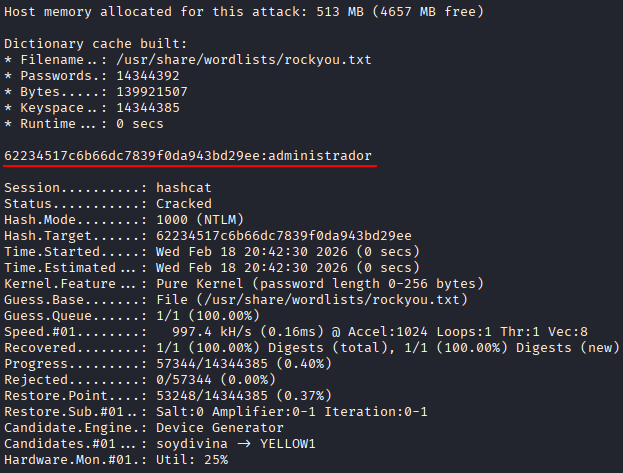
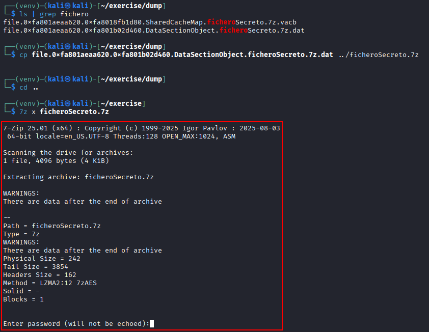
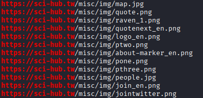
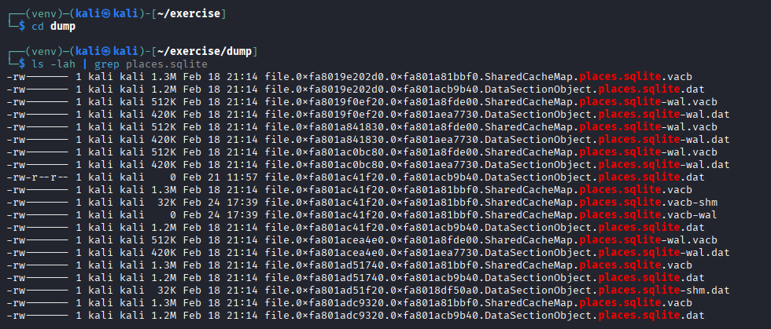
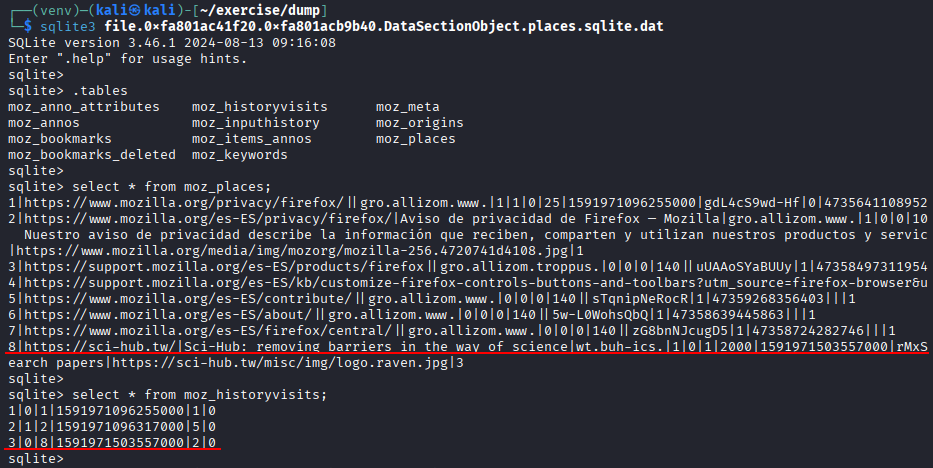
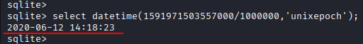
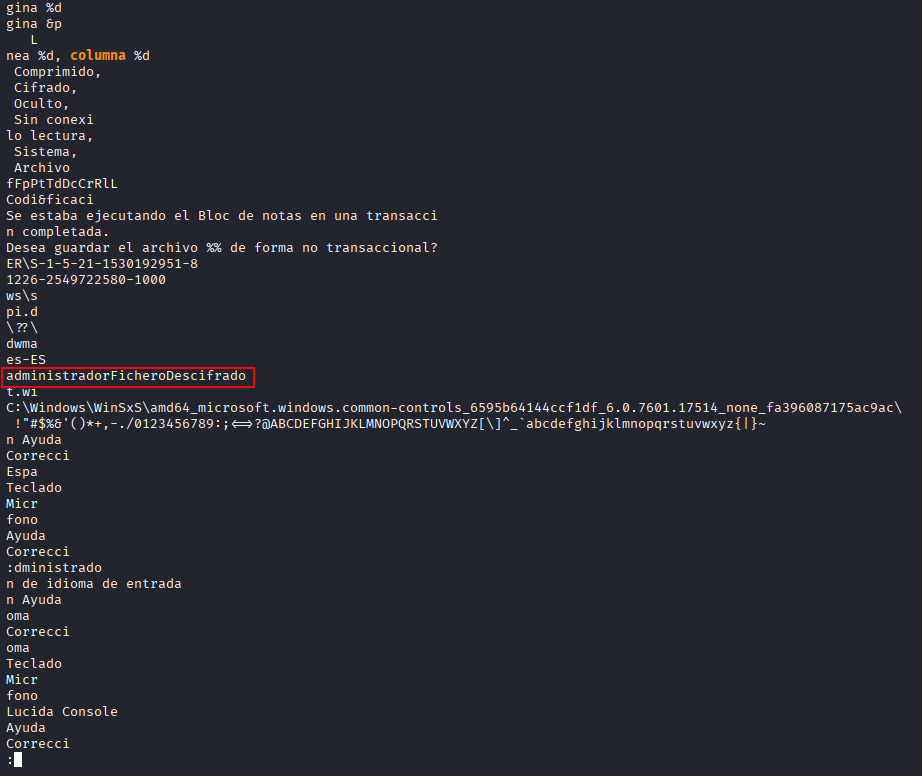
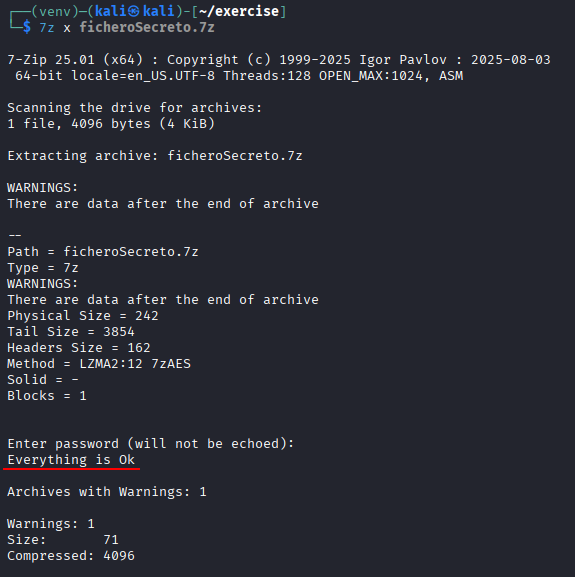
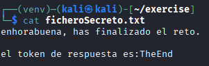

# Volatility advanced

In this practice, you will learn how to use the basic functionalities of Volatility to analyze memory dumps. Volatility is a powerful memory analysis tool that allows the identification of processes, network connections, Windows registry information, open files, and more. During this activity, you will work with a real [memory dump](https://drive.usercontent.google.com/download?id=1qfU9Ixqx1YqNgZFWOz548lbvK4A80md-&export=download&authuser=1) and will be required to use various plugins and command modifiers to solve the 16 questions posed.

The required steps are described below:

1. Determine the operating system profile corresponding to the memory dump.
2. Use the appropriate plugins to extract the requested information.
3. Apply command modifiers to filter and organize the results.

By the end of the practice, you should be able to identify active processes, registry keys, network connections, and other relevant artifacts.

---

## Requirements

1. Make sure you have Volatility 2.x or Volatility 3 installed.
2. Download the memory dump assigned for this practice.
3. Document the commands used to answer each of the questions.

Submit a detailed report containing the answers to the 16 questions, accompanied by screenshots of the commands executed and the results obtained.

---

## Questions

### **Operating System Profile**  

**Use the memory dump to identify the operating system profile compatible with this dump.**

```bash
vol -f dump.raw -r csv windows.info
```

|TreeDepth|Variable|Value        PDB scanning finished|
|---------|--------|----------------------------------|
|0        |Kernel Base|0xf80002a0d000                    |
|0        |DTB     |0x187000                          |
|0        |Symbols |file:///home/kali/tools/volatility3/volatility3/symbols/windows/ntkrnlmp.pdb/3844DBB920174967BE7AA4A2C20430FA-2.json.xz|
|0        |Is64Bit |True                              |
|0        |IsPAE   |False                             |
|0        |layer_name|0 WindowsIntel32e                 |
|0        |memory_layer|1 FileLayer                       |
|0        |KdDebuggerDataBlock|0xf80002bfe0a0                    |
|0        |NTBuildLab|7601.17514.amd64fre.win7sp1_rtm.  |
|0        |CSDVersion|1                                 |
|0        |KdVersionBlock|0xf80002bfe068                    |
|0        |Major/Minor|15.7601                           |
|0        |MachineType|34404                             |
|0        |KeNumberProcessors|8                                 |
|0        |SystemTime|2020-06-12 16:19:04+00:00         |
|0        |NtSystemRoot|C:\\Windows                       |
|0        |NtProductType|NtProductWinNt                    |
|0        |NtMajorVersion|6                                 |
|0        |NtMinorVersion|1                                 |
|0        |PE MajorOperatingSystemVersion|6                                 |
|0        |PE MinorOperatingSystemVersion|1                                 |
|0        |PE Machine|34404                             |
|0        |PE TimeDateStamp|Sat Nov 20 09:30:02 2010          |


### **Running Processes**  

**How many processes were active on the system at the time the memory capture was taken?**

```bash
vol -f dump.raw -r csv windows.pslist
```

|TreeDepth|PID |PPID|ImageFileName |Offset(V)     |Threads|Handles|SessionId|Wow64|CreateTime                    |ExitTime|File output|
|---------|----|----|--------------|--------------|-------|-------|---------|-----|------------------------------|--------|-----------|
|0        |4   |0   |System        |0xfa8018d469e0|115    |484    |N/A      |False|2020-06-12 16:15:10.000000 UTC|N/A     |Disabled   |
|0        |292 |4   |smss.exe      |0xfa8019e67530|2      |36     |N/A      |False|2020-06-12 16:15:10.000000 UTC|N/A     |Disabled   |
|0        |372 |352 |csrss.exe     |0xfa8019dd3060|10     |354    |0        |False|2020-06-12 16:15:11.000000 UTC|N/A     |Disabled   |
|0        |412 |352 |wininit.exe   |0xfa8018db4060|3      |83     |0        |False|2020-06-12 16:15:11.000000 UTC|N/A     |Disabled   |
|0        |432 |420 |csrss.exe     |0xfa8019e489e0|10     |492    |1        |False|2020-06-12 16:15:11.000000 UTC|N/A     |Disabled   |
|0        |468 |420 |winlogon.exe  |0xfa801a605910|6      |122    |1        |False|2020-06-12 16:15:12.000000 UTC|N/A     |Disabled   |
|0        |512 |412 |services.exe  |0xfa801a6f2060|8      |209    |0        |False|2020-06-12 16:15:12.000000 UTC|N/A     |Disabled   |
|0        |528 |412 |lsass.exe     |0xfa8019db3b30|9      |633    |0        |False|2020-06-12 16:15:12.000000 UTC|N/A     |Disabled   |
|0        |536 |412 |lsm.exe       |0xfa801a6feb30|10     |148    |0        |False|2020-06-12 16:15:12.000000 UTC|N/A     |Disabled   |
|0        |648 |512 |svchost.exe   |0xfa801a7c65f0|11     |379    |0        |False|2020-06-12 16:15:12.000000 UTC|N/A     |Disabled   |
|0        |728 |512 |svchost.exe   |0xfa801a7e1060|7      |286    |0        |False|2020-06-12 16:15:12.000000 UTC|N/A     |Disabled   |
|0        |804 |512 |svchost.exe   |0xfa801a820730|21     |489    |0        |False|2020-06-12 16:15:12.000000 UTC|N/A     |Disabled   |
|0        |852 |512 |svchost.exe   |0xfa801a850730|20     |420    |0        |False|2020-06-12 16:15:12.000000 UTC|N/A     |Disabled   |
|0        |888 |512 |svchost.exe   |0xfa801a863630|39     |980    |0        |False|2020-06-12 16:15:12.000000 UTC|N/A     |Disabled   |
|0        |968 |804 |audiodg.exe   |0xfa801a89b620|7      |135    |0        |False|2020-06-12 16:15:12.000000 UTC|N/A     |Disabled   |
|0        |148 |512 |svchost.exe   |0xfa801a8db5f0|11     |282    |0        |False|2020-06-12 16:15:12.000000 UTC|N/A     |Disabled   |
|0        |604 |512 |svchost.exe   |0xfa801a913b30|19     |505    |0        |False|2020-06-12 16:15:12.000000 UTC|N/A     |Disabled   |
|0        |1164|512 |spoolsv.exe   |0xfa801a9be780|13     |305    |0        |False|2020-06-12 16:15:12.000000 UTC|N/A     |Disabled   |
|0        |1200|512 |svchost.exe   |0xfa801a9e1060|19     |342    |0        |False|2020-06-12 16:15:12.000000 UTC|N/A     |Disabled   |
|0        |1872|852 |dwm.exe       |0xfa801abc0190|4      |79     |1        |False|2020-06-12 16:15:16.000000 UTC|N/A     |Disabled   |
|0        |1928|1864|explorer.exe  |0xfa801abd46b0|29     |839    |1        |False|2020-06-12 16:15:16.000000 UTC|N/A     |Disabled   |
|0        |1980|512 |taskhost.exe  |0xfa801abfcb30|10     |173    |1        |False|2020-06-12 16:15:16.000000 UTC|N/A     |Disabled   |
|0        |1036|512 |SearchIndexer.|0xfa801ac7a060|17     |703    |0        |False|2020-06-12 16:15:23.000000 UTC|N/A     |Disabled   |
|0        |1032|1928|iexplore.exe  |0xfa801aca3b30|15     |595    |1        |True |2020-06-12 16:15:29.000000 UTC|N/A     |Disabled   |
|0        |816 |1032|iexplore.exe  |0xfa801ad65b30|35     |642    |1        |True |2020-06-12 16:15:29.000000 UTC|N/A     |Disabled   |
|0        |2884|512 |svchost.exe   |0xfa8019e6b640|10     |91     |0        |False|2020-06-12 16:16:02.000000 UTC|N/A     |Disabled   |
|0        |3012|648 |WmiPrvSE.exe  |0xfa801a703b30|7      |174    |0        |False|2020-06-12 16:16:02.000000 UTC|N/A     |Disabled   |
|0        |3692|3684|firefox.exe   |0xfa801a80f060|82     |1056   |1        |True |2020-06-12 16:16:15.000000 UTC|N/A     |Disabled   |
|0        |3840|3692|firefox.exe   |0xfa801aef75c0|12     |253    |1        |True |2020-06-12 16:16:15.000000 UTC|N/A     |Disabled   |
|0        |3976|3692|firefox.exe   |0xfa801a612b30|37     |372    |1        |True |2020-06-12 16:16:15.000000 UTC|N/A     |Disabled   |
|0        |3312|3692|firefox.exe   |0xfa801afe1b30|33     |353    |1        |True |2020-06-12 16:16:16.000000 UTC|N/A     |Disabled   |
|0        |3084|3692|firefox.exe   |0xfa801a811520|39     |381    |1        |True |2020-06-12 16:16:16.000000 UTC|N/A     |Disabled   |
|0        |2784|3692|firefox.exe   |0xfa801af39b30|25     |307    |1        |True |2020-06-12 16:16:21.000000 UTC|N/A     |Disabled   |
|0        |3060|1928|notepad.exe   |0xfa801aa10270|2      |58     |1        |False|2020-06-12 16:16:34.000000 UTC|N/A     |Disabled   |
|0        |3000|512 |sppsvc.exe    |0xfa8019dc1b30|5      |164    |0        |False|2020-06-12 16:17:13.000000 UTC|N/A     |Disabled   |
|0        |3656|512 |svchost.exe   |0xfa801aff97d0|13     |351    |0        |False|2020-06-12 16:17:13.000000 UTC|N/A     |Disabled   |
|0        |868 |1184|7zFM.exe      |0xfa8018faf630|4      |149    |1        |False|2020-06-12 16:17:32.000000 UTC|N/A     |Disabled   |
|0        |2256|1036|SearchProtocol|0xfa8018f7e060|8      |287    |1        |False|2020-06-12 16:18:24.000000 UTC|N/A     |Disabled   |
|0        |2320|1036|SearchFilterHo|0xfa801ace08a0|6      |103    |0        |False|2020-06-12 16:18:24.000000 UTC|N/A     |Disabled   |
|0        |1960|1036|SearchProtocol|0xfa801a9d5b30|8      |284    |0        |False|2020-06-12 16:18:24.000000 UTC|N/A     |Disabled   |
|0        |1376|1928|MRCv120.exe   |0xfa8019011b30|16     |319    |1        |True |2020-06-12 16:18:50.000000 UTC|N/A     |Disabled   |
|0        |1184|888 |WMIADAP.exe   |0xfa8019096060|6      |98     |0        |False|2020-06-12 16:19:13.000000 UTC|N/A     |Disabled   |
|0        |1400|648 |WmiPrvSE.exe  |0xfa8019066060|8      |126    |0        |False|2020-06-12 16:19:13.000000 UTC|N/A     |Disabled   |

With the following command we can count directly the number of processes:

```bash
vol -f dump.raw -r csv windows.pslist | grep '^[0-9]' | wc -l
```

The result is `43`


### **Parent Process**  

**What is the PID of the parent process of the program `7zFM.exe`?**

In the previous exercise we can see the following line:

|TreeDepth|PID |PPID|ImageFileName |Offset(V)     |Threads|Handles|SessionId|Wow64|CreateTime                    |ExitTime|File output|
|---------|----|----|--------------|--------------|-------|-------|---------|-----|------------------------------|--------|-----------|
|...|...|...|...|...|...|...|...|...|...|...|...|
|0        |868 |1184|7zFM.exe      |0xfa8018faf630|4      |149    |1        |False|2020-06-12 16:17:32.000000 UTC|N/A     |Disabled   |
|...|...|...|...|...|...|...|...|...|...|...|...|

So the parent process is `1184`

### **Windows Registry**  

**Determine how many registry hives are present in the memory dump. This information is critical because there are suspicions that the system is infected.**

```bash
vol -f dump.raw -r csv windows.registry.hivelist
```

|TreeDepth|Offset|FileFullPath|File outputing finished|
|---------|------|------------|-----------------------|
|0        |0xf8a00000f010|            |Disabled               |
|0        |0xf8a000024010|\\REGISTRY\\MACHINE\\SYSTEM|Disabled               |
|0        |0xf8a000066010|\\REGISTRY\\MACHINE\\HARDWARE|Disabled               |
|0        |0xf8a000586010|\\Device\\HarddiskVolume1\\Boot\\BCD|Disabled               |
|0        |0xf8a0008fa010|\\SystemRoot\\System32\\Config\\SOFTWARE|Disabled               |
|0        |0xf8a000a1f170|\\SystemRoot\\System32\\Config\\DEFAULT|Disabled               |
|0        |0xf8a000bb8010|\\SystemRoot\\System32\\Config\\SECURITY|Disabled               |
|0        |0xf8a000c3b010|\\SystemRoot\\System32\\Config\\SAM|Disabled               |
|0        |0xf8a000d5c410|\\??\\C:\\Windows\\ServiceProfiles\\NetworkService\\NTUSER.DAT|Disabled               |
|0        |0xf8a000dec010|\\??\\C:\\Windows\\ServiceProfiles\\LocalService\\NTUSER.DAT|Disabled               |
|0        |0xf8a00101b010|\\??\\C:\\Users\\Admin\\ntuser.dat|Disabled               |
|0        |0xf8a00118d410|\\??\\C:\\Users\\Admin\\AppData\\Local\\Microsoft\\Windows\\UsrClass.dat|Disabled               |

With the following command we can count directly the number of hives:

```bash
vol -f dump.raw -r csv windows.registry.hivelist | grep '^[0-9]' | wc -l
```

The result is `12`

### **Registry Keys**  

**How many registry keys exist at the root of the `SYSTEM` hive, including volatile keys?**

```bash
vol -f dump.raw windows.registry.printkey --key "\\REGISTRY\\MACHINE\\SYSTEM"
```

| Last Write Time Hive Offset     Type    Key     Name    Data    Volatile                                          |                                                                                                             |
|-------------------------------------------------------------------------------------------------------------------|-------------------------------------------------------------------------------------------------------------|
|                                                                                                                   |                                                                                                             |
| -       0xf8a00000f010  Key     [NONAME]\\REGISTRY\MACHINE\SYSTEM       -       -       -                         |                                                                                                             |
| -       0xf8a000024010  Key     \REGISTRY\MACHINE\SYSTEM\\REGISTRY\MACHINE\SYSTEM       -       -       -         |                                                                                                             |
| -       0xf8a000066010  Key     \REGISTRY\MACHINE\HARDWARE\\REGISTRY\MACHINE\SYSTEM     -       -       -         |                                                                                                             |
| -       0xf8a000586010  Key     \Device\HarddiskVolume1\Boot\BCD\\REGISTRY\MACHINE\SYSTEM       -       -       - |                                                                                                             |
| -       0xf8a0008fa010  Key     \SystemRoot\System32\Config\SOFTWARE\\REGISTRY\MACHINE\SYSTEM   -       -       - |                                                                                                             |
| -       0xf8a000a1f170  Key     \SystemRoot\System32\Config\DEFAULT\\REGISTRY\MACHINE\SYSTEM    -       -       - |                                                                                                             |
| -       0xf8a000bb8010  Key     \SystemRoot\System32\Config\SECURITY\\REGISTRY\MACHINE\SYSTEM   -       -       - |                                                                                                             |
| -       0xf8a000c3b010  Key     \SystemRoot\System32\Config\SAM\\REGISTRY\MACHINE\SYSTEM        -       -       - |                                                                                                             |
| -       0xf8a000d5c410  Key     \??\C                                                                             | \Windows\ServiceProfiles\NetworkService\NTUSER.DAT\\REGISTRY\MACHINE\SYSTEM       -       -       -         |
| -       0xf8a000dec010  Key     \??\C                                                                             | \Windows\ServiceProfiles\LocalService\NTUSER.DAT\\REGISTRY\MACHINE\SYSTEM -       -       -                 |
| -       0xf8a00101b010  Key     \??\C                                                                             | \Users\Admin\ntuser.dat\\REGISTRY\MACHINE\SYSTEM  -       -       -                                         |
| -       0xf8a00118d410  Key     \??\C                                                                             | \Users\Admin\AppData\Local\Microsoft\Windows\UsrClass.dat\\REGISTRY\MACHINE\SYSTEM        -       -       - |

There are `12`:

### **ImagePath Key**  

**Identify the value of `ImagePath` in the following key: `ControlSet001\services\Smb`**

```bash
vol -f dump.raw -r csv windows.registry.printkey --key "ControlSet001\\Services\\Smb"
```

|TreeDepth|Last Write Time|Hive Offset|Type          |Key                                                                                                   |Name           |Data                                        |Volatile|
|---------|---------------|-----------|--------------|------------------------------------------------------------------------------------------------------|---------------|--------------------------------------------|--------|
|0        |-              |0xf8a00000f010|Key           |[NONAME]\\ControlSet001\\Services\\Smb                                                                |-              |-                                           |-       |
|0        |2020-06-12 14:08:13.000000 UTC|0xf8a000024010|Key           |\\REGISTRY\\MACHINE\\SYSTEM\\ControlSet001\\services\\Smb                                             |Linkage        |N/A                                         |False   |
|0        |2009-07-14 04:53:57.000000 UTC|0xf8a000024010|REG_DWORD     |\\REGISTRY\\MACHINE\\SYSTEM\\ControlSet001\\services\\Smb                                             |Type           |1                                           |False   |
|0        |2009-07-14 04:53:57.000000 UTC|0xf8a000024010|REG_DWORD     |\\REGISTRY\\MACHINE\\SYSTEM\\ControlSet001\\services\\Smb                                             |Start          |3                                           |False   |
|0        |2009-07-14 04:53:57.000000 UTC|0xf8a000024010|REG_DWORD     |\\REGISTRY\\MACHINE\\SYSTEM\\ControlSet001\\services\\Smb                                             |ErrorControl   |1                                           |False   |
|0        |2009-07-14 04:53:57.000000 UTC|0xf8a000024010|REG_DWORD     |\\REGISTRY\\MACHINE\\SYSTEM\\ControlSet001\\services\\Smb                                             |Tag            |8                                           |False   |
|0        |2009-07-14 04:53:57.000000 UTC|0xf8a000024010|REG_EXPAND_SZ |\\REGISTRY\\MACHINE\\SYSTEM\\ControlSet001\\services\\Smb                                             |ImagePath      |system32\\DRIVERS\\smb.sys                  |False   |
|0        |2009-07-14 04:53:57.000000 UTC|0xf8a000024010|REG_SZ        |\\REGISTRY\\MACHINE\\SYSTEM\\ControlSet001\\services\\Smb                                             |DisplayName    |@%SystemRoot%\\system32\\tcpipcfg.dll,-50005|False   |
|0        |2009-07-14 04:53:57.000000 UTC|0xf8a000024010|REG_SZ        |\\REGISTRY\\MACHINE\\SYSTEM\\ControlSet001\\services\\Smb                                             |Group          |PNP_TDI                                     |False   |
|0        |2009-07-14 04:53:57.000000 UTC|0xf8a000024010|REG_MULTI_SZ  |\\REGISTRY\\MACHINE\\SYSTEM\\ControlSet001\\services\\Smb                                             |DependOnService|Tcpip                                       |False   |
|0        |2009-07-14 04:53:57.000000 UTC|0xf8a000024010|REG_SZ        |\\REGISTRY\\MACHINE\\SYSTEM\\ControlSet001\\services\\Smb                                             |Description    |@%SystemRoot%\\system32\\tcpipcfg.dll,-50006|False   |
|0        |-              |0xf8a000066010|Key           |\\REGISTRY\\MACHINE\\HARDWARE\\ControlSet001\\Services\\Smb                                           |-              |-                                           |-       |
|0        |-              |0xf8a000586010|Key           |\\Device\\HarddiskVolume1\\Boot\\BCD\\ControlSet001\\Services\\Smb                                    |-              |-                                           |-       |
|0        |-              |0xf8a0008fa010|Key           |\\SystemRoot\\System32\\Config\\SOFTWARE\\ControlSet001\\Services\\Smb                                |-              |-                                           |-       |
|0        |-              |0xf8a000a1f170|Key           |\\SystemRoot\\System32\\Config\\DEFAULT\\ControlSet001\\Services\\Smb                                 |-              |-                                           |-       |
|0        |-              |0xf8a000bb8010|Key           |\\SystemRoot\\System32\\Config\\SECURITY\\ControlSet001\\Services\\Smb                                |-              |-                                           |-       |
|0        |-              |0xf8a000c3b010|Key           |\\SystemRoot\\System32\\Config\\SAM\\ControlSet001\\Services\\Smb                                     |-              |-                                           |-       |
|0        |-              |0xf8a000d5c410|Key           |\\??\\C:\\Windows\\ServiceProfiles\\NetworkService\\NTUSER.DAT\\ControlSet001\\Services\\Smb          |-              |-                                           |-       |
|0        |-              |0xf8a000dec010|Key           |\\??\\C:\\Windows\\ServiceProfiles\\LocalService\\NTUSER.DAT\\ControlSet001\\Services\\Smb            |-              |-                                           |-       |
|0        |-              |0xf8a00101b010|Key           |\\??\\C:\\Users\\Admin\\ntuser.dat\\ControlSet001\\Services\\Smb                                      |-              |-                                           |-       |
|0        |-              |0xf8a00118d410|Key           |\\??\\C:\\Users\\Admin\\AppData\\Local\\Microsoft\\Windows\\UsrClass.dat\\ControlSet001\\Services\\Smb|-              |-                                           |-       |

### **User Password**  

**Recover the login password of the user `Admin`.**

With the following command we can extract the password hashes of each user:

```bash
vol -f dump.raw -r csv windows.registry.hashdump
```

|TreeDepth|User|rid |lmhash                          |nthashPDB scanning finished     |
|---------|----|----|--------------------------------|--------------------------------|
|0        |Administrador|500 |aad3b435b51404eeaad3b435b51404ee|31d6cfe0d16ae931b73c59d7e0c089c0|
|0        |Invitado|501 |aad3b435b51404eeaad3b435b51404ee|31d6cfe0d16ae931b73c59d7e0c089c0|
|0        |Admin|1000|aad3b435b51404eeaad3b435b51404ee|62234517c6b66dc7839f0da943bd29ee|

Admin hashed password is `62234517c6b66dc7839f0da943bd29ee`. So we can try to crack it using hashcat as follows:

```bash
echo 62234517c6b66dc7839f0da943bd29ee > hash.txt
hashcat -m 1000 -a 0 hash.txt /usr/share/wordlists/rockyou.txt 
```

After cracking the password, the password for admin is `administrador`



### **External Connections**  

**Determine how many connections to external IP addresses were established at the time of the memory capture.**

```bash
vol -f dump.raw -r csv windows.netscan
```

|TreeDepth|Offset|Proto|LocalAddr                       |LocalPort                       |ForeignAddr   |ForeignPort|State      |PID |Owner       |Created                       |
|---------|------|-----|--------------------------------|--------------------------------|--------------|-----------|-----------|----|------------|------------------------------|
|0        |0x7dc00cf0|TCPv4|192.168.170.131                 |49167                           |157.157.19.106|80         |CLOSE_WAIT |816 |iexplore.exe|N/A                           |
|0        |0x7dc50170|TCPv4|192.168.170.131                 |49169                           |52.142.114.2  |80         |CLOSE_WAIT |816 |iexplore.exe|N/A                           |
|0        |0x7dc53890|TCPv4|192.168.170.131                 |49173                           |204.79.197.200|443        |CLOSE_WAIT |816 |iexplore.exe|N/A                           |
|0        |0x7dc5f010|TCPv4|192.168.170.131                 |49172                           |185.63.145.5  |80         |CLOSE_WAIT |816 |iexplore.exe|N/A                           |
|0        |0x7dc64010|TCPv4|192.168.170.131                 |49175                           |18.196.179.110|443        |CLOSE_WAIT |816 |iexplore.exe|N/A                           |
|0        |0x7dc6c450|TCPv4|127.0.0.1                       |58029                           |127.0.0.1     |58028      |ESTABLISHED|3084|firefox.exe |N/A                           |
|0        |0x7dc9f010|TCPv4|192.168.170.131                 |49188                           |40.77.226.250 |443        |CLOSE_WAIT |816 |iexplore.exe|N/A                           |
|0        |0x7dcaacf0|TCPv4|192.168.170.131                 |59656                           |54.192.86.81  |443        |ESTABLISHED|3692|firefox.exe |N/A                           |
|0        |0x7dcb4890|TCPv4|192.168.170.131                 |49202                           |40.77.226.250 |443        |CLOSE_WAIT |816 |iexplore.exe|N/A                           |
|0        |0x7dcc5550|TCPv4|127.0.0.1                       |58022                           |127.0.0.1     |58021      |ESTABLISHED|3312|firefox.exe |N/A                           |
|0        |0x7dccabe0|TCPv4|192.168.170.131                 |49184                           |152.199.22.24 |443        |CLOSE_WAIT |816 |iexplore.exe|N/A                           |
|0        |0x7dcd7010|TCPv4|192.168.170.131                 |49196                           |172.217.20.110|80         |CLOSE_WAIT |816 |iexplore.exe|N/A                           |
|0        |0x7dce1010|TCPv4|192.168.170.131                 |49191                           |40.77.226.250 |443        |CLOSE_WAIT |816 |iexplore.exe|N/A                           |
|0        |0x7dceb7a0|TCPv4|192.168.170.131                 |49206                           |40.77.226.250 |443        |CLOSE_WAIT |816 |iexplore.exe|N/A                           |
|0        |0x7dcf18e0|TCPv4|192.168.170.131                 |49205                           |52.142.114.2  |443        |CLOSE_WAIT |816 |iexplore.exe|N/A                           |
|0        |0x7dcfd3f0|TCPv4|192.168.170.131                 |49204                           |204.79.197.200|443        |CLOSE_WAIT |816 |iexplore.exe|N/A                           |
|0        |0x7dd17340|TCPv4|192.168.170.131                 |49198                           |204.79.197.200|443        |CLOSE_WAIT |816 |iexplore.exe|N/A                           |
|0        |0x7dd1da40|TCPv4|192.168.170.131                 |49197                           |104.81.141.250|443        |CLOSE_WAIT |816 |iexplore.exe|N/A                           |
|0        |0x7dd25010|TCPv4|192.168.170.131                 |49200                           |104.99.232.27 |443        |CLOSE_WAIT |816 |iexplore.exe|N/A                           |
|0        |0x7dd899c0|UDPv4|0.0.0.0                         |0                               |*             |0          |           |3692|firefox.exe |2020-06-12 16:16:17.000000 UTC|
|0        |0x7dd8f730|TCPv4|-                               |58024                           |13.227.209.7  |443        |CLOSED     |3692|firefox.exe |-                             |
|0        |0x7dddc270|TCPv4|127.0.0.1                       |58016                           |127.0.0.1     |58017      |ESTABLISHED|3976|firefox.exe |N/A                           |
|0        |0x7ddef670|TCPv4|127.0.0.1                       |58015                           |127.0.0.1     |58014      |ESTABLISHED|3692|firefox.exe |N/A                           |
|0        |0x7ddf2600|TCPv4|127.0.0.1                       |58039                           |127.0.0.1     |58040      |ESTABLISHED|2784|firefox.exe |N/A                           |
|0        |0x7de243c0|UDPv4|0.0.0.0                         |5355                            |*             |0          |           |604 |svchost.exe |2020-06-12 16:15:20.000000 UTC|
|0        |0x7de78190|TCPv4|192.168.170.131                 |139                             |0.0.0.0       |0          |LISTENING  |4   |System      |-                             |
|0        |0x7de80510|TCPv4|192.168.170.131                 |49159                           |204.79.197.200|80         |CLOSED     |1032|iexplore.exe|-                             |
|0        |0x7de85220|UDPv4|192.168.170.131                 |137                             |*             |0          |           |4   |System      |2020-06-12 16:15:17.000000 UTC|
|0        |0x7defd240|UDPv4|0.0.0.0                         |65116                           |*             |0          |           |604 |svchost.exe |2020-06-12 16:18:30.000000 UTC|
|0        |0x7df4ca50|TCPv4|127.0.0.1                       |58017                           |127.0.0.1     |58016      |ESTABLISHED|3976|firefox.exe |N/A                           |
|0        |0x7df62cf0|TCPv4|192.168.170.131                 |49158                           |204.79.197.203|80         |CLOSE_WAIT |816 |iexplore.exe|N/A                           |
|0        |0x7df6d600|UDPv4|127.0.0.1                       |60152                           |*             |0          |           |816 |iexplore.exe|2020-06-12 16:15:29.000000 UTC|
|0        |0x7dfa9010|TCPv4|192.168.170.131                 |49157                           |184.87.56.190 |80         |CLOSE_WAIT |816 |iexplore.exe|N/A                           |
|0        |0x7dfafcf0|UDPv4|127.0.0.1                       |60153                           |*             |0          |           |1032|iexplore.exe|2020-06-12 16:15:29.000000 UTC|
|0        |0x7dfb8010|TCPv4|192.168.170.131                 |49160                           |157.157.19.106|80         |CLOSE_WAIT |816 |iexplore.exe|N/A                           |
|0        |0x7dfd63b0|UDPv4|0.0.0.0                         |0                               |*             |0          |           |816 |iexplore.exe|2020-06-12 16:15:31.000000 UTC|
|0        |0x7dfd8010|TCPv4|192.168.170.131                 |49161                           |157.157.19.106|80         |CLOSE_WAIT |816 |iexplore.exe|N/A                           |
|0        |0x7dfda160|TCPv4|192.168.170.131                 |49166                           |192.229.221.24|80         |CLOSE_WAIT |816 |iexplore.exe|N/A                           |
|0        |0x7dfdc340|TCPv4|192.168.170.131                 |49162                           |157.157.19.106|80         |CLOSE_WAIT |816 |iexplore.exe|N/A                           |
|0        |0x7dfdd7f0|TCPv4|192.168.170.131                 |49163                           |157.157.19.106|80         |CLOSE_WAIT |816 |iexplore.exe|N/A                           |
|0        |0x7dfe2770|TCPv4|192.168.170.131                 |49164                           |157.157.19.106|80         |CLOSE_WAIT |816 |iexplore.exe|N/A                           |
|0        |0x7e05acf0|TCPv4|127.0.0.1                       |58040                           |127.0.0.1     |58039      |ESTABLISHED|2784|firefox.exe |N/A                           |
|0        |0x7e0dccf0|TCPv4|0.0.0.0                         |49156                           |0.0.0.0       |0          |LISTENING  |528 |lsass.exe   |-                             |
|0        |0x7e16c9e0|TCPv4|192.168.170.131                 |59658                           |54.192.86.49  |443        |ESTABLISHED|3692|firefox.exe |N/A                           |
|0        |0x7e194900|TCPv4|127.0.0.1                       |58028                           |127.0.0.1     |58029      |ESTABLISHED|3084|firefox.exe |N/A                           |
|0        |0x7e208640|TCPv4|0.0.0.0                         |49152                           |0.0.0.0       |0          |LISTENING  |412 |wininit.exe |-                             |
|0        |0x7e20bcf0|TCPv4|0.0.0.0                         |49152                           |0.0.0.0       |0          |LISTENING  |412 |wininit.exe |-                             |
|0        |0x7e20bcf0|TCPv6|::                              |49152                           |::            |0          |LISTENING  |412 |wininit.exe |-                             |
|0        |0x7e336520|TCPv4|192.168.170.131                 |59657                           |54.192.86.49  |443        |ESTABLISHED|3692|firefox.exe |N/A                           |
|0        |0x7e33f010|UDPv4|192.168.170.131                 |138                             |*             |0          |           |4   |System      |2020-06-12 16:15:17.000000 UTC|
|0        |0x7e36ad70|UDPv4|0.0.0.0                         |0                               |*             |0          |           |604 |svchost.exe |2020-06-12 16:15:17.000000 UTC|
|0        |0x7e36ad70|UDPv6|::                              |0                               |*             |0          |           |604 |svchost.exe |2020-06-12 16:15:17.000000 UTC|
|0        |0x7e390430|TCPv4|0.0.0.0                         |49154                           |0.0.0.0       |0          |LISTENING  |888 |svchost.exe |-                             |
|0        |0x7e394ef0|TCPv4|0.0.0.0                         |49154                           |0.0.0.0       |0          |LISTENING  |888 |svchost.exe |-                             |
|0        |0x7e394ef0|TCPv6|::                              |49154                           |::            |0          |LISTENING  |888 |svchost.exe |-                             |
|0        |0x7e396890|TCPv4|192.168.170.131                 |49168                           |157.157.19.106|80         |CLOSED     |1032|iexplore.exe|-                             |
|0        |0x7e3a46a0|TCPv4|0.0.0.0                         |49156                           |0.0.0.0       |0          |LISTENING  |528 |lsass.exe   |-                             |
|0        |0x7e3a46a0|TCPv6|::                              |49156                           |::            |0          |LISTENING  |528 |lsass.exe   |-                             |
|0        |0x7e4e4ef0|TCPv4|0.0.0.0                         |49153                           |0.0.0.0       |0          |LISTENING  |804 |svchost.exe |-                             |
|0        |0x7e4e4ef0|TCPv6|::                              |49153                           |::            |0          |LISTENING  |804 |svchost.exe |-                             |
|0        |0x7e4ebc40|TCPv4|0.0.0.0                         |49153                           |0.0.0.0       |0          |LISTENING  |804 |svchost.exe |-                             |
|0        |0x7e56b7f0|TCPv4|192.168.170.131                 |59655                           |54.192.86.49  |443        |ESTABLISHED|3692|firefox.exe |N/A                           |
|0        |0x7e56f530|TCPv4|127.0.0.1                       |58021                           |127.0.0.1     |58022      |ESTABLISHED|3312|firefox.exe |N/A                           |
|0        |0x7e5ceba0|TCPv4|192.168.170.131                 |59651                           |35.163.188.12 |443        |ESTABLISHED|3692|firefox.exe |N/A                           |
|0        |0x7e5f8660|TCPv4|0.0.0.0                         |135                             |0.0.0.0       |0          |LISTENING  |728 |svchost.exe |-                             |
|0        |0x7e5f8660|TCPv6|::                              |135                             |::            |0          |LISTENING  |728 |svchost.exe |-                             |
|0        |0x7e5fcef0|TCPv4|0.0.0.0                         |135                             |0.0.0.0       |0          |LISTENING  |728 |svchost.exe |-                             |
|0        |0x7ec22cf0|TCPv4|192.168.170.131                 |49218                           |216.58.208.100|443        |CLOSE_WAIT |816 |iexplore.exe|N/A                           |
|0        |0x7ec277c0|UDPv4|0.0.0.0                         |0                               |*             |0          |           |816 |iexplore.exe|2020-06-12 16:15:53.000000 UTC|
|0        |0x7ec277c0|UDPv6|::                              |0                               |*             |0          |           |816 |iexplore.exe|2020-06-12 16:15:53.000000 UTC|
|0        |0x7ed78830|TCPv4|0.0.0.0                         |49155                           |0.0.0.0       |0          |LISTENING  |512 |services.exe|-                             |
|0        |0x7ed78830|TCPv6|::                              |49155                           |::            |0          |LISTENING  |512 |services.exe|-                             |
|0        |0x7ed78ae0|TCPv4|0.0.0.0                         |49155                           |0.0.0.0       |0          |LISTENING  |512 |services.exe|-                             |
|0        |0x7ed79390|TCPv4|0.0.0.0                         |445                             |0.0.0.0       |0          |LISTENING  |4   |System      |-                             |
|0        |0x7ed79390|TCPv6|::                              |445                             |::            |0          |LISTENING  |4   |System      |-                             |
|0        |0x7efc1770|TCPv4|192.168.170.131                 |49216                           |40.77.226.250 |443        |CLOSE_WAIT |816 |iexplore.exe|N/A                           |
|0        |0x7f6f6cf0|TCPv4|192.168.170.131                 |49217                           |104.18.100.194|443        |CLOSE_WAIT |816 |iexplore.exe|N/A                           |
|0        |0x7fa41510|TCPv4|192.168.170.131                 |59662                           |54.192.86.50  |443        |ESTABLISHED|3692|firefox.exe |N/A                           |
|0        |0x7fa41a90|TCPv4|192.168.170.131                 |59661                           |54.192.86.49  |443        |ESTABLISHED|3692|firefox.exe |N/A                           |
|0        |0x7fa42cf0|TCPv4|192.168.170.131                 |59663                           |54.192.86.50  |443        |ESTABLISHED|3692|firefox.exe |N/A                           |
|0        |0x7fa43010|TCPv4|192.168.170.131                 |59664                           |54.192.86.50  |443        |ESTABLISHED|3692|firefox.exe |N/A                           |
|0        |0x7fa43420|TCPv4|192.168.170.131                 |59665                           |54.192.86.50  |443        |ESTABLISHED|3692|firefox.exe |N/A                           |
|0        |0x7fa43a90|TCPv4|192.168.170.131                 |59667                           |54.192.86.50  |443        |ESTABLISHED|3692|firefox.exe |N/A                           |
|0        |0x7fa448f0|TCPv4|192.168.170.131                 |59660                           |54.192.86.49  |443        |ESTABLISHED|3692|firefox.exe |N/A                           |
|0        |0x7fa45010|TCPv4|192.168.170.131                 |59659                           |54.192.86.49  |443        |ESTABLISHED|3692|firefox.exe |N/A                           |
|0        |0x7fa4b6d0|TCPv4|192.168.170.131                 |59666                           |54.192.86.50  |443        |ESTABLISHED|3692|firefox.exe |N/A                           |
|0        |0x7fa4d420|TCPv4|192.168.170.131                 |59668                           |54.192.86.50  |443        |ESTABLISHED|3692|firefox.exe |N/A                           |
|0        |0x7fa4e770|TCPv4|192.168.170.131                 |59669                           |54.192.86.50  |443        |ESTABLISHED|3692|firefox.exe |N/A                           |
|0        |0x7fe22ec0|UDPv4|0.0.0.0                         |5355                            |*             |0          |           |604 |svchost.exe |2020-06-12 16:15:20.000000 UTC|
|0        |0x7fe22ec0|UDPv6|::                              |5355                            |*             |0          |           |604 |svchost.exe |2020-06-12 16:15:20.000000 UTC|
|0        |0x7fe6d7c0|TCPv4|127.0.0.1                       |58014                           |127.0.0.1     |58015      |ESTABLISHED|3692|firefox.exe |N/A                           |


### **FILE_OBJECT Structures**  

**How many `FILE_OBJECT` structures appear in memory?**

```bash
vol -f dump.raw -r csv windows.filescan
```

|TreeDepth|Offset|Name           PDB scanning finished|
|---------|------|------------------------------------|
|0        |0x5dd82c0|\\Windows\\Fonts\\vgafix.fon        |
|0        |0x5dd8f20|\\Windows\\System32\\tsddd.dll      |
|0        |0x5ddff20|\\$Directory                        |
|0        |0x5df0630|\\Program Files (x86)\\Mozilla Firefox\\vcruntime140.dll|
|0        |0x5df0780|\\Program Files (x86)\\Mozilla Firefox\\mozglue.dll|
|0        |0x5df0b30|\\Users\\Admin\\AppData\\Roaming\\Mozilla\\Firefox\\Profiles\\c93p7zme.default-release\\storage.sqlite|
|0        |0x5df0c80|\\Program Files\\Common Files\\System\\wab32res.dll|
|0        |0x5df1240|\\Users\\Admin\\AppData\\Local\\Mozilla\\Firefox\\Profiles\\c93p7zme.default-release\\cache2\\entries\\89DBE1DF558BB8439E2062ECC3272086F2E3FF1F|
|0        |0x5df2200|\\Program Files (x86)\\Mozilla Firefox\\api-ms-win-crt-filesystem-l1-1-0.dll|
|0        |0x5df2660|\\Program Files (x86)\\Mozilla Firefox\\api-ms-win-crt-time-l1-1-0.dll|
|...|...|...|

```bash
 vol -f dump.raw -r csv windows.filescan | grep '^[0-9]' | wc -l
```
The result is `3414`

### **Compressed File**  

**One of the open files is compressed using 7z. What default name does Volatility assign to it when exporting it as a `.dat` file?**

Previouly we saw this table containing a .7z file:

|TreeDepth|Offset|Name           PDB scanning finished|
|---|---------|------------------------------------------------------------------------------------------------------|
|...|...|...|
|0  |0x7dcaa620|\\Users\\Admin\\Desktop\\ficheroSecreto.7z                                                            |
|...|...|...|

So we can try to recover it by dumping the ram content to a directory called `dump`:

```bash
mkdir dump
vol -f dump.raw  -o "dump" windows.dumpfile
```

Then, search for the extracted file and rename it with the original name. If we try to extract its content we can see that it is password protected.

```bash
ls | grep fichero
cp file.0xfa801aeaa620.0xfa801b02d460.DataSectionObject.ficheroSecreto.7z.dat ../ficheroSecreto.7z
cd ..
7z x ficheroSecreto.7z
```



### **File Path**  

**What is the on-disk path of the compressed 7z file, as shown by the `filescan` plugin?**

```bash
vol -f dump.raw -r csv windows.filescan | grep ficheroSecreto.7z
```

|TreeDepth|Offset|Name           PDB scanning finished|
|---------|------|------------------------------------|
|0        |0x7dcaa620|\\Users\\Admin\\Desktop\\ficheroSecreto.7z|
|0        |0x7e5df4d0|\\Users\\Admin\\Desktop\\ficheroSecreto.7z.tmp|


### **File Creation Date**  

**When was the compressed file created? Expected format: `DD/MM/YYYY`**

```bash
vol -f dump.raw -r csv windows.mftscan.MFTScan | grep ficheroSecreto.7z
```

|TreeDepth|Offset    |Record Type|Record Number|Link Count|MFT Type|Permissions|Attribute Type|Created                       |Modified                      |Updated                       |Accessed                      |Filename             |
|---------|----------|-----------|-------------|----------|--------|-----------|--------------|------------------------------|------------------------------|------------------------------|------------------------------|---------------------|
|1        |0x24202120|FILE       |22880        |2         |File    |Archive    |FILE_NAME     |2020-06-12 16:17:12.000000 UTC|2020-06-12 16:17:12.000000 UTC|2020-06-12 16:17:12.000000 UTC|2020-06-12 16:17:12.000000 UTC|ficheroSecreto.7z    |
|1        |0x6a9fce40|FILE       |22880        |2         |File    |Archive    |FILE_NAME     |2020-06-12 16:17:12.000000 UTC|2020-06-12 16:17:12.000000 UTC|2020-06-12 16:17:12.000000 UTC|2020-06-12 16:17:12.000000 UTC|ficheroSecreto.7z.tmp|

`It was created on 12 June 2020 at 16:17:12 (UTC).`

### **Visited Website**  

**Find the address of a science-related website visited using Firefox. Expected format: `https://xxxxxxx.xx`**

```bash
strings -a dump.raw | grep -E "https://[a-zA-Z0-9\-]{7}\.[a-z]{2}"
```



The page is `https://sci-hub.tw`

### **Date and Time of Visit**  
    When was the website mentioned in the previous question visited?  
    Expected format: `DD/MM/YYYY HH:MM:SS (UTC)`

Go to the directory dumped in exercise 10 and search for the places.sqlite file where firefox stores some cache information.

```bash
cd dump
ls -lah | grep places.sqlite
```



Open one big file and open moz_places and moz_historyvisits, trying to obtain the ID of the request (in this case 8) and the timestamp

```bash
sqlite3 file.0xfa801ac41f20.0xfa801acb9b40.DataSectionObject.places.sqlite.dat
.tables
select * from moz_places;
select * from moz_historyvisits;
```



Transform the date to a human redeable time format:

```bash
select datetime(1591971503557000/1000000,'unixepoch');
```



The date is `2020-06-12 at 14:18:23`

### **Notepad**  

**The Notepad application contained a password that we want to recover. Can you identify it? Hint: the user reuses part of their passwords.**

Previously we saw:

|TreeDepth|PID |PPID|ImageFileName |Offset(V)     |Threads|Handles|SessionId|Wow64|CreateTime                    |ExitTime|File output|
|---------|----|----|--------------|--------------|-------|-------|---------|-----|------------------------------|--------|-----------|
|...|...|...|...|...|...|...|...|...|...|...|...|
|0        |3060|1928|notepad.exe   |0xfa801aa10270|2      |58     |1        |False|2020-06-12 16:16:34.000000 UTC|N/A     |Disabled   |
|...|...|...|...|...|...|...|...|...|...|...|...|

As the PID is 3060, we can dump this process specifically:

```bash
vol -f dump.raw windows.memmap --pid 3060 --dump
```
And then, strings the file, searching for some useful information as "columna" as the user has the operating system in spanish:

```bash
strings -e l pid.3060.dmp | less 
```



The password could be `admnistradorFicheroDescifrado`

### **Encrypted File**  

**Analyze the contents of the compressed and encrypted 7z file. What does it contain?**

Extract the content of the zip using the password `admnistradorFicheroDescifrado`

```bash
7z x ficheroSecreto.7z
```



Open the file to show the flag

```bash
 cat ficheroSecreto.txt
```


